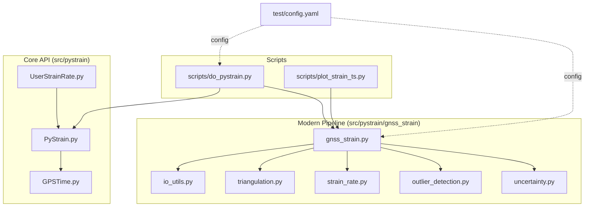
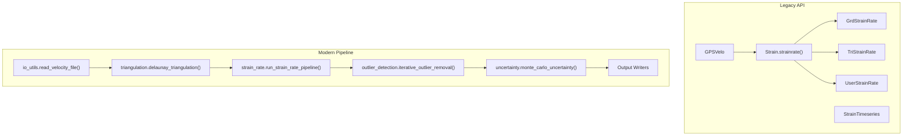
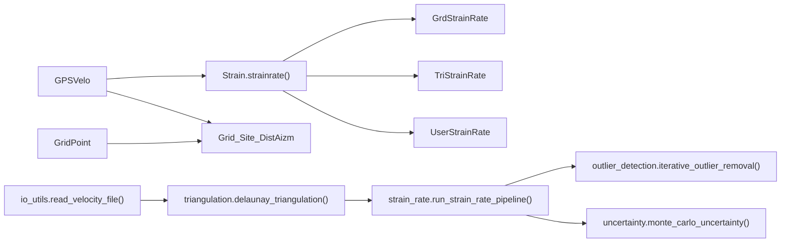

# API Reference

<cite>
**Referenced Files in This Document**
- [PyStrain.py](file://src/pystrain/PyStrain.py)
- [UserStrainRate.py](file://src/pystrain/UserStrainRate.py)
- [gnss_strain.py](file://src/pystrain/gnss_strain/gnss_strain.py)
- [io_utils.py](file://src/pystrain/gnss_strain/io_utils.py)
- [triangulation.py](file://src/pystrain/gnss_strain/triangulation.py)
- [strain_rate.py](file://src/pystrain/gnss_strain/strain_rate.py)
- [outlier_detection.py](file://src/pystrain/gnss_strain/outlier_detection.py)
- [uncertainty.py](file://src/pystrain/gnss_strain/uncertainty.py)
- [do_pystrain.py](file://src/pystrain/scripts/do_pystrain.py)
- [plot_strain_ts.py](file://src/pystrain/scripts/plot_strain_ts.py)
- [config.yaml](file://test/config.yaml)
- [GPSTime.py](file://src/pystrain/GPSTime.py)
</cite>

## Table of Contents
1. [Introduction](#introduction)
2. [Project Structure](#project-structure)
3. [Core Components](#core-components)
4. [Architecture Overview](#architecture-overview)
5. [Detailed Component Analysis](#detailed-component-analysis)
6. [Dependency Analysis](#dependency-analysis)
7. [Performance Considerations](#performance-considerations)
8. [Troubleshooting Guide](#troubleshooting-guide)
9. [Conclusion](#conclusion)
10. [Appendices](#appendices)

## Introduction
This API reference documents PyStrain’s Python modules with a focus on public interfaces, classes, and functions. It covers:
- PyStrain class methods for initialization, computation, and result access
- UserStrainRate interface for custom point analysis
- GPSVelo class for GPS velocity data processing
- GNSS strain pipeline modules for modern workflows
- Function signatures, parameter types, return values, and exception handling
- Examples of proper API usage, result interpretation, and integration into geodetic workflows

## Project Structure
The project is organized into:
- Core strain estimation classes under src/pystrain
- Modern GNSS strain pipeline under src/pystrain/gnss_strain
- Scripts for batch processing and plotting under src/pystrain/scripts
- Example configuration and test data under test/

**Diagram sources**
- [PyStrain.py:248-319](file://src/pystrain/PyStrain.py#L248-L319)
- [UserStrainRate.py:1-126](file://src/pystrain/UserStrainRate.py#L1-L126)
- [gnss_strain.py:1-407](file://src/pystrain/gnss_strain/gnss_strain.py#L1-L407)
- [io_utils.py:1-270](file://src/pystrain/gnss_strain/io_utils.py#L1-L270)
- [triangulation.py:1-477](file://src/pystrain/gnss_strain/triangulation.py#L1-L477)
- [strain_rate.py:1-438](file://src/pystrain/gnss_strain/strain_rate.py#L1-L438)
- [outlier_detection.py:1-292](file://src/pystrain/gnss_strain/outlier_detection.py#L1-L292)
- [uncertainty.py:1-150](file://src/pystrain/gnss_strain/uncertainty.py#L1-L150)
- [do_pystrain.py:1-39](file://src/pystrain/scripts/do_pystrain.py#L1-L39)
- [plot_strain_ts.py:1-143](file://src/pystrain/scripts/plot_strain_ts.py#L1-L143)
- [config.yaml:1-123](file://test/config.yaml#L1-L123)

**Section sources**
- [PyStrain.py:1-1481](file://src/pystrain/PyStrain.py#L1-L1481)
- [gnss_strain.py:1-407](file://src/pystrain/gnss_strain/gnss_strain.py#L1-L407)
- [do_pystrain.py:1-39](file://src/pystrain/scripts/do_pystrain.py#L1-L39)
- [config.yaml:1-123](file://test/config.yaml#L1-L123)

## Core Components
This section summarizes the primary public classes and functions exposed by PyStrain.

- GPSVelo
  - Purpose: Load GPS velocity data from GMT or GLOBK formats
  - Key attributes: SiteName, SiteNum, VeloData, VeloSigma
  - Methods: None (properties only)
  - Exceptions: Logs critical errors and exits if input file missing
  - Typical usage: Initialize with velocity file path and format; access ve/vn/se/sn via properties

- Strain
  - Purpose: Static strain rate computation routines
  - Method: strainrate(x, y, ve, vn, se, sn, gridweight=None)
    - Parameters: arrays/lists of numeric types; optional gridweight
    - Returns: tuple of strain-rate-derived quantities (dx, dy, exx, exy, eyy, w, E1, E2, gamma, delta, second_invariant, theta)
    - Notes: Uses weighted least-squares with distance-based weighting when gridweight provided

- GridPoint
  - Purpose: Generate regular longitude/latitude grid points
  - Constructor parameters: slon, elon, slat, elat, dn, de
  - Behavior: Creates meshgrid with offset pattern and stores llh

- Grid_Site_DistAizm
  - Purpose: Compute distance and azimuth between grid points and GPS sites
  - Constructor parameters: grd_llh, gps_llh
  - Attributes: dist (km), azim (degrees)
  - Notes: Uses pyproj.Geod on WGS84 ellipsoid

- StrainRate base class and subclasses
  - StrainRate(cfg): base class for strain estimators
  - GrdStrainRate(cfg): grid-based strain rate estimation
  - TriStrainRate(cfg): triangular mesh-based estimation
  - UserStrainRate(cfg): custom points estimation
  - Methods: StrainRateEst(), StrainRateUnSmooth(), StrainRateSmooth()

- GPSTimeSeries
  - Purpose: Load and align GPS time series (POS or DAT) over epochs
  - Constructor parameters: gpsinfo, tstype, tspath, sepoch, eepoch, sitelist=[]
  - Methods: _LoadGPSInfo(), _LoadGPSTimeseries(), _ResetGPSTimeseries(), _AlignGPSTimeseries()
  - Outputs: N, E, SN, SE arrays and metadata

- StrainTimeseries and derived classes
  - StrainTimeseries(cfg, sitelist=[]): base for time-series strain
  - GrdStrainTimeseries(cfg): grid-based time-series
  - TriStrainTimeseries(cfg): triangular mesh time-series
  - UserStrainTimeseries(cfg): user-defined site groups time-series
  - Methods: StrainTimeseriesEst(), StrainTimeseriesUnSmooth(), StrainTimeseriesSmooth()

- Modern GNSS pipeline modules
  - gnss_strain.run_full_pipeline(...): end-to-end pipeline with I/O, triangulation, outlier detection, strain computation, uncertainty, and plotting
  - io_utils.read_velocity_file(...): parse GMT/GLOBK/7-column formats
  - triangulation.delaunay_triangulation(...): quality-controlled triangulation
  - strain_rate.run_strain_rate_pipeline(...): compute strain tensors and smoothed fields
  - outlier_detection.iterative_outlier_removal(...): robust removal workflow
  - uncertainty.monte_carlo_uncertainty(...): propagate velocity uncertainties

**Section sources**
- [PyStrain.py:248-319](file://src/pystrain/PyStrain.py#L248-L319)
- [PyStrain.py:352-470](file://src/pystrain/PyStrain.py#L352-L470)
- [PyStrain.py:320-349](file://src/pystrain/PyStrain.py#L320-L349)
- [PyStrain.py:473-514](file://src/pystrain/PyStrain.py#L473-L514)
- [PyStrain.py:517-550](file://src/pystrain/PyStrain.py#L517-L550)
- [PyStrain.py:552-730](file://src/pystrain/PyStrain.py#L552-L730)
- [PyStrain.py:810-934](file://src/pystrain/PyStrain.py#L810-L934)
- [PyStrain.py:936-1165](file://src/pystrain/PyStrain.py#L936-L1165)
- [PyStrain.py:1166-1336](file://src/pystrain/PyStrain.py#L1166-L1336)
- [PyStrain.py:1339-1453](file://src/pystrain/PyStrain.py#L1339-L1453)
- [gnss_strain.py:52-341](file://src/pystrain/gnss_strain/gnss_strain.py#L52-L341)
- [io_utils.py:21-109](file://src/pystrain/gnss_strain/io_utils.py#L21-L109)
- [triangulation.py:89-146](file://src/pystrain/gnss_strain/triangulation.py#L89-L146)
- [strain_rate.py:384-437](file://src/pystrain/gnss_strain/strain_rate.py#L384-L437)
- [outlier_detection.py:184-291](file://src/pystrain/gnss_strain/outlier_detection.py#L184-L291)
- [uncertainty.py:14-149](file://src/pystrain/gnss_strain/uncertainty.py#L14-L149)

## Architecture Overview
The system supports two complementary workflows:
- Legacy PyStrain API: grid/triangular mesh and custom point estimators with distance-weighted inversion
- Modern GNSS pipeline: robust triangulation, outlier detection, uncertainty propagation, and visualization

**Diagram sources**
- [PyStrain.py:248-319](file://src/pystrain/PyStrain.py#L248-L319)
- [PyStrain.py:352-470](file://src/pystrain/PyStrain.py#L352-L470)
- [PyStrain.py:552-730](file://src/pystrain/PyStrain.py#L552-L730)
- [gnss_strain.py:52-341](file://src/pystrain/gnss_strain/gnss_strain.py#L52-L341)
- [io_utils.py:21-109](file://src/pystrain/gnss_strain/io_utils.py#L21-L109)
- [triangulation.py:89-146](file://src/pystrain/gnss_strain/triangulation.py#L89-L146)
- [strain_rate.py:384-437](file://src/pystrain/gnss_strain/strain_rate.py#L384-L437)
- [outlier_detection.py:184-291](file://src/pystrain/gnss_strain/outlier_detection.py#L184-L291)
- [uncertainty.py:14-149](file://src/pystrain/gnss_strain/uncertainty.py#L14-L149)

## Detailed Component Analysis

### GPSVelo Class
Purpose: Load GPS velocity fields from GMT or GLOBK formats and expose velocity vectors and uncertainties.

Public interface:
- Constructor: GPSVelo(velofile, velotype)
  - Parameters:
    - velofile: str, path to velocity file
    - velotype: str, 'GMT' or 'GLOBK'
  - Behavior: Validates file existence; parses columns; sets llh, ve, vn, se, sn, optional sitename
  - Exceptions: Logs critical error and exits if file not found
- Properties:
  - SiteName: optional array of station names
  - SiteNum: int count of sites
  - VeloData: tuple (ve, vn)
  - VeloSigma: tuple (se, sn)

Usage example:
- Initialize GPSVelo with a GMT-formatted file and access ve/vn/se/sn via properties.

Result interpretation:
- Velocity components are in mm/yr; uncertainties are in mm/yr.

**Section sources**
- [PyStrain.py:248-319](file://src/pystrain/PyStrain.py#L248-L319)

### Strain Class
Purpose: Provide static strain rate computation using a distance-weighted least-squares inversion.

Public interface:
- Method: strainrate(x, y, ve, vn, se, sn, gridweight=None)
  - Parameters:
    - x, y: east/north distances in km from reference point to GPS sites
    - ve, vn: velocities in mm/yr
    - se, sn: velocity uncertainties in mm/yr
    - gridweight: optional float for distance-based weighting
  - Returns:
    - dx, dy: mean velocities
    - exx, exy, eyy: strain rate tensor components (10^-9 /yr)
    - w: rotation rate (10^-9 /yr)
    - E1, E2: principal strain rates (10^-9 /yr)
    - gamma: maximum shear strain rate (10^-9 /yr)
    - delta: dilatation strain rate (10^-9 /yr)
    - second_invariant: second invariant of strain rate
    - theta: orientation of E1 (degrees)
  - Notes: Weighted inversion with exponential weighting when gridweight provided

Usage example:
- Compute strain at a grid point by transforming GPS site coordinates to local east/north and calling strainrate.

Result interpretation:
- Units are nstrain/yr (10^-9 /yr); positive E1 indicates extension; negative E2 indicates compression.

**Section sources**
- [PyStrain.py:352-470](file://src/pystrain/PyStrain.py#L352-L470)

### GridPoint Class
Purpose: Generate a regular grid of longitude/latitude points for strain estimation.

Public interface:
- Constructor: GridPoint(slon, elon, slat, elat, dn, de)
  - Parameters:
    - slon, elon: longitude bounds
    - slat, elat: latitude bounds
    - dn, de: grid spacing
  - Behavior: Creates meshgrid, applies offset pattern, stores llh

Usage example:
- Instantiate GridPoint with bounding box and spacing; use llh for strain estimation.

**Section sources**
- [PyStrain.py:320-349](file://src/pystrain/PyStrain.py#L320-L349)

### Grid_Site_DistAizm Class
Purpose: Compute distances and azimuths between grid points and GPS sites using pyproj.

Public interface:
- Constructor: Grid_Site_DistAizm(grd_llh, gps_llh)
  - Parameters:
    - grd_llh: (N,2) array of grid lon/lat
    - gps_llh: (M,2) array of GPS lon/lat
  - Attributes:
    - dist: (N,M) km
    - azim: (N,M) degrees
  - Behavior: Uses pyproj.Geod WGS84 ellipsoid

Usage example:
- Pass grid llh and GPS llh to compute dist/azim matrices.

**Section sources**
- [PyStrain.py:473-514](file://src/pystrain/PyStrain.py#L473-L514)

### StrainRate Family
Purpose: Base and derived classes for strain estimation across grid, triangular mesh, and custom points.

Public interface:
- StrainRate(cfg): base class storing configuration
- GrdStrainRate(cfg): grid-based estimation
  - Methods: StrainRateEst(), StrainRateUnSmooth(gridweight=300), StrainRateSmooth()
- TriStrainRate(cfg): triangular mesh estimation
  - Methods: StrainRateEst(), StrainRateUnSmooth(), StrainRateSmooth()
- UserStrainRate(cfg): custom points estimation
  - Methods: StrainRateEst(), StrainRateUnSmooth(), StrainRateSmooth()

Usage example:
- Initialize GrdStrainRate with a config; call StrainRateEst() to process all grid points.

Result interpretation:
- Outputs are written to files with columns including lon, lat, ve, vn, and strain-rate-derived quantities.

**Section sources**
- [PyStrain.py:517-550](file://src/pystrain/PyStrain.py#L517-L550)
- [PyStrain.py:552-730](file://src/pystrain/PyStrain.py#L552-L730)
- [PyStrain.py:810-934](file://src/pystrain/PyStrain.py#L810-L934)

### UserStrainRate Class
Purpose: Perform strain rate estimation at user-specified points.

Public interface:
- Constructor: UserStrainRate(cfg)
  - Parameters: cfg (Config instance)
  - Behavior: Loads user point file (lon, lat, site); stores pnts and sites
- Methods:
  - StrainRateEst(): dispatches to UnSmooth or Smooth
  - StrainRateUnSmooth(): computes strain at each user point using local xy
  - StrainRateSmooth(): placeholder

Usage example:
- Prepare a user point file with lon/lat/site; initialize UserStrainRate; call StrainRateEst().

Result interpretation:
- Writes strain output file and modeled velocity file for selected sites.

**Section sources**
- [UserStrainRate.py:1-126](file://src/pystrain/UserStrainRate.py#L1-L126)
- [PyStrain.py:810-934](file://src/pystrain/PyStrain.py#L810-L934)

### GPSTimeSeries Class
Purpose: Load and align GPS time series (POS or DAT) over a specified epoch interval.

Public interface:
- Constructor: GPSTimeSeries(gpsinfo, tstype, tspath, sepoch, eepoch, sitelist=[])
  - Parameters:
    - gpsinfo: path to site info file (lon, lat, hei, site)
    - tstype: 'pos' or 'dat'
    - tspath: path to time series files
    - sepoch, eepoch: start/end epochs in decimal year
    - sitelist: optional subset of sites
  - Methods:
    - _LoadGPSInfo(): reads gpsinfo and filters by sitelist
    - _LoadGPSTimeseries(): loads POS/DAT files and aligns epochs
    - _ResetGPSTimeseries(): resets series relative to reference epoch
    - _AlignGPSTimeseries(): aligns series to common epoch
  - Outputs: N, E, SN, SE arrays and metadata

Usage example:
- Initialize with gpsinfo and time range; call alignment methods to produce aligned time series.

Result interpretation:
- Arrays N/E represent displacements relative to reference epoch; SN/SE are uncertainties.

**Section sources**
- [PyStrain.py:936-1165](file://src/pystrain/PyStrain.py#L936-L1165)

### StrainTimeseries Family
Purpose: Time-series strain estimation across grid, triangular mesh, and user-defined site groups.

Public interface:
- StrainTimeseries(cfg, sitelist=[]): base class storing GPS data and configuration
- GrdStrainTimeseries(cfg): grid-based time-series
  - Methods: StrainTimeseriesEst(), StrainTimeseriesUnSmooth(grdweight=300), StrainTimeseriesSmooth()
- TriStrainTimeseries(cfg): triangular mesh time-series
  - Methods: StrainTimeseriesEst(), StrainTimeseriesUnSmooth(), StrainTimeseriesSmooth()
- UserStrainTimeseries(cfg): user-defined site groups
  - Methods: StrainTimeseriesEst(): computes strain for each group over time

Usage example:
- Initialize with config; call StrainTimeseriesEst() to process all epochs.

Result interpretation:
- Outputs per-grid or per-triangle or per-site-group time series of strain-rate-derived quantities.

**Section sources**
- [PyStrain.py:1166-1336](file://src/pystrain/PyStrain.py#L1166-L1336)
- [PyStrain.py:1339-1453](file://src/pystrain/PyStrain.py#L1339-L1453)

### Modern GNSS Pipeline
Purpose: Robust end-to-end strain estimation from GNSS velocities with outlier detection and uncertainty propagation.

Public interface:
- gnss_strain.run_full_pipeline(...)
  - Parameters: vel_file, poly_file, output_dir, vel_format, min_spacing_km, max_edge_km, smooth_weight, smooth_iter, min_angle_deg, max_edge_pctl, max_edge_factor, mc_iterations, k_neighbors, mad_factor, iqr_factor, max_outlier_iter, stage_callback
  - Returns: result dict, uncertainty dict, outlier history list
  - Behavior: Reads velocities, KNN prescreening, Delaunay triangulation, iterative outlier removal, strain computation, uncertainty propagation, writing outputs and figures
- io_utils.read_velocity_file(filepath, format='auto'): parse GMT/GLOBK/7-column formats
- triangulation.delaunay_triangulation(...): quality-controlled triangulation with polygon masking and edge/angle/area filters
- strain_rate.run_strain_rate_pipeline(...): compute strain tensors and smoothed fields
- outlier_detection.iterative_outlier_removal(...): robust removal workflow
- uncertainty.monte_carlo_uncertainty(...): propagate velocity uncertainties

Usage example:
- Call run_full_pipeline with a velocity file and optional polygon; inspect returned dicts for strain fields and uncertainties.

Result interpretation:
- Output files include strain per triangle, outlier reports, and diagnostic figures.

**Section sources**
- [gnss_strain.py:52-341](file://src/pystrain/gnss_strain/gnss_strain.py#L52-L341)
- [io_utils.py:21-109](file://src/pystrain/gnss_strain/io_utils.py#L21-L109)
- [triangulation.py:89-146](file://src/pystrain/gnss_strain/triangulation.py#L89-L146)
- [strain_rate.py:384-437](file://src/pystrain/gnss_strain/strain_rate.py#L384-L437)
- [outlier_detection.py:184-291](file://src/pystrain/gnss_strain/outlier_detection.py#L184-L291)
- [uncertainty.py:14-149](file://src/pystrain/gnss_strain/uncertainty.py#L14-L149)

## Dependency Analysis
Key dependencies and relationships:
- GPSVelo depends on numpy and file parsing; exposes velocity arrays and uncertainties
- Strain.strainrate() performs matrix-weighted inversion using numpy
- Grid_Site_DistAizm depends on pyproj for geodesic computations
- StrainRate family depends on GPSVelo and Grid_Site_DistAizm
- Modern pipeline modules depend on each other in a staged workflow
- Scripts depend on core classes and pipeline functions

**Diagram sources**
- [PyStrain.py:248-319](file://src/pystrain/PyStrain.py#L248-L319)
- [PyStrain.py:352-470](file://src/pystrain/PyStrain.py#L352-L470)
- [PyStrain.py:473-514](file://src/pystrain/PyStrain.py#L473-L514)
- [gnss_strain.py:52-341](file://src/pystrain/gnss_strain/gnss_strain.py#L52-L341)
- [io_utils.py:21-109](file://src/pystrain/gnss_strain/io_utils.py#L21-L109)
- [triangulation.py:89-146](file://src/pystrain/gnss_strain/triangulation.py#L89-L146)
- [strain_rate.py:384-437](file://src/pystrain/gnss_strain/strain_rate.py#L384-L437)
- [outlier_detection.py:184-291](file://src/pystrain/gnss_strain/outlier_detection.py#L184-L291)
- [uncertainty.py:14-149](file://src/pystrain/gnss_strain/uncertainty.py#L14-L149)

**Section sources**
- [PyStrain.py:248-319](file://src/pystrain/PyStrain.py#L248-L319)
- [PyStrain.py:352-470](file://src/pystrain/PyStrain.py#L352-L470)
- [PyStrain.py:473-514](file://src/pystrain/PyStrain.py#L473-L514)
- [gnss_strain.py:52-341](file://src/pystrain/gnss_strain/gnss_strain.py#L52-L341)

## Performance Considerations
- Distance-weighted inversion scales with number of GPS sites per reference point; tune gridweight and minsite to balance accuracy and speed
- Triangulation quality filters reduce invalid triangles; adjust min_angle_deg, max_edge_pctl, max_edge_factor for regional constraints
- Monte Carlo uncertainty requires significant iterations; consider n_iterations trade-offs
- Time-series processing iterates over epochs and grid/triangles; cache intermediate results when feasible

[No sources needed since this section provides general guidance]

## Troubleshooting Guide
Common issues and resolutions:
- Missing input files
  - GPSVelo logs critical error and exits if velocity file not found
  - GridPoint and UserStrainRate log warnings if point files are missing
- Insufficient GPS coverage
  - Estimators warn when fewer than minsite stations are found within maxdist
  - Triangular mesh requires at least 3 valid triangles; otherwise raises runtime error
- Poor station distribution
  - chkazim flag checks azimuthal distribution; warnings indicate uneven sampling
- Time-series alignment
  - GPSTimeSeries uses RANSAC regression to estimate velocities; ensure sufficient data within epoch windows

**Section sources**
- [PyStrain.py:261-263](file://src/pystrain/PyStrain.py#L261-L263)
- [PyStrain.py:606-607](file://src/pystrain/PyStrain.py#L606-L607)
- [PyStrain.py:703-704](file://src/pystrain/PyStrain.py#L703-L704)
- [PyStrain.py:415-416](file://src/pystrain/PyStrain.py#L415-L416)
- [PyStrain.py:1001-1003](file://src/pystrain/PyStrain.py#L1001-L1003)

## Conclusion
PyStrain offers both legacy and modern APIs for GPS-based strain estimation. The legacy API provides straightforward grid/triangular/custom estimators, while the modern pipeline emphasizes robustness, uncertainty quantification, and visualization. Choose the appropriate workflow based on data formats and analysis needs.

[No sources needed since this section summarizes without analyzing specific files]

## Appendices

### API Usage Examples
- Legacy API
  - Initialize GPSVelo with a velocity file and format; compute strain at a grid point using Grid_Site_DistAizm and Strain.strainrate(); write results to file
  - Example invocation paths:
    - [PyStrain.py:248-319](file://src/pystrain/PyStrain.py#L248-L319)
    - [PyStrain.py:352-470](file://src/pystrain/PyStrain.py#L352-L470)
    - [PyStrain.py:552-659](file://src/pystrain/PyStrain.py#L552-L659)
- Modern Pipeline
  - Call gnss_strain.run_full_pipeline(...) with a velocity file; inspect returned dicts for strain fields and uncertainties
  - Example invocation paths:
    - [gnss_strain.py:52-341](file://src/pystrain/gnss_strain/gnss_strain.py#L52-L341)
    - [io_utils.py:21-109](file://src/pystrain/gnss_strain/io_utils.py#L21-L109)
    - [triangulation.py:89-146](file://src/pystrain/gnss_strain/triangulation.py#L89-L146)
    - [strain_rate.py:384-437](file://src/pystrain/gnss_strain/strain_rate.py#L384-L437)
    - [outlier_detection.py:184-291](file://src/pystrain/gnss_strain/outlier_detection.py#L184-L291)
    - [uncertainty.py:14-149](file://src/pystrain/gnss_strain/uncertainty.py#L14-L149)

### Configuration and Integration
- Configuration file structure and parameters:
  - [config.yaml:1-123](file://test/config.yaml#L1-L123)
- Batch processing entry points:
  - [do_pystrain.py:1-39](file://src/pystrain/scripts/do_pystrain.py#L1-L39)
- Plotting time-series outputs:
  - [plot_strain_ts.py:1-143](file://src/pystrain/scripts/plot_strain_ts.py#L1-L143)

**Section sources**
- [config.yaml:1-123](file://test/config.yaml#L1-L123)
- [do_pystrain.py:1-39](file://src/pystrain/scripts/do_pystrain.py#L1-L39)
- [plot_strain_ts.py:1-143](file://src/pystrain/scripts/plot_strain_ts.py#L1-L143)