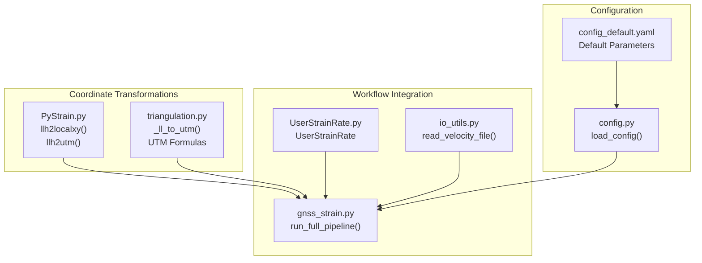
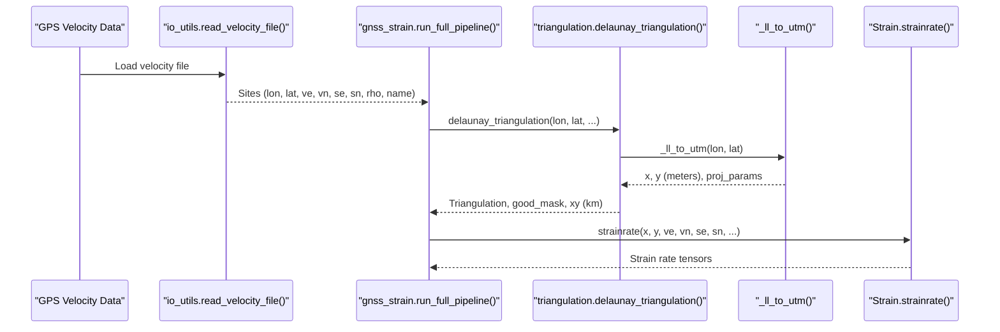
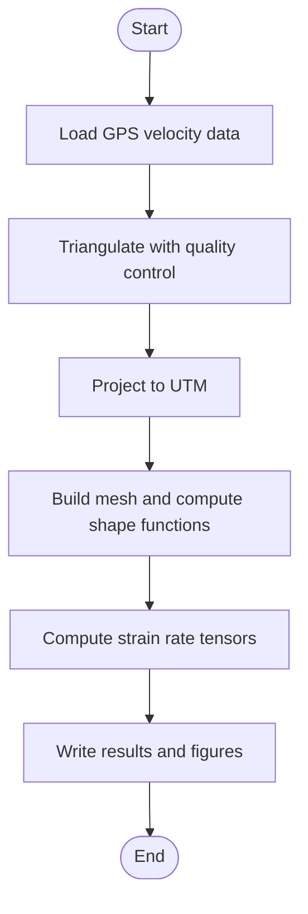
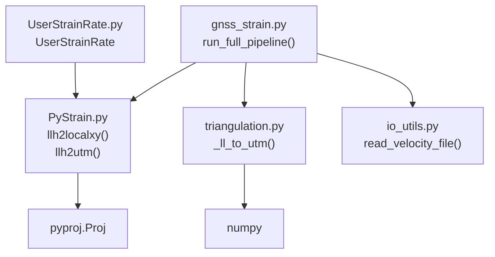

# Coordinate Transformation Functions

<cite>
**Referenced Files in This Document**
- [PyStrain.py](file://src/pystrain/PyStrain.py)
- [triangulation.py](file://src/pystrain/gnss_strain/triangulation.py)
- [gnss_strain.py](file://src/pystrain/gnss_strain/gnss_strain.py)
- [UserStrainRate.py](file://src/pystrain/UserStrainRate.py)
- [io_utils.py](file://src/pystrain/gnss_strain/io_utils.py)
- [config_default.yaml](file://src/pystrain/gnss_strain/config_default.yaml)
- [config.py](file://src/pystrain/gnss_strain/config.py)
</cite>

## Table of Contents
1. [Introduction](#introduction)
2. [Project Structure](#project-structure)
3. [Core Components](#core-components)
4. [Architecture Overview](#architecture-overview)
5. [Detailed Component Analysis](#detailed-component-analysis)
6. [Dependency Analysis](#dependency-analysis)
7. [Performance Considerations](#performance-considerations)
8. [Troubleshooting Guide](#troubleshooting-guide)
9. [Conclusion](#conclusion)

## Introduction
This document provides comprehensive API documentation for coordinate transformation utilities focused on GPS data processing and spatial analysis. It covers the `llh2localxy` and `llh2utm` conversion functions, detailing input parameter specifications, coordinate system transformations, and output formats. It explains the mathematical foundations, projection parameters, and coordinate system definitions, and demonstrates the relationship between geographic coordinates (latitude/longitude/height) and projected coordinate systems (UTM, local Cartesian). The document includes practical examples, accuracy considerations, numerical precision, ellipsoid parameters, projection limitations, and integration with GPS velocity data processing and strain rate computation workflows.

## Project Structure
The coordinate transformation utilities are implemented across several modules:
- `PyStrain.py`: Contains the `llh2localxy` and `llh2utm` functions and supporting mathematical routines.
- `gnss_strain/triangulation.py`: Implements UTM projection formulas and integrates coordinate transformations into the triangulation pipeline.
- `gnss_strain/gnss_strain.py`: Orchestrates the full GNSS velocity-to-strain-rate workflow, including coordinate transformations.
- `UserStrainRate.py`: Demonstrates usage of `llh2localxy` for user-defined points.
- `gnss_strain/io_utils.py`: Provides I/O utilities for GPS velocity data.
- Configuration files define workflow parameters and constraints.

**Diagram sources**
- [PyStrain.py:52-95](file://src/pystrain/PyStrain.py#L52-L95)
- [triangulation.py:22-77](file://src/pystrain/gnss_strain/triangulation.py#L22-L77)
- [gnss_strain.py:52-341](file://src/pystrain/gnss_strain/gnss_strain.py#L52-L341)
- [UserStrainRate.py:1-126](file://src/pystrain/UserStrainRate.py#L1-L126)
- [io_utils.py:21-132](file://src/pystrain/gnss_strain/io_utils.py#L21-L132)
- [config.py:56-90](file://src/pystrain/gnss_strain/config.py#L56-L90)
- [config_default.yaml:1-69](file://src/pystrain/gnss_strain/config_default.yaml#L1-L69)

**Section sources**
- [PyStrain.py:52-95](file://src/pystrain/PyStrain.py#L52-L95)
- [triangulation.py:22-77](file://src/pystrain/gnss_strain/triangulation.py#L22-L77)
- [gnss_strain.py:52-341](file://src/pystrain/gnss_strain/gnss_strain.py#L52-L341)
- [UserStrainRate.py:1-126](file://src/pystrain/UserStrainRate.py#L1-L126)
- [io_utils.py:21-132](file://src/pystrain/gnss_strain/io_utils.py#L21-L132)
- [config.py:56-90](file://src/pystrain/gnss_strain/config.py#L56-L90)
- [config_default.yaml:1-69](file://src/pystrain/gnss_strain/config_default.yaml#L1-L69)

## Core Components
This section documents the primary coordinate transformation functions and their roles in GPS data processing.

### llh2localxy Function
Converts geographic coordinates (longitude, latitude) to a local Cartesian coordinate system centered at a reference point. The function uses a polyconic projection approximation suitable for small regions.

Input parameters:
- `llh`: Array-like containing [longitude, latitude] in degrees.
- `ll_org`: Reference point [longitude, latitude] in degrees.

Output:
- Array-like `[x, y]` in kilometers, where:
  - `x` represents eastward distance (negative sign convention).
  - `y` represents northward distance.

Mathematical foundation:
- The function internally converts degrees to arcseconds and applies a polyconic projection formulation with predefined constants for Earth ellipsoid parameters.
- The resulting meters are converted to kilometers for consistency with downstream strain rate computations.

Units and scaling:
- Input coordinates: degrees.
- Output coordinates: kilometers.
- Scaling factor: 1/1000 applied to both axes.

Accuracy and limitations:
- Suitable for small regional scales where the curvature of the Earth can be approximated locally.
- Accuracy depends on the chosen reference point and the size of the region.

Integration:
- Used in `UserStrainRate` for computing strain rates at user-specified points.

**Section sources**
- [PyStrain.py:52-75](file://src/pystrain/PyStrain.py#L52-L75)
- [UserStrainRate.py:103-104](file://src/pystrain/UserStrainRate.py#L103-L104)

### llh2utm Function
Converts geographic coordinates to Universal Transverse Mercator (UTM) coordinates relative to a reference point. The function uses the `pyproj.Proj` interface with WGS84 ellipsoid and transverse Mercator projection.

Input parameters:
- `llh`: Array-like containing [longitude, latitude] in degrees.
- `llh_org`: Reference point [longitude, latitude] in degrees.

Output:
- List `[e_loc, n_loc]` in kilometers, where:
  - `e_loc` is the easting difference relative to the reference point.
  - `n_loc` is the northing difference relative to the reference point.

Mathematical foundation:
- Uses `pyproj.Proj` with parameters:
  - Ellipsoid: WGS84.
  - Projection: transverse Mercator (`tmerc`).
  - Central meridian: longitude of the reference point (`lon_0 = llh_org[0]`).
- Computes easting/northing for both target and reference points, then calculates differences and converts meters to kilometers.

Units and scaling:
- Input coordinates: degrees.
- Intermediate projections: meters.
- Output coordinates: kilometers.

Accuracy and limitations:
- UTM projection is accurate for zones up to 6° wide.
- The function computes differences relative to a reference point, avoiding zone boundaries and potential discontinuities.

Integration:
- Used extensively in the triangulation workflow for converting geographic coordinates to projected coordinates for mesh generation and strain rate computation.

**Section sources**
- [PyStrain.py:77-95](file://src/pystrain/PyStrain.py#L77-L95)
- [triangulation.py:22-77](file://src/pystrain/gnss_strain/triangulation.py#L22-L77)

## Architecture Overview
The coordinate transformation utilities integrate with the broader GNSS velocity-to-strain-rate pipeline. The workflow orchestrator loads velocity data, performs quality checks, constructs triangulations, and computes strain rates. Coordinate transformations occur during triangulation construction and at user-defined points.

**Diagram sources**
- [io_utils.py:21-132](file://src/pystrain/gnss_strain/io_utils.py#L21-L132)
- [gnss_strain.py:52-341](file://src/pystrain/gnss_strain/gnss_strain.py#L52-L341)
- [triangulation.py:89-146](file://src/pystrain/gnss_strain/triangulation.py#L89-L146)
- [triangulation.py:22-77](file://src/pystrain/gnss_strain/triangulation.py#L22-L77)

**Section sources**
- [gnss_strain.py:52-341](file://src/pystrain/gnss_strain/gnss_strain.py#L52-L341)
- [triangulation.py:89-146](file://src/pystrain/gnss_strain/triangulation.py#L89-L146)

## Detailed Component Analysis

### Mathematical Foundations and Projection Parameters
This section explains the mathematical basis for coordinate transformations and projection parameters used in the codebase.

#### Polyconic Projection (Local Cartesian Approximation)
The `llh2localxy` function employs a polyconic projection formulation for local Cartesian coordinates. The implementation includes:
- Constants derived from Earth ellipsoid parameters (semi-major axis, first eccentricity squared).
- Conversion from degrees to arcseconds for internal calculations.
- Trigonometric functions and polynomial terms approximating the projection surface.

Key parameters:
- Semi-major axis and first eccentricity squared are embedded in the function.
- Angular conversion constant (arcseconds per degree) is used for internal computations.

Output interpretation:
- The function returns distances in kilometers, with east-west axis negated to align with standard Cartesian conventions.

Accuracy considerations:
- Suitable for small regions where the Earth’s curvature can be approximated locally.
- Accuracy improves when the reference point is near the region of interest.

**Section sources**
- [PyStrain.py:22-49](file://src/pystrain/PyStrain.py#L22-L49)
- [PyStrain.py:52-75](file://src/pystrain/PyStrain.py#L52-L75)

#### UTM Projection (Transverse Mercator)
The `_ll_to_utm` function implements the UTM projection formulas using the WGS84 ellipsoid. The process includes:
- Determining the central meridian longitude for the UTM zone based on the mean longitude of input coordinates.
- Converting degrees to radians for trigonometric calculations.
- Computing the meridional arc (M) and radius of curvature (N) using standard ellipsoidal formulas.
- Applying the transverse Mercator projection coefficients (A, T, C) and the scale factor (k0).

Projection parameters:
- Ellipsoid: WGS84 (semi-major axis and first eccentricity squared).
- Scale factor: 0.9996.
- Central meridian: longitude of the reference point for `llh2utm`.

Output interpretation:
- Returns easting and northing in meters; later converted to kilometers for consistency with strain rate computations.

Accuracy considerations:
- UTM projection is accurate within its 6° longitudinal extent.
- Differences relative to a reference point mitigate zone boundary effects.

**Section sources**
- [triangulation.py:22-77](file://src/pystrain/gnss_strain/triangulation.py#L22-L77)
- [PyStrain.py:77-95](file://src/pystrain/PyStrain.py#L77-L95)

### API Definitions and Usage Patterns

#### llh2localxy API
Purpose:
- Convert geographic coordinates to a local Cartesian system centered at a reference point.

Inputs:
- `llh`: [longitude, latitude] in degrees.
- `ll_org`: [longitude, latitude] in degrees.

Outputs:
- `[x, y]` in kilometers.

Usage examples:
- User-defined point strain rate computation in `UserStrainRate`.

**Section sources**
- [PyStrain.py:52-75](file://src/pystrain/PyStrain.py#L52-L75)
- [UserStrainRate.py:103-104](file://src/pystrain/UserStrainRate.py#L103-L104)

#### llh2utm API
Purpose:
- Convert geographic coordinates to UTM coordinates relative to a reference point.

Inputs:
- `llh`: [longitude, latitude] in degrees.
- `llh_org`: [longitude, latitude] in degrees.

Outputs:
- `[e_loc, n_loc]` in kilometers.

Usage examples:
- Triangulation workflow for mesh generation and strain rate computation.

**Section sources**
- [PyStrain.py:77-95](file://src/pystrain/PyStrain.py#L77-L95)
- [triangulation.py:123-125](file://src/pystrain/gnss_strain/triangulation.py#L123-L125)

### Integration with GPS Velocity Data Processing
The coordinate transformation functions integrate seamlessly with GPS velocity data processing and strain rate computation workflows:

- Data loading: Velocity files are parsed into structured arrays containing longitude, latitude, east/north velocities, uncertainties, and correlation coefficients.
- Triangulation: Geographic coordinates are projected to UTM for mesh generation and quality control.
- Strain rate computation: Local Cartesian coordinates are used to compute strain rate tensors.

**Diagram sources**
- [io_utils.py:21-132](file://src/pystrain/gnss_strain/io_utils.py#L21-L132)
- [gnss_strain.py:148-229](file://src/pystrain/gnss_strain/gnss_strain.py#L148-L229)
- [triangulation.py:89-146](file://src/pystrain/gnss_strain/triangulation.py#L89-L146)

**Section sources**
- [io_utils.py:21-132](file://src/pystrain/gnss_strain/io_utils.py#L21-L132)
- [gnss_strain.py:148-229](file://src/pystrain/gnss_strain/gnss_strain.py#L148-L229)

## Dependency Analysis
The coordinate transformation utilities depend on external libraries and internal modules:

- `pyproj`: Provides the `Proj` interface for UTM projections.
- `numpy`: Handles numerical computations and array operations.
- Internal modules: `triangulation.py` for UTM formulas and `gnss_strain.py` for workflow orchestration.

**Diagram sources**
- [PyStrain.py:11](file://src/pystrain/PyStrain.py#L11)
- [triangulation.py:13](file://src/pystrain/gnss_strain/triangulation.py#L13)
- [gnss_strain.py:17-27](file://src/pystrain/gnss_strain/gnss_strain.py#L17-L27)
- [UserStrainRate.py:1](file://src/pystrain/UserStrainRate.py#L1)
- [io_utils.py:15](file://src/pystrain/gnss_strain/io_utils.py#L15)

**Section sources**
- [PyStrain.py:11](file://src/pystrain/PyStrain.py#L11)
- [triangulation.py:13](file://src/pystrain/gnss_strain/triangulation.py#L13)
- [gnss_strain.py:17-27](file://src/pystrain/gnss_strain/gnss_strain.py#L17-L27)
- [UserStrainRate.py:1](file://src/pystrain/UserStrainRate.py#L1)
- [io_utils.py:15](file://src/pystrain/gnss_strain/io_utils.py#L15)

## Performance Considerations
- Computational efficiency: Both `llh2localxy` and `llh2utm` operate on arrays of coordinates, leveraging NumPy for vectorized operations.
- Memory usage: UTM projection produces intermediate arrays in meters; conversion to kilometers reduces memory overhead for subsequent steps.
- Numerical stability: Trigonometric functions and square roots are computed carefully to avoid singularities; clipping is used to maintain valid arguments for inverse cosine.
- Workflow optimization: The triangulation pipeline minimizes redundant computations by caching projection parameters and using efficient geometric filters.

[No sources needed since this section provides general guidance]

## Troubleshooting Guide
Common issues and resolutions:
- Incorrect units: Ensure input coordinates are in degrees and outputs are interpreted in kilometers.
- Reference point selection: Choose a reference point representative of the region to minimize projection errors.
- UTM zone boundaries: When using `llh2utm`, avoid placing reference points near zone boundaries to prevent coordinate discontinuities.
- Data quality: Verify that velocity data includes valid uncertainties and correlation coefficients for robust strain rate estimation.

Validation and verification:
- Compare results from `llh2localxy` and `llh2utm` for consistency within expected tolerances.
- Use known control points to validate coordinate transformations.

**Section sources**
- [PyStrain.py:52-95](file://src/pystrain/PyStrain.py#L52-L95)
- [triangulation.py:22-77](file://src/pystrain/gnss_strain/triangulation.py#L22-L77)

## Conclusion
The coordinate transformation utilities provide essential capabilities for GPS data processing and spatial analysis. The `llh2localxy` function offers a fast local Cartesian approximation suitable for small regions, while `llh2utm` delivers precise UTM projections using standard ellipsoid parameters. Together with the triangulation and strain rate computation workflows, these functions enable accurate spatial analysis of GNSS velocity fields. Proper parameter selection, unit handling, and numerical precision considerations are crucial for reliable results.