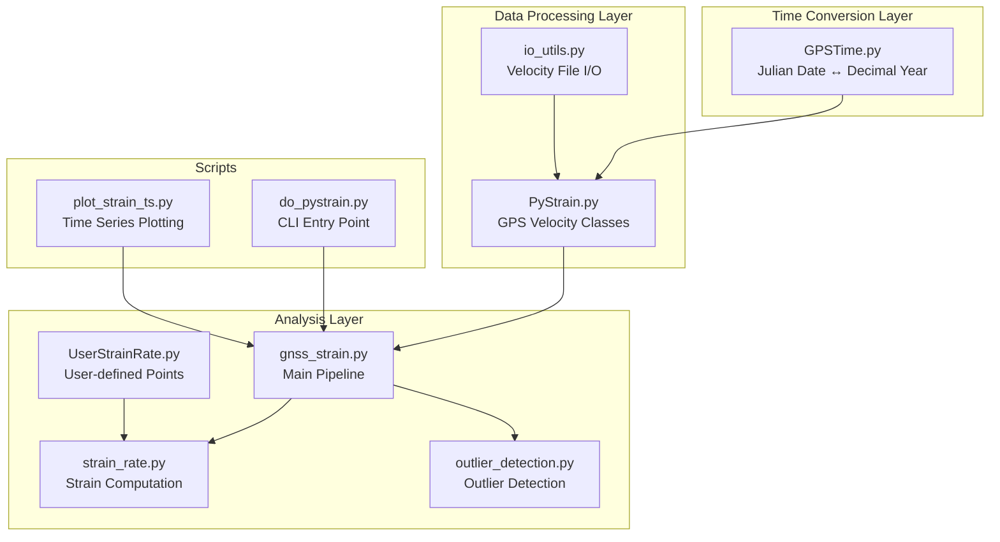
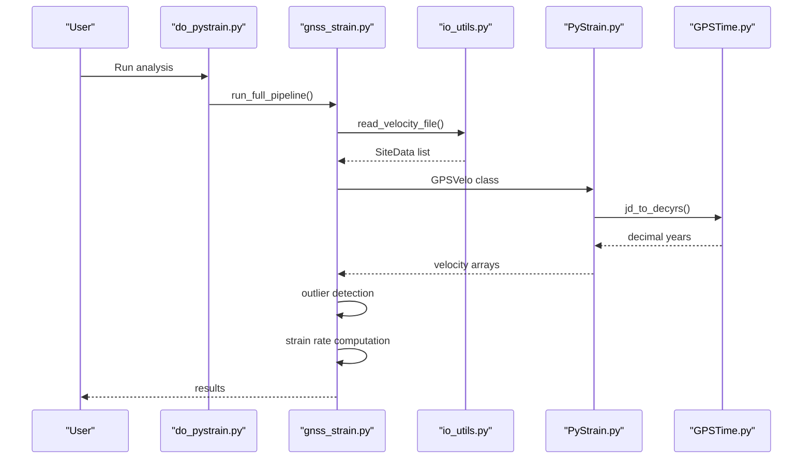
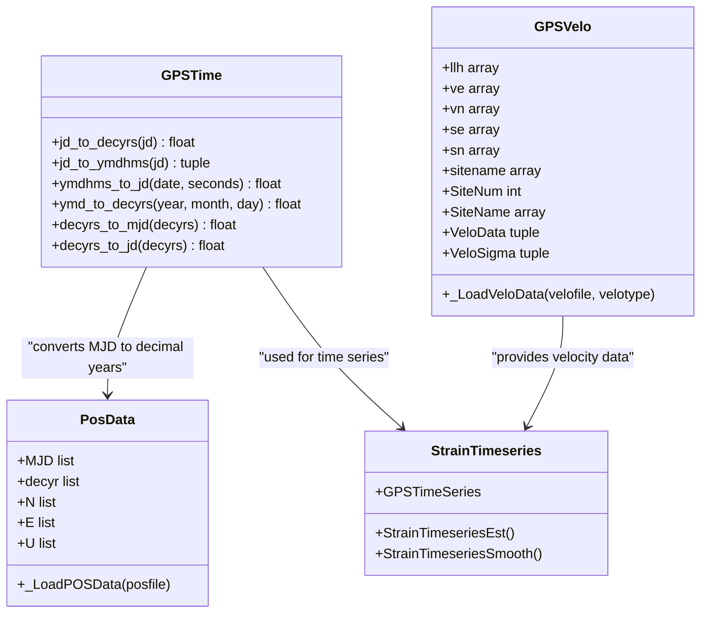
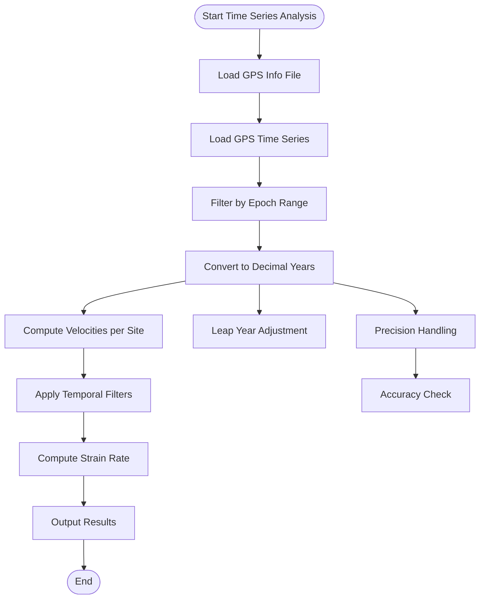
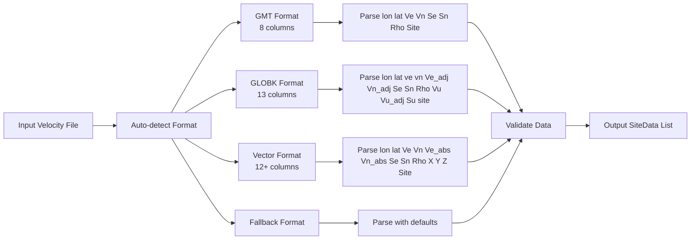
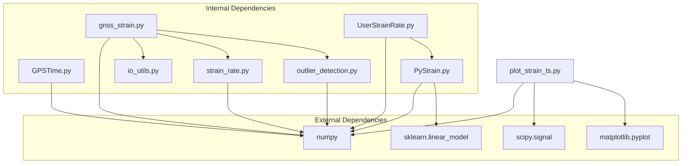

# GPS Time Utilities

<cite>
**Referenced Files in This Document**
- [GPSTime.py](file://src/pystrain/GPSTime.py)
- [PyStrain.py](file://src/pystrain/PyStrain.py)
- [gnss_strain.py](file://src/pystrain/gnss_strain/gnss_strain.py)
- [io_utils.py](file://src/pystrain/gnss_strain/io_utils.py)
- [strain_rate.py](file://src/pystrain/gnss_strain/strain_rate.py)
- [outlier_detection.py](file://src/pystrain/gnss_strain/outlier_detection.py)
- [UserStrainRate.py](file://src/pystrain/UserStrainRate.py)
- [do_pystrain.py](file://src/pystrain/scripts/do_pystrain.py)
- [plot_strain_ts.py](file://src/pystrain/scripts/plot_strain_ts.py)
- [config_default.yaml](file://src/pystrain/gnss_strain/config_default.yaml)
- [config.yaml](file://test/config.yaml)
</cite>

## Table of Contents
1. [Introduction](#introduction)
2. [Project Structure](#project-structure)
3. [Core Components](#core-components)
4. [Architecture Overview](#architecture-overview)
5. [Detailed Component Analysis](#detailed-component-analysis)
6. [Dependency Analysis](#dependency-analysis)
7. [Performance Considerations](#performance-considerations)
8. [Troubleshooting Guide](#troubleshooting-guide)
9. [Conclusion](#conclusion)
10. [Appendices](#appendices)

## Introduction
This document provides comprehensive API documentation for GPS time conversion utilities within the PyStrain geodetic analysis framework. It focuses on time series analysis and temporal data processing, covering:
- Julian Date to decimal year conversions
- GPS time format handling
- Temporal coordinate transformations
- Integration with GPS velocity data processing and strain analysis workflows
- Practical examples for time conversion operations, temporal filtering, and time series manipulation
- Precision considerations, leap year handling, and timezone conversions
- Error handling for invalid time formats and best practices for time series data management

## Project Structure
The GPS time utilities are primarily implemented in the GPSTime module and integrated across several components:
- Time conversion functions for Julian dates, decimal years, and date formats
- GPS velocity data loading and processing
- Strain rate computation workflows
- Time series analysis and visualization

**Diagram sources**
- [GPSTime.py:13-270](file://src/pystrain/GPSTime.py#L13-L270)
- [PyStrain.py:15-213](file://src/pystrain/PyStrain.py#L15-L213)
- [gnss_strain.py:1-407](file://src/pystrain/gnss_strain/gnss_strain.py#L1-L407)

**Section sources**
- [GPSTime.py:1-270](file://src/pystrain/GPSTime.py#L1-L270)
- [PyStrain.py:1-1481](file://src/pystrain/PyStrain.py#L1-L1481)

## Core Components
This section documents the primary time conversion functions and their integration points.

### Time Conversion Functions

#### `jd_to_decyrs(jd)`
Converts Julian Day to decimal year representation.

**Parameters:**
- `jd`: float - Julian day (can accept either JD or MJD format)

**Returns:**
- `decyrs`: float - Decimal year (e.g., 2023.456)

**Behavior:**
- Handles both JD (≥2,000,000.0) and MJD (<2,000,000.0) inputs
- Uses year boundary calculation to determine leap year adjustments
- Accounts for day-of-year calculations with proper leap year handling

**Section sources**
- [GPSTime.py:13-48](file://src/pystrain/GPSTime.py#L13-L48)

#### `jd_to_ymdhms(jd)`
Converts Julian Day to year-month-day-hour-minute-seconds format.

**Parameters:**
- `jd`: float - Julian day

**Returns:**
- `date`: numpy array [year, month, day, hour, minute]
- `seconds`: float - seconds component
- `day_of_year`: int - day of year (1-365/366)

**Behavior:**
- Supports negative Julian days with proper fraction handling
- Implements Gregorian calendar leap year rules
- Calculates day-of-year with century leap year corrections

**Section sources**
- [GPSTime.py:52-143](file://src/pystrain/GPSTime.py#L52-L143)

#### `ymdhms_to_jd(date, seconds)`
Converts year-month-day-hour-minute-seconds to Julian Day.

**Parameters:**
- `date`: list/array [year, month, day, hour, minute]
- `seconds`: float - seconds component

**Returns:**
- `epoch`: float - Julian day

**Behavior:**
- Handles two-digit year formats (0-199) with automatic century adjustment
- Implements leap year detection using Gregorian calendar rules
- Converts fractional time to proper Julian day representation

**Section sources**
- [GPSTime.py:145-192](file://src/pystrain/GPSTime.py#L145-L192)

#### `ymd_to_decyrs(year, month, day)`
Converts YYYY-MM-DD date to decimal year.

**Parameters:**
- `year`: int - year
- `month`: int - month (1-12)
- `day`: int - day (1-31)

**Returns:**
- `decyrs`: float - Decimal year

**Behavior:**
- Uses internal Julian day conversion with year boundary calculation
- Handles leap year determination for year transitions

**Section sources**
- [GPSTime.py:196-231](file://src/pystrain/GPSTime.py#L196-L231)

#### `decyrs_to_mjd(decyrs)` and `decyrs_to_jd(decyrs)`
Decimal year to Julian day conversions.

**Parameters:**
- `decyrs`: float - Decimal year

**Returns:**
- `mjd`: float - Modified Julian day (for `decyrs_to_mjd`)
- `jd`: float - Julian day (for `decyrs_to_jd`)

**Behavior:**
- Uses year boundaries to determine day count (365.0 for non-leap years)
- Performs interpolation between year boundaries for precise time calculation

**Section sources**
- [GPSTime.py:233-270](file://src/pystrain/GPSTime.py#L233-L270)

### GPS Velocity Data Integration

#### `PosData` class
Handles GPS position time series with automatic time conversion.

**Key Features:**
- Loads PBO POS files with NEU displacement data
- Converts MJD timestamps to decimal years using `jd_to_decyrs`
- Stores time series in millimeter units

**Integration Points:**
- Uses `gpstime.jd_to_decyrs()` for time conversion
- Provides `decyr` property for strain analysis workflows

**Section sources**
- [PyStrain.py:175-213](file://src/pystrain/PyStrain.py#L175-L213)

#### `GPSVelo` class
Processes GPS velocity files for strain rate computation.

**Supported Formats:**
- GMT format: lon lat Ve Vn Se Sn Rho SiteName
- GLOBK format: lon lat ve vn Ve_adj Vn_adj Se Sn Rho Vu Vu_adj Su site

**Section sources**
- [PyStrain.py:248-320](file://src/pystrain/PyStrain.py#L248-L320)

## Architecture Overview
The GPS time utilities integrate seamlessly into the broader PyStrain analysis pipeline:

**Diagram sources**
- [do_pystrain.py:7-39](file://src/pystrain/scripts/do_pystrain.py#L7-L39)
- [gnss_strain.py:52-341](file://src/pystrain/gnss_strain/gnss_strain.py#L52-L341)
- [io_utils.py:21-109](file://src/pystrain/gnss_strain/io_utils.py#L21-L109)
- [PyStrain.py:248-320](file://src/pystrain/PyStrain.py#L248-L320)
- [GPSTime.py:13-48](file://src/pystrain/GPSTime.py#L13-L48)

## Detailed Component Analysis

### Time Conversion Class Diagram

**Diagram sources**
- [GPSTime.py:13-270](file://src/pystrain/GPSTime.py#L13-L270)
- [PyStrain.py:175-213](file://src/pystrain/PyStrain.py#L175-L213)
- [PyStrain.py:248-320](file://src/pystrain/PyStrain.py#L248-L320)
- [PyStrain.py:1166-1336](file://src/pystrain/PyStrain.py#L1166-L1336)

### Time Series Analysis Workflow

**Diagram sources**
- [PyStrain.py:936-1164](file://src/pystrain/PyStrain.py#L936-L1164)
- [PyStrain.py:1166-1336](file://src/pystrain/PyStrain.py#L1166-L1336)

### GPS Velocity Data Processing
The system supports multiple velocity file formats with automatic detection:

**Diagram sources**
- [io_utils.py:21-109](file://src/pystrain/gnss_strain/io_utils.py#L21-L109)

**Section sources**
- [io_utils.py:1-270](file://src/pystrain/gnss_strain/io_utils.py#L1-L270)

## Dependency Analysis
The time conversion utilities have minimal external dependencies and integrate cleanly with the existing codebase:

**Diagram sources**
- [GPSTime.py:10-11](file://src/pystrain/GPSTime.py#L10-L11)
- [PyStrain.py:9-15](file://src/pystrain/PyStrain.py#L9-L15)
- [gnss_strain.py:10-27](file://src/pystrain/gnss_strain/gnss_strain.py#L10-L27)
- [strain_rate.py:8-11](file://src/pystrain/gnss_strain/strain_rate.py#L8-L11)
- [outlier_detection.py:9-10](file://src/pystrain/gnss_strain/outlier_detection.py#L9-L10)
- [plot_strain_ts.py:3-7](file://src/pystrain/scripts/plot_strain_ts.py#L3-L7)

**Section sources**
- [GPSTime.py:1-270](file://src/pystrain/GPSTime.py#L1-L270)
- [PyStrain.py:1-1481](file://src/pystrain/PyStrain.py#L1-L1481)

## Performance Considerations
- **Vectorized Operations**: All time conversion functions use NumPy arrays for batch processing
- **Memory Efficiency**: Time series processing uses generators and avoids unnecessary copies
- **Leap Year Optimization**: Pre-computed leap year tables minimize repeated calculations
- **Precision Handling**: Double precision floating-point arithmetic maintains accuracy for long time spans
- **Batch Processing**: Time series computations process multiple sites simultaneously

## Troubleshooting Guide

### Common Time Conversion Issues

#### Invalid Julian Day Values
**Problem**: `jd` parameter outside expected range
**Solution**: Ensure Julian day values are within valid astronomical ranges
- JD ≥ 2,000,000.0 for modern dates
- MJD < 2,000,000.0 for Modified Julian dates

#### Leap Year Calculation Errors
**Problem**: Incorrect leap year determination for year transitions
**Solution**: Verify year boundary calculations
- Century years divisible by 400 are leap years
- Years divisible by 100 but not 400 are not leap years

#### Precision Loss in Decimal Year Calculations
**Problem**: Accumulated rounding errors in long time series
**Solution**: Use higher precision data types and validate intermediate results
- Ensure decimal year calculations maintain sufficient precision
- Validate year boundary determinations

#### Time Zone and Coordinate System Issues
**Problem**: Mixed time zone representations in velocity files
**Solution**: Standardize to UTC and decimal year format
- GPS velocity files typically use UTC
- Convert all timestamps to decimal years for consistency

**Section sources**
- [GPSTime.py:25-46](file://src/pystrain/GPSTime.py#L25-L46)
- [PyStrain.py:210-212](file://src/pystrain/PyStrain.py#L210-L212)

## Conclusion
The GPS time conversion utilities provide robust, efficient time handling for geodetic analysis workflows. The implementation offers:
- Comprehensive support for various time formats and representations
- Integration with GPS velocity data processing pipelines
- Seamless incorporation into strain rate computation workflows
- Proper handling of leap years and precision considerations
- Extensive error handling and validation mechanisms

These utilities enable accurate temporal analysis of GPS data for applications ranging from static strain analysis to time-dependent deformation studies.

## Appendices

### Configuration Options for Time Processing
- **Time Range**: Configure start and end epochs for analysis periods
- **Temporal Resolution**: Control sampling intervals for time series processing
- **Filtering Parameters**: Adjust outlier detection thresholds for time series data

### Best Practices for Time Series Management
- Maintain consistent time reference frames across all datasets
- Validate time stamp accuracy and precision
- Apply appropriate temporal filters to remove noise and artifacts
- Monitor leap year transitions during long-term analyses
- Ensure proper handling of missing data and gaps in time series