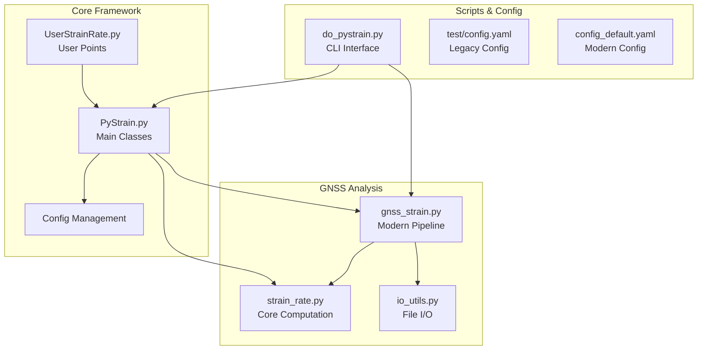
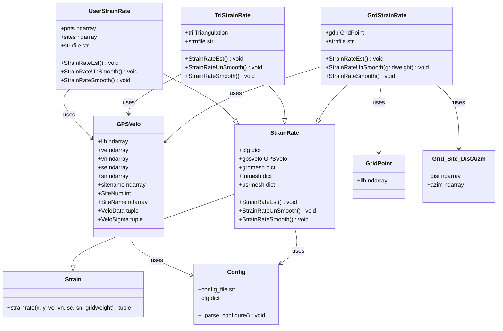
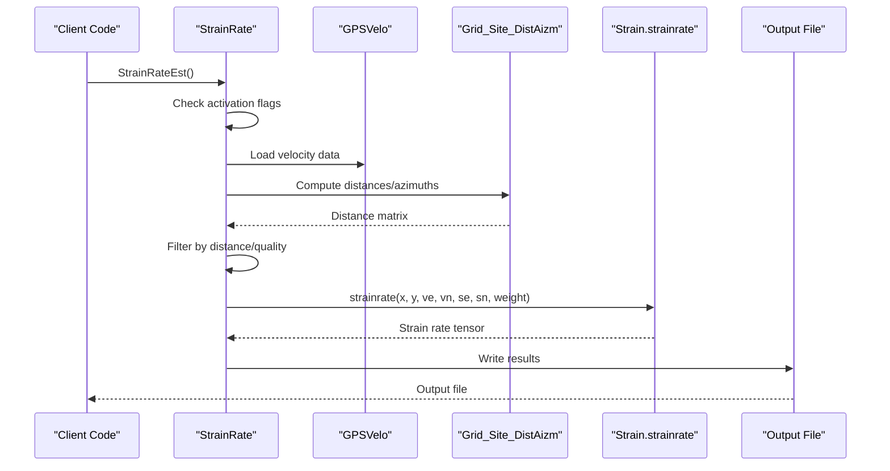
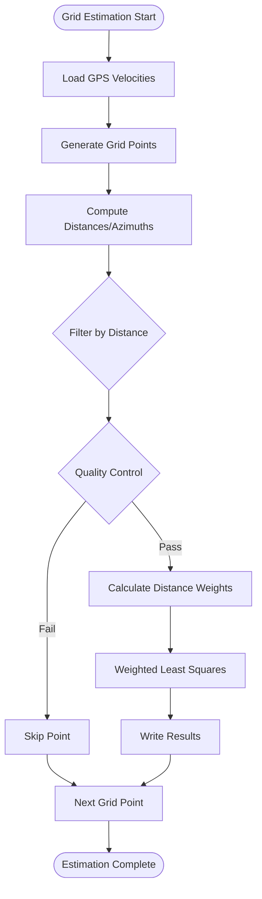
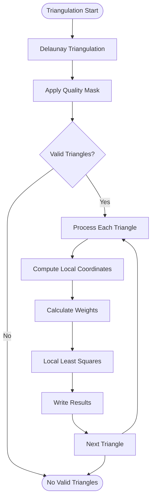
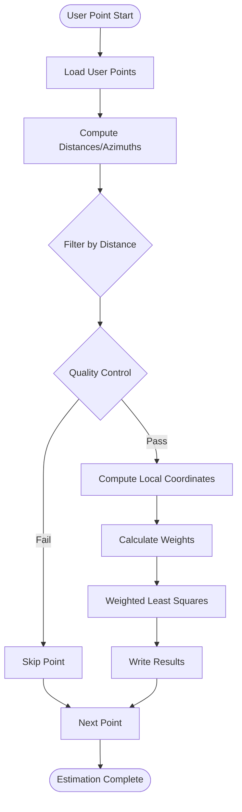
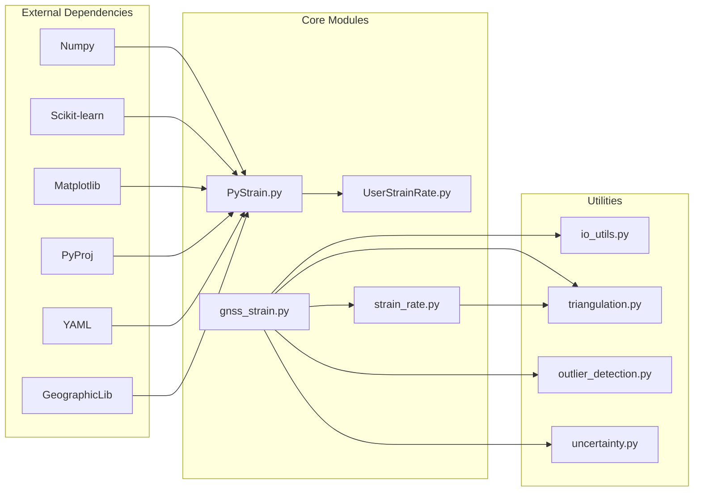

# PyStrain Class

<cite>
**Referenced Files in This Document**
- [PyStrain.py](file://src/pystrain/PyStrain.py)
- [UserStrainRate.py](file://src/pystrain/UserStrainRate.py)
- [gnss_strain.py](file://src/pystrain/gnss_strain/gnss_strain.py)
- [strain_rate.py](file://src/pystrain/gnss_strain/strain_rate.py)
- [do_pystrain.py](file://src/pystrain/scripts/do_pystrain.py)
- [config.yaml](file://test/config.yaml)
- [config_default.yaml](file://src/pystrain/gnss_strain/config_default.yaml)
</cite>

## Table of Contents
1. [Introduction](#introduction)
2. [Project Structure](#project-structure)
3. [Core Components](#core-components)
4. [Architecture Overview](#architecture-overview)
5. [Detailed Component Analysis](#detailed-component-analysis)
6. [Dependency Analysis](#dependency-analysis)
7. [Performance Considerations](#performance-considerations)
8. [Troubleshooting Guide](#troubleshooting-guide)
9. [Conclusion](#conclusion)

## Introduction

PyStrain is a comprehensive Python framework for GPS-derived strain rate analysis. The framework provides multiple approaches for estimating strain rates from GNSS velocity data, including grid-based interpolation, triangular mesh analysis, and user-defined point estimation. This documentation focuses on the main strain analysis interface centered around the PyStrain class hierarchy and its configuration management system.

The framework operates on two primary analysis modes: static strain rate estimation and time series analysis. It supports three distinct spatial sampling strategies: regular grid points, Delaunay triangular meshes, and user-specified locations. Each approach employs robust statistical methods for handling GPS velocity uncertainties and spatial weighting schemes.

## Project Structure

The PyStrain project follows a modular architecture with clear separation between core functionality and specialized components:



**Diagram sources**
- [PyStrain.py:1-1481](file://src/pystrain/PyStrain.py#L1-L1481)
- [gnss_strain.py:1-407](file://src/pystrain/gnss_strain/gnss_strain.py#L1-L407)

**Section sources**
- [PyStrain.py:1-80](file://src/pystrain/PyStrain.py#L1-L80)
- [gnss_strain.py:1-407](file://src/pystrain/gnss_strain/gnss_strain.py#L1-L407)

## Core Components

### Config Class
The Config class serves as the central configuration management system for PyStrain operations. It parses YAML configuration files and provides structured access to all analysis parameters.

**Key Features:**
- YAML file parsing with comprehensive error handling
- Hierarchical configuration structure supporting multiple analysis modes
- Runtime parameter validation and logging

**Configuration Parameters:**
- GPS velocity file specification
- Analysis mode selection (grid, triangular mesh, user points)
- Spatial sampling parameters (grid spacing, search radii)
- Quality control thresholds (minimum sites, distance limits)
- Smoothing parameters and uncertainty handling

**Section sources**
- [PyStrain.py:98-126](file://src/pystrain/PyStrain.py#L98-L126)
- [config.yaml:1-123](file://test/config.yaml#L1-L123)

### StrainRate Base Class
The StrainRate class provides the foundational interface for all strain rate estimation methods. It inherits from the Strain base class and implements the core strain rate computation framework.

**Primary Methods:**
- `StrainRateEst()`: Main entry point for strain rate computation
- `StrainRateUnSmooth()`: Unsmoothed strain rate estimation
- `StrainRateSmooth()`: Smoothed strain rate estimation with spatial constraints

**Section sources**
- [PyStrain.py:517-550](file://src/pystrain/PyStrain.py#L517-L550)

### Grid-Based Strain Rate Estimation
The GrdStrainRate class implements grid-based strain rate estimation using regular spatial sampling.

**Key Features:**
- Regular grid point generation with configurable spacing
- Distance-weighted least squares estimation
- Azimuth distribution quality control
- Local coordinate transformation using UTM projection

**Section sources**
- [PyStrain.py:552-730](file://src/pystrain/PyStrain.py#L552-L730)

### Triangular Mesh Strain Rate Estimation
The TriStrainRate class implements Delaunay triangulation-based strain rate analysis.

**Key Features:**
- Automatic Delaunay triangulation construction
- Triangle quality assessment and masking
- Centroid-based strain rate computation
- Spatial smoothing with adjacency constraints

**Section sources**
- [PyStrain.py:730-808](file://src/pystrain/PyStrain.py#L730-L808)

### User-Specified Point Estimation
The UserStrainRate class enables strain rate estimation at custom locations provided by the user.

**Key Features:**
- Flexible point specification via external files
- Local coordinate system definition
- Quality control for spatial distribution
- Model velocity output capability

**Section sources**
- [UserStrainRate.py:1-126](file://src/pystrain/UserStrainRate.py#L1-L126)

## Architecture Overview

The PyStrain framework implements a hierarchical class structure with clear separation of concerns:



**Diagram sources**
- [PyStrain.py:352-808](file://src/pystrain/PyStrain.py#L352-L808)

## Detailed Component Analysis

### StrainRateEst Method Workflow

The primary strain rate estimation workflow follows a standardized process across all implementation variants:



**Diagram sources**
- [PyStrain.py:542-549](file://src/pystrain/PyStrain.py#L542-L549)
- [PyStrain.py:364-470](file://src/pystrain/PyStrain.py#L364-L470)

### Strain Rate Computation Method

The core strain rate computation implements a weighted least squares approach:

**Method Signature:**
```python
def strainrate(self, x, y, ve, vn, se, sn, gridweight=None):
```

**Parameters:**
- `x, y`: Local coordinates (km) from reference point to GPS sites
- `ve, vn`: Observed velocities (mm/yr) with uncertainties
- `se, sn`: Velocity uncertainties (mm/yr)
- `gridweight`: Distance weighting parameter (km)

**Return Values:**
- `dx, dy`: Average velocities (mm/yr)
- `exx, exy, eyy`: Strain rate tensor components (10⁻⁹/yr)
- `w`: Rotation rate (10⁻⁹/yr)
- `E1, E2`: Principal strain rates (10⁻⁹/yr)
- `gamma`: Maximum shear strain rate (10⁻⁹/yr)
- `delta`: Dilatation strain rate (10⁻⁹/yr)
- `sec_inv`: Second strain invariant (10⁻⁹/yr)
- `theta`: Azimuth of maximum strain (degrees)

**Computational Method:**
The method solves the overdetermined system using weighted least squares:
```
G · L = U
Weighted: (GᵀW) · L = W · U
Solution: L = (GᵀW G)⁻¹ (GᵀW U)
```

Where G is the design matrix incorporating spatial derivatives, and W is the diagonal weight matrix based on distance weighting.

**Section sources**
- [PyStrain.py:364-470](file://src/pystrain/PyStrain.py#L364-L470)

### Grid-Based Estimation Strategy

Grid-based strain rate estimation provides spatially uniform coverage:



**Diagram sources**
- [PyStrain.py:572-660](file://src/pystrain/PyStrain.py#L572-L660)

**Section sources**
- [PyStrain.py:572-660](file://src/pystrain/PyStrain.py#L572-L660)

### Triangular Mesh Estimation Strategy

Triangular mesh estimation leverages spatial triangulation for localized analysis:



**Diagram sources**
- [PyStrain.py:755-800](file://src/pystrain/PyStrain.py#L755-L800)

**Section sources**
- [PyStrain.py:755-800](file://src/pystrain/PyStrain.py#L755-L800)

### User-Specified Point Estimation Strategy

User-defined point estimation offers flexibility for targeted analysis:



**Diagram sources**
- [UserStrainRate.py:30-126](file://src/pystrain/UserStrainRate.py#L30-L126)

**Section sources**
- [UserStrainRate.py:30-126](file://src/pystrain/UserStrainRate.py#L30-L126)

## Dependency Analysis

The PyStrain framework exhibits well-structured dependencies with clear module boundaries:



**Diagram sources**
- [PyStrain.py:9-16](file://src/pystrain/PyStrain.py#L9-L16)
- [gnss_strain.py:10-28](file://src/pystrain/gnss_strain/gnss_strain.py#L10-L28)

**Section sources**
- [PyStrain.py:9-16](file://src/pystrain/PyStrain.py#L9-L16)
- [gnss_strain.py:10-28](file://src/pystrain/gnss_strain/gnss_strain.py#L10-L28)

## Performance Considerations

### Computational Complexity
- **Grid-based methods**: O(N_grid × N_sites × N_parameters) where N_sites is the average number of GPS stations per grid cell
- **Triangular methods**: O(N_triangles × N_vertices_per_triangle × N_parameters) where typically N_vertices_per_triangle = 3
- **User-defined methods**: O(N_points × N_sites_per_point × N_parameters)

### Memory Optimization Strategies
- Distance matrix caching for repeated calculations
- Incremental file writing to minimize memory footprint
- Quality filtering to reduce computational load
- Spatial indexing for efficient neighbor searches

### Parallel Processing Opportunities
- Independent grid point computations
- Batch processing of triangle patches
- Multi-threaded distance calculations
- Asynchronous file I/O operations

## Troubleshooting Guide

### Common Configuration Issues
**Problem**: Configuration file not found
- **Cause**: Incorrect path or missing YAML extension
- **Solution**: Verify file existence and correct path specification

**Problem**: Invalid configuration parameters
- **Cause**: Unsupported values or incorrect data types
- **Solution**: Validate against documented parameter ranges

### Data Quality Issues
**Problem**: Insufficient GPS stations for estimation
- **Cause**: Too restrictive distance or minimum site thresholds
- **Solution**: Adjust `maxdist` and `minsite` parameters in configuration

**Problem**: Poor spatial distribution of GPS stations
- **Cause**: All stations located in limited azimuth sectors
- **Solution**: Enable `chkazim` parameter or adjust station selection criteria

### Numerical Stability Issues
**Problem**: Singular matrix errors during least squares
- **Cause**: Degenerate geometry or insufficient observations
- **Solution**: Increase minimum site count or adjust spatial weighting

**Section sources**
- [PyStrain.py:594-660](file://src/pystrain/PyStrain.py#L594-L660)
- [PyStrain.py:866-928](file://src/pystrain/PyStrainRate.py#L866-L928)

## Conclusion

The PyStrain framework provides a robust, extensible foundation for GPS-derived strain rate analysis. Its modular architecture supports multiple analysis strategies while maintaining consistent interfaces and data formats. The framework's emphasis on quality control, uncertainty quantification, and flexible configuration makes it suitable for diverse geodetic applications.

Key strengths include:
- Comprehensive support for different spatial sampling strategies
- Robust quality control mechanisms
- Flexible configuration management
- Extensive documentation and examples
- Integration with modern Python scientific computing ecosystem

Future enhancements could include improved parallel processing capabilities, enhanced visualization tools, and expanded support for additional GPS data formats.