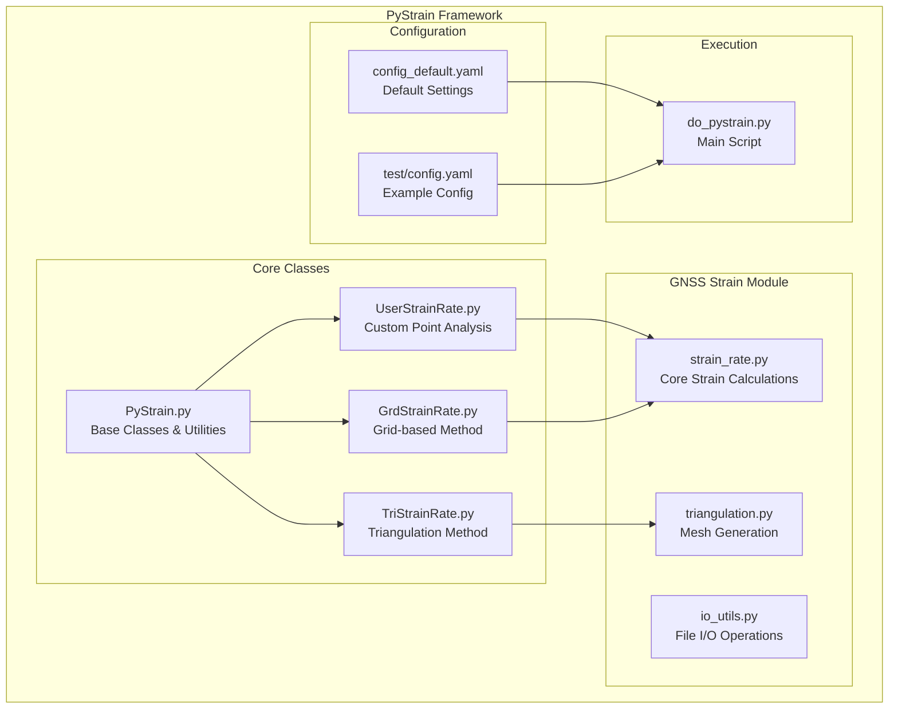
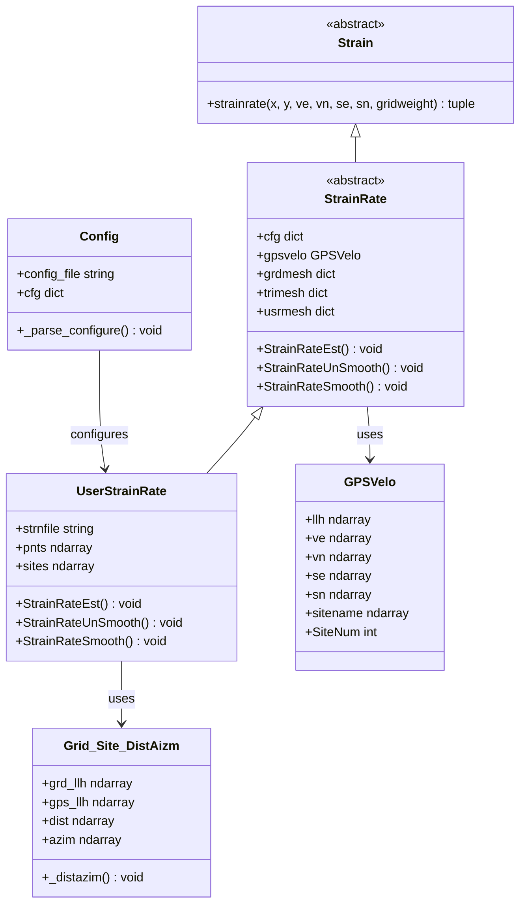
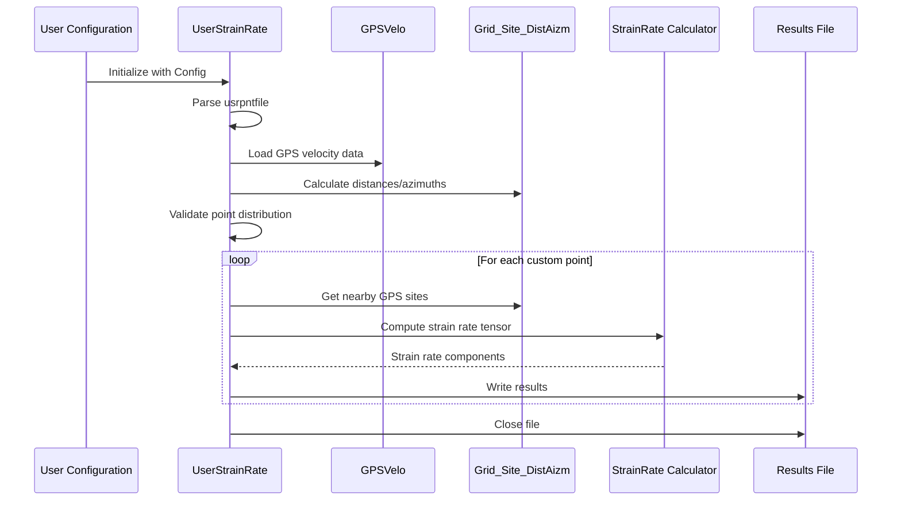
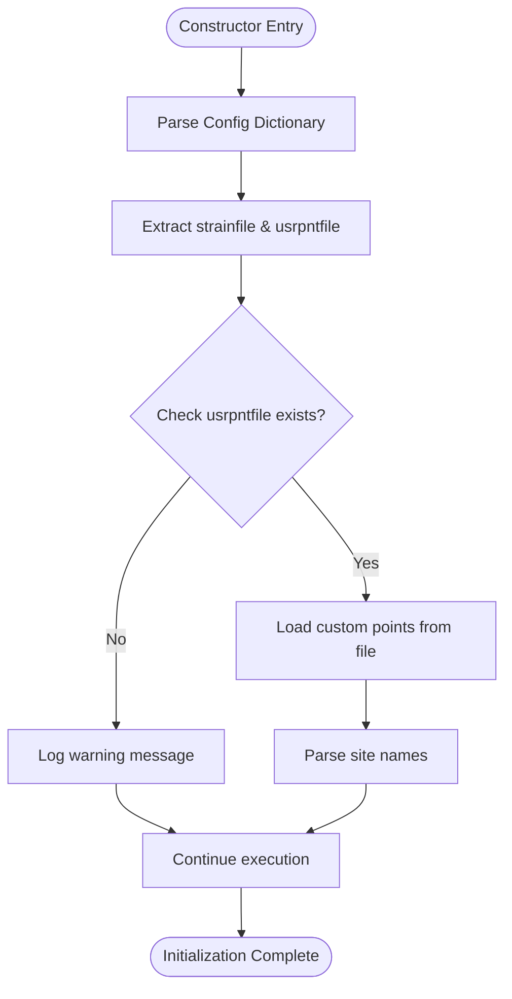
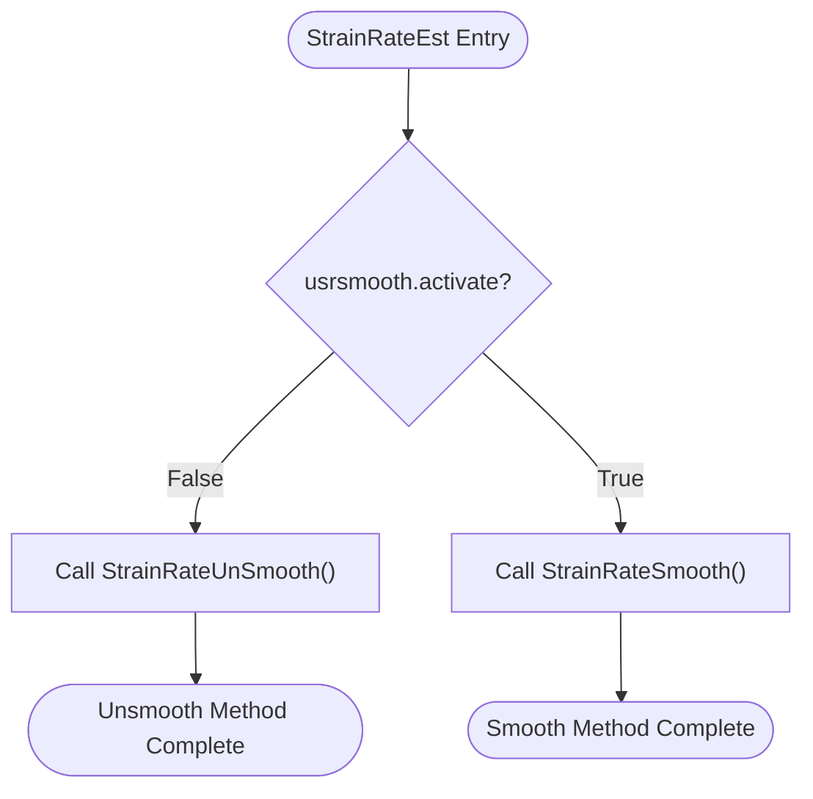
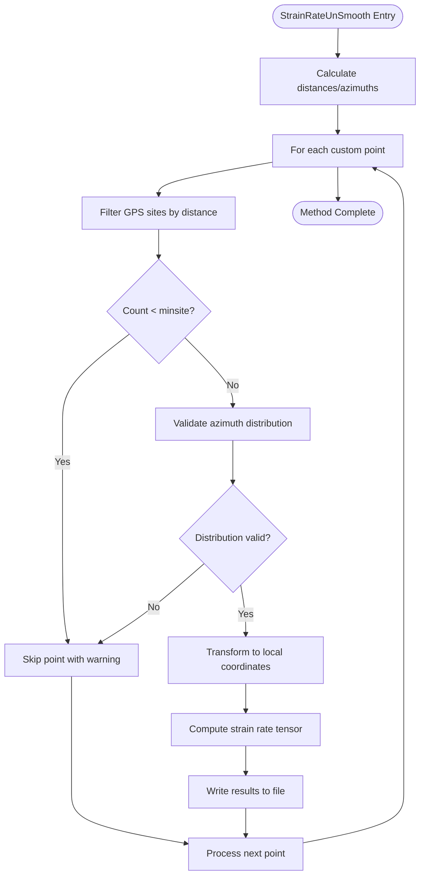
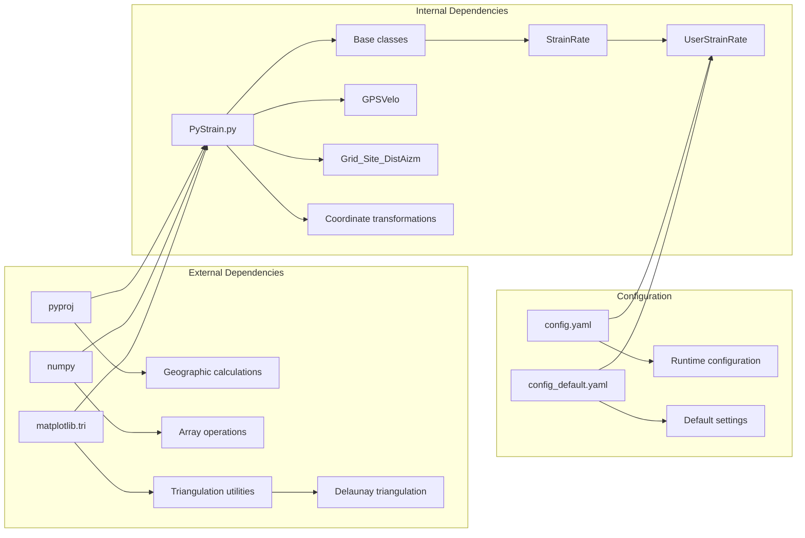
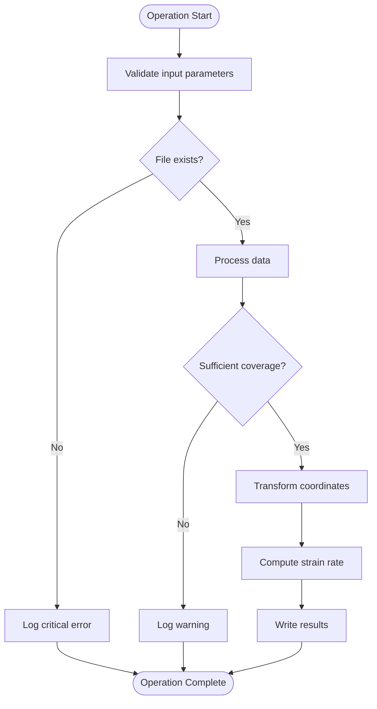

# UserStrainRate Class

<cite>
**Referenced Files in This Document**
- [UserStrainRate.py](file://src/pystrain/UserStrainRate.py)
- [PyStrain.py](file://src/pystrain/PyStrain.py)
- [strain_rate.py](file://src/pystrain/gnss_strain/strain_rate.py)
- [triangulation.py](file://src/pystrain/gnss_strain/triangulation.py)
- [io_utils.py](file://src/pystrain/gnss_strain/io_utils.py)
- [config_default.yaml](file://src/pystrain/gnss_strain/config_default.yaml)
- [config.yaml](file://test/config.yaml)
- [do_pystrain.py](file://src/pystrain/scripts/do_pystrain.py)
</cite>

## Table of Contents
1. [Introduction](#introduction)
2. [Project Structure](#project-structure)
3. [Core Components](#core-components)
4. [Architecture Overview](#architecture-overview)
5. [Detailed Component Analysis](#detailed-component-analysis)
6. [Dependency Analysis](#dependency-analysis)
7. [Performance Considerations](#performance-considerations)
8. [Troubleshooting Guide](#troubleshooting-guide)
9. [Conclusion](#conclusion)

## Introduction

The UserStrainRate class is a specialized component within the PyStrain framework designed for custom point-based strain analysis. Unlike automated grid-based or triangulation-based methods, this class enables researchers to define arbitrary analysis points and compute strain rates at specific geographic locations using GPS velocity data.

The class extends the base StrainRate functionality and provides targeted strain rate computation for user-specified locations, making it ideal for focused regional studies, targeted fault analysis, or custom monitoring networks.

## Project Structure

The PyStrain framework follows a modular architecture with clear separation between core functionality and specialized analysis methods:



**Diagram sources**
- [PyStrain.py:1-800](file://src/pystrain/PyStrain.py#L1-L800)
- [UserStrainRate.py:1-126](file://src/pystrain/UserStrainRate.py#L1-L126)
- [config_default.yaml:1-69](file://src/pystrain/gnss_strain/config_default.yaml#L1-L69)
- [config.yaml:1-123](file://test/config.yaml#L1-L123)

**Section sources**
- [PyStrain.py:1-800](file://src/pystrain/PyStrain.py#L1-L800)
- [UserStrainRate.py:1-126](file://src/pystrain/UserStrainRate.py#L1-L126)
- [config_default.yaml:1-69](file://src/pystrain/gnss_strain/config_default.yaml#L1-L69)
- [config.yaml:1-123](file://test/config.yaml#L1-L123)

## Core Components

The UserStrainRate class serves as a bridge between user-defined analysis points and comprehensive strain rate computation:

### Class Hierarchy and Relationships



**Diagram sources**
- [PyStrain.py:352-550](file://src/pystrain/PyStrain.py#L352-L550)
- [PyStrain.py:517-550](file://src/pystrain/PyStrain.py#L517-L550)
- [UserStrainRate.py:5-27](file://src/pystrain/UserStrainRate.py#L5-L27)

### Key Configuration Parameters

The UserStrainRate class operates with several critical configuration parameters:

| Parameter | Type | Description | Default Value |
|-----------|------|-------------|---------------|
| `usrmesh.activate` | Boolean | Enable/disable user mesh analysis | False |
| `usrmesh.strainfile` | String | Output file path for results | 'usrmesh.txt' |
| `usrmesh.maxdist` | Integer | Maximum search distance (km) | 200 |
| `usrmesh.minsite` | Integer | Minimum number of GPS sites required | 8 |
| `usrmesh.chkazim` | Boolean | Enable azimuth distribution checking | True |
| `usrmesh.usrpntfile` | String | Path to custom point definition file | '' |

**Section sources**
- [config.yaml:40-61](file://test/config.yaml#L40-L61)
- [UserStrainRate.py:10-27](file://src/pystrain/UserStrainRate.py#L10-L27)

## Architecture Overview

The UserStrainRate class implements a sophisticated workflow for custom point-based strain analysis:



**Diagram sources**
- [UserStrainRate.py:30-119](file://src/pystrain/UserStrainRate.py#L30-L119)
- [PyStrain.py:248-320](file://src/pystrain/PyStrain.py#L248-L320)
- [PyStrain.py:473-515](file://src/pystrain/PyStrain.py#L473-L515)

## Detailed Component Analysis

### Constructor and Initialization

The UserStrainRate constructor establishes the foundation for custom point analysis:



**Diagram sources**
- [UserStrainRate.py:10-27](file://src/pystrain/UserStrainRate.py#L10-L27)

The constructor performs several critical initialization steps:

1. **Configuration Parsing**: Extracts user mesh configuration from the main config dictionary
2. **File Validation**: Checks existence of the custom point definition file
3. **Point Loading**: Reads longitude, latitude, and site identifiers from the point file
4. **GPS Data Integration**: Establishes connection to GPS velocity data through the parent class

**Section sources**
- [UserStrainRate.py:10-27](file://src/pystrain/UserStrainRate.py#L10-L27)

### Strain Rate Computation Methods

#### StrainRateEst Method

The primary entry point for strain rate computation at custom points:



**Diagram sources**
- [UserStrainRate.py:30-38](file://src/pystrain/UserStrainRate.py#L30-L38)

#### StrainRateUnSmooth Method

The core computation engine for custom point analysis:



**Diagram sources**
- [UserStrainRate.py:40-119](file://src/pystrain/UserStrainRate.py#L40-L119)

**Section sources**
- [UserStrainRate.py:30-119](file://src/pystrain/UserStrainRate.py#L30-L119)

### Coordinate Transformation and Distance Calculation

The class relies on sophisticated coordinate transformation utilities:

#### Distance and Azimuth Calculation

The Grid_Site_DistAizm class computes precise geometric relationships between custom points and GPS stations:

| Property | Data Type | Description |
|----------|-----------|-------------|
| `grd_llh` | ndarray | Custom point coordinates (longitude, latitude) |
| `gps_llh` | ndarray | GPS station coordinates (longitude, latitude) |
| `dist` | ndarray | Distance matrix (km) |
| `azim` | ndarray | Azimuth matrix (degrees) |

#### Local Coordinate Transformation

The system employs two coordinate transformation methods:

1. **UTM Projection**: Uses pyproj for precise Cartesian coordinate conversion
2. **Local Polyconic Projection**: Provides high-precision local coordinate system

**Section sources**
- [PyStrain.py:473-515](file://src/pystrain/PyStrain.py#L473-L515)
- [PyStrain.py:52-76](file://src/pystrain/PyStrain.py#L52-L76)
- [PyStrain.py:77-96](file://src/pystrain/PyStrain.py#L77-L96)

### Strain Rate Tensor Computation

The strain rate computation follows established geodetic principles:

#### Mathematical Foundation

The strain rate tensor components are computed using weighted least squares regression:

| Component | Symbol | Description |
|-----------|--------|-------------|
| Normal strain (East) | εxx | Extension/compression along east direction |
| Normal strain (North) | εyy | Extension/compression along north direction |
| Shear strain | εxy | Shear deformation in xy plane |
| Rotation rate | ω | Angular rotation rate |
| Principal strains | ε1, ε2 | Maximum and minimum principal strains |
| Maximum shear | γ | Maximum shear strain rate |
| Dilatation | δ | Volume change rate |
| Second invariant | I2 | Strain energy invariant |

#### Weighting Scheme

The computation applies exponential weighting based on distance:

```
w = exp(-r²/R₀²)
```

Where R₀ represents the characteristic distance scale for weight decay.

**Section sources**
- [PyStrain.py:363-470](file://src/pystrain/PyStrain.py#L363-L470)

## Dependency Analysis

The UserStrainRate class integrates with multiple framework components:



**Diagram sources**
- [PyStrain.py:1-20](file://src/pystrain/PyStrain.py#L1-L20)
- [UserStrainRate.py:1-4](file://src/pystrain/UserStrainRate.py#L1-L4)

### Integration Points

The class maintains several critical integration points:

1. **Configuration Management**: Inherits from StrainRate with specialized user mesh configuration
2. **GPS Data Access**: Utilizes GPSVelo class for velocity data management
3. **Geometric Calculations**: Leverages Grid_Site_DistAizm for distance and azimuth computations
4. **Output Formatting**: Produces standardized strain rate result files

**Section sources**
- [PyStrain.py:517-550](file://src/pystrain/PyStrain.py#L517-L550)
- [UserStrainRate.py:18-27](file://src/pystrain/UserStrainRate.py#L18-L27)

## Performance Considerations

### Computational Complexity

The UserStrainRate class exhibits the following computational characteristics:

- **Time Complexity**: O(N × M × P) where N = number of custom points, M = average number of GPS sites per point, P = dimensionality of strain rate computation
- **Space Complexity**: O(N × M) for storing distance matrices and intermediate calculations

### Optimization Strategies

1. **Efficient Distance Calculation**: Uses vectorized NumPy operations for batch distance computations
2. **Early Termination**: Validates point distributions before expensive computations
3. **Memory Management**: Processes points sequentially to minimize memory footprint
4. **Weighted Regression**: Implements efficient weighted least squares solution

### Scalability Guidelines

For large-scale custom point analysis:

- **Point Count**: Monitor computational time as it scales linearly with number of points
- **Site Density**: Consider spatial clustering to reduce redundant computations
- **Parallel Processing**: Current implementation processes points sequentially; consider multiprocessing for large datasets
- **Memory Usage**: Large point sets may require disk-based processing or chunking

## Troubleshooting Guide

### Common Issues and Solutions

#### Missing Custom Point File

**Problem**: User-specified point file does not exist
**Solution**: Verify file path in configuration and ensure proper file permissions

#### Insufficient GPS Data Coverage

**Problem**: Fewer GPS sites than minimum required count
**Solution**: Adjust `minsite` parameter or expand search radius (`maxdist`)

#### Poor Spatial Distribution

**Problem**: GPS sites distributed primarily in one azimuth sector
**Solution**: Enable `chkazim` validation or reposition analysis points

#### Coordinate Transformation Errors

**Problem**: Incorrect coordinate conversions leading to unrealistic results
**Solution**: Verify coordinate system alignment and projection parameters

### Error Handling Mechanisms

The class implements comprehensive error handling:



**Diagram sources**
- [UserStrainRate.py:22-26](file://src/pystrain/UserStrainRate.py#L22-L26)
- [UserStrainRate.py:61-67](file://src/pystrain/UserStrainRate.py#L61-L67)

**Section sources**
- [UserStrainRate.py:22-26](file://src/pystrain/UserStrainRate.py#L22-L26)
- [UserStrainRate.py:61-67](file://src/pystrain/UserStrainRate.py#L61-L67)

## Conclusion

The UserStrainRate class provides a powerful and flexible framework for custom point-based strain analysis within the PyStrain ecosystem. Its design emphasizes precision, configurability, and integration with existing GPS velocity data processing workflows.

Key strengths include:

- **Precision**: Sophisticated coordinate transformations and weighted regression methods
- **Flexibility**: Customizable point placement and analysis parameters
- **Integration**: Seamless integration with GPS velocity data and configuration systems
- **Validation**: Comprehensive input validation and quality control mechanisms

The class serves as an essential tool for researchers requiring targeted strain analysis capabilities beyond automated grid-based or triangulation-based approaches, enabling focused studies of specific geological features or monitoring networks.