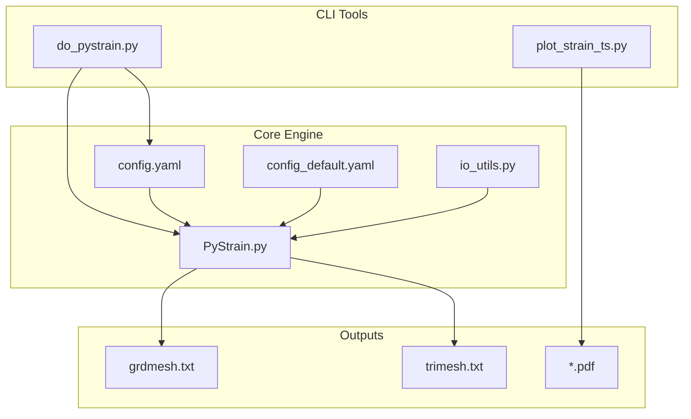
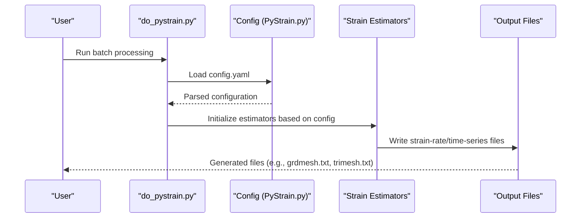
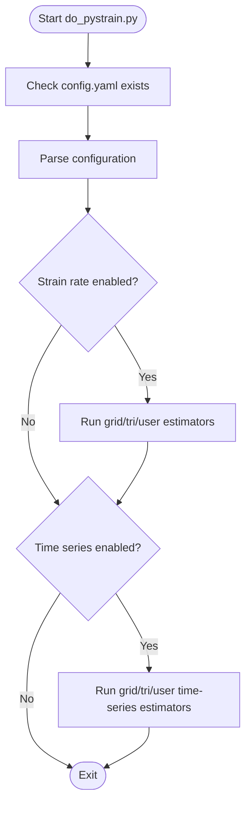
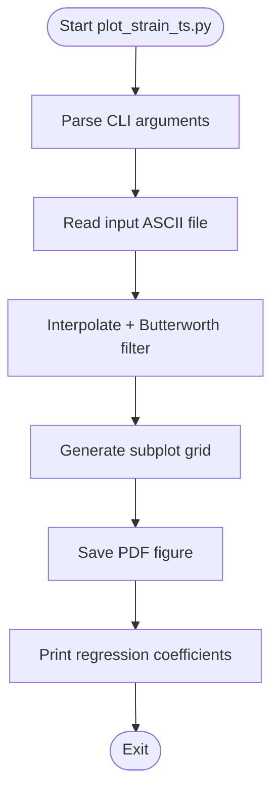
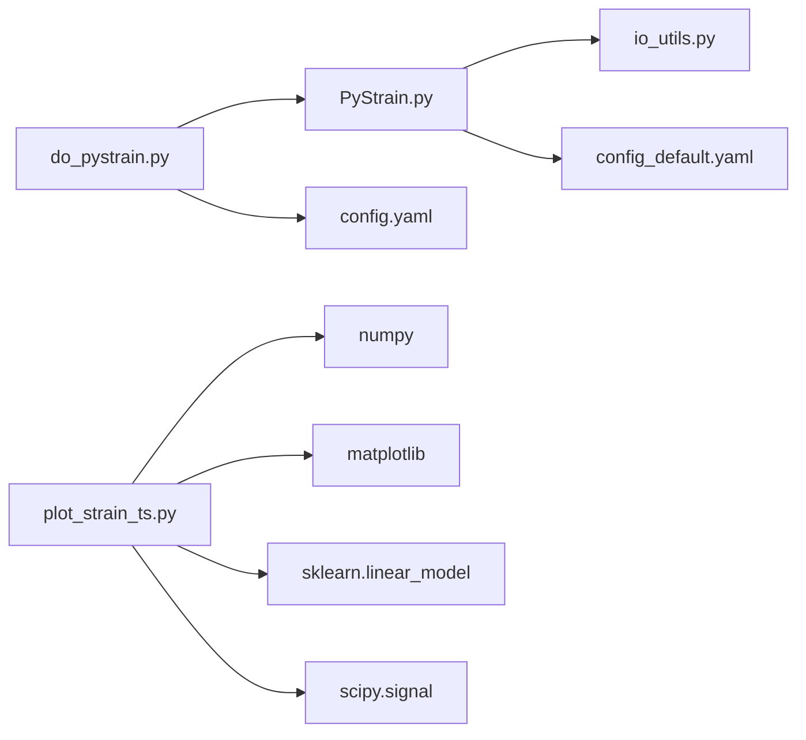

# Command Line Interface

<cite>
**Referenced Files in This Document**
- [do_pystrain.py](file://src/pystrain/scripts/do_pystrain.py)
- [plot_strain_ts.py](file://src/pystrain/scripts/plot_strain_ts.py)
- [PyStrain.py](file://src/pystrain/PyStrain.py)
- [config.yaml](file://test/config.yaml)
- [grdmesh.txt](file://test/grdmesh.txt)
- [trimesh.txt](file://test/trimesh.txt)
- [config_default.yaml](file://src/pystrain/gnss_strain/config_default.yaml)
- [io_utils.py](file://src/pystrain/gnss_strain/io_utils.py)
</cite>

## Table of Contents
1. [Introduction](#introduction)
2. [Project Structure](#project-structure)
3. [Core Components](#core-components)
4. [Architecture Overview](#architecture-overview)
5. [Detailed Component Analysis](#detailed-component-analysis)
6. [Dependency Analysis](#dependency-analysis)
7. [Performance Considerations](#performance-considerations)
8. [Troubleshooting Guide](#troubleshooting-guide)
9. [Conclusion](#conclusion)

## Introduction
This document provides comprehensive command-line interface (CLI) documentation for PyStrain's batch processing workflows. It covers:
- The primary batch processor script for strain-rate and time-series estimation
- The time-series visualization utility for plotting strain-rate time series
- Configuration file integration and parameter descriptions
- Input/output formats and interpretation of results
- Practical workflows for batch processing multiple regions and automated pipelines
- Logging, progress reporting, error handling, and performance considerations

## Project Structure
PyStrain organizes its CLI tools under the scripts directory and core processing logic in the main module. The key files for CLI usage are:
- Batch processor: src/pystrain/scripts/do_pystrain.py
- Time-series visualization: src/pystrain/scripts/plot_strain_ts.py
- Core processing engine: src/pystrain/PyStrain.py
- Example configuration: test/config.yaml
- Additional configuration defaults: src/pystrain/gnss_strain/config_default.yaml
- IO utilities for GNSS data: src/pystrain/gnss_strain/io_utils.py

**Diagram sources**
- [do_pystrain.py:1-39](file://src/pystrain/scripts/do_pystrain.py#L1-L39)
- [plot_strain_ts.py:1-143](file://src/pystrain/scripts/plot_strain_ts.py#L1-L143)
- [PyStrain.py:1-1481](file://src/pystrain/PyStrain.py#L1-L1481)
- [config.yaml:1-123](file://test/config.yaml#L1-L123)
- [config_default.yaml:1-69](file://src/pystrain/gnss_strain/config_default.yaml#L1-L69)
- [io_utils.py:1-270](file://src/pystrain/gnss_strain/io_utils.py#L1-L270)
- [grdmesh.txt:1-189](file://test/grdmesh.txt#L1-L189)
- [trimesh.txt:1-200](file://test/trimesh.txt#L1-L200)

**Section sources**
- [do_pystrain.py:1-39](file://src/pystrain/scripts/do_pystrain.py#L1-L39)
- [plot_strain_ts.py:1-143](file://src/pystrain/scripts/plot_strain_ts.py#L1-L143)
- [PyStrain.py:1-1481](file://src/pystrain/PyStrain.py#L1-L1481)
- [config.yaml:1-123](file://test/config.yaml#L1-L123)
- [config_default.yaml:1-69](file://src/pystrain/gnss_strain/config_default.yaml#L1-L69)
- [io_utils.py:1-270](file://src/pystrain/gnss_strain/io_utils.py#L1-L270)

## Core Components
This section documents the two primary CLI tools and their integration with the configuration system.

### do_pystrain.py
Purpose: Orchestrates batch processing for strain-rate and time-series estimation using a YAML configuration file.

Key behaviors:
- Validates presence of config.yaml in the working directory
- Reads configuration via the Config class
- Executes strain-rate estimation for grid, triangular, and user-defined meshes
- Executes time-series estimation for grid, triangular, and user-defined meshes
- Uses logging for progress and warnings

Command-line usage:
- Run with Python: python src/pystrain/scripts/do_pystrain.py
- Requires a config.yaml file in the current working directory

Processing options (controlled by configuration):
- Strain rate estimation modes:
  - Grid mesh: computes strain rates on a regular longitude/latitude grid
  - Triangular mesh: computes strain rates at triangle centroids
  - User mesh: computes strain rates at user-specified points
- Strain time-series modes:
  - Grid mesh: computes time series per grid point
  - Triangular mesh: computes time series per triangle
  - User mesh: computes time series per group of user-defined stations

Configuration integration:
- Loads and parses config.yaml using the Config class
- Delegates to specific estimators based on activation flags and parameters

Output interpretation:
- Strain-rate outputs are written to files specified in the configuration (e.g., grdmesh.txt, trimesh.txt)
- Each file contains columns for location, velocity components, and strain-rate tensor components

Practical examples:
- Batch processing multiple regions: enable multiple mesh types in the configuration and run once
- Automated pipeline: integrate do_pystrain.py into shell scripts or job schedulers

**Section sources**
- [do_pystrain.py:1-39](file://src/pystrain/scripts/do_pystrain.py#L1-L39)
- [PyStrain.py:98-126](file://src/pystrain/PyStrain.py#L98-L126)
- [PyStrain.py:552-800](file://src/pystrain/PyStrain.py#L552-L800)
- [PyStrain.py:1219-1453](file://src/pystrain/PyStrain.py#L1219-L1453)
- [config.yaml:1-123](file://test/config.yaml#L1-L123)
- [grdmesh.txt:1-189](file://test/grdmesh.txt#L1-L189)
- [trimesh.txt:1-200](file://test/trimesh.txt#L1-L200)

### plot_strain_ts.py
Purpose: Visualizes GPS-derived strain-rate time series from ASCII files and performs basic trend analysis.

Command-line arguments:
- --infile: Path to the input ASCII file containing time series data
- --size: Scatter point size (default: 5)
- --alpha: Transparency level for scatter points (default: 0.4)
- --pltdiff: Boolean flag to also plot differences (default: False)

Input file format:
- ASCII file with columns representing time and strain-rate components
- The script reads numeric data and plots multiple derived quantities (e.g., Exx, Exy, Eyy, Omega, E1, E2, Shear, Dilation)

Processing steps:
- Reads input file with numpy.genfromtxt
- Interpolates data and applies a Butterworth low-pass filter
- Plots eight subplots for different strain-rate components
- Saves a PDF with the filename derived from the input file stem
- Computes and prints least-squares slopes for selected components

Output interpretation:
- PDF figures show filtered and raw strain-rate time series
- Printed coefficients represent linear trends for selected components

Practical examples:
- Plotting a single station time series: python src/pystrain/scripts/plot_strain_ts.py --infile station.txt
- Overlaying differences: python src/pystrain/scripts/plot_strain_ts.py --infile station.txt --pltdiff True

**Section sources**
- [plot_strain_ts.py:1-143](file://src/pystrain/scripts/plot_strain_ts.py#L1-L143)

## Architecture Overview
The CLI tools integrate with the core PyStrain processing engine and configuration system.

**Diagram sources**
- [do_pystrain.py:7-36](file://src/pystrain/scripts/do_pystrain.py#L7-L36)
- [PyStrain.py:98-126](file://src/pystrain/PyStrain.py#L98-L126)
- [PyStrain.py:552-800](file://src/pystrain/PyStrain.py#L552-L800)
- [PyStrain.py:1219-1453](file://src/pystrain/PyStrain.py#L1219-L1453)

## Detailed Component Analysis

### do_pystrain.py Analysis
- Entry point: main() function orchestrates processing
- Configuration loading: uses Config class to parse YAML
- Execution flow:
  - Strain rate estimation: conditionally runs grid, triangular, and user mesh estimators
  - Time-series estimation: conditionally runs grid, triangular, and user mesh estimators
- Logging: uses Python logging module for informational and warning messages

**Diagram sources**
- [do_pystrain.py:7-36](file://src/pystrain/scripts/do_pystrain.py#L7-L36)

**Section sources**
- [do_pystrain.py:1-39](file://src/pystrain/scripts/do_pystrain.py#L1-L39)

### plot_strain_ts.py Analysis
- Argument parsing: defines required and optional CLI arguments
- Data ingestion: reads ASCII file with numpy.genfromtxt
- Signal processing: interpolation and Butterworth filtering
- Visualization: creates subplot grid for strain-rate components
- Output: saves PDF figure and prints regression coefficients

**Diagram sources**
- [plot_strain_ts.py:9-143](file://src/pystrain/scripts/plot_strain_ts.py#L9-L143)

**Section sources**
- [plot_strain_ts.py:1-143](file://src/pystrain/scripts/plot_strain_ts.py#L1-L143)

### Configuration Integration
The configuration system supports:
- YAML-based configuration with nested sections
- Default parameter values for advanced processing (not covered in do_pystrain.py)
- Parameter validation and printing of effective configuration

Key configuration areas for CLI usage:
- strain_rate: enables/disables strain-rate estimation and selects mesh types
- strain_timeseries: enables/disables time-series estimation and selects mesh types
- Mesh-specific parameters: grid boundaries, spacing, thresholds, smoothing options

Example configuration highlights:
- strain_rate.activate: toggles strain-rate computation
- grdmesh/trimesh/usrmesh sections define mesh parameters and output filenames
- strain_timeseries section controls GPS time-series loading and epoch ranges

**Section sources**
- [config.yaml:1-123](file://test/config.yaml#L1-L123)
- [config_default.yaml:1-69](file://src/pystrain/gnss_strain/config_default.yaml#L1-L69)
- [PyStrain.py:98-126](file://src/pystrain/PyStrain.py#L98-L126)

### Input/Output Formats

#### Strain-rate output files
- Format: ASCII text with a header line followed by rows of numerical data
- Typical columns include longitude, latitude, velocity components, and strain-rate tensor components
- Examples:
  - Grid mesh output: grdmesh.txt
  - Triangular mesh output: trimesh.txt

Interpretation:
- Each row corresponds to a spatial point or triangle centroid
- Strain-rate components are expressed in standard units (e.g., nano-strain per year)

**Section sources**
- [grdmesh.txt:1-189](file://test/grdmesh.txt#L1-L189)
- [trimesh.txt:1-200](file://test/trimesh.txt#L1-L200)

#### Time-series input for visualization
- Format: ASCII file with time (decimal year) and strain-rate components
- The visualization script expects numeric data suitable for plotting

**Section sources**
- [plot_strain_ts.py:26-35](file://src/pystrain/scripts/plot_strain_ts.py#L26-L35)

## Dependency Analysis
The CLI tools depend on the core PyStrain module and configuration system.

**Diagram sources**
- [do_pystrain.py:4-5](file://src/pystrain/scripts/do_pystrain.py#L4-L5)
- [PyStrain.py:1-16](file://src/pystrain/PyStrain.py#L1-L16)
- [io_utils.py:1-16](file://src/pystrain/gnss_strain/io_utils.py#L1-L16)
- [plot_strain_ts.py:2-8](file://src/pystrain/scripts/plot_strain_ts.py#L2-L8)

**Section sources**
- [do_pystrain.py:1-39](file://src/pystrain/scripts/do_pystrain.py#L1-L39)
- [PyStrain.py:1-1481](file://src/pystrain/PyStrain.py#L1-L1481)
- [io_utils.py:1-270](file://src/pystrain/gnss_strain/io_utils.py#L1-L270)
- [plot_strain_ts.py:1-143](file://src/pystrain/scripts/plot_strain_ts.py#L1-L143)

## Performance Considerations
- Large datasets:
  - Grid and triangular mesh computations scale with the number of spatial points/stations
  - Filtering and interpolation operations add computational overhead
- Parallel processing:
  - The provided scripts do not implement explicit multiprocessing
  - Consider splitting configurations across multiple runs or integrating external scheduling systems
- Memory usage:
  - Time-series processing loads entire datasets into memory for interpolation and filtering
- I/O throughput:
  - Writing multiple output files can be I/O bound; ensure adequate disk performance

## Troubleshooting Guide
Common issues and resolutions:
- Missing configuration file:
  - Symptom: Fatal error indicating missing config.yaml
  - Resolution: Ensure config.yaml exists in the working directory
- Invalid input files:
  - Symptom: Warning messages about missing or unreadable files
  - Resolution: Verify file paths and formats; check permissions
- Insufficient stations for estimation:
  - Symptom: Warnings about few stations within search radius
  - Resolution: Adjust maxdist/minsite parameters or expand station coverage
- Empty or malformed time-series files:
  - Symptom: Errors during reading or plotting
  - Resolution: Validate ASCII format and column counts; ensure numeric data

Logging and progress reporting:
- The scripts use Python logging for informational and warning messages
- Progress updates occur at key stages (e.g., per grid point or per triangle)

**Section sources**
- [do_pystrain.py:8-11](file://src/pystrain/scripts/do_pystrain.py#L8-L11)
- [PyStrain.py:594-659](file://src/pystrain/PyStrain.py#L594-L659)
- [PyStrain.py:1268-1328](file://src/pystrain/PyStrain.py#L1268-L1328)
- [plot_strain_ts.py:22-25](file://src/pystrain/scripts/plot_strain_ts.py#L22-L25)

## Conclusion
PyStrain's CLI tools provide a streamlined workflow for batch strain-rate and time-series estimation, integrated with a flexible YAML configuration system. The do_pystrain.py script orchestrates processing across multiple mesh types, while plot_strain_ts.py offers quick visualization and trend analysis for time series. Proper configuration, understanding of input/output formats, and awareness of performance characteristics enable efficient batch processing and automated pipelines.