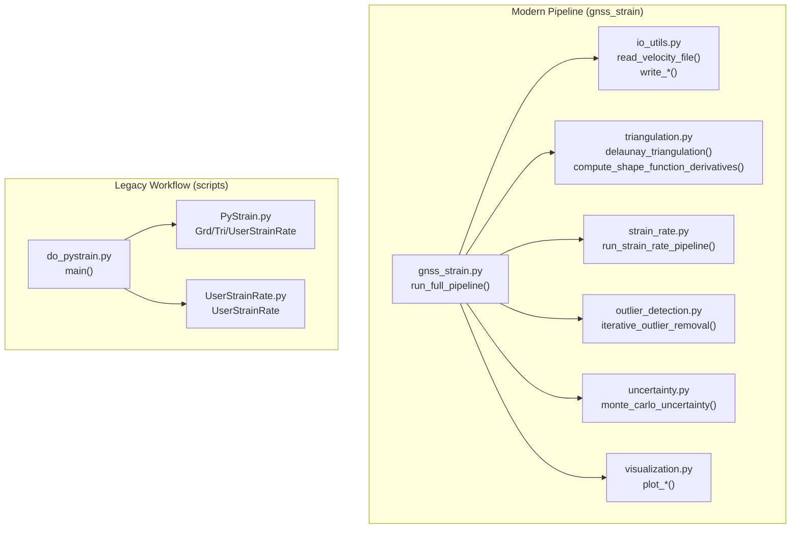
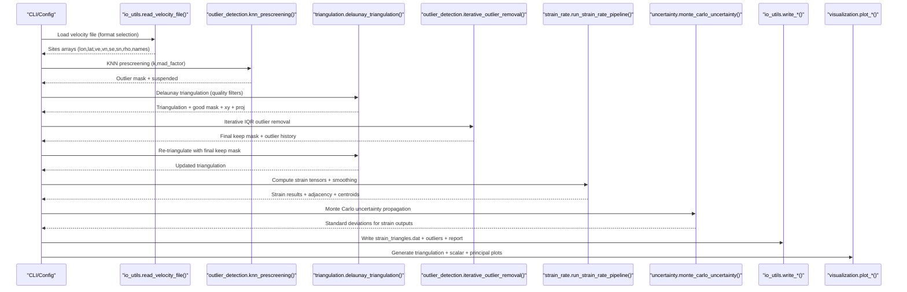
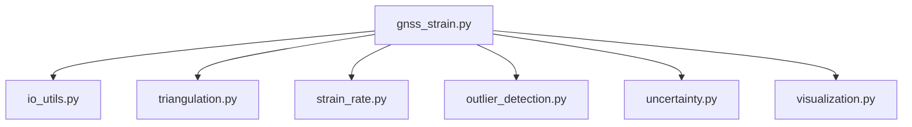

# Main Strain Computation Script

<cite>
**Referenced Files in This Document**
- [do_pystrain.py](file://src/pystrain/scripts/do_pystrain.py)
- [PyStrain.py](file://src/pystrain/PyStrain.py)
- [UserStrainRate.py](file://src/pystrain/UserStrainRate.py)
- [config.yaml](file://test/config.yaml)
- [gnss_strain.py](file://src/pystrain/gnss_strain/gnss_strain.py)
- [config_default.yaml](file://src/pystrain/gnss_strain/config_default.yaml)
- [io_utils.py](file://src/pystrain/gnss_strain/io_utils.py)
- [strain_rate.py](file://src/pystrain/gnss_strain/strain_rate.py)
- [triangulation.py](file://src/pystrain/gnss_strain/triangulation.py)
- [outlier_detection.py](file://src/pystrain/gnss_strain/outlier_detection.py)
- [uncertainty.py](file://src/pystrain/gnss_strain/uncertainty.py)
- [visualization.py](file://src/pystrain/gnss_strain/visualization.py)
</cite>

## Table of Contents
1. [Introduction](#introduction)
2. [Project Structure](#project-structure)
3. [Core Components](#core-components)
4. [Architecture Overview](#architecture-overview)
5. [Detailed Component Analysis](#detailed-component-analysis)
6. [Dependency Analysis](#dependency-analysis)
7. [Performance Considerations](#performance-considerations)
8. [Troubleshooting Guide](#troubleshooting-guide)
9. [Conclusion](#conclusion)
10. [Appendices](#appendices)

## Introduction
This document provides comprehensive documentation for the main strain computation workflow in the PyStrain project. It focuses on the primary script and modules responsible for GNSS-derived strain rate estimation, covering the command-line interface, configuration options, processing modes, and output generation. The documentation explains the end-to-end execution flow from configuration loading through strain rate estimation for triangular mesh-based methods, along with outlier detection, smoothing, uncertainty quantification, and visualization. Practical usage scenarios, error handling, and troubleshooting procedures are included to support both single-region analysis and automated batch workflows.

## Project Structure
The strain computation functionality spans two major pathways:
- A modern, modular pipeline under src/pystrain/gnss_strain implementing a triangulation-based approach with robust quality control, outlier detection, smoothing, and uncertainty propagation.
- A legacy script-based workflow under src/pystrain/scripts/do_pystrain.py orchestrating grid, triangular mesh, and user-defined point strain estimations via classes in src/pystrain/PyStrain.py.

Key modules and their roles:
- gnss_strain.py: Orchestrates the full pipeline, including data loading, triangulation, outlier detection, strain computation, smoothing, uncertainty, and output.
- io_utils.py: Reads velocity and polygon files, writes strain outputs and reports.
- triangulation.py: Performs Delaunay triangulation, quality filtering, shape function derivatives, adjacency building, and projection utilities.
- strain_rate.py: Computes strain tensors per triangle, applies smoothing, and interpolates to sites.
- outlier_detection.py: Implements KNN prescreening and iterative IQR-based outlier removal.
- uncertainty.py: Monte Carlo propagation of velocity uncertainties to strain outputs.
- visualization.py: Generates triangulation plots, scalar fields, and principal strain cross plots.
- do_pystrain.py: Legacy orchestration script for grid, triangular mesh, and user-defined point methods.
- PyStrain.py: Contains StrainRate classes for grid, triangular mesh, and user-defined point methods.
- UserStrainRate.py: Legacy user-defined point strain estimation class.
- config.yaml: Example configuration for the legacy workflow.
- config_default.yaml: Default configuration for the modern pipeline.

**Diagram sources**
- [gnss_strain.py:348-406](file://src/pystrain/gnss_strain/gnss_strain.py#L348-L406)
- [io_utils.py:21-132](file://src/pystrain/gnss_strain/io_utils.py#L21-L132)
- [triangulation.py:89-146](file://src/pystrain/gnss_strain/triangulation.py#L89-L146)
- [strain_rate.py:384-437](file://src/pystrain/gnss_strain/strain_rate.py#L384-L437)
- [outlier_detection.py:184-291](file://src/pystrain/gnss_strain/outlier_detection.py#L184-L291)
- [uncertainty.py:14-149](file://src/pystrain/gnss_strain/uncertainty.py#L14-L149)
- [visualization.py:18-250](file://src/pystrain/gnss_strain/visualization.py#L18-L250)
- [do_pystrain.py:7-36](file://src/pystrain/scripts/do_pystrain.py#L7-L36)
- [PyStrain.py:552-807](file://src/pystrain/PyStrain.py#L552-L807)
- [UserStrainRate.py:5-126](file://src/pystrain/UserStrainRate.py#L5-L126)

**Section sources**
- [gnss_strain.py:348-406](file://src/pystrain/gnss_strain/gnss_strain.py#L348-L406)
- [do_pystrain.py:7-36](file://src/pystrain/scripts/do_pystrain.py#L7-L36)

## Core Components
This section documents the modern pipeline’s core components and their responsibilities.

- run_full_pipeline: Top-level orchestrator that loads data, performs KNN prescreening, triangulation with quality control, iterative outlier removal, strain computation, smoothing, uncertainty propagation, and output writing.
- io_utils: Handles reading velocity and polygon files, converting to arrays, and writing strain outputs, outlier reports, and summary statistics.
- triangulation: Implements Delaunay triangulation, polygon clipping, quality filters (edge length percentiles, minimum angle, area thresholds), absolute edge length cutoff, shape function derivatives, adjacency graph construction, and projection utilities.
- strain_rate: Computes velocity gradients to strain tensors per triangle, derives principal strains and invariants, applies spatial smoothing, and interpolates to sites.
- outlier_detection: Applies KNN-based prescreening and iterative IQR-based residual detection to remove outliers.
- uncertainty: Propagates velocity uncertainties via Monte Carlo sampling to estimate standard deviations for strain outputs.
- visualization: Produces triangulation plots, scalar field maps, and principal strain cross diagrams.

**Section sources**
- [gnss_strain.py:52-341](file://src/pystrain/gnss_strain/gnss_strain.py#L52-L341)
- [io_utils.py:21-270](file://src/pystrain/gnss_strain/io_utils.py#L21-L270)
- [triangulation.py:89-477](file://src/pystrain/gnss_strain/triangulation.py#L89-L477)
- [strain_rate.py:18-438](file://src/pystrain/gnss_strain/strain_rate.py#L18-L438)
- [outlier_detection.py:17-292](file://src/pystrain/gnss_strain/outlier_detection.py#L17-L292)
- [uncertainty.py:14-150](file://src/pystrain/gnss_strain/uncertainty.py#L14-L150)
- [visualization.py:18-250](file://src/pystrain/gnss_strain/visualization.py#L18-L250)

## Architecture Overview
The modern pipeline follows a staged workflow with explicit quality control and uncertainty quantification.

**Diagram sources**
- [gnss_strain.py:92-341](file://src/pystrain/gnss_strain/gnss_strain.py#L92-L341)
- [io_utils.py:21-132](file://src/pystrain/gnss_strain/io_utils.py#L21-L132)
- [outlier_detection.py:17-292](file://src/pystrain/gnss_strain/outlier_detection.py#L17-L292)
- [triangulation.py:89-146](file://src/pystrain/gnss_strain/triangulation.py#L89-L146)
- [strain_rate.py:384-437](file://src/pystrain/gnss_strain/strain_rate.py#L384-L437)
- [uncertainty.py:14-149](file://src/pystrain/gnss_strain/uncertainty.py#L14-L149)
- [io_utils.py:186-270](file://src/pystrain/gnss_strain/io_utils.py#L186-L270)
- [visualization.py:18-250](file://src/pystrain/gnss_strain/visualization.py#L18-L250)

## Detailed Component Analysis

### Command-Line Interface and Configuration
The modern pipeline exposes a comprehensive CLI with arguments for data input, triangulation controls, smoothing, outlier detection, Monte Carlo uncertainty, and output directory. Configuration can be supplied via a YAML file with defaults.

Key CLI arguments:
- --config: Path to YAML configuration file.
- --vel_file: Velocity file path.
- --poly_file: Polygon boundary file path.
- --output_dir: Output directory.
- --format: Input velocity file format (auto|gmt|globk).
- Smoothing: --smooth_weight, --smooth_iter.
- Triangulation: --min_angle_deg, --max_edge_pctl, --max_edge_factor, --min_spacing_km, --max_edge_km.
- Uncertainty: --mc_iterations.
- Outlier detection: --k_neighbors, --mad_factor, --iqr_factor, --max_outlier_iter.

Configuration precedence:
- Explicit CLI overrides take effect after loading the YAML configuration.

Default configuration options (YAML):
- data.vel_file, data.poly_file, data.output_dir, data.format.
- outlier_detection.k_neighbors, outlier_detection.mad_factor, outlier_detection.iqr_factor, outlier_detection.max_iterations.
- triangulation.min_angle_deg, triangulation.max_edge_pctl, triangulation.max_edge_factor, triangulation.min_spacing_km, triangulation.max_edge_km.
- smoothing.weight, smoothing.iterations.
- uncertainty.mc_iterations.
- visualization.dpi, visualization.save_figures, visualization.show_figures.

Practical usage examples:
- Single-region analysis: Provide --vel_file and optional --poly_file; adjust smoothing and triangulation thresholds as needed.
- Multi-method processing: Use YAML to enable multiple processing modes (grid, triangular mesh, user-defined points) in the legacy workflow.
- Automated batch workflows: Combine YAML-driven configuration with scheduled runs and output parsing.

**Section sources**
- [gnss_strain.py:352-405](file://src/pystrain/gnss_strain/gnss_strain.py#L352-L405)
- [config_default.yaml:6-69](file://src/pystrain/gnss_strain/config_default.yaml#L6-L69)
- [config.yaml:4-73](file://test/config.yaml#L4-L73)

### Execution Flow: Modern Pipeline
End-to-end flow:
1. Data loading: Read velocity file and optional polygon; thin sites if requested; derive convex hull if no polygon provided.
2. KNN prescreening: Flag potential outliers and suspended sites based on neighbor median deviations.
3. Triangulation: Perform Delaunay triangulation with polygon clipping and quality filters; optionally enforce absolute edge length.
4. Iterative outlier removal: Re-triangulate and detect outliers via residual IQR; merge with initial prescreening results.
5. Strain computation: Compute strain tensors per triangle, derive principal strains and invariants, apply spatial smoothing.
6. Uncertainty: Monte Carlo propagation of velocity uncertainties to strain outputs.
7. Output: Write strain results, outlier history, and summary report; generate diagnostic plots.

Progress reporting:
- Console prints indicate stages and key statistics (e.g., number of triangles, removed/used sites, mean uncertainty).

**Section sources**
- [gnss_strain.py:92-341](file://src/pystrain/gnss_strain/gnss_strain.py#L92-L341)

### Triangulation and Quality Control
- Projection: Convert lat/lon to UTM-like km coordinates for natural strain units.
- Delaunay triangulation: Build initial triangulation; clip by polygon; apply filters for minimum angle, edge length percentiles, and absolute edge length.
- Shape functions: Compute B matrices for gradient calculations.
- Adjacency: Build neighbor relationships for smoothing.

Parameters:
- min_angle_deg: Minimum internal angle threshold.
- max_edge_pctl: Percentile threshold for edge lengths.
- max_edge_factor: Factor scaling the percentile threshold.
- min_spacing_km: Optional site thinning by spacing.
- max_edge_km: Absolute upper bound for triangle edges.

**Section sources**
- [triangulation.py:89-256](file://src/pystrain/gnss_strain/triangulation.py#L89-L256)
- [triangulation.py:312-368](file://src/pystrain/gnss_strain/triangulation.py#L312-L368)
- [triangulation.py:375-416](file://src/pystrain/gnss_strain/triangulation.py#L375-L416)

### Strain Rate Estimation and Smoothing
- Velocity gradient to strain tensors: Compute L from B and nodal velocities; extract strain components and rotation.
- Principal strains and invariants: Derive e1, e2, azimuth, dilatation, max shear, and second invariant.
- Smoothing: Spatial weighted averaging with adjustable weight and iterations; recompute derived quantities.

**Section sources**
- [strain_rate.py:18-119](file://src/pystrain/gnss_strain/strain_rate.py#L18-L119)
- [strain_rate.py:205-271](file://src/pystrain/gnss_strain/strain_rate.py#L205-L271)
- [strain_rate.py:384-437](file://src/pystrain/gnss_strain/strain_rate.py#L384-L437)

### Outlier Detection and Iterative Removal
- KNN prescreening: Compare each site’s velocity to neighbors’ medians using MAD; flag outliers and suspended sites.
- Residual IQR: Compute residuals on the triangulated mesh; iteratively remove outliers exceeding IQR thresholds.

**Section sources**
- [outlier_detection.py:17-87](file://src/pystrain/gnss_strain/outlier_detection.py#L17-L87)
- [outlier_detection.py:94-177](file://src/pystrain/gnss_strain/outlier_detection.py#L94-L177)
- [outlier_detection.py:184-292](file://src/pystrain/gnss_strain/outlier_detection.py#L184-L292)

### Uncertainty Quantification (Monte Carlo)
- Fixed topology Monte Carlo: Repeatedly perturb velocity vectors using covariance matrices; compute strain tensors; collect standard deviations.
- Outputs include standard deviations for all strain components and derived invariants.

**Section sources**
- [uncertainty.py:14-149](file://src/pystrain/gnss_strain/uncertainty.py#L14-L149)

### Output Generation and Visualization
- Text outputs: strain_triangles.dat (triangular centroids, strain components, optional uncertainties), outliers.txt, report.txt.
- Plots: triangulation overlay, dilatation, maximum shear, and principal strain cross diagrams.

**Section sources**
- [io_utils.py:186-270](file://src/pystrain/gnss_strain/io_utils.py#L186-L270)
- [visualization.py:18-250](file://src/pystrain/gnss_strain/visualization.py#L18-L250)

### Legacy Workflow: Grid, Triangular Mesh, and User-Defined Points
The legacy do_pystrain.py script orchestrates three methods:
- Grid points: Estimates strain rates on a regular longitude/latitude grid using distance-weighted least squares; supports optional azimuth checks and smoothing.
- Triangular mesh: Uses scipy.spatial.Delaunay to compute strain rates at triangle centroids; masks flat triangles.
- User-defined points: Computes strain rates at user-specified locations using nearest stations within a distance threshold.

Configuration highlights:
- strain_rate.activate, grdmesh.activate, trimesh.activate, usrmesh.activate.
- grdmesh/usrmesh parameters: maxdist, minsite, chkazim, grdsmooth.activate/smoothfactor.
- trimesh parameters: trismooth.activate/smoothfactor.

**Section sources**
- [do_pystrain.py:7-36](file://src/pystrain/scripts/do_pystrain.py#L7-L36)
- [PyStrain.py:552-807](file://src/pystrain/PyStrain.py#L552-L807)
- [PyStrain.py:810-933](file://src/pystrain/PyStrain.py#L810-L933)
- [config.yaml:4-73](file://test/config.yaml#L4-L73)

## Dependency Analysis
The modern pipeline exhibits strong modularity with clear boundaries between data I/O, triangulation, strain computation, outlier detection, uncertainty, and visualization.

**Diagram sources**
- [gnss_strain.py:17-27](file://src/pystrain/gnss_strain/gnss_strain.py#L17-L27)
- [io_utils.py:17-18](file://src/pystrain/gnss_strain/io_utils.py#L17-L18)
- [triangulation.py:13-15](file://src/pystrain/gnss_strain/triangulation.py#L13-L15)
- [strain_rate.py:8-11](file://src/pystrain/gnss_strain/strain_rate.py#L8-L11)
- [outlier_detection.py:9-10](file://src/pystrain/gnss_strain/outlier_detection.py#L9-L10)
- [uncertainty.py:8-11](file://src/pystrain/gnss_strain/uncertainty.py#L8-L11)
- [visualization.py:11-14](file://src/pystrain/gnss_strain/visualization.py#L11-L14)

**Section sources**
- [gnss_strain.py:17-27](file://src/pystrain/gnss_strain/gnss_strain.py#L17-L27)

## Performance Considerations
- Triangulation cost: Delaunay triangulation scales with O(N log N) average case; quality filters reduce the number of triangles and improve conditioning.
- Outlier detection: KNN queries and iterative removal introduce additional computational overhead; tune k_neighbors and max_iterations to balance accuracy and speed.
- Smoothing: Weighted averaging over adjacency increases runtime; adjust iterations and weight judiciously.
- Monte Carlo uncertainty: Increase mc_iterations for stability at the cost of computation time.
- I/O: Batch processing multiple regions benefits from parallelization across independent datasets.

[No sources needed since this section provides general guidance]

## Troubleshooting Guide
Common configuration and processing issues:
- Missing velocity file: Ensure --vel_file points to an existing file; otherwise, a FileNotFoundError is raised.
- Insufficient triangles after quality filtering: Relax min_angle_deg, increase max_edge_pctl, or reduce max_edge_km.
- Too few sites retained after outlier removal: Reduce iqr_factor or increase k_neighbors; verify data quality and format.
- No valid triangles for MC uncertainty: Verify triangulation succeeded and sufficient triangles remain after filtering.
- Polygon issues: Ensure polygon file is valid and closed; otherwise, use automatic convex hull generation.
- Output directory permissions: Confirm write access to output_dir; the pipeline creates directories automatically.

Validation checks:
- Input format detection: Auto-detection based on column count; specify --format explicitly if needed.
- Station thinning: Verify min_spacing_km is appropriate for the dataset density.
- Smoothing convergence: Monitor mean uncertainty values and adjust smooth_weight and iterations.

**Section sources**
- [gnss_strain.py:125-129](file://src/pystrain/gnss_strain/gnss_strain.py#L125-L129)
- [gnss_strain.py:166-168](file://src/pystrain/gnss_strain/gnss_strain.py#L166-L168)
- [uncertainty.py:51-52](file://src/pystrain/gnss_strain/uncertainty.py#L51-L52)

## Conclusion
The modern PyStrain pipeline offers a robust, configurable, and transparent workflow for GNSS-derived strain rate estimation. Its modular design enables precise control over triangulation quality, outlier detection, smoothing, and uncertainty quantification, while delivering comprehensive diagnostics and visualizations. The legacy workflow remains useful for grid and triangular mesh methods, while the modern pipeline is recommended for most applications requiring rigorous quality control and uncertainty propagation.

[No sources needed since this section summarizes without analyzing specific files]

## Appendices

### Practical Usage Scenarios
- Single-region analysis:
  - Prepare a YAML configuration with data.vel_file, optional data.poly_file, and desired smoothing and triangulation parameters.
  - Run the modern pipeline; inspect output_dir for strain_triangles.dat, outliers.txt, report.txt, and figures/.
- Multi-method processing (legacy):
  - Enable grdmesh, trimesh, and/or usrmesh in config.yaml; run do_pystrain.py to produce multiple output sets.
- Automated batch workflows:
  - Iterate over regions or configurations; parse report.txt and figures for quality assessment; archive results systematically.

[No sources needed since this section provides general guidance]