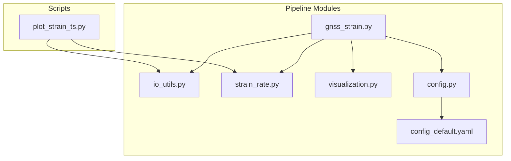
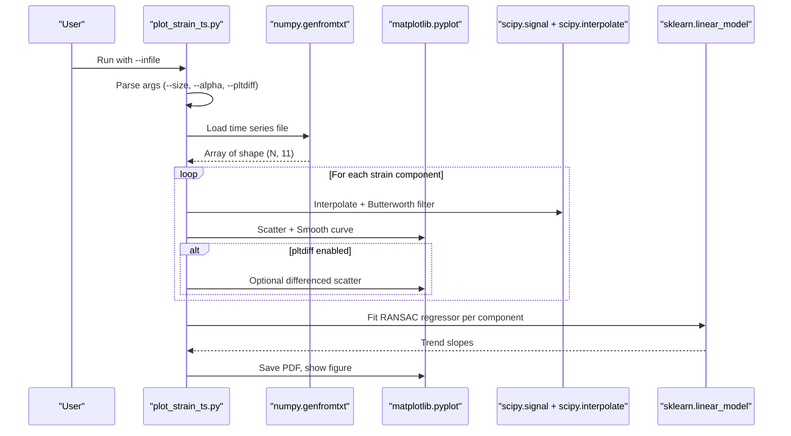
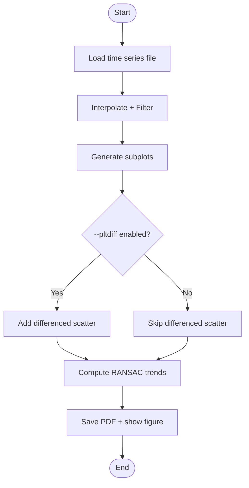
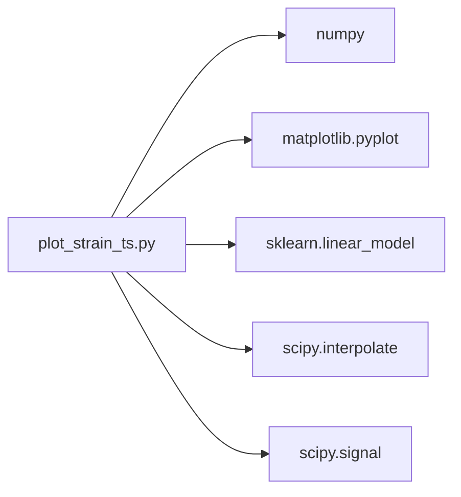

# Time Series Plotting Tool

<cite>
**Referenced Files in This Document**
- [plot_strain_ts.py](file://src/pystrain/scripts/plot_strain_ts.py)
- [gnss_strain.py](file://src/pystrain/gnss_strain/gnss_strain.py)
- [io_utils.py](file://src/pystrain/gnss_strain/io_utils.py)
- [strain_rate.py](file://src/pystrain/gnss_strain/strain_rate.py)
- [visualization.py](file://src/pystrain/gnss_strain/visualization.py)
- [config.py](file://src/pystrain/gnss_strain/config.py)
- [config_default.yaml](file://src/pystrain/gnss_strain/config_default.yaml)
- [config.yaml](file://test/config.yaml)
</cite>

## Table of Contents
1. [Introduction](#introduction)
2. [Project Structure](#project-structure)
3. [Core Components](#core-components)
4. [Architecture Overview](#architecture-overview)
5. [Detailed Component Analysis](#detailed-component-analysis)
6. [Dependency Analysis](#dependency-analysis)
7. [Performance Considerations](#performance-considerations)
8. [Troubleshooting Guide](#troubleshooting-guide)
9. [Conclusion](#conclusion)
10. [Appendices](#appendices)

## Introduction
This document provides comprehensive documentation for the plot_strain_ts.py utility, which visualizes strain rate time series across spatial domains. It explains command-line arguments, input file formats, plotting options, customization capabilities, output formats, and export features. It also covers practical workflows for regional time series analysis, trend visualization, and comparative plotting between different analysis methods. Guidance is included for data formatting, plot interpretation, integration with the main strain computation pipeline, and performance considerations for large time series datasets.

## Project Structure
The plotting utility resides under src/pystrain/scripts and integrates with the broader GNSS strain computation pipeline located under src/pystrain/gnss_strain. The pipeline includes modules for I/O, triangulation, strain rate computation, uncertainty estimation, outlier detection, and visualization.

**Diagram sources**
- [plot_strain_ts.py:1-143](file://src/pystrain/scripts/plot_strain_ts.py#L1-L143)
- [gnss_strain.py:1-407](file://src/pystrain/gnss_strain/gnss_strain.py#L1-L407)
- [io_utils.py:1-270](file://src/pystrain/gnss_strain/io_utils.py#L1-L270)
- [strain_rate.py:1-438](file://src/pystrain/gnss_strain/strain_rate.py#L1-L438)
- [visualization.py:1-250](file://src/pystrain/gnss_strain/visualization.py#L1-L250)
- [config.py:1-242](file://src/pystrain/gnss_strain/config.py#L1-L242)
- [config_default.yaml:1-69](file://src/pystrain/gnss_strain/config_default.yaml#L1-L69)

**Section sources**
- [plot_strain_ts.py:1-143](file://src/pystrain/scripts/plot_strain_ts.py#L1-L143)
- [gnss_strain.py:1-407](file://src/pystrain/gnss_strain/gnss_strain.py#L1-L407)

## Core Components
- plot_strain_ts.py: Standalone time series plotting utility that reads a tabular file containing time series of strain rate components and generates a composite figure with filtered trends and optional differenced plots.
- gnss_strain.py: Main pipeline orchestrating GNSS velocity-to-strain-rate computation, including triangulation, outlier detection, strain rate calculation, uncertainty estimation, and figure generation.
- io_utils.py: Provides I/O utilities for reading velocity files and writing strain output, including documented column formats.
- strain_rate.py: Implements core strain rate computation from velocity gradients, principal strain decomposition, and smoothing.
- visualization.py: Provides reusable visualization functions for triangulation, scalar fields, and principal strain cross plots.
- config.py and config_default.yaml: Configuration management and defaults for the main pipeline, including parameters relevant to time series workflows.

**Section sources**
- [plot_strain_ts.py:1-143](file://src/pystrain/scripts/plot_strain_ts.py#L1-L143)
- [gnss_strain.py:1-407](file://src/pystrain/gnss_strain/gnss_strain.py#L1-L407)
- [io_utils.py:1-270](file://src/pystrain/gnss_strain/io_utils.py#L1-L270)
- [strain_rate.py:1-438](file://src/pystrain/gnss_strain/strain_rate.py#L1-L438)
- [visualization.py:1-250](file://src/pystrain/gnss_strain/visualization.py#L1-L250)
- [config.py:1-242](file://src/pystrain/gnss_strain/config.py#L1-L242)
- [config_default.yaml:1-69](file://src/pystrain/gnss_strain/config_default.yaml#L1-L69)

## Architecture Overview
The plotting utility operates independently of the main pipeline but consumes the same data formats. The main pipeline produces a structured output suitable for time series analysis, while the plotting utility focuses on visualization and trend extraction.

**Diagram sources**
- [plot_strain_ts.py:9-139](file://src/pystrain/scripts/plot_strain_ts.py#L9-L139)

## Detailed Component Analysis

### plot_strain_ts.py: Command-Line Arguments and Behavior
- Purpose: Visualize time series of strain rate components and optionally show differenced plots and robust linear trends.
- Input file format: Tabular text file with 11 columns representing time and strain components. The utility interprets columns 3–10 as strain components and converts them to units of 1e-9.
- Output: A single PDF figure saved in the same directory as the input file, named with the input stem.

Key arguments:
- --infile: Path to the input time series file (required).
- --size: Point size for scatter markers (default: 5).
- --alpha: Transparency for scatter points (default: 0.4).
- --pltdiff: Enable differenced scatter plots alongside smoothed curves (default: False).

Processing highlights:
- Reads the input file using numpy.genfromtxt.
- Applies interpolation and a Butterworth low-pass filter to smooth each component.
- Generates eight subplots (two per row) for Exx, Exy, Eyy, Omega, E1, E2, Shear, and Dilation.
- Adds optional differenced scatter plots when enabled.
- Computes robust linear trends via RANSAC regression per component and prints slope estimates.

Practical usage examples:
- Regional time series analysis: Use --size and --alpha to adjust visibility for dense datasets.
- Trend visualization: Enable --pltdiff to compare raw differences with smoothed trends.
- Comparative plotting: Run multiple instances with different --size and --alpha to overlay datasets.

**Section sources**
- [plot_strain_ts.py:11-139](file://src/pystrain/scripts/plot_strain_ts.py#L11-L139)

### Input File Formats and Data Requirements
- plot_strain_ts.py expects a numeric, whitespace-delimited file with at least 11 columns. The utility treats columns 3–10 as strain components and multiplies by 1e9 for display in 1e-9 units.
- The main pipeline’s output format for strain triangles is documented in io_utils.py, including column names and units. While the plotting utility does not consume this exact format, it can visualize any compatible time series file produced by external or internal processes.

Data formatting requirements:
- Numeric entries only; missing or malformed entries are skipped by numpy.genfromtxt.
- Consistent time spacing is recommended for meaningful interpolation and filtering.
- Units: Strain components are internally scaled to 1e-9 for consistent axis labeling.

Integration with the main pipeline:
- The main pipeline writes strain triangle data suitable for spatial analysis. Users can extract time series for specific regions or sites and feed them into plot_strain_ts.py for temporal visualization.

**Section sources**
- [plot_strain_ts.py:26-26](file://src/pystrain/scripts/plot_strain_ts.py#L26-L26)
- [io_utils.py:186-230](file://src/pystrain/gnss_strain/io_utils.py#L186-L230)
- [gnss_strain.py:266-267](file://src/pystrain/gnss_strain/gnss_strain.py#L266-L267)

### Plotting Options and Customization
- Scatter markers: Configurable size and transparency via --size and --alpha.
- Smoothing: Interpolation onto a fine time grid followed by a Butterworth filter with fixed order and cutoff.
- Filtering: Fixed fourth-order Butterworth filter with normalized cutoff; ensures stable smoothing without phase distortion.
- Optional differenced plots: When --pltdiff is enabled, differenced values are plotted as small scatters to highlight short-term variability.
- Output format: Saved as a PDF with tight bounding box and high-resolution layout.

Customization tips:
- Adjust --size to balance density and readability for large datasets.
- Tune --alpha to reduce overplotting in dense regions.
- Use --pltdiff to inspect noise characteristics and validate smoothing effectiveness.

**Section sources**
- [plot_strain_ts.py:30-119](file://src/pystrain/scripts/plot_strain_ts.py#L30-L119)

### Export Capabilities
- The utility saves a single PDF file named after the input file stem.
- The figure includes a global title derived from the input filename and tight subplot spacing.

Export considerations:
- PDF preserves vector quality for publication-grade figures.
- For interactive exploration, use --pltdiff and review the displayed figure.

**Section sources**
- [plot_strain_ts.py:121-124](file://src/pystrain/scripts/plot_strain_ts.py#L121-L124)

### Practical Workflows and Interpretation Guidelines
Common workflows:
- Regional time series analysis: Prepare a time series file for a region of interest and run the plotting utility to visualize temporal evolution of strain components.
- Trend visualization: Enable differenced plots to assess stationarity and highlight persistent shifts.
- Comparative plotting: Overlay multiple datasets by varying --size and --alpha to compare regional trends.

Interpretation guidelines:
- Exx, Exy, Eyy: Components of the strain rate tensor; positive values indicate extensional or compressional regimes depending on sign and context.
- Omega: Rotation rate component; indicates rigid-body rotation superimposed on deformation.
- E1, E2: Principal strain rates; E1 is the more extensional (or less compressional), E2 is the more compressional (or less extensional).
- Shear: Maximum shear strain rate magnitude; useful for identifying localized deformation.
- Dilation: Volume change rate; positive indicates expansion, negative indicates contraction.

Integration with the main pipeline:
- Use the main pipeline to compute strain rates on a triangular mesh and extract time series for specific regions or sites. Feed these into plot_strain_ts.py for temporal visualization.

**Section sources**
- [plot_strain_ts.py:29-119](file://src/pystrain/scripts/plot_strain_ts.py#L29-L119)
- [strain_rate.py:44-119](file://src/pystrain/gnss_strain/strain_rate.py#L44-L119)
- [gnss_strain.py:266-267](file://src/pystrain/gnss_strain/gnss_strain.py#L266-L267)

### Conceptual Overview
The plotting utility complements the main pipeline by focusing on temporal visualization. It does not replace the pipeline’s spatial computations but serves as a downstream analysis tool for time series extracted from the pipeline’s results.

[No sources needed since this diagram shows conceptual workflow, not actual code structure]

## Dependency Analysis
The plotting utility depends on standard scientific Python libraries for numerical processing, signal processing, and visualization. It does not depend on the main pipeline modules, enabling standalone operation.

**Diagram sources**
- [plot_strain_ts.py:1-8](file://src/pystrain/scripts/plot_strain_ts.py#L1-L8)

**Section sources**
- [plot_strain_ts.py:1-8](file://src/pystrain/scripts/plot_strain_ts.py#L1-L8)

## Performance Considerations
- Memory footprint: The utility loads the entire time series into memory using numpy.genfromtxt. For very long time series, consider downsampling or segmenting the dataset prior to plotting.
- Computation cost: Interpolation and filtering are performed per component; the fixed order and cutoff ensure consistent performance. For extremely long series, consider reducing --size and --alpha to minimize rendering overhead.
- Disk I/O: The utility writes a single PDF file; ensure sufficient disk space for output.

Optimization techniques:
- Reduce --size and --alpha for dense datasets to improve rendering speed.
- Pre-filter or decimate input data to limit the number of time steps.
- Use smaller figure sizes or fewer subplots if needed.

[No sources needed since this section provides general guidance]

## Troubleshooting Guide
Common issues and resolutions:
- Input file not found: Ensure the path provided to --infile exists and is readable.
- Unexpected output: Verify that the input file contains at least 11 numeric columns and consistent time spacing.
- Overplotting: Increase --size and/or --alpha to improve visibility; alternatively, segment the time series.
- Poor smoothing: The smoothing uses fixed parameters; consider preprocessing the data externally if different filter characteristics are desired.

**Section sources**
- [plot_strain_ts.py:22-24](file://src/pystrain/scripts/plot_strain_ts.py#L22-L24)
- [plot_strain_ts.py:30-34](file://src/pystrain/scripts/plot_strain_ts.py#L30-L34)

## Conclusion
The plot_strain_ts.py utility offers a streamlined solution for visualizing strain rate time series across spatial domains. It provides configurable scatter styles, smoothing, optional differenced plots, and robust trend estimation. By integrating with the main pipeline’s output, users can combine spatial and temporal analyses to gain comprehensive insights into regional deformation dynamics.

[No sources needed since this section summarizes without analyzing specific files]

## Appendices

### Appendix A: Main Pipeline Integration Notes
- The main pipeline computes strain rates on a triangular mesh and writes output files suitable for spatial analysis. Users can extract time series for specific regions or sites and visualize them with plot_strain_ts.py.
- Configuration management allows tuning of triangulation quality, smoothing, outlier detection, and uncertainty estimation parameters.

**Section sources**
- [gnss_strain.py:266-267](file://src/pystrain/gnss_strain/gnss_strain.py#L266-L267)
- [config.py:1-242](file://src/pystrain/gnss_strain/config.py#L1-L242)
- [config_default.yaml:1-69](file://src/pystrain/gnss_strain/config_default.yaml#L1-L69)
- [config.yaml:74-123](file://test/config.yaml#L74-L123)