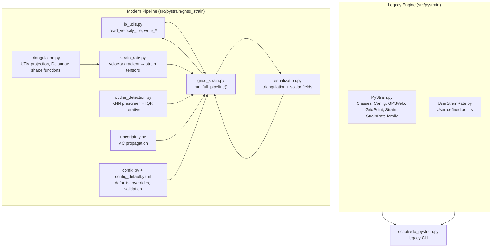
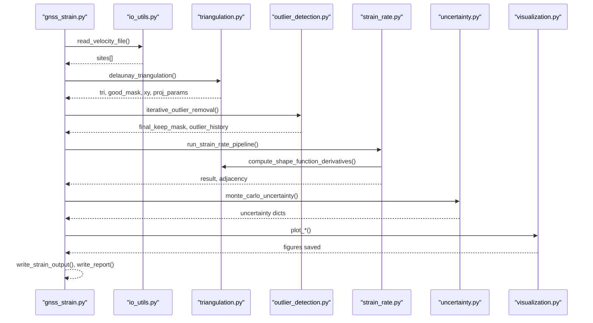
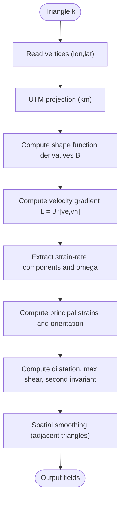
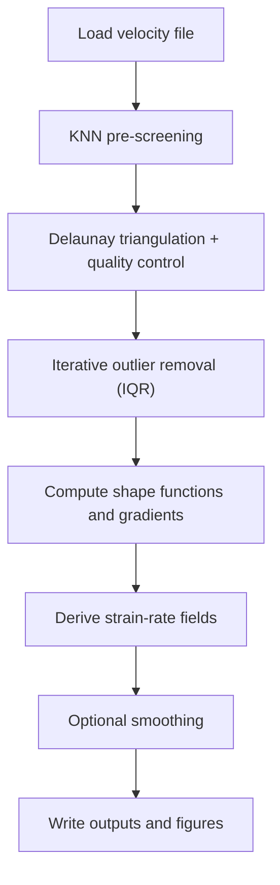
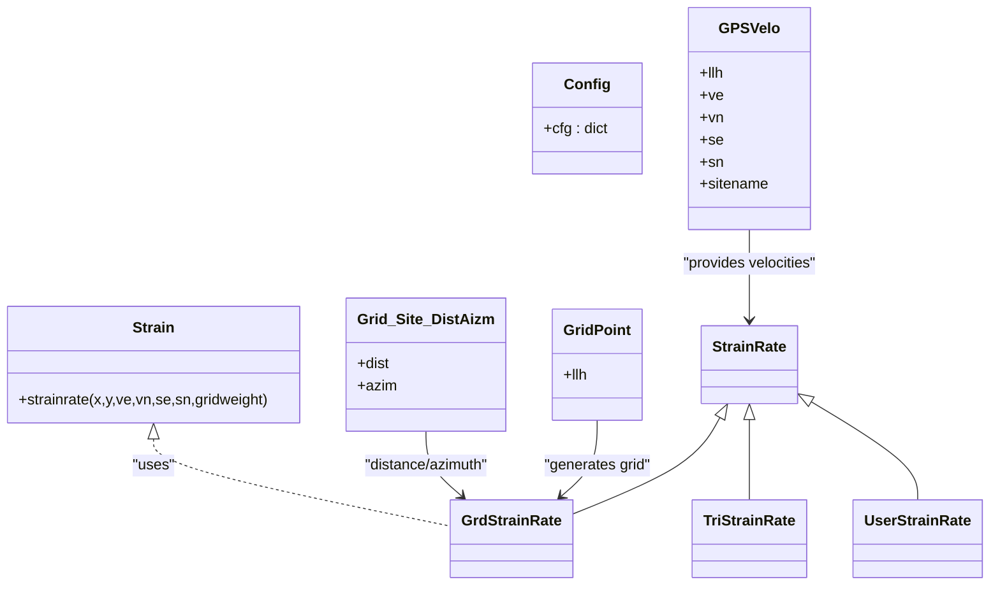
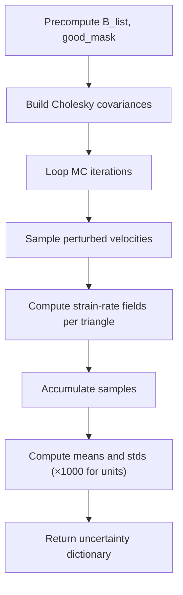
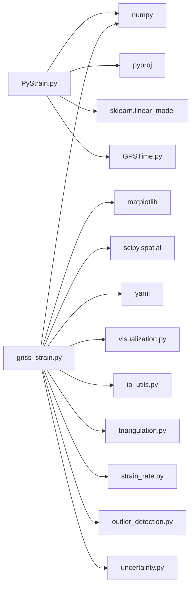

# Computational Engine

<cite>
**Referenced Files in This Document**
- [PyStrain.py](file://src/pystrain/PyStrain.py)
- [gnss_strain.py](file://src/pystrain/gnss_strain/gnss_strain.py)
- [strain_rate.py](file://src/pystrain/gnss_strain/strain_rate.py)
- [triangulation.py](file://src/pystrain/gnss_strain/triangulation.py)
- [io_utils.py](file://src/pystrain/gnss_strain/io_utils.py)
- [uncertainty.py](file://src/pystrain/gnss_strain/uncertainty.py)
- [outlier_detection.py](file://src/pystrain/gnss_strain/outlier_detection.py)
- [visualization.py](file://src/pystrain/gnss_strain/visualization.py)
- [config.py](file://src/pystrain/gnss_strain/config.py)
- [config_default.yaml](file://src/pystrain/gnss_strain/config_default.yaml)
- [do_pystrain.py](file://src/pystrain/scripts/do_pystrain.py)
- [UserStrainRate.py](file://src/pystrain/UserStrainRate.py)
</cite>

## Table of Contents
1. [Introduction](#introduction)
2. [Project Structure](#project-structure)
3. [Core Components](#core-components)
4. [Architecture Overview](#architecture-overview)
5. [Detailed Component Analysis](#detailed-component-analysis)
6. [Dependency Analysis](#dependency-analysis)
7. [Performance Considerations](#performance-considerations)
8. [Troubleshooting Guide](#troubleshooting-guide)
9. [Conclusion](#conclusion)
10. [Appendices](#appendices)

## Introduction
This document describes PyStrain’s computational engine for GPS-based strain rate estimation. It covers the main classes and algorithms, the GPS velocity data processing pipeline (coordinate transformations, quality filtering, uncertainty propagation), the mathematical foundations of strain rate computation, numerical methods, and optimization techniques. It also documents the integration of external libraries (numpy, scipy, matplotlib, pyproj, scikit-learn) and provides guidance on performance, memory management, scalability, and algorithmic comparisons.

## Project Structure
The computational engine is split into two primary pathways:
- Legacy grid/triangular mesh engine under src/pystrain/, centered on PyStrain.py and related classes.
- Modern GNSS-strain pipeline under src/pystrain/gnss_strain/, implementing robust triangulation, outlier detection, uncertainty propagation, and visualization.

Key modules:
- Data ingestion and IO: io_utils.py
- Triangulation and geometry: triangulation.py
- Strain rate computation: strain_rate.py
- Outlier detection: outlier_detection.py
- Uncertainty via Monte Carlo: uncertainty.py
- Visualization: visualization.py
- Configuration management: config.py and config_default.yaml
- Execution entry points: gnss_strain.py and do_pystrain.py

**Diagram sources**
- [PyStrain.py:98-800](file://src/pystrain/PyStrain.py#L98-L800)
- [UserStrainRate.py:1-126](file://src/pystrain/UserStrainRate.py#L1-L126)
- [gnss_strain.py:1-407](file://src/pystrain/gnss_strain/gnss_strain.py#L1-L407)
- [io_utils.py:1-270](file://src/pystrain/gnss_strain/io_utils.py#L1-L270)
- [triangulation.py:1-477](file://src/pystrain/gnss_strain/triangulation.py#L1-L477)
- [strain_rate.py:1-438](file://src/pystrain/gnss_strain/strain_rate.py#L1-L438)
- [outlier_detection.py:1-292](file://src/pystrain/gnss_strain/outlier_detection.py#L1-L292)
- [uncertainty.py:1-150](file://src/pystrain/gnss_strain/uncertainty.py#L1-L150)
- [visualization.py:1-250](file://src/pystrain/gnss_strain/visualization.py#L1-L250)
- [config.py:1-242](file://src/pystrain/gnss_strain/config.py#L1-L242)
- [config_default.yaml:1-69](file://src/pystrain/gnss_strain/config_default.yaml#L1-L69)
- [do_pystrain.py:1-39](file://src/pystrain/scripts/do_pystrain.py#L1-L39)

**Section sources**
- [PyStrain.py:98-800](file://src/pystrain/PyStrain.py#L98-L800)
- [gnss_strain.py:1-407](file://src/pystrain/gnss_strain/gnss_strain.py#L1-L407)
- [io_utils.py:1-270](file://src/pystrain/gnss_strain/io_utils.py#L1-L270)
- [triangulation.py:1-477](file://src/pystrain/gnss_strain/triangulation.py#L1-L477)
- [strain_rate.py:1-438](file://src/pystrain/gnss_strain/strain_rate.py#L1-L438)
- [outlier_detection.py:1-292](file://src/pystrain/gnss_strain/outlier_detection.py#L1-L292)
- [uncertainty.py:1-150](file://src/pystrain/gnss_strain/uncertainty.py#L1-L150)
- [visualization.py:1-250](file://src/pystrain/gnss_strain/visualization.py#L1-L250)
- [config.py:1-242](file://src/pystrain/gnss_strain/config.py#L1-L242)
- [config_default.yaml:1-69](file://src/pystrain/gnss_strain/config_default.yaml#L1-L69)
- [do_pystrain.py:1-39](file://src/pystrain/scripts/do_pystrain.py#L1-L39)

## Core Components
- Data ingestion and formats:
  - Velocity files (GMT/GLOBK/7-column) handled by io_utils.read_velocity_file and sites_to_arrays.
  - Polygon boundaries for study area masking.
- Triangulation and geometry:
  - UTM projection for Cartesian coordinates, Delaunay triangulation, quality filters (angles, edges, areas), adjacency graph, and shape function derivatives.
- Strain rate computation:
  - From velocity gradients on triangular elements to strain tensors and derived invariants.
- Quality control:
  - Pre-screening via KNN-MAD and iterative outlier removal via residual IQR on the triangulated mesh.
- Uncertainty propagation:
  - Monte Carlo sampling of velocity perturbations using per-site covariance matrices.
- Visualization:
  - Triangulation overlays, scalar fields, and principal strain cross plots.

**Section sources**
- [io_utils.py:21-132](file://src/pystrain/gnss_strain/io_utils.py#L21-L132)
- [triangulation.py:89-146](file://src/pystrain/gnss_strain/triangulation.py#L89-L146)
- [strain_rate.py:18-198](file://src/pystrain/gnss_strain/strain_rate.py#L18-L198)
- [outlier_detection.py:17-87](file://src/pystrain/gnss_strain/outlier_detection.py#L17-L87)
- [uncertainty.py:14-149](file://src/pystrain/gnss_strain/uncertainty.py#L14-L149)
- [visualization.py:18-250](file://src/pystrain/gnss_strain/visualization.py#L18-L250)

## Architecture Overview
The modern pipeline orchestrates data loading, triangulation, outlier detection, strain computation, smoothing, uncertainty, and output.

**Diagram sources**
- [gnss_strain.py:52-341](file://src/pystrain/gnss_strain/gnss_strain.py#L52-L341)
- [io_utils.py:21-132](file://src/pystrain/gnss_strain/io_utils.py#L21-L132)
- [triangulation.py:89-146](file://src/pystrain/gnss_strain/triangulation.py#L89-L146)
- [outlier_detection.py:184-291](file://src/pystrain/gnss_strain/outlier_detection.py#L184-L291)
- [strain_rate.py:384-437](file://src/pystrain/gnss_strain/strain_rate.py#L384-L437)
- [uncertainty.py:14-149](file://src/pystrain/gnss_strain/uncertainty.py#L14-L149)
- [visualization.py:18-250](file://src/pystrain/gnss_strain/visualization.py#L18-L250)

## Detailed Component Analysis

### Mathematical Foundations and Numerical Methods
- Velocity gradient to strain tensors:
  - On each triangle, velocity gradients are computed from shape function derivatives and nodal velocities, yielding the 2×2 velocity gradient tensor.
  - Strain rate components and rotation follow standard definitions from the symmetric and skew-symmetric parts of the velocity gradient.
  - Principal strains and directions are derived from eigen-decomposition of the strain-rate symmetric part.
  - Invariants include dilatation, maximum shear, and second invariant.
- Coordinate systems and projections:
  - Sites are projected from geographic coordinates to a local Cartesian system (UTM kilometers) to ensure natural units for strain rate computation.
- Smoothing:
  - Spatial smoothing via weighted averaging of neighboring triangles’ strain-rate fields, iteratively updating fields and recomputing derived quantities.
- Uncertainty propagation:
  - Monte Carlo sampling of per-site velocity vectors using Cholesky decomposition of the per-triangle covariance matrix, re-computing strain-rate fields across iterations, and reporting standard deviations.

**Diagram sources**
- [triangulation.py:312-368](file://src/pystrain/gnss_strain/triangulation.py#L312-L368)
- [strain_rate.py:18-119](file://src/pystrain/gnss_strain/strain_rate.py#L18-L119)
- [strain_rate.py:205-271](file://src/pystrain/gnss_strain/strain_rate.py#L205-L271)

**Section sources**
- [strain_rate.py:18-119](file://src/pystrain/gnss_strain/strain_rate.py#L18-L119)
- [strain_rate.py:205-271](file://src/pystrain/gnss_strain/strain_rate.py#L205-L271)
- [triangulation.py:312-368](file://src/pystrain/gnss_strain/triangulation.py#L312-L368)

### GPS Velocity Data Processing Pipeline
- Input formats:
  - GMT/GLOBK/7-column formats supported; automatic detection or explicit format selection.
- Quality filtering:
  - KNN pre-screening flags outliers based on neighborhood median absolute deviation.
  - Iterative IQR-based residual detection removes outliers consistently across triangulated residuals.
- Triangulation and masking:
  - Delaunay triangulation with polygon clipping, quality thresholds (min angle, max edge percentiles, min area), optional absolute edge length limit.
- Strain computation:
  - Shape-function derivative matrices used to compute velocity gradients and strain-rate fields on triangles.
- Output:
  - Text files for strain-rate fields and outlier reports; figures for triangulation, scalar fields, and principal strain crosses.

**Diagram sources**
- [gnss_strain.py:92-341](file://src/pystrain/gnss_strain/gnss_strain.py#L92-L341)
- [io_utils.py:21-132](file://src/pystrain/gnss_strain/io_utils.py#L21-L132)
- [outlier_detection.py:17-87](file://src/pystrain/gnss_strain/outlier_detection.py#L17-L87)
- [triangulation.py:89-146](file://src/pystrain/gnss_strain/triangulation.py#L89-L146)
- [strain_rate.py:384-437](file://src/pystrain/gnss_strain/strain_rate.py#L384-L437)

**Section sources**
- [gnss_strain.py:92-341](file://src/pystrain/gnss_strain/gnss_strain.py#L92-L341)
- [io_utils.py:21-132](file://src/pystrain/gnss_strain/io_utils.py#L21-L132)
- [outlier_detection.py:17-87](file://src/pystrain/gnss_strain/outlier_detection.py#L17-L87)
- [triangulation.py:89-146](file://src/pystrain/gnss_strain/triangulation.py#L89-L146)
- [strain_rate.py:384-437](file://src/pystrain/gnss_strain/strain_rate.py#L384-L437)

### Legacy Grid/Trimesh Engine (src/pystrain)
- Classes:
  - Config: YAML-based configuration loader.
  - GPSVelo: loads velocity fields in GMT/GLOBK formats.
  - GridPoint: generates regular longitude/latitude grids.
  - Strain: core strain-rate solver using weighted least-squares with distance-based weighting.
  - StrainRate family: GrdStrainRate, TriStrainRate, UserStrainRate implement estimation strategies.
- Coordinate transforms:
  - llh2utm and llh2localxy for local Cartesian conversions.
- Distance and azimuth:
  - Grid_Site_DistAizm computes geodesic distances/azimuths via pyproj.

**Diagram sources**
- [PyStrain.py:98-800](file://src/pystrain/PyStrain.py#L98-L800)
- [UserStrainRate.py:1-126](file://src/pystrain/UserStrainRate.py#L1-L126)

**Section sources**
- [PyStrain.py:98-800](file://src/pystrain/PyStrain.py#L98-L800)
- [UserStrainRate.py:1-126](file://src/pystrain/UserStrainRate.py#L1-L126)

### Uncertainty Propagation (Monte Carlo)
- Procedure:
  - Precompute shape-function derivatives and good triangle masks.
  - Build per-site covariance Cholesky decompositions, handling positive definiteness.
  - Iterate: sample perturbed velocities, compute strain-rate fields, accumulate statistics.
  - Convert units to nstrain/yr and return mean and standard-deviation fields.

**Diagram sources**
- [uncertainty.py:14-149](file://src/pystrain/gnss_strain/uncertainty.py#L14-L149)
- [strain_rate.py:18-119](file://src/pystrain/gnss_strain/strain_rate.py#L18-L119)

**Section sources**
- [uncertainty.py:14-149](file://src/pystrain/gnss_strain/uncertainty.py#L14-L149)

### Visualization Utilities
- Triangulation overlay with velocity vectors and outlier highlighting.
- Scalar field plots for dilatation and maximum shear.
- Principal strain cross plots with extension/compression distinction.

**Section sources**
- [visualization.py:18-250](file://src/pystrain/gnss_strain/visualization.py#L18-L250)

## Dependency Analysis
External library integrations:
- numpy: core numerical operations, linear algebra, random sampling.
- scipy.spatial.Delaunay: triangulation and spatial queries.
- matplotlib: plotting triangulations, scalar fields, and arrows.
- pyproj: geodesic distance/azimuth computations.
- sklearn.linear_model: legacy usage in the original codebase.
- yaml: configuration parsing.
- GPSTime: time conversions for POS files.

**Diagram sources**
- [PyStrain.py:9-16](file://src/pystrain/PyStrain.py#L9-L16)
- [gnss_strain.py:10-28](file://src/pystrain/gnss_strain/gnss_strain.py#L10-L28)

**Section sources**
- [PyStrain.py:9-16](file://src/pystrain/PyStrain.py#L9-L16)
- [gnss_strain.py:10-28](file://src/pystrain/gnss_strain/gnss_strain.py#L10-L28)

## Performance Considerations
- Data ingestion:
  - Efficient masked array operations and vectorized numpy routines minimize overhead.
- Triangulation:
  - Using KDTree for neighbor queries and Delaunay reduces redundant checks.
  - Quality thresholds reduce ill-conditioned triangles and improve stability.
- Memory management:
  - Pre-allocate arrays for triangle-wise results; avoid repeated allocations.
  - Use boolean masks to track valid triangles and sites.
- Scalability:
  - For large datasets, consider enabling site thinning by spacing to reduce density.
  - Parallelization opportunities exist in Monte Carlo loops and independent triangle computations (current implementation serial per triangle).
- I/O:
  - Batch writes for strain-rate outputs and outlier logs.
- Units and conversions:
  - Consistent unit handling (mm/yr, km) ensures numerical stability and avoids extra scaling operations.

[No sources needed since this section provides general guidance]

## Troubleshooting Guide
Common issues and remedies:
- No valid triangles after quality filtering:
  - Adjust min_angle_deg, max_edge_pctl, max_edge_factor, or enable min_spacing_km to improve coverage.
- Poor strain-rate estimates near boundaries:
  - Increase minsite or adjust maxdist; ensure chkazim is disabled or satisfied.
- Excessive outliers:
  - Tighten mad_factor or iqr_factor; review polygon masking and edge-length limits.
- Slow Monte Carlo runs:
  - Reduce mc_iterations or enable site thinning; ensure adequate RAM for large iterations.
- Configuration errors:
  - Validate parameters with config.validate_config; use print_effective_config to confirm effective values.

**Section sources**
- [triangulation.py:170-256](file://src/pystrain/gnss_strain/triangulation.py#L170-L256)
- [outlier_detection.py:184-291](file://src/pystrain/gnss_strain/outlier_detection.py#L184-L291)
- [config.py:143-194](file://src/pystrain/gnss_strain/config.py#L143-L194)

## Conclusion
PyStrain’s computational engine combines robust triangulation, quality control, and uncertainty quantification to produce reliable strain-rate maps from GPS velocity fields. The modular design enables flexible configuration, efficient processing, and extensible enhancements for larger datasets and advanced modeling.

[No sources needed since this section summarizes without analyzing specific files]

## Appendices

### Algorithmic Comparisons and Trade-offs
- Grid vs. Triangular mesh:
  - Grid-based methods offer regular sampling and straightforward smoothing but may oversimplify heterogeneous deformation.
  - Triangulation adapts to data density and geometry, improving accuracy in sparse regions but requiring careful quality control.
- Smoothing:
  - Spatial smoothing improves field continuity but may smooth out sharp gradients; tune weight and iterations carefully.
- Outlier detection:
  - KNN-MAD is fast and robust; IQR-based iterative detection refines residuals but adds computational cost.
- Uncertainty propagation:
  - Monte Carlo provides comprehensive uncertainty estimates but scales with iterations; consider trade-offs between accuracy and speed.

[No sources needed since this section provides general guidance]

### Configuration Reference
- Data:
  - vel_file, poly_file, output_dir, format.
- Outlier detection:
  - k_neighbors, mad_factor, iqr_factor, max_iterations.
- Triangulation:
  - min_angle_deg, max_edge_pctl, max_edge_factor, min_spacing_km, max_edge_km.
- Smoothing:
  - weight, iterations.
- Uncertainty:
  - mc_iterations.
- Visualization:
  - dpi, save_figures, show_figures.

**Section sources**
- [config_default.yaml:1-69](file://src/pystrain/gnss_strain/config_default.yaml#L1-L69)
- [config.py:18-50](file://src/pystrain/gnss_strain/config.py#L18-L50)
- [config.py:143-194](file://src/pystrain/gnss_strain/config.py#L143-L194)