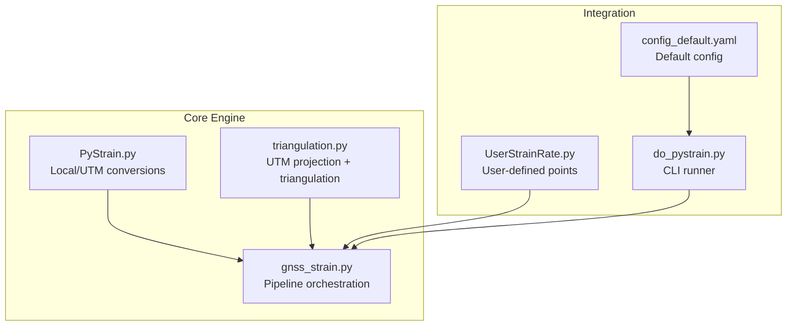
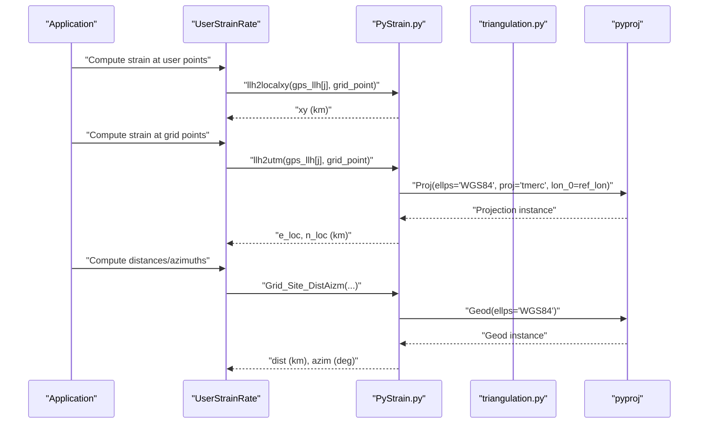
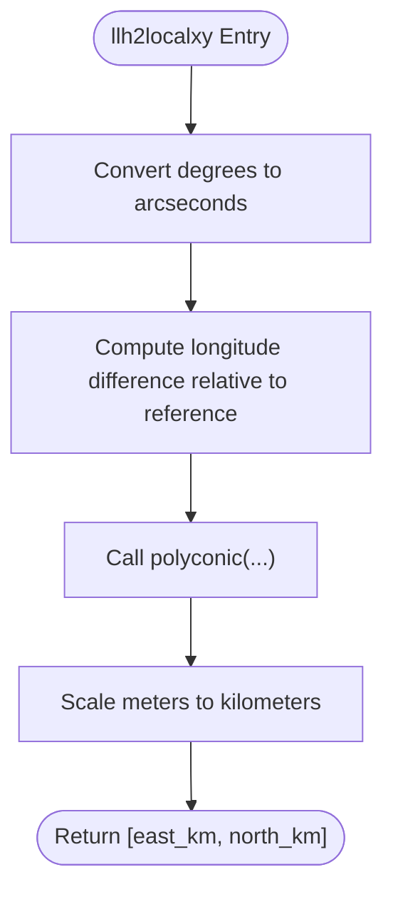
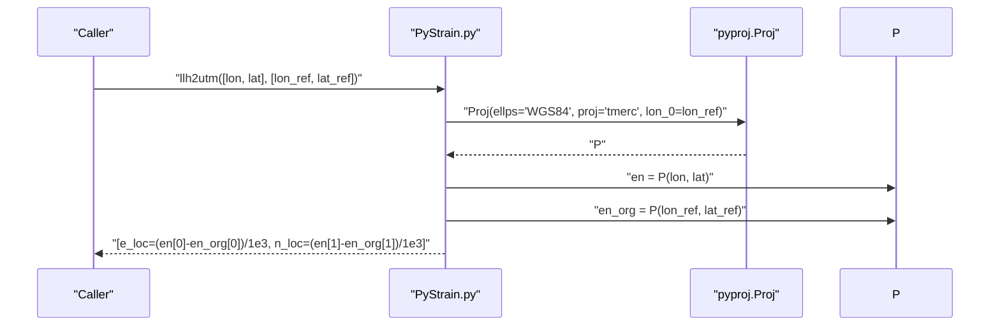
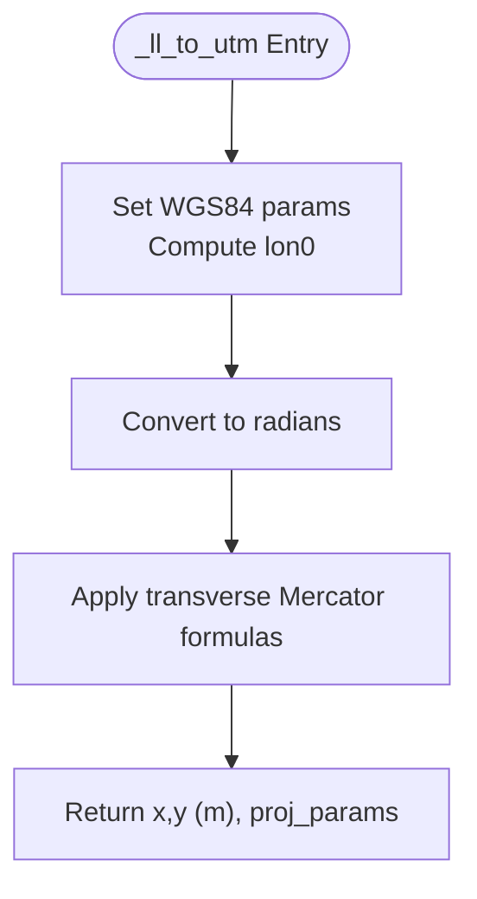
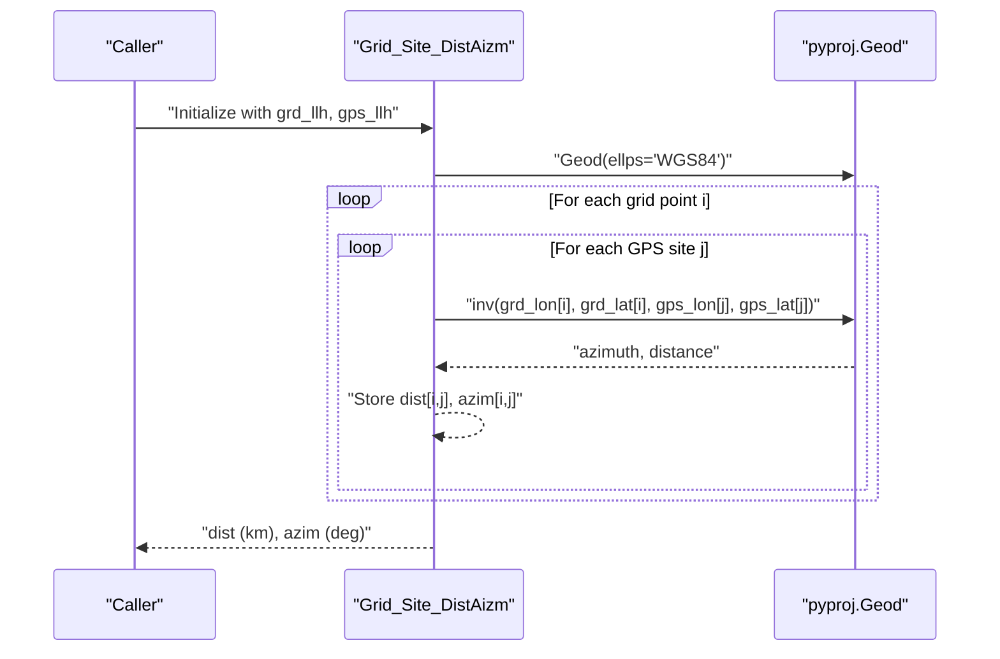
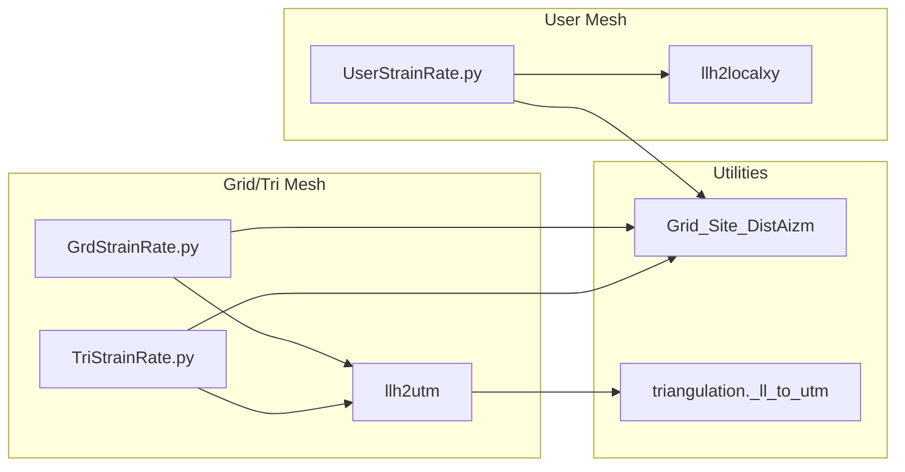
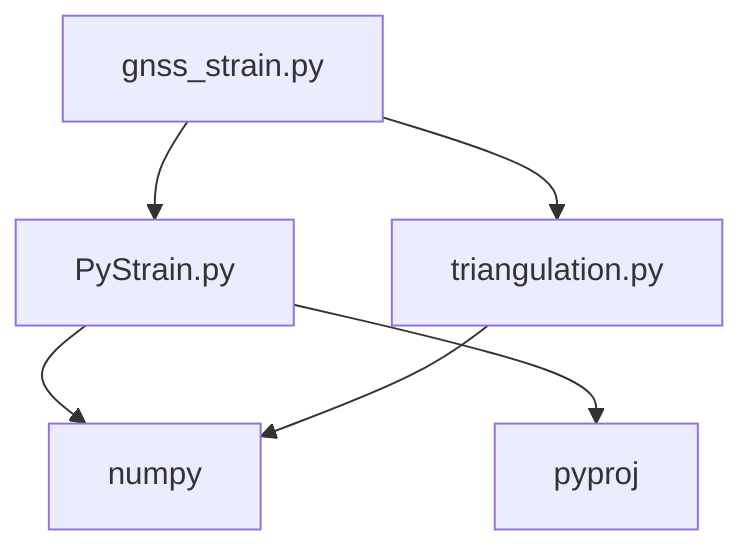

# Coordinate Transformations

<cite>
**Referenced Files in This Document**
- [PyStrain.py](file://src/pystrain/PyStrain.py)
- [triangulation.py](file://src/pystrain/gnss_strain/triangulation.py)
- [gnss_strain.py](file://src/pystrain/gnss_strain/gnss_strain.py)
- [UserStrainRate.py](file://src/pystrain/UserStrainRate.py)
- [config_default.yaml](file://src/pystrain/gnss_strain/config_default.yaml)
- [config.yaml](file://test/config.yaml)
- [do_pystrain.py](file://src/pystrain/scripts/do_pystrain.py)
</cite>

## Table of Contents
1. [Introduction](#introduction)
2. [Project Structure](#project-structure)
3. [Core Components](#core-components)
4. [Architecture Overview](#architecture-overview)
5. [Detailed Component Analysis](#detailed-component-analysis)
6. [Dependency Analysis](#dependency-analysis)
7. [Performance Considerations](#performance-considerations)
8. [Troubleshooting Guide](#troubleshooting-guide)
9. [Conclusion](#conclusion)

## Introduction
This document describes the coordinate transformation subsystem within PyStrain’s computational engine. It focuses on converting geographic coordinates (longitude/latitude) to local Cartesian systems for strain-rate computations. Two primary methods are implemented:
- Polyconic projection-based local coordinate conversion (llh2localxy)
- UTM transverse Mercator projection-based regional coordinate transformation (llh2utm)

The document explains the mathematical foundations, implementation details, parameter requirements, input/output formats, integration with pyproj and Geod libraries, and practical examples for GPS position conversions. It also covers numerical precision considerations, edge cases, and performance characteristics of the different transformation methods.

## Project Structure
The coordinate transformation functionality spans several modules:
- Core functions for local and UTM conversions live in the main PyStrain module.
- A dedicated triangulation module provides a full UTM implementation and integrates with the broader triangulation pipeline.
- Example usage appears in the frontend app and scripts.

**Diagram sources**
- [PyStrain.py:22-95](file://src/pystrain/PyStrain.py#L22-L95)
- [triangulation.py:22-77](file://src/pystrain/gnss_strain/triangulation.py#L22-L77)
- [gnss_strain.py:148-160](file://src/pystrain/gnss_strain/gnss_strain.py#L148-L160)
- [UserStrainRate.py:100-109](file://src/pystrain/UserStrainRate.py#L100-L109)
- [config_default.yaml:1-69](file://src/pystrain/gnss_strain/config_default.yaml#L1-L69)
- [do_pystrain.py:1-39](file://src/pystrain/scripts/do_pystrain.py#L1-L39)

**Section sources**
- [PyStrain.py:1-120](file://src/pystrain/PyStrain.py#L1-L120)
- [triangulation.py:1-83](file://src/pystrain/gnss_strain/triangulation.py#L1-L83)
- [gnss_strain.py:148-160](file://src/pystrain/gnss_strain/gnss_strain.py#L148-L160)
- [UserStrainRate.py:100-109](file://src/pystrain/UserStrainRate.py#L100-L109)
- [config_default.yaml:1-69](file://src/pystrain/gnss_strain/config_default.yaml#L1-L69)
- [do_pystrain.py:1-39](file://src/pystrain/scripts/do_pystrain.py#L1-L39)

## Core Components
- Polyconic-based local coordinate converter (llh2localxy)
  - Purpose: Convert geographic coordinates to a local Cartesian system centered at a reference point.
  - Inputs: llh (lon, lat in degrees), ll_org (reference lon, lat in degrees).
  - Output: xy (east, north in kilometers).
  - Implementation: Uses a custom polyconic projection routine with predefined constants and angular conversions.

- UTM-based regional coordinate converter (llh2utm)
  - Purpose: Convert geographic coordinates to UTM easting/northing relative to a reference point, scaled to kilometers.
  - Inputs: llh (lon, lat in degrees), llh_org (reference lon, lat in degrees).
  - Output: [e_loc, n_loc] (east, north in kilometers).
  - Implementation: Leverages pyproj.Proj with transverse Mercator projection and subtracting the reference projection values.

- Distance and azimuth calculator (Grid_Site_DistAizm)
  - Purpose: Compute geodesic distances and forward azimuths between grid points and GPS sites.
  - Implementation: Uses pyproj.Geod.inverse on WGS84 ellipsoid; outputs distances in kilometers and azimuths in degrees.

- UTM projection utilities (triangulation module)
  - Purpose: Full UTM projection implementation for triangulation and mesh quality control.
  - Inputs: lon, lat (degrees).
  - Output: x, y (meters), proj_params (for potential inverse transform).
  - Implementation: Implements the transverse Mercator formulas with WGS84 parameters and central meridian selection.

**Section sources**
- [PyStrain.py:22-95](file://src/pystrain/PyStrain.py#L22-L95)
- [PyStrain.py:473-514](file://src/pystrain/PyStrain.py#L473-L514)
- [triangulation.py:22-77](file://src/pystrain/gnss_strain/triangulation.py#L22-L77)

## Architecture Overview
The coordinate transformation subsystem integrates with the broader strain-rate pipeline as follows:
- llh2localxy is used for user-defined point computations.
- llh2utm is used for grid and triangular mesh computations.
- pyproj.Geod computes distances and azimuths for spatial queries.
- triangulation module provides a robust UTM implementation for triangulation and quality control.

**Diagram sources**
- [UserStrainRate.py:100-109](file://src/pystrain/UserStrainRate.py#L100-L109)
- [PyStrain.py:77-95](file://src/pystrain/PyStrain.py#L77-L95)
- [PyStrain.py:473-514](file://src/pystrain/PyStrain.py#L473-L514)

## Detailed Component Analysis

### Polyconic Projection-Based Local Coordinates (llh2localxy)
- Mathematical foundation:
  - The polyconic projection approximates the conformal property locally while maintaining reasonable accuracy over small regions.
  - The implementation converts arcseconds to radians and applies a polynomial expansion in latitude differences and longitude differences, weighted by trigonometric terms.

- Implementation highlights:
  - Angular conversion factors and Earth constants are embedded in the function.
  - The difference in longitude is computed relative to the reference point.
  - Outputs are scaled from meters to kilometers.

- Parameter requirements:
  - llh: [lon_deg, lat_deg]
  - ll_org: [lon_deg, lat_deg]
  - Units: degrees for input; kilometers for output.

- Input/output formats:
  - Input: numpy-like arrays or lists of floats.
  - Output: numpy array [east_km, north_km].

- Practical example:
  - Convert a GPS site near a reference point to local east/north coordinates in kilometers.

**Diagram sources**
- [PyStrain.py:52-75](file://src/pystrain/PyStrain.py#L52-L75)

**Section sources**
- [PyStrain.py:22-49](file://src/pystrain/PyStrain.py#L22-L49)
- [PyStrain.py:52-75](file://src/pystrain/PyStrain.py#L52-L75)

### UTM Transverse Mercator Projection (llh2utm)
- Mathematical foundation:
  - Uses the transverse Mercator projection with central meridian at the reference longitude.
  - Implements standard UTM formulas with WGS84 ellipsoid parameters and a scale factor of 0.9996.

- Implementation highlights:
  - pyproj.Proj is used to compute projected coordinates for both target and reference points.
  - Differences are taken and scaled to kilometers.

- Parameter requirements:
  - llh: [lon_deg, lat_deg]
  - llh_org: [lon_deg, lat_deg]
  - Units: degrees for input; kilometers for output.

- Input/output formats:
  - Input: numpy-like arrays or lists of floats.
  - Output: list [e_loc_km, n_loc_km].

- Practical example:
  - Convert a GPS site to UTM-relative east/north coordinates centered at a grid point.

**Diagram sources**
- [PyStrain.py:77-95](file://src/pystrain/PyStrain.py#L77-L95)

**Section sources**
- [PyStrain.py:77-95](file://src/pystrain/PyStrain.py#L77-L95)

### Full UTM Projection Utilities (triangulation module)
- Purpose:
  - Provides a complete UTM implementation for triangulation and mesh quality control.
  - Computes x, y in meters and returns projection parameters for potential inverse transforms.

- Implementation highlights:
  - Central meridian selected based on mean longitude.
  - Uses WGS84 semi-major axis and first eccentricity squared.
  - Implements standard transverse Mercator formulas with series expansions.

- Parameter requirements:
  - lon, lat: arrays of degrees.

- Input/output formats:
  - Input: arrays of floats.
  - Output: x, y (meters), proj_params (dict).

- Integration:
  - Used internally by the triangulation pipeline to convert geographic coordinates to projected plane coordinates for Delaunay triangulation and quality filtering.

**Diagram sources**
- [triangulation.py:22-77](file://src/pystrain/gnss_strain/triangulation.py#L22-L77)

**Section sources**
- [triangulation.py:22-77](file://src/pystrain/gnss_strain/triangulation.py#L22-L77)

### Distance and Azimuth Calculator (Grid_Site_DistAizm)
- Purpose:
  - Compute geodesic distances and forward azimuths between grid points and GPS sites using pyproj.Geod.

- Implementation highlights:
  - Uses WGS84 ellipsoid.
  - Iterates over grid points and GPS sites to compute inverse geodesic solutions.
  - Distances are converted to kilometers; azimuths remain in degrees.

- Parameter requirements:
  - grd_llh: array of [lon, lat].
  - gps_llh: array of [lon, lat].

- Input/output formats:
  - Input: arrays of floats.
  - Output: dist (km), azim (deg).

- Integration:
  - Used by grid and user mesh strain estimators to select nearby GPS sites and assess azimuth distribution.

**Diagram sources**
- [PyStrain.py:473-514](file://src/pystrain/PyStrain.py#L473-L514)

**Section sources**
- [PyStrain.py:473-514](file://src/pystrain/PyStrain.py#L473-L514)

### Integration with Pipeline Components
- User-defined points:
  - UserStrainRate computes local coordinates using llh2localxy for each GPS site within a search radius around a user-specified point.

- Grid and triangular meshes:
  - GrdStrainRate and TriStrainRate compute UTM-relative coordinates using llh2utm for each GPS site within a search radius around grid points or triangle centroids.

- Configuration:
  - Default configuration controls parameters such as maximum distance for neighbor selection, minimum number of sites, and whether to check azimuth distribution.

**Diagram sources**
- [UserStrainRate.py:100-109](file://src/pystrain/UserStrainRate.py#L100-L109)
- [gnss_strain.py:148-160](file://src/pystrain/gnss_strain/gnss_strain.py#L148-L160)
- [PyStrain.py:77-95](file://src/pystrain/PyStrain.py#L77-L95)
- [PyStrain.py:473-514](file://src/pystrain/PyStrain.py#L473-L514)
- [triangulation.py:22-77](file://src/pystrain/gnss_strain/triangulation.py#L22-L77)

**Section sources**
- [UserStrainRate.py:100-109](file://src/pystrain/UserStrainRate.py#L100-L109)
- [gnss_strain.py:148-160](file://src/pystrain/gnss_strain/gnss_strain.py#L148-L160)
- [PyStrain.py:77-95](file://src/pystrain/PyStrain.py#L77-L95)
- [PyStrain.py:473-514](file://src/pystrain/PyStrain.py#L473-L514)
- [triangulation.py:22-77](file://src/pystrain/gnss_strain/triangulation.py#L22-L77)

## Dependency Analysis
- External libraries:
  - pyproj: Provides Proj (transverse Mercator) and Geod (inverse geodesic) operations.
  - numpy: Numerical operations for coordinate arrays and matrix computations.

- Internal dependencies:
  - PyStrain.py exports llh2localxy, llh2utm, and Grid_Site_DistAizm.
  - triangulation.py provides _ll_to_utm for triangulation pipeline.
  - gnss_strain.py orchestrates pipeline stages and uses triangulation outputs.

**Diagram sources**
- [PyStrain.py:11-11](file://src/pystrain/PyStrain.py#L11-L11)
- [triangulation.py:13-15](file://src/pystrain/gnss_strain/triangulation.py#L13-L15)
- [gnss_strain.py:17-27](file://src/pystrain/gnss_strain/gnss_strain.py#L17-L27)

**Section sources**
- [PyStrain.py:11-11](file://src/pystrain/PyStrain.py#L11-L11)
- [triangulation.py:13-15](file://src/pystrain/gnss_strain/triangulation.py#L13-L15)
- [gnss_strain.py:17-27](file://src/pystrain/gnss_strain/gnss_strain.py#L17-L27)

## Performance Considerations
- Computational cost:
  - llh2localxy: Constant-time per point; suitable for large-scale user mesh computations.
  - llh2utm: Involves pyproj.Proj instantiation and inverse projections; efficient for moderate numbers of points.
  - Grid_Site_DistAizm: O(N_grid × N_gps); can be a bottleneck for dense grids or large GPS datasets.

- Numerical precision:
  - Polyconic method uses fixed constants and arcsecond-to-radian conversions; suitable for small regions.
  - UTM method uses WGS84 ellipsoid parameters and central meridian selection; accurate for regional scales up to ±6° longitude.
  - Geod inverse provides high-precision geodesic solutions.

- Memory usage:
  - Arrays of distances and azimuths are stored as dense matrices; consider sparse or chunked processing for very large datasets.

- Optimization opportunities:
  - Vectorize llh2utm calls using numpy arrays.
  - Precompute Geod instances and reuse where appropriate.
  - Use spatial indexing (e.g., KDTree) to reduce neighbor search complexity.

[No sources needed since this section provides general guidance]

## Troubleshooting Guide
- Incorrect units:
  - Ensure input coordinates are in degrees and outputs are interpreted in kilometers.

- Reference point mismatch:
  - Verify that llh_org corresponds to the intended reference point for llh2utm and llh2localxy.

- Edge cases:
  - Very large longitude differences near ±180°; consider wrapping or recentering longitudes.
  - Near-polar regions: polyconic approximation may degrade; prefer UTM-based methods.

- Performance bottlenecks:
  - Reduce N_grid × N_gps by limiting search radii or using spatial indexing.
  - Batch operations for llh2utm to minimize pyproj overhead.

- Configuration tuning:
  - Adjust maxdist and minsite thresholds to balance coverage and stability.
  - Enable azimuth checks to avoid poor geometry configurations.

**Section sources**
- [PyStrain.py:77-95](file://src/pystrain/PyStrain.py#L77-L95)
- [PyStrain.py:52-75](file://src/pystrain/PyStrain.py#L52-L75)
- [PyStrain.py:473-514](file://src/pystrain/PyStrain.py#L473-L514)
- [config_default.yaml:28-48](file://src/pystrain/gnss_strain/config_default.yaml#L28-L48)
- [config.yaml:28-60](file://test/config.yaml#L28-L60)

## Conclusion
PyStrain’s coordinate transformation subsystem provides two complementary approaches for converting geographic coordinates to local Cartesian systems:
- Polyconic-based llh2localxy for user-defined point computations.
- UTM-based llh2utm for grid and triangular mesh computations.

These functions integrate seamlessly with pyproj for precise distance and azimuth calculations and with the triangulation pipeline for robust mesh generation. Proper configuration and attention to numerical precision and performance enable reliable strain-rate computations across diverse geographic domains.