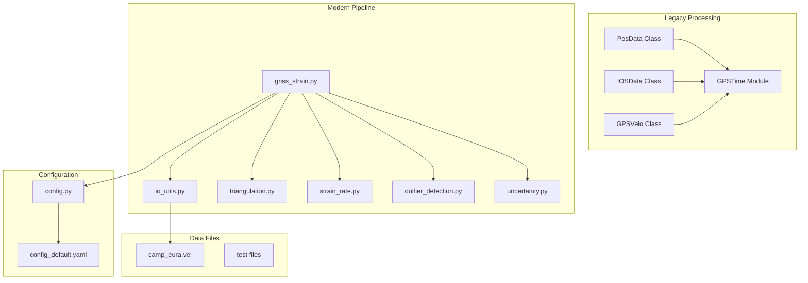
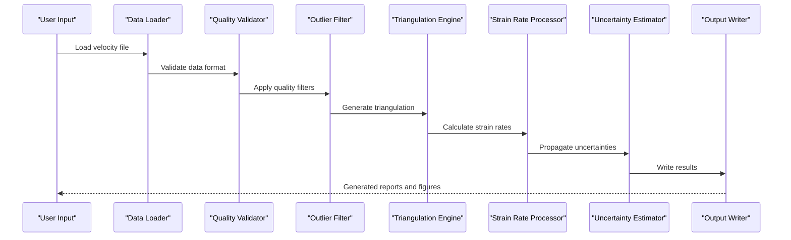
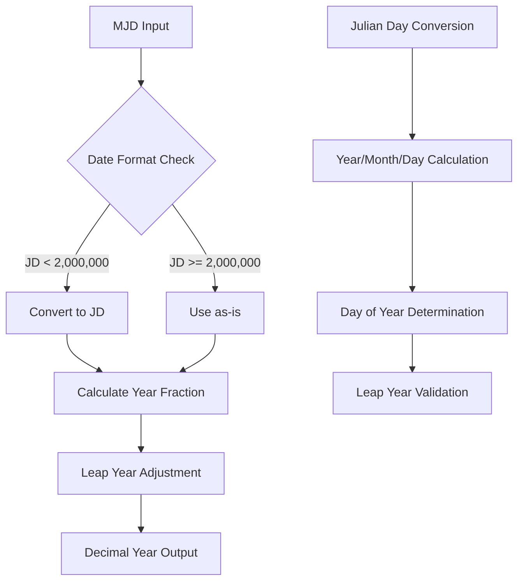
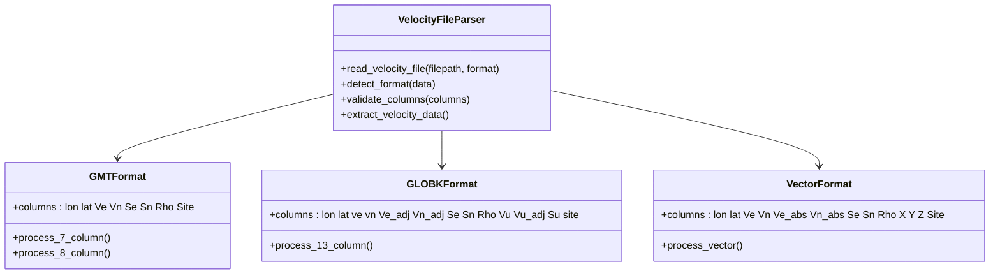
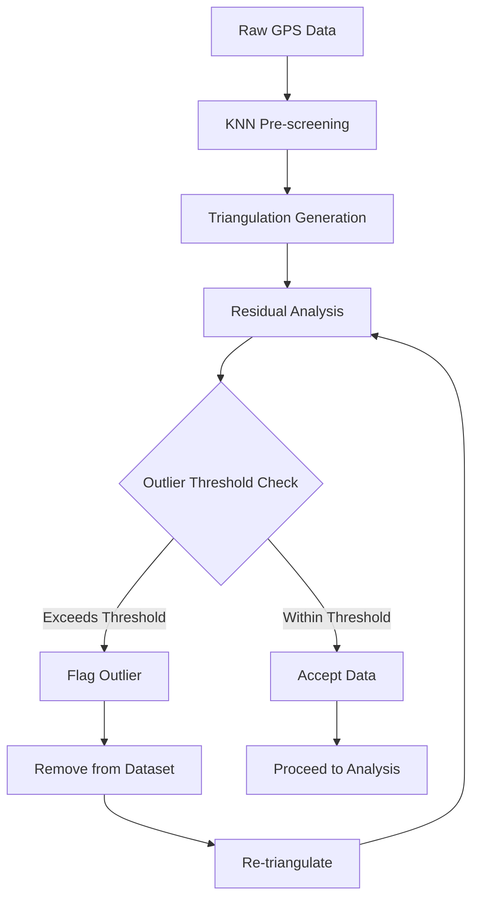
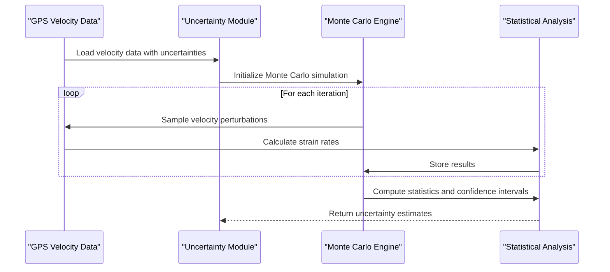
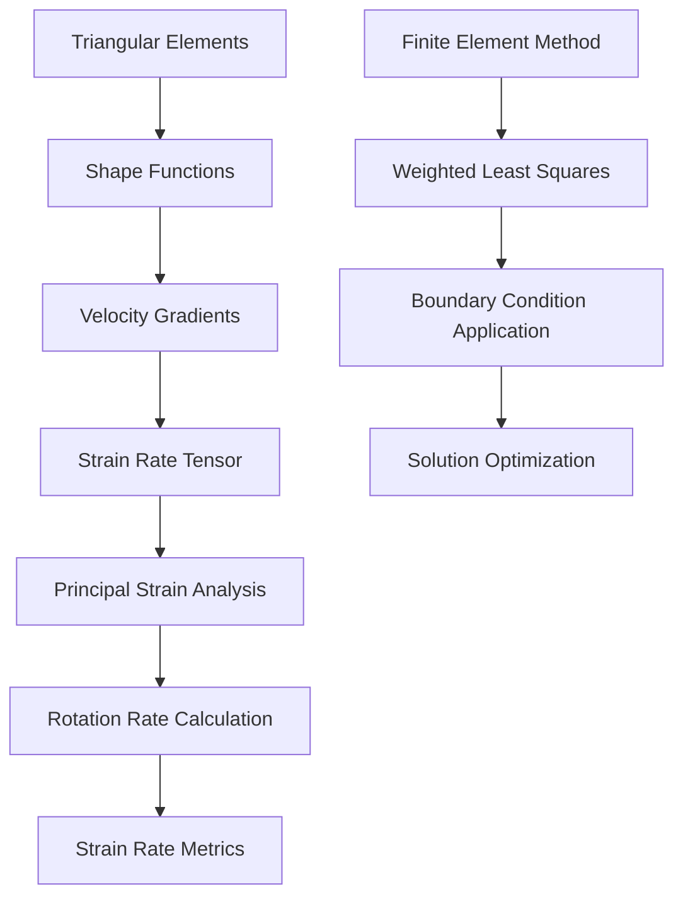
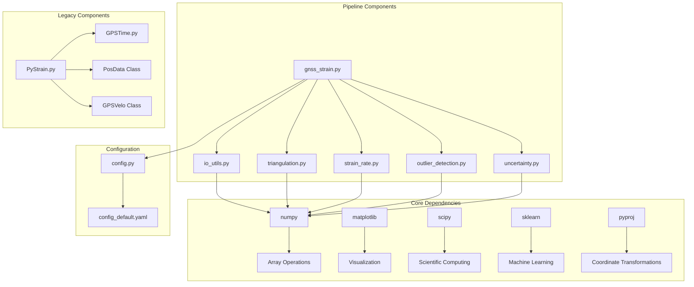

# Data Processing Pipeline

<cite>
**Referenced Files in This Document**
- [PyStrain.py](file://src/pystrain/PyStrain.py)
- [GPSTime.py](file://src/pystrain/GPSTime.py)
- [gnss_strain.py](file://src/pystrain/gnss_strain/gnss_strain.py)
- [io_utils.py](file://src/pystrain/gnss_strain/io_utils.py)
- [triangulation.py](file://src/pystrain/gnss_strain/triangulation.py)
- [strain_rate.py](file://src/pystrain/gnss_strain/strain_rate.py)
- [outlier_detection.py](file://src/pystrain/gnss_strain/outlier_detection.py)
- [uncertainty.py](file://src/pystrain/gnss_strain/uncertainty.py)
- [camp_eura.vel](file://src/pystrain/gnss_strain/camp_eura.vel)
- [config_default.yaml](file://src/pystrain/gnss_strain/config_default.yaml)
- [config.py](file://src/pystrain/gnss_strain/config.py)
</cite>

## Table of Contents
1. [Introduction](#introduction)
2. [Project Structure](#project-structure)
3. [Core Components](#core-components)
4. [Architecture Overview](#architecture-overview)
5. [Detailed Component Analysis](#detailed-component-analysis)
6. [Dependency Analysis](#dependency-analysis)
7. [Performance Considerations](#performance-considerations)
8. [Troubleshooting Guide](#troubleshooting-guide)
9. [Conclusion](#conclusion)

## Introduction

PyStrain is a comprehensive GPS data processing pipeline designed for strain rate analysis from GNSS velocity data. The system provides robust tools for loading, validating, and processing GPS data from various sources, including POS files, IOS time series, and velocity files from GMT/GLOBK sources. The pipeline integrates advanced data validation, quality filtering, uncertainty handling, and coordinate system standardization to deliver reliable strain rate estimates.

The system operates through two primary processing approaches: a legacy implementation using specialized classes (PosData, IOSData, GPSVelo) and a modern, modular pipeline that processes velocity files directly. Both approaches share common infrastructure for time conversion, coordinate transformations, and quality assurance.

## Project Structure

The PyStrain project follows a modular architecture with distinct components for different processing stages:

**Diagram sources**
- [PyStrain.py:128-318](file://src/pystrain/PyStrain.py#L128-L318)
- [gnss_strain.py:1-407](file://src/pystrain/gnss_strain/gnss_strain.py#L1-L407)

**Section sources**
- [PyStrain.py:1-800](file://src/pystrain/PyStrain.py#L1-L800)
- [gnss_strain.py:1-407](file://src/pystrain/gnss_strain/gnss_strain.py#L1-L407)

## Core Components

### Legacy Data Classes

The legacy implementation provides specialized classes for different GPS data formats:

#### PosData Class
Handles PBO POS file format containing displacement time series data with MJD timestamps and NEU coordinates.

#### IOSData Class  
Processes PyTsfit output files with corrected GPS time series data in decimal years.

#### GPSVelo Class
Manages GPS velocity data from GMT/GLOBK sources with automatic format detection and validation.

### Modern Processing Pipeline

The modern pipeline offers a more flexible and robust approach:

#### Data Loading and Validation
- Automatic format detection for GMT and GLOBK velocity files
- Comprehensive data validation and quality checks
- Support for custom polygon boundaries and study areas

#### Quality Control and Filtering
- KNN-based pre-screening for local anomalies
- Triangulation-based residual analysis
- Iterative outlier removal with statistical validation

#### Uncertainty Quantification
- Monte Carlo simulation for uncertainty propagation
- Correlation handling between velocity components
- Statistical analysis of processing artifacts

**Section sources**
- [PyStrain.py:128-318](file://src/pystrain/PyStrain.py#L128-L318)
- [gnss_strain.py:21-132](file://src/pystrain/gnss_strain/gnss_strain.py#L21-L132)

## Architecture Overview

The PyStrain processing pipeline implements a multi-stage architecture with clear separation of concerns:

**Diagram sources**
- [gnss_strain.py:52-341](file://src/pystrain/gnss_strain/gnss_strain.py#L52-L341)
- [io_utils.py:21-132](file://src/pystrain/gnss_strain/io_utils.py#L21-L132)

The architecture supports both batch processing and interactive workflows, with comprehensive error handling and progress reporting throughout the pipeline.

**Section sources**
- [gnss_strain.py:1-407](file://src/pystrain/gnss_strain/gnss_strain.py#L1-L407)

## Detailed Component Analysis

### Time Conversion and Coordinate Systems

#### Modified Julian Date (MJD) to Decimal Year Conversion
The GPSTime module provides robust time conversion capabilities essential for GPS data processing:

**Diagram sources**
- [GPSTime.py:13-48](file://src/pystrain/GPSTime.py#L13-L48)
- [GPSTime.py:52-143](file://src/pystrain/GPSTime.py#L52-L143)

The time conversion handles edge cases including leap years, fractional days, and different input formats (MJD vs JD). This ensures consistent time representation across different GPS data sources.

#### Coordinate System Transformations
The pipeline implements multiple coordinate transformation systems:

- **UTM Projection**: Universal Transverse Mercator for regional coordinate systems
- **Local Cartesian Coordinates**: Custom projection centered on specific reference points
- **Geodetic Coordinates**: Latitude/Longitude in WGS84 ellipsoid

**Section sources**
- [GPSTime.py:13-270](file://src/pystrain/GPSTime.py#L13-L270)
- [PyStrain.py:22-95](file://src/pystrain/PyStrain.py#L22-L95)

### Data Loading Mechanisms

#### Velocity File Formats
The system supports multiple velocity file formats with automatic detection:

**Diagram sources**
- [io_utils.py:21-132](file://src/pystrain/gnss_strain/io_utils.py#L21-L132)

The parser automatically detects file formats based on column count and content validation, ensuring compatibility with various GPS processing software outputs.

#### POS File Processing
Legacy POS file support includes:

- Header parsing for station metadata
- MJD timestamp extraction and conversion
- NEU displacement data with uncertainty handling
- Automated quality filtering for invalid measurements

**Section sources**
- [PyStrain.py:175-213](file://src/pystrain/PyStrain.py#L175-L213)
- [io_utils.py:21-132](file://src/pystrain/gnss_strain/io_utils.py#L21-L132)

### Quality Filtering and Validation

#### Outlier Detection Pipeline
The modern pipeline implements a sophisticated two-stage outlier detection system:

**Diagram sources**
- [outlier_detection.py:17-87](file://src/pystrain/gnss_strain/outlier_detection.py#L17-L87)
- [outlier_detection.py:94-177](file://src/pystrain/gnss_strain/outlier_detection.py#L94-L177)

#### Triangulation Quality Control
Advanced triangulation quality assessment includes:

- Minimum angle threshold enforcement (typically 10°)
- Maximum edge length percentile filtering
- Area-based quality metrics
- Spatial boundary constraint application

**Section sources**
- [outlier_detection.py:1-292](file://src/pystrain/gnss_strain/outlier_detection.py#L1-L292)
- [triangulation.py:89-146](file://src/pystrain/gnss_strain/triangulation.py#L89-L146)

### Uncertainty Handling and Propagation

#### Monte Carlo Uncertainty Estimation
The uncertainty module implements robust uncertainty quantification:

**Diagram sources**
- [uncertainty.py:14-150](file://src/pystrain/gnss_strain/uncertainty.py#L14-L150)

The Monte Carlo approach accounts for:
- Correlation between east-west and north-south velocity components
- Spatial correlation effects in triangulation
- Statistical distribution of measurement errors

**Section sources**
- [uncertainty.py:14-150](file://src/pystrain/gnss_strain/uncertainty.py#L14-L150)

### Strain Rate Computation

#### Mathematical Framework
The strain rate computation employs finite element methods with triangular elements:

**Diagram sources**
- [strain_rate.py:18-57](file://src/pystrain/gnss_strain/strain_rate.py#L18-L57)
- [strain_rate.py:126-198](file://src/pystrain/gnss_strain/strain_rate.py#L126-L198)

The mathematical framework provides:
- Velocity gradient calculation using shape functions
- Strain rate tensor decomposition
- Principal strain and rotation rate computation
- Statistical smoothing for spatial coherence

**Section sources**
- [strain_rate.py:1-438](file://src/pystrain/gnss_strain/strain_rate.py#L1-L438)

## Dependency Analysis

The PyStrain pipeline exhibits well-structured dependencies with clear separation of concerns:

**Diagram sources**
- [gnss_strain.py:10-28](file://src/pystrain/gnss_strain/gnss_strain.py#L10-L28)
- [PyStrain.py:9-16](file://src/pystrain/PyStrain.py#L9-L16)

The dependency structure supports modularity and maintainability while ensuring computational efficiency through optimized numerical libraries.

**Section sources**
- [gnss_strain.py:1-407](file://src/pystrain/gnss_strain/gnss_strain.py#L1-L407)
- [PyStrain.py:1-800](file://src/pystrain/PyStrain.py#L1-L800)

## Performance Considerations

### Memory Management Strategies

The pipeline implements several memory optimization techniques:

#### Large Dataset Handling
- **Chunked Processing**: Large velocity files are processed in chunks to manage memory usage
- **Sparse Matrix Operations**: Triangulation matrices utilize sparse representations for efficiency
- **Lazy Evaluation**: Intermediate calculations are computed on-demand rather than stored
- **Memory Pool Management**: Reusable buffers minimize allocation overhead

#### Computational Efficiency
- **Vectorized Operations**: NumPy-based computations maximize CPU utilization
- **Parallel Processing**: Multi-threading for independent calculations
- **Early Termination**: Quality checks that eliminate poor-quality data early
- **Optimized Data Structures**: Efficient storage formats for large arrays

### Performance Optimization Guidelines

For optimal performance with large datasets:

1. **Pre-filtering**: Remove obvious outliers before triangulation
2. **Resolution Selection**: Choose appropriate grid spacing for target resolution
3. **Memory Allocation**: Pre-allocate arrays for known sizes
4. **Batch Processing**: Process data in manageable chunks
5. **Cache Optimization**: Reuse intermediate results when possible

**Section sources**
- [triangulation.py:259-281](file://src/pystrain/gnss_strain/triangulation.py#L259-L281)
- [gnss_strain.py:100-129](file://src/pystrain/gnss_strain/gnss_strain.py#L100-L129)

## Troubleshooting Guide

### Common Issues and Solutions

#### Data Format Problems
- **Symptom**: Parser fails to recognize file format
- **Solution**: Verify column count and data types match expected formats
- **Prevention**: Use explicit format specification for ambiguous files

#### Triangulation Failures
- **Symptom**: Empty or minimal triangulation results
- **Cause**: Poor data quality or extreme outliers
- **Fix**: Increase outlier thresholds or improve data quality

#### Memory Issues
- **Symptom**: Out-of-memory errors during processing
- **Solution**: Reduce dataset size or increase system resources
- **Prevention**: Monitor memory usage and process in smaller batches

#### Convergence Problems
- **Symptom**: Non-physical strain rate values
- **Cause**: Insufficient data coverage or poor triangulation quality
- **Fix**: Improve data density or adjust triangulation parameters

### Debugging Tools and Techniques

The pipeline provides comprehensive debugging capabilities:

- **Progress Reporting**: Detailed logging of processing stages
- **Intermediate Output**: Save intermediate results for inspection
- **Validation Checks**: Built-in data quality verification
- **Statistical Analysis**: Quality metrics and diagnostic plots

**Section sources**
- [gnss_strain.py:84-131](file://src/pystrain/gnss_strain/gnss_strain.py#L84-L131)
- [outlier_detection.py:216-291](file://src/pystrain/gnss_strain/outlier_detection.py#L216-L291)

## Conclusion

PyStrain provides a comprehensive and robust GPS data processing pipeline that successfully handles diverse GPS data formats while maintaining scientific rigor and computational efficiency. The system's dual architecture accommodates both legacy workflows and modern processing approaches, ensuring broad compatibility with existing GPS processing ecosystems.

Key strengths of the pipeline include:

- **Multi-format Support**: Seamless handling of POS, IOS, and GMT/GLOBK velocity files
- **Robust Quality Control**: Advanced outlier detection and triangulation quality assessment
- **Uncertainty Quantification**: Comprehensive uncertainty propagation using Monte Carlo methods
- **Flexible Architecture**: Modular design supporting various processing workflows
- **Performance Optimization**: Memory-efficient processing for large datasets

The pipeline's integration of time conversion, coordinate transformations, and quality filtering creates a solid foundation for reliable strain rate analysis from GPS velocity data. Future enhancements could focus on real-time processing capabilities, cloud computing integration, and expanded format support for emerging GPS data sources.