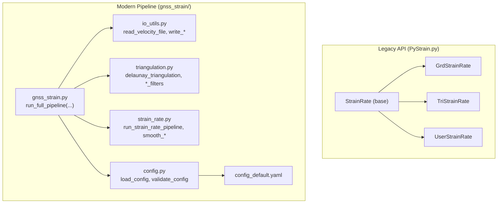
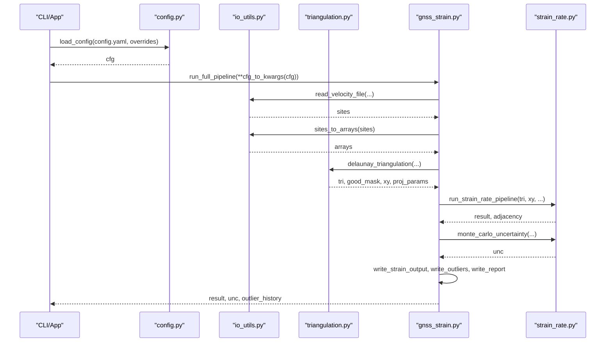
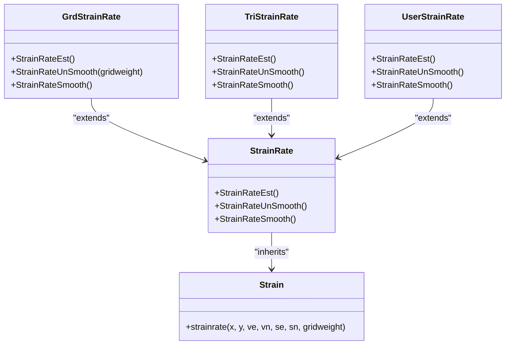
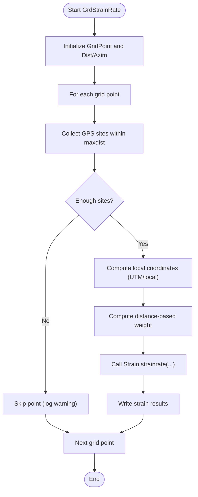
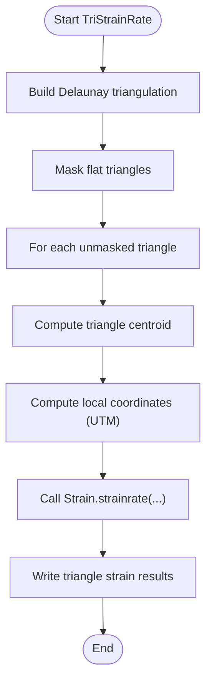
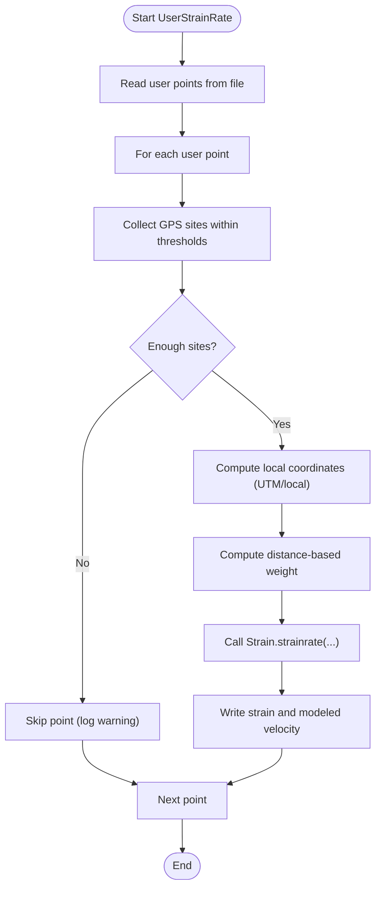
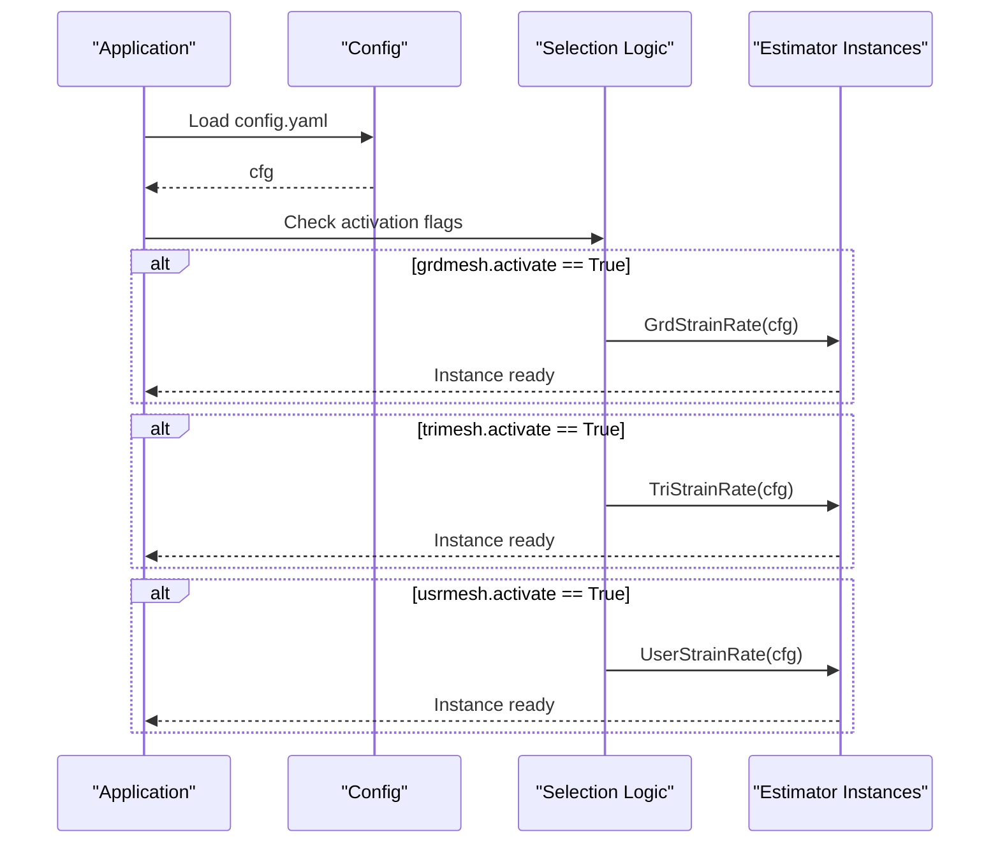
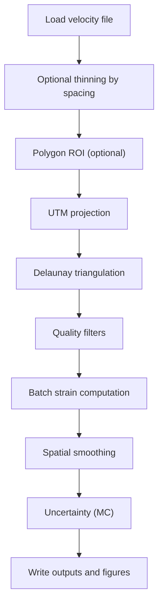
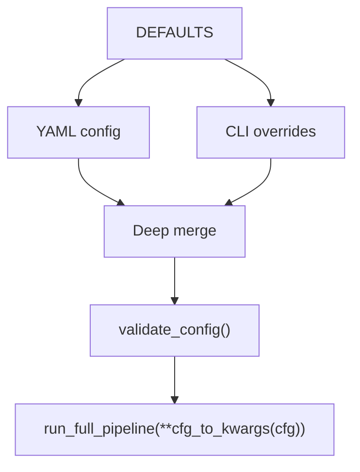
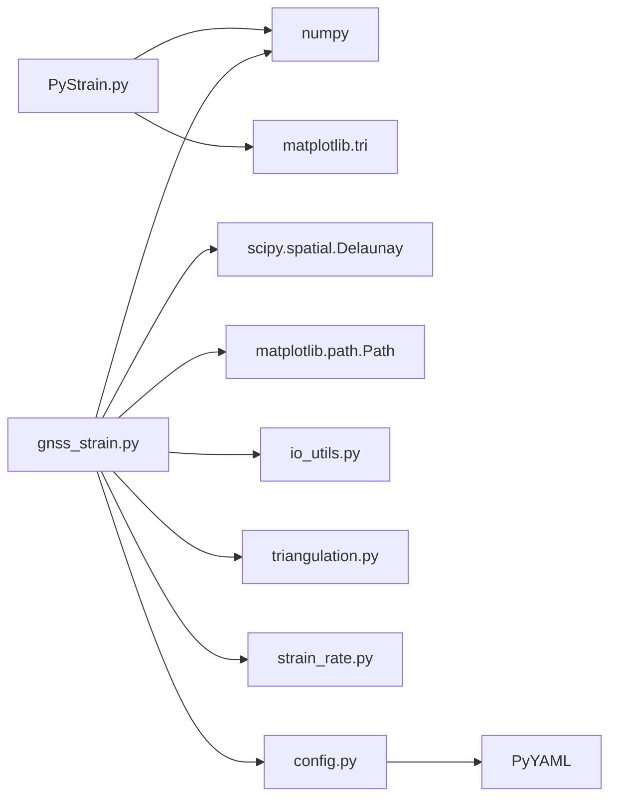

# Estimation Methods Framework

<cite>
**Referenced Files in This Document**
- [PyStrain.py](file://src/pystrain/PyStrain.py)
- [UserStrainRate.py](file://src/pystrain/UserStrainRate.py)
- [gnss_strain.py](file://src/pystrain/gnss_strain/gnss_strain.py)
- [strain_rate.py](file://src/pystrain/gnss_strain/strain_rate.py)
- [triangulation.py](file://src/pystrain/gnss_strain/triangulation.py)
- [io_utils.py](file://src/pystrain/gnss_strain/io_utils.py)
- [config.py](file://src/pystrain/gnss_strain/config.py)
- [config_default.yaml](file://src/pystrain/gnss_strain/config_default.yaml)
- [do_pystrain.py](file://src/pystrain/scripts/do_pystrain.py)
</cite>

## Table of Contents
1. [Introduction](#introduction)
2. [Project Structure](#project-structure)
3. [Core Components](#core-components)
4. [Architecture Overview](#architecture-overview)
5. [Detailed Component Analysis](#detailed-component-analysis)
6. [Dependency Analysis](#dependency-analysis)
7. [Performance Considerations](#performance-considerations)
8. [Troubleshooting Guide](#troubleshooting-guide)
9. [Conclusion](#conclusion)
10. [Appendices](#appendices)

## Introduction
This document describes PyStrain’s strain estimation framework with a focus on the StrainRate base class and its concrete implementations GrdStrainRate and TriStrainRate. It explains the inheritance hierarchy, abstract method contracts, polymorphic behavior, and the configuration-driven factory pattern used to select estimators. It also documents the common workflow (data preparation, spatial indexing, result aggregation), the configuration system, and extensibility mechanisms for adding new estimation methods.

## Project Structure
The strain estimation pipeline spans two primary subsystems:
- Legacy API (PyStrain.py): Defines the StrainRate base class and concrete estimators (grid, triangle, user-defined).
- Modern GNSS pipeline (gnss_strain/): Provides a robust, configurable, and validated workflow for GNSS velocity-to-strain-rate computation via triangulation and smoothing.

**Diagram sources**
- [PyStrain.py:517-807](file://src/pystrain/PyStrain.py#L517-L807)
- [gnss_strain.py:52-341](file://src/pystrain/gnss_strain/gnss_strain.py#L52-L341)
- [io_utils.py:21-132](file://src/pystrain/gnss_strain/io_utils.py#L21-L132)
- [triangulation.py:89-146](file://src/pystrain/gnss_strain/triangulation.py#L89-L146)
- [strain_rate.py:384-437](file://src/pystrain/gnss_strain/strain_rate.py#L384-L437)
- [config.py:56-90](file://src/pystrain/gnss_strain/config.py#L56-L90)
- [config_default.yaml:1-69](file://src/pystrain/gnss_strain/config_default.yaml#L1-L69)

**Section sources**
- [PyStrain.py:517-807](file://src/pystrain/PyStrain.py#L517-L807)
- [gnss_strain.py:52-341](file://src/pystrain/gnss_strain/gnss_strain.py#L52-L341)

## Core Components
- StrainRate (base): Defines the contract for strain rate estimation via abstract methods (StrainRateEst, StrainRateUnSmooth, StrainRateSmooth) and holds shared configuration and GPS velocity data.
- GrdStrainRate: Estimates strain rates on a regular grid using distance-weighted least squares with optional smoothing.
- TriStrainRate: Estimates strain rates per Delaunay triangle using local UTMs and shape function derivatives.
- UserStrainRate: Estimates strain rates at user-specified points with similar weighting and smoothing controls.

These classes share a common interface and leverage the Strain.strainrate method for the underlying linear inversion.

**Section sources**
- [PyStrain.py:517-807](file://src/pystrain/PyStrain.py#L517-L807)
- [UserStrainRate.py:1-126](file://src/pystrain/UserStrainRate.py#L1-L126)

## Architecture Overview
The modern GNSS pipeline orchestrates data ingestion, quality control, triangulation, strain computation, smoothing, uncertainty quantification, and output generation. It uses configuration-driven parameters to control all stages.

**Diagram sources**
- [gnss_strain.py:52-341](file://src/pystrain/gnss_strain/gnss_strain.py#L52-L341)
- [io_utils.py:21-132](file://src/pystrain/gnss_strain/io_utils.py#L21-L132)
- [triangulation.py:89-146](file://src/pystrain/gnss_strain/triangulation.py#L89-L146)
- [strain_rate.py:384-437](file://src/pystrain/gnss_strain/strain_rate.py#L384-L437)
- [config.py:56-90](file://src/pystrain/gnss_strain/config.py#L56-L90)

## Detailed Component Analysis

### Base Class: StrainRate
- Responsibilities:
  - Parse configuration sections for strain estimation.
  - Initialize GPS velocity data wrapper (GPSVelo).
  - Define abstract methods to be implemented by concrete estimators.
- Contract:
  - StrainRateEst(): top-level orchestration based on activation flags.
  - StrainRateUnSmooth(): compute without smoothing.
  - StrainRateSmooth(): compute with smoothing (implementation-dependent).

**Diagram sources**
- [PyStrain.py:517-807](file://src/pystrain/PyStrain.py#L517-L807)
- [UserStrainRate.py:1-126](file://src/pystrain/UserStrainRate.py#L1-L126)

**Section sources**
- [PyStrain.py:517-550](file://src/pystrain/PyStrain.py#L517-L550)

### GrdStrainRate
- Workflow:
  - Build a grid of points.
  - For each grid point, collect nearby GPS sites within a distance threshold.
  - Optionally enforce azimuthal distribution checks.
  - Compute local coordinates (UTM or local tangent plane) and estimate strain rate using weighted least squares.
  - Write results to an output file.
- Smoothing:
  - Optional smoothing controlled by configuration flags and parameters.

**Diagram sources**
- [PyStrain.py:552-729](file://src/pystrain/PyStrain.py#L552-L729)

**Section sources**
- [PyStrain.py:552-729](file://src/pystrain/PyStrain.py#L552-L729)

### TriStrainRate
- Workflow:
  - Construct a Delaunay triangulation from GPS positions.
  - Mask flat or poor-quality triangles.
  - For each valid triangle, compute local coordinates centered at triangle centroid.
  - Estimate strain rate using the shared linear inversion routine.
  - Output per-triangle results.

**Diagram sources**
- [PyStrain.py:729-807](file://src/pystrain/PyStrain.py#L729-L807)

**Section sources**
- [PyStrain.py:729-807](file://src/pystrain/PyStrain.py#L729-L807)

### UserStrainRate
- Workflow:
  - Reads user-specified points from a file.
  - For each point, collects neighboring GPS sites within thresholds.
  - Computes local coordinates and estimates strain rate.
  - Writes results and modeled velocity outputs.

**Diagram sources**
- [UserStrainRate.py:1-126](file://src/pystrain/UserStrainRate.py#L1-L126)

**Section sources**
- [UserStrainRate.py:1-126](file://src/pystrain/UserStrainRate.py#L1-L126)

### Factory Pattern and Dynamic Estimator Selection
- Configuration-driven selection:
  - The legacy entry point reads a configuration dictionary and instantiates estimators based on activation flags for grdmesh, trimesh, and usrmesh.
- Modern pipeline:
  - The gnss_strain module exposes run_full_pipeline(...) which internally orchestrates the entire workflow without explicit class factories. However, the configuration system (config.py) enables dynamic parameterization of estimator behavior indirectly.

**Diagram sources**
- [PyStrain.py:1455-1470](file://src/pystrain/PyStrain.py#L1455-L1470)
- [config.py:56-90](file://src/pystrain/gnss_strain/config.py#L56-L90)

**Section sources**
- [PyStrain.py:1455-1470](file://src/pystrain/PyStrain.py#L1455-L1470)

### Modern Pipeline: Data Preparation, Spatial Indexing, and Aggregation
- Data preparation:
  - Read velocity files (GMT/GLOBK/auto-detect) and convert to arrays.
  - Optional site thinning by minimum spacing.
  - Polygon boundary support for region-of-interest masking.
- Spatial indexing and triangulation:
  - UTM projection for metric coordinates.
  - Delaunay triangulation with quality filters (min angle, max edge percentile and factor, absolute max edge).
- Strain computation and smoothing:
  - Batch computation of strain tensors per triangle.
  - Spatial smoothing with configurable weight and iterations.
  - Principal strain and derived invariants computed per triangle.
- Uncertainty quantification:
  - Monte Carlo sampling to propagate velocity uncertainties.
- Output:
  - Triangle-level strain fields, outlier logs, and summary reports.
  - Optional visualization (figures).

**Diagram sources**
- [gnss_strain.py:92-280](file://src/pystrain/gnss_strain/gnss_strain.py#L92-L280)
- [triangulation.py:89-146](file://src/pystrain/gnss_strain/triangulation.py#L89-L146)
- [strain_rate.py:384-437](file://src/pystrain/gnss_strain/strain_rate.py#L384-L437)
- [io_utils.py:21-132](file://src/pystrain/gnss_strain/io_utils.py#L21-L132)

**Section sources**
- [gnss_strain.py:52-341](file://src/pystrain/gnss_strain/gnss_strain.py#L52-L341)
- [triangulation.py:89-146](file://src/pystrain/gnss_strain/triangulation.py#L89-L146)
- [strain_rate.py:384-437](file://src/pystrain/gnss_strain/strain_rate.py#L384-L437)
- [io_utils.py:21-132](file://src/pystrain/gnss_strain/io_utils.py#L21-L132)

### Configuration-Driven Parameter Tuning
- Default parameters are defined centrally and merged with user YAML and CLI overrides.
- Validation ensures parameter ranges and types are correct.
- Key tunable parameters include:
  - Outlier detection: k_neighbors, mad_factor, iqr_factor, max_iterations.
  - Triangulation: min_angle_deg, max_edge_pctl, max_edge_factor, min_spacing_km, max_edge_km.
  - Smoothing: weight, iterations.
  - Uncertainty: mc_iterations.
  - Visualization: dpi, save_figures, show_figures.

**Diagram sources**
- [config.py:18-90](file://src/pystrain/gnss_strain/config.py#L18-L90)
- [config_default.yaml:1-69](file://src/pystrain/gnss_strain/config_default.yaml#L1-L69)

**Section sources**
- [config.py:56-194](file://src/pystrain/gnss_strain/config.py#L56-L194)
- [config_default.yaml:1-69](file://src/pystrain/gnss_strain/config_default.yaml#L1-L69)

### Extensibility Mechanisms
- Adding a new estimator:
  - Subclass StrainRate and implement StrainRateEst, StrainRateUnSmooth, and StrainRateSmooth.
  - Integrate with the configuration by adding a new section and activation flag.
  - Update the selection logic to instantiate the new estimator when activated.
- Integration points for custom algorithms:
  - Replace or wrap Strain.strainrate with custom inversion routines while preserving the same signature and units.
  - Swap out triangulation or spatial indexing modules by implementing compatible interfaces for run_full_pipeline.

**Section sources**
- [PyStrain.py:517-550](file://src/pystrain/PyStrain.py#L517-L550)
- [PyStrain.py:1455-1470](file://src/pystrain/PyStrain.py#L1455-L1470)

## Dependency Analysis
- Legacy API depends on NumPy and Matplotlib triangulation for basic mesh operations.
- Modern pipeline depends on SciPy (Delaunay), matplotlib.path (polygon containment), and numpy for numerical operations.
- Configuration system centralizes parameter validation and merging.

**Diagram sources**
- [PyStrain.py:1-20](file://src/pystrain/PyStrain.py#L1-L20)
- [gnss_strain.py:10-27](file://src/pystrain/gnss_strain/gnss_strain.py#L10-L27)
- [triangulation.py:13-16](file://src/pystrain/gnss_strain/triangulation.py#L13-L16)
- [config.py:74-81](file://src/pystrain/gnss_strain/config.py#L74-L81)

**Section sources**
- [PyStrain.py:1-20](file://src/pystrain/PyStrain.py#L1-L20)
- [gnss_strain.py:10-27](file://src/pystrain/gnss_strain/gnss_strain.py#L10-L27)
- [triangulation.py:13-16](file://src/pystrain/gnss_strain/triangulation.py#L13-L16)
- [config.py:74-81](file://src/pystrain/gnss_strain/config.py#L74-L81)

## Performance Considerations
- Triangulation cost scales with O(n log n) to O(n^2) depending on point distribution; quality filters reduce the number of triangles.
- Batch processing of triangles improves cache locality compared to per-point grids.
- Smoothing iterations increase computational cost linearly with the number of triangles and per-iteration neighbor averaging.
- Monte Carlo uncertainty adds significant compute time proportional to iteration count.
- Recommendations:
  - Tune min_angle_deg and max_edge_pctl to balance coverage and numerical stability.
  - Use min_spacing_km to mitigate clustering artifacts.
  - Adjust mc_iterations and smoothing iterations based on dataset size and accuracy needs.

[No sources needed since this section provides general guidance]

## Troubleshooting Guide
- Not enough valid triangles after quality filtering:
  - Relax min_angle_deg, lower max_edge_pctl, or remove absolute max_edge_km constraints.
- Poor strain estimates near boundaries:
  - Ensure polygon ROI is appropriate and covers sufficient interior coverage.
- Unstable or noisy results:
  - Increase mc_iterations for uncertainty and smoothing iterations for spatial regularization.
- Incorrect units or scaling:
  - Verify coordinate projection and unit conversions in strain_rate pipeline.

**Section sources**
- [gnss_strain.py:166-168](file://src/pystrain/gnss_strain/gnss_strain.py#L166-L168)
- [triangulation.py:170-200](file://src/pystrain/gnss_strain/triangulation.py#L170-L200)
- [strain_rate.py:205-271](file://src/pystrain/gnss_strain/strain_rate.py#L205-L271)

## Conclusion
PyStrain offers two complementary frameworks for strain estimation:
- A flexible legacy API with StrainRate subclasses for grid, triangle, and user-defined meshes.
- A production-grade modern pipeline with robust data handling, triangulation quality control, smoothing, and uncertainty quantification, driven by a centralized configuration system.

Both approaches support extensibility and can be adapted to new estimation methods by adhering to the established interfaces and configuration contracts.

[No sources needed since this section summarizes without analyzing specific files]

## Appendices

### Configuration Reference
- data.vel_file, data.poly_file, data.output_dir, data.format
- outlier_detection.k_neighbors, outlier_detection.mad_factor, outlier_detection.iqr_factor, outlier_detection.max_iterations
- triangulation.min_angle_deg, triangulation.max_edge_pctl, triangulation.max_edge_factor, triangulation.min_spacing_km, triangulation.max_edge_km
- smoothing.weight, smoothing.iterations
- uncertainty.mc_iterations
- visualization.dpi, visualization.save_figures, visualization.show_figures

**Section sources**
- [config_default.yaml:5-69](file://src/pystrain/gnss_strain/config_default.yaml#L5-L69)
- [config.py:18-50](file://src/pystrain/gnss_strain/config.py#L18-L50)
- [config.py:143-194](file://src/pystrain/gnss_strain/config.py#L143-L194)

### Entry Points
- Legacy selection: scripts/do_pystrain.py
- Modern pipeline: gnss_strain.py CLI entry point

**Section sources**
- [do_pystrain.py:7-35](file://src/pystrain/scripts/do_pystrain.py#L7-L35)
- [gnss_strain.py:348-406](file://src/pystrain/gnss_strain/gnss_strain.py#L348-L406)