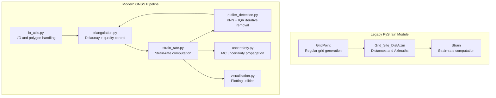
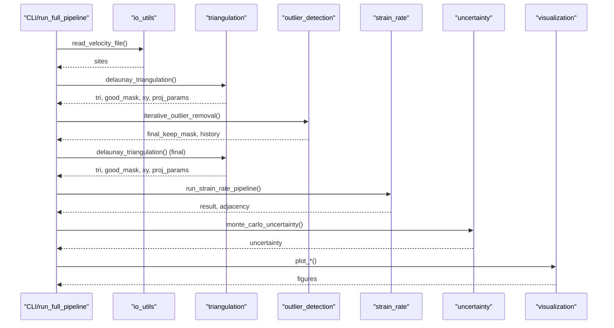
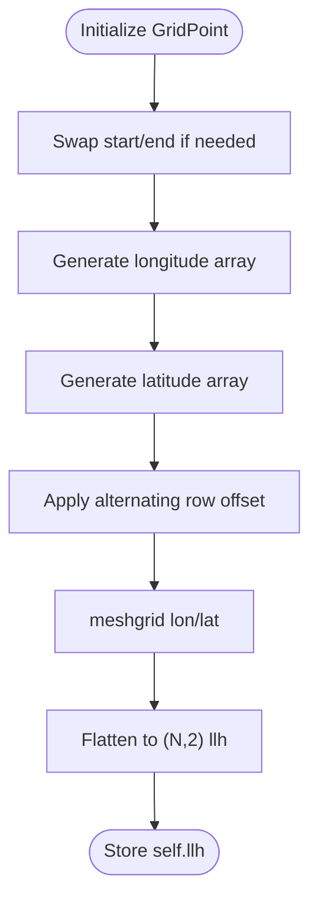
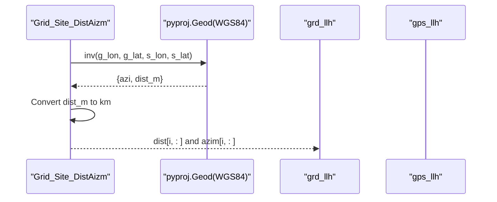
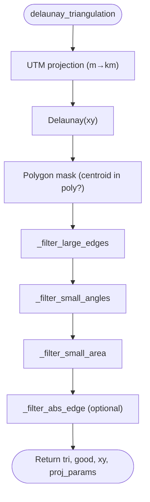
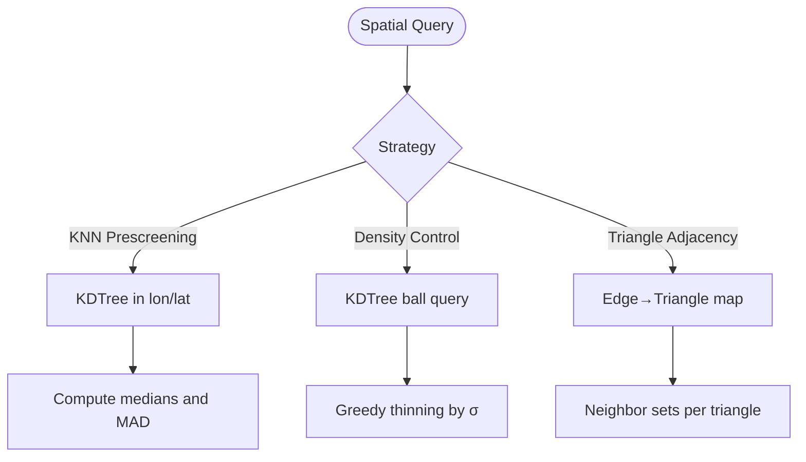
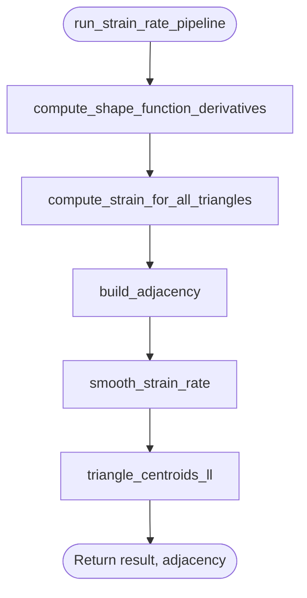
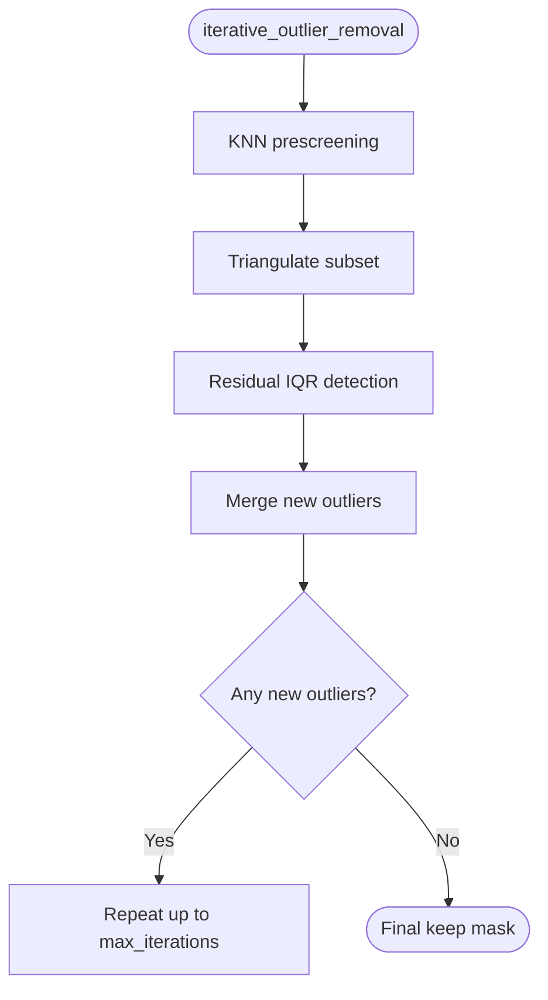
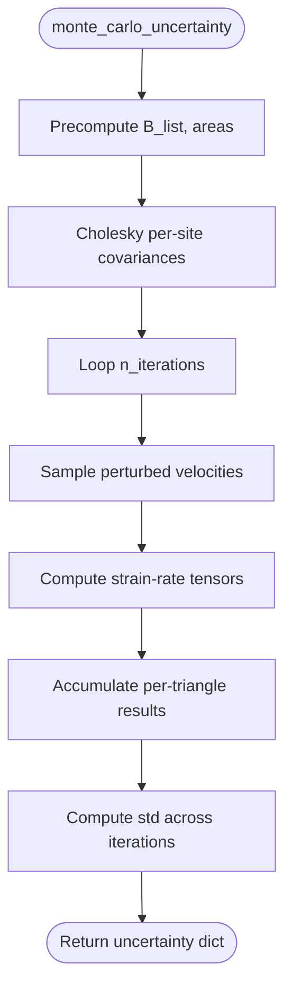
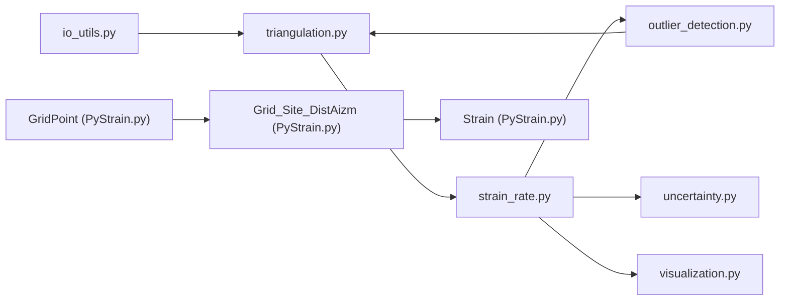

# Spatial Analysis Tools

<cite>
**Referenced Files in This Document**
- [PyStrain.py](file://src/pystrain/PyStrain.py)
- [gnss_strain.py](file://src/pystrain/gnss_strain/gnss_strain.py)
- [triangulation.py](file://src/pystrain/gnss_strain/triangulation.py)
- [strain_rate.py](file://src/pystrain/gnss_strain/strain_rate.py)
- [outlier_detection.py](file://src/pystrain/gnss_strain/outlier_detection.py)
- [io_utils.py](file://src/pystrain/gnss_strain/io_utils.py)
- [uncertainty.py](file://src/pystrain/gnss_strain/uncertainty.py)
- [visualization.py](file://src/pystrain/gnss_strain/visualization.py)
- [config_default.yaml](file://src/pystrain/gnss_strain/config_default.yaml)
- [config.yaml](file://test/config.yaml)
</cite>

## Table of Contents
1. [Introduction](#introduction)
2. [Project Structure](#project-structure)
3. [Core Components](#core-components)
4. [Architecture Overview](#architecture-overview)
5. [Detailed Component Analysis](#detailed-component-analysis)
6. [Dependency Analysis](#dependency-analysis)
7. [Performance Considerations](#performance-considerations)
8. [Troubleshooting Guide](#troubleshooting-guide)
9. [Conclusion](#conclusion)
10. [Appendices](#appendices)

## Introduction
This document provides comprehensive technical documentation for PyStrain’s spatial analysis components, focusing on:
- GridPoint generation for regular sampling patterns across geographic regions
- Grid_Site_DistAizm distance and azimuth computations using pyproj Geod operations
- GridPoint class functionality and spatial indexing strategies
- Neighbor search algorithms and spatial query optimizations
- Integration with triangulation methods and spatial masking for quality control
- Memory management and performance optimization for large spatial datasets

The goal is to enable both technical and non-technical users to understand how spatial grids are generated, how distances and azimuths are computed accurately, and how triangulation-based strain-rate estimation is performed with robust quality control.

## Project Structure
The spatial analysis functionality spans two major modules:
- Legacy PyStrain module (GridPoint, Grid_Site_DistAizm, distance/azimuth computation)
- Modern GNSS strain pipeline (triangulation, strain-rate computation, outlier detection, uncertainty propagation)

**Diagram sources**
- [PyStrain.py:320-514](file://src/pystrain/PyStrain.py#L320-L514)
- [gnss_strain.py:1-407](file://src/pystrain/gnss_strain/gnss_strain.py#L1-L407)
- [triangulation.py:1-477](file://src/pystrain/gnss_strain/triangulation.py#L1-L477)
- [strain_rate.py:1-438](file://src/pystrain/gnss_strain/strain_rate.py#L1-L438)
- [outlier_detection.py:1-292](file://src/pystrain/gnss_strain/outlier_detection.py#L1-L292)
- [uncertainty.py:1-150](file://src/pystrain/gnss_strain/uncertainty.py#L1-L150)
- [visualization.py:1-250](file://src/pystrain/gnss_strain/visualization.py#L1-L250)

**Section sources**
- [PyStrain.py:320-514](file://src/pystrain/PyStrain.py#L320-L514)
- [gnss_strain.py:1-407](file://src/pystrain/gnss_strain/gnss_strain.py#L1-L407)

## Core Components
- GridPoint: Generates a regular longitude/latitude grid with optional offset staggering for improved coverage.
- Grid_Site_DistAizm: Computes geodesic distances and azimuths between grid points and GPS sites using pyproj Geod.
- triangulation.py: Implements Delaunay triangulation with polygon clipping, edge-length and angle quality filters, and adjacency graph construction.
- strain_rate.py: Computes strain-rate tensors per triangle, derives principal strains and orientations, and applies smoothing.
- outlier_detection.py: KNN prescreening and iterative IQR-based outlier removal guided by triangulation quality.
- uncertainty.py: Monte Carlo propagation of velocity uncertainties to strain-rate outputs.
- visualization.py: Plotting utilities for triangulation overlays, scalar fields, and principal strain cross plots.

**Section sources**
- [PyStrain.py:320-514](file://src/pystrain/PyStrain.py#L320-L514)
- [triangulation.py:1-477](file://src/pystrain/gnss_strain/triangulation.py#L1-L477)
- [strain_rate.py:1-438](file://src/pystrain/gnss_strain/strain_rate.py#L1-L438)
- [outlier_detection.py:1-292](file://src/pystrain/gnss_strain/outlier_detection.py#L1-L292)
- [uncertainty.py:1-150](file://src/pystrain/gnss_strain/uncertainty.py#L1-L150)
- [visualization.py:1-250](file://src/pystrain/gnss_strain/visualization.py#L1-L250)

## Architecture Overview
The modern GNSS pipeline orchestrates data loading, triangulation, quality control, strain-rate computation, outlier detection, uncertainty propagation, and visualization.

**Diagram sources**
- [gnss_strain.py:52-341](file://src/pystrain/gnss_strain/gnss_strain.py#L52-L341)
- [io_utils.py:21-132](file://src/pystrain/gnss_strain/io_utils.py#L21-L132)
- [triangulation.py:89-146](file://src/pystrain/gnss_strain/triangulation.py#L89-L146)
- [outlier_detection.py:184-291](file://src/pystrain/gnss_strain/outlier_detection.py#L184-L291)
- [strain_rate.py:384-437](file://src/pystrain/gnss_strain/strain_rate.py#L384-L437)
- [uncertainty.py:14-149](file://src/pystrain/gnss_strain/uncertainty.py#L14-L149)
- [visualization.py:18-249](file://src/pystrain/gnss_strain/visualization.py#L18-L249)

## Detailed Component Analysis

### GridPoint Generation
GridPoint creates a regular longitude/latitude grid within specified bounds and applies a staggered offset pattern to improve spatial coverage.

Key behaviors:
- Validates and swaps start/end coordinates if needed.
- Generates evenly spaced longitude and latitude arrays.
- Applies alternating row offset to reduce sampling bias along rows.
- Stores flattened grid coordinates as llh array.

**Diagram sources**
- [PyStrain.py:320-349](file://src/pystrain/PyStrain.py#L320-L349)

**Section sources**
- [PyStrain.py:320-349](file://src/pystrain/PyStrain.py#L320-L349)

### Grid_Site_DistAizm Distance and Azimuth Computation
Grid_Site_DistAizm computes geodesic distances (converted to km) and azimuths between each grid point and all GPS sites using pyproj Geod with WGS84 ellipsoid.

Processing steps:
- Initialize pyproj Geod with WGS84.
- Iterate over grid points and GPS sites.
- Use inverse geodetic operation to compute forward azimuth and distance.
- Store results as dist (km) and azim arrays.

**Diagram sources**
- [PyStrain.py:494-514](file://src/pystrain/PyStrain.py#L494-L514)

**Section sources**
- [PyStrain.py:473-514](file://src/pystrain/PyStrain.py#L473-L514)

### Triangulation Quality Control and Spatial Indexing
The triangulation module performs:
- Coordinate projection from WGS84 to UTM-like plane (meters, then km) for numerical stability.
- Delaunay triangulation using scipy.spatial.Delaunay.
- Polygon clipping using matplotlib Path for centroid containment.
- Quality filters:
  - Large edge filtering via percentiles of pairwise distances (KDTree sampling for efficiency).
  - Small angle filtering using cosine rule.
  - Small area filtering using percentile thresholds.
  - Optional absolute edge-length cutoff.
- Adjacency graph construction for smoothing and neighbor queries.

**Diagram sources**
- [triangulation.py:89-146](file://src/pystrain/gnss_strain/triangulation.py#L89-L146)

**Section sources**
- [triangulation.py:89-282](file://src/pystrain/gnss_strain/triangulation.py#L89-L282)

### Neighbor Search and Spatial Queries
Two primary spatial search strategies are used:
- KDTree-based nearest neighbor search for KNN prescreening and site density control.
- Explicit geometric checks for polygon clipping and triangle adjacency.

Implementation highlights:
- KNN prescreening: Uses KDTree in lon/lat space to find k nearest neighbors and compute robust deviations via median and MAD.
- Density control: Greedy thinning by minimum spacing using KDTree ball queries.
- Triangle adjacency: Builds edge-to-triangle mapping to derive neighbor sets.

**Diagram sources**
- [outlier_detection.py:17-87](file://src/pystrain/gnss_strain/outlier_detection.py#L17-L87)
- [triangulation.py:442-476](file://src/pystrain/gnss_strain/triangulation.py#L442-L476)
- [triangulation.py:375-416](file://src/pystrain/gnss_strain/triangulation.py#L375-L416)

**Section sources**
- [outlier_detection.py:17-87](file://src/pystrain/gnss_strain/outlier_detection.py#L17-L87)
- [triangulation.py:442-476](file://src/pystrain/gnss_strain/triangulation.py#L442-L476)
- [triangulation.py:375-416](file://src/pystrain/gnss_strain/triangulation.py#L375-L416)

### Strain-Rate Computation and Smoothing
The strain-rate pipeline:
- Computes shape function derivatives per triangle to form gradient operators.
- Evaluates velocity gradients and derives strain-rate tensors.
- Computes principal strains and orientations.
- Applies spatial smoothing using triangle adjacency and weighted averaging.

**Diagram sources**
- [strain_rate.py:384-437](file://src/pystrain/gnss_strain/strain_rate.py#L384-L437)
- [strain_rate.py:126-198](file://src/pystrain/gnss_strain/strain_rate.py#L126-L198)
- [strain_rate.py:205-271](file://src/pystrain/gnss_strain/strain_rate.py#L205-L271)

**Section sources**
- [strain_rate.py:126-198](file://src/pystrain/gnss_strain/strain_rate.py#L126-L198)
- [strain_rate.py:205-271](file://src/pystrain/gnss_strain/strain_rate.py#L205-L271)
- [strain_rate.py:384-437](file://src/pystrain/gnss_strain/strain_rate.py#L384-L437)

### Outlier Detection and Iterative Quality Control
The outlier detection workflow combines:
- KNN prescreening to flag potential outliers based on neighborhood deviations.
- Iterative triangulation and residual IQR detection to remove persistent outliers.
- Maintains a history of removed sites with reasons and iterations.

**Diagram sources**
- [outlier_detection.py:184-291](file://src/pystrain/gnss_strain/outlier_detection.py#L184-L291)

**Section sources**
- [outlier_detection.py:184-291](file://src/pystrain/gnss_strain/outlier_detection.py#L184-L291)

### Uncertainty Propagation via Monte Carlo
Monte Carlo uncertainty quantification:
- Precomputes shape function derivatives and triangle areas.
- Constructs per-site covariance matrices and applies Cholesky decomposition.
- Repeatedly samples perturbed velocity fields and recomputes strain-rate tensors.
- Aggregates statistics to produce standard deviations for derived quantities.

**Diagram sources**
- [uncertainty.py:14-149](file://src/pystrain/gnss_strain/uncertainty.py#L14-L149)

**Section sources**
- [uncertainty.py:14-149](file://src/pystrain/gnss_strain/uncertainty.py#L14-L149)

### Integration with Triangulation and Spatial Masking
- Polygon boundary masking ensures only triangles whose centroids lie within the study region are retained.
- Quality filters prevent degenerate or overly large triangles from skewing results.
- Post-processing smoothing leverages adjacency to stabilize estimates across neighboring triangles.

**Section sources**
- [triangulation.py:149-168](file://src/pystrain/gnss_strain/triangulation.py#L149-L168)
- [triangulation.py:170-257](file://src/pystrain/gnss_strain/triangulation.py#L170-L257)
- [strain_rate.py:205-271](file://src/pystrain/gnss_strain/strain_rate.py#L205-L271)

## Dependency Analysis
High-level dependencies among spatial analysis components:

**Diagram sources**
- [gnss_strain.py:17-27](file://src/pystrain/gnss_strain/gnss_strain.py#L17-L27)
- [PyStrain.py:473-514](file://src/pystrain/PyStrain.py#L473-L514)

**Section sources**
- [gnss_strain.py:17-27](file://src/pystrain/gnss_strain/gnss_strain.py#L17-L27)
- [PyStrain.py:473-514](file://src/pystrain/PyStrain.py#L473-L514)

## Performance Considerations
- Distance sampling for edge-length filtering:
  - For small datasets (<500 sites), all pairwise distances are computed.
  - For larger datasets, random sampling of 5000 pairs is used to estimate percentiles efficiently.
- KDTree usage:
  - KNN prescreening and density thinning rely on KDTree for neighbor queries and ball queries.
- Projection scaling:
  - Coordinates are converted from meters to kilometers to align units with velocity uncertainties and achieve physically meaningful strain-rate units.
- Smoothing:
  - Weighted averaging across triangle adjacency reduces noise while preserving spatial coherence.
- Memory management:
  - Intermediate arrays are reused where possible; large arrays are released promptly after use.
  - Monte Carlo uncertainty stores all iterations’ results; consider reducing iterations for large datasets.

[No sources needed since this section provides general guidance]

## Troubleshooting Guide
Common issues and resolutions:
- Too few valid triangles after quality filtering:
  - Relax min_angle_deg, increase max_edge_pctl or max_edge_factor, or reduce max_edge_km.
  - Verify polygon boundaries and ensure sufficient coverage.
- Poor triangulation near edges:
  - Increase polygon padding or adjust boundary definition.
- Excessive outliers:
  - Adjust k_neighbors, mad_factor, and iqr_factor in outlier detection.
- Slow performance:
  - Reduce mc_iterations for uncertainty propagation.
  - Consider enabling min_spacing_km to reduce dataset density.

**Section sources**
- [triangulation.py:89-146](file://src/pystrain/gnss_strain/triangulation.py#L89-L146)
- [outlier_detection.py:184-291](file://src/pystrain/gnss_strain/outlier_detection.py#L184-L291)
- [config_default.yaml:29-62](file://src/pystrain/gnss_strain/config_default.yaml#L29-L62)

## Conclusion
PyStrain’s spatial analysis toolkit integrates robust grid generation, precise geodesic distance and azimuth computation, efficient triangulation with quality control, and comprehensive uncertainty propagation. The modular design enables flexible configuration of spatial resolution, neighbor search strategies, and smoothing parameters, balancing accuracy and computational efficiency for large-scale strain-rate estimation.

[No sources needed since this section summarizes without analyzing specific files]

## Appendices

### Grid Parameter Selection and Spatial Resolution Guidelines
- GridPoint parameters:
  - dn/de define longitudinal and latitudinal spacing; smaller values increase resolution but cost memory and computation.
  - Consider regional curvature and target spatial scales when selecting dn/de.
- Distance and azimuth parameters:
  - maxdist controls the search radius for local strain estimation; ensure adequate station density within this radius.
  - minsite sets the minimum number of stations required for reliable estimation.
- Triangulation parameters:
  - min_angle_deg balances triangle regularity versus coverage near boundaries.
  - max_edge_pctl and max_edge_factor control sensitivity to long edges; tune to avoid spurious connections.
  - max_edge_km provides an absolute upper bound on triangle edges.

**Section sources**
- [PyStrain.py:320-349](file://src/pystrain/PyStrain.py#L320-L349)
- [PyStrain.py:473-514](file://src/pystrain/PyStrain.py#L473-L514)
- [config_default.yaml:29-48](file://src/pystrain/gnss_strain/config_default.yaml#L29-L48)
- [config.yaml:14-33](file://test/config.yaml#L14-L33)

### Example Workflows
- Regular grid-based strain-rate estimation:
  - Configure GridPoint with desired dn/de and use Grid_Site_DistAizm to compute distances/azimuths.
  - Apply Strain.strainrate with optional distance-weighting to estimate strain-rate tensors.
- Triangulation-based strain-rate estimation:
  - Use run_full_pipeline to load velocity data, apply triangulation with quality filters, iterative outlier removal, and smoothing.
  - Export results and uncertainty estimates for visualization and reporting.

**Section sources**
- [PyStrain.py:572-659](file://src/pystrain/PyStrain.py#L572-L659)
- [gnss_strain.py:52-341](file://src/pystrain/gnss_strain/gnss_strain.py#L52-L341)