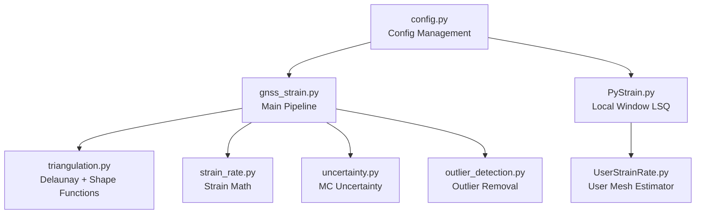
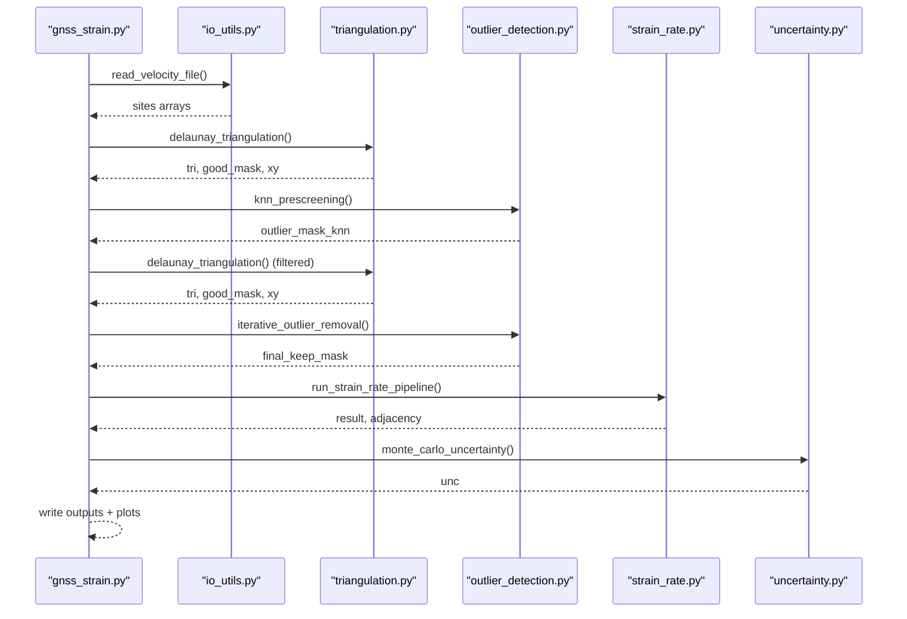
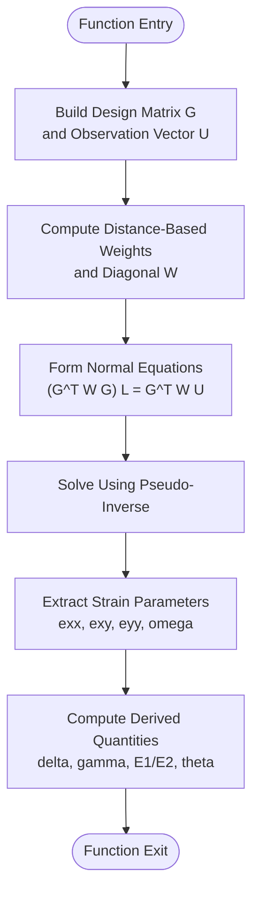
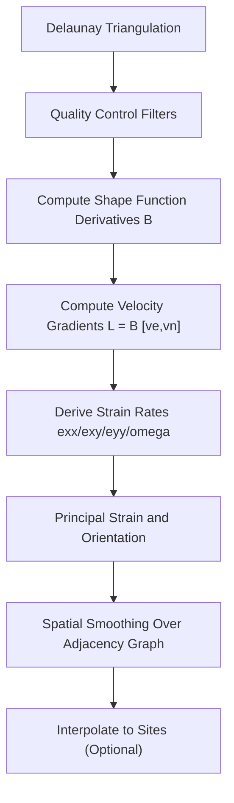
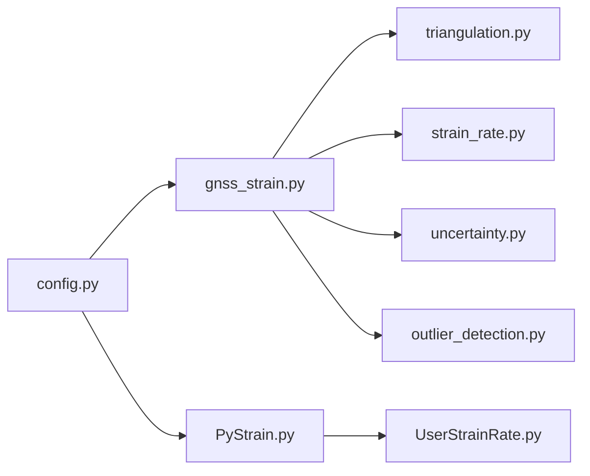

# Strain Computation Algorithms

<cite>
**Referenced Files in This Document**
- [PyStrain.py](file://src/pystrain/PyStrain.py)
- [UserStrainRate.py](file://src/pystrain/UserStrainRate.py)
- [gnss_strain.py](file://src/pystrain/gnss_strain/gnss_strain.py)
- [strain_rate.py](file://src/pystrain/gnss_strain/strain_rate.py)
- [triangulation.py](file://src/pystrain/gnss_strain/triangulation.py)
- [uncertainty.py](file://src/pystrain/gnss_strain/uncertainty.py)
- [outlier_detection.py](file://src/pystrain/gnss_strain/outlier_detection.py)
- [config.py](file://src/pystrain/gnss_strain/config.py)
- [config_default.yaml](file://src/pystrain/gnss_strain/config_default.yaml)
- [do_pystrain.py](file://src/pystrain/scripts/do_pystrain.py)
</cite>

## Table of Contents
1. [Introduction](#introduction)
2. [Project Structure](#project-structure)
3. [Core Components](#core-components)
4. [Architecture Overview](#architecture-overview)
5. [Detailed Component Analysis](#detailed-component-analysis)
6. [Dependency Analysis](#dependency-analysis)
7. [Performance Considerations](#performance-considerations)
8. [Troubleshooting Guide](#troubleshooting-guide)
9. [Conclusion](#conclusion)

## Introduction
This document provides comprehensive technical documentation for PyStrain's core strain computation algorithms, focusing on the Strain class and strainrate static method. It explains the mathematical formulation of strain rate tensor computation using least squares optimization with weighted residuals, the geometric relationship between GPS velocity vectors and strain rate parameters, weighting schemes, distance-based influence functions, numerical stability considerations, derivation of principal strain rates and orientations, maximum shear strain, uncertainty propagation, and algorithmic complexity analysis with optimization techniques for large-scale computations.

## Project Structure
PyStrain implements two complementary approaches for computing strain rates from GNSS velocity fields:
- Local window-based least-squares fitting (Strain class)
- Triangulation-based finite element approach (triangulation + shape functions)

Key modules:
- PyStrain.py: Core classes and the Strain.strainrate static method
- gnss_strain.py: End-to-end pipeline orchestrating data loading, triangulation, outlier detection, strain computation, uncertainty propagation, and visualization
- strain_rate.py: Mathematical formulations for velocity gradient → strain rate tensors, principal strain computation, and smoothing
- triangulation.py: Delaunay triangulation, quality control, shape function derivatives, adjacency graph construction
- uncertainty.py: Monte Carlo uncertainty propagation
- outlier_detection.py: KNN prescreening and residual-based iterative outlier removal
- config.py and config_default.yaml: Configuration management and defaults

**Diagram sources**
- [gnss_strain.py:34-46](file://src/pystrain/gnss_strain/gnss_strain.py#L34-L46)
- [triangulation.py:89-146](file://src/pystrain/gnss_strain/triangulation.py#L89-L146)
- [strain_rate.py:18-57](file://src/pystrain/gnss_strain/strain_rate.py#L18-L57)
- [uncertainty.py:14-42](file://src/pystrain/gnss_strain/uncertainty.py#L14-L42)
- [outlier_detection.py:17-87](file://src/pystrain/gnss_strain/outlier_detection.py#L17-L87)
- [PyStrain.py:363-470](file://src/pystrain/PyStrain.py#L363-L470)
- [UserStrainRate.py:5-126](file://src/pystrain/UserStrainRate.py#L5-L126)
- [config.py:56-91](file://src/pystrain/gnss_strain/config.py#L56-L91)

**Section sources**
- [gnss_strain.py:1-407](file://src/pystrain/gnss_strain/gnss_strain.py#L1-L407)
- [PyStrain.py:1-800](file://src/pystrain/PyStrain.py#L1-L800)
- [config.py:18-50](file://src/pystrain/gnss_strain/config.py#L18-L50)

## Core Components
- Strain.strainrate(x, y, ve, vn, se, sn, gridweight=None): Implements local window-based least-squares strain rate estimation with weighted residuals. Outputs exx, exy, eyy, omega, E1, E2, gamma, delta, theta, and second invariant.
- triangulation.py: Provides Delaunay triangulation, quality filters, shape function derivative matrices B, adjacency graph, and centroid computations.
- strain_rate.py: Computes velocity gradients from B and nodal velocities, converts to strain rate tensors, derives principal strains and orientations, and applies spatial smoothing.
- uncertainty.py: Monte Carlo propagation of velocity uncertainties to strain rate outputs.
- outlier_detection.py: KNN prescreening and residual-based iterative outlier removal to improve robustness.
- gnss_strain.py: Full pipeline integrating data loading, triangulation, outlier detection, strain computation, uncertainty, and visualization.

**Section sources**
- [PyStrain.py:363-470](file://src/pystrain/PyStrain.py#L363-L470)
- [triangulation.py:312-368](file://src/pystrain/gnss_strain/triangulation.py#L312-L368)
- [strain_rate.py:18-57](file://src/pystrain/gnss_strain/strain_rate.py#L18-L57)
- [uncertainty.py:14-150](file://src/pystrain/gnss_strain/uncertainty.py#L14-L150)
- [outlier_detection.py:17-292](file://src/pystrain/gnss_strain/outlier_detection.py#L17-L292)

## Architecture Overview
The system follows a modular pipeline:
1. Data ingestion and preprocessing
2. Triangulation and quality control
3. Outlier detection and removal
4. Strain rate computation (local window LSQ or triangulation-based)
5. Uncertainty propagation
6. Post-processing and visualization

**Diagram sources**
- [gnss_strain.py:92-341](file://src/pystrain/gnss_strain/gnss_strain.py#L92-L341)
- [triangulation.py:89-146](file://src/pystrain/gnss_strain/triangulation.py#L89-L146)
- [outlier_detection.py:184-292](file://src/pystrain/gnss_strain/outlier_detection.py#L184-L292)
- [strain_rate.py:384-437](file://src/pystrain/gnss_strain/strain_rate.py#L384-L437)
- [uncertainty.py:14-150](file://src/pystrain/gnss_strain/uncertainty.py#L14-L150)

## Detailed Component Analysis

### Strain Class and strainrate Static Method
The Strain.strainrate method performs a local window least-squares fit to estimate the strain rate tensor at a given point. It constructs a linearized observation equation relating predicted velocities to strain parameters and solves for the optimal parameters using weighted least squares.

Mathematical formulation:
- Local coordinate system: x, y in km from reference point
- Observation vector: U = [ve[1], vn[1], ve[2], vn[2], ...]^T
- Design matrix G with rows:
  - For east equation: [1, 0, x_i/1e3, y_i/1e3, 0, y_i/1e3]
  - For north equation: [0, 1, 0, x_i/1e3, y_i/1e3, -x_i/1e3]
- Weight matrix W diagonal with entries 1/(se_i*w)^2 and 1/(sn_i*w)^2
- Normal equations: L = (G^T W G)^{-1} G^T W U
- Strain parameters: L = [dx, dy, exx, exy, eyy, omega]^T
- Derived quantities:
  - Dilatation: delta = exx + eyy
  - Maximum shear: gamma = sqrt((eyy - exx)^2 + (2*exy)^2)
  - Principal strains: E1, E2 from eigen-decomposition of [exx, exy; exy, eyy]
  - Orientation: theta from atan2(2*exy, eyy - exx)

Weighting scheme:
- Uniform weight (w=1) or distance-based exponential weight w = exp(D_i^2/R0^2) where D_i is Euclidean distance in km
- Weights are applied to the diagonal entries of W, affecting residual variance and parameter precision

Numerical stability:
- Uses pseudo-inverse of G^T W G to handle rank-deficient systems
- Unit conversion from mm/(km·yr) to nstrain/yr by multiplying by 1000

Principal strain computation:
- Characteristic polynomial of strain tensor yields eigenvalues E1, E2
- Azimuth angle computed from eigenvector alignment with coordinate axes

Maximum shear and invariants:
- Maximum shear: gamma = (E1 - E2)/2
- Second invariant: sqrt(E1^2 + E2^2)

Statistical significance:
- Implemented via Monte Carlo uncertainty propagation in uncertainty.py

Algorithmic complexity:
- Per-window cost: O(N_sites × 6^2) for forming and solving normal equations
- For N windows: O(N × N_sites × 36) assuming dense G; typically dominated by sparse structure

Optimization techniques:
- Precompute and reuse design matrix structure
- Use sparse solvers when applicable
- Parallelize independent windows
- Reduce redundant computations by caching intermediate results

**Diagram sources**
- [PyStrain.py:387-469](file://src/pystrain/PyStrain.py#L387-L469)

**Section sources**
- [PyStrain.py:363-470](file://src/pystrain/PyStrain.py#L363-L470)

### Triangulation-Based Strain Rate Computation
The triangulation-based approach computes strain rates over triangular patches using shape functions and velocity gradients.

Key steps:
- Delaunay triangulation with quality control (minimum angle, maximum edge thresholds, area thresholds)
- Shape function derivatives B computed for each triangle
- Velocity gradient L = B [ve, vn]^T for each triangle
- Strain rate components from L: exx, exy, eyy, omega
- Principal strain rates and orientations derived from strain tensor
- Spatial smoothing via weighted averaging over adjacent triangles

Quality control filters:
- Minimum angle filter prevents highly distorted triangles
- Edge length percentile filter removes triangles with excessively long sides
- Area threshold filter removes degenerate or overly small triangles
- Optional absolute edge length limit

Smoothing:
- Iterative weighted average: ε'_i = (1-w) ε_i + w mean(ε_neighbors)
- Boundary triangles receive reduced weight

**Diagram sources**
- [triangulation.py:89-146](file://src/pystrain/gnss_strain/triangulation.py#L89-L146)
- [strain_rate.py:18-57](file://src/pystrain/gnss_strain/strain_rate.py#L18-L57)
- [strain_rate.py:205-271](file://src/pystrain/gnss_strain/strain_rate.py#L205-L271)

**Section sources**
- [triangulation.py:312-368](file://src/pystrain/gnss_strain/triangulation.py#L312-L368)
- [strain_rate.py:126-198](file://src/pystrain/gnss_strain/strain_rate.py#L126-L198)
- [strain_rate.py:205-271](file://src/pystrain/gnss_strain/strain_rate.py#L205-L271)

### Uncertainty Propagation (Monte Carlo)
Uncertainty propagation quantifies variability in strain rate estimates due to GPS velocity measurement uncertainties and correlations.

Method:
- Fixed triangulation topology
- For each iteration:
  - Sample velocity perturbations from multivariate normal with covariance Σ_i
  - Recompute strain rates for all triangles
  - Collect statistics across iterations
- Output standard deviations for exx, exy, eyy, E1, E2, dilatation, max shear

Covariance modeling:
- Σ_i = [[se_i^2, ρ_i se_i sn_i], [ρ_i se_i sn_i, sn_i^2]]
- Cholesky decomposition L_i L_i^T = Σ_i for sampling

Statistical significance:
- Confidence intervals derived from empirical distributions
- Threshold-based significance testing can be performed using computed standard deviations

**Section sources**
- [uncertainty.py:14-150](file://src/pystrain/gnss_strain/uncertainty.py#L14-L150)

### Outlier Detection and Robustness
Two-stage outlier detection improves robustness:
- KNN prescreening: Compares each site’s velocity to its K nearest neighbors using median absolute deviation (MAD)
- Residual-based iterative removal: After triangulation, detects outliers via residuals of local neighbor predictions

Residual computation:
- For each site, collect velocities from neighboring sites in the triangulation
- Predict velocity as median of neighbors; residual is norm of difference
- Outliers flagged by IQR criterion

**Section sources**
- [outlier_detection.py:17-87](file://src/pystrain/gnss_strain/outlier_detection.py#L17-L87)
- [outlier_detection.py:94-177](file://src/pystrain/gnss_strain/outlier_detection.py#L94-L177)
- [outlier_detection.py:184-292](file://src/pystrain/gnss_strain/outlier_detection.py#L184-L292)

## Dependency Analysis
The modules exhibit clear separation of concerns with explicit dependencies:
- gnss_strain.py depends on triangulation.py, strain_rate.py, uncertainty.py, outlier_detection.py, and io_utils
- strain_rate.py depends on triangulation.py for shape function derivatives
- uncertainty.py depends on triangulation.py and strain_rate.py for repeated computations
- PyStrain.py provides standalone local window LSQ functionality independent of triangulation

**Diagram sources**
- [gnss_strain.py:17-27](file://src/pystrain/gnss_strain/gnss_strain.py#L17-L27)
- [strain_rate.py:9-11](file://src/pystrain/gnss_strain/strain_rate.py#L9-L11)
- [uncertainty.py:9-11](file://src/pystrain/gnss_strain/uncertainty.py#L9-L11)
- [PyStrain.py:1-800](file://src/pystrain/PyStrain.py#L1-L800)
- [config.py:56-91](file://src/pystrain/gnss_strain/config.py#L56-L91)

**Section sources**
- [gnss_strain.py:17-27](file://src/pystrain/gnss_strain/gnss_strain.py#L17-L27)
- [strain_rate.py:9-11](file://src/pystrain/gnss_strain/strain_rate.py#L9-L11)
- [uncertainty.py:9-11](file://src/pystrain/gnss_strain/uncertainty.py#L9-L11)

## Performance Considerations
- Computational complexity:
  - Local window LSQ: O(N_windows × N_sites × 6^2) per window; parallelizable across windows
  - Triangulation-based: O(N_triangles × 6^2) for normal equations plus O(N_triangles × degree) for smoothing
- Memory usage:
  - Store G, W, and intermediate results for each window/triangle
  - Sparse structures can reduce memory footprint
- Numerical stability:
  - Use pseudo-inverse to handle rank-deficient systems
  - Regularization via small damping term can be added if needed
- Scalability:
  - Parallelize independent computations (windows or triangles)
  - Use efficient sparse solvers for large systems
  - Cache shape function derivatives and adjacency graphs
- I/O optimization:
  - Batch reads/writes for large datasets
  - Use memory-mapped files for very large velocity fields

## Troubleshooting Guide
Common issues and remedies:
- No valid triangles after quality filtering:
  - Relax min_angle_deg, increase max_edge_pctl, or reduce max_edge_factor
  - Check polygon boundaries and ensure sufficient coverage
- Poor convergence or unstable solutions:
  - Increase regularization or use robust estimators
  - Verify units and coordinate projections
- Excessive outliers:
  - Adjust mad_factor and iqr_factor thresholds
  - Consider enabling min_spacing_km to reduce density effects
- Slow performance:
  - Enable parallel processing where possible
  - Reduce mc_iterations for uncertainty propagation
  - Use smaller smoothing weights and iterations

Configuration validation ensures parameters remain within safe ranges and provides informative error messages for invalid settings.

**Section sources**
- [gnss_strain.py:166-168](file://src/pystrain/gnss_strain/gnss_strain.py#L166-L168)
- [config.py:143-195](file://src/pystrain/gnss_strain/config.py#L143-L195)

## Conclusion
PyStrain provides robust, mathematically sound algorithms for computing strain rates from GNSS velocity fields. The local window least-squares approach offers flexibility and interpretability, while the triangulation-based method provides spatially continuous estimates with rigorous smoothing and uncertainty quantification. The modular architecture enables easy configuration, robust outlier handling, and scalable performance suitable for large regional studies.