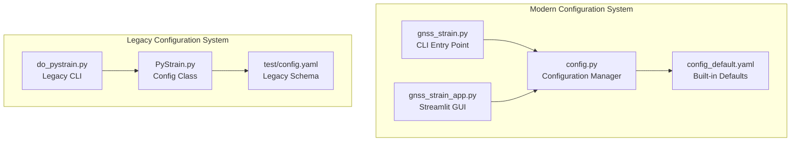
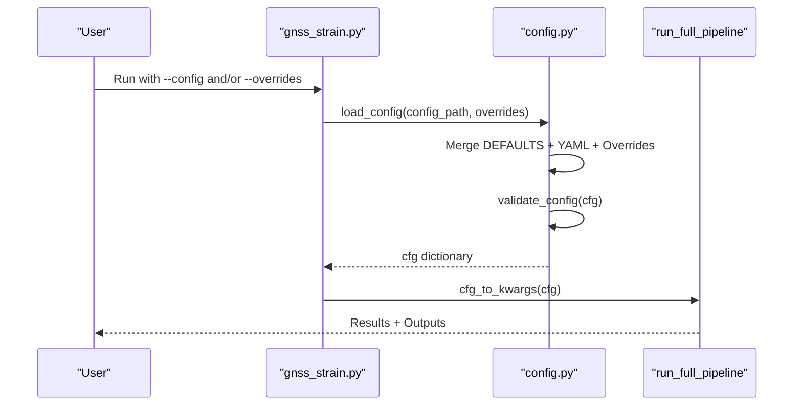
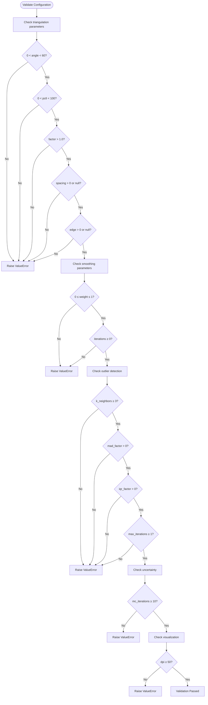
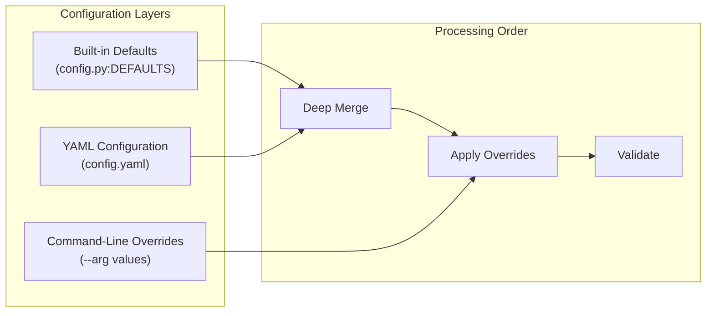
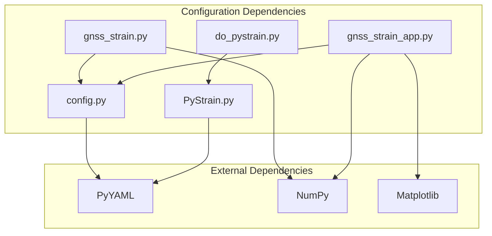

# Configuration System

<cite>
**Referenced Files in This Document**
- [config_default.yaml](file://src/pystrain/gnss_strain/config_default.yaml)
- [config.py](file://src/pystrain/gnss_strain/config.py)
- [gnss_strain.py](file://src/pystrain/gnss_strain/gnss_strain.py)
- [gnss_strain_app.py](file://src/pystrain/gnss_strain/gnss_strain_app.py)
- [do_pystrain.py](file://src/pystrain/scripts/do_pystrain.py)
- [config.yaml](file://test/config.yaml)
- [PyStrain.py](file://src/pystrain/PyStrain.py)
</cite>

## Table of Contents
1. [Introduction](#introduction)
2. [Project Structure](#project-structure)
3. [Core Components](#core-components)
4. [Architecture Overview](#architecture-overview)
5. [Detailed Component Analysis](#detailed-component-analysis)
6. [Dependency Analysis](#dependency-analysis)
7. [Performance Considerations](#performance-considerations)
8. [Troubleshooting Guide](#troubleshooting-guide)
9. [Conclusion](#conclusion)

## Introduction
This document provides comprehensive documentation for PyStrain's configuration management system, focusing on YAML-based parameter specification and runtime customization. It covers the complete configuration schema, parameter defaults, validation rules, hierarchical configuration structure, and the relationship between YAML configuration and program execution flow. The system supports three configuration layers: built-in defaults, YAML configuration files, and command-line overrides, with strict validation and precedence rules.

## Project Structure
The configuration system spans two distinct but complementary implementations within the PyStrain project:

- **Modern Streamlit Application**: Uses a unified YAML schema with nested sections for different analysis modes
- **Legacy Command-Line Interface**: Uses a separate configuration class and different YAML structure

**Diagram sources**
- [gnss_strain.py:348-406](file://src/pystrain/gnss_strain/gnss_strain.py#L348-L406)
- [config.py:56-90](file://src/pystrain/gnss_strain/config.py#L56-L90)
- [gnss_strain_app.py:163-241](file://src/pystrain/gnss_strain/gnss_strain_app.py#L163-L241)
- [do_pystrain.py:7-36](file://src/pystrain/scripts/do_pystrain.py#L7-L36)
- [PyStrain.py:98-126](file://src/pystrain/PyStrain.py#L98-L126)

**Section sources**
- [gnss_strain.py:348-406](file://src/pystrain/gnss_strain/gnss_strain.py#L348-L406)
- [config.py:56-90](file://src/pystrain/gnss_strain/config.py#L56-L90)
- [gnss_strain_app.py:163-241](file://src/pystrain/gnss_strain/gnss_strain_app.py#L163-L241)
- [do_pystrain.py:7-36](file://src/pystrain/scripts/do_pystrain.py#L7-L36)
- [PyStrain.py:98-126](file://src/pystrain/PyStrain.py#L98-L126)

## Core Components

### Modern Configuration Manager (config.py)
The modern configuration system centers around a robust configuration manager that handles three-layer merging:

1. **Built-in Defaults**: Comprehensive default values for all parameters
2. **YAML Configuration**: User-provided configuration file
3. **Command-Line Overrides**: Runtime parameter overrides

Key features include:
- Deep merge of nested dictionaries
- Parameter validation with detailed error messages
- Automatic conversion between nested and flattened parameter formats
- Streamlit-compatible configuration export/import

**Section sources**
- [config.py:18-50](file://src/pystrain/gnss_strain/config.py#L18-L50)
- [config.py:56-90](file://src/pystrain/gnss_strain/config.py#L56-L90)
- [config.py:143-194](file://src/pystrain/gnss_strain/config.py#L143-L194)

### Legacy Configuration Class (PyStrain.py)
The legacy system uses a dedicated Config class that loads YAML files directly:

- Simple YAML parsing with PyYAML
- Direct access to configuration dictionary
- Used primarily by the legacy command-line interface

**Section sources**
- [PyStrain.py:98-126](file://src/pystrain/PyStrain.py#L98-L126)

## Architecture Overview

**Diagram sources**
- [gnss_strain.py:398-405](file://src/pystrain/gnss_strain/gnss_strain.py#L398-L405)
- [config.py:56-90](file://src/pystrain/gnss_strain/config.py#L56-L90)
- [config.py:222-241](file://src/pystrain/gnss_strain/config.py#L222-L241)

## Detailed Component Analysis

### Configuration Schema Definition

The modern configuration system defines a comprehensive schema with the following sections:

#### Data Section
Controls input data handling and output directories:
- `vel_file`: Path to velocity field file (default: './camp_eura.vel')
- `poly_file`: Polygon boundary file path (default: null)
- `output_dir`: Output directory path (default: './output')
- `format`: Input file format ('auto' | 'gmt' | 'globk')

#### Outlier Detection Section
Configures KNN-based outlier detection:
- `k_neighbors`: Number of neighbors for KNN (≥3)
- `mad_factor`: MAD threshold multiplier (>0)
- `iqr_factor`: IQR threshold multiplier (>0)
- `max_iterations`: Maximum iteration rounds (≥1)

#### Triangulation Section
Controls Delaunay triangulation quality and density:
- `min_angle_deg`: Minimum triangle angle (0, 60)
- `max_edge_pctl`: Maximum edge percentile (0, 100)
- `max_edge_factor`: Edge length factor (>1.0)
- `min_spacing_km`: Site spacing threshold (optional)
- `max_edge_km`: Absolute edge length limit (optional)

#### Smoothing Section
Controls spatial smoothing parameters:
- `weight`: Smoothing weight [0.0, 1.0]
- `iterations`: Smoothing iterations (≥0)

#### Uncertainty Section
Controls Monte Carlo uncertainty estimation:
- `mc_iterations`: Number of MC iterations (≥10)

#### Visualization Section
Controls output visualization:
- `dpi`: Image resolution (≥50)
- `save_figures`: Whether to save figures
- `show_figures`: Whether to display interactive windows

**Section sources**
- [config_default.yaml:6-69](file://src/pystrain/gnss_strain/config_default.yaml#L6-L69)
- [config.py:18-50](file://src/pystrain/gnss_strain/config.py#L18-L50)

### Parameter Validation Rules

The configuration system enforces strict validation rules:

**Diagram sources**
- [config.py:143-194](file://src/pystrain/gnss_strain/config.py#L143-L194)

### Execution Flow and Parameter Precedence

The configuration system follows a strict three-layer precedence model:

**Diagram sources**
- [config.py:56-90](file://src/pystrain/gnss_strain/config.py#L56-L90)
- [gnss_strain.py:398-400](file://src/pystrain/gnss_strain/gnss_strain.py#L398-L400)

### Legacy Configuration Schema

The legacy system uses a different YAML structure designed for strain rate and time series analysis:

#### Strain Rate Section
- `activate`: Enable/disable strain rate calculation
- `gpsvelo`: GPS velocity file path
- `velofmt`: Velocity file format ('GMT' | 'GLOBK')
- `grdmesh`: Grid-based estimation parameters
- `usrmesh`: User-defined mesh parameters  
- `trimesh`: Triangular mesh parameters

#### Strain Timeseries Section
- `activate`: Enable/disable time series calculation
- `gpsinfo`: GPS station information file
- `tstype`: Time series type ('pos')
- `tspath`: Time series storage path
- `gpsts`: GPS time series handling
- `sepoch`: Start epoch
- `eepoch`: End epoch
- `deltat`: Delta time

**Section sources**
- [config.yaml:1-123](file://test/config.yaml#L1-L123)

## Dependency Analysis

**Diagram sources**
- [config.py:75-78](file://src/pystrain/gnss_strain/config.py#L75-L78)
- [gnss_strain.py:350](file://src/pystrain/gnss_strain/gnss_strain.py#L350)
- [gnss_strain_app.py:21](file://src/pystrain/gnss_strain/gnss_strain_app.py#L21)
- [PyStrain.py:12](file://src/pystrain/PyStrain.py#L12)

**Section sources**
- [config.py:75-78](file://src/pystrain/gnss_strain/config.py#L75-L78)
- [gnss_strain.py:350](file://src/pystrain/gnss_strain/gnss_strain.py#L350)
- [gnss_strain_app.py:21](file://src/pystrain/gnss_strain/gnss_strain_app.py#L21)
- [PyStrain.py:12](file://src/pystrain/PyStrain.py#L12)

## Performance Considerations

### Configuration Loading Performance
- YAML parsing is performed once during startup
- Deep merge operations are O(n) where n is the number of parameters
- Validation occurs after all merges are complete
- Command-line overrides are processed as a simple dictionary update

### Memory Usage
- Configuration dictionaries are shallow-copied from defaults
- No deep copying occurs during YAML merge (efficient memory usage)
- Validation errors halt execution early, preventing unnecessary processing

## Troubleshooting Guide

### Common Configuration Errors

#### Missing Configuration File
**Symptom**: Configuration file not found error
**Solution**: Ensure the specified YAML file exists in the working directory
**Prevention**: Use absolute paths or verify file existence before execution

#### Unknown Parameters
**Symptom**: Warning messages about unknown sections or parameters
**Cause**: Parameters not defined in the configuration schema
**Solution**: Remove unknown parameters or add them to the schema
**Prevention**: Use the provided configuration templates

#### Parameter Range Violations
**Symptom**: ValueError with specific parameter range messages
**Examples**:
- `triangulation.min_angle_deg` must be in (0, 60)
- `smoothing.weight` must be in [0, 1]
- `uncertainty.mc_iterations` must be ≥ 10

**Solution**: Adjust parameters to meet validation requirements
**Prevention**: Use the provided validation ranges as guidelines

#### YAML Parsing Errors
**Symptom**: YAML parsing exceptions
**Causes**:
- Malformed YAML syntax
- Incorrect indentation
- Unsupported data types

**Solution**: Validate YAML syntax using external tools
**Prevention**: Use YAML linters and validators

### Best Practices for Configuration Management

#### Organizing Configurations by Study Area
1. **Regional Studies**: Create separate YAML files for different geographic regions
2. **Method-Specific Configurations**: Maintain different files for different analysis approaches
3. **Version Control**: Track configuration changes alongside code changes
4. **Documentation**: Include comments explaining parameter choices

#### Parameter Precedence Guidelines
1. **Defaults**: Use built-in defaults for standard parameters
2. **Regional Overrides**: Override defaults for specific study areas
3. **Method-Specific Settings**: Apply method-specific parameters last
4. **Runtime Overrides**: Use command-line arguments for temporary adjustments

#### Dynamic Configuration Updates
1. **Streamlit Integration**: Use the GUI for interactive parameter adjustment
2. **Batch Processing**: Create configuration templates for automated runs
3. **Environment Variables**: Consider environment-based parameter overrides
4. **Configuration Validation**: Always validate configurations before execution

**Section sources**
- [config.py:93-106](file://src/pystrain/gnss_strain/config.py#L93-L106)
- [config.py:143-194](file://src/pystrain/gnss_strain/config.py#L143-L194)

## Conclusion

PyStrain's configuration system provides a robust, flexible framework for managing analysis parameters across different study areas and methodologies. The modern system offers three-layer configuration management with strict validation, while the legacy system maintains backward compatibility for existing workflows. The system's design emphasizes clarity, validation, and ease of use, making it suitable for both interactive and automated analysis workflows.

Key strengths of the system include:
- Clear parameter validation with descriptive error messages
- Flexible configuration precedence model
- Support for both interactive GUI and batch processing
- Comprehensive documentation and examples
- Backward compatibility with legacy configurations

The configuration system serves as a foundation for reproducible scientific analysis while maintaining flexibility for diverse research applications.