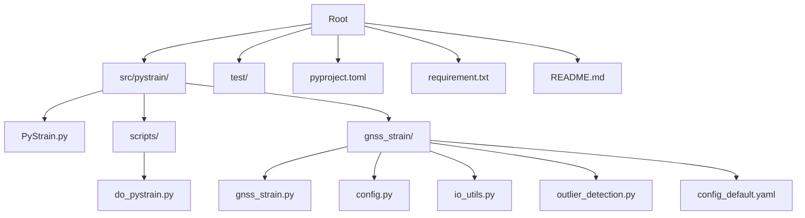
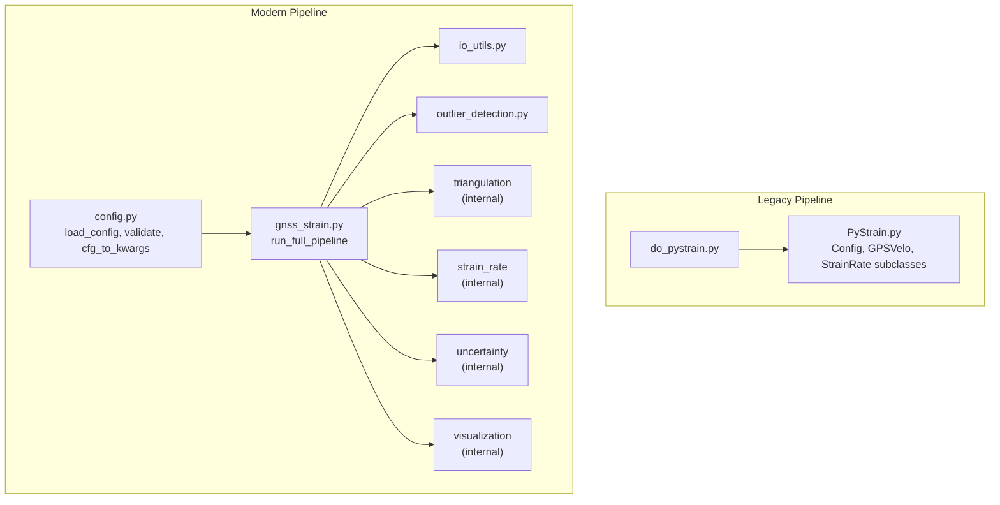
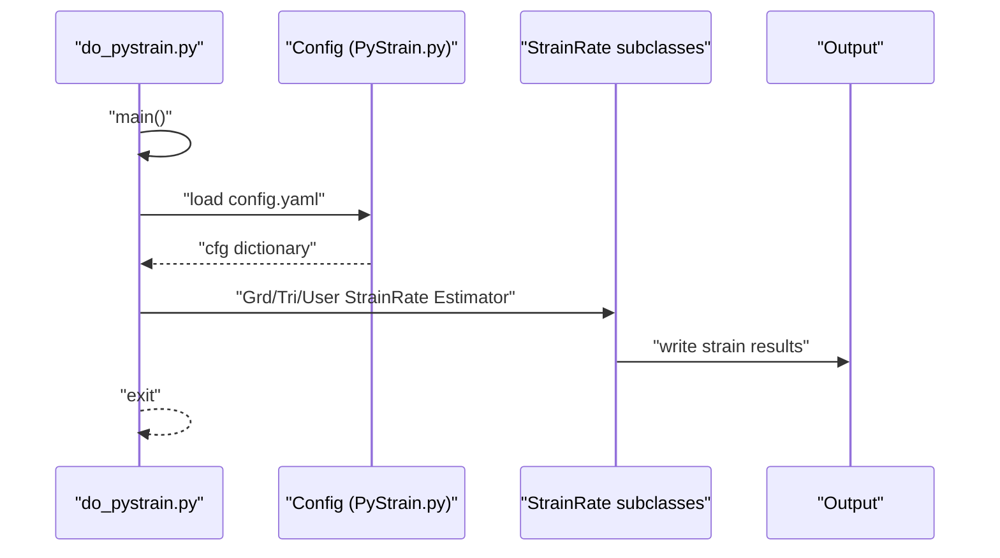
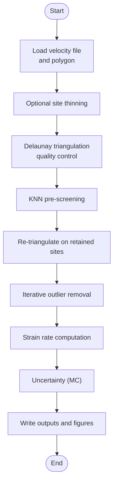
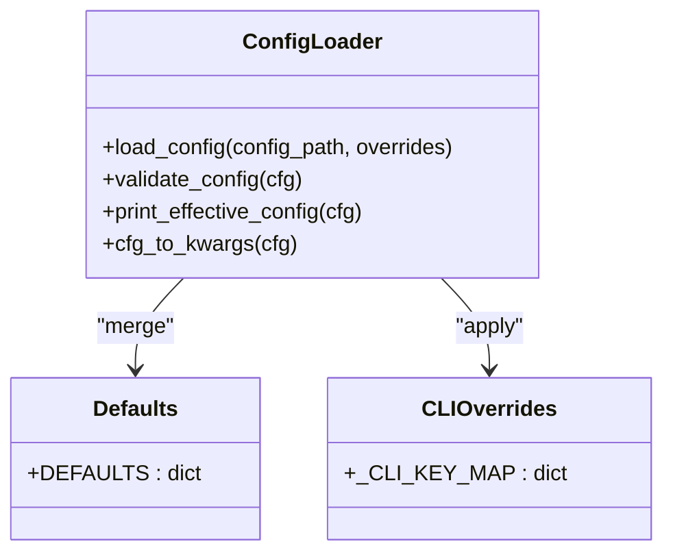
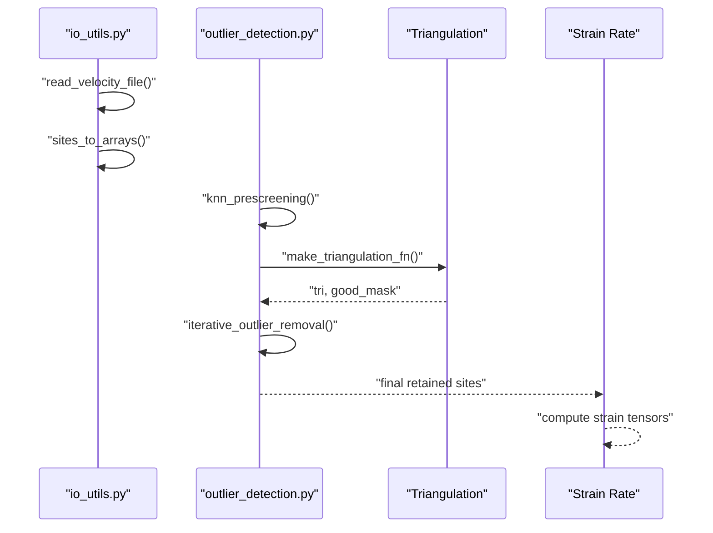
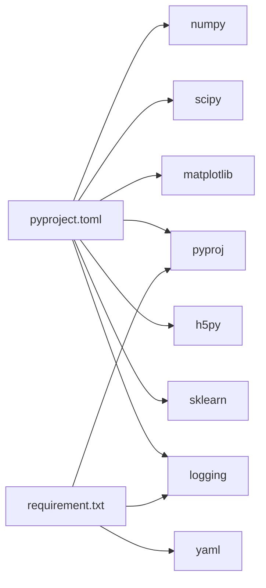

# Contributing and Development

<cite>
**Referenced Files in This Document**
- [README.md](file://README.md)
- [pyproject.toml](file://pyproject.toml)
- [requirement.txt](file://requirement.txt)
- [src/pystrain/gnss_strain/config_default.yaml](file://src/pystrain/gnss_strain/config_default.yaml)
- [src/pystrain/scripts/do_pystrain.py](file://src/pystrain/scripts/do_pystrain.py)
- [src/pystrain/PyStrain.py](file://src/pystrain/PyStrain.py)
- [src/pystrain/gnss_strain/gnss_strain.py](file://src/pystrain/gnss_strain/gnss_strain.py)
- [src/pystrain/gnss_strain/config.py](file://src/pystrain/gnss_strain/config.py)
- [src/pystrain/gnss_strain/io_utils.py](file://src/pystrain/gnss_strain/io_utils.py)
- [src/pystrain/gnss_strain/outlier_detection.py](file://src/pystrain/gnss_strain/outlier_detection.py)
- [test/config.yaml](file://test/config.yaml)
</cite>

## Table of Contents
1. [Introduction](#introduction)
2. [Project Structure](#project-structure)
3. [Core Components](#core-components)
4. [Architecture Overview](#architecture-overview)
5. [Detailed Component Analysis](#detailed-component-analysis)
6. [Dependency Analysis](#dependency-analysis)
7. [Development Environment Setup](#development-environment-setup)
8. [Testing Framework and Expectations](#testing-framework-and-expectations)
9. [Contribution Workflow](#contribution-workflow)
10. [Coding Standards and Conventions](#coding-standards-and-conventions)
11. [Documentation Requirements](#documentation-requirements)
12. [Governance and Decision-Making](#governance-and-decision-making)
13. [Licensing and Intellectual Property](#licensing-and-intellectual-property)
14. [Extending Functionality and Backward Compatibility](#extending-functionality-and-backward-compatibility)
15. [Development Tools and CI/CD](#development-tools-and-cicd)
16. [Release Management](#release-management)
17. [Troubleshooting Guide](#troubleshooting-guide)
18. [Conclusion](#conclusion)

## Introduction
This document provides comprehensive contributing guidelines for PyStrain, focusing on development standards, code organization, and community participation. It explains how to set up the development environment, how the code is structured and organized, and how contributions should be proposed and reviewed. It also covers coding standards, documentation requirements, testing expectations, governance, licensing, and release management.

## Project Structure
The repository is organized into:
- Python package under src/pystrain/, containing core strain estimation logic and a modern GNSS strain pipeline.
- Scripts under src/pystrain/scripts/ for command-line entry points.
- Test data and configuration under test/.
- Packaging metadata and dependencies under pyproject.toml and requirement.txt.
- A default configuration template for the legacy pipeline under src/pystrain/gnss_strain/config_default.yaml.

**Diagram sources**
- [src/pystrain/PyStrain.py:1-1481](file://src/pystrain/PyStrain.py#L1-L1481)
- [src/pystrain/scripts/do_pystrain.py:1-39](file://src/pystrain/scripts/do_pystrain.py#L1-L39)
- [src/pystrain/gnss_strain/gnss_strain.py:1-407](file://src/pystrain/gnss_strain/gnss_strain.py#L1-L407)
- [src/pystrain/gnss_strain/config.py:1-242](file://src/pystrain/gnss_strain/config.py#L1-L242)
- [src/pystrain/gnss_strain/io_utils.py:1-270](file://src/pystrain/gnss_strain/io_utils.py#L1-L270)
- [src/pystrain/gnss_strain/outlier_detection.py:1-292](file://src/pystrain/gnss_strain/outlier_detection.py#L1-L292)
- [src/pystrain/gnss_strain/config_default.yaml:1-69](file://src/pystrain/gnss_strain/config_default.yaml#L1-L69)
- [test/config.yaml:1-123](file://test/config.yaml#L1-L123)

**Section sources**
- [README.md:1-2](file://README.md#L1-L2)
- [pyproject.toml:1-31](file://pyproject.toml#L1-L31)
- [requirement.txt:1-4](file://requirement.txt#L1-L4)

## Core Components
- Legacy strain estimation engine: Centralized in PyStrain.py with classes for configuration, GPS velocity handling, triangulation, strain rate computation, and output.
- Modern GNSS pipeline: Implemented in gnss_strain.py with modular modules for IO, triangulation, outlier detection, strain rate computation, uncertainty quantification, and visualization.
- Command-line entry points: do_pystrain.py orchestrates legacy pipeline execution via a YAML configuration.
- Configuration system: Two complementary systems exist—one YAML-driven for the legacy pipeline and a Python-based configuration loader for the modern pipeline.

Key responsibilities:
- PyStrain.py: Data loading, coordinate transforms, strain rate estimation, and file output.
- gnss_strain.py: End-to-end pipeline orchestration, parameter validation, and output generation.
- config.py: Default parameters, YAML merging, CLI overrides, validation, and printing effective configuration.
- io_utils.py: Velocity and polygon file parsing, array conversion, and output writing.
- outlier_detection.py: Pre-screening and iterative outlier removal using spatial statistics.

**Section sources**
- [src/pystrain/PyStrain.py:98-1481](file://src/pystrain/PyStrain.py#L98-L1481)
- [src/pystrain/gnss_strain/gnss_strain.py:1-407](file://src/pystrain/gnss_strain/gnss_strain.py#L1-L407)
- [src/pystrain/gnss_strain/config.py:1-242](file://src/pystrain/gnss_strain/config.py#L1-L242)
- [src/pystrain/gnss_strain/io_utils.py:1-270](file://src/pystrain/gnss_strain/io_utils.py#L1-L270)
- [src/pystrain/gnss_strain/outlier_detection.py:1-292](file://src/pystrain/gnss_strain/outlier_detection.py#L1-L292)

## Architecture Overview
The project supports two complementary pipelines:
- Legacy pipeline: Driven by a YAML configuration, invoking classes for grid/triangular strain estimation and optional time-series computation.
- Modern pipeline: A cohesive module with explicit stages for data ingestion, outlier detection, triangulation, strain rate estimation, uncertainty propagation, and visualization.

**Diagram sources**
- [src/pystrain/scripts/do_pystrain.py:1-39](file://src/pystrain/scripts/do_pystrain.py#L1-L39)
- [src/pystrain/PyStrain.py:517-800](file://src/pystrain/PyStrain.py#L517-L800)
- [src/pystrain/gnss_strain/gnss_strain.py:52-341](file://src/pystrain/gnss_strain/gnss_strain.py#L52-L341)
- [src/pystrain/gnss_strain/config.py:56-90](file://src/pystrain/gnss_strain/config.py#L56-L90)

## Detailed Component Analysis

### Legacy Pipeline Orchestration
The legacy CLI entry point reads a YAML configuration and dispatches to grid, triangular, or user-defined strain estimators.

**Diagram sources**
- [src/pystrain/scripts/do_pystrain.py:7-35](file://src/pystrain/scripts/do_pystrain.py#L7-L35)
- [src/pystrain/PyStrain.py:98-126](file://src/pystrain/PyStrain.py#L98-L126)

**Section sources**
- [src/pystrain/scripts/do_pystrain.py:1-39](file://src/pystrain/scripts/do_pystrain.py#L1-L39)
- [src/pystrain/PyStrain.py:98-1481](file://src/pystrain/PyStrain.py#L98-L1481)

### Modern Pipeline Stages
The modern pipeline executes a staged workflow: data ingestion, thinning, triangulation, outlier detection, strain rate estimation, uncertainty, and visualization.

**Diagram sources**
- [src/pystrain/gnss_strain/gnss_strain.py:92-341](file://src/pystrain/gnss_strain/gnss_strain.py#L92-L341)
- [src/pystrain/gnss_strain/outlier_detection.py:17-87](file://src/pystrain/gnss_strain/outlier_detection.py#L17-L87)

**Section sources**
- [src/pystrain/gnss_strain/gnss_strain.py:1-407](file://src/pystrain/gnss_strain/gnss_strain.py#L1-L407)
- [src/pystrain/gnss_strain/outlier_detection.py:1-292](file://src/pystrain/gnss_strain/outlier_detection.py#L1-L292)

### Configuration Systems
- Legacy: YAML-based configuration with nested sections for data, outlier detection, triangulation, smoothing, uncertainty, and visualization.
- Modern: Python-based configuration loader with defaults, YAML merge, CLI overrides, validation, and printing.

**Diagram sources**
- [src/pystrain/gnss_strain/config.py:56-90](file://src/pystrain/gnss_strain/config.py#L56-L90)
- [src/pystrain/gnss_strain/config.py:110-137](file://src/pystrain/gnss_strain/config.py#L110-L137)
- [src/pystrain/gnss_strain/config.py:143-194](file://src/pystrain/gnss_strain/config.py#L143-L194)

**Section sources**
- [src/pystrain/gnss_strain/config.py:1-242](file://src/pystrain/gnss_strain/config.py#L1-L242)
- [src/pystrain/gnss_strain/config_default.yaml:1-69](file://src/pystrain/gnss_strain/config_default.yaml#L1-L69)

### Data IO and Utilities
- IO utilities handle multiple velocity formats and polygon files, converting to arrays and writing strain outputs.
- Outlier detection uses spatial nearest neighbors and residual thresholds to iteratively remove outliers.

**Diagram sources**
- [src/pystrain/gnss_strain/io_utils.py:21-132](file://src/pystrain/gnss_strain/io_utils.py#L21-L132)
- [src/pystrain/gnss_strain/outlier_detection.py:17-87](file://src/pystrain/gnss_strain/outlier_detection.py#L17-L87)
- [src/pystrain/gnss_strain/gnss_strain.py:34-45](file://src/pystrain/gnss_strain/gnss_strain.py#L34-L45)

**Section sources**
- [src/pystrain/gnss_strain/io_utils.py:1-270](file://src/pystrain/gnss_strain/io_utils.py#L1-L270)
- [src/pystrain/gnss_strain/outlier_detection.py:1-292](file://src/pystrain/gnss_strain/outlier_detection.py#L1-L292)

## Dependency Analysis
- Runtime dependencies are declared in pyproject.toml and requirement.txt.
- The modern pipeline imports modules from the same package; the legacy pipeline relies on classes defined in PyStrain.py.

**Diagram sources**
- [pyproject.toml:18-26](file://pyproject.toml#L18-L26)
- [requirement.txt:1-4](file://requirement.txt#L1-L4)

**Section sources**
- [pyproject.toml:1-31](file://pyproject.toml#L1-L31)
- [requirement.txt:1-4](file://requirement.txt#L1-L4)

## Development Environment Setup
- Prerequisites: Python 3.7+.
- Install dependencies:
  - From packaging metadata: pip install .
  - Additional runtime libraries: pip install pyproj yaml logging
- IDE configuration:
  - Enable Python interpreter pointing to the virtual environment.
  - Configure linters (e.g., flake8 or ruff) and formatters (e.g., black) per project standards.
  - Enable type checking if applicable.
- Debugging:
  - Run the legacy CLI with a prepared config.yaml.
  - Use logging.INFO/INFO/WARNING/ERROR levels to trace execution.
  - For the modern pipeline, invoke gnss_strain.py with --config and/or CLI arguments to override parameters.

**Section sources**
- [pyproject.toml:17-26](file://pyproject.toml#L17-L26)
- [requirement.txt:1-4](file://requirement.txt#L1-L4)
- [src/pystrain/scripts/do_pystrain.py:7-11](file://src/pystrain/scripts/do_pystrain.py#L7-L11)
- [src/pystrain/gnss_strain/gnss_strain.py:348-406](file://src/pystrain/gnss_strain/gnss_strain.py#L348-L406)

## Testing Framework and Expectations
- Test data and configurations are provided under test/. Use these to validate changes to both pipelines.
- Expected behaviors:
  - Legacy pipeline: Produces strain files for grid/triangular/user meshes when activated in config.yaml.
  - Modern pipeline: Generates triangulated strain outputs, outlier logs, and figures when run with appropriate parameters.
- Testing checklist:
  - Verify YAML configuration parsing and overrides.
  - Confirm triangulation quality and triangle counts.
  - Validate outlier removal iterations and final retained site count.
  - Ensure uncertainty outputs are written and reasonable.
  - Confirm visualization outputs are generated when enabled.

**Section sources**
- [test/config.yaml:1-123](file://test/config.yaml#L1-L123)
- [src/pystrain/gnss_strain/gnss_strain.py:260-341](file://src/pystrain/gnss_strain/gnss_strain.py#L260-L341)

## Contribution Workflow
- Issue reporting:
  - Use GitHub Issues to report bugs, request features, or propose enhancements.
  - Include minimal reproduction steps, expected vs. actual behavior, and environment details.
- Feature requests:
  - Describe the problem being solved and proposed solution.
  - Provide example configurations or datasets if applicable.
- Pull request process:
  - Fork the repository and branch from main.
  - Make incremental, focused commits with clear messages.
  - Add or update tests and documentation.
  - Reference related issues in commit messages.
  - Open a PR with a clear description and rationale.
- Code review:
  - Maintainers will review for correctness, performance, and adherence to standards.
  - Address feedback promptly and update the PR accordingly.

## Coding Standards and Conventions
- Python style:
  - Follow PEP 8; use consistent naming, spacing, and docstrings.
  - Prefer explicit type hints where helpful; maintain readability.
- Module organization:
  - Keep modules cohesive; group related functions/classes.
  - Export public APIs via __all__ where applicable.
- Logging:
  - Use logging levels appropriately (DEBUG/INFO/WARNING/ERROR) to trace execution.
- Configuration:
  - Validate parameters early; provide meaningful error messages.
  - Support YAML defaults, file overrides, and CLI overrides consistently.

**Section sources**
- [src/pystrain/PyStrain.py:6-20](file://src/pystrain/PyStrain.py#L6-L20)
- [src/pystrain/gnss_strain/config.py:143-194](file://src/pystrain/gnss_strain/config.py#L143-L194)

## Documentation Requirements
- Docstrings: Provide concise docstrings for modules, classes, and functions explaining purpose, parameters, and return values.
- Inline comments: Add explanatory comments for complex logic.
- Configuration docs: Update YAML templates and CLI help when changing parameters.
- Examples: Include runnable examples in tests or README to demonstrate usage.

## Governance and Decision-Making
- Maintainers: As defined in pyproject.toml, maintainers are responsible for reviewing PRs, guiding contributions, and ensuring quality.
- Decisions: Major changes should be discussed in issues and approved by maintainers before merging.

**Section sources**
- [pyproject.toml:14-16](file://pyproject.toml#L14-L16)

## Licensing and Intellectual Property
- License: The project is distributed under the MIT License as declared in pyproject.toml.
- Contributors: By submitting code, contributors agree to license their work under the project’s license.

**Section sources**
- [pyproject.toml](file://pyproject.toml#L10)

## Extending Functionality and Backward Compatibility
- Backward compatibility:
  - Preserve existing YAML configuration semantics and CLI argument names.
  - Avoid breaking changes to public APIs; introduce deprecations with migration paths.
- New features:
  - Add parameters to both configuration loaders (legacy YAML and modern config.py).
  - Extend io_utils and outlier_detection as needed.
  - Update tests and documentation to reflect changes.

## Development Tools and CI/CD
- Tools:
  - Version control: Git with semantic commit messages.
  - Formatting: Black or equivalent.
  - Linting: flake8 or ruff.
  - Type checking: mypy (optional).
- CI/CD:
  - Define jobs to run tests across supported Python versions.
  - Validate configuration loading and basic pipeline runs.
  - Optionally lint and format checks as pre-commit hooks.

## Release Management
- Versioning: Follow semantic versioning; increment major for breaking changes, minor for features, patch for fixes.
- Changelog: Maintain a changelog highlighting changes, bug fixes, and deprecated features.
- Tagging and publishing: Create annotated tags and publish to package registries as appropriate.

## Troubleshooting Guide
Common issues and resolutions:
- Missing config.yaml: The legacy CLI requires a config.yaml file; ensure it exists and is valid.
- Invalid parameters: The modern config loader validates ranges; adjust parameters to satisfy constraints.
- Insufficient triangles: Relax triangulation constraints or increase site density.
- Slow performance: Reduce mc_iterations or enable site thinning to improve speed.

**Section sources**
- [src/pystrain/scripts/do_pystrain.py:8-10](file://src/pystrain/scripts/do_pystrain.py#L8-L10)
- [src/pystrain/gnss_strain/config.py:157-194](file://src/pystrain/gnss_strain/config.py#L157-L194)
- [src/pystrain/gnss_strain/gnss_strain.py:166-168](file://src/pystrain/gnss_strain/gnss_strain.py#L166-L168)

## Conclusion
This guide consolidates development practices, environment setup, contribution workflows, and maintenance procedures for PyStrain. Adhering to these standards ensures reliable, readable, and extensible code while supporting both legacy and modern pipelines.