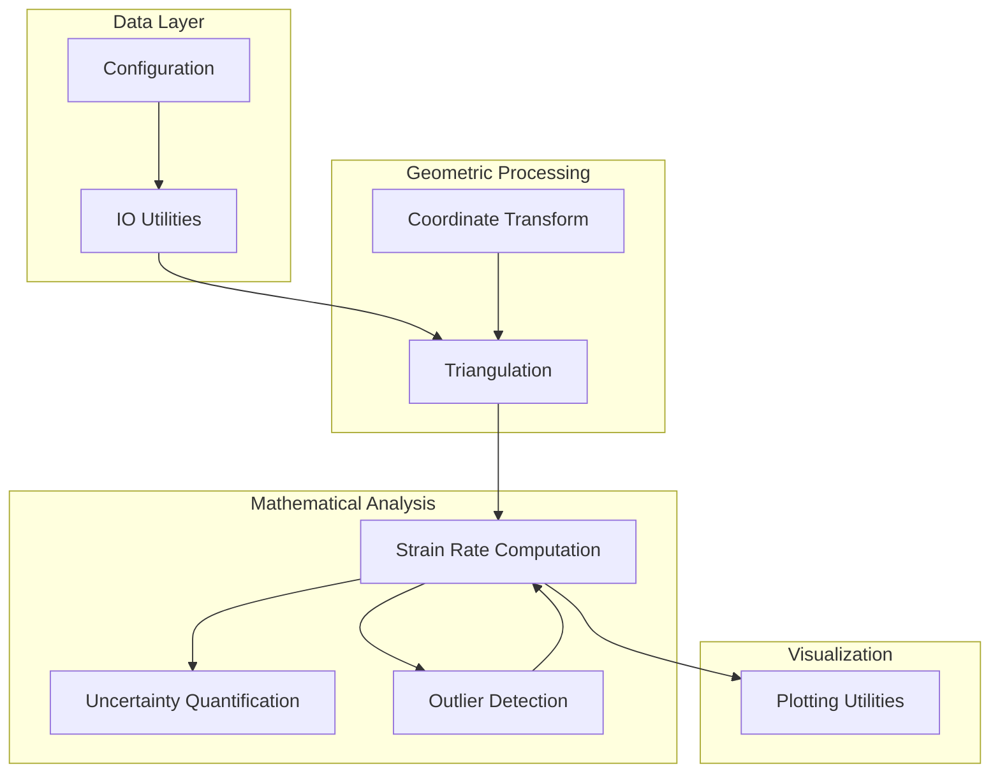
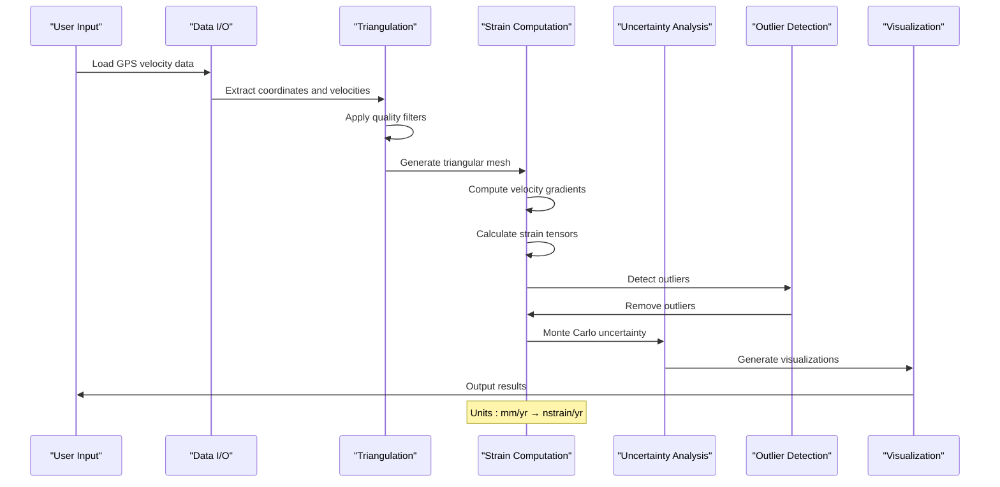
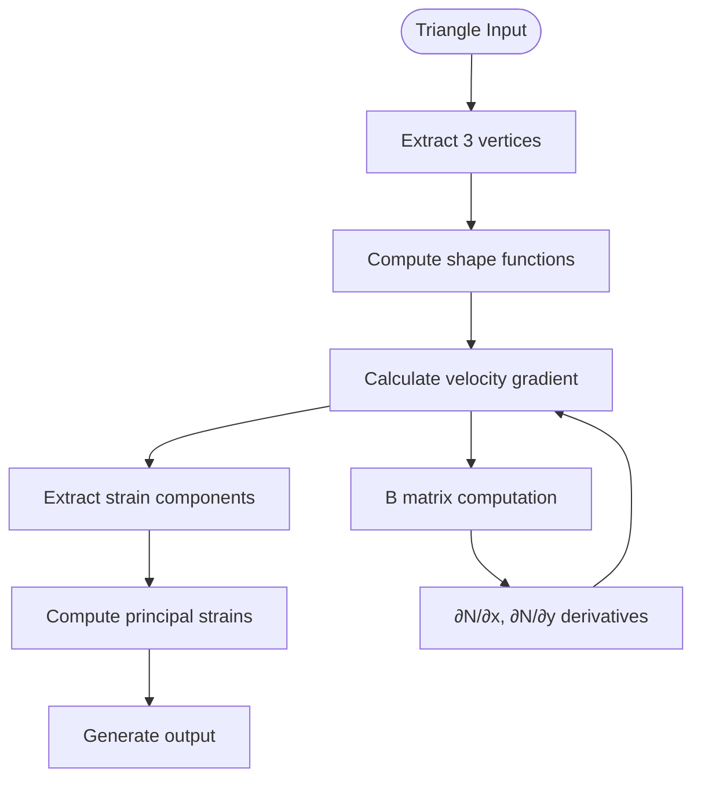
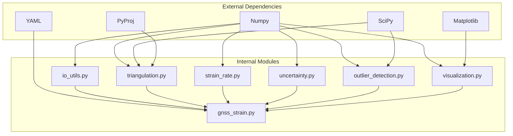

# Core Concepts and Theory

<cite>
**Referenced Files in This Document**
- [gnss_strain.py](file://src/pystrain/gnss_strain/gnss_strain.py)
- [strain_rate.py](file://src/pystrain/gnss_strain/strain_rate.py)
- [triangulation.py](file://src/pystrain/gnss_strain/triangulation.py)
- [uncertainty.py](file://src/pystrain/gnss_strain/uncertainty.py)
- [outlier_detection.py](file://src/pystrain/gnss_strain/outlier_detection.py)
- [io_utils.py](file://src/pystrain/gnss_strain/io_utils.py)
- [visualization.py](file://src/pystrain/gnss_strain/visualization.py)
- [config_default.yaml](file://src/pystrain/gnss_strain/config_default.yaml)
- [PyStrain.py](file://src/pystrain/PyStrain.py)
- [UserStrainRate.py](file://src/pystrain/UserStrainRate.py)
- [camp_eura.vel](file://src/pystrain/gnss_strain/camp_eura.vel)
- [grdmesh.txt](file://test/grdmesh.txt)
- [trimesh.txt](file://test/trimesh.txt)
</cite>

## Table of Contents
1. [Introduction](#introduction)
2. [Project Structure](#project-structure)
3. [Core Components](#core-components)
4. [Architecture Overview](#architecture-overview)
5. [Detailed Component Analysis](#detailed-component-analysis)
6. [Dependency Analysis](#dependency-analysis)
7. [Performance Considerations](#performance-considerations)
8. [Troubleshooting Guide](#troubleshooting-guide)
9. [Conclusion](#conclusion)

## Introduction

PyStrain is a comprehensive Python toolkit designed for GPS-based strain analysis, transforming geodetic velocity measurements into meaningful strain rate estimates. This document establishes the theoretical foundation and practical implementation of core geodetic and strain analysis concepts, focusing on GPS velocity data interpretation, coordinate system transformations, and strain rate tensor mathematics.

The toolkit implements modern geodetic analysis techniques including triangulation-based strain computation, robust statistical outlier detection, and uncertainty quantification through Monte Carlo methods. It bridges the gap between raw GPS measurements and interpretable geological deformation parameters.

## Project Structure

The PyStrain project follows a modular architecture with clear separation between data processing, geometric computations, and statistical analysis:



**Diagram sources**
- [gnss_strain.py:1-407](file://src/pystrain/gnss_strain/gnss_strain.py#L1-L407)
- [triangulation.py:1-477](file://src/pystrain/gnss_strain/triangulation.py#L1-L477)
- [strain_rate.py:1-438](file://src/pystrain/gnss_strain/strain_rate.py#L1-L438)

**Section sources**
- [gnss_strain.py:1-407](file://src/pystrain/gnss_strain/gnss_strain.py#L1-L407)
- [triangulation.py:1-477](file://src/pystrain/gnss_strain/triangulation.py#L1-L477)

## Core Components

### GPS Velocity Data Interpretation

GPS velocity measurements represent the rate of horizontal displacement at geodetic stations. The toolkit processes velocity data in multiple formats, extracting essential parameters for strain analysis:

- **Velocity Components**: East (Ve) and North (Vn) velocity components in millimeters per year (mm/yr)
- **Uncertainty Estimates**: Standard deviations (Se, Sn) for velocity components
- **Correlation Coefficients**: Spatial correlation between east-west and north-south velocity components
- **Station Metadata**: Geographic coordinates and station identifiers

The velocity data serves as the fundamental input for strain rate computation, where spatial gradients of velocity fields reveal deformation patterns.

**Section sources**
- [io_utils.py:21-132](file://src/pystrain/gnss_strain/io_utils.py#L21-L132)
- [camp_eura.vel](file://src/pystrain/gnss_strain/camp_eura.vel)

### Coordinate System Transformations

The toolkit implements sophisticated coordinate transformations essential for accurate strain analysis:

#### UTM Projection System
Universal Transverse Mercator (UTM) projection converts geographic coordinates (longitude, latitude) to projected coordinates (eastings, northings) in meters. This transformation enables Euclidean geometry operations crucial for strain computations.

#### Local Cartesian Coordinates
For individual analysis windows, the toolkit computes local east-north coordinate systems centered at specific points, facilitating precise gradient calculations.

#### Coordinate Conversion Mathematics
The transformation process involves:
- Ellipsoidal parameterization using WGS84 datum
- Zone-specific central meridian calculations
- Scale factor application (0.9996 for UTM)
- Meridional arc computation for latitude-to-Northing conversion

**Section sources**
- [triangulation.py:22-82](file://src/pystrain/gnss_strain/triangulation.py#L22-L82)
- [PyStrain.py:77-95](file://src/pystrain/PyStrain.py#L77-L95)

### Strain Rate Tensor Mathematics

Strain rate tensors describe the rate of deformation in the Earth's crust. The toolkit implements comprehensive tensor mathematics:

#### Velocity Gradient Tensor
The velocity gradient tensor (L) relates velocity derivatives to strain rate components:

```
L = [∂ve/∂x  ∂ve/∂y]
    [∂vn/∂x  ∂vn/∂y]
```

#### Strain Rate Decomposition
From the velocity gradient tensor, the toolkit extracts physically meaningful components:

- **Normal Strain Rates**: εxx = ∂ve/∂x, εyy = ∂vn/∂y
- **Shear Strain Rate**: γxy = 0.5(∂ve/∂y + ∂vn/∂x)
- **Rotation Rate**: ω = 0.5(∂vn/∂x - ∂ve/∂y)

#### Principal Strain Analysis
Principal strain rates (ε1, ε2) and their orientations reveal maximum extensional and compressional deformation:

- **Maximum Principal Strain**: ε1 = (εxx + εyy + √[(εxx-εyy)² + 4γxy²])/2
- **Minimum Principal Strain**: ε2 = (εxx + εyy - √[(εxx-εyy)² + 4γxy²])/2
- **Orientation**: θ = 0.5 atan2(2γxy, εxx - εyy)

#### Deformation Invariants
The toolkit computes important deformation invariants:
- **Dilatation**: δ = εxx + εyy (measure of volume change rate)
- **Maximum Shear**: γ = (ε1 - ε2)/2
- **Second Invariant**: I2 = √(εxx² + 2γxy² + εyy²)

**Section sources**
- [strain_rate.py:18-119](file://src/pystrain/gnss_strain/strain_rate.py#L18-L119)
- [PyStrain.py:364-469](file://src/pystrain/PyStrain.py#L364-L469)

## Architecture Overview

The PyStrain architecture implements a multi-stage pipeline for GPS-based strain analysis:



**Diagram sources**
- [gnss_strain.py:52-341](file://src/pystrain/gnss_strain/gnss_strain.py#L52-L341)
- [strain_rate.py:384-437](file://src/pystrain/gnss_strain/strain_rate.py#L384-L437)

**Section sources**
- [gnss_strain.py:52-341](file://src/pystrain/gnss_strain/gnss_strain.py#L52-L341)

## Detailed Component Analysis

### Triangulation and Mesh Generation

The triangulation component forms the geometric backbone of strain analysis by creating triangular meshes from GPS station data:

#### Delaunay Triangulation
The toolkit employs Delaunay triangulation to create optimal triangular meshes that maximize the minimum angle, avoiding skinny triangles that could introduce numerical instability.

#### Quality Control Filters
Multiple quality control mechanisms ensure mesh reliability:

- **Minimum Angle Filter**: Eliminates triangles with angles below 10°
- **Maximum Edge Length Filter**: Removes triangles with edges exceeding calculated thresholds
- **Area Threshold Filter**: Identifies and removes degenerate triangles
- **Polygon Boundary Filter**: Constrains triangulation to specified regions

#### Shape Function Implementation
Each triangle utilizes linear shape functions for interpolation:

```
N1(x,y) = a1 + b1x + c1y
N2(x,y) = a2 + b2x + c2y  
N3(x,y) = a3 + b3x + c3y
```

These functions enable precise velocity interpolation and gradient computation within triangular elements.

**Section sources**
- [triangulation.py:89-256](file://src/pystrain/gnss_strain/triangulation.py#L89-L256)
- [triangulation.py:312-368](file://src/pystrain/gnss_strain/triangulation.py#L312-L368)

### Strain Rate Computation Pipeline

The strain rate computation pipeline transforms velocity gradients into physically meaningful deformation parameters:

#### Velocity Gradient Calculation
For each triangle, the toolkit computes velocity gradients using shape function derivatives:



**Diagram sources**
- [strain_rate.py:18-198](file://src/pystrain/gnss_strain/strain_rate.py#L18-L198)

#### Spatial Smoothing
The toolkit implements iterative smoothing to reduce noise and improve spatial coherence:

- **Weighted Averaging**: Combines local strain estimates with neighboring triangle values
- **Adaptive Weighting**: Reduces influence of boundary triangles
- **Multi-Iteration Process**: Iteratively refines estimates for improved stability

#### Unit Conversions
Critical unit conversions ensure consistent output units:
- Input: mm/yr, m, km
- Output: nstrain/yr (10⁻⁹/yr)
- Conversion factor: 1 mm/(km·yr) = 1000 nstrain/yr

**Section sources**
- [strain_rate.py:126-271](file://src/pystrain/gnss_strain/strain_rate.py#L126-L271)
- [strain_rate.py:410-437](file://src/pystrain/gnss_strain/strain_rate.py#L410-L437)

### Uncertainty Quantification

The uncertainty quantification component employs Monte Carlo simulation to propagate measurement errors through the strain computation pipeline:

#### Monte Carlo Methodology
The toolkit generates synthetic velocity fields by sampling from multivariate normal distributions defined by measurement uncertainties and correlations:


**Diagram sources**
- [uncertainty.py:14-149](file://src/pystrain/gnss_strain/uncertainty.py#L14-L149)

#### Correlation Handling
The uncertainty analysis properly accounts for spatial correlations between velocity components:

- **Covariance Matrix Construction**: Incorporates measurement uncertainties and correlation coefficients
- **Cholesky Decomposition**: Efficiently generates correlated random samples
- **Statistical Validation**: Ensures positive definiteness of covariance matrices

#### Statistical Analysis
The toolkit computes comprehensive uncertainty estimates:
- **Mean Values**: Monte Carlo mean of strain rate components
- **Standard Deviations**: Statistical spread of computed values
- **Confidence Intervals**: Quantification of uncertainty bounds

**Section sources**
- [uncertainty.py:14-149](file://src/pystrain/gnss_strain/uncertainty.py#L14-L149)

### Outlier Detection and Quality Control

The outlier detection system implements a two-stage approach combining robust statistical methods with geometric validation:

#### Stage 1: Pre-triangulation KNN Screening
Initial screening identifies obvious outliers using robust nearest-neighbor statistics:

- **Robust Statistics**: Uses median absolute deviation (MAD) instead of standard deviation
- **Local Neighborhood Analysis**: Compares each station's velocity to its k-nearest neighbors
- **Conservative Thresholding**: Employs MAD factors (typically 3.5) for outlier identification

#### Stage 2: Post-triangulation Residual Analysis
After triangulation, the system validates results using geometric consistency checks:

- **Residual Computation**: Calculates differences between observed and predicted velocities
- **Inter-triangle Consistency**: Ensures smooth transitions across neighboring triangles
- **Iterative Refinement**: Repeatedly removes outliers until convergence

#### Quality Control Metrics
The system tracks and reports various quality metrics:
- **Triangle Quality Ratios**: Distribution of triangle aspect ratios
- **Edge Length Statistics**: Analysis of triangulation edge lengths
- **Outlier Removal History**: Complete record of detected and removed outliers

**Section sources**
- [outlier_detection.py:17-291](file://src/pystrain/gnss_strain/outlier_detection.py#L17-L291)

### Visualization and Output

The visualization component provides comprehensive graphical representation of strain analysis results:

#### Triangulation Visualization
- **Triangle Mesh Display**: Shows triangular mesh with quality indicators
- **Velocity Vector Overlay**: Plots GPS velocity vectors on triangulation
- **Quality Filtering**: Distinguishes good triangles (gray) from filtered triangles (red)

#### Strain Field Visualization
- **Scalar Field Maps**: Displays dilatation and maximum shear strain rate distributions
- **Principal Strain Crosses**: Visualizes orientation and magnitude of principal strain rates
- **Color Coding**: Uses appropriate color scales for different strain parameters

#### Output Formats
The toolkit generates standardized output files:
- **Text Reports**: ASCII files with strain rate parameters
- **Uncertainty Estimates**: Statistical uncertainty information
- **Diagnostic Information**: Quality metrics and processing history

**Section sources**
- [visualization.py:18-250](file://src/pystrain/gnss_strain/visualization.py#L18-L250)
- [io_utils.py:186-270](file://src/pystrain/gnss_strain/io_utils.py#L186-L270)

## Dependency Analysis

The PyStrain toolkit exhibits well-structured dependencies that support modularity and maintainability:



**Diagram sources**
- [gnss_strain.py:10-27](file://src/pystrain/gnss_strain/gnss_strain.py#L10-L27)
- [triangulation.py:13-15](file://src/pystrain/gnss_strain/triangulation.py#L13-L15)

**Section sources**
- [gnss_strain.py:10-27](file://src/pystrain/gnss_strain/gnss_strain.py#L10-L27)

## Performance Considerations

### Computational Complexity

The toolkit's computational complexity scales with the number of GPS stations (N):

- **Triangulation**: O(N log N) for Delaunay triangulation
- **Strain Computation**: O(N) for per-triangle gradient calculations
- **Uncertainty Analysis**: O(M×N) where M is the number of Monte Carlo iterations
- **Outlier Detection**: O(N log N) for KNN operations plus O(N) for residual analysis

### Memory Management

Efficient memory usage is achieved through:
- **Sparse Data Structures**: Triangle adjacency lists minimize memory overhead
- **Iterative Processing**: Batch processing reduces peak memory requirements
- **Output Streaming**: Results written incrementally to disk during computation

### Numerical Stability

The toolkit implements several measures to ensure numerical stability:
- **Condition Number Monitoring**: Tracks matrix conditioning during least-squares solutions
- **Robust Statistics**: Uses median-based estimators to resist outliers
- **Unit Consistency**: Careful unit conversions prevent numerical overflow/underflow

## Troubleshooting Guide

### Common Issues and Solutions

#### Poor Triangulation Quality
**Symptoms**: Excessive triangle filtering, few valid triangles remaining
**Causes**: 
- Insufficient station density
- Extreme coordinate ranges causing projection issues
- Data quality problems

**Solutions**:
- Adjust minimum angle and edge length thresholds
- Implement station spacing thinning
- Verify coordinate system consistency

#### Convergence Problems
**Symptoms**: Iterative outlier removal fails to converge
**Causes**:
- Overly aggressive filtering parameters
- Data with systematic biases
- Insufficient station coverage

**Solutions**:
- Relax quality control thresholds gradually
- Increase minimum station requirements
- Implement staged processing with progressively stricter criteria

#### Uncertainty Estimation Failures
**Symptoms**: NaN or extremely large uncertainty values
**Causes**:
- Invalid covariance matrices
- Numerical precision issues
- Insufficient Monte Carlo samples

**Solutions**:
- Validate input uncertainty parameters
- Increase Monte Carlo iteration count
- Check for data preprocessing errors

### Diagnostic Tools

The toolkit provides comprehensive diagnostic capabilities:
- **Quality Reports**: Detailed statistics on processing steps
- **Visual Diagnostics**: Graphical inspection of triangulation quality
- **Statistical Tests**: Automated validation of results
- **Progress Tracking**: Real-time monitoring of computation progress

**Section sources**
- [gnss_strain.py:269-279](file://src/pystrain/gnss_strain/gnss_strain.py#L269-L279)
- [config_default.yaml:1-69](file://src/pystrain/gnss_strain/config_default.yaml#L1-L69)

## Conclusion

PyStrain represents a comprehensive implementation of GPS-based strain analysis, integrating modern geodetic theory with practical computational methods. The toolkit successfully bridges the gap between raw GPS measurements and interpretable geological deformation parameters through:

- **Robust Mathematical Foundation**: Sound implementation of strain rate tensor mathematics
- **Quality Control Systems**: Multi-stage outlier detection and triangulation quality assessment
- **Uncertainty Quantification**: Comprehensive propagation of measurement errors
- **Flexible Architecture**: Modular design supporting various analysis approaches

The theoretical concepts demonstrated in this implementation provide a solid foundation for understanding GPS-derived strain analysis, enabling both educational purposes and advanced research applications in geodesy and geodynamics.