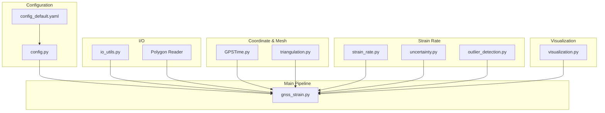
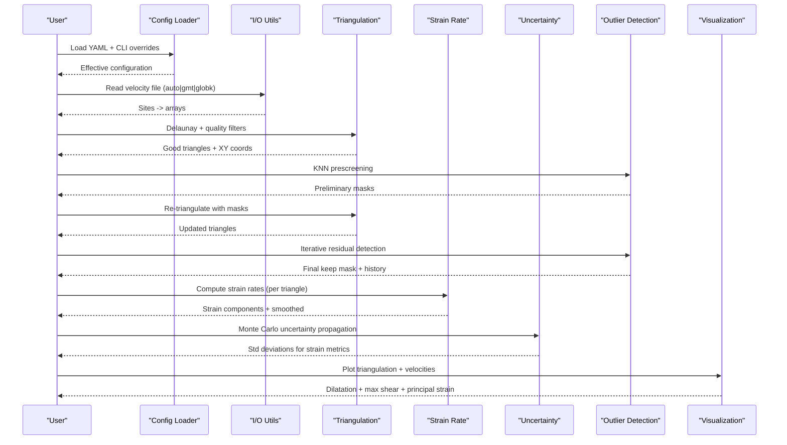
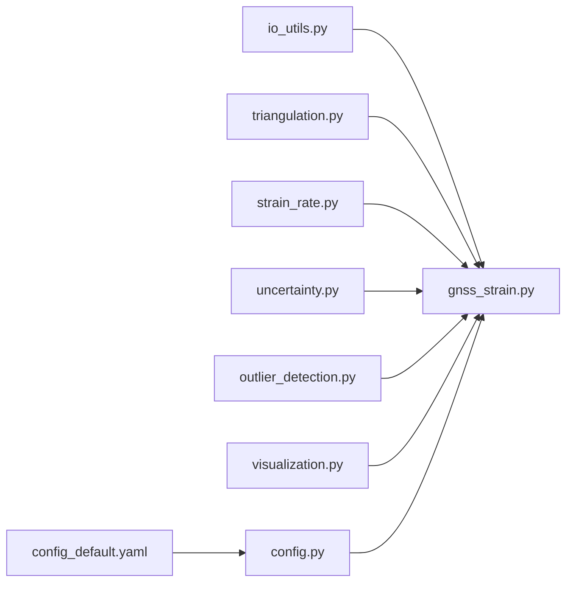

# GPS Data Interpretation and Processing

<cite>
**Referenced Files in This Document**
- [README.md](file://README.md)
- [config.py](file://src/pystrain/gnss_strain/config.py)
- [io_utils.py](file://src/pystrain/gnss_strain/io_utils.py)
- [gnss_strain.py](file://src/pystrain/gnss_strain/gnss_strain.py)
- [triangulation.py](file://src/pystrain/gnss_strain/triangulation.py)
- [strain_rate.py](file://src/pystrain/gnss_strain/strain_rate.py)
- [uncertainty.py](file://src/pystrain/gnss_strain/uncertainty.py)
- [outlier_detection.py](file://src/pystrain/gnss_strain/outlier_detection.py)
- [visualization.py](file://src/pystrain/gnss_strain/visualization.py)
- [GPSTime.py](file://src/pystrain/GPSTime.py)
- [config_default.yaml](file://src/pystrain/gnss_strain/config_default.yaml)
- [cmonoc_eura.gmtvec](file://test/cmonoc_eura.gmtvec)
- [config.yaml](file://test/config.yaml)
</cite>

## Table of Contents
1. [Introduction](#introduction)
2. [Project Structure](#project-structure)
3. [Core Components](#core-components)
4. [Architecture Overview](#architecture-overview)
5. [Detailed Component Analysis](#detailed-component-analysis)
6. [Dependency Analysis](#dependency-analysis)
7. [Performance Considerations](#performance-considerations)
8. [Troubleshooting Guide](#troubleshooting-guide)
9. [Conclusion](#conclusion)

## Introduction
This document explains GPS velocity data interpretation and processing fundamentals as implemented in the PyStrain codebase. It covers GPS velocity data formats (GMT and GLOBK), POS file structures, IOS data processing, coordinate system transformations from geographic coordinates (lat/lon) to local Cartesian systems (UTM/east/north), GPS velocity components (East-West, North-South), uncertainty quantification, and quality indicators. It also documents data validation procedures, missing data handling, coordinate system selection criteria, practical examples of data preprocessing, unit conversions, format standardization, and common GPS data issues such as datum transformations, projection effects, and temporal referencing.

## Project Structure
The PyStrain project organizes GPS velocity data processing into modular components:
- Configuration management for runtime parameters
- Input/output utilities for velocity fields and polygon boundaries
- Coordinate transformation and triangulation
- Strain rate computation and smoothing
- Uncertainty propagation via Monte Carlo sampling
- Outlier detection and iterative filtering
- Visualization of triangulation, velocity vectors, and strain rate fields
- Time conversion utilities for temporal referencing

**Diagram sources**
- [gnss_strain.py:1-407](file://src/pystrain/gnss_strain/gnss_strain.py#L1-L407)
- [config.py:1-242](file://src/pystrain/gnss_strain/config.py#L1-L242)
- [io_utils.py:1-270](file://src/pystrain/gnss_strain/io_utils.py#L1-L270)
- [triangulation.py:1-477](file://src/pystrain/gnss_strain/triangulation.py#L1-L477)
- [strain_rate.py:1-438](file://src/pystrain/gnss_strain/strain_rate.py#L1-L438)
- [uncertainty.py:1-150](file://src/pystrain/gnss_strain/uncertainty.py#L1-L150)
- [outlier_detection.py:1-292](file://src/pystrain/gnss_strain/outlier_detection.py#L1-L292)
- [visualization.py:1-250](file://src/pystrain/gnss_strain/visualization.py#L1-L250)
- [GPSTime.py:1-270](file://src/pystrain/GPSTime.py#L1-L270)

**Section sources**
- [gnss_strain.py:1-407](file://src/pystrain/gnss_strain/gnss_strain.py#L1-L407)
- [config.py:1-242](file://src/pystrain/gnss_strain/config.py#L1-L242)
- [io_utils.py:1-270](file://src/pystrain/gnss_strain/io_utils.py#L1-L270)

## Core Components
- Configuration Management: Loads defaults, merges YAML configuration, applies command-line overrides, validates parameters, and prints effective configuration.
- I/O Utilities: Reads velocity files (GMT/GLOBK/POS-like formats), converts to arrays, reads polygon boundaries, writes strain output, outlier reports, and summary statistics.
- Coordinate Transformation and Triangulation: Projects WGS84 lat/lon to UTM (local Cartesian meters), performs Delaunay triangulation, applies polygon clipping and quality filters (edge length percentiles, minimum angles, area thresholds), and computes shape function derivatives.
- Strain Rate Computation: Computes velocity gradients per triangle, extracts strain rate components, derives principal strains and orientations, and applies spatial smoothing.
- Uncertainty Quantification: Propagates velocity uncertainties (Se, Sn, correlation rho) via Monte Carlo sampling to estimate standard deviations of derived strain rate quantities.
- Outlier Detection: Implements a two-stage strategy—KNN prescreening before triangulation and iterative residual-based detection after triangulation.
- Visualization: Renders triangulation overlays, velocity vector plots, scalar fields (dilatation, maximum shear), and principal strain cross diagrams.

**Section sources**
- [config.py:1-242](file://src/pystrain/gnss_strain/config.py#L1-L242)
- [io_utils.py:1-270](file://src/pystrain/gnss_strain/io_utils.py#L1-L270)
- [triangulation.py:1-477](file://src/pystrain/gnss_strain/triangulation.py#L1-L477)
- [strain_rate.py:1-438](file://src/pystrain/gnss_strain/strain_rate.py#L1-L438)
- [uncertainty.py:1-150](file://src/pystrain/gnss_strain/uncertainty.py#L1-L150)
- [outlier_detection.py:1-292](file://src/pystrain/gnss_strain/outlier_detection.py#L1-L292)
- [visualization.py:1-250](file://src/pystrain/gnss_strain/visualization.py#L1-L250)

## Architecture Overview
The end-to-end pipeline loads GPS velocity data, validates and preprocesses it, constructs a high-quality triangular mesh, computes strain rates with uncertainty, detects and removes outliers iteratively, and generates diagnostic plots and reports.

**Diagram sources**
- [gnss_strain.py:52-341](file://src/pystrain/gnss_strain/gnss_strain.py#L52-L341)
- [io_utils.py:21-109](file://src/pystrain/gnss_strain/io_utils.py#L21-L109)
- [triangulation.py:89-146](file://src/pystrain/gnss_strain/triangulation.py#L89-L146)
- [outlier_detection.py:184-291](file://src/pystrain/gnss_strain/outlier_detection.py#L184-L291)
- [strain_rate.py:384-437](file://src/pystrain/gnss_strain/strain_rate.py#L384-L437)
- [uncertainty.py:14-149](file://src/pystrain/gnss_strain/uncertainty.py#L14-L149)
- [visualization.py:18-249](file://src/pystrain/gnss_strain/visualization.py#L18-L249)

## Detailed Component Analysis

### GPS Velocity Data Formats and POS File Structures
- Supported formats:
  - GMT 8-column: longitude latitude east_velocity north_velocity east_uncertainty north_uncertainty correlation site_name
  - GLOBK 13-column: includes raw velocities and adjusted velocities, plus vertical components and additional metadata
  - POS-like 12+ columns: supports extended vector formats with absolute velocities and coordinates
  - Fallback parsing for variable column counts
- POS file structures:
  - POS data typically includes position time series; the repository demonstrates POS-style vector formats in test data
  - The reader accommodates POS-like columns by extracting velocity components and uncertainties consistently

Practical implications:
- Use format='auto' to leverage automatic column-count detection
- For mixed or non-standard formats, specify format='gmt' or 'globk' explicitly
- POS-like formats are parsed by recognizing velocity and uncertainty columns and treating the last column as site name

**Section sources**
- [io_utils.py:21-109](file://src/pystrain/gnss_strain/io_utils.py#L21-L109)
- [config_default.yaml:11-16](file://src/pystrain/gnss_strain/config_default.yaml#L11-L16)
- [cmonoc_eura.gmtvec:1-800](file://test/cmonoc_eura.gmtvec#L1-L800)

### Coordinate System Transformations: Geographic to Local Cartesian (UTM)
- Projection: Transverse Mercator (UTM) with WGS84 ellipsoid parameters
- Input: geographic coordinates (longitude, latitude) in degrees
- Output: projected coordinates (x, y) in meters; stored internally in kilometers for numerical stability in strain calculations
- Centering: UTM zone determined by mean longitude to minimize distortion

Mathematical basis:
- Uses standard UTM formulas with meridian convergence and scale factor applied
- Converts radians to meters using ellipsoidal parameters (semi-major axis and first eccentricity squared)
- Stores projection parameters for potential inverse transforms

Quality considerations:
- Suitable for small regions (<6° longitude); larger regions may require multiple zones or a different projection
- Distortion increases near zone boundaries; ensure consistent zone assignment

**Section sources**
- [triangulation.py:22-77](file://src/pystrain/gnss_strain/triangulation.py#L22-L77)

### GPS Velocity Components and Units
- Velocity components:
  - East-West (Ve): positive eastward
  - North-South (Vn): positive northward
- Units:
  - Input velocities: millimeters per year (mm/yr)
  - Derived strain rates: nanostain per year (nstrain/yr = 10⁻⁹ strain/yr)
- Unit conversion:
  - xy coordinates in km, velocities in mm/yr → gradient unit conversion factor yields nstrain/yr

Quality indicators:
- East-west and north-south uncertainties (Se, Sn) provided in mm/yr
- Correlation coefficient (rho) between east and north velocity components
- Residual norms computed during triangulation-based interpolation to assess fit quality

**Section sources**
- [io_utils.py:4-13](file://src/pystrain/gnss_strain/io_utils.py#L4-L13)
- [strain_rate.py:176-189](file://src/pystrain/gnss_strain/strain_rate.py#L176-L189)

### Data Validation, Missing Data Handling, and Quality Control
- Input validation:
  - Minimum angle threshold, maximum edge percentile/factor, and optional absolute edge limit
  - Minimum area ratio threshold for degeneracy rejection
  - Polygon clipping ensures triangles lie within study region
- Missing data handling:
  - Skips blank lines and comments
  - Gracefully handles insufficient columns by falling back to safe defaults
- Outlier detection:
  - KNN prescreening using median absolute deviation (MAD) in 2D velocity space
  - Iterative residual-based detection using triangulation residuals and IQR thresholds
  - Tracks reasons for removal and iteration history

**Section sources**
- [triangulation.py:89-146](file://src/pystrain/gnss_strain/triangulation.py#L89-L146)
- [outlier_detection.py:17-87](file://src/pystrain/gnss_strain/outlier_detection.py#L17-L87)
- [outlier_detection.py:94-177](file://src/pystrain/gnss_strain/outlier_detection.py#L94-L177)
- [io_utils.py:42-109](file://src/pystrain/gnss_strain/io_utils.py#L42-L109)

### Uncertainty Quantification and Monte Carlo Propagation
- Input uncertainties: east and north velocity uncertainties (Se, Sn) and correlation (rho)
- Method: Monte Carlo sampling with Cholesky decomposition of per-site covariance matrices
- Outputs: standard deviations for strain rate components and derived metrics (e.g., dilatation, maximum shear)

Units:
- Uncertainties reported in nstrain/yr alongside mean strain rates

**Section sources**
- [uncertainty.py:14-149](file://src/pystrain/gnss_strain/uncertainty.py#L14-L149)
- [strain_rate.py:176-189](file://src/pystrain/gnss_strain/strain_rate.py#L176-L189)

### Coordinate System Selection Criteria
- UTM selection:
  - Zone centered on mean longitude to minimize scale and convergence distortion
  - Appropriate for regional studies within a single UTM zone
- Alternatives:
  - For large regions spanning multiple zones, consider a regional conic or equal-area projection
  - For global studies, consider Plate Carrée or another cylindrical projection

Projection effects:
- Distortion increases away from central meridian and equator
- Ensure consistent datum (WGS84) across datasets

**Section sources**
- [triangulation.py:44-44](file://src/pystrain/gnss_strain/triangulation.py#L44-L44)

### Practical Examples: Preprocessing, Unit Conversions, and Format Standardization
- Preprocessing steps:
  - Select appropriate format (auto|gmt|globk) based on column count
  - Apply station thinning by minimum spacing to reduce density and improve mesh quality
  - Define polygon boundaries to constrain triangulation domain
- Unit conversions:
  - Convert mm/yr velocities to nstrain/yr via computed gradient scaling
  - Store projected coordinates in km internally for numerical stability
- Format standardization:
  - Ensure consistent column ordering and naming conventions
  - Validate uncertainty and correlation inputs for Monte Carlo propagation

**Section sources**
- [gnss_strain.py:100-129](file://src/pystrain/gnss_strain/gnss_strain.py#L100-L129)
- [triangulation.py:124-125](file://src/pystrain/gnss_strain/triangulation.py#L124-L125)
- [strain_rate.py:176-189](file://src/pystrain/gnss_strain/strain_rate.py#L176-L189)

### Common GPS Data Issues and Mitigations
- Datum transformations:
  - Ensure all datasets use the same datum (WGS84) to avoid misalignment
- Projection effects:
  - Use appropriate projection and zone; avoid mixing zones
- Temporal referencing:
  - Align epochs across datasets; use time conversion utilities for consistent time scales
- Data gaps and noise:
  - Apply outlier detection and iterative filtering
  - Use smoothing to stabilize noisy estimates

**Section sources**
- [GPSTime.py:13-270](file://src/pystrain/GPSTime.py#L13-L270)
- [outlier_detection.py:184-291](file://src/pystrain/gnss_strain/outlier_detection.py#L184-L291)

## Dependency Analysis
The pipeline exhibits strong modularity with clear data flow and minimal coupling between modules.

**Diagram sources**
- [gnss_strain.py:17-27](file://src/pystrain/gnss_strain/gnss_strain.py#L17-L27)
- [io_utils.py:1-270](file://src/pystrain/gnss_strain/io_utils.py#L1-L270)
- [triangulation.py:1-477](file://src/pystrain/gnss_strain/triangulation.py#L1-L477)
- [strain_rate.py:1-438](file://src/pystrain/gnss_strain/strain_rate.py#L1-L438)
- [uncertainty.py:1-150](file://src/pystrain/gnss_strain/uncertainty.py#L1-L150)
- [outlier_detection.py:1-292](file://src/pystrain/gnss_strain/outlier_detection.py#L1-L292)
- [visualization.py:1-250](file://src/pystrain/gnss_strain/visualization.py#L1-L250)
- [config.py:56-90](file://src/pystrain/gnss_strain/config.py#L56-L90)
- [config_default.yaml:1-69](file://src/pystrain/gnss_strain/config_default.yaml#L1-L69)

**Section sources**
- [gnss_strain.py:17-27](file://src/pystrain/gnss_strain/gnss_strain.py#L17-L27)

## Performance Considerations
- Computational complexity:
  - Delaunay triangulation: O(n log n) average, but can degrade with clustered or poorly conditioned data
  - Monte Carlo uncertainty: O(M × n_tri × 3) where M is iterations and n_tri is valid triangles
  - KNN operations: O(n log n) with KDTree queries
- Memory usage:
  - Large datasets benefit from station thinning and polygon clipping to reduce n_tri
- Numerical stability:
  - Using km-scale coordinates and nstrain/yr units improves conditioning
- Parallelization:
  - Monte Carlo sampling is embarrassingly parallel; consider vectorized operations for covariance sampling

[No sources needed since this section provides general guidance]

## Troubleshooting Guide
Common issues and resolutions:
- Invalid or missing configuration:
  - Verify YAML syntax and required keys; use print_effective_config to inspect merged parameters
- Unsupported or mismatched velocity file format:
  - Specify format explicitly if auto-detection fails; confirm column count and presence of required fields
- Insufficient triangles after quality filtering:
  - Relax min_angle_deg, adjust max_edge_pctl/factor, or remove absolute edge limits
- Excessive outliers:
  - Tune k_neighbors, mad_factor, iqr_factor, and max_iterations; review polygon boundary
- Poor uncertainty estimates:
  - Increase mc_iterations; ensure Se, Sn, and rho are provided and reasonable
- Visualization artifacts:
  - Adjust plot scaling and normalization; verify coordinate ranges and aspect ratios

**Section sources**
- [config.py:143-194](file://src/pystrain/gnss_strain/config.py#L143-L194)
- [gnss_strain.py:166-168](file://src/pystrain/gnss_strain/gnss_strain.py#L166-L168)
- [outlier_detection.py:184-291](file://src/pystrain/gnss_strain/outlier_detection.py#L184-L291)
- [uncertainty.py:14-42](file://src/pystrain/gnss_strain/uncertainty.py#L14-L42)

## Conclusion
This documentation outlined GPS velocity data interpretation and processing fundamentals implemented in PyStrain, focusing on supported formats, coordinate transformations, velocity components and uncertainties, quality control, and uncertainty quantification. The modular architecture enables robust handling of real-world GPS datasets, with validated configurations, iterative outlier detection, and comprehensive visualization of strain rate results. Users can adapt parameters to address regional datum differences, projection effects, and temporal referencing challenges inherent in GPS-derived deformation studies.