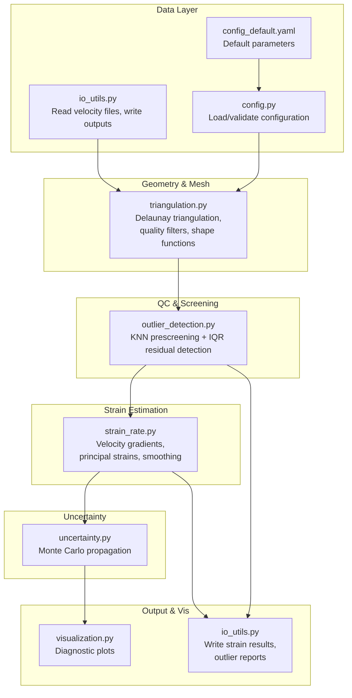
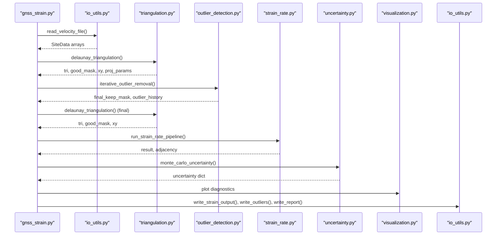
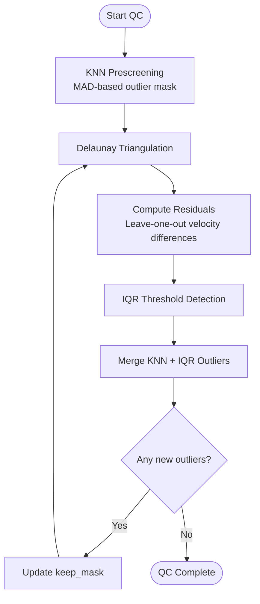
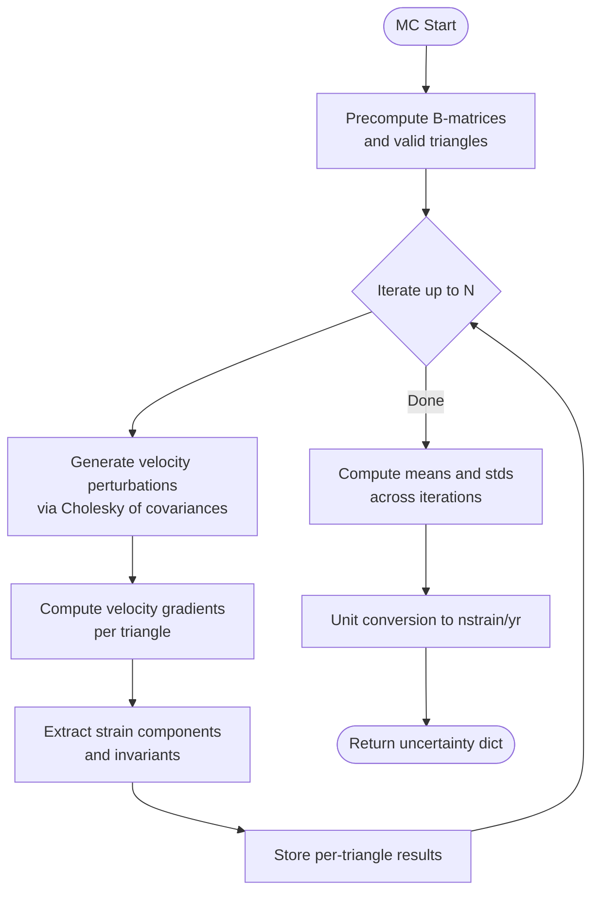
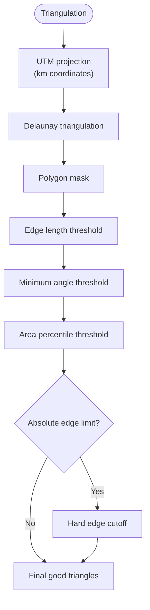
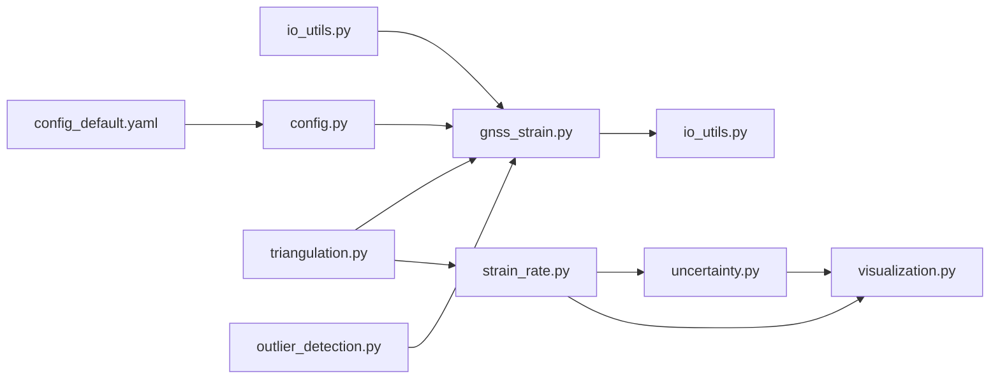

# Quality Control and Uncertainty Principles

<cite>
**Referenced Files in This Document**
- [uncertainty.py](file://src/pystrain/gnss_strain/uncertainty.py)
- [outlier_detection.py](file://src/pystrain/gnss_strain/outlier_detection.py)
- [strain_rate.py](file://src/pystrain/gnss_strain/strain_rate.py)
- [gnss_strain.py](file://src/pystrain/gnss_strain/gnss_strain.py)
- [triangulation.py](file://src/pystrain/gnss_strain/triangulation.py)
- [io_utils.py](file://src/pystrain/gnss_strain/io_utils.py)
- [config_default.yaml](file://src/pystrain/gnss_strain/config_default.yaml)
- [config.py](file://src/pystrain/gnss_strain/config.py)
- [visualization.py](file://src/pystrain/gnss_strain/visualization.py)
- [PyStrain.py](file://src/pystrain/PyStrain.py)
</cite>

## Table of Contents
1. [Introduction](#introduction)
2. [Project Structure](#project-structure)
3. [Core Components](#core-components)
4. [Architecture Overview](#architecture-overview)
5. [Detailed Component Analysis](#detailed-component-analysis)
6. [Dependency Analysis](#dependency-analysis)
7. [Performance Considerations](#performance-considerations)
8. [Troubleshooting Guide](#troubleshooting-guide)
9. [Conclusion](#conclusion)
10. [Appendices](#appendices)

## Introduction
This document presents comprehensive quality control principles and uncertainty quantification for GPS-based strain analysis using the PyStrain toolkit. It explains statistical quality control methods including outlier detection, residual analysis, and goodness-of-fit criteria. It documents uncertainty propagation principles, weight assignment strategies, and confidence interval calculations. It covers spatial sampling adequacy, minimum station requirements, and geometric distribution criteria for reliable strain estimation. It explains the relationship between measurement uncertainties and final strain rate uncertainties. Practical guidelines for data screening, quality flags, and automated quality control workflows are provided, along with common sources of systematic errors, bias correction methods, and validation procedures for strain rate results.

## Project Structure
The PyStrain toolkit organizes quality control and uncertainty workflows into modular components:
- Data ingestion and preprocessing: IO utilities and configuration management
- Spatial triangulation and geometry: Delaunay triangulation with quality filters
- Outlier detection: Two-stage screening combining KNN prescreening and residual-based IQR detection
- Strain rate computation: Velocity gradient calculation, principal strain extraction, and smoothing
- Uncertainty quantification: Monte Carlo propagation of velocity uncertainties
- Visualization and reporting: Diagnostic plots and output summaries

**Diagram sources**
- [io_utils.py:21-132](file://src/pystrain/gnss_strain/io_utils.py#L21-L132)
- [config.py:56-90](file://src/pystrain/gnss_strain/config.py#L56-L90)
- [config_default.yaml:1-69](file://src/pystrain/gnss_strain/config_default.yaml#L1-L69)
- [triangulation.py:89-146](file://src/pystrain/gnss_strain/triangulation.py#L89-L146)
- [outlier_detection.py:17-292](file://src/pystrain/gnss_strain/outlier_detection.py#L17-L292)
- [strain_rate.py:18-438](file://src/pystrain/gnss_strain/strain_rate.py#L18-L438)
- [uncertainty.py:14-150](file://src/pystrain/gnss_strain/uncertainty.py#L14-L150)
- [visualization.py:18-250](file://src/pystrain/gnss_strain/visualization.py#L18-L250)

**Section sources**
- [gnss_strain.py:52-341](file://src/pystrain/gnss_strain/gnss_strain.py#L52-L341)

## Core Components
- Data ingestion and configuration: Reads velocity files in multiple formats, loads and validates configuration parameters, and writes diagnostic outputs.
- Triangulation and quality control: Performs Delaunay triangulation, applies polygon clipping, and filters triangles by edge length, minimum angle, and area thresholds.
- Outlier detection: Implements a two-stage process—KNN-based prescreening and residual-based IQR detection—to iteratively remove outliers.
- Strain rate computation: Computes velocity gradients per triangle, extracts principal strains and invariants, and applies spatial smoothing.
- Uncertainty quantification: Propagates velocity uncertainties via Monte Carlo sampling to estimate strain rate uncertainties.
- Visualization: Produces diagnostic plots for triangulation, scalar fields, and principal strain orientations.

**Section sources**
- [io_utils.py:21-132](file://src/pystrain/gnss_strain/io_utils.py#L21-L132)
- [triangulation.py:89-146](file://src/pystrain/gnss_strain/triangulation.py#L89-L146)
- [outlier_detection.py:17-292](file://src/pystrain/gnss_strain/outlier_detection.py#L17-L292)
- [strain_rate.py:18-438](file://src/pystrain/gnss_strain/strain_rate.py#L18-L438)
- [uncertainty.py:14-150](file://src/pystrain/gnss_strain/uncertainty.py#L14-L150)
- [visualization.py:18-250](file://src/pystrain/gnss_strain/visualization.py#L18-L250)

## Architecture Overview
The end-to-end pipeline integrates QC and uncertainty workflows:

**Diagram sources**
- [gnss_strain.py:92-341](file://src/pystrain/gnss_strain/gnss_strain.py#L92-L341)
- [io_utils.py:21-132](file://src/pystrain/gnss_strain/io_utils.py#L21-L132)
- [triangulation.py:89-146](file://src/pystrain/gnss_strain/triangulation.py#L89-L146)
- [outlier_detection.py:184-292](file://src/pystrain/gnss_strain/outlier_detection.py#L184-L292)
- [strain_rate.py:384-438](file://src/pystrain/gnss_strain/strain_rate.py#L384-L438)
- [uncertainty.py:14-150](file://src/pystrain/gnss_strain/uncertainty.py#L14-L150)
- [visualization.py:18-250](file://src/pystrain/gnss_strain/visualization.py#L18-L250)

## Detailed Component Analysis

### Statistical Quality Control Methods
- KNN Prescreening: Uses robust Median Absolute Deviation (MAD) to flag outliers based on local neighborhood velocity medians. It avoids small neighbor sets by suspending sites with insufficient neighbors.
- Residual Analysis: Computes leave-one-out prediction residuals using neighboring velocities for each site and applies IQR-based thresholds to detect outliers.
- Iterative Removal: Repeatedly applies KNN prescreening, triangulation, residual IQR detection, and updates masks until convergence or maximum iterations.

**Diagram sources**
- [outlier_detection.py:17-292](file://src/pystrain/gnss_strain/outlier_detection.py#L17-L292)
- [triangulation.py:89-146](file://src/pystrain/gnss_strain/triangulation.py#L89-L146)

**Section sources**
- [outlier_detection.py:17-292](file://src/pystrain/gnss_strain/outlier_detection.py#L17-L292)

### Uncertainty Propagation Principles
- Monte Carlo Sampling: Fixed triangulation topology is maintained while perturbing velocity vectors independently according to their covariance matrices. Results are collected across iterations to compute standard deviations for each strain component.
- Covariance Handling: Correlated velocity uncertainties are handled via Cholesky decomposition of per-site covariance matrices to generate realistic perturbations.
- Unit Conversion: Results are converted from mm/(km·yr) to nstrain/yr consistently across all components.

**Diagram sources**
- [uncertainty.py:14-150](file://src/pystrain/gnss_strain/uncertainty.py#L14-L150)

**Section sources**
- [uncertainty.py:14-150](file://src/pystrain/gnss_strain/uncertainty.py#L14-L150)

### Weight Assignment Strategies and Confidence Intervals
- Smoothing Weights: Spatial smoothing applies weighted averages across neighboring triangles to reduce noise. The weight parameter controls the balance between raw values and neighbor averages.
- Confidence Intervals: Uncertainty estimates are derived from Monte Carlo standard deviations. Users can adjust the number of iterations to trade off accuracy and computational cost.

**Section sources**
- [strain_rate.py:205-271](file://src/pystrain/gnss_strain/strain_rate.py#L205-L271)
- [uncertainty.py:14-150](file://src/pystrain/gnss_strain/uncertainty.py#L14-L150)

### Spatial Sampling Adequacy and Geometric Distribution Criteria
- Minimum Triangle Angle: Filters triangles with excessively small internal angles to avoid ill-conditioned elements.
- Edge Length Constraints: Applies percentile-based thresholds and optional absolute limits to prevent spurious connections across large gaps.
- Area Filtering: Removes triangles with abnormally small areas to avoid degeneracies.
- Polygon Masking: Retains only triangles whose centroids lie within the study polygon.
- Station Density Control: Optional thinning by spacing reduces redundancy and improves conditioning.

**Diagram sources**
- [triangulation.py:89-146](file://src/pystrain/gnss_strain/triangulation.py#L89-L146)

**Section sources**
- [triangulation.py:89-146](file://src/pystrain/gnss_strain/triangulation.py#L89-L146)

### Relationship Between Measurement Uncertainties and Final Strain Rate Uncertainties
- Velocity Uncertainties: Provided as east/north standard deviations and correlation coefficients.
- Gradient Uncertainty: Computed via Monte Carlo propagation of velocity perturbations through the velocity gradient operator.
- Strain Component Uncertainties: Derived from standard deviations of the sampled strain distributions.

**Section sources**
- [uncertainty.py:14-150](file://src/pystrain/gnss_strain/uncertainty.py#L14-L150)
- [strain_rate.py:18-58](file://src/pystrain/gnss_strain/strain_rate.py#L18-L58)

### Practical Guidelines for Data Screening, Quality Flags, and Automated Workflows
- Data Formats: Supports GMT and GLOBK formats with automatic column detection and fallback handling.
- Quality Flags: Outlier history records reasons (KNN, IQR) and residuals for traceability.
- Automated Workflow: The main pipeline orchestrates loading, QC, triangulation, strain estimation, uncertainty, and visualization.

**Section sources**
- [io_utils.py:21-132](file://src/pystrain/gnss_strain/io_utils.py#L21-L132)
- [gnss_strain.py:52-341](file://src/pystrain/gnss_strain/gnss_strain.py#L52-L341)

### Common Sources of Systematic Errors, Bias Correction, and Validation Procedures
- Systematic Errors: Large-scale deformation patterns, atmospheric delays, and orbital aliasing can introduce biases; residual analysis helps identify spatially correlated outliers.
- Bias Correction: Iterative QC and polygon masking reduce edge effects; smoothing mitigates noise-induced artifacts.
- Validation: Principal strain orientation plots and scalar field visualizations aid qualitative assessment; numerical ranges and statistics support quantitative checks.

**Section sources**
- [visualization.py:18-250](file://src/pystrain/gnss_strain/visualization.py#L18-L250)
- [gnss_strain.py:281-320](file://src/pystrain/gnss_strain/gnss_strain.py#L281-L320)

## Dependency Analysis
The modules exhibit clear separation of concerns with explicit dependencies:

**Diagram sources**
- [gnss_strain.py:17-27](file://src/pystrain/gnss_strain/gnss_strain.py#L17-L27)
- [io_utils.py:21-132](file://src/pystrain/gnss_strain/io_utils.py#L21-L132)
- [triangulation.py:89-146](file://src/pystrain/gnss_strain/triangulation.py#L89-L146)
- [outlier_detection.py:17-292](file://src/pystrain/gnss_strain/outlier_detection.py#L17-L292)
- [strain_rate.py:18-438](file://src/pystrain/gnss_strain/strain_rate.py#L18-L438)
- [uncertainty.py:14-150](file://src/pystrain/gnss_strain/uncertainty.py#L14-L150)
- [visualization.py:18-250](file://src/pystrain/gnss_strain/visualization.py#L18-L250)

**Section sources**
- [gnss_strain.py:17-27](file://src/pystrain/gnss_strain/gnss_strain.py#L17-L27)

## Performance Considerations
- Computational Cost: Monte Carlo uncertainty scales linearly with the number of iterations; increasing iterations improves stability at higher computational cost.
- Memory Usage: Storing per-triangle results and intermediate arrays grows with the number of triangles; filtering invalid triangles early reduces memory footprint.
- Efficiency Tips: Use polygon masking to limit the triangulation domain; thin stations by spacing to improve conditioning; adjust smoothing weights to balance noise reduction and fidelity.

[No sources needed since this section provides general guidance]

## Troubleshooting Guide
- Insufficient Valid Triangles: The pipeline raises an error if fewer than a minimum number of triangles remain after QC. Relax constraints or increase station density.
- Convergence Issues: If iterative outlier removal converges too early, consider increasing maximum iterations or adjusting MAD/IQR thresholds.
- Poor Geometry: Excessive edge lengths or small angles indicate poor station distribution; re-evaluate station placement or apply polygon constraints.
- Uncertainty Instability: Increase Monte Carlo iterations for more stable uncertainty estimates.

**Section sources**
- [gnss_strain.py:166-168](file://src/pystrain/gnss_strain/gnss_strain.py#L166-L168)
- [outlier_detection.py:220-292](file://src/pystrain/gnss_strain/outlier_detection.py#L220-L292)
- [triangulation.py:170-256](file://src/pystrain/gnss_strain/triangulation.py#L170-L256)
- [uncertainty.py:14-150](file://src/pystrain/gnss_strain/uncertainty.py#L14-L150)

## Conclusion
PyStrain’s quality control and uncertainty framework combines robust statistical methods with geometric constraints to produce reliable GPS-based strain rate estimates. The two-stage outlier detection, triangulation quality filters, and Monte Carlo uncertainty propagation provide a comprehensive foundation for validating results and interpreting uncertainties. Users can tune parameters to balance accuracy, computational cost, and spatial coverage, while diagnostic visualizations support both qualitative and quantitative validation.

[No sources needed since this section summarizes without analyzing specific files]

## Appendices

### Configuration Parameters for Quality Control and Uncertainty
- Outlier Detection: k_neighbors, mad_factor, iqr_factor, max_iterations
- Triangulation: min_angle_deg, max_edge_pctl, max_edge_factor, min_spacing_km, max_edge_km
- Smoothing: weight, iterations
- Uncertainty: mc_iterations
- Visualization: dpi, save_figures, show_figures

**Section sources**
- [config_default.yaml:18-69](file://src/pystrain/gnss_strain/config_default.yaml#L18-L69)
- [config.py:143-195](file://src/pystrain/gnss_strain/config.py#L143-L195)

### Legacy Grid-Based Strain Estimation Context
While the primary focus here is the triangulation-based workflow, the repository also includes legacy grid-based strain estimation routines that incorporate distance-weighted least squares and geometric checks for minimum station requirements and azimuthal distribution.

**Section sources**
- [PyStrain.py:517-800](file://src/pystrain/PyStrain.py#L517-L800)