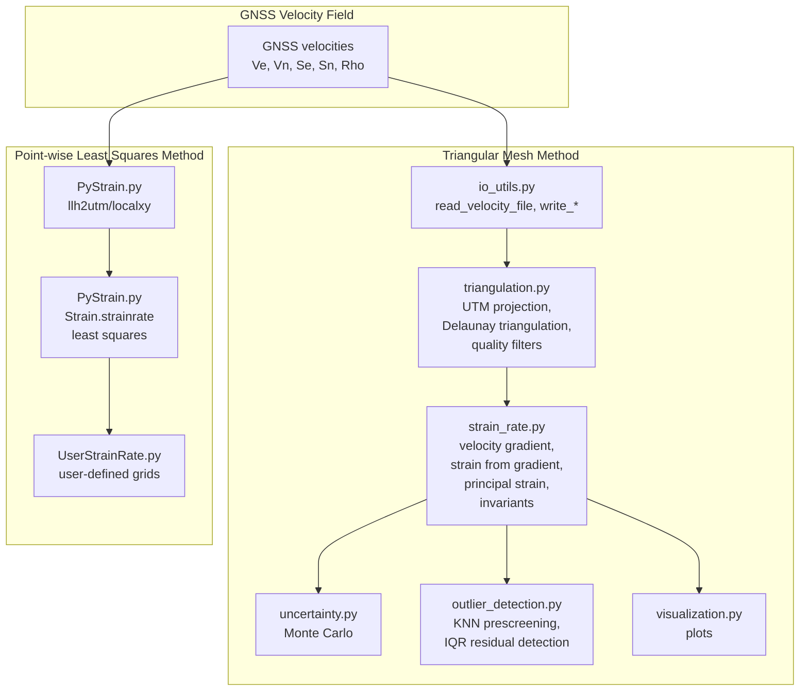
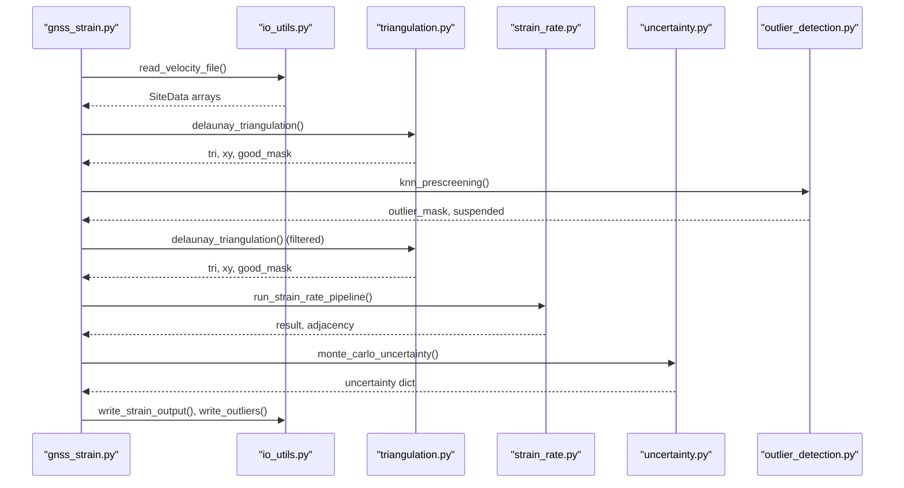
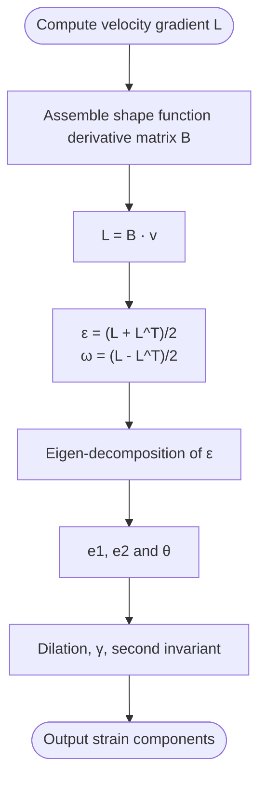
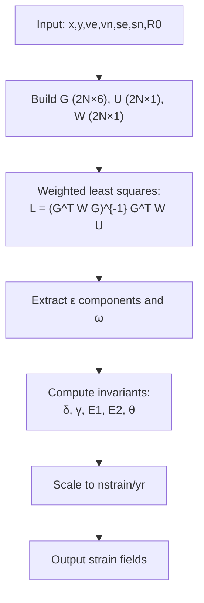
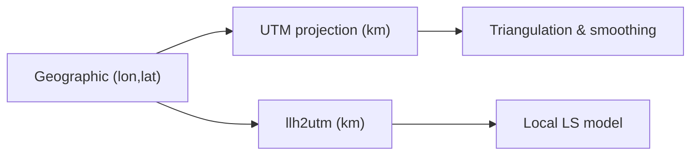
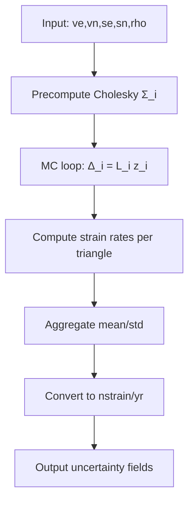
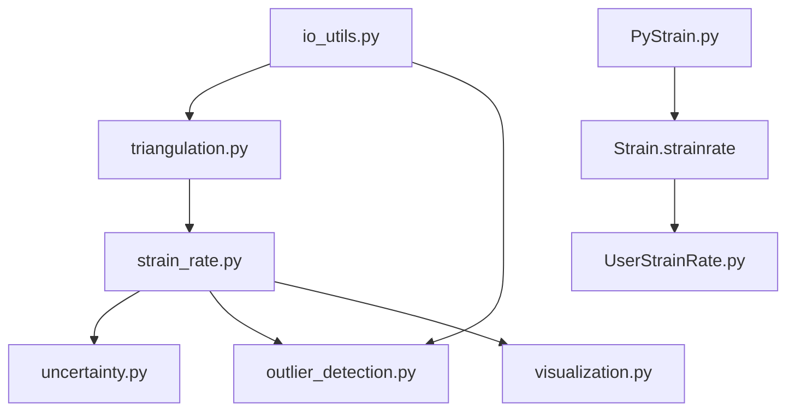

# Strain Analysis Mathematics

<cite>
**Referenced Files in This Document**
- [PyStrain.py](file://src/pystrain/PyStrain.py)
- [gnss_strain.py](file://src/pystrain/gnss_strain/gnss_strain.py)
- [strain_rate.py](file://src/pystrain/gnss_strain/strain_rate.py)
- [triangulation.py](file://src/pystrain/gnss_strain/triangulation.py)
- [uncertainty.py](file://src/pystrain/gnss_strain/uncertainty.py)
- [io_utils.py](file://src/pystrain/gnss_strain/io_utils.py)
- [outlier_detection.py](file://src/pystrain/gnss_strain/outlier_detection.py)
- [UserStrainRate.py](file://src/pystrain/UserStrainRate.py)
</cite>

## Table of Contents
1. [Introduction](#introduction)
2. [Project Structure](#project-structure)
3. [Core Components](#core-components)
4. [Architecture Overview](#architecture-overview)
5. [Detailed Component Analysis](#detailed-component-analysis)
6. [Dependency Analysis](#dependency-analysis)
7. [Performance Considerations](#performance-considerations)
8. [Troubleshooting Guide](#troubleshooting-guide)
9. [Conclusion](#conclusion)

## Introduction
This document presents the mathematical foundations underlying PyStrain’s strain analysis computations. It explains the strain rate tensor mathematics, deformation gradient tensors, strain rate components (exx, exy, eyy), and rotation rate calculations. It documents the least squares formulation used for strain rate estimation, including the design matrix G, observation vector U, and weight matrix W. It covers the mathematical derivation of principal strains (E1, E2), maximum shear strain (gamma), and strain orientation (theta). It also details the coordinate transformation from geographic to local Cartesian coordinates, distance-weighted estimation methods, and uncertainty propagation via Monte Carlo sampling.

## Project Structure
PyStrain comprises two complementary strain estimation approaches:
- A triangular mesh method operating on GNSS velocity fields with quality control, smoothing, and uncertainty quantification.
- A point-wise least squares method for computing strain rates at user-defined locations with distance-weighted estimation.

**Diagram sources**
- [gnss_strain.py:52-341](file://src/pystrain/gnss_strain/gnss_strain.py#L52-L341)
- [triangulation.py:89-146](file://src/pystrain/gnss_strain/triangulation.py#L89-L146)
- [strain_rate.py:18-198](file://src/pystrain/gnss_strain/strain_rate.py#L18-L198)
- [uncertainty.py:14-149](file://src/pystrain/gnss_strain/uncertainty.py#L14-L149)
- [outlier_detection.py:17-291](file://src/pystrain/gnss_strain/outlier_detection.py#L17-L291)
- [PyStrain.py:52-470](file://src/pystrain/PyStrain.py#L52-L470)
- [UserStrainRate.py:30-119](file://src/pystrain/UserStrainRate.py#L30-L119)

**Section sources**
- [gnss_strain.py:52-341](file://src/pystrain/gnss_strain/gnss_strain.py#L52-L341)
- [PyStrain.py:52-470](file://src/pystrain/PyStrain.py#L52-L470)

## Core Components
- Deformation gradient and strain rate computation:
  - Velocity gradient tensor L from shape function derivatives and nodal velocities.
  - Strain rate tensor ε and rotation rate ω derived from L.
  - Principal strains and orientations computed from eigen-decomposition.
- Least squares estimation:
  - Design matrix G, observation vector U, and weight matrix W define the weighted least squares problem.
  - Distance-weighted estimation using exponential weighting.
- Uncertainty propagation:
  - Monte Carlo sampling of velocity perturbations with covariance matrices to estimate standard deviations of strain rate components.
- Coordinate transformations:
  - Geographic to projected coordinates (UTM) for triangulation.
  - Local Cartesian coordinates (east/north km) for point-wise least squares.

**Section sources**
- [strain_rate.py:18-198](file://src/pystrain/gnss_strain/strain_rate.py#L18-L198)
- [PyStrain.py:364-470](file://src/pystrain/PyStrain.py#L364-L470)
- [uncertainty.py:14-149](file://src/pystrain/gnss_strain/uncertainty.py#L14-L149)
- [triangulation.py:22-146](file://src/pystrain/gnss_strain/triangulation.py#L22-L146)

## Architecture Overview
The triangular mesh method follows a pipeline: load velocities → quality control → triangulation → strain estimation → smoothing → uncertainty → output. The point-wise method computes strain rates at grid points using local Cartesian coordinates and distance-weighted least squares.

**Diagram sources**
- [gnss_strain.py:52-341](file://src/pystrain/gnss_strain/gnss_strain.py#L52-L341)
- [io_utils.py:21-132](file://src/pystrain/gnss_strain/io_utils.py#L21-L132)
- [triangulation.py:89-146](file://src/pystrain/gnss_strain/triangulation.py#L89-L146)
- [strain_rate.py:384-437](file://src/pystrain/gnss_strain/strain_rate.py#L384-L437)
- [uncertainty.py:14-149](file://src/pystrain/gnss_strain/uncertainty.py#L14-L149)
- [outlier_detection.py:17-291](file://src/pystrain/gnss_strain/outlier_detection.py#L17-L291)

## Detailed Component Analysis

### Mathematical Foundations: Strain Rate Tensor and Deformation Gradient
- Velocity gradient tensor L:
  - For a linear triangular element, the velocity field is expressed via shape functions N_i(x, y) with derivatives forming the matrix B.
  - The velocity gradient is L = B · v, where v collects nodal velocities (east and north).
  - Components:
    - L[0, :] = [dve/dx, dve/dy]
    - L[1, :] = [dvn/dx, dvn/dy]
- Strain rate and rotation rate:
  - Strain rate tensor ε is symmetric part of L: ε = (L + L^T)/2.
  - Rotation rate tensor Ω is skew-symmetric part of L: Ω = (L − L^T)/2.
  - Component-wise:
    - ε_xx = L[0,0], ε_yy = L[1,1], ε_xy = 0.5(L[0,1] + L[1,0]), ω = 0.5(L[1,0] − L[0,1]).
- Principal strains and orientation:
  - Eigen-decomposition of ε yields principal strains e1 ≥ e2 and orientation angle θ.
  - Invariants:
    - Dilation/divergence: div v = ε_xx + ε_yy
    - Maximum shear: γ = (e1 − e2)/2
    - Second invariant: sqrt(e1^2 + e2^2)

**Diagram sources**
- [strain_rate.py:18-103](file://src/pystrain/gnss_strain/strain_rate.py#L18-L103)

**Section sources**
- [strain_rate.py:18-103](file://src/pystrain/gnss_strain/strain_rate.py#L18-L103)

### Least Squares Formulation for Point-wise Strain Estimation
- Model:
  - Local velocity at site i: v_local ≈ [dx, dy] + [exx, exy; exy, eyy] · [x_i, y_i]^T + [0, w] · [x_i, y_i]^T
  - East and North equations:
    - ve_i ≈ dx + exx · x_i + exy · y_i + w · y_i
    - vn_i ≈ dy + exy · x_i + eyy · y_i − w · x_i
- Design matrix G, observation vector U, and weight vector W:
  - For each site i, construct rows of G ∈ ℝ^{2N×6}, U ∈ ℝ^{2N×1}, W ∈ ℝ^{2N×1}.
  - Weight depends on distance D_i = sqrt(x_i^2 + y_i^2) from reference point:
    - Uniform weight: w = 1
    - Distance-weighted: w = exp(D_i^2 / R0^2)
  - Weighted least squares solution:
    - L = (G^T W G)^{-1} G^T W U
    - Strain components scaled to nstrain/yr (multiply by 1e3 due to km-to-mm conversion).
- Derived quantities:
  - Dilation: δ = ε_xx + ε_yy
  - Shear: γ = sqrt((ε_yy − ε_xx)^2 + (2ε_xy)^2)
  - Principal strains: E1 = (δ + γ)/2, E2 = (δ − γ)/2
  - Orientation: θ from atan2(2ε_xy, ε_yy − ε_xx) adjusted for quadrants.

**Diagram sources**
- [PyStrain.py:364-470](file://src/pystrain/PyStrain.py#L364-L470)

**Section sources**
- [PyStrain.py:364-470](file://src/pystrain/PyStrain.py#L364-L470)

### Coordinate Transformations
- Geographic to projected coordinates:
  - UTM projection converts lon/lat to x/y (km) for triangulation and spatial analysis.
  - Projection parameters stored for reproducibility.
- Local Cartesian coordinates:
  - llh2utm: Uses transverse Mercator projection centered at reference point to compute east/north (km).
  - Alternative llh2localxy: Uses a polyconic-like approximation for small-scale local grids.

**Diagram sources**
- [triangulation.py:22-77](file://src/pystrain/gnss_strain/triangulation.py#L22-L77)
- [PyStrain.py:77-95](file://src/pystrain/PyStrain.py#L77-L95)
- [PyStrain.py:52-75](file://src/pystrain/PyStrain.py#L52-L75)

**Section sources**
- [triangulation.py:22-77](file://src/pystrain/gnss_strain/triangulation.py#L22-L77)
- [PyStrain.py:77-95](file://src/pystrain/PyStrain.py#L77-L95)
- [PyStrain.py:52-75](file://src/pystrain/PyStrain.py#L52-L75)

### Distance-Weighted Estimation
- Weighting scheme:
  - Uniform weight w = 1 for baseline.
  - Distance-weighted w = exp(D_i^2 / R0^2) to downweight distant observations.
- Effect:
  - Reduces influence of outliers and heterogeneous noise far from the reference point.
  - Improves robustness of local strain estimates.

**Section sources**
- [PyStrain.py:395-398](file://src/pystrain/PyStrain.py#L395-L398)

### Uncertainty Propagation via Monte Carlo
- Procedure:
  - Precompute Cholesky decomposition of per-site 2×2 covariance matrices Σ_i.
  - For M iterations, draw normal perturbations z_i ~ N(0, I), form Δ_i = L_i z_i, and compute strain rates for each triangle.
  - Aggregate mean and standard deviation across iterations; convert units to nstrain/yr.
- Outputs:
  - Mean and std of ε_xx, ε_xy, ε_yy, E1, E2, dilation, max shear.

**Diagram sources**
- [uncertainty.py:14-149](file://src/pystrain/gnss_strain/uncertainty.py#L14-L149)

**Section sources**
- [uncertainty.py:14-149](file://src/pystrain/gnss_strain/uncertainty.py#L14-L149)

### Principal Strains, Maximum Shear, and Orientation
- Principal strains:
  - Eigenvalues of ε ordered so that e1 ≥ e2.
- Maximum shear:
  - γ = (e1 − e2)/2; alternatively computed from deviatoric components.
- Orientation:
  - θ from atan2(2ε_xy, ε_yy − ε_xx); quadrant corrections ensure consistent orientation from east counterclockwise.

**Section sources**
- [strain_rate.py:60-103](file://src/pystrain/gnss_strain/strain_rate.py#L60-L103)
- [PyStrain.py:448-467](file://src/pystrain/PyStrain.py#L448-L467)

### Triangulation and Smoothing
- Quality control:
  - Delaunay triangulation with filters on minimum angle, maximum edge length percentiles, and triangle area thresholds.
- Smoothing:
  - Spatial averaging of strain components across adjacent triangles with a smoothing weight and iteration count.
  - Boundary triangles receive reduced weights to avoid edge effects.

**Section sources**
- [triangulation.py:89-146](file://src/pystrain/gnss_strain/triangulation.py#L89-L146)
- [strain_rate.py:205-271](file://src/pystrain/gnss_strain/strain_rate.py#L205-L271)

### Outlier Detection and Robustness
- KNN prescreening:
  - For each site, compare its velocity to the median of k nearest neighbors; flag outliers using MAD scaling.
- Residual-based IQR detection:
  - After triangulation, compute residuals of predicted vs observed velocities; remove outliers exceeding IQR thresholds.
- Iterative refinement:
  - Repeat triangulation and residual checks until convergence.

**Section sources**
- [outlier_detection.py:17-291](file://src/pystrain/gnss_strain/outlier_detection.py#L17-L291)

## Dependency Analysis
The triangular mesh method integrates several modules with clear data flow and responsibilities.

**Diagram sources**
- [gnss_strain.py:17-27](file://src/pystrain/gnss_strain/gnss_strain.py#L17-L27)
- [io_utils.py:21-132](file://src/pystrain/gnss_strain/io_utils.py#L21-L132)
- [triangulation.py:89-146](file://src/pystrain/gnss_strain/triangulation.py#L89-L146)
- [strain_rate.py:18-198](file://src/pystrain/gnss_strain/strain_rate.py#L18-L198)
- [uncertainty.py:14-149](file://src/pystrain/gnss_strain/uncertainty.py#L14-L149)
- [outlier_detection.py:17-291](file://src/pystrain/gnss_strain/outlier_detection.py#L17-L291)
- [PyStrain.py:364-470](file://src/pystrain/PyStrain.py#L364-L470)
- [UserStrainRate.py:30-119](file://src/pystrain/UserStrainRate.py#L30-L119)

**Section sources**
- [gnss_strain.py:17-27](file://src/pystrain/gnss_strain/gnss_strain.py#L17-L27)

## Performance Considerations
- Computational complexity:
  - Triangulation: O(N log N) average for Delaunay; filtering adds negligible overhead.
  - Shape function derivatives: O(N_tri).
  - Least squares: O(N_sites × 6^3) per point-wise fit; scalable with N_sites.
- Memory usage:
  - Large datasets benefit from iterative outlier removal to reduce N_sites.
- Numerical stability:
  - Use of Cholesky decomposition for per-site covariance sampling improves conditioning.
  - Smoothing reduces noise-induced oscillations in strain fields.

## Troubleshooting Guide
- Insufficient valid triangles:
  - Relax minimum angle or maximum edge thresholds; check polygon boundaries.
- Poor strain estimates near edges:
  - Increase smoothing weight or iterations; verify boundary triangle handling.
- Unstable principal strain orientation:
  - Verify ε_xy is well-constrained; consider increasing R0 for distance weighting.
- Excessive outliers:
  - Adjust KNN and IQR thresholds; review coordinate transformations and projections.

**Section sources**
- [gnss_strain.py:166-168](file://src/pystrain/gnss_strain/gnss_strain.py#L166-L168)
- [strain_rate.py:205-271](file://src/pystrain/gnss_strain/strain_rate.py#L205-L271)
- [outlier_detection.py:17-291](file://src/pystrain/gnss_strain/outlier_detection.py#L17-L291)

## Conclusion
PyStrain combines robust triangulation-based strain estimation with point-wise least squares methods. Its mathematical framework is grounded in velocity gradients, strain rate decompositions, and principal strain analysis. Distance-weighted least squares and Monte Carlo uncertainty propagation ensure reliable, geodetically interpretable results. Quality control and outlier detection further enhance the reliability of strain rate maps.