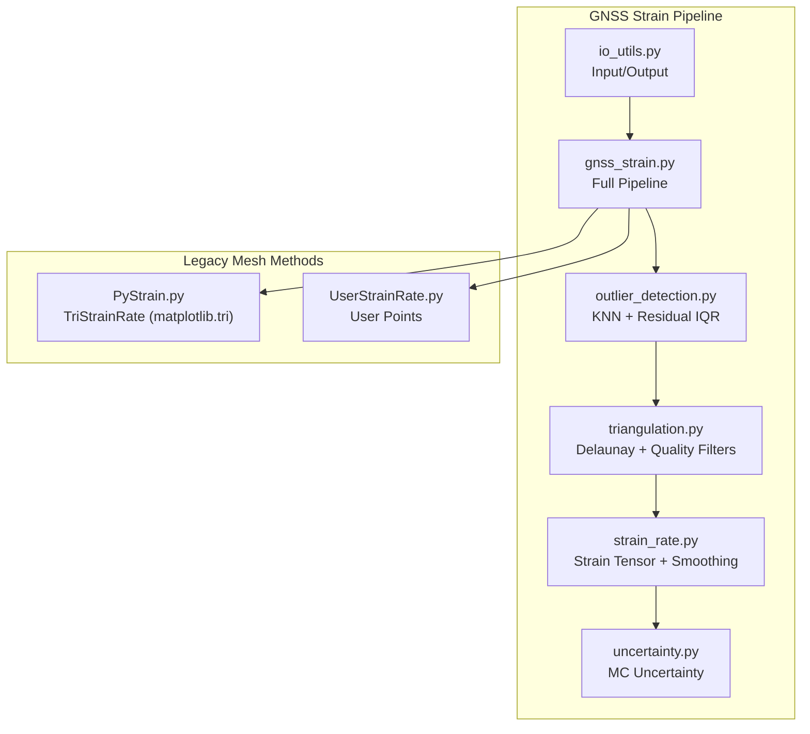
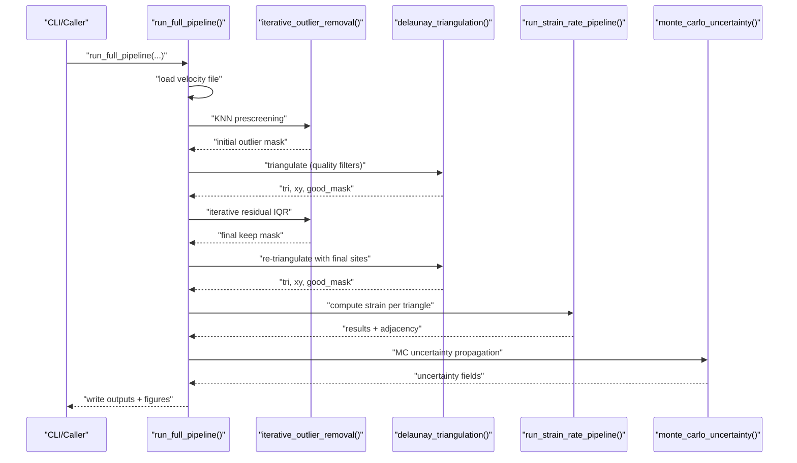
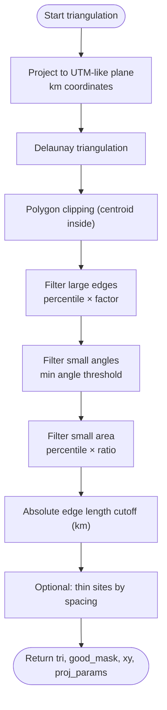
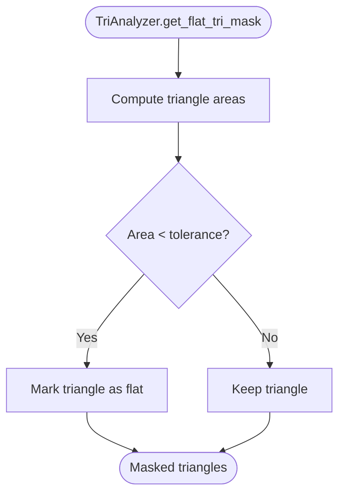
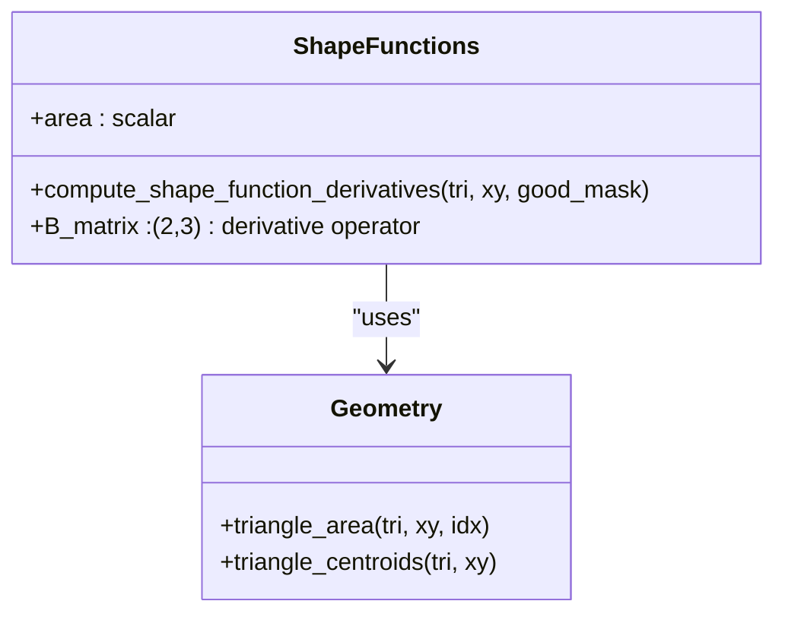
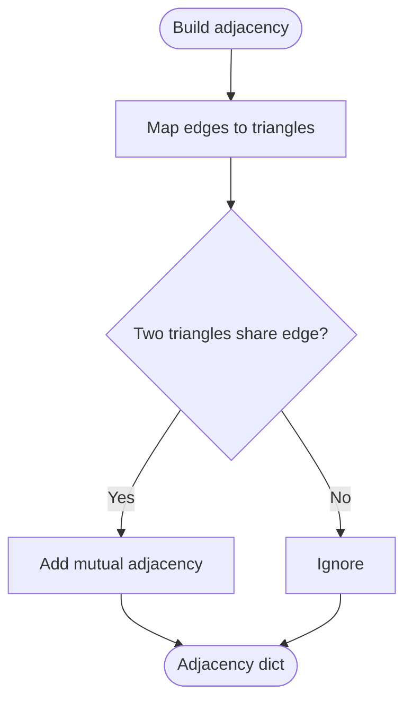
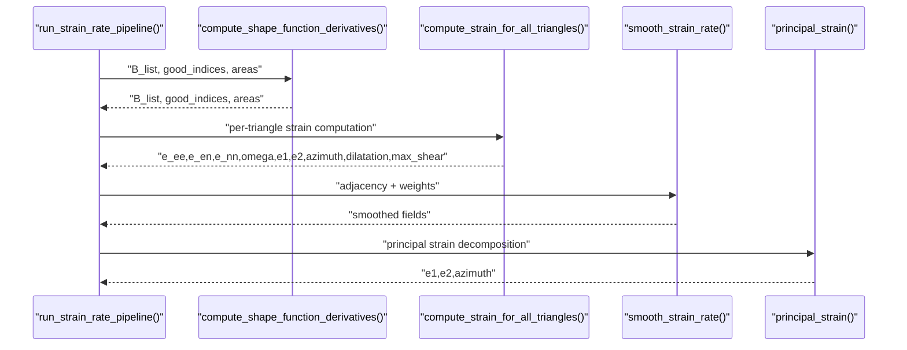
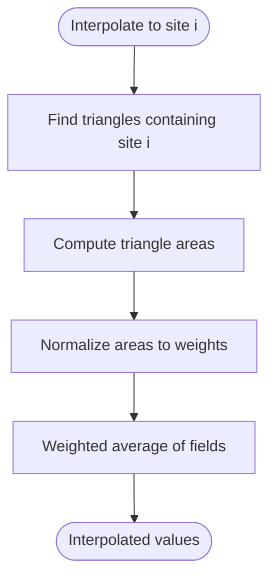
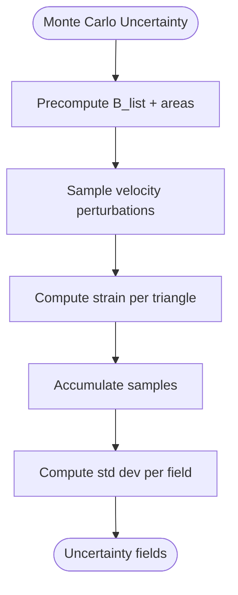
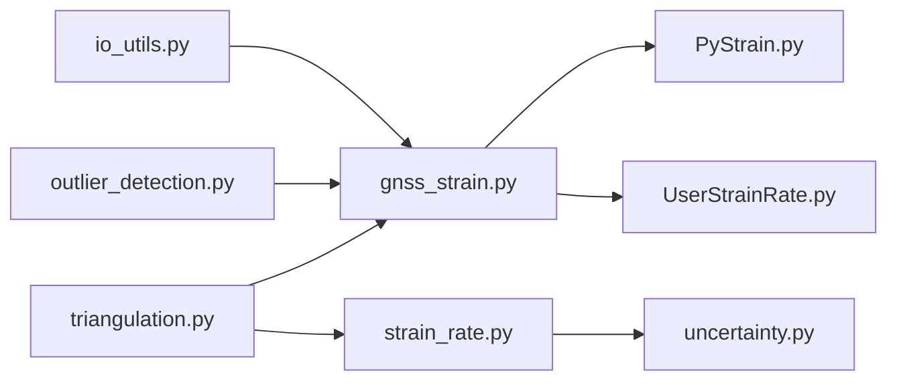

# Triangulation and Mesh Methods

<cite>
**Referenced Files in This Document**
- [triangulation.py](file://src/pystrain/gnss_strain/triangulation.py)
- [gnss_strain.py](file://src/pystrain/gnss_strain/gnss_strain.py)
- [strain_rate.py](file://src/pystrain/gnss_strain/strain_rate.py)
- [outlier_detection.py](file://src/pystrain/gnss_strain/outlier_detection.py)
- [uncertainty.py](file://src/pystrain/gnss_strain/uncertainty.py)
- [io_utils.py](file://src/pystrain/gnss_strain/io_utils.py)
- [config_default.yaml](file://src/pystrain/gnss_strain/config_default.yaml)
- [PyStrain.py](file://src/pystrain/PyStrain.py)
- [UserStrainRate.py](file://src/pystrain/UserStrainRate.py)
- [test/config.yaml](file://test/config.yaml)
- [test/grdmesh.txt](file://test/grdmesh.txt)
</cite>

## Table of Contents
1. [Introduction](#introduction)
2. [Project Structure](#project-structure)
3. [Core Components](#core-components)
4. [Architecture Overview](#architecture-overview)
5. [Detailed Component Analysis](#detailed-component-analysis)
6. [Dependency Analysis](#dependency-analysis)
7. [Performance Considerations](#performance-considerations)
8. [Troubleshooting Guide](#troubleshooting-guide)
9. [Conclusion](#conclusion)
10. [Appendices](#appendices)

## Introduction
This document explains triangulation methods and mesh-based strain analysis in the PyStrain GNSS strain estimation framework. It covers Delaunay triangulation principles, triangular mesh construction from GPS station networks, quality assessment criteria, triangulation analyzer functionality (including flat triangle detection and mesh refinement), triangular patch-based strain estimation, centroid calculations, interpolation methods, and practical guidance for mesh parameter selection. It also compares triangular mesh approaches to grid-based methods, discusses computational efficiency and memory usage for large datasets, and provides best practices for reliable strain estimation.

## Project Structure
The triangulation and mesh-based strain analysis is implemented primarily in the gnss_strain package, with complementary grid-based methods in the legacy PyStrain module. The key modules are:
- triangulation.py: Delaunay triangulation, projection, quality filters, shape functions, adjacency, and site thinning
- gnss_strain.py: end-to-end pipeline integrating triangulation, outlier detection, strain computation, smoothing, and output
- strain_rate.py: strain tensor computation per triangle, smoothing, interpolation, and principal strain analysis
- outlier_detection.py: KNN prescreening and iterative residual-based outlier removal
- uncertainty.py: Monte Carlo propagation of velocity uncertainties to strain estimates
- io_utils.py: input/output utilities for velocity and polygon files
- config_default.yaml: default configuration for triangulation parameters and smoothing
- PyStrain.py and UserStrainRate.py: legacy grid-based and triangular mesh methods (matplotlib.tri)
- test/config.yaml and test/grdmesh.txt: example configurations and output formats



**Diagram sources**
- [gnss_strain.py:1-407](file://src/pystrain/gnss_strain/gnss_strain.py#L1-L407)
- [triangulation.py:1-477](file://src/pystrain/gnss_strain/triangulation.py#L1-L477)
- [strain_rate.py:1-438](file://src/pystrain/gnss_strain/strain_rate.py#L1-L438)
- [outlier_detection.py:1-292](file://src/pystrain/gnss_strain/outlier_detection.py#L1-L292)
- [uncertainty.py:1-150](file://src/pystrain/gnss_strain/uncertainty.py#L1-L150)
- [PyStrain.py:730-800](file://src/pystrain/PyStrain.py#L730-L800)
- [UserStrainRate.py:1-126](file://src/pystrain/UserStrainRate.py#L1-L126)

**Section sources**
- [gnss_strain.py:1-407](file://src/pystrain/gnss_strain/gnss_strain.py#L1-L407)
- [triangulation.py:1-477](file://src/pystrain/gnss_strain/triangulation.py#L1-L477)
- [strain_rate.py:1-438](file://src/pystrain/gnss_strain/strain_rate.py#L1-L438)
- [outlier_detection.py:1-292](file://src/pystrain/gnss_strain/outlier_detection.py#L1-L292)
- [uncertainty.py:1-150](file://src/pystrain/gnss_strain/uncertainty.py#L1-L150)
- [PyStrain.py:730-800](file://src/pystrain/PyStrain.py#L730-L800)
- [UserStrainRate.py:1-126](file://src/pystrain/UserStrainRate.py#L1-L126)

## Core Components
- Delaunay triangulation with quality control: projection, triangulation, polygon clipping, edge-length thresholds, minimum angle filtering, area-based filtering, absolute edge-length cutoff, and thinning by spacing
- Shape functions and derivatives: linear triangular shape functions, gradient operator matrices B, and area computations
- Adjacency graph: triangle-to-triangle connectivity for smoothing and interpolation
- Strain computation per triangle: velocity gradients, strain tensors, principal strains, and derived invariants
- Smoothing: spatial averaging with adjustable weights and iterations
- Interpolation: area-weighted interpolation from triangles to sites
- Outlier detection: KNN prescreening and iterative residual-based detection
- Uncertainty propagation: Monte Carlo sampling of velocity uncertainties

**Section sources**
- [triangulation.py:89-146](file://src/pystrain/gnss_strain/triangulation.py#L89-L146)
- [triangulation.py:312-368](file://src/pystrain/gnss_strain/triangulation.py#L312-L368)
- [triangulation.py:375-416](file://src/pystrain/gnss_strain/triangulation.py#L375-L416)
- [strain_rate.py:18-198](file://src/pystrain/gnss_strain/strain_rate.py#L18-L198)
- [strain_rate.py:205-271](file://src/pystrain/gnss_strain/strain_rate.py#L205-L271)
- [strain_rate.py:278-377](file://src/pystrain/gnss_strain/strain_rate.py#L278-L377)
- [outlier_detection.py:17-87](file://src/pystrain/gnss_strain/outlier_detection.py#L17-L87)
- [outlier_detection.py:184-291](file://src/pystrain/gnss_strain/outlier_detection.py#L184-L291)
- [uncertainty.py:14-149](file://src/pystrain/gnss_strain/uncertainty.py#L14-L149)

## Architecture Overview
The pipeline integrates data loading, outlier detection, triangulation, strain computation, smoothing, and uncertainty propagation. The legacy triangular mesh method uses matplotlib.tri for comparison.



**Diagram sources**
- [gnss_strain.py:52-341](file://src/pystrain/gnss_strain/gnss_strain.py#L52-L341)
- [outlier_detection.py:184-291](file://src/pystrain/gnss_strain/outlier_detection.py#L184-L291)
- [triangulation.py:89-146](file://src/pystrain/gnss_strain/triangulation.py#L89-L146)
- [strain_rate.py:384-437](file://src/pystrain/gnss_strain/strain_rate.py#L384-L437)
- [uncertainty.py:14-149](file://src/pystrain/gnss_strain/uncertainty.py#L14-L149)

## Detailed Component Analysis

### Delaunay Triangulation and Quality Control
- Coordinate projection: WGS84 to UTM-like projection for planar geometry; coordinates converted to km for strain units
- Delaunay triangulation: full triangulation of projected coordinates
- Polygon clipping: centroids tested against polygon boundary using matplotlib Path
- Quality filters:
  - Large edges: percentile-based threshold multiplied by a factor
  - Small angles: minimum internal angle threshold
  - Small area: percentile-based threshold for triangle area
  - Absolute edge length: hard upper bound on edge length (km)
- Site thinning: reduces density by removing lower-precision sites within a minimum spacing



**Diagram sources**
- [triangulation.py:89-146](file://src/pystrain/gnss_strain/triangulation.py#L89-L146)
- [triangulation.py:149-256](file://src/pystrain/gnss_strain/triangulation.py#L149-L256)
- [triangulation.py:442-476](file://src/pystrain/gnss_strain/triangulation.py#L442-L476)

**Section sources**
- [triangulation.py:22-77](file://src/pystrain/gnss_strain/triangulation.py#L22-L77)
- [triangulation.py:89-146](file://src/pystrain/gnss_strain/triangulation.py#L89-L146)
- [triangulation.py:149-256](file://src/pystrain/gnss_strain/triangulation.py#L149-L256)
- [triangulation.py:259-281](file://src/pystrain/gnss_strain/triangulation.py#L259-L281)
- [triangulation.py:442-476](file://src/pystrain/gnss_strain/triangulation.py#L442-L476)

### Triangulation Analyzer and Flat Triangle Detection
- Flat triangle detection: identifies degenerate triangles with near-zero area using a tolerance threshold
- Mesh refinement: removes flat triangles to improve numerical stability and strain estimation reliability



**Diagram sources**
- [PyStrain.py:748-751](file://src/pystrain/PyStrain.py#L748-L751)

**Section sources**
- [PyStrain.py:748-751](file://src/pystrain/PyStrain.py#L748-L751)

### Shape Functions and Derivatives
- Linear triangular shape functions: each triangle has three nodes with associated basis functions
- Derivative matrix B: computes partial derivatives of shape functions to relate nodal velocities to velocity gradients
- Area computation: cross-product formula for triangle area



**Diagram sources**
- [triangulation.py:312-368](file://src/pystrain/gnss_strain/triangulation.py#L312-L368)
- [triangulation.py:288-298](file://src/pystrain/gnss_strain/triangulation.py#L288-L298)

**Section sources**
- [triangulation.py:312-368](file://src/pystrain/gnss_strain/triangulation.py#L312-L368)
- [triangulation.py:288-298](file://src/pystrain/gnss_strain/triangulation.py#L288-L298)

### Adjacency Graph and Hanging Sites
- Adjacency: builds triangle-to-triangle connections by shared edges
- Hanging sites: detects sites not included in any valid triangle



**Diagram sources**
- [triangulation.py:375-416](file://src/pystrain/gnss_strain/triangulation.py#L375-L416)

**Section sources**
- [triangulation.py:375-416](file://src/pystrain/gnss_strain/triangulation.py#L375-L416)
- [triangulation.py:423-435](file://src/pystrain/gnss_strain/triangulation.py#L423-L435)

### Triangular Patch-Based Strain Estimation
- Velocity gradient per triangle: L = B @ [ve; vn]
- Strain tensor: symmetric part of L
- Principal strains and orientations: eigen-decomposition of strain tensor
- Derived invariants: dilatation, maximum shear, second invariant
- Spatial smoothing: weighted average of neighboring triangles



**Diagram sources**
- [strain_rate.py:18-198](file://src/pystrain/gnss_strain/strain_rate.py#L18-L198)
- [strain_rate.py:205-271](file://src/pystrain/gnss_strain/strain_rate.py#L205-L271)
- [strain_rate.py:384-437](file://src/pystrain/gnss_strain/strain_rate.py#L384-L437)

**Section sources**
- [strain_rate.py:18-198](file://src/pystrain/gnss_strain/strain_rate.py#L18-L198)
- [strain_rate.py:205-271](file://src/pystrain/gnss_strain/strain_rate.py#L205-L271)
- [strain_rate.py:384-437](file://src/pystrain/gnss_strain/strain_rate.py#L384-L437)

### Interpolation Methods
- Interpolation to sites: area-weighted average of triangle fields for triangles containing the site
- Residual computation: area-barycentric interpolation of predicted velocities at sites for residual analysis



**Diagram sources**
- [strain_rate.py:278-308](file://src/pystrain/gnss_strain/strain_rate.py#L278-L308)
- [strain_rate.py:311-377](file://src/pystrain/gnss_strain/strain_rate.py#L311-L377)

**Section sources**
- [strain_rate.py:278-308](file://src/pystrain/gnss_strain/strain_rate.py#L278-L308)
- [strain_rate.py:311-377](file://src/pystrain/gnss_strain/strain_rate.py#L311-L377)

### Outlier Detection and Iterative Refinement
- KNN prescreening: robust median-based deviation using MAD
- Residual-based iterative detection: IQR-based threshold on prediction residuals
- Iterative loop: re-triangulate and re-evaluate until convergence

```mermaid
sequenceDiagram
participant LOOP as "iterative_outlier_removal"
participant KNN as "knn_prescreening"
participant TRI as "triangulation_fn"
participant RES as "compute_residuals_triangulation"
participant IQR as "iqr_outlier_detection"
LOOP->>KNN : "prescreen with MAD"
KNN-->>LOOP : "outlier_mask_knn"
LOOP->>TRI : "triangulate with sub-set"
TRI-->>LOOP : "tri, xy, good_mask"
LOOP->>RES : "compute residuals"
RES-->>LOOP : "residuals"
LOOP->>IQR : "detect outliers by IQR"
IQR-->>LOOP : "outlier_sites"
LOOP-->>LOOP : "update keep_mask"
```

**Diagram sources**
- [outlier_detection.py:184-291](file://src/pystrain/gnss_strain/outlier_detection.py#L184-L291)
- [outlier_detection.py:17-87](file://src/pystrain/gnss_strain/outlier_detection.py#L17-L87)
- [outlier_detection.py:94-177](file://src/pystrain/gnss_strain/outlier_detection.py#L94-L177)

**Section sources**
- [outlier_detection.py:17-87](file://src/pystrain/gnss_strain/outlier_detection.py#L17-L87)
- [outlier_detection.py:94-177](file://src/pystrain/gnss_strain/outlier_detection.py#L94-L177)
- [outlier_detection.py:184-291](file://src/pystrain/gnss_strain/outlier_detection.py#L184-L291)

### Uncertainty Propagation
- Monte Carlo sampling: perturb velocities using velocity covariance matrices (Cholesky decomposition)
- Per-triangle strain computation for each sample
- Standard deviation of samples as uncertainty estimates



**Diagram sources**
- [uncertainty.py:14-149](file://src/pystrain/gnss_strain/uncertainty.py#L14-L149)

**Section sources**
- [uncertainty.py:14-149](file://src/pystrain/gnss_strain/uncertainty.py#L14-L149)

## Dependency Analysis
Key dependencies and relationships:
- gnss_strain.py orchestrates io_utils, triangulation, strain_rate, outlier_detection, uncertainty, and visualization
- strain_rate.py depends on triangulation for shape functions and adjacency
- outlier_detection.py depends on triangulation for residual computation and uses triangulation_fn closure
- Legacy PyStrain.py provides TriStrainRate using matplotlib.tri for comparison



**Diagram sources**
- [gnss_strain.py:17-27](file://src/pystrain/gnss_strain/gnss_strain.py#L17-L27)
- [strain_rate.py:8-11](file://src/pystrain/gnss_strain/strain_rate.py#L8-L11)
- [outlier_detection.py:9-10](file://src/pystrain/gnss_strain/outlier_detection.py#L9-L10)
- [PyStrain.py:534-540](file://src/pystrain/PyStrain.py#L534-L540)
- [UserStrainRate.py:1-4](file://src/pystrain/UserStrainRate.py#L1-L4)

**Section sources**
- [gnss_strain.py:17-27](file://src/pystrain/gnss_strain/gnss_strain.py#L17-L27)
- [strain_rate.py:8-11](file://src/pystrain/gnss_strain/strain_rate.py#L8-L11)
- [outlier_detection.py:9-10](file://src/pystrain/gnss_strain/outlier_detection.py#L9-L10)
- [PyStrain.py:534-540](file://src/pystrain/PyStrain.py#L534-L540)
- [UserStrainRate.py:1-4](file://src/pystrain/UserStrainRate.py#L1-L4)

## Performance Considerations
- Computational complexity:
  - Delaunay triangulation: O(N log N) typical in 2D
  - Quality filters: O(N_tri) per filter; combined cost scales with number of triangles retained
  - Shape function derivatives: O(N_tri)
  - Smoothing: O(N_tri + E) where E is number of edges (adjacency)
  - Interpolation: O(N_sites + N_tri) for area-weighted scheme
  - Monte Carlo: O(M × N_tri) where M is number of iterations
- Memory usage:
  - Storage of triangulation simplices and adjacency graph
  - Intermediate arrays for B matrices, areas, and smoothed fields
  - Random number generation and sample accumulation for MC
- Practical tips:
  - Use polygon clipping to reduce triangle count
  - Apply minimum angle and edge-length thresholds to avoid ill-conditioned triangles
  - Use thin_sites_by_spacing to reduce dataset size while preserving precision
  - Limit MC iterations for speed; increase for stability
  - Adjust smoothing weight and iterations to balance noise reduction and spatial resolution

[No sources needed since this section provides general guidance]

## Troubleshooting Guide
Common issues and remedies:
- Too few valid triangles after quality filtering:
  - Relax min_angle_deg, adjust max_edge_pctl/factor, or enable max_edge_km
  - Verify polygon boundaries and ensure sufficient coverage
- Poor strain estimates near edges:
  - Increase smoothing weight and iterations
  - Check for hanging sites and ensure adequate station density
- Outliers affecting triangulation:
  - Increase iqr_factor or reduce mad_factor for stricter detection
  - Review outlier history and inspect flagged sites
- Degenerate triangles in legacy method:
  - Use TriAnalyzer flat triangle mask to remove flat triangles
- Insufficient spatial distribution:
  - Enforce minimum spacing and ensure stations cover the region uniformly

**Section sources**
- [gnss_strain.py:166-168](file://src/pystrain/gnss_strain/gnss_strain.py#L166-L168)
- [config_default.yaml:29-48](file://src/pystrain/gnss_strain/config_default.yaml#L29-L48)
- [outlier_detection.py:184-291](file://src/pystrain/gnss_strain/outlier_detection.py#L184-L291)
- [PyStrain.py:748-751](file://src/pystrain/PyStrain.py#L748-L751)

## Conclusion
The PyStrain framework provides a robust, configurable pipeline for GNSS-based strain estimation using triangular meshes. By combining Delaunay triangulation with quality control, robust outlier detection, per-triangle strain computation, spatial smoothing, and Monte Carlo uncertainty propagation, it delivers reliable strain rate maps. The legacy triangular mesh method offers a baseline comparison using matplotlib.tri. Proper parameter selection and spatial distribution are essential for accurate and efficient results.

[No sources needed since this section summarizes without analyzing specific files]

## Appendices

### Practical Guidance on Mesh Parameter Selection
- Minimum angle criteria:
  - Typical recommendation: 10–30 degrees; higher values yield better-conditioned triangles but may reduce coverage near edges
- Edge-length thresholds:
  - Use percentiles (e.g., 95th) multiplied by a safety factor (e.g., 1.5) to avoid overly long edges
  - Consider absolute edge length cutoff (km) to prevent unrealistic connections across gaps
- Spatial distribution requirements:
  - Ensure stations are distributed across the region; use polygon clipping to focus on study area
  - Apply thin_sites_by_spacing to avoid clustering and preserve precision
- Smoothing:
  - Start with moderate smoothing weight and iterate to balance noise and spatial detail

**Section sources**
- [config_default.yaml:29-48](file://src/pystrain/gnss_strain/config_default.yaml#L29-L48)
- [triangulation.py:89-146](file://src/pystrain/gnss_strain/triangulation.py#L89-L146)
- [triangulation.py:442-476](file://src/pystrain/gnss_strain/triangulation.py#L442-L476)

### Comparison: Triangular Mesh vs Grid-Based Methods
- Triangular mesh advantages:
  - Adaptive resolution aligned to station density
  - Natural handling of irregular station distributions
  - Localized smoothing and interpolation
- Triangular mesh limitations:
  - Requires careful quality control and outlier handling
  - Computationally intensive for very large datasets
- Grid-based methods advantages:
  - Simpler spatial averaging and interpolation
  - Lower computational overhead for large grids
- Grid-based limitations:
  - Fixed resolution may miss localized deformation
  - Weighting schemes require careful tuning

**Section sources**
- [PyStrain.py:552-800](file://src/pystrain/PyStrain.py#L552-L800)
- [UserStrainRate.py:30-126](file://src/pystrain/UserStrainRate.py#L30-L126)

### Example Output Formats
- Triangular mesh output includes triangle centroids, strain components, principal strains, orientations, and derived invariants
- Grid mesh output includes grid points, velocities, and strain components with optional smoothing

**Section sources**
- [io_utils.py:186-230](file://src/pystrain/gnss_strain/io_utils.py#L186-L230)
- [test/grdmesh.txt:1-189](file://test/grdmesh.txt#L1-L189)
- [test/config.yaml:63-73](file://test/config.yaml#L63-L73)