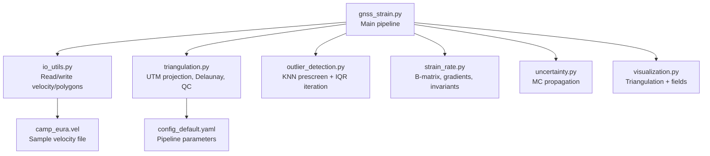
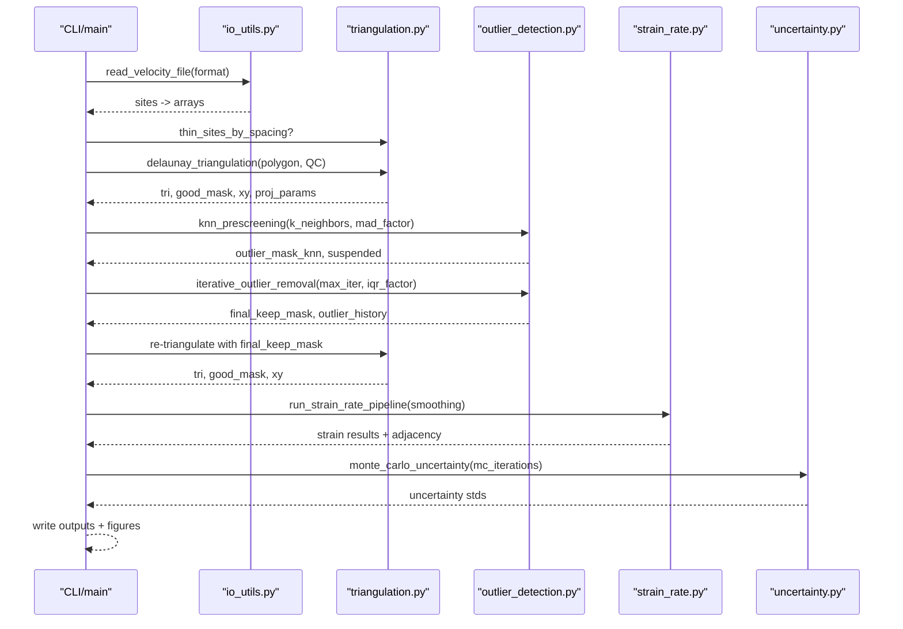
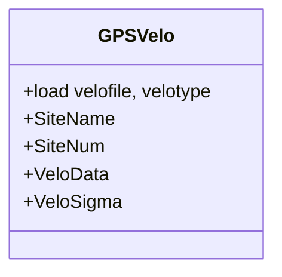
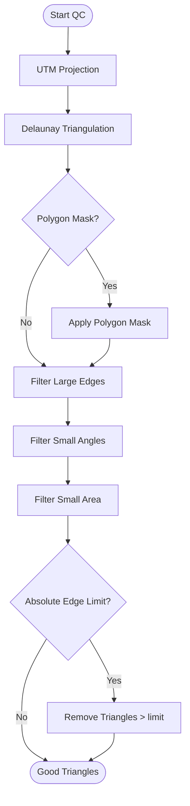
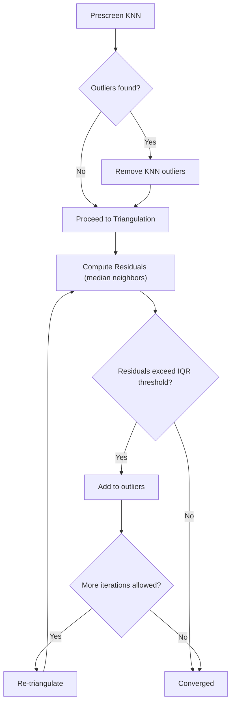
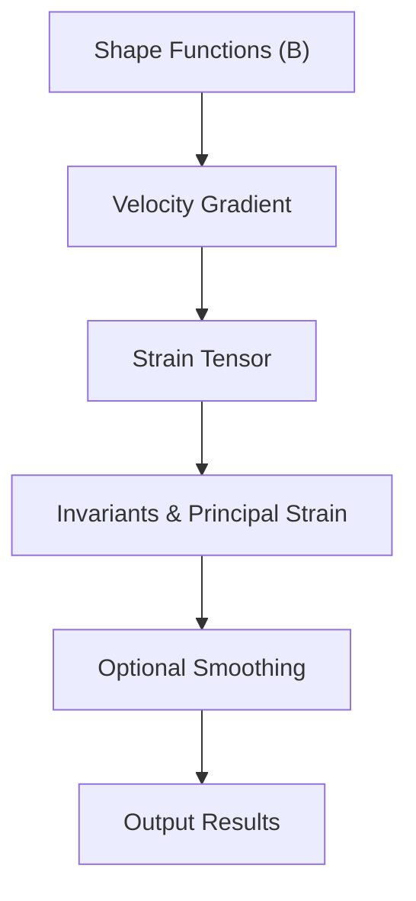
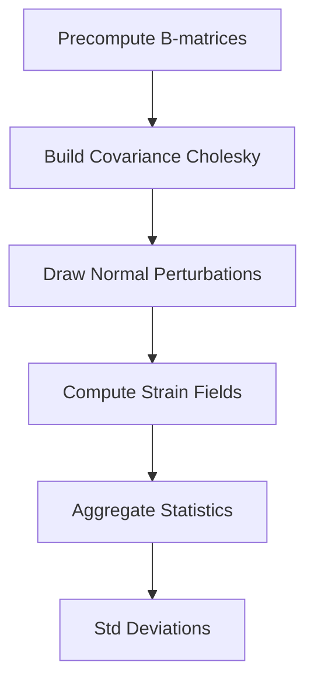
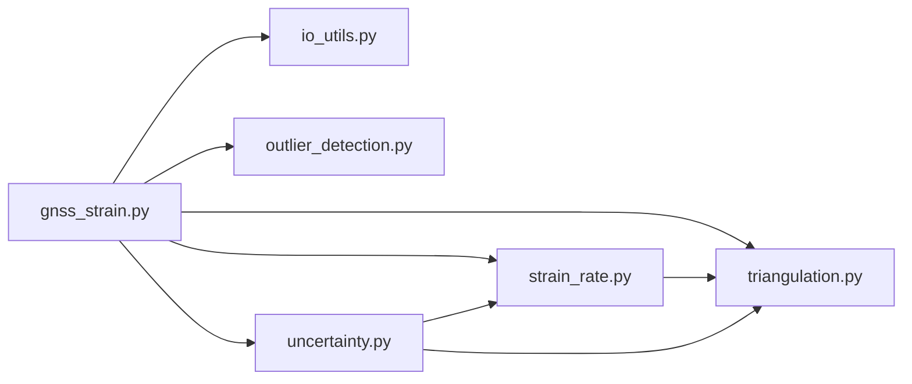

# Data Processing and Quality Control

<cite>
**Referenced Files in This Document**
- [gnss_strain.py](file://src/pystrain/gnss_strain/gnss_strain.py)
- [outlier_detection.py](file://src/pystrain/gnss_strain/outlier_detection.py)
- [uncertainty.py](file://src/pystrain/gnss_strain/uncertainty.py)
- [io_utils.py](file://src/pystrain/gnss_strain/io_utils.py)
- [triangulation.py](file://src/pystrain/gnss_strain/triangulation.py)
- [strain_rate.py](file://src/pystrain/gnss_strain/strain_rate.py)
- [config_default.yaml](file://src/pystrain/gnss_strain/config_default.yaml)
- [camp_eura.vel](file://src/pystrain/gnss_strain/camp_eura.vel)
- [PyStrain.py](file://src/pystrain/PyStrain.py)
- [UserStrainRate.py](file://src/pystrain/UserStrainRate.py)
</cite>

## Table of Contents
1. [Introduction](#introduction)
2. [Project Structure](#project-structure)
3. [Core Components](#core-components)
4. [Architecture Overview](#architecture-overview)
5. [Detailed Component Analysis](#detailed-component-analysis)
6. [Dependency Analysis](#dependency-analysis)
7. [Performance Considerations](#performance-considerations)
8. [Troubleshooting Guide](#troubleshooting-guide)
9. [Conclusion](#conclusion)
10. [Appendices](#appendices)

## Introduction
This document explains PyStrain’s GPS velocity data processing and quality control systems with a focus on validating and refining GPS-derived velocity fields prior to strain-rate computation. It covers data ingestion, coordinate transformations, triangulation quality control, robust outlier detection, iterative filtering, uncertainty quantification via Monte Carlo, and the integration between QC and strain computation. Practical workflows, diagnostic strategies, and interpretation guidelines for quality metrics are included to support informed decisions about data inclusion.

## Project Structure
The GNSS strain pipeline is organized around a modular set of modules:
- Data I/O and preprocessing
- Triangulation and geometry
- Outlier detection and iterative filtering
- Strain-rate computation and smoothing
- Uncertainty propagation
- Reporting and visualization

**Diagram sources**
- [gnss_strain.py:1-407](file://src/pystrain/gnss_strain/gnss_strain.py#L1-L407)
- [io_utils.py:1-270](file://src/pystrain/gnss_strain/io_utils.py#L1-L270)
- [triangulation.py:1-477](file://src/pystrain/gnss_strain/triangulation.py#L1-L477)
- [outlier_detection.py:1-292](file://src/pystrain/gnss_strain/outlier_detection.py#L1-L292)
- [strain_rate.py:1-438](file://src/pystrain/gnss_strain/strain_rate.py#L1-L438)
- [uncertainty.py:1-150](file://src/pystrain/gnss_strain/uncertainty.py#L1-L150)
- [config_default.yaml:1-69](file://src/pystrain/gnss_strain/config_default.yaml#L1-L69)
- [camp_eura.vel:1-2129](file://src/pystrain/gnss_strain/camp_eura.vel#L1-L2129)

**Section sources**
- [gnss_strain.py:1-407](file://src/pystrain/gnss_strain/gnss_strain.py#L1-L407)
- [io_utils.py:1-270](file://src/pystrain/gnss_strain/io_utils.py#L1-L270)
- [triangulation.py:1-477](file://src/pystrain/gnss_strain/triangulation.py#L1-L477)
- [outlier_detection.py:1-292](file://src/pystrain/gnss_strain/outlier_detection.py#L1-L292)
- [strain_rate.py:1-438](file://src/pystrain/gnss_strain/strain_rate.py#L1-L438)
- [uncertainty.py:1-150](file://src/pystrain/gnss_strain/uncertainty.py#L1-L150)
- [config_default.yaml:1-69](file://src/pystrain/gnss_strain/config_default.yaml#L1-L69)
- [camp_eura.vel:1-2129](file://src/pystrain/gnss_strain/camp_eura.vel#L1-L2129)

## Core Components
- Data ingestion and format handling: reads velocity files (GMT/GLOBK/auto), extracts lon/lat/velocity/error/rho/name, and converts to arrays.
- Coordinate transformations: projects geographic coordinates to UTM for planar triangulation and distance computations.
- Triangulation quality control: filters triangles by minimum angle, maximum edge thresholds, and optional absolute edge length.
- Outlier detection: two-stage process—KNN-based prescreening using median absolute deviation (MAD), followed by iterative residual-based detection using interquartile range (IQR) on triangulation residuals.
- Strain-rate computation: shape-function derivatives, velocity gradient, strain invariants, principal strain, and optional smoothing.
- Uncertainty quantification: Monte Carlo sampling of velocity perturbations respecting correlations to estimate standard deviations of derived strain-rate fields.
- Reporting and diagnostics: writes strain outputs, outlier logs, and summary reports; generates diagnostic plots.

**Section sources**
- [io_utils.py:21-132](file://src/pystrain/gnss_strain/io_utils.py#L21-L132)
- [triangulation.py:22-146](file://src/pystrain/gnss_strain/triangulation.py#L22-L146)
- [outlier_detection.py:17-87](file://src/pystrain/gnss_strain/outlier_detection.py#L17-L87)
- [outlier_detection.py:94-177](file://src/pystrain/gnss_strain/outlier_detection.py#L94-L177)
- [strain_rate.py:18-120](file://src/pystrain/gnss_strain/strain_rate.py#L18-L120)
- [uncertainty.py:14-149](file://src/pystrain/gnss_strain/uncertainty.py#L14-L149)
- [gnss_strain.py:186-279](file://src/pystrain/gnss_strain/gnss_strain.py#L186-L279)

## Architecture Overview
The end-to-end pipeline orchestrates data loading, QC, triangulation, iterative outlier removal, strain-rate computation, uncertainty propagation, and output generation.

**Diagram sources**
- [gnss_strain.py:92-341](file://src/pystrain/gnss_strain/gnss_strain.py#L92-L341)
- [io_utils.py:21-132](file://src/pystrain/gnss_strain/io_utils.py#L21-L132)
- [triangulation.py:89-146](file://src/pystrain/gnss_strain/triangulation.py#L89-L146)
- [outlier_detection.py:184-291](file://src/pystrain/gnss_strain/outlier_detection.py#L184-L291)
- [strain_rate.py:384-437](file://src/pystrain/gnss_strain/strain_rate.py#L384-L437)
- [uncertainty.py:14-149](file://src/pystrain/gnss_strain/uncertainty.py#L14-L149)

## Detailed Component Analysis

### GPSVelo class (legacy module)
The GPSVelo class loads velocity data from files in GMT or GLOBK formats, extracting lon/lat, velocity components (east/north), uncertainties, correlation coefficient, and optional site names. It exposes properties for accessing velocity data and uncertainties.

**Diagram sources**
- [PyStrain.py:248-320](file://src/pystrain/PyStrain.py#L248-L320)

**Section sources**
- [PyStrain.py:248-320](file://src/pystrain/PyStrain.py#L248-L320)

### Data Loading and Format Handling
- Supports automatic detection of GMT (8-column) and GLOBK (13-column) formats, with fallback handling for variable column counts.
- Extracts lon/lat, ve/vn, se/sn, rho, and optional site names.
- Converts lists of named tuples to NumPy arrays for downstream processing.

**Section sources**
- [io_utils.py:21-132](file://src/pystrain/gnss_strain/io_utils.py#L21-L132)
- [camp_eura.vel:1-200](file://src/pystrain/gnss_strain/camp_eura.vel#L1-L200)

### Coordinate Transformations
- Projects geographic coordinates to UTM using WGS84 ellipsoid parameters, converting degrees to meters and then kilometers for consistent units in strain-rate computation.
- Provides inverse transform placeholder for completeness.

**Section sources**
- [triangulation.py:22-83](file://src/pystrain/gnss_strain/triangulation.py#L22-L83)

### Triangulation and Quality Control
- Performs Delaunay triangulation on projected coordinates.
- Applies polygon clipping, minimum-angle filtering, maximum-edge filtering (percentile-based), minimum-area filtering, and optional absolute edge-length cutoff.
- Computes triangle centroids and identifies hanging sites not covered by any good triangle.

**Diagram sources**
- [triangulation.py:89-146](file://src/pystrain/gnss_strain/triangulation.py#L89-L146)

**Section sources**
- [triangulation.py:89-257](file://src/pystrain/gnss_strain/triangulation.py#L89-L257)

### Outlier Detection Algorithms
- KNN prescreening:
  - Uses a spatial KDTree on lon/lat to find nearest neighbors.
  - Compares each station’s velocity to the median velocity of neighbors; normalizes by MAD along each component.
  - Flags outliers using a joint 2D deviation threshold scaled by sqrt(2).
  - Marks “suspended” when insufficient neighbors.
- Residual-based IQR iteration:
  - Computes residuals per station as the difference between observed velocity and the median neighbor velocity.
  - Applies IQR-based thresholding to detect outliers iteratively.
  - Re-triangulates after each round and continues until convergence or a fixed number of iterations.

**Diagram sources**
- [outlier_detection.py:17-87](file://src/pystrain/gnss_strain/outlier_detection.py#L17-L87)
- [outlier_detection.py:94-177](file://src/pystrain/gnss_strain/outlier_detection.py#L94-L177)
- [outlier_detection.py:184-291](file://src/pystrain/gnss_strain/outlier_detection.py#L184-L291)

**Section sources**
- [outlier_detection.py:17-87](file://src/pystrain/gnss_strain/outlier_detection.py#L17-L87)
- [outlier_detection.py:94-177](file://src/pystrain/gnss_strain/outlier_detection.py#L94-L177)
- [outlier_detection.py:184-291](file://src/pystrain/gnss_strain/outlier_detection.py#L184-L291)

### Strain-Rate Computation and Smoothing
- Shape-function derivative matrices (B) computed per triangle from local coordinates.
- Velocity gradient tensors derived from B and nodal velocities.
- Strain-rate invariants (dilatation, maximum shear, second invariant), principal strains, and orientations computed.
- Optional spatial smoothing via weighted averaging of neighboring triangles.

**Diagram sources**
- [strain_rate.py:18-120](file://src/pystrain/gnss_strain/strain_rate.py#L18-L120)
- [strain_rate.py:126-199](file://src/pystrain/gnss_strain/strain_rate.py#L126-L199)
- [strain_rate.py:205-271](file://src/pystrain/gnss_strain/strain_rate.py#L205-L271)

**Section sources**
- [strain_rate.py:18-120](file://src/pystrain/gnss_strain/strain_rate.py#L18-L120)
- [strain_rate.py:126-199](file://src/pystrain/gnss_strain/strain_rate.py#L126-L199)
- [strain_rate.py:205-271](file://src/pystrain/gnss_strain/strain_rate.py#L205-L271)

### Uncertainty Quantification (Monte Carlo)
- Fixed triangulation topology; velocity vectors perturbed independently per station using covariance Cholesky decomposition.
- Correlations modeled via off-diagonal terms in per-station covariance matrices.
- Standard deviations computed across Monte Carlo iterations for all derived fields.

**Diagram sources**
- [uncertainty.py:14-149](file://src/pystrain/gnss_strain/uncertainty.py#L14-L149)

**Section sources**
- [uncertainty.py:14-149](file://src/pystrain/gnss_strain/uncertainty.py#L14-L149)

### Integration Between QC and Strain Computation
- Iterative outlier removal refines the dataset used for triangulation and strain computation.
- Final keep mask ensures only high-quality triangles contribute to strain-rate estimates.
- Uncertainty is propagated using the final triangulation and retained stations.

**Section sources**
- [gnss_strain.py:169-246](file://src/pystrain/gnss_strain/gnss_strain.py#L169-L246)

## Dependency Analysis
Key internal dependencies:
- gnss_strain.py depends on io_utils, triangulation, outlier_detection, strain_rate, uncertainty, and visualization.
- strain_rate.py depends on triangulation for B-matrix and geometry.
- uncertainty.py depends on triangulation for B-matrix and strain_rate for core computations.

**Diagram sources**
- [gnss_strain.py:17-27](file://src/pystrain/gnss_strain/gnss_strain.py#L17-L27)
- [strain_rate.py:9-11](file://src/pystrain/gnss_strain/strain_rate.py#L9-L11)
- [uncertainty.py:9-11](file://src/pystrain/gnss_strain/uncertainty.py#L9-L11)

**Section sources**
- [gnss_strain.py:17-27](file://src/pystrain/gnss_strain/gnss_strain.py#L17-L27)
- [strain_rate.py:9-11](file://src/pystrain/gnss_strain/strain_rate.py#L9-L11)
- [uncertainty.py:9-11](file://src/pystrain/gnss_strain/uncertainty.py#L9-L11)

## Performance Considerations
- KDTree-based spatial queries dominate prescreening cost; tuning k_neighbors balances sensitivity and speed.
- Triangulation cost scales with number of retained sites; consider thinning by spacing to reduce density.
- Iterative outlier removal can converge quickly; cap max_iterations to bound runtime.
- Monte Carlo uncertainty scales linearly with iterations; adjust mc_iterations for accuracy vs. speed trade-offs.
- Visualization and output writing occur last; they are I/O bound and generally fast compared to core computations.

[No sources needed since this section provides general guidance]

## Troubleshooting Guide
Common issues and remedies:
- Not enough valid triangles after QC:
  - Relax min_angle_deg, increase max_edge_pctl or max_edge_factor, or remove absolute edge limit.
  - Verify polygon masking and ensure sufficient coverage.
- Excessive outlier removal:
  - Increase mad_factor or iqr_factor to be less strict; review residual distributions.
- Poor triangulation quality:
  - Reduce density via min_spacing_km; ensure coordinate projection is appropriate for region.
- Convergence stalls:
  - Increase max_iterations or adjust k_neighbors; inspect outlier history for persistent flags.
- Uncertainty not computed:
  - Ensure valid triangles remain after outlier removal; verify covariance matrices are positive definite.

Interpreting quality metrics:
- Triangle quality: monitor good triangle percentage; low ratios indicate overly strict QC parameters.
- Outlier history: track reasons (KNN/IQR) and residual magnitudes to assess data reliability.
- Strain-rate fields: use smoothing weights thoughtfully; higher weights increase regularization.
- Uncertainty: compare standard deviations to strain-rate magnitudes to gauge confidence.

**Section sources**
- [gnss_strain.py:166-168](file://src/pystrain/gnss_strain/gnss_strain.py#L166-L168)
- [gnss_strain.py:203-206](file://src/pystrain/gnss_strain/gnss_strain.py#L203-L206)
- [config_default.yaml:18-69](file://src/pystrain/gnss_strain/config_default.yaml#L18-L69)

## Conclusion
PyStrain’s pipeline combines robust spatial QC, triangulation quality control, and iterative outlier detection to produce reliable strain-rate estimates. Monte Carlo uncertainty quantification provides confidence bounds, while configurable smoothing and reporting enable transparent diagnostics. Proper parameterization and interpretation of quality metrics are essential for trustworthy results.

[No sources needed since this section summarizes without analyzing specific files]

## Appendices

### Practical Data Cleaning Workflows
- Initial QC:
  - Load velocity file with auto format detection.
  - Optionally thin by min_spacing_km to reduce density.
  - Define polygon boundary or rely on convex hull.
- Triangulation:
  - Set min_angle_deg, max_edge_pctl, max_edge_factor, and optional max_edge_km.
  - Inspect good triangle ratio and adjust parameters accordingly.
- Outlier detection:
  - Start with conservative mad_factor and iqr_factor; iterate to convergence.
  - Review outlier_history to identify systematic issues (e.g., coastal gaps, sparse regions).
- Strain computation:
  - Run strain-rate pipeline with smoothing weight and iterations.
  - Interpolate residuals to assess fit quality.
- Uncertainty:
  - Perform Monte Carlo with sufficient iterations; validate stability of standard deviations.

**Section sources**
- [gnss_strain.py:92-341](file://src/pystrain/gnss_strain/gnss_strain.py#L92-L341)
- [config_default.yaml:18-69](file://src/pystrain/gnss_strain/config_default.yaml#L18-L69)

### Validation Strategies and Diagnostics
- Visual diagnostics:
  - Triangulation plots with velocity arrows.
  - Scalar fields for dilatation and maximum shear.
  - Principal strain orientation maps.
- Statistical checks:
  - Histograms of residuals; examine skewness and tails.
  - Compare MAD and IQR thresholds against residual distributions.
  - Cross-validate with neighboring triangles for consistency.

**Section sources**
- [gnss_strain.py:287-318](file://src/pystrain/gnss_strain/gnss_strain.py#L287-L318)