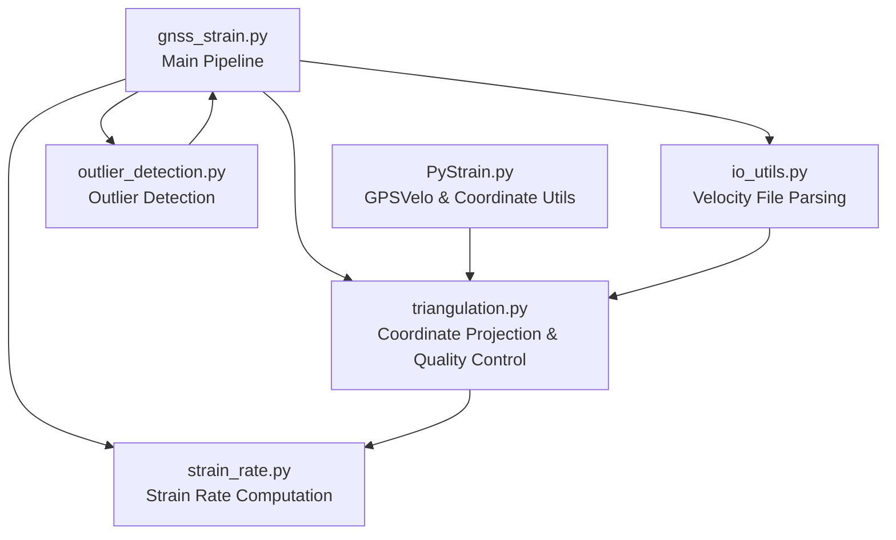
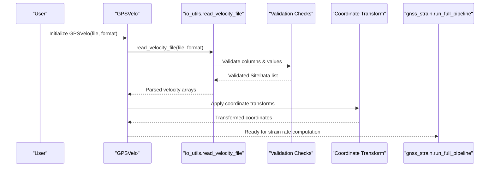
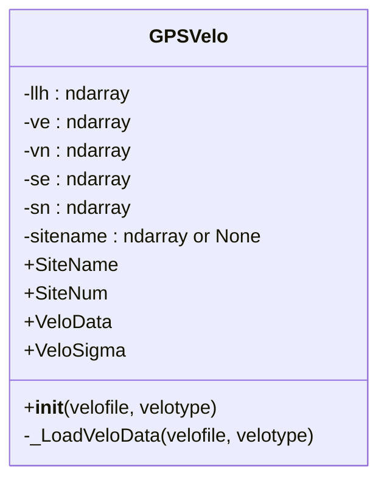
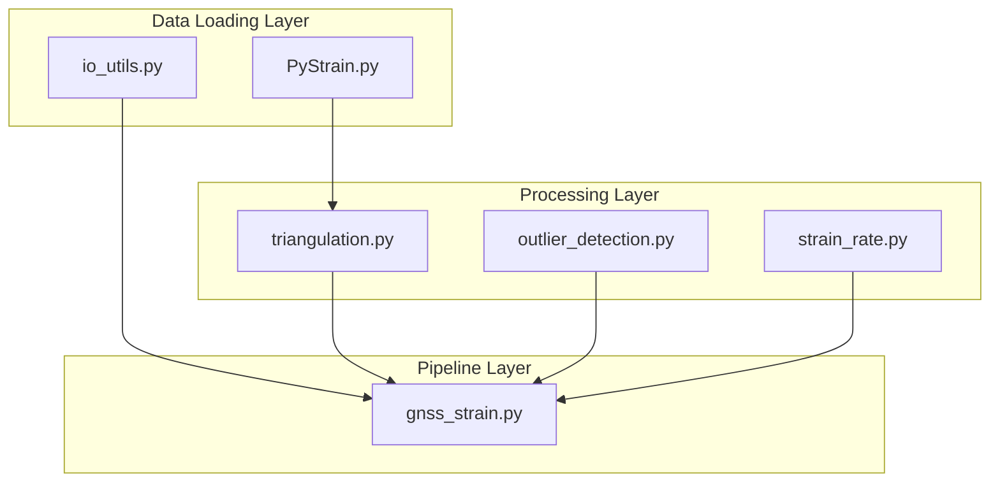

# GPS Data Validation and Loading

<cite>
**Referenced Files in This Document**
- [gnss_strain.py](file://src/pystrain/gnss_strain/gnss_strain.py)
- [io_utils.py](file://src/pystrain/gnss_strain/io_utils.py)
- [triangulation.py](file://src/pystrain/gnss_strain/triangulation.py)
- [outlier_detection.py](file://src/pystrain/gnss_strain/outlier_detection.py)
- [strain_rate.py](file://src/pystrain/gnss_strain/strain_rate.py)
- [PyStrain.py](file://src/pystrain/PyStrain.py)
- [cmonoc_eura.gmtvec](file://test/cmonoc_eura.gmtvec)
</cite>

## Table of Contents
1. [Introduction](#introduction)
2. [Project Structure](#project-structure)
3. [Core Components](#core-components)
4. [Architecture Overview](#architecture-overview)
5. [Detailed Component Analysis](#detailed-component-analysis)
6. [Dependency Analysis](#dependency-analysis)
7. [Performance Considerations](#performance-considerations)
8. [Troubleshooting Guide](#troubleshooting-guide)
9. [Conclusion](#conclusion)

## Introduction
This document provides comprehensive coverage of GPS data validation and loading mechanisms in PyStrain, focusing on the GPSVelo class functionality, support for GMT and GLOBK velocity file formats, coordinate system handling, and data integrity checks. It explains the data loading pipeline from raw GPS velocity files through validation to processed velocity arrays, details coordinate transformation methods including UTM projection and local coordinate systems, and documents quality assessment procedures for GPS data including missing value handling, data range validation, and consistency checks. Practical examples demonstrate loading different GPS velocity formats, handling coordinate conversions, and implementing custom data validation rules, along with common data format issues, error handling strategies, and data preprocessing workflows.

## Project Structure
The GPS data validation and loading functionality spans several modules within the PyStrain project:
- gnss_strain.py orchestrates the end-to-end workflow from velocity file loading to strain rate computation
- io_utils.py handles parsing of velocity files (GMT and GLOBK formats) and polygon boundaries
- triangulation.py manages coordinate projections (UTM) and quality control for triangulation
- outlier_detection.py implements robust outlier detection using KNN prescreening and residual-based IQR detection
- strain_rate.py computes strain rates from validated velocity data
- PyStrain.py contains legacy GPSVelo class and coordinate transformation utilities

**Diagram sources**
- [gnss_strain.py:92-129](file://src/pystrain/gnss_strain/gnss_strain.py#L92-L129)
- [io_utils.py:21-109](file://src/pystrain/gnss_strain/io_utils.py#L21-L109)
- [triangulation.py:89-146](file://src/pystrain/gnss_strain/triangulation.py#L89-L146)
- [outlier_detection.py:17-87](file://src/pystrain/gnss_strain/outlier_detection.py#L17-L87)
- [strain_rate.py:384-437](file://src/pystrain/gnss_strain/strain_rate.py#L384-L437)
- [PyStrain.py:248-318](file://src/pystrain/PyStrain.py#L248-L318)

**Section sources**
- [gnss_strain.py:92-129](file://src/pystrain/gnss_strain/gnss_strain.py#L92-L129)
- [io_utils.py:21-109](file://src/pystrain/gnss_strain/io_utils.py#L21-L109)
- [triangulation.py:89-146](file://src/pystrain/gnss_strain/triangulation.py#L89-L146)
- [outlier_detection.py:17-87](file://src/pystrain/gnss_strain/outlier_detection.py#L17-L87)
- [strain_rate.py:384-437](file://src/pystrain/gnss_strain/strain_rate.py#L384-L437)
- [PyStrain.py:248-318](file://src/pystrain/PyStrain.py#L248-L318)

## Core Components
This section focuses on the GPSVelo class and supporting utilities that handle GPS velocity data validation and loading.

### GPSVelo Class
The GPSVelo class encapsulates GPS velocity data loading and provides accessors for velocity components and uncertainties. It supports both GMT and GLOBK velocity file formats and includes basic validation via file existence checks.

Key capabilities:
- File validation and loading for GMT and GLOBK formats
- Accessor properties for site names, counts, velocity data, and uncertainties
- Support for optional site name extraction

Implementation highlights:
- Validates input file existence before loading
- Parses GMT 8-column format (longitude, latitude, east velocity, north velocity, east uncertainty, north uncertainty, correlation, site name)
- Parses GLOBK format with flexible column layouts
- Provides properties for accessing processed arrays

**Section sources**
- [PyStrain.py:248-318](file://src/pystrain/PyStrain.py#L248-L318)

### Coordinate Transformation Utilities
PyStrain provides multiple coordinate transformation methods essential for GPS data processing:

1. **Local Cartesian Coordinates**: Converts lat/lon to local XY coordinates using a polyconic projection approximation
2. **UTM Projection**: Implements Universal Transverse Mercator projection for precise coordinate transformations
3. **Legacy UTM Function**: Alternative UTM implementation using pyproj for comparison

These utilities enable proper spatial analysis and triangulation by converting geographic coordinates to projected coordinate systems suitable for geometric computations.

**Section sources**
- [PyStrain.py:52-95](file://src/pystrain/PyStrain.py#L52-L95)

## Architecture Overview
The GPS data validation and loading pipeline follows a structured workflow that ensures data integrity and prepares velocities for strain rate computation.

**Diagram sources**
- [PyStrain.py:248-318](file://src/pystrain/PyStrain.py#L248-L318)
- [io_utils.py:21-109](file://src/pystrain/gnss_strain/io_utils.py#L21-L109)
- [gnss_strain.py:92-129](file://src/pystrain/gnss_strain/gnss_strain.py#L92-L129)

## Detailed Component Analysis

### GPSVelo Class Implementation
The GPSVelo class serves as the primary interface for GPS velocity data handling in PyStrain.

**Diagram sources**
- [PyStrain.py:248-318](file://src/pystrain/PyStrain.py#L248-L318)

Key validation and processing steps:
1. **File Existence Check**: Ensures the input velocity file exists before processing
2. **Format-Specific Parsing**: Handles GMT 8-column and GLOBK formats differently
3. **Array Construction**: Creates numpy arrays for coordinates, velocities, and uncertainties
4. **Optional Site Names**: Extracts site identifiers when available

**Section sources**
- [PyStrain.py:248-318](file://src/pystrain/PyStrain.py#L248-L318)

### Velocity File Parsing and Validation
The io_utils module implements robust parsing for multiple velocity file formats with comprehensive validation.

Supported formats and parsing logic:
- **GMT 8-column format**: longitude latitude ve vn se sn correlation site_name
- **GLOBK format**: flexible column layout with velocity components and uncertainties
- **Auto-detection**: intelligent format selection based on column count and structure

Validation mechanisms:
- Column count verification for minimum required fields
- Numeric value validation with graceful skipping of invalid entries
- Flexible handling of comment lines and missing data
- Automatic site name extraction when present

**Section sources**
- [io_utils.py:21-109](file://src/pystrain/gnss_strain/io_utils.py#L21-L109)

### Coordinate System Handling
PyStrain implements multiple coordinate transformation approaches for different use cases:

#### UTM Projection Implementation
The triangulation module provides a complete UTM projection implementation with:
- WGS84 ellipsoid parameters
- Proper zone calculation based on longitude
- Accurate forward and inverse transformations
- Integration with numpy for vectorized operations

#### Local Coordinate Systems
The PyStrain module offers specialized local coordinate transformations:
- Polyconic projection approximation for regional analysis
- Custom origin-based coordinate systems
- Integration with existing triangulation workflows

**Section sources**
- [triangulation.py:22-77](file://src/pystrain/gnss_strain/triangulation.py#L22-L77)
- [PyStrain.py:52-95](file://src/pystrain/PyStrain.py#L52-L95)

### Quality Assessment and Data Integrity
The pipeline implements comprehensive quality assessment through multiple validation stages:

#### Outlier Detection Workflow
1. **KNN Prescreening**: Identifies potential outliers using local neighborhood statistics
2. **Residual-Based Detection**: Validates results against triangulation-based predictions
3. **Iterative Refinement**: Repeated passes to remove persistent outliers

#### Triangle Quality Control
- Minimum angle thresholds to prevent degenerate triangles
- Maximum edge length constraints to avoid unrealistic connections
- Area-based filtering to maintain mesh quality
- Polygon boundary enforcement for region-specific analysis

**Section sources**
- [outlier_detection.py:17-87](file://src/pystrain/gnss_strain/outlier_detection.py#L17-L87)
- [triangulation.py:89-146](file://src/pystrain/gnss_strain/triangulation.py#L89-L146)

## Dependency Analysis
The GPS data validation system exhibits well-structured dependencies that promote modularity and maintainability.

**Diagram sources**
- [gnss_strain.py:17-27](file://src/pystrain/gnss_strain/gnss_strain.py#L17-L27)
- [io_utils.py:15-18](file://src/pystrain/gnss_strain/io_utils.py#L15-L18)
- [triangulation.py:13-15](file://src/pystrain/gnss_strain/triangulation.py#L13-L15)
- [outlier_detection.py:9-10](file://src/pystrain/gnss_strain/outlier_detection.py#L9-L10)
- [strain_rate.py:8-11](file://src/pystrain/gnss_strain/strain_rate.py#L8-L11)

**Section sources**
- [gnss_strain.py:17-27](file://src/pystrain/gnss_strain/gnss_strain.py#L17-L27)
- [io_utils.py:15-18](file://src/pystrain/gnss_strain/io_utils.py#L15-L18)
- [triangulation.py:13-15](file://src/pystrain/gnss_strain/triangulation.py#L13-L15)
- [outlier_detection.py:9-10](file://src/pystrain/gnss_strain/outlier_detection.py#L9-L10)
- [strain_rate.py:8-11](file://src/pystrain/gnss_strain/strain_rate.py#L8-L11)

## Performance Considerations
Several optimization strategies enhance the efficiency of GPS data processing:

### Vectorized Operations
- NumPy-based array operations minimize Python loop overhead
- Vectorized coordinate transformations reduce computational complexity
- Batch processing of triangle quality checks improves throughput

### Memory Management
- Progressive data filtering reduces memory footprint during processing
- Efficient array construction minimizes temporary object creation
- Streaming file parsing prevents loading entire datasets into memory

### Computational Efficiency
- KDTree-based nearest neighbor searches optimize local analysis
- Early termination conditions prevent unnecessary computations
- Adaptive thresholding adjusts sensitivity based on data characteristics

## Troubleshooting Guide

### Common Data Format Issues
**GMT Format Problems**:
- Verify 8-column structure with numeric values
- Check for proper comment line handling
- Ensure correlation values are included when using 8-column format

**GLOBK Format Issues**:
- Confirm flexible column layout matches expected structure
- Validate velocity component ordering (ve, vn positions)
- Check uncertainty column alignment

**Coordinate System Confusion**:
- Verify UTM zone calculations match data extent
- Ensure consistent coordinate reference systems
- Check for datum mismatches between datasets

### Error Handling Strategies
The system implements multiple error handling approaches:

1. **Graceful Degradation**: Invalid lines are skipped rather than causing failures
2. **Validation Feedback**: Comprehensive logging of data quality issues
3. **Robust Parsing**: Flexible format detection accommodates variations
4. **Exception Management**: Clear error messages for critical failures

### Data Preprocessing Workflows
Recommended preprocessing steps:
1. **Quality Assessment**: Initial inspection of data ranges and distributions
2. **Format Standardization**: Convert heterogeneous formats to unified structure
3. **Missing Value Imputation**: Handle gaps in velocity measurements
4. **Coordinate System Alignment**: Ensure consistent reference frames

**Section sources**
- [io_utils.py:21-109](file://src/pystrain/gnss_strain/io_utils.py#L21-L109)
- [PyStrain.py:248-318](file://src/pystrain/PyStrain.py#L248-L318)

## Conclusion
The GPS data validation and loading mechanisms in PyStrain provide a robust foundation for GPS velocity analysis and strain rate computation. The system's modular architecture, comprehensive validation procedures, and flexible coordinate handling enable reliable processing of diverse GPS datasets. Key strengths include automatic format detection, comprehensive quality assessment, and efficient computational workflows. The implementation demonstrates best practices in scientific data processing while maintaining accessibility for users with varying technical backgrounds.