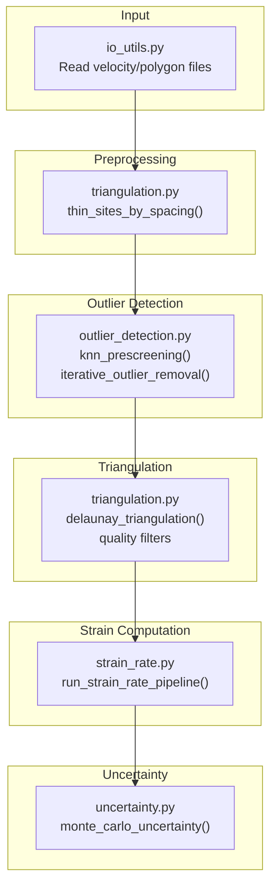
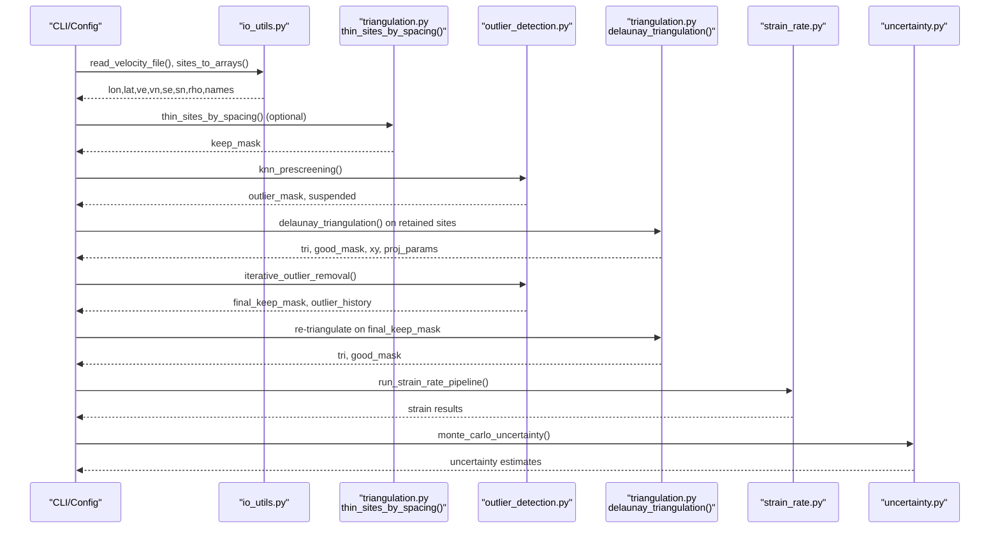
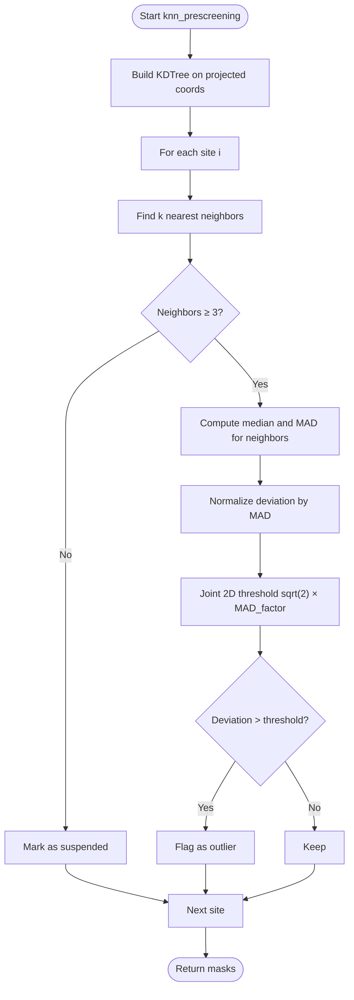
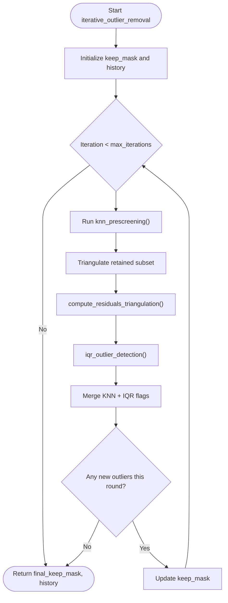
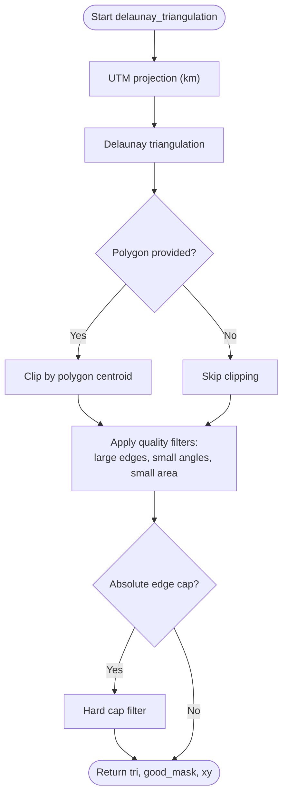
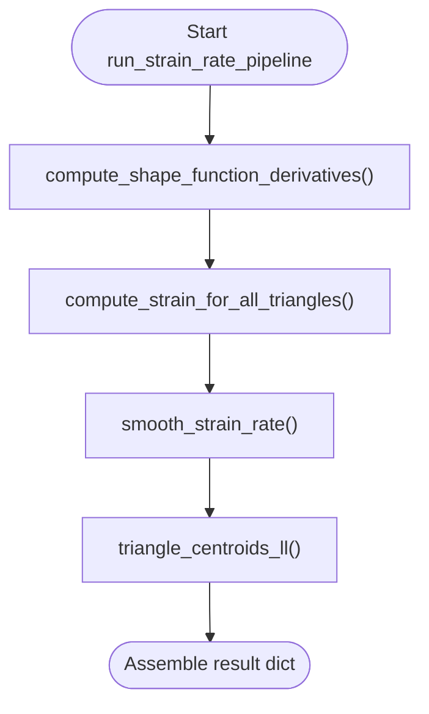
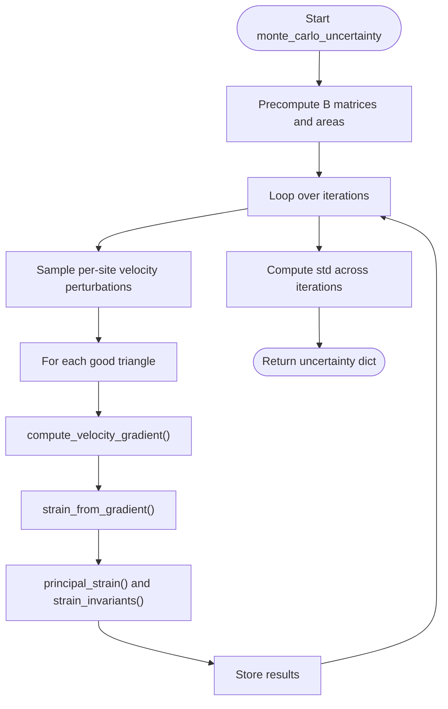
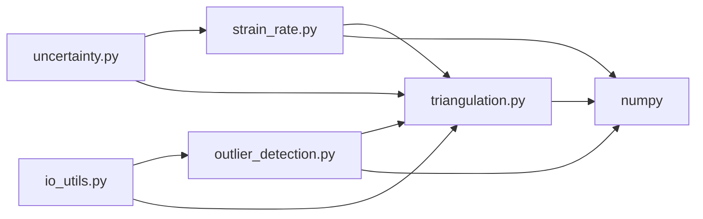

# Outlier Detection Algorithms

<cite>
**Referenced Files in This Document**
- [outlier_detection.py](file://src/pystrain/gnss_strain/outlier_detection.py)
- [gnss_strain.py](file://src/pystrain/gnss_strain/gnss_strain.py)
- [triangulation.py](file://src/pystrain/gnss_strain/triangulation.py)
- [strain_rate.py](file://src/pystrain/gnss_strain/strain_rate.py)
- [config_default.yaml](file://src/pystrain/gnss_strain/config_default.yaml)
- [config.py](file://src/pystrain/gnss_strain/config.py)
- [io_utils.py](file://src/pystrain/gnss_strain/io_utils.py)
- [uncertainty.py](file://src/pystrain/gnss_strain/uncertainty.py)
</cite>

## Table of Contents
1. [Introduction](#introduction)
2. [Project Structure](#project-structure)
3. [Core Components](#core-components)
4. [Architecture Overview](#architecture-overview)
5. [Detailed Component Analysis](#detailed-component-analysis)
6. [Dependency Analysis](#dependency-analysis)
7. [Performance Considerations](#performance-considerations)
8. [Troubleshooting Guide](#troubleshooting-guide)
9. [Conclusion](#conclusion)
10. [Appendices](#appendices)

## Introduction
This document explains PyStrain’s GPS velocity-based outlier detection workflow and its integration into the strain-rate estimation pipeline. It covers:
- Statistical methods for detecting outliers in GPS velocity data (distance-based filtering, azimuth distribution checks, residual-based detection)
- Quality control measures (minimum site requirements, spatial distribution checks, data consistency validation)
- How outlier detection integrates with triangulation and strain computation
- Practical configuration, interpretation, and decision-making guidance
- The relationship between outlier detection and strain-rate estimation accuracy

## Project Structure
The outlier detection module is part of the GNSS strain computation package. Key modules:
- Outlier detection: identifies suspicious GPS velocity observations
- Triangulation: constructs a quality-controlled Delaunay mesh
- Strain computation: derives strain rates from the mesh and velocities
- Uncertainty propagation: estimates uncertainties via Monte Carlo sampling
- Configuration: YAML-based parameterization with CLI overrides

**Diagram sources**
- [io_utils.py:21-132](file://src/pystrain/gnss_strain/io_utils.py#L21-L132)
- [triangulation.py:442-476](file://src/pystrain/gnss_strain/triangulation.py#L442-L476)
- [outlier_detection.py:17-87](file://src/pystrain/gnss_strain/outlier_detection.py#L17-L87)
- [outlier_detection.py:184-291](file://src/pystrain/gnss_strain/outlier_detection.py#L184-L291)
- [triangulation.py:89-146](file://src/pystrain/gnss_strain/triangulation.py#L89-L146)
- [strain_rate.py:384-437](file://src/pystrain/gnss_strain/strain_rate.py#L384-L437)
- [uncertainty.py:14-149](file://src/pystrain/gnss_strain/uncertainty.py#L14-L149)

**Section sources**
- [gnss_strain.py:92-341](file://src/pystrain/gnss_strain/gnss_strain.py#L92-L341)
- [config_default.yaml:18-68](file://src/pystrain/gnss_strain/config_default.yaml#L18-L68)

## Core Components
- KNN prescreening: robust single-site screening using local velocity neighbors and Median Absolute Deviation (MAD)
- Residual-based IQR detection: iteratively flags sites whose velocities are inconsistent with local neighbors on the triangulation
- Iterative removal: cycles between prescreening, triangulation, and residual checks until convergence
- Triangulation quality control: angle, edge length, and area thresholds to avoid degenerate triangles
- Strain computation and uncertainty: runs on the cleaned dataset to produce strain-rate maps and uncertainties

Key parameters:
- k_neighbors, mad_factor, iqr_factor, max_iterations
- min_angle_deg, max_edge_pctl, max_edge_factor, min_spacing_km, max_edge_km

**Section sources**
- [outlier_detection.py:17-87](file://src/pystrain/gnss_strain/outlier_detection.py#L17-L87)
- [outlier_detection.py:94-177](file://src/pystrain/gnss_strain/outlier_detection.py#L94-L177)
- [outlier_detection.py:184-291](file://src/pystrain/gnss_strain/outlier_detection.py#L184-L291)
- [triangulation.py:89-146](file://src/pystrain/gnss_strain/triangulation.py#L89-L146)
- [config_default.yaml:18-68](file://src/pystrain/gnss_strain/config_default.yaml#L18-L68)

## Architecture Overview
The end-to-end workflow connects data ingestion, preprocessing, outlier detection, triangulation, strain computation, and uncertainty propagation.

**Diagram sources**
- [gnss_strain.py:92-341](file://src/pystrain/gnss_strain/gnss_strain.py#L92-L341)
- [io_utils.py:21-132](file://src/pystrain/gnss_strain/io_utils.py#L21-L132)
- [triangulation.py:442-476](file://src/pystrain/gnss_strain/triangulation.py#L442-L476)
- [outlier_detection.py:17-87](file://src/pystrain/gnss_strain/outlier_detection.py#L17-L87)
- [outlier_detection.py:184-291](file://src/pystrain/gnss_strain/outlier_detection.py#L184-L291)
- [triangulation.py:89-146](file://src/pystrain/gnss_strain/triangulation.py#L89-L146)
- [strain_rate.py:384-437](file://src/pystrain/gnss_strain/strain_rate.py#L384-L437)
- [uncertainty.py:14-149](file://src/pystrain/gnss_strain/uncertainty.py#L14-L149)

## Detailed Component Analysis

### KNN Prescreening (MAD-based)
Purpose: Flag likely outliers at the single-site level using local neighborhood comparisons.
Method:
- Build a spatial KDTree in projected coordinates
- For each site, select k nearest neighbors (excluding itself)
- Compute median velocity and MAD along E/N components
- Flag outliers if normalized deviation exceeds a 2D joint threshold

**Diagram sources**
- [outlier_detection.py:17-87](file://src/pystrain/gnss_strain/outlier_detection.py#L17-L87)

**Section sources**
- [outlier_detection.py:17-87](file://src/pystrain/gnss_strain/outlier_detection.py#L17-L87)

### Residual-Based IQR Detection (Iterative)
Purpose: Detect inconsistencies between observed and locally predicted velocities on the triangulation.
Method:
- For each site, collect all triangles containing it and define neighbors as the other two vertices
- Predict velocity as the median of neighbor velocities
- Compute residual norm and flag outliers using IQR of norms with a configurable factor
- Repeat until convergence, merging KNN and residual-based flags

**Diagram sources**
- [outlier_detection.py:184-291](file://src/pystrain/gnss_strain/outlier_detection.py#L184-L291)
- [outlier_detection.py:94-177](file://src/pystrain/gnss_strain/outlier_detection.py#L94-L177)

**Section sources**
- [outlier_detection.py:94-177](file://src/pystrain/gnss_strain/outlier_detection.py#L94-L177)
- [outlier_detection.py:184-291](file://src/pystrain/gnss_strain/outlier_detection.py#L184-L291)

### Triangulation Quality Control
Purpose: Prevent degenerate triangles from corrupting strain estimation.
Filters:
- Minimum angle threshold
- Maximum edge length percentile × factor
- Optional absolute edge length cap
- Minimum area threshold for stability

**Diagram sources**
- [triangulation.py:89-146](file://src/pystrain/gnss_strain/triangulation.py#L89-L146)
- [triangulation.py:170-256](file://src/pystrain/gnss_strain/triangulation.py#L170-L256)

**Section sources**
- [triangulation.py:89-146](file://src/pystrain/gnss_strain/triangulation.py#L89-L146)
- [triangulation.py:170-256](file://src/pystrain/gnss_strain/triangulation.py#L170-L256)

### Strain Computation Pipeline
Purpose: Derive strain rates from the triangulated velocity field.
Steps:
- Compute shape function derivatives on good triangles
- Evaluate velocity gradients and strain tensors
- Principal strain and orientations
- Smoothing and interpolation to sites
- Output statistics and figures

**Diagram sources**
- [strain_rate.py:384-437](file://src/pystrain/gnss_strain/strain_rate.py#L384-L437)
- [strain_rate.py:126-198](file://src/pystrain/gnss_strain/strain_rate.py#L126-L198)
- [strain_rate.py:205-271](file://src/pystrain/gnss_strain/strain_rate.py#L205-L271)
- [strain_rate.py:411-432](file://src/pystrain/gnss_strain/strain_rate.py#L411-L432)

**Section sources**
- [strain_rate.py:126-198](file://src/pystrain/gnss_strain/strain_rate.py#L126-L198)
- [strain_rate.py:205-271](file://src/pystrain/gnss_strain/strain_rate.py#L205-L271)
- [strain_rate.py:384-437](file://src/pystrain/gnss_strain/strain_rate.py#L384-L437)

### Uncertainty Propagation (Monte Carlo)
Purpose: Estimate uncertainties by perturbing velocities according to their covariance.
Method:
- Precompute Cholesky decompositions of per-site covariances
- Sample perturbed velocities and compute strain rates across iterations
- Aggregate standard deviations for derived quantities

**Diagram sources**
- [uncertainty.py:14-149](file://src/pystrain/gnss_strain/uncertainty.py#L14-L149)
- [strain_rate.py:18-57](file://src/pystrain/gnss_strain/strain_rate.py#L18-L57)
- [strain_rate.py:60-119](file://src/pystrain/gnss_strain/strain_rate.py#L60-L119)

**Section sources**
- [uncertainty.py:14-149](file://src/pystrain/gnss_strain/uncertainty.py#L14-L149)

## Dependency Analysis
- Outlier detection depends on:
  - Spatial indexing (KDTree) for neighbor queries
  - Triangulation for residual computation and IQR detection
- Triangulation depends on:
  - Projection utilities and geometric predicates
  - Quality filters to ensure numerical stability
- Strain computation depends on:
  - Shape function derivatives and adjacency graph
  - Smoothing and interpolation routines
- Uncertainty depends on:
  - Stable triangulation and strain computation results

**Diagram sources**
- [outlier_detection.py:9-10](file://src/pystrain/gnss_strain/outlier_detection.py#L9-L10)
- [triangulation.py:13-15](file://src/pystrain/gnss_strain/triangulation.py#L13-L15)
- [strain_rate.py:8-11](file://src/pystrain/gnss_strain/strain_rate.py#L8-L11)
- [uncertainty.py:8-11](file://src/pystrain/gnss_strain/uncertainty.py#L8-L11)
- [io_utils.py:15-16](file://src/pystrain/gnss_strain/io_utils.py#L15-L16)

**Section sources**
- [gnss_strain.py:17-27](file://src/pystrain/gnss_strain/gnss_strain.py#L17-L27)

## Performance Considerations
- KNN queries: KDTree scales poorly with very large datasets; consider spatial thinning or limiting k_neighbors
- Triangulation: large numbers of sites increase Delaunay complexity; use min_spacing_km to reduce density
- Iterative outlier removal: convergence depends on data characteristics; cap max_iterations to avoid long runs
- Monte Carlo: increase n_iterations for stability; consider parallelization of independent triangles if extending

[No sources needed since this section provides general guidance]

## Troubleshooting Guide
Common issues and resolutions:
- Not enough valid triangles after quality control:
  - Relax min_angle_deg or increase max_edge_pctl
  - Enable min_spacing_km to reduce clustering
  - Consider max_edge_km hard cap if unrealistic connections persist
- Excessive outlier removal:
  - Increase mad_factor or iqr_factor to be less strict
  - Reduce k_neighbors for more conservative local comparisons
- Convergence stalls early:
  - Verify max_iterations is sufficient
  - Check for persistent boundary effects or sparse regions
- Poor uncertainty estimates:
  - Ensure adequate number of good triangles
  - Increase mc_iterations for stable statistics

Practical checks:
- Inspect the outlier history and reasons recorded during iterative removal
- Review final triangulation quality metrics (good triangle counts)
- Validate station coverage and spatial distribution

**Section sources**
- [gnss_strain.py:166-167](file://src/pystrain/gnss_strain/gnss_strain.py#L166-L167)
- [gnss_strain.py:203-206](file://src/pystrain/gnss_strain/gnss_strain.py#L203-L206)
- [config.py:157-194](file://src/pystrain/gnss_strain/config.py#L157-L194)

## Conclusion
PyStrain’s outlier detection combines robust single-site screening with residual-based checks on a quality-controlled triangulation. This hybrid approach improves the reliability of strain-rate estimates by removing gross inconsistencies while preserving legitimate spatial variability. Proper configuration of thresholds and quality controls ensures stable triangulations and accurate uncertainty quantification.

[No sources needed since this section summarizes without analyzing specific files]

## Appendices

### Configuration Reference
Key parameters and their roles:
- Outlier detection
  - k_neighbors: Number of neighbors for local comparison
  - mad_factor: Threshold multiplier for MAD-based prescreening
  - iqr_factor: Threshold multiplier for residual IQR detection
  - max_iterations: Maximum rounds of iterative removal
- Triangulation
  - min_angle_deg: Minimum interior angle for triangle quality
  - max_edge_pctl: Percentile for edge-length threshold
  - max_edge_factor: Factor applied to percentile threshold
  - min_spacing_km: Spatial thinning to reduce density
  - max_edge_km: Absolute cap on triangle edge length
- Uncertainty
  - mc_iterations: Monte Carlo sampling for uncertainty propagation

**Section sources**
- [config_default.yaml:18-68](file://src/pystrain/gnss_strain/config_default.yaml#L18-L68)
- [config.py:143-194](file://src/pystrain/gnss_strain/config.py#L143-L194)

### Practical Examples
- Configure outlier detection:
  - Adjust k_neighbors and mad_factor for local sensitivity vs robustness
  - Tune iqr_factor to balance inclusivity and strictness
- Interpret detection results:
  - Review outlier_history entries to understand reasons and iteration timing
  - Use residual magnitudes to assess severity
- Decision-making:
  - If many outliers cluster near boundaries, consider relaxing constraints
  - If outliers appear sporadic and residual-driven, retain stricter settings
- Relationship to strain accuracy:
  - Removing extreme outliers typically reduces noise and improves smoothness
  - Over-aggressive removal risks bias; validate with uncertainty maps

**Section sources**
- [gnss_strain.py:169-201](file://src/pystrain/gnss_strain/gnss_strain.py#L169-L201)
- [outlier_detection.py:270-285](file://src/pystrain/gnss_strain/outlier_detection.py#L270-L285)