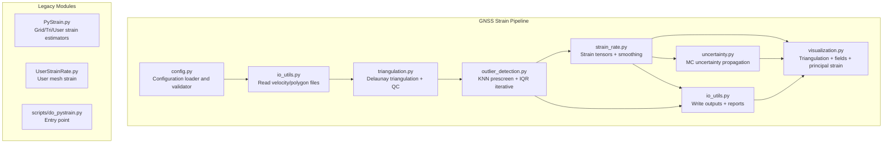
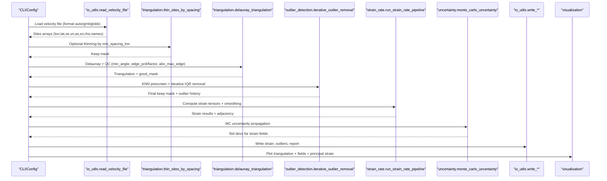
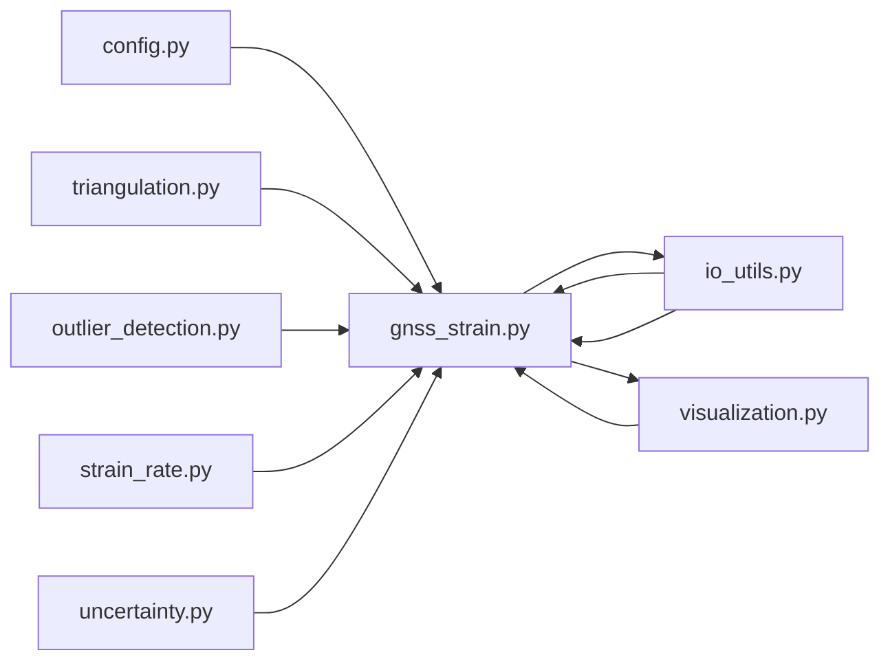

# Quality Assessment and Diagnostic Metrics

<cite>
**Referenced Files in This Document**
- [README.md](file://README.md)
- [config_default.yaml](file://src/pystrain/gnss_strain/config_default.yaml)
- [config.py](file://src/pystrain/gnss_strain/config.py)
- [gnss_strain.py](file://src/pystrain/gnss_strain/gnss_strain.py)
- [outlier_detection.py](file://src/pystrain/gnss_strain/outlier_detection.py)
- [uncertainty.py](file://src/pystrain/gnss_strain/uncertainty.py)
- [io_utils.py](file://src/pystrain/gnss_strain/io_utils.py)
- [triangulation.py](file://src/pystrain/gnss_strain/triangulation.py)
- [strain_rate.py](file://src/pystrain/gnss_strain/strain_rate.py)
- [visualization.py](file://src/pystrain/gnss_strain/visualization.py)
- [do_pystrain.py](file://src/pystrain/scripts/do_pystrain.py)
- [config.yaml](file://test/config.yaml)
- [PyStrain.py](file://src/pystrain/PyStrain.py)
- [UserStrainRate.py](file://src/pystrain/UserStrainRate.py)
</cite>

## Table of Contents
1. [Introduction](#introduction)
2. [Project Structure](#project-structure)
3. [Core Components](#core-components)
4. [Architecture Overview](#architecture-overview)
5. [Detailed Component Analysis](#detailed-component-analysis)
6. [Dependency Analysis](#dependency-analysis)
7. [Performance Considerations](#performance-considerations)
8. [Troubleshooting Guide](#troubleshooting-guide)
9. [Conclusion](#conclusion)
10. [Appendices](#appendices)

## Introduction
This document describes the quality assessment and diagnostic metrics used in PyStrain’s GNSS velocity-to-strain-rate data processing pipeline. It covers spatial distribution metrics, data completeness measures, statistical validation tests, and diagnostic procedures for evaluating GPS site quality, strain estimation reliability, and computational convergence. It also documents automated quality control checkpoints, manual inspection procedures, reporting mechanisms, and strategies for troubleshooting and correcting poor-quality results.

## Project Structure
The GNSS strain pipeline resides under src/pystrain/gnss_strain and integrates configuration management, input parsing, triangulation and mesh quality control, outlier detection, strain computation, uncertainty propagation, and visualization. Supporting modules in src/pystrain handle legacy grid-based strain estimation and user-defined mesh estimation.

**Diagram sources**
- [config.py:56-90](file://src/pystrain/gnss_strain/config.py#L56-L90)
- [io_utils.py:21-132](file://src/pystrain/gnss_strain/io_utils.py#L21-L132)
- [triangulation.py:89-146](file://src/pystrain/gnss_strain/triangulation.py#L89-L146)
- [outlier_detection.py:17-87](file://src/pystrain/gnss_strain/outlier_detection.py#L17-L87)
- [strain_rate.py:384-437](file://src/pystrain/gnss_strain/strain_rate.py#L384-L437)
- [uncertainty.py:14-149](file://src/pystrain/gnss_strain/uncertainty.py#L14-L149)
- [visualization.py:18-249](file://src/pystrain/gnss_strain/visualization.py#L18-L249)
- [PyStrain.py:517-800](file://src/pystrain/PyStrain.py#L517-L800)
- [UserStrainRate.py:1-126](file://src/pystrain/UserStrainRate.py#L1-L126)
- [do_pystrain.py:1-39](file://src/pystrain/scripts/do_pystrain.py#L1-L39)

**Section sources**
- [README.md:1-2](file://README.md#L1-L2)
- [config_default.yaml:1-69](file://src/pystrain/gnss_strain/config_default.yaml#L1-L69)
- [config.py:56-90](file://src/pystrain/gnss_strain/config.py#L56-L90)

## Core Components
- Configuration Management: Loads defaults, merges YAML, applies CLI overrides, validates ranges, prints effective config, and flattens to pipeline kwargs.
- Data Input/Output: Reads velocity files (GMT/GLOBK/auto), reads polygon boundaries, writes strain outputs, outlier lists, and summary reports.
- Triangulation and Mesh Quality Control: Projects coordinates, performs Delaunay triangulation, applies polygon clipping, and filters triangles by minimum angle, edge length percentiles, absolute edge length, and minimum area.
- Outlier Detection: Two-stage process—KNN prescreening using robust MAD against local median velocities, followed by iterative IQR detection on triangulation residuals.
- Strain Estimation: Computes velocity gradient per triangle, extracts strain invariants, derives principal strains and orientations, and applies spatial smoothing.
- Uncertainty Propagation: Monte Carlo sampling of velocity perturbations using per-site covariance to estimate standard deviations of derived strain fields.
- Visualization: Renders triangulation overlays, scalar fields (dilatation, max shear), and principal strain cross plots.

**Section sources**
- [config.py:18-50](file://src/pystrain/gnss_strain/config.py#L18-L50)
- [io_utils.py:21-132](file://src/pystrain/gnss_strain/io_utils.py#L21-L132)
- [triangulation.py:89-146](file://src/pystrain/gnss_strain/triangulation.py#L89-L146)
- [outlier_detection.py:17-87](file://src/pystrain/gnss_strain/outlier_detection.py#L17-L87)
- [strain_rate.py:18-120](file://src/pystrain/gnss_strain/strain_rate.py#L18-L120)
- [uncertainty.py:14-149](file://src/pystrain/gnss_strain/uncertainty.py#L14-L149)
- [visualization.py:18-249](file://src/pystrain/gnss_strain/visualization.py#L18-L249)

## Architecture Overview
The pipeline orchestrates data loading, preprocessing, triangulation, outlier detection, strain computation, uncertainty propagation, and output generation. Automated quality checks occur at each stage, with explicit thresholds and convergence criteria.

**Diagram sources**
- [gnss_strain.py:92-341](file://src/pystrain/gnss_strain/gnss_strain.py#L92-L341)
- [io_utils.py:21-132](file://src/pystrain/gnss_strain/io_utils.py#L21-L132)
- [triangulation.py:442-476](file://src/pystrain/gnss_strain/triangulation.py#L442-L476)
- [outlier_detection.py:184-291](file://src/pystrain/gnss_strain/outlier_detection.py#L184-L291)
- [strain_rate.py:384-437](file://src/pystrain/gnss_strain/strain_rate.py#L384-L437)
- [uncertainty.py:14-149](file://src/pystrain/gnss_strain/uncertainty.py#L14-L149)
- [visualization.py:18-249](file://src/pystrain/gnss_strain/visualization.py#L18-L249)

## Detailed Component Analysis

### Spatial Distribution Metrics
- Minimum triangle angle: Filters triangles with small internal angles indicative of near-degenerate geometry.
- Edge length percentiles and factors: Flags long edges via percentile-of-pairwise-distances multiplied by a factor; absolute edge length constraint further rejects overly long sides.
- Minimum triangle area: Removes degenerate or extremely small triangles using a percentile-based threshold.
- Polygon boundary clipping: Ensures triangles’ barycenters lie within the study region.
- Hanging sites detection: Identifies GPS sites not included in any valid triangle, indicating coverage gaps.

Practical interpretation:
- Low good-triangle ratios (< threshold) suggest overly strict QC or sparse data; relax min_angle or increase edge thresholds.
- High hanging site counts indicate insufficient density or poor geographic coverage; consider reducing min_spacing_km or adjusting polygon.

**Section sources**
- [triangulation.py:89-146](file://src/pystrain/gnss_strain/triangulation.py#L89-L146)
- [triangulation.py:170-256](file://src/pystrain/gnss_strain/triangulation.py#L170-L256)
- [triangulation.py:423-435](file://src/pystrain/gnss_strain/triangulation.py#L423-L435)

### Data Completeness Measures
- Input site count, removed count, and final used count are tracked and reported.
- Coverage completeness inferred from:
  - Number of valid triangles.
  - Fraction of sites retained after outlier removal.
  - Presence of hanging sites.

Reporting:
- Summary report includes input sites, removed sites, used sites, number of triangles, smoothing weight, MC iterations, min triangle angle, and edge percentile/factor.

**Section sources**
- [gnss_strain.py:269-279](file://src/pystrain/gnss_strain/gnss_strain.py#L269-L279)
- [io_utils.py:250-270](file://src/pystrain/gnss_strain/io_utils.py#L250-L270)

### Statistical Validation Tests
- KNN prescreening: Robust deviation from local velocity medians using MAD scaling; flags outliers based on a joint 2D deviation threshold.
- Residual-based IQR detection: Computes leave-one-neighbor prediction residuals per site and flags outliers exceeding a percentile-based threshold.
- Convergence diagnostics:
  - Iterative outlier removal stops when no new outliers are detected or when the dataset becomes too small.
  - Triangle QC convergence: If valid triangles fall below a minimum threshold, the pipeline raises an error advising relaxation of constraints.

Thresholds and controls:
- k_neighbors ≥ 3; mad_factor > 0; iqr_factor > 0; max_iterations ≥ 1.
- Configuration validation ensures min_angle ∈ (0, 60), max_edge_pctl ∈ (0, 100), max_edge_factor > 1.0, and mc_iterations ≥ 10.

**Section sources**
- [outlier_detection.py:17-87](file://src/pystrain/gnss_strain/outlier_detection.py#L17-L87)
- [outlier_detection.py:146-177](file://src/pystrain/gnss_strain/outlier_detection.py#L146-L177)
- [outlier_detection.py:184-291](file://src/pystrain/gnss_strain/outlier_detection.py#L184-L291)
- [gnss_strain.py:166-168](file://src/pystrain/gnss_strain/gnss_strain.py#L166-L168)
- [config.py:151-194](file://src/pystrain/gnss_strain/config.py#L151-L194)

### Diagnostic Procedures for GPS Site Quality and Strain Reliability
- GPS site quality:
  - Inspect velocity vectors and outliers flagged by KNN/IQR.
  - Review triangulation plot to identify isolated or poorly connected sites.
- Strain estimation reliability:
  - Examine scalar field plots (dilatation, max shear) and principal strain crosses.
  - Compare mean uncertainty values across triangles; high variability may indicate unstable interpolation or sparse coverage.
- Computational convergence:
  - Monitor the number of removed sites per iteration; convergence occurs when no new outliers are detected.
  - Verify sufficient valid triangles remain after QC; otherwise, relax constraints.

Manual inspection:
- Use generated figures to visually assess:
  - Triangulation coverage and quality.
  - Scalar field distributions.
  - Principal strain orientation and magnitude.

**Section sources**
- [visualization.py:18-249](file://src/pystrain/gnss_strain/visualization.py#L18-L249)
- [gnss_strain.py:287-318](file://src/pystrain/gnss_strain/gnss_strain.py#L287-L318)

### Automated Quality Control Checkpoints
- Configuration validation: Enforces parameter bounds and types.
- Data format detection: Auto-detection of GMT/GLOBK formats with fallback handling.
- Mesh quality filters: Min angle, edge percentile/factor, absolute edge length, and minimum area.
- Outlier detection stages: Pre-filtering and iterative refinement.
- Output validation: Ensures non-empty results and writes diagnostic reports.

**Section sources**
- [config.py:143-194](file://src/pystrain/gnss_strain/config.py#L143-L194)
- [io_utils.py:21-132](file://src/pystrain/gnss_strain/io_utils.py#L21-L132)
- [triangulation.py:89-146](file://src/pystrain/gnss_strain/triangulation.py#L89-L146)
- [outlier_detection.py:184-291](file://src/pystrain/gnss_strain/outlier_detection.py#L184-L291)
- [gnss_strain.py:266-279](file://src/pystrain/gnss_strain/gnss_strain.py#L266-L279)

### Practical Examples: Interpreting Metrics, Thresholds, and Decisions
- Example: Sparse dataset yields low good-triangle ratio.
  - Action: Reduce min_angle_deg, lower max_edge_pctl or max_edge_factor, or disable absolute edge length limit temporarily.
- Example: Many KNN outliers detected.
  - Action: Increase mad_factor or k_neighbors to be more conservative; inspect flagged sites on triangulation plot.
- Example: Persistent IQR outliers despite relaxation.
  - Action: Investigate spatial clustering of outliers; consider revisiting polygon or removing problematic regions.
- Example: High uncertainty in strain fields.
  - Action: Increase mc_iterations; ensure adequate triangle density; reduce smoothing weight if over-smoothing dominates variance.

Decision-making:
- Use the summary report to track input vs. used sites and triangle counts.
- Use outlier history to identify systematic issues (e.g., repeated removal of sites in a region).

**Section sources**
- [gnss_strain.py:269-279](file://src/pystrain/gnss_strain/gnss_strain.py#L269-L279)
- [io_utils.py:232-248](file://src/pystrain/gnss_strain/io_utils.py#L232-L248)

### Quality Reporting Mechanisms and Result Validation Strategies
- Output files:
  - strain_triangles.dat: Contains triangle-level strain fields and optional standard deviations.
  - outliers.txt: Records removed sites with reasons and residuals.
  - report.txt: Summarizes counts and configuration parameters used.
- Validation:
  - Confirm non-empty outputs and presence of required fields.
  - Cross-check scalar field plots for plausibility and absence of artifacts.

**Section sources**
- [io_utils.py:186-248](file://src/pystrain/gnss_strain/io_utils.py#L186-L248)
- [gnss_strain.py:266-279](file://src/pystrain/gnss_strain/gnss_strain.py#L266-L279)

### Troubleshooting Poor Quality Results and Corrective Actions
Common issues and remedies:
- No valid triangles after QC:
  - Relax min_angle_deg, reduce max_edge_pctl or max_edge_factor, or remove absolute edge length limit.
- Too few sites retained:
  - Lower mad_factor or iqr_factor; adjust k_neighbors; consider polygon expansion.
- Unstable strain fields:
  - Increase mc_iterations; moderate smoothing_weight; ensure sufficient triangle density.
- Biased principal strain orientations:
  - Reassess polygon and boundary; check for uneven site distribution.

**Section sources**
- [gnss_strain.py:166-168](file://src/pystrain/gnss_strain/gnss_strain.py#L166-L168)
- [triangulation.py:170-256](file://src/pystrain/gnss_strain/triangulation.py#L170-L256)
- [strain_rate.py:205-271](file://src/pystrain/gnss_strain/strain_rate.py#L205-L271)

## Dependency Analysis
The pipeline exhibits clear module separation with explicit dependencies among core modules.

**Diagram sources**
- [gnss_strain.py:17-27](file://src/pystrain/gnss_strain/gnss_strain.py#L17-L27)
- [config.py:56-90](file://src/pystrain/gnss_strain/config.py#L56-L90)

**Section sources**
- [gnss_strain.py:17-27](file://src/pystrain/gnss_strain/gnss_strain.py#L17-L27)

## Performance Considerations
- Monte Carlo uncertainty scales with mc_iterations; larger values improve stability at higher computational cost.
- Triangle QC involves pairwise distance computations; sampling strategies are used for efficiency.
- Smoothing iterations trade off accuracy for spatial coherence; moderate weights and iterations are recommended.

[No sources needed since this section provides general guidance]

## Troubleshooting Guide
- Configuration errors:
  - Validate parameter ranges; fix out-of-bounds values for min_angle_deg, max_edge_pctl, max_edge_factor, mc_iterations, etc.
- Data loading issues:
  - Ensure velocity file format compatibility; use explicit format selection if auto-detection fails.
- Insufficient triangles:
  - Relax QC thresholds or expand polygon; verify site density and distribution.
- Excessive outliers:
  - Adjust MAD/IQR thresholds and KNN parameters; inspect spatial patterns.
- Visualization anomalies:
  - Check projection and plotting ranges; re-run with saved figures.

**Section sources**
- [config.py:143-194](file://src/pystrain/gnss_strain/config.py#L143-L194)
- [io_utils.py:21-132](file://src/pystrain/gnss_strain/io_utils.py#L21-L132)
- [gnss_strain.py:166-168](file://src/pystrain/gnss_strain/gnss_strain.py#L166-L168)

## Conclusion
PyStrain’s pipeline integrates robust spatial quality metrics, statistical outlier detection, and uncertainty quantification to produce reliable strain-rate estimates. Automated checkpoints and diagnostic outputs enable efficient troubleshooting and informed data inclusion decisions. By tuning QC parameters and validating outputs through visual inspection, users can achieve trustworthy strain-rate maps suitable for geodynamic studies.

[No sources needed since this section summarizes without analyzing specific files]

## Appendices

### Appendix A: Configuration Reference
Key parameters controlling quality:
- Outlier detection: k_neighbors, mad_factor, iqr_factor, max_iterations.
- Triangulation: min_angle_deg, max_edge_pctl, max_edge_factor, min_spacing_km, max_edge_km.
- Smoothing: weight, iterations.
- Uncertainty: mc_iterations.
- Visualization: dpi, save_figures, show_figures.

**Section sources**
- [config_default.yaml:18-69](file://src/pystrain/gnss_strain/config_default.yaml#L18-L69)
- [config.py:18-50](file://src/pystrain/gnss_strain/config.py#L18-L50)

### Appendix B: Legacy Grid-Based Strain Estimation
Legacy modules support grid-based and triangular mesh strain estimation with additional checks such as azimuth distribution and minimum site counts. These modules complement the modern pipeline and provide alternative workflows.

**Section sources**
- [PyStrain.py:517-800](file://src/pystrain/PyStrain.py#L517-L800)
- [UserStrainRate.py:1-126](file://src/pystrain/UserStrainRate.py#L1-L126)
- [do_pystrain.py:1-39](file://src/pystrain/scripts/do_pystrain.py#L1-L39)
- [config.yaml:1-123](file://test/config.yaml#L1-L123)