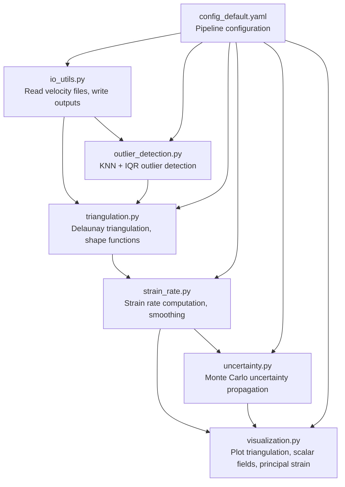
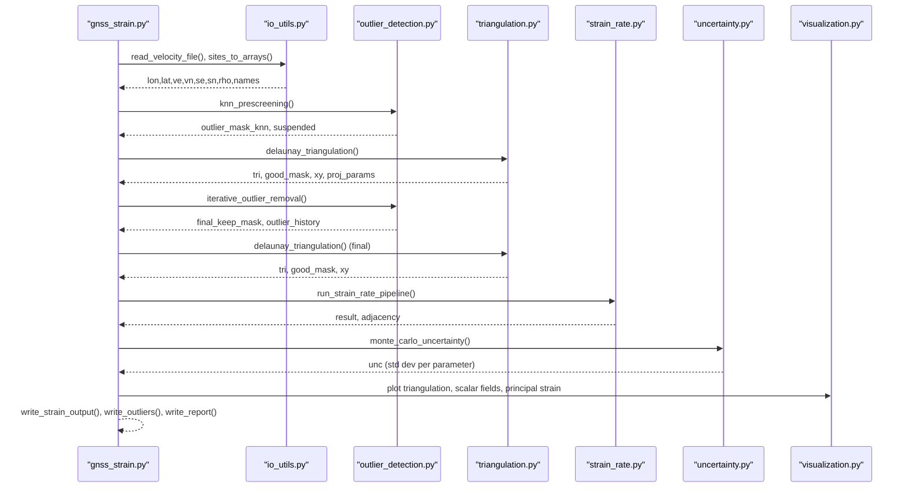
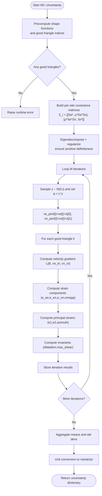
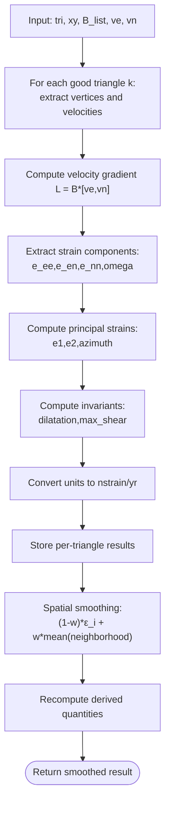
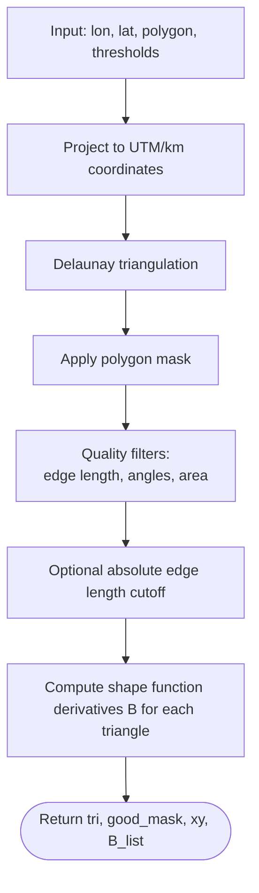
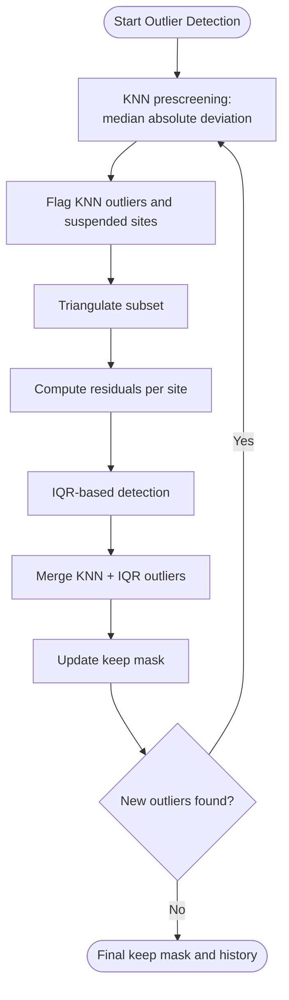
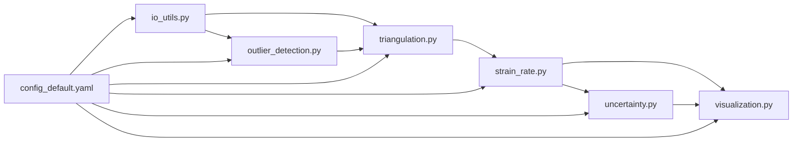

# Uncertainty Quantification and Error Analysis

<cite>
**Referenced Files in This Document**
- [uncertainty.py](file://src/pystrain/gnss_strain/uncertainty.py)
- [strain_rate.py](file://src/pystrain/gnss_strain/strain_rate.py)
- [gnss_strain.py](file://src/pystrain/gnss_strain/gnss_strain.py)
- [triangulation.py](file://src/pystrain/gnss_strain/triangulation.py)
- [io_utils.py](file://src/pystrain/gnss_strain/io_utils.py)
- [outlier_detection.py](file://src/pystrain/gnss_strain/outlier_detection.py)
- [visualization.py](file://src/pystrain/gnss_strain/visualization.py)
- [config_default.yaml](file://src/pystrain/gnss_strain/config_default.yaml)
- [PyStrain.py](file://src/pystrain/PyStrain.py)
</cite>

## Table of Contents
1. [Introduction](#introduction)
2. [Project Structure](#project-structure)
3. [Core Components](#core-components)
4. [Architecture Overview](#architecture-overview)
5. [Detailed Component Analysis](#detailed-component-analysis)
6. [Dependency Analysis](#dependency-analysis)
7. [Performance Considerations](#performance-considerations)
8. [Troubleshooting Guide](#troubleshooting-guide)
9. [Conclusion](#conclusion)

## Introduction
This document provides comprehensive coverage of uncertainty quantification and error analysis in PyStrain's strain computation framework. It explains how GPS velocity uncertainties propagate through strain rate calculations, documents the Monte Carlo-based uncertainty estimation, and details the implementation of weighted least squares estimation with measurement uncertainties and spatial correlation effects. The guide also covers uncertainty quantification for derived strain parameters (strain rate tensors, rotation rates, and principal strain directions), practical configuration examples, interpretation of uncertainty estimates, and quality assessment criteria for strain rate computations.

## Project Structure
The uncertainty quantification pipeline integrates several modules:
- Input parsing and data loading with uncertainty metadata
- Triangulation and shape function computation
- Strain rate computation and smoothing
- Monte Carlo uncertainty propagation
- Output writing and visualization

**Diagram sources**
- [io_utils.py:21-132](file://src/pystrain/gnss_strain/io_utils.py#L21-L132)
- [triangulation.py:89-146](file://src/pystrain/gnss_strain/triangulation.py#L89-L146)
- [strain_rate.py:126-437](file://src/pystrain/gnss_strain/strain_rate.py#L126-L437)
- [uncertainty.py:14-149](file://src/pystrain/gnss_strain/uncertainty.py#L14-L149)
- [outlier_detection.py:17-291](file://src/pystrain/gnss_strain/outlier_detection.py#L17-L291)
- [visualization.py:18-249](file://src/pystrain/gnss_strain/visualization.py#L18-L249)
- [config_default.yaml:1-69](file://src/pystrain/gnss_strain/config_default.yaml#L1-L69)

**Section sources**
- [io_utils.py:21-132](file://src/pystrain/gnss_strain/io_utils.py#L21-L132)
- [triangulation.py:89-146](file://src/pystrain/gnss_strain/triangulation.py#L89-L146)
- [strain_rate.py:126-437](file://src/pystrain/gnss_strain/strain_rate.py#L126-L437)
- [uncertainty.py:14-149](file://src/pystrain/gnss_strain/uncertainty.py#L14-L149)
- [outlier_detection.py:17-291](file://src/pystrain/gnss_strain/outlier_detection.py#L17-L291)
- [visualization.py:18-249](file://src/pystrain/gnss_strain/visualization.py#L18-L249)
- [config_default.yaml:1-69](file://src/pystrain/gnss_strain/config_default.yaml#L1-L69)

## Core Components
- Monte Carlo uncertainty propagation: Generates perturbed velocity fields using site-wise covariance matrices and computes strain rate statistics across iterations.
- Strain rate computation: Computes velocity gradient tensors, strain rate components, rotation rates, and derived quantities (principal strains, invariants).
- Triangulation and shape functions: Builds Delaunay triangulation, computes shape function derivatives, and constructs neighborhood relationships.
- Outlier detection: Uses KNN prescreening and residual-based IQR detection to improve robustness.
- Visualization: Plots triangulation, scalar fields, and principal strain cross diagrams.

Key implementation references:
- Monte Carlo uncertainty propagation: [monte_carlo_uncertainty:14-149](file://src/pystrain/gnss_strain/uncertainty.py#L14-L149)
- Strain rate computation: [compute_velocity_gradient:18-41](file://src/pystrain/gnss_strain/strain_rate.py#L18-L41), [strain_from_gradient:44-57](file://src/pystrain/gnss_strain/strain_rate.py#L44-L57), [principal_strain:60-103](file://src/pystrain/gnss_strain/strain_rate.py#L60-L103), [strain_invariants:106-119](file://src/pystrain/gnss_strain/strain_rate.py#L106-L119)
- Triangulation and shape functions: [delaunay_triangulation:89-146](file://src/pystrain/gnss_strain/triangulation.py#L89-L146), [compute_shape_function_derivatives:1-200](file://src/pystrain/gnss_strain/triangulation.py#L1-L200)
- Outlier detection: [knn_prescreening:17-87](file://src/pystrain/gnss_strain/outlier_detection.py#L17-L87), [iterative_outlier_removal:184-291](file://src/pystrain/gnss_strain/outlier_detection.py#L184-L291)
- Visualization: [plot_scalar_field:108-161](file://src/pystrain/gnss_strain/visualization.py#L108-L161), [plot_principal_strain:164-249](file://src/pystrain/gnss_strain/visualization.py#L164-L249)

**Section sources**
- [uncertainty.py:14-149](file://src/pystrain/gnss_strain/uncertainty.py#L14-L149)
- [strain_rate.py:18-119](file://src/pystrain/gnss_strain/strain_rate.py#L18-L119)
- [triangulation.py:89-146](file://src/pystrain/gnss_strain/triangulation.py#L89-L146)
- [outlier_detection.py:17-291](file://src/pystrain/gnss_strain/outlier_detection.py#L17-L291)
- [visualization.py:108-249](file://src/pystrain/gnss_strain/visualization.py#L108-L249)

## Architecture Overview
The uncertainty quantification architecture follows a modular pipeline:
1. Load velocity data with uncertainties (Se, Sn, ρ).
2. Detect and remove outliers to stabilize triangulation.
3. Build triangulation and compute shape functions.
4. Compute strain rate on triangles and smooth spatially.
5. Propagate uncertainties via Monte Carlo sampling of velocity perturbations.
6. Write outputs and produce diagnostic plots.

**Diagram sources**
- [gnss_strain.py:52-341](file://src/pystrain/gnss_strain/gnss_strain.py#L52-L341)
- [io_utils.py:21-132](file://src/pystrain/gnss_strain/io_utils.py#L21-L132)
- [outlier_detection.py:184-291](file://src/pystrain/gnss_strain/outlier_detection.py#L184-L291)
- [triangulation.py:89-146](file://src/pystrain/gnss_strain/triangulation.py#L89-L146)
- [strain_rate.py:384-437](file://src/pystrain/gnss_strain/strain_rate.py#L384-L437)
- [uncertainty.py:14-149](file://src/pystrain/gnss_strain/uncertainty.py#L14-L149)
- [visualization.py:18-249](file://src/pystrain/gnss_strain/visualization.py#L18-L249)

## Detailed Component Analysis

### Monte Carlo Uncertainty Propagation
The Monte Carlo method samples velocity perturbations from site-wise covariance matrices and recomputes strain rates across triangles. It:
- Precomputes shape function derivatives for fixed triangulation.
- Constructs per-site covariance matrices from Se, Sn, and ρ.
- Performs Cholesky decomposition with eigenvalue regularization to ensure positive definiteness.
- Repeats M iterations, computing strain rate tensors and derived parameters for each iteration.
- Aggregates results to compute mean and standard deviation per parameter.

**Diagram sources**
- [uncertainty.py:14-149](file://src/pystrain/gnss_strain/uncertainty.py#L14-L149)
- [strain_rate.py:18-119](file://src/pystrain/gnss_strain/strain_rate.py#L18-L119)
- [triangulation.py:89-146](file://src/pystrain/gnss_strain/triangulation.py#L89-L146)

**Section sources**
- [uncertainty.py:14-149](file://src/pystrain/gnss_strain/uncertainty.py#L14-L149)
- [strain_rate.py:18-119](file://src/pystrain/gnss_strain/strain_rate.py#L18-L119)

### Strain Rate Computation and Smoothing
Strain rate computation proceeds in two stages:
- Single-triangle computation: Velocity gradient tensor from shape function derivatives and vertex velocities.
- Batch processing: Applies transformations to all triangles and converts units to nstrain/yr.
- Spatial smoothing: Weighted averaging of neighboring triangles to reduce noise while preserving gradients.

**Diagram sources**
- [strain_rate.py:126-271](file://src/pystrain/gnss_strain/strain_rate.py#L126-L271)
- [triangulation.py:89-146](file://src/pystrain/gnss_strain/triangulation.py#L89-L146)

**Section sources**
- [strain_rate.py:126-271](file://src/pystrain/gnss_strain/strain_rate.py#L126-L271)

### Triangulation and Shape Functions
Triangulation builds a Delaunay mesh with quality filters and projects coordinates to a suitable Cartesian system. Shape function derivatives are computed for each triangle to relate nodal velocities to local strain rates.

**Diagram sources**
- [triangulation.py:89-146](file://src/pystrain/gnss_strain/triangulation.py#L89-L146)

**Section sources**
- [triangulation.py:89-146](file://src/pystrain/gnss_strain/triangulation.py#L89-L146)

### Outlier Detection and Robustness
Two-stage outlier detection improves the reliability of strain estimates:
- KNN prescreening: Flags outliers based on deviations from local median velocities using robust MAD scaling.
- Residual-based IQR detection: Iteratively removes sites with large residuals relative to neighbors on the triangulated mesh.

**Diagram sources**
- [outlier_detection.py:17-291](file://src/pystrain/gnss_strain/outlier_detection.py#L17-L291)

**Section sources**
- [outlier_detection.py:17-291](file://src/pystrain/gnss_strain/outlier_detection.py#L17-L291)

### Visualization and Quality Assessment
Visualization supports uncertainty-aware interpretation:
- Scalar field plots color-code strain rate parameters with automatic normalization.
- Principal strain cross diagrams illustrate orientation and magnitude of principal axes.
- Triangulation plots highlight good/bad triangles and outlier sites.

Quality assessment criteria include:
- Number of valid triangles and coverage fraction.
- Mean and standard deviation of strain parameters.
- Residual distributions and outlier counts.

**Section sources**
- [visualization.py:18-249](file://src/pystrain/gnss_strain/visualization.py#L18-L249)
- [gnss_strain.py:269-279](file://src/pystrain/gnss_strain/gnss_strain.py#L269-L279)

## Dependency Analysis
The uncertainty pipeline depends on:
- Input data with uncertainty metadata (Se, Sn, ρ).
- Robust triangulation and shape function computation.
- Stable strain rate computation and smoothing.
- Visualization and reporting utilities.

**Diagram sources**
- [io_utils.py:21-132](file://src/pystrain/gnss_strain/io_utils.py#L21-L132)
- [triangulation.py:89-146](file://src/pystrain/gnss_strain/triangulation.py#L89-L146)
- [strain_rate.py:126-437](file://src/pystrain/gnss_strain/strain_rate.py#L126-L437)
- [uncertainty.py:14-149](file://src/pystrain/gnss_strain/uncertainty.py#L14-L149)
- [outlier_detection.py:17-291](file://src/pystrain/gnss_strain/outlier_detection.py#L17-L291)
- [visualization.py:18-249](file://src/pystrain/gnss_strain/visualization.py#L18-L249)
- [config_default.yaml:1-69](file://src/pystrain/gnss_strain/config_default.yaml#L1-L69)

**Section sources**
- [io_utils.py:21-132](file://src/pystrain/gnss_strain/io_utils.py#L21-L132)
- [triangulation.py:89-146](file://src/pystrain/gnss_strain/triangulation.py#L89-L146)
- [strain_rate.py:126-437](file://src/pystrain/gnss_strain/strain_rate.py#L126-L437)
- [uncertainty.py:14-149](file://src/pystrain/gnss_strain/uncertainty.py#L14-L149)
- [outlier_detection.py:17-291](file://src/pystrain/gnss_strain/outlier_detection.py#L17-L291)
- [visualization.py:18-249](file://src/pystrain/gnss_strain/visualization.py#L18-L249)
- [config_default.yaml:1-69](file://src/pystrain/gnss_strain/config_default.yaml#L1-L69)

## Performance Considerations
- Monte Carlo cost scales linearly with iterations M and quadratically with the number of triangles. Adjust M based on computational budget.
- Shape function precomputation avoids repeated geometric computations per iteration.
- Spatial smoothing reduces noise but can blur sharp gradients; tune weight and iterations accordingly.
- Outlier detection improves numerical stability and reduces bias in strain estimates.

## Troubleshooting Guide
Common issues and remedies:
- No valid triangles: Verify triangulation parameters and polygon boundaries. Reduce thresholds or relax constraints.
- Poor convergence in MC: Increase iterations M and adjust random seed for reproducibility.
- Unstable principal strain computation: Check near-degenerate triangles and quality filters.
- Excessive outliers: Review KNN and IQR thresholds; consider increasing neighborhood sizes or tolerance factors.
- Visualization artifacts: Inspect color normalization and unit conversions.

**Section sources**
- [uncertainty.py:51-52](file://src/pystrain/gnss_strain/uncertainty.py#L51-L52)
- [gnss_strain.py:166-167](file://src/pystrain/gnss_strain/gnss_strain.py#L166-L167)
- [config_default.yaml:58-62](file://src/pystrain/gnss_strain/config_default.yaml#L58-L62)

## Conclusion
PyStrain’s uncertainty quantification framework combines robust triangulation, strain rate computation, and Monte Carlo propagation of GPS velocity uncertainties. By leveraging spatial correlation (via covariance matrices) and iterative outlier detection, it produces reliable strain rate estimates with uncertainty bounds. Users can configure quality filters, smoothing parameters, and MC iterations to balance accuracy and computational cost, and visualize results to assess reliability.