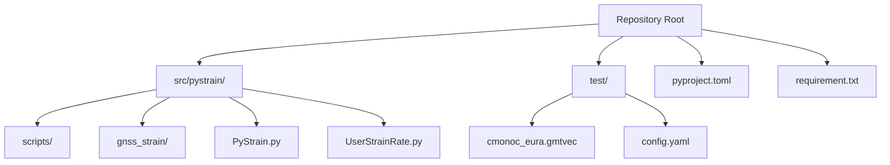
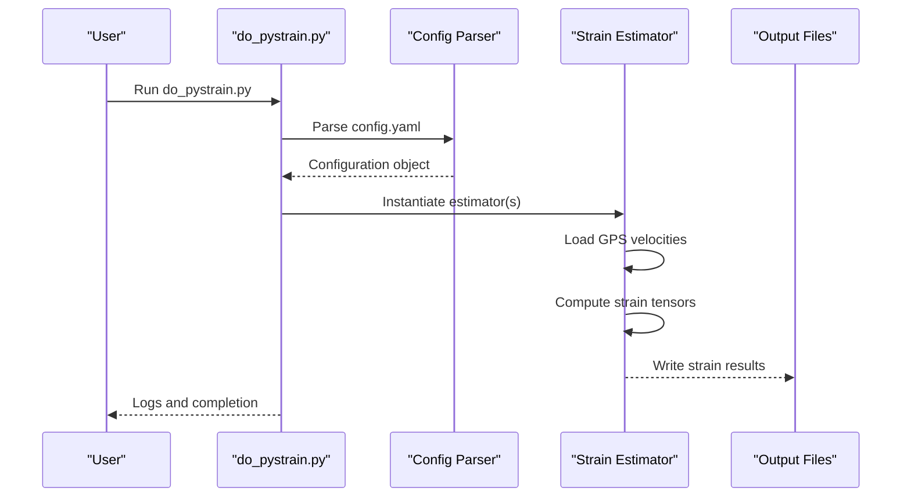
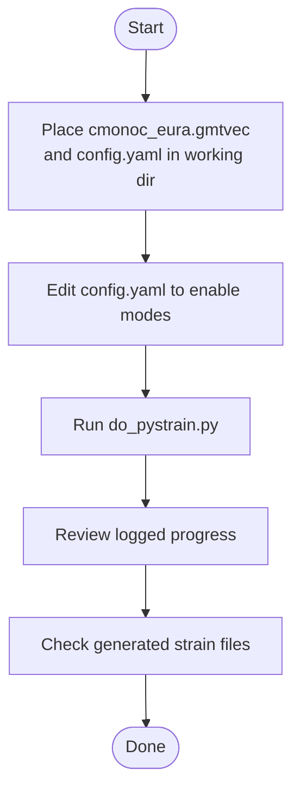
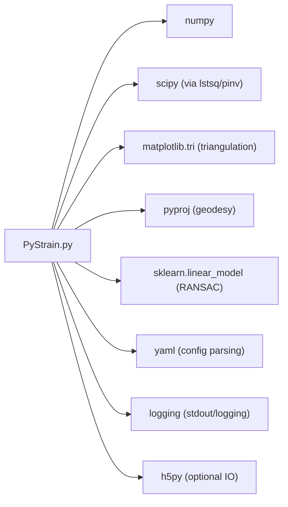

# Getting Started

<cite>
**Referenced Files in This Document**
- [README.md](file://README.md)
- [pyproject.toml](file://pyproject.toml)
- [requirement.txt](file://requirement.txt)
- [do_pystrain.py](file://src/pystrain/scripts/do_pystrain.py)
- [config.yaml](file://test/config.yaml)
- [cmonoc_eura.gmtvec](file://test/cmonoc_eura.gmtvec)
- [PyStrain.py](file://src/pystrain/PyStrain.py)
</cite>

## Table of Contents
1. [Introduction](#introduction)
2. [Project Structure](#project-structure)
3. [Core Components](#core-components)
4. [Architecture Overview](#architecture-overview)
5. [Detailed Component Analysis](#detailed-component-analysis)
6. [Dependency Analysis](#dependency-analysis)
7. [Performance Considerations](#performance-considerations)
8. [Troubleshooting Guide](#troubleshooting-guide)
9. [Conclusion](#conclusion)
10. [Appendices](#appendices)

## Introduction
PyStrain is a Python program designed to compute strain rate and strain time series from GPS velocity data. It supports three spatial discretization modes—regular grid, triangular mesh, and user-defined points—and can also process GPS time series to produce temporal strain fields. This guide focuses on rapid onboarding: installation prerequisites, environment setup, and a quick start workflow using the included sample dataset and configuration.

## Project Structure
At a high level, the repository organizes:
- Source code under src/pystrain/, including core algorithms, IO utilities, and scripts
- Test data and example configuration under test/
- Packaging metadata and CLI entry points configured via pyproject.toml

**Diagram sources**
- [pyproject.toml:1-31](file://pyproject.toml#L1-L31)
- [do_pystrain.py:1-39](file://src/pystrain/scripts/do_pystrain.py#L1-L39)
- [PyStrain.py:1-120](file://src/pystrain/PyStrain.py#L1-L120)

**Section sources**
- [pyproject.toml:1-31](file://pyproject.toml#L1-L31)
- [README.md:1-2](file://README.md#L1-L2)

## Core Components
- Command-line driver: do_pystrain.py orchestrates strain computations based on a YAML configuration
- Core engine: PyStrain.py implements GPS velocity parsing, coordinate transforms, triangulation, strain estimation, and time series handling
- Sample dataset: cmonoc_eura.gmtvec provides a ready-to-use GPS velocity field in GMT format
- Example configuration: test/config.yaml demonstrates enabling strain rate and time series modes

Key capabilities:
- Strain rate estimation on grid, triangle mesh, and user points
- Strain time series estimation over epochs
- Output files for strain tensors and modeled velocities

**Section sources**
- [do_pystrain.py:1-39](file://src/pystrain/scripts/do_pystrain.py#L1-L39)
- [PyStrain.py:248-320](file://src/pystrain/PyStrain.py#L248-L320)
- [config.yaml:1-123](file://test/config.yaml#L1-L123)
- [cmonoc_eura.gmtvec:1-40](file://test/cmonoc_eura.gmtvec#L1-L40)

## Architecture Overview
The runtime architecture centers on a configuration-driven pipeline:
- do_pystrain.py reads config.yaml and instantiates appropriate estimators
- Estimators (grid, triangle, user) load GPS velocities and compute strain tensors
- Results are written to output files per configuration

**Diagram sources**
- [do_pystrain.py:7-39](file://src/pystrain/scripts/do_pystrain.py#L7-L39)
- [PyStrain.py:98-126](file://src/pystrain/PyStrain.py#L98-L126)

## Detailed Component Analysis

### Installation Prerequisites
- Python version: requires Python >= 3.7
- Core dependencies: numpy, scipy, matplotlib, pyproj, h5py, logging, sklearn
- Optional extras: yaml (via requirement.txt), Node.js toolchain for web IDE (frontend build only)

Notes:
- The project declares dependencies in pyproject.toml; requirement.txt lists additional optional packages
- Some dependencies (e.g., pyproj) are used for geographic projections and distance calculations

**Section sources**
- [pyproject.toml:17-26](file://pyproject.toml#L17-L26)
- [requirement.txt:1-4](file://requirement.txt#L1-L4)

### Environment Setup and Virtual Environments
We strongly recommend using a dedicated virtual environment to avoid system-wide dependency conflicts:
- Using venv: python -m venv .venv && source .venv/bin/activate (Linux/macOS) or .venv\Scripts\Activate.ps1 (Windows)
- Using conda: conda create -n pystrain python=3.10 && conda activate pystrain

Then install the package in editable mode to enable CLI scripts:
- pip install -e .

This installs the console scripts defined in pyproject.toml (do_pystrain.py and plot_strain_ts.py).

**Section sources**
- [pyproject.toml:28-30](file://pyproject.toml#L28-L30)

### Quick Start: First-Time Workflow
Follow these steps to run a minimal strain rate computation using the sample dataset:

1. Prepare working directory
- Copy cmonoc_eura.gmtvec and config.yaml from test/ into your working directory
- Ensure config.yaml points to the velocity file and enables desired modes (e.g., trimesh)

2. Run the command-line interface
- Execute: do_pystrain.py
- The script checks for config.yaml and logs progress for enabled modes

3. Verify outputs
- Strain rate outputs are written according to configuration (e.g., trimesh.txt)
- The script writes log messages indicating which modes are being processed

**Diagram sources**
- [do_pystrain.py:8-11](file://src/pystrain/scripts/do_pystrain.py#L8-L11)
- [config.yaml:40-73](file://test/config.yaml#L40-L73)

**Section sources**
- [do_pystrain.py:1-39](file://src/pystrain/scripts/do_pystrain.py#L1-L39)
- [config.yaml:1-123](file://test/config.yaml#L1-L123)
- [cmonoc_eura.gmtvec:1-40](file://test/cmonoc_eura.gmtvec#L1-L40)

### Expected Output Formats
- Strain rate files: tabular text with columns including longitude, latitude, velocities, strain tensor components, rotation, principal strains, shear, divergence, second invariant, and orientation
- Modeled velocity file (when applicable): modeled velocities at user-specified points

These formats are produced by the respective estimator classes and written to filenames specified in the configuration.

**Section sources**
- [PyStrain.py:596-658](file://src/pystrain/PyStrain.py#L596-L658)
- [PyStrain.py:775-800](file://src/pystrain/PyStrain.py#L775-L800)
- [PyStrain.py:856-927](file://src/pystrain/PyStrain.py#L856-L927)

### Basic Command-Line Usage
- Script entry point: do_pystrain.py
- Behavior: loads config.yaml, selects enabled modes, runs estimators, and writes outputs
- Logging: INFO/DEBUG/ERROR messages guide progress and highlight warnings

Typical invocation:
- do_pystrain.py

**Section sources**
- [do_pystrain.py:1-39](file://src/pystrain/scripts/do_pystrain.py#L1-L39)

## Dependency Analysis
PyStrain’s runtime depends on several scientific Python libraries. The dependency graph below reflects the primary runtime imports and usage in the core module.

**Diagram sources**
- [PyStrain.py:9-16](file://src/pystrain/PyStrain.py#L9-L16)
- [pyproject.toml:18-26](file://pyproject.toml#L18-L26)

**Section sources**
- [PyStrain.py:9-16](file://src/pystrain/PyStrain.py#L9-L16)
- [pyproject.toml:18-26](file://pyproject.toml#L18-L26)

## Performance Considerations
- Triangulation quality: ensure adequate station density and avoid flat triangles; the code masks poor-quality triangles
- Spatial weighting: distance-based weights reduce influence of distant stations; adjust parameters to balance accuracy and stability
- Epoch alignment: for time series, align epochs consistently to minimize gaps and improve temporal coherence
- Output verbosity: DEBUG logs can be useful during development but may slow execution; switch to INFO for routine runs

[No sources needed since this section provides general guidance]

## Troubleshooting Guide
Common issues and resolutions:
- Missing config.yaml
  - Symptom: fatal message and exit
  - Action: place config.yaml in the working directory and re-run
  - Reference: [do_pystrain.py:8-11](file://src/pystrain/scripts/do_pystrain.py#L8-L11)

- Invalid or missing GPS velocity file
  - Symptom: critical warning and exit
  - Action: verify file path and format; ensure it matches the configured format (e.g., GMT)
  - Reference: [PyStrain.py:261-266](file://src/pystrain/PyStrain.py#L261-L266)

- Insufficient stations per location
  - Symptom: warnings about station count below thresholds
  - Action: relax minsite or expand search radius (maxdist) in config
  - Reference: [PyStrain.py:605-608](file://src/pystrain/PyStrain.py#L605-L608), [PyStrain.py:868-871](file://src/pystrain/PyStrain.py#L868-L871)

- Poor station distribution
  - Symptom: warnings about azimuth coverage
  - Action: enable chkazim or reposition points to ensure stations span quadrants
  - Reference: [PyStrain.py:617-631](file://src/pystrain/PyStrain.py#L617-L631), [PyStrain.py:880-894](file://src/pystrain/PyStrain.py#L880-L894)

- Time series misalignment
  - Symptom: gaps or mismatches across epochs
  - Action: align epochs and ensure data availability; review gpsts handling
  - Reference: [PyStrain.py:1184-1191](file://src/pystrain/PyStrain.py#L1184-L1191), [PyStrain.py:1193-1198](file://src/pystrain/PyStrain.py#L1193-L1198)

**Section sources**
- [do_pystrain.py:8-11](file://src/pystrain/scripts/do_pystrain.py#L8-L11)
- [PyStrain.py:261-266](file://src/pystrain/PyStrain.py#L261-L266)
- [PyStrain.py:605-608](file://src/pystrain/PyStrain.py#L605-L608)
- [PyStrain.py:617-631](file://src/pystrain/PyStrain.py#L617-L631)
- [PyStrain.py:868-871](file://src/pystrain/PyStrain.py#L868-L871)
- [PyStrain.py:880-894](file://src/pystrain/PyStrain.py#L880-L894)
- [PyStrain.py:1184-1191](file://src/pystrain/PyStrain.py#L1184-L1191)
- [PyStrain.py:1193-1198](file://src/pystrain/PyStrain.py#L1193-L1198)

## Conclusion
You now have the essentials to install PyStrain, prepare a minimal configuration, and run a first computation using the sample dataset. Proceed to refine configurations for your study area, adjust spatial and temporal parameters, and interpret the resulting strain fields.

[No sources needed since this section summarizes without analyzing specific files]

## Appendices

### Appendix A: Installation Methods
- Pip (editable)
  - pip install -e .
- Conda (recommended channel)
  - conda install -c conda-forge numpy scipy matplotlib pyproj h5py scikit-learn
  - pip install -e .

Notes:
- The project defines console scripts; after installation, do_pystrain.py and plot_strain_ts.py become available
- requirement.txt lists additional optional packages; install if needed for specialized workflows

**Section sources**
- [pyproject.toml:28-30](file://pyproject.toml#L28-L30)
- [requirement.txt:1-4](file://requirement.txt#L1-L4)

### Appendix B: Verification Checklist
- Confirm Python >= 3.7
- Create and activate a virtual environment
- Install via pip install -e .
- Place cmonoc_eura.gmtvec and config.yaml in the working directory
- Run do_pystrain.py and observe INFO logs
- Check for generated strain output files

**Section sources**
- [pyproject.toml:17-17](file://pyproject.toml#L17-L17)
- [do_pystrain.py:1-39](file://src/pystrain/scripts/do_pystrain.py#L1-L39)
- [config.yaml:1-123](file://test/config.yaml#L1-L123)
- [cmonoc_eura.gmtvec:1-40](file://test/cmonoc_eura.gmtvec#L1-L40)