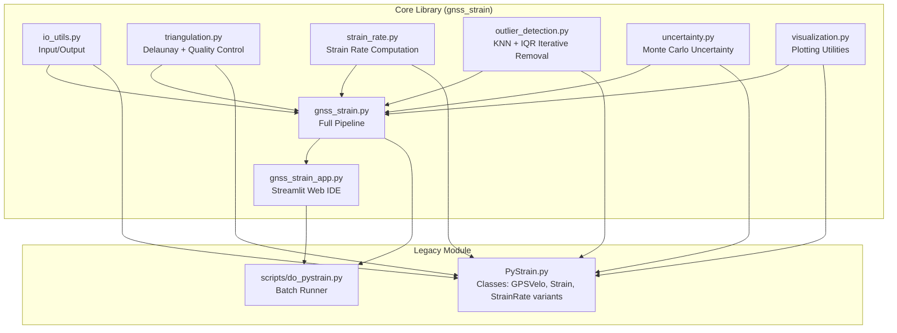
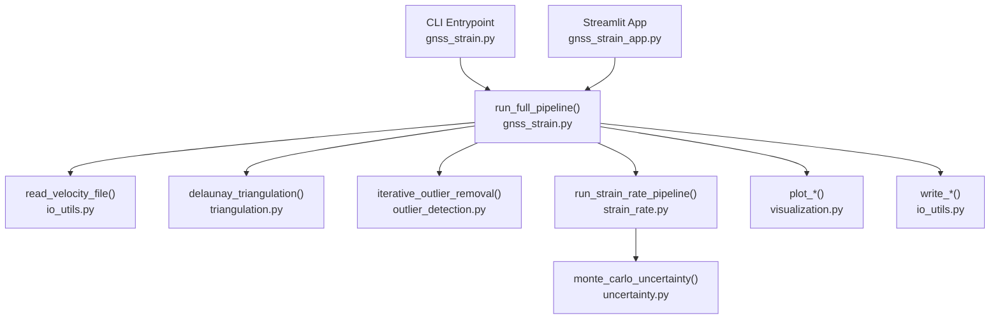
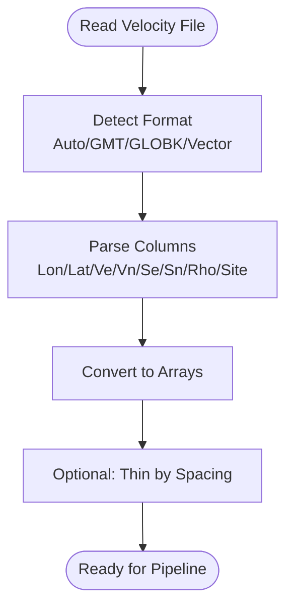
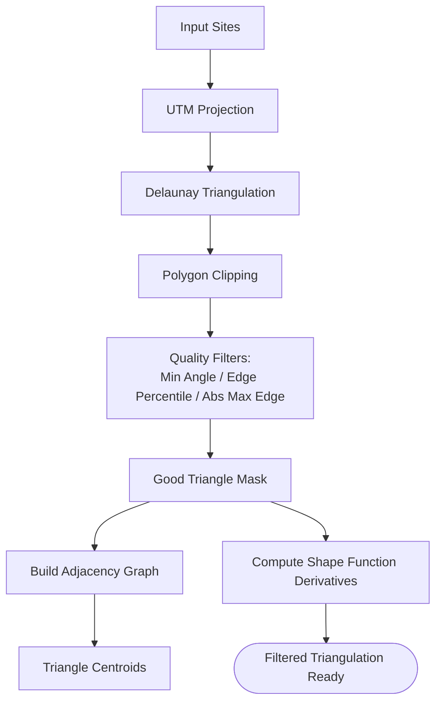
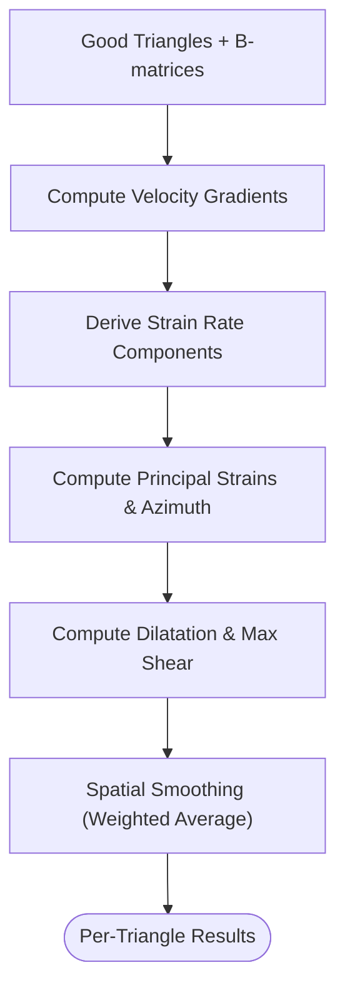
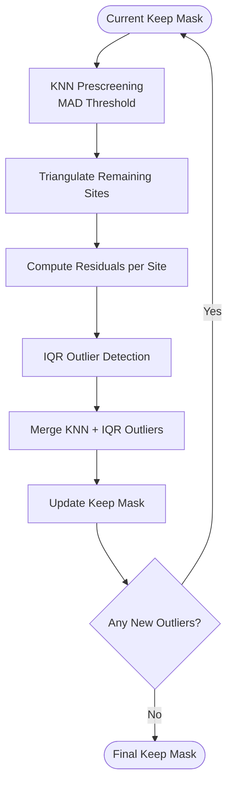
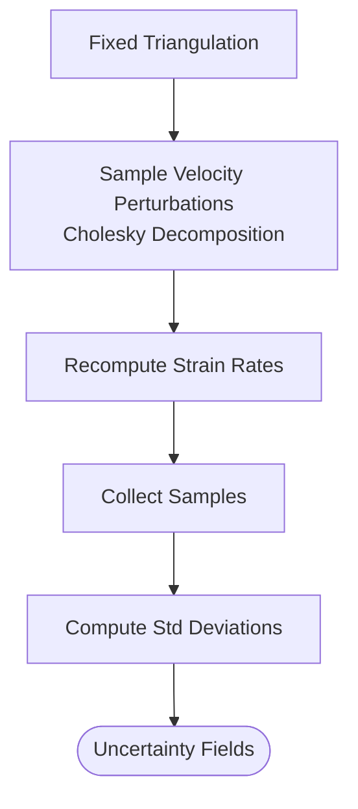
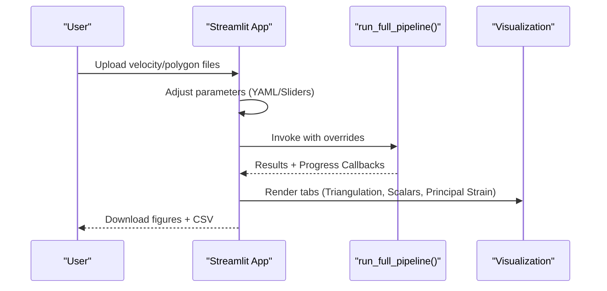
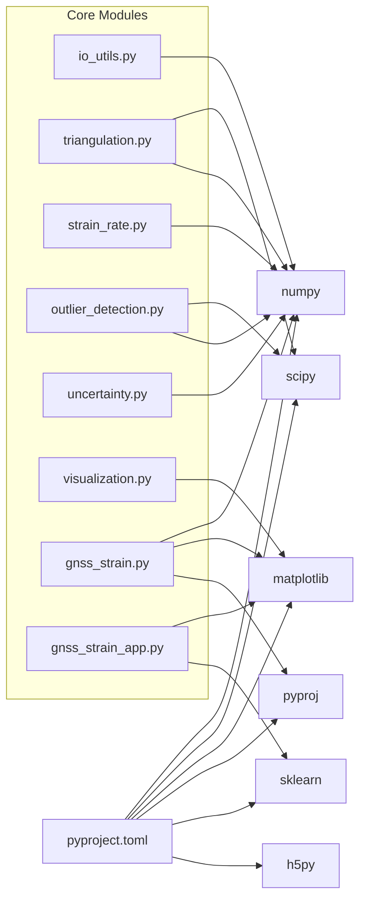

# Project Overview

<cite>
**Referenced Files in This Document**
- [README.md](file://README.md)
- [pyproject.toml](file://pyproject.toml)
- [src/pystrain/gnss_strain/config_default.yaml](file://src/pystrain/gnss_strain/config_default.yaml)
- [src/pystrain/gnss_strain/gnss_strain.py](file://src/pystrain/gnss_strain/gnss_strain.py)
- [src/pystrain/gnss_strain/gnss_strain_app.py](file://src/pystrain/gnss_strain/gnss_strain_app.py)
- [src/pystrain/gnss_strain/io_utils.py](file://src/pystrain/gnss_strain/io_utils.py)
- [src/pystrain/gnss_strain/triangulation.py](file://src/pystrain/gnss_strain/triangulation.py)
- [src/pystrain/gnss_strain/strain_rate.py](file://src/pystrain/gnss_strain/strain_rate.py)
- [src/pystrain/gnss_strain/outlier_detection.py](file://src/pystrain/gnss_strain/outlier_detection.py)
- [src/pystrain/gnss_strain/uncertainty.py](file://src/pystrain/gnss_strain/uncertainty.py)
- [src/pystrain/gnss_strain/visualization.py](file://src/pystrain/gnss_strain/visualization.py)
- [src/pystrain/scripts/do_pystrain.py](file://src/pystrain/scripts/do_pystrain.py)
- [test/config.yaml](file://test/config.yaml)
</cite>

## Table of Contents
1. [Introduction](#introduction)
2. [Project Structure](#project-structure)
3. [Core Components](#core-components)
4. [Architecture Overview](#architecture-overview)
5. [Detailed Component Analysis](#detailed-component-analysis)
6. [Dependency Analysis](#dependency-analysis)
7. [Performance Considerations](#performance-considerations)
8. [Troubleshooting Guide](#troubleshooting-guide)
9. [Conclusion](#conclusion)
10. [Appendices](#appendices)

## Introduction
PyStrain is a scientific computing library designed for geodetic strain analysis from GPS velocity data. It provides a robust, configuration-driven workflow to compute strain rate fields using triangulation-based methods, quality control, smoothing, and uncertainty quantification via Monte Carlo propagation. The project supports both batch processing via command-line scripts and interactive analysis through a web-based IDE built with Streamlit.

Key capabilities:
- GPS velocity field ingestion (GMT/GLOBK formats) with automatic format detection
- Quality control pipeline: KNN prescreening and iterative outlier removal guided by triangulation residuals
- Delaunay triangulation with geometric quality filters (minimum angle, edge length percentiles, absolute thresholds)
- Strain rate computation per triangle with principal strain and derived invariants
- Spatial smoothing and Monte Carlo uncertainty propagation
- Interactive web IDE for parameter tuning, real-time visualization, and result inspection

Terminology used consistently:
- Strain rate computation, triangulation methods, quality control processes, Monte Carlo uncertainty, principal strain rate, maximum shear strain rate, dilatation rate, and spatial smoothing.

## Project Structure
The repository organizes functionality into a modular Python package under src/pystrain/gnss_strain, complemented by a legacy PyStrain module and scripts for batch processing. The web IDE resides alongside the core computational modules.

**Diagram sources**
- [src/pystrain/gnss_strain/gnss_strain.py:1-407](file://src/pystrain/gnss_strain/gnss_strain.py#L1-L407)
- [src/pystrain/gnss_strain/gnss_strain_app.py:1-497](file://src/pystrain/gnss_strain/gnss_strain_app.py#L1-L497)
- [src/pystrain/gnss_strain/io_utils.py:1-270](file://src/pystrain/gnss_strain/io_utils.py#L1-L270)
- [src/pystrain/gnss_strain/triangulation.py:1-477](file://src/pystrain/gnss_strain/triangulation.py#L1-L477)
- [src/pystrain/gnss_strain/strain_rate.py:1-438](file://src/pystrain/gnss_strain/strain_rate.py#L1-L438)
- [src/pystrain/gnss_strain/outlier_detection.py:1-292](file://src/pystrain/gnss_strain/outlier_detection.py#L1-L292)
- [src/pystrain/gnss_strain/uncertainty.py:1-150](file://src/pystrain/gnss_strain/uncertainty.py#L1-L150)
- [src/pystrain/gnss_strain/visualization.py:1-250](file://src/pystrain/gnss_strain/visualization.py#L1-L250)
- [src/pystrain/scripts/do_pystrain.py:1-39](file://src/pystrain/scripts/do_pystrain.py#L1-L39)

**Section sources**
- [pyproject.toml:1-31](file://pyproject.toml#L1-L31)
- [src/pystrain/gnss_strain/gnss_strain.py:1-407](file://src/pystrain/gnss_strain/gnss_strain.py#L1-L407)
- [src/pystrain/gnss_strain/gnss_strain_app.py:1-497](file://src/pystrain/gnss_strain/gnss_strain_app.py#L1-L497)

## Core Components
- Input/Output: Reads GPS velocity files (GMT/GLOBK/vector formats), optional polygon boundaries, and writes strain results and reports.
- Triangulation: Performs Delaunay triangulation, applies geometric quality filters, and computes shape function derivatives.
- Strain Rate: Computes strain rate tensors per triangle, derives principal strains and invariants, and applies smoothing.
- Outlier Detection: Two-stage process—KNN prescreening and iterative IQR-based detection on triangulated residuals.
- Uncertainty: Monte Carlo propagation of velocity uncertainties to strain rate outputs.
- Visualization: Generates triangulation plots, scalar fields, and principal strain cross plots.
- Full Pipeline: Orchestrates the entire workflow from raw data to figures and statistics.
- Web IDE: Streamlit app enabling interactive parameter tuning, progress callbacks, and result tabs.

**Section sources**
- [src/pystrain/gnss_strain/io_utils.py:21-132](file://src/pystrain/gnss_strain/io_utils.py#L21-L132)
- [src/pystrain/gnss_strain/triangulation.py:89-146](file://src/pystrain/gnss_strain/triangulation.py#L89-L146)
- [src/pystrain/gnss_strain/strain_rate.py:18-198](file://src/pystrain/gnss_strain/strain_rate.py#L18-L198)
- [src/pystrain/gnss_strain/outlier_detection.py:17-87](file://src/pystrain/gnss_strain/outlier_detection.py#L17-L87)
- [src/pystrain/gnss_strain/uncertainty.py:14-149](file://src/pystrain/gnss_strain/uncertainty.py#L14-L149)
- [src/pystrain/gnss_strain/visualization.py:18-249](file://src/pystrain/gnss_strain/visualization.py#L18-L249)
- [src/pystrain/gnss_strain/gnss_strain.py:52-341](file://src/pystrain/gnss_strain/gnss_strain.py#L52-L341)

## Architecture Overview
PyStrain’s architecture separates concerns into specialized modules while exposing a unified pipeline interface. The web IDE integrates seamlessly with the pipeline to provide interactive feedback and visualization.

**Diagram sources**
- [src/pystrain/gnss_strain/gnss_strain.py:52-341](file://src/pystrain/gnss_strain/gnss_strain.py#L52-L341)
- [src/pystrain/gnss_strain/gnss_strain_app.py:163-251](file://src/pystrain/gnss_strain/gnss_strain_app.py#L163-L251)
- [src/pystrain/gnss_strain/io_utils.py:21-132](file://src/pystrain/gnss_strain/io_utils.py#L21-L132)
- [src/pystrain/gnss_strain/triangulation.py:89-146](file://src/pystrain/gnss_strain/triangulation.py#L89-L146)
- [src/pystrain/gnss_strain/strain_rate.py:384-437](file://src/pystrain/gnss_strain/strain_rate.py#L384-L437)
- [src/pystrain/gnss_strain/outlier_detection.py:184-291](file://src/pystrain/gnss_strain/outlier_detection.py#L184-L291)
- [src/pystrain/gnss_strain/uncertainty.py:14-149](file://src/pystrain/gnss_strain/uncertainty.py#L14-L149)
- [src/pystrain/gnss_strain/visualization.py:18-249](file://src/pystrain/gnss_strain/visualization.py#L18-L249)

## Detailed Component Analysis

### GPS Velocity Data Processing
- Formats supported: GMT 8-column, GLOBK 13-column, and vector formats with automatic detection.
- Reads velocities, uncertainties, correlation coefficients, and site names.
- Optional polygon boundary support for study area definition.

**Diagram sources**
- [src/pystrain/gnss_strain/io_utils.py:21-132](file://src/pystrain/gnss_strain/io_utils.py#L21-L132)
- [src/pystrain/gnss_strain/gnss_strain.py:100-131](file://src/pystrain/gnss_strain/gnss_strain.py#L100-L131)

**Section sources**
- [src/pystrain/gnss_strain/io_utils.py:21-132](file://src/pystrain/gnss_strain/io_utils.py#L21-L132)

### Triangulation and Quality Control
- Projects coordinates to UTM-equivalent plane for accurate gradient computations.
- Applies multiple quality filters: minimum angle, edge length percentiles, absolute edge length, and polygon clipping.
- Builds adjacency graph for smoothing and identifies hanging sites.

**Diagram sources**
- [src/pystrain/gnss_strain/triangulation.py:89-146](file://src/pystrain/gnss_strain/triangulation.py#L89-L146)
- [src/pystrain/gnss_strain/triangulation.py:312-368](file://src/pystrain/gnss_strain/triangulation.py#L312-L368)
- [src/pystrain/gnss_strain/triangulation.py:375-416](file://src/pystrain/gnss_strain/triangulation.py#L375-L416)

**Section sources**
- [src/pystrain/gnss_strain/triangulation.py:89-146](file://src/pystrain/gnss_strain/triangulation.py#L89-L146)
- [src/pystrain/gnss_strain/triangulation.py:312-368](file://src/pystrain/gnss_strain/triangulation.py#L312-L368)
- [src/pystrain/gnss_strain/triangulation.py:375-416](file://src/pystrain/gnss_strain/triangulation.py#L375-L416)

### Strain Rate Computation and Smoothing
- Computes velocity gradients per triangle using shape function derivatives.
- Converts gradients to strain rate components and derives principal strains and invariants.
- Applies spatial smoothing with adjustable weight and iterations.

**Diagram sources**
- [src/pystrain/gnss_strain/strain_rate.py:18-198](file://src/pystrain/gnss_strain/strain_rate.py#L18-L198)
- [src/pystrain/gnss_strain/strain_rate.py:205-271](file://src/pystrain/gnss_strain/strain_rate.py#L205-L271)

**Section sources**
- [src/pystrain/gnss_strain/strain_rate.py:18-198](file://src/pystrain/gnss_strain/strain_rate.py#L18-L198)
- [src/pystrain/gnss_strain/strain_rate.py:205-271](file://src/pystrain/gnss_strain/strain_rate.py#L205-L271)

### Outlier Detection Workflow
- KNN prescreening flags outliers based on median absolute deviation against k-nearest neighbors.
- Iterative IQR detection on triangulation residuals removes persistent outliers across iterations.

**Diagram sources**
- [src/pystrain/gnss_strain/outlier_detection.py:184-291](file://src/pystrain/gnss_strain/outlier_detection.py#L184-L291)

**Section sources**
- [src/pystrain/gnss_strain/outlier_detection.py:17-87](file://src/pystrain/gnss_strain/outlier_detection.py#L17-L87)
- [src/pystrain/gnss_strain/outlier_detection.py:184-291](file://src/pystrain/gnss_strain/outlier_detection.py#L184-L291)

### Monte Carlo Uncertainty Propagation
- Fixed topology Monte Carlo sampling propagates velocity covariances to strain rate distributions.
- Computes standard deviations for strain components and derived invariants.

**Diagram sources**
- [src/pystrain/gnss_strain/uncertainty.py:14-149](file://src/pystrain/gnss_strain/uncertainty.py#L14-L149)

**Section sources**
- [src/pystrain/gnss_strain/uncertainty.py:14-149](file://src/pystrain/gnss_strain/uncertainty.py#L14-L149)

### Web IDE and Batch Modes
- Command-line mode: runs the pipeline with a YAML configuration, supports triangulation-based strain rate computation.
- Interactive mode: Streamlit app allows uploading velocity/polygon files, adjusting parameters, and viewing results in tabs.

**Diagram sources**
- [src/pystrain/gnss_strain/gnss_strain_app.py:163-251](file://src/pystrain/gnss_strain/gnss_strain_app.py#L163-L251)
- [src/pystrain/gnss_strain/gnss_strain.py:52-341](file://src/pystrain/gnss_strain/gnss_strain.py#L52-L341)

**Section sources**
- [src/pystrain/gnss_strain/gnss_strain_app.py:1-497](file://src/pystrain/gnss_strain/gnss_strain_app.py#L1-L497)
- [src/pystrain/scripts/do_pystrain.py:7-39](file://src/pystrain/scripts/do_pystrain.py#L7-L39)

## Dependency Analysis
PyStrain relies on a scientific Python stack for numerical computation, geometry, and visualization.

**Diagram sources**
- [pyproject.toml:18-26](file://pyproject.toml#L18-L26)
- [src/pystrain/gnss_strain/gnss_strain.py:10-27](file://src/pystrain/gnss_strain/gnss_strain.py#L10-L27)

**Section sources**
- [pyproject.toml:18-26](file://pyproject.toml#L18-L26)

## Performance Considerations
- Triangulation scaling: For large datasets, consider enabling site thinning by spacing to reduce small-angle triangles and improve conditioning.
- Quality thresholds: Adjust minimum angle and edge percentile/factor to balance coverage and stability.
- Smoothing: Moderate smoothing weights prevent noise amplification while preserving spatial coherence.
- Monte Carlo: Increase iterations cautiously; uncertainty estimates stabilize with more samples.
- Visualization: Disable interactive windows on headless servers; export figures to disk.

[No sources needed since this section provides general guidance]

## Troubleshooting Guide
Common issues and resolutions:
- Not enough valid triangles after quality control: Relax min_angle_deg, increase max_edge_pctl, or remove absolute max_edge_km constraint.
- Few sites retained after outlier removal: Reduce iqr_factor or increase k_neighbors; verify polygon boundaries.
- Poor triangulation near edges: Use a polygon boundary or enable automatic rectangular bounds; ensure adequate station density.
- Slow Monte Carlo runs: Lower mc_iterations or enable site thinning to reduce dataset size.
- Web IDE errors: Confirm uploaded files are readable and parameters are within valid ranges; check logs panel for detailed messages.

**Section sources**
- [src/pystrain/gnss_strain/gnss_strain.py:166-168](file://src/pystrain/gnss_strain/gnss_strain.py#L166-L168)
- [src/pystrain/gnss_strain/gnss_strain_app.py:233-240](file://src/pystrain/gnss_strain/gnss_strain_app.py#L233-L240)

## Conclusion
PyStrain delivers a complete, configurable workflow for GPS-based strain rate computation, combining robust triangulation, quality control, smoothing, and uncertainty quantification. Its dual-mode operation—batch processing and interactive web IDE—supports both automated workflows and exploratory analysis, making it suitable for tectonic monitoring and deformation studies.

[No sources needed since this section summarizes without analyzing specific files]

## Appendices

### Practical Use Cases
- Tectonic monitoring: Compute regional strain rates and visualize dilatation and maximum shear fields to identify deformation localization.
- Fault zone studies: Focus on triangulation quality and outlier removal to isolate fault-parallel shortening or strike-slip motion.
- Interseismic deformation: Use Monte Carlo uncertainty to assess confidence in strain rate estimates across heterogeneous GPS networks.

[No sources needed since this section provides general guidance]

### Configuration Reference Highlights
- Data input: vel_file, poly_file, output_dir, vel_format
- Outlier detection: k_neighbors, mad_factor, iqr_factor, max_outlier_iter
- Triangulation: min_angle_deg, max_edge_pctl, max_edge_factor, min_spacing_km, max_edge_km
- Smoothing: smooth_weight, smooth_iter
- Uncertainty: mc_iterations
- Visualization: dpi, save_figures, show_figures

**Section sources**
- [src/pystrain/gnss_strain/config_default.yaml:1-69](file://src/pystrain/gnss_strain/config_default.yaml#L1-L69)
- [src/pystrain/gnss_strain/gnss_strain.py:352-396](file://src/pystrain/gnss_strain/gnss_strain.py#L352-L396)