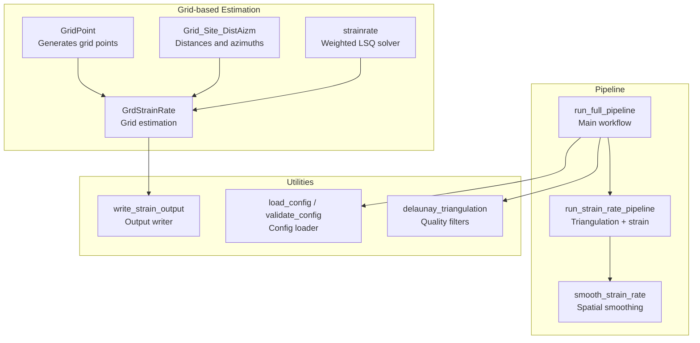
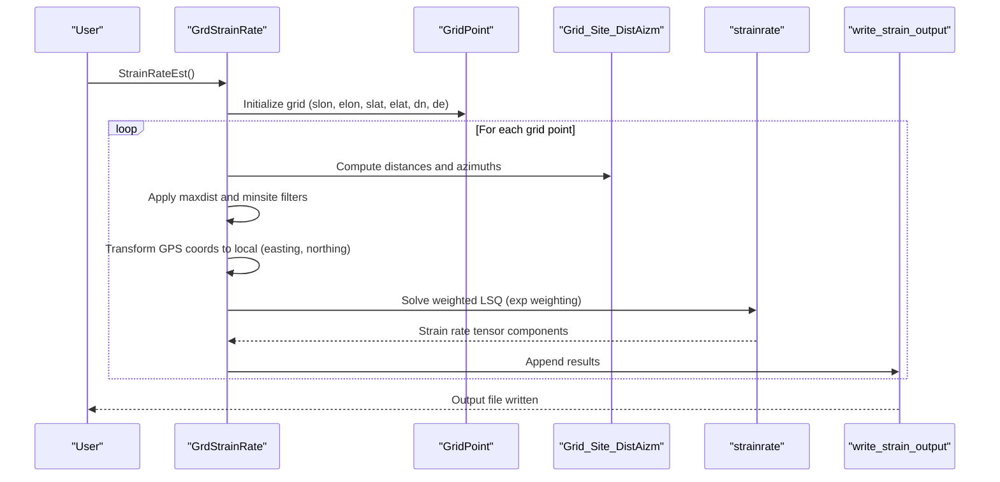
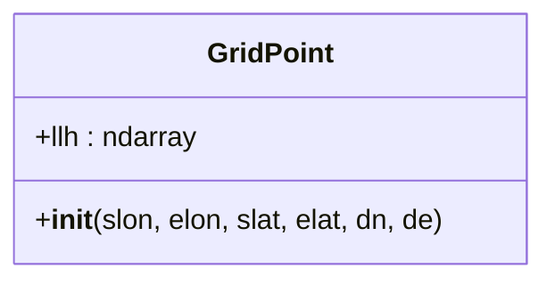
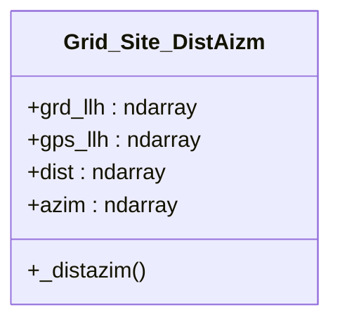
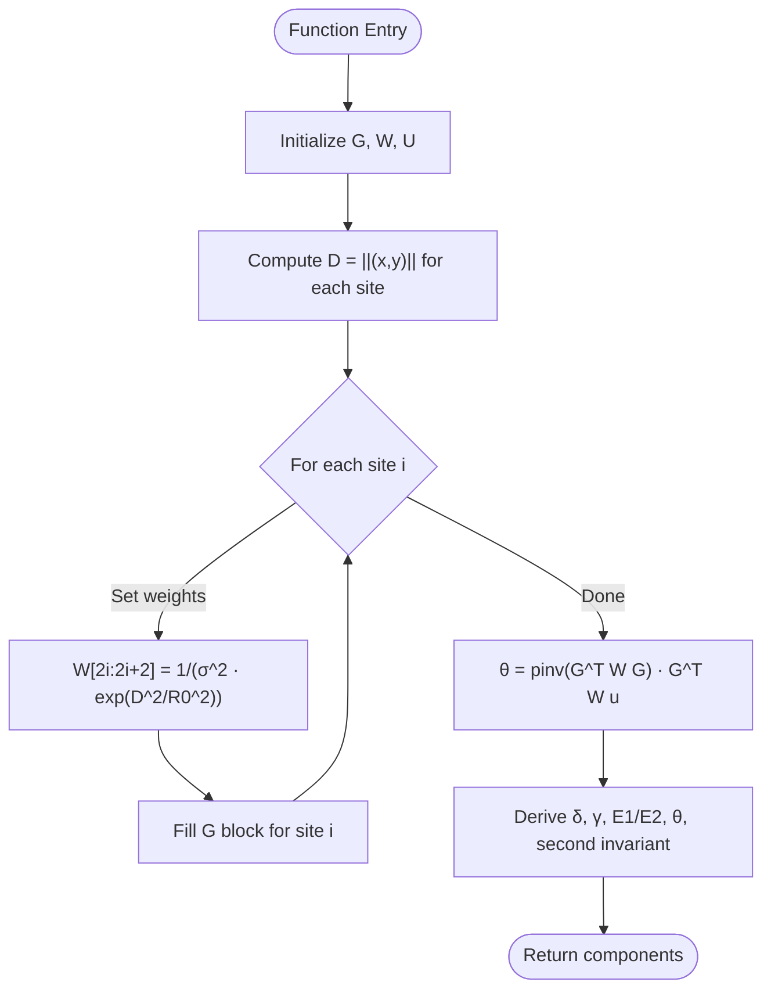
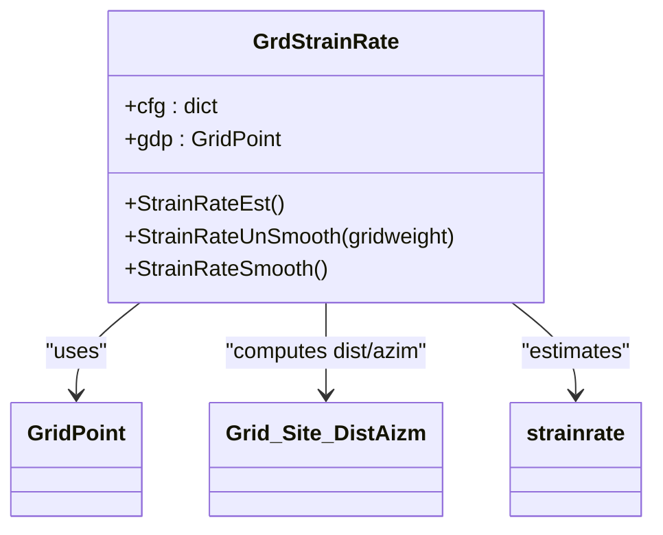
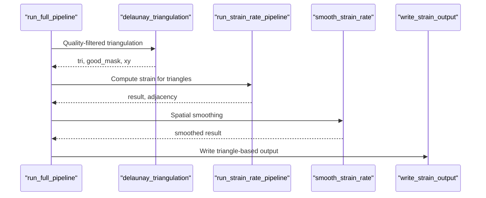
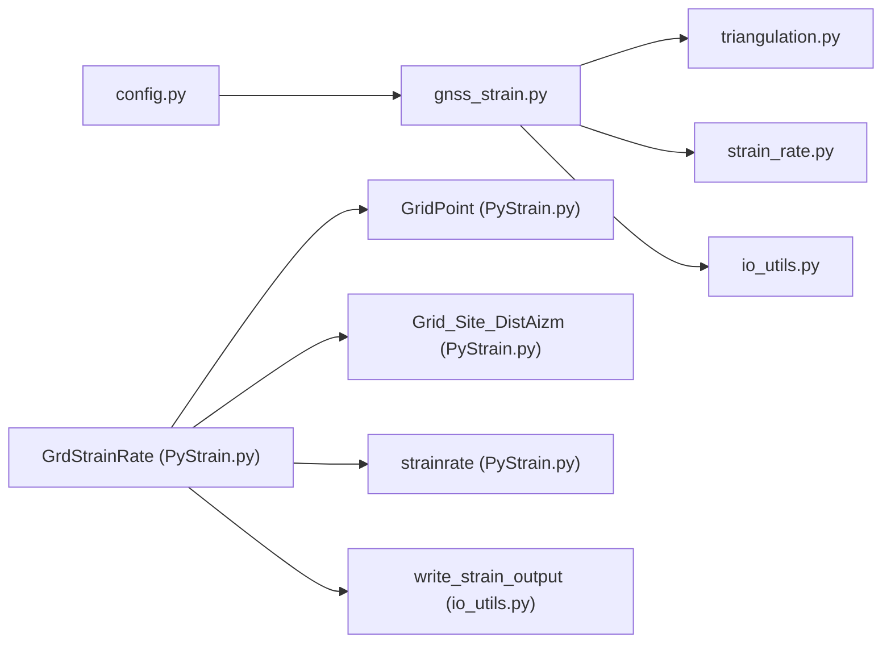

# Grid-based Strain Estimation

<cite>
**Referenced Files in This Document**
- [PyStrain.py](file://src/pystrain/PyStrain.py)
- [gnss_strain.py](file://src/pystrain/gnss_strain/gnss_strain.py)
- [strain_rate.py](file://src/pystrain/gnss_strain/strain_rate.py)
- [triangulation.py](file://src/pystrain/gnss_strain/triangulation.py)
- [io_utils.py](file://src/pystrain/gnss_strain/io_utils.py)
- [config.py](file://src/pystrain/gnss_strain/config.py)
- [config_default.yaml](file://src/pystrain/gnss_strain/config_default.yaml)
- [config.yaml](file://test/config.yaml)
</cite>

## Table of Contents
1. [Introduction](#introduction)
2. [Project Structure](#project-structure)
3. [Core Components](#core-components)
4. [Architecture Overview](#architecture-overview)
5. [Detailed Component Analysis](#detailed-component-analysis)
6. [Dependency Analysis](#dependency-analysis)
7. [Performance Considerations](#performance-considerations)
8. [Troubleshooting Guide](#troubleshooting-guide)
9. [Conclusion](#conclusion)
10. [Appendices](#appendices)

## Introduction
This document explains the grid-based strain estimation method implemented in the PyStrain codebase, focusing on the GrdStrainRate class and related components. It covers:
- Grid point generation using the GridPoint class
- Distance-weighted least squares estimation with exponential weighting
- Smoothing techniques for spatial regularization
- Mathematical formulation of strain rate computation
- Grid creation parameters and their impact on resolution and accuracy
- Distance-weighting scheme using the gridweight parameter
- Practical examples for parameter selection, minimum site requirements, and maximum distance filtering
- Output format and interpretation of strain rate tensor components
- Computational efficiency and memory usage considerations

## Project Structure
The grid-based strain estimation spans several modules:
- Grid point generation and strain estimation logic
- GNSS velocity-to-strain pipeline
- Triangulation and quality filtering
- I/O utilities for input/output and reporting
- Configuration management and defaults

**Diagram sources**
- [PyStrain.py:320-749](file://src/pystrain/PyStrain.py#L320-L749)
- [gnss_strain.py:52-341](file://src/pystrain/gnss_strain/gnss_strain.py#L52-L341)
- [strain_rate.py:205-271](file://src/pystrain/gnss_strain/strain_rate.py#L205-L271)
- [triangulation.py:89-146](file://src/pystrain/gnss_strain/triangulation.py#L89-L146)
- [io_utils.py:186-230](file://src/pystrain/gnss_strain/io_utils.py#L186-L230)
- [config.py:56-90](file://src/pystrain/gnss_strain/config.py#L56-L90)

**Section sources**
- [PyStrain.py:320-749](file://src/pystrain/PyStrain.py#L320-L749)
- [gnss_strain.py:52-341](file://src/pystrain/gnss_strain/gnss_strain.py#L52-L341)
- [strain_rate.py:205-271](file://src/pystrain/gnss_strain/strain_rate.py#L205-L271)
- [triangulation.py:89-146](file://src/pystrain/gnss_strain/triangulation.py#L89-L146)
- [io_utils.py:186-230](file://src/pystrain/gnss_strain/io_utils.py#L186-L230)
- [config.py:56-90](file://src/pystrain/gnss_strain/config.py#L56-L90)

## Core Components
- GridPoint: Creates a regular longitude/latitude grid within specified bounds and spacing.
- Grid_Site_DistAizm: Computes distances (km) and azimuths (degrees) between grid points and GPS sites using geodesic inverse calculation.
- strainrate: Implements distance-weighted least squares to estimate strain rate tensor components with exponential weighting based on distance.
- GrdStrainRate: Orchestrates grid-based strain estimation, applies filtering criteria, and writes output.

Key parameters:
- Grid creation: slon, elon, slat, elat, dn, de
- Filtering: maxdist (km), minsite (minimum sites per grid), chkazim (azimuthal distribution check)
- Weighting: gridweight (distance decay scale for exponential weighting)

**Section sources**
- [PyStrain.py:320-470](file://src/pystrain/PyStrain.py#L320-L470)
- [PyStrain.py:552-749](file://src/pystrain/PyStrain.py#L552-L749)

## Architecture Overview
The grid-based strain estimation follows this flow:
1. Generate grid points using GridPoint
2. For each grid point, find nearby GPS sites within maxdist
3. Filter by minimum site count and optional azimuthal distribution
4. Transform GPS positions to local east/north coordinates relative to the grid point
5. Solve weighted least squares problem to estimate strain rate tensor
6. Write results to output file

**Diagram sources**
- [PyStrain.py:552-749](file://src/pystrain/PyStrain.py#L552-L749)
- [PyStrain.py:363-470](file://src/pystrain/PyStrain.py#L363-L470)
- [io_utils.py:186-230](file://src/pystrain/gnss_strain/io_utils.py#L186-L230)

## Detailed Component Analysis

### GridPoint Class
- Generates a meshgrid of longitude/latitude points within [slon, elon] × [slat, elat].
- Spacing controlled by dn (longitude) and de (latitude).
- Adjusts alternate rows for cell-centered placement.

**Diagram sources**
- [PyStrain.py:320-349](file://src/pystrain/PyStrain.py#L320-L349)

**Section sources**
- [PyStrain.py:320-349](file://src/pystrain/PyStrain.py#L320-L349)

### Grid_Site_DistAizm Class
- Computes geodesic distances (km) and azimuths (degrees) between each grid point and all GPS sites.
- Uses pyproj.Geod with WGS84 ellipsoid.

**Diagram sources**
- [PyStrain.py:473-514](file://src/pystrain/PyStrain.py#L473-L514)

**Section sources**
- [PyStrain.py:473-514](file://src/pystrain/PyStrain.py#L473-L514)

### strainrate Method (Distance-weighted Least Squares)
Mathematical formulation:
- Model: v_local ≈ G · θ, where v_local ∈ ℝ^{2N} stacks [ve; vn] for N sites, G ∈ ℝ^{2N×6} contains shape functions, and θ = [dx, dy, exx, exy, eyy, w]^T.
- Weight matrix W depends on measurement uncertainties and distance weighting:
  - W_{ii} = 1/(σ_e^2 · exp(D_i^2 / R0^2))
  - W_{i+N, i+N} = 1/(σ_n^2 · exp(D_i^2 / R0^2))
- Solution: θ = (G^T W G)^{-1} G^T W u, where u = [ve; vn].

Additional derived quantities:
- Dilatation: δ = exx + eyy
- Maximum shear: γ = sqrt((eyy - exx)^2 + (2 exy)^2)
- Principal strains: E1, E2 from δ and γ
- Direction of E1: θ (degrees)
- Second invariant: sqrt(exx^2 + 2 exy^2 + eyy^2)

**Diagram sources**
- [PyStrain.py:363-470](file://src/pystrain/PyStrain.py#L363-L470)

**Section sources**
- [PyStrain.py:363-470](file://src/pystrain/PyStrain.py#L363-L470)

### GrdStrainRate Class
- Loads configuration for grid parameters and filtering.
- For each grid point:
  - Find GPS sites within maxdist
  - Enforce minsite threshold
  - Optionally check azimuthal distribution (chkazim)
  - Transform GPS coordinates to local east/north relative to grid point
  - Call strainrate with distance-based weighting
  - Write results to output file

**Diagram sources**
- [PyStrain.py:552-749](file://src/pystrain/PyStrain.py#L552-L749)
- [PyStrain.py:363-470](file://src/pystrain/PyStrain.py#L363-L470)

**Section sources**
- [PyStrain.py:552-749](file://src/pystrain/PyStrain.py#L552-L749)

### Pipeline Integration (Optional Triangulation-based Method)
While the focus is on grid-based estimation, the repository also includes a triangulation-based method with smoothing and uncertainty quantification. This is useful for comparison and understanding alternative approaches.

**Diagram sources**
- [gnss_strain.py:52-341](file://src/pystrain/gnss_strain/gnss_strain.py#L52-L341)
- [strain_rate.py:410-437](file://src/pystrain/gnss_strain/strain_rate.py#L410-L437)
- [triangulation.py:89-146](file://src/pystrain/gnss_strain/triangulation.py#L89-L146)

**Section sources**
- [gnss_strain.py:52-341](file://src/pystrain/gnss_strain/gnss_strain.py#L52-L341)
- [strain_rate.py:410-437](file://src/pystrain/gnss_strain/strain_rate.py#L410-L437)
- [triangulation.py:89-146](file://src/pystrain/gnss_strain/triangulation.py#L89-L146)

## Dependency Analysis
- GrdStrainRate depends on GridPoint for grid generation, Grid_Site_DistAizm for geometry, and strainrate for estimation.
- Configuration is loaded via config.py and validated, then passed to the main pipeline.
- Optional triangulation-based method shares similar I/O and smoothing utilities.

**Diagram sources**
- [config.py:56-90](file://src/pystrain/gnss_strain/config.py#L56-L90)
- [gnss_strain.py:52-341](file://src/pystrain/gnss_strain/gnss_strain.py#L52-L341)
- [triangulation.py:89-146](file://src/pystrain/gnss_strain/triangulation.py#L89-L146)
- [strain_rate.py:410-437](file://src/pystrain/gnss_strain/strain_rate.py#L410-L437)
- [io_utils.py:186-230](file://src/pystrain/gnss_strain/io_utils.py#L186-L230)
- [PyStrain.py:552-749](file://src/pystrain/PyStrain.py#L552-L749)

**Section sources**
- [config.py:56-90](file://src/pystrain/gnss_strain/config.py#L56-L90)
- [gnss_strain.py:52-341](file://src/pystrain/gnss_strain/gnss_strain.py#L52-L341)
- [PyStrain.py:552-749](file://src/pystrain/PyStrain.py#L552-L749)

## Performance Considerations
- Memory usage:
  - Grid_Site_DistAizm constructs an Ngrids × Nsites distance/azimuth matrix; for large grids this can be memory-intensive.
  - Local coordinate transformation per grid point scales linearly with number of selected GPS sites.
- Computation:
  - Weighted least squares cost is dominated by matrix multiplication and inversion; for fixed Nsites, per-grid cost is roughly O(Nsites^3) due to solving a 6×6 normal system.
  - Distance-weighting adds negligible overhead compared to LSQ solve.
- Scaling tips:
  - Reduce maxdist to limit Nsites per grid point.
  - Increase dn/de judiciously to balance resolution vs. computational load.
  - Consider enabling chkazim to avoid poorly distributed samples that could degrade conditioning.

[No sources needed since this section provides general guidance]

## Troubleshooting Guide
Common issues and remedies:
- Not enough sites per grid point:
  - Ensure minsite is appropriate for the chosen grid spacing and data density.
  - Consider increasing gridweight (effective R0) to include more distant sites, but watch for ill-conditioning.
- Poor azimuthal distribution:
  - Enable chkazim to require coverage across quadrants; otherwise results near boundaries may be unreliable.
- Convergence concerns:
  - If strain estimates oscillate or are noisy, reduce maxdist or increase minsite.
  - Verify that gridweight is not too small (too aggressive weighting) or too large (over-smoothing).
- Output artifacts:
  - Check that the output file is being written with sufficient precision and units (nstrain/yr).

**Section sources**
- [PyStrain.py:582-749](file://src/pystrain/PyStrain.py#L582-L749)
- [io_utils.py:186-230](file://src/pystrain/gnss_strain/io_utils.py#L186-L230)

## Conclusion
The grid-based strain estimation leverages a robust distance-weighted least squares framework with exponential weighting to produce reliable strain rate maps. Proper selection of grid parameters (spacing, maxdist, minsite) and optional azimuthal checks ensures accurate and well-conditioned solutions. While the triangulation-based method offers an alternative with built-in smoothing and uncertainty quantification, the grid approach provides straightforward control over resolution and localized filtering.

[No sources needed since this section summarizes without analyzing specific files]

## Appendices

### Mathematical Formulation Summary
- Model: v_local ≈ G · θ
- Observables: [ve, vn]^T for N sites
- Design matrix G: shape functions for linear strain model
- Weight matrix W: incorporates measurement uncertainties and exponential distance weighting
- Solution: θ = (G^T W G)^{-1} G^T W u
- Derived quantities: δ, γ, E1/E2, θ, second invariant

**Section sources**
- [PyStrain.py:363-470](file://src/pystrain/PyStrain.py#L363-L470)

### Grid Creation Parameters and Effects
- Bounds: slon/elon define longitude extent; slat/elat define latitude extent.
- Spacing: dn controls longitudinal spacing; de controls latitudinal spacing.
- Resolution vs. accuracy: finer spacing increases resolution but may reduce signal-to-noise if data are sparse.
- Accuracy: larger maxdist improves robustness by including more sites, but may blur gradients on coarse grids.

**Section sources**
- [PyStrain.py:320-349](file://src/pystrain/PyStrain.py#L320-L349)
- [PyStrain.py:582-749](file://src/pystrain/PyStrain.py#L582-L749)

### Distance-weighting Scheme and Convergence
- gridweight (R0) determines the exponential decay scale for weighting.
- Larger R0 includes more distant sites; smaller R0 focuses on nearby observations.
- Convergence: very small R0 can overfit nearby noisy measurements; very large R0 may underweight local variations.
- Practical tip: set R0 proportional to typical grid spacing or use adaptive selection based on the minsite-th nearest neighbor distance.

**Section sources**
- [PyStrain.py:363-470](file://src/pystrain/PyStrain.py#L363-L470)
- [PyStrain.py:582-749](file://src/pystrain/PyStrain.py#L582-L749)

### Practical Examples
- Example 1: Parameter selection
  - Study region: [slon=70, elon=140, slat=20, elat=50]
  - Spacing: dn=2, de=2
  - Filtering: maxdist=200, minsite=8, chkazim=True
  - Weighting: gridweight set to 1.5 × (distance to minsite-th nearest neighbor)
- Example 2: Minimum site requirements
  - Ensure minsite≥6 for sparse regions; increase to 10–12 for noisy data.
- Example 3: Maximum distance filtering
  - Use maxdist≈2–3 times the grid spacing for balanced coverage.

**Section sources**
- [config.yaml:14-39](file://test/config.yaml#L14-L39)
- [PyStrain.py:582-749](file://src/pystrain/PyStrain.py#L582-L749)

### Output Format and Interpretation
- Output file columns include:
  - Longitude, Latitude, Ve, Vn, Exx, Exy, Eyy, omega, E1, E2, shear, dilation, sec_inv_strn, theta
- Units:
  - Strain rates in nstrain/yr (10^-9 / yr)
  - Angles in degrees
- Interpretation:
  - Exx, Exy, Eyy: strain rate tensor components
  - omega: rotation rate
  - E1, E2: principal strain rates (E1 ≥ E2)
  - shear: maximum shear strain rate
  - dilation: dilatation (rate of volume change)
  - theta: azimuth of E1

**Section sources**
- [io_utils.py:186-230](file://src/pystrain/gnss_strain/io_utils.py#L186-L230)
- [PyStrain.py:440-470](file://src/pystrain/PyStrain.py#L440-L470)