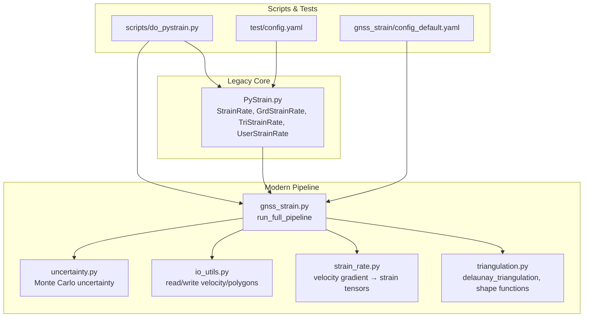
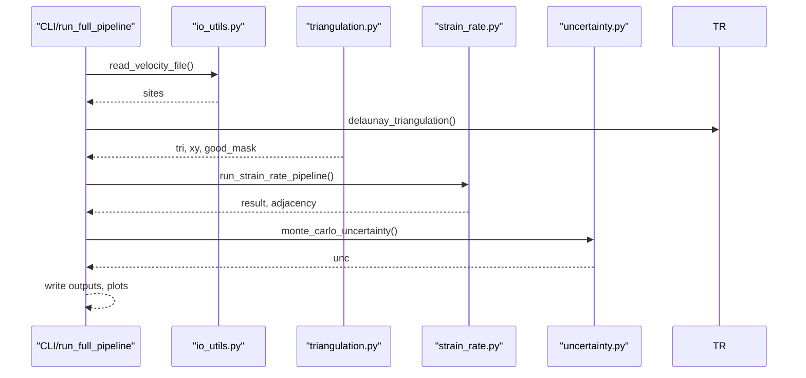
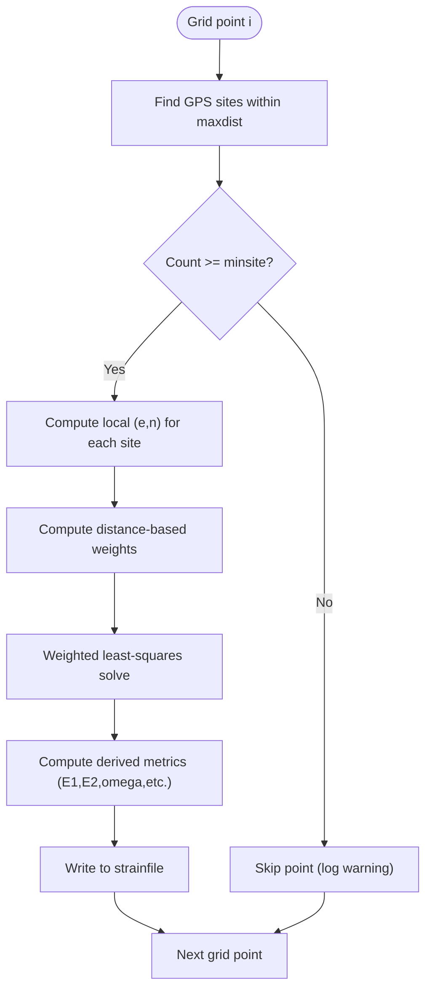
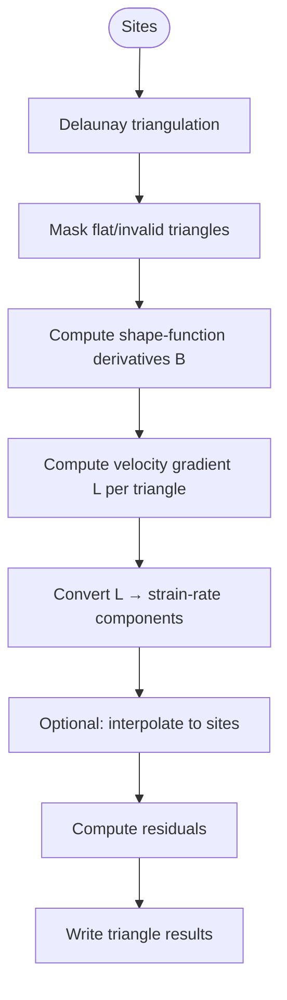
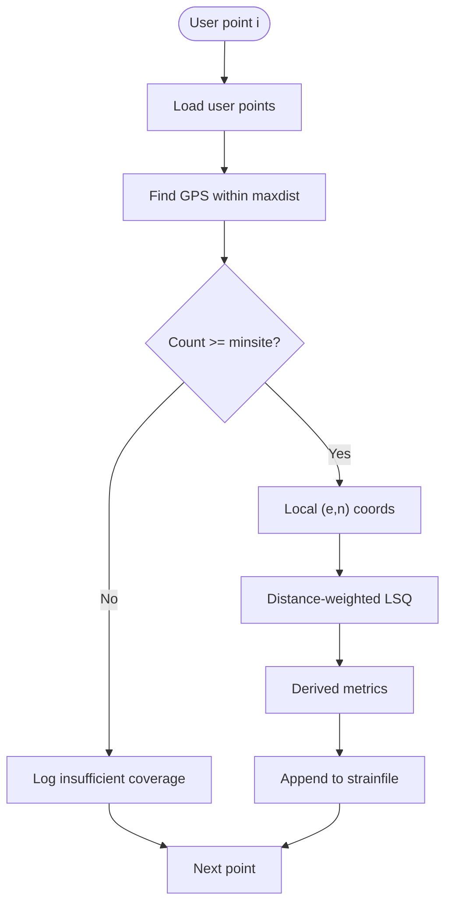
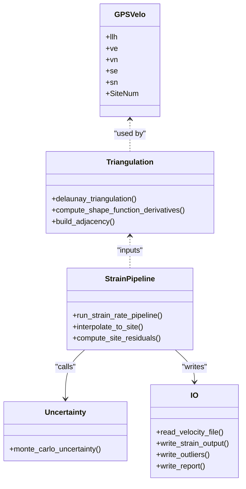
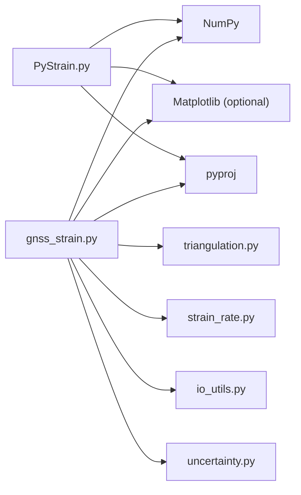

# Strain Estimation Methods

<cite>
**Referenced Files in This Document**
- [PyStrain.py](file://src/pystrain/PyStrain.py)
- [UserStrainRate.py](file://src/pystrain/UserStrainRate.py)
- [gnss_strain.py](file://src/pystrain/gnss_strain/gnss_strain.py)
- [strain_rate.py](file://src/pystrain/gnss_strain/strain_rate.py)
- [triangulation.py](file://src/pystrain/gnss_strain/triangulation.py)
- [io_utils.py](file://src/pystrain/gnss_strain/io_utils.py)
- [config_default.yaml](file://src/pystrain/gnss_strain/config_default.yaml)
- [do_pystrain.py](file://src/pystrain/scripts/do_pystrain.py)
- [config.yaml](file://test/config.yaml)
</cite>

## Table of Contents
1. [Introduction](#introduction)
2. [Project Structure](#project-structure)
3. [Core Components](#core-components)
4. [Architecture Overview](#architecture-overview)
5. [Detailed Component Analysis](#detailed-component-analysis)
6. [Dependency Analysis](#dependency-analysis)
7. [Performance Considerations](#performance-considerations)
8. [Troubleshooting Guide](#troubleshooting-guide)
9. [Conclusion](#conclusion)
10. [Appendices](#appendices)

## Introduction
This document explains PyStrain’s three primary strain estimation methodologies: grid-based, triangular mesh, and user-defined point analysis. It covers theoretical foundations, implementation details, and practical guidance for selecting and optimizing methods. It also documents the UserStrainRate class and its integration with the broader framework, along with method selection criteria, parameter optimization, and validation strategies.

## Project Structure
PyStrain is organized into:
- Core strain estimation classes and utilities in the legacy module
- A modern GNSS-strain pipeline under gnss_strain with triangulation, strain-rate computation, uncertainty, and I/O
- Scripts and tests supporting configuration-driven workflows

**Diagram sources**
- [PyStrain.py:517-854](file://src/pystrain/PyStrain.py#L517-L854)
- [gnss_strain.py:52-341](file://src/pystrain/gnss_strain/gnss_strain.py#L52-L341)
- [triangulation.py:89-146](file://src/pystrain/gnss_strain/triangulation.py#L89-L146)
- [strain_rate.py:18-437](file://src/pystrain/gnss_strain/strain_rate.py#L18-L437)
- [io_utils.py:21-132](file://src/pystrain/gnss_strain/io_utils.py#L21-L132)
- [do_pystrain.py:1-39](file://src/pystrain/scripts/do_pystrain.py#L1-L39)
- [config.yaml:1-123](file://test/config.yaml#L1-L123)
- [config_default.yaml:1-69](file://src/pystrain/gnss_strain/config_default.yaml#L1-L69)

**Section sources**
- [PyStrain.py:517-854](file://src/pystrain/PyStrain.py#L517-L854)
- [gnss_strain.py:52-341](file://src/pystrain/gnss_strain/gnss_strain.py#L52-L341)
- [triangulation.py:89-146](file://src/pystrain/gnss_strain/triangulation.py#L89-L146)
- [strain_rate.py:18-437](file://src/pystrain/gnss_strain/strain_rate.py#L18-L437)
- [io_utils.py:21-132](file://src/pystrain/gnss_strain/io_utils.py#L21-L132)
- [do_pystrain.py:1-39](file://src/pystrain/scripts/do_pystrain.py#L1-L39)
- [config.yaml:1-123](file://test/config.yaml#L1-L123)
- [config_default.yaml:1-69](file://src/pystrain/gnss_strain/config_default.yaml#L1-L69)

## Core Components
- StrainRate base class orchestrates configuration and delegates to specific estimators.
- GrdStrainRate computes strain on a regular grid using local coordinate transforms and weighted least-squares.
- TriStrainRate performs Delaunay triangulation-based estimation with shape-function gradients.
- UserStrainRate enables custom point analysis via a user-provided point list.
- Modern pipeline adds robust triangulation quality control, smoothing, uncertainty quantification, and visualization.

**Section sources**
- [PyStrain.py:517-854](file://src/pystrain/PyStrain.py#L517-L854)
- [gnss_strain.py:52-341](file://src/pystrain/gnss_strain/gnss_strain.py#L52-L341)
- [UserStrainRate.py:1-126](file://src/pystrain/UserStrainRate.py#L1-L126)

## Architecture Overview
The modern pipeline integrates triangulation, strain-rate computation, smoothing, and uncertainty estimation into a cohesive workflow.

**Diagram sources**
- [gnss_strain.py:52-341](file://src/pystrain/gnss_strain/gnss_strain.py#L52-L341)
- [triangulation.py:89-146](file://src/pystrain/gnss_strain/triangulation.py#L89-L146)
- [strain_rate.py:384-437](file://src/pystrain/gnss_strain/strain_rate.py#L384-L437)
- [io_utils.py:21-132](file://src/pystrain/gnss_strain/io_utils.py#L21-L132)

## Detailed Component Analysis

### Grid-Based Method (GrdStrainRate)
- Purpose: Estimate strain at a fixed regular grid covering the region.
- Implementation highlights:
  - Generates grid points from bounds and spacing.
  - For each grid point, finds nearby GPS sites within a maximum distance and with a minimum count.
  - Transforms GPS site coordinates to a local UTM-based Cartesian centered at the grid point.
  - Solves a weighted least-squares problem to estimate the strain rate tensor and derived quantities.
  - Outputs a formatted file containing strain components and derived metrics.

**Diagram sources**
- [PyStrain.py:552-729](file://src/pystrain/PyStrain.py#L552-L729)

**Section sources**
- [PyStrain.py:552-729](file://src/pystrain/PyStrain.py#L552-L729)

### Triangular Mesh Method (TriStrainRate)
- Purpose: Estimate strain within each valid triangle of a Delaunay triangulation.
- Implementation highlights:
  - Constructs a triangulation from GPS site coordinates and masks flat or degenerate triangles.
  - Computes shape-function derivatives for each triangle to derive velocity gradient tensors.
  - Converts gradients to strain-rate components and derived invariants.
  - Optionally interpolates results to individual GPS sites and computes residuals.

**Diagram sources**
- [PyStrain.py:730-800](file://src/pystrain/PyStrain.py#L730-L800)
- [triangulation.py:312-368](file://src/pystrain/gnss_strain/triangulation.py#L312-L368)
- [strain_rate.py:18-198](file://src/pystrain/gnss_strain/strain_rate.py#L18-L198)

**Section sources**
- [PyStrain.py:730-800](file://src/pystrain/PyStrain.py#L730-L800)
- [triangulation.py:312-368](file://src/pystrain/gnss_strain/triangulation.py#L312-L368)
- [strain_rate.py:18-198](file://src/pystrain/gnss_strain/strain_rate.py#L18-L198)

### User-Defined Point Analysis (UserStrainRate)
- Purpose: Compute strain at arbitrary user-specified locations.
- Implementation highlights:
  - Reads a user point list (longitude, latitude, optional site name).
  - For each point, gathers surrounding GPS sites within a radius and meeting a minimum count.
  - Transforms to local coordinates and solves the weighted least-squares problem.
  - Writes results to a designated output file.

**Diagram sources**
- [UserStrainRate.py:1-126](file://src/pystrain/UserStrainRate.py#L1-L126)
- [PyStrain.py:810-854](file://src/pystrain/PyStrain.py#L810-L854)

**Section sources**
- [UserStrainRate.py:1-126](file://src/pystrain/UserStrainRate.py#L1-L126)
- [PyStrain.py:810-854](file://src/pystrain/PyStrain.py#L810-L854)

### Modern Pipeline Components
- Triangulation and Quality Control:
  - Projects coordinates to UTM-equivalent plane, constructs Delaunay triangulation, and filters triangles by minimum angle, maximum edge thresholds, and area ratios.
- Strain-Rate Computation:
  - Shape-function derivatives per triangle yield velocity gradients; batch conversion to strain-rate components and derived invariants.
- Smoothing:
  - Spatial smoothing via weighted averaging among neighboring triangles over multiple iterations.
- Uncertainty:
  - Monte Carlo sampling of velocity vectors respecting correlations and uncertainties to estimate standard deviations.
- I/O and Visualization:
  - Writes triangle results, outlier reports, and generates diagnostic plots.

**Diagram sources**
- [gnss_strain.py:52-341](file://src/pystrain/gnss_strain/gnss_strain.py#L52-L341)
- [triangulation.py:89-146](file://src/pystrain/gnss_strain/triangulation.py#L89-L146)
- [strain_rate.py:384-437](file://src/pystrain/gnss_strain/strain_rate.py#L384-L437)
- [io_utils.py:186-270](file://src/pystrain/gnss_strain/io_utils.py#L186-L270)

**Section sources**
- [gnss_strain.py:52-341](file://src/pystrain/gnss_strain/gnss_strain.py#L52-L341)
- [triangulation.py:89-146](file://src/pystrain/gnss_strain/triangulation.py#L89-L146)
- [strain_rate.py:384-437](file://src/pystrain/gnss_strain/strain_rate.py#L384-L437)
- [io_utils.py:186-270](file://src/pystrain/gnss_strain/io_utils.py#L186-L270)

## Dependency Analysis
- Legacy classes depend on:
  - GPS velocity loader and geometry utilities (local coordinate transforms, distance/azimuth computations).
  - Weighted least-squares solver embedded in the base Strain class.
- Modern pipeline depends on:
  - scipy.spatial.Delaunay for triangulation.
  - NumPy for numerical operations.
  - Matplotlib for plotting (optional).
  - pyproj for coordinate transformations.

**Diagram sources**
- [PyStrain.py:1-100](file://src/pystrain/PyStrain.py#L1-L100)
- [gnss_strain.py:10-28](file://src/pystrain/gnss_strain/gnss_strain.py#L10-L28)

**Section sources**
- [PyStrain.py:1-100](file://src/pystrain/PyStrain.py#L1-L100)
- [gnss_strain.py:10-28](file://src/pystrain/gnss_strain/gnss_strain.py#L10-L28)

## Performance Considerations
- Grid-based method:
  - Complexity scales with number of grid points and average number of nearby GPS sites per point.
  - Distance-weighting reduces influence of distant observations; tuning maxdist and minsite balances resolution and stability.
- Triangular mesh method:
  - Complexity dominated by triangulation and shape-function computations; quality filtering reduces downstream noise.
  - Smoothing iterations improve spatial coherence at cost of extra passes over fields.
- User-defined points:
  - Similar scaling to grid-based but tailored to sparse or targeted regions.
- Recommendations:
  - Adjust min_angle_deg and max_edge_pctl/factor to balance triangle quality and coverage.
  - Use smoothing_weight and iterations judiciously to avoid over-smoothing boundaries.
  - Enable thin_sites_by_spacing to mitigate clustering artifacts.

[No sources needed since this section provides general guidance]

## Troubleshooting Guide
- Insufficient GPS coverage:
  - Increase maxdist or minsite; verify azimuth checks are not overly restrictive.
- Poor triangle quality:
  - Relax min_angle_deg or adjust max_edge_pctl/factor; consider absolute max_edge_km cutoff.
- Convergence warnings:
  - Reduce smoothing weight or iterations; verify velocity uncertainties are non-zero.
- Output artifacts near boundaries:
  - Increase smoothing iterations; consider polygon clipping or boundary padding.

**Section sources**
- [PyStrain.py:582-729](file://src/pystrain/PyStrain.py#L582-L729)
- [gnss_strain.py:166-168](file://src/pystrain/gnss_strain/gnss_strain.py#L166-L168)

## Conclusion
PyStrain offers three complementary approaches to estimate crustal strain from GNSS velocities. The grid-based method provides global coverage with straightforward control over resolution. The triangular mesh method leverages geometric triangulation and shape functions for localized estimates with built-in smoothing and uncertainty quantification. The user-defined point method targets specific regions or sites. Selecting the appropriate method depends on data density, spatial variability, and computational needs, with modern pipeline parameters enabling robust, validated results.

[No sources needed since this section summarizes without analyzing specific files]

## Appendices

### Method Selection Criteria
- Choose grid-based when:
  - Broad regional coverage is desired with uniform sampling.
  - Computational simplicity and reproducibility are priorities.
- Choose triangular mesh when:
  - Data density varies spatially and local adaptivity is beneficial.
  - Smoothing and uncertainty quantification are important.
- Choose user-defined points when:
  - Specific sites or small regions require focused analysis.

### Parameter Optimization Tips
- Triangulation:
  - Start with min_angle_deg ≈ 10°; adjust max_edge_pctl and max_edge_factor to exclude long-range connections.
- Smoothing:
  - Begin with smooth_weight ≈ 0.3 and iterate until spatial patterns stabilize.
- Coverage:
  - Set minsite to ensure reliable inversion; tune maxdist to include sufficient neighbors without introducing outliers.

### Result Validation Strategies
- Cross-validation: Compare smoothed and unsmoothed results; inspect residual norms.
- Sensitivity tests: Vary minsite and maxdist to assess stability.
- Uncertainty inspection: Examine Monte Carlo-derived standard deviations for spatial coherence.

**Section sources**
- [config_default.yaml:29-62](file://src/pystrain/gnss_strain/config_default.yaml#L29-L62)
- [gnss_strain.py:236-258](file://src/pystrain/gnss_strain/gnss_strain.py#L236-L258)