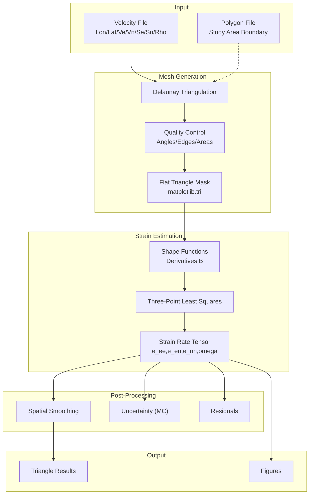
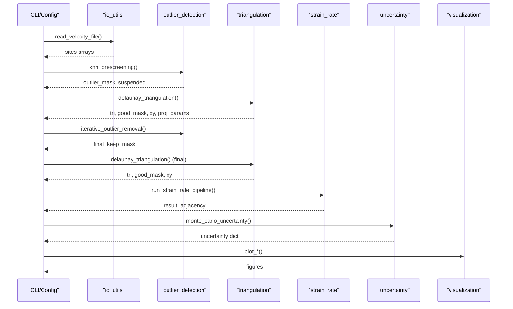
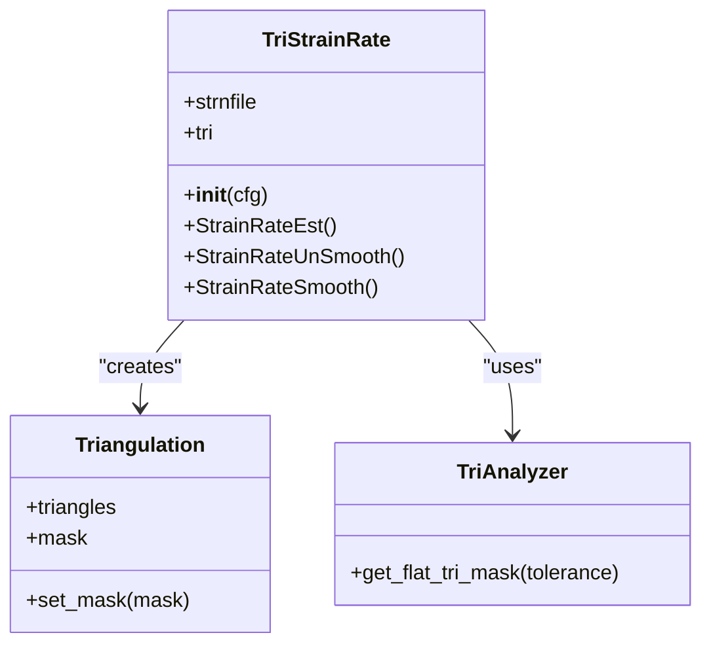
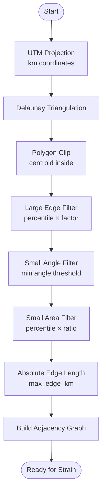
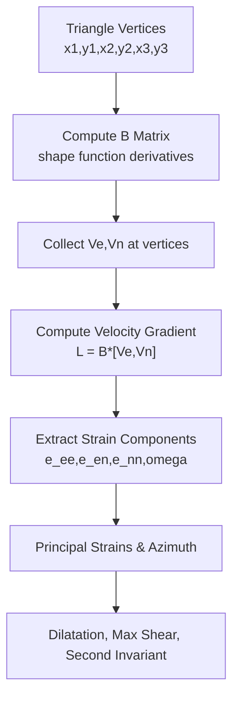
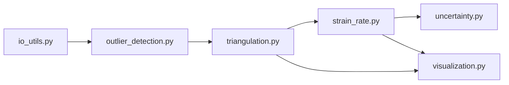

# Triangular Mesh Strain Estimation

<cite>
**Referenced Files in This Document**
- [PyStrain.py](file://src/pystrain/PyStrain.py)
- [triangulation.py](file://src/pystrain/gnss_strain/triangulation.py)
- [strain_rate.py](file://src/pystrain/gnss_strain/strain_rate.py)
- [gnss_strain.py](file://src/pystrain/gnss_strain/gnss_strain.py)
- [outlier_detection.py](file://src/pystrain/gnss_strain/outlier_detection.py)
- [uncertainty.py](file://src/pystrain/gnss_strain/uncertainty.py)
- [io_utils.py](file://src/pystrain/gnss_strain/io_utils.py)
- [visualization.py](file://src/pystrain/gnss_strain/visualization.py)
- [config_default.yaml](file://src/pystrain/gnss_strain/config_default.yaml)
- [config.yaml](file://test/config.yaml)
</cite>

## Table of Contents
1. [Introduction](#introduction)
2. [Project Structure](#project-structure)
3. [Core Components](#core-components)
4. [Architecture Overview](#architecture-overview)
5. [Detailed Component Analysis](#detailed-component-analysis)
6. [Dependency Analysis](#dependency-analysis)
7. [Performance Considerations](#performance-considerations)
8. [Troubleshooting Guide](#troubleshooting-guide)
9. [Conclusion](#conclusion)
10. [Appendices](#appendices)

## Introduction
This document explains the triangular mesh strain estimation method implemented in the PyStrain project, focusing on the TriStrainRate class and its integration with matplotlib.tri. It covers Delaunay triangulation of GPS station networks, triangle quality assessment using TriAnalyzer, flat triangle detection and masking, strain rate computation at triangle centers using three-point least squares, and the smoothing approach. Practical guidance is provided for parameter tuning, handling edge cases, and balancing spatial resolution versus noise reduction.

## Project Structure
The strain estimation pipeline is organized into modular components:
- Triangulation and mesh quality control
- Strain rate computation per triangle
- Smoothing and interpolation
- Outlier detection and iterative refinement
- Uncertainty propagation
- I/O and visualization

**Diagram sources**
- [gnss_strain.py:92-230](file://src/pystrain/gnss_strain/gnss_strain.py#L92-L230)
- [triangulation.py:89-146](file://src/pystrain/gnss_strain/triangulation.py#L89-L146)
- [strain_rate.py:126-198](file://src/pystrain/gnss_strain/strain_rate.py#L126-L198)
- [uncertainty.py:14-42](file://src/pystrain/gnss_strain/uncertainty.py#L14-L42)
- [visualization.py:18-105](file://src/pystrain/gnss_strain/visualization.py#L18-L105)

**Section sources**
- [gnss_strain.py:52-341](file://src/pystrain/gnss_strain/gnss_strain.py#L52-L341)
- [config_default.yaml:1-69](file://src/pystrain/gnss_strain/config_default.yaml#L1-L69)

## Core Components
- TriStrainRate: Implements triangular mesh strain estimation using matplotlib.tri, including flat triangle detection and masked triangulation.
- triangulation.py: Provides Delaunay triangulation, polygon clipping, quality filters (angles, edges, areas), shape function derivatives, adjacency graph, and site thinning.
- strain_rate.py: Computes velocity gradients, strain tensors, principal strains, invariants, smoothing, interpolation, and residual computation.
- outlier_detection.py: KNN prescreening and iterative outlier removal using triangulation-based residuals.
- uncertainty.py: Monte Carlo propagation of velocity uncertainties to strain rate outputs.
- io_utils.py: Velocity/polygon file I/O and output writing.
- visualization.py: Plotting triangulation, scalar fields, and principal strain cross plots.

**Section sources**
- [PyStrain.py:730-807](file://src/pystrain/PyStrain.py#L730-L807)
- [triangulation.py:89-477](file://src/pystrain/gnss_strain/triangulation.py#L89-L477)
- [strain_rate.py:18-437](file://src/pystrain/gnss_strain/strain_rate.py#L18-L437)
- [outlier_detection.py:17-292](file://src/pystrain/gnss_strain/outlier_detection.py#L17-L292)
- [uncertainty.py:14-150](file://src/pystrain/gnss_strain/uncertainty.py#L14-L150)
- [io_utils.py:21-270](file://src/pystrain/gnss_strain/io_utils.py#L21-L270)
- [visualization.py:18-250](file://src/pystrain/gnss_strain/visualization.py#L18-L250)

## Architecture Overview
The end-to-end pipeline integrates mesh generation, quality control, strain computation, smoothing, uncertainty, and visualization.

**Diagram sources**
- [gnss_strain.py:92-341](file://src/pystrain/gnss_strain/gnss_strain.py#L92-L341)
- [outlier_detection.py:184-292](file://src/pystrain/gnss_strain/outlier_detection.py#L184-L292)
- [triangulation.py:89-146](file://src/pystrain/gnss_strain/triangulation.py#L89-L146)
- [strain_rate.py:384-437](file://src/pystrain/gnss_strain/strain_rate.py#L384-L437)
- [uncertainty.py:14-42](file://src/pystrain/gnss_strain/uncertainty.py#L14-L42)
- [visualization.py:18-105](file://src/pystrain/gnss_strain/visualization.py#L18-L105)

## Detailed Component Analysis

### TriStrainRate Class and matplotlib.tri Integration
The TriStrainRate class builds a triangular mesh from GPS station coordinates and applies flat triangle detection to remove degenerate triangles.

Key steps:
- Construct triangulation from Lon/Lat coordinates.
- Use TriAnalyzer to compute flat triangle mask with a tolerance.
- Apply mask to the triangulation to exclude flat triangles.
- Iterate over unmasked triangles to compute strain rates at triangle centers.

**Diagram sources**
- [PyStrain.py:730-807](file://src/pystrain/PyStrain.py#L730-L807)

**Section sources**
- [PyStrain.py:730-807](file://src/pystrain/PyStrain.py#L730-L807)

### Delaunay Triangulation and Quality Assessment
The triangulation module performs:
- Coordinate projection (UTM) to meters, then kilometers for strain units.
- Full Delaunay triangulation.
- Polygon clipping using matplotlib Path.
- Quality filters:
  - Large edges: percentile-based thresholds with a multiplicative factor.
  - Small angles: minimum internal angle threshold.
  - Small areas: percentile-based lower bound.
- Absolute edge length cutoff (optional).
- Shape function derivative computation for each triangle.
- Adjacency graph construction for smoothing.
- Hanging site detection and site thinning by spacing.

**Diagram sources**
- [triangulation.py:89-146](file://src/pystrain/gnss_strain/triangulation.py#L89-L146)
- [triangulation.py:170-256](file://src/pystrain/gnss_strain/triangulation.py#L170-L256)
- [triangulation.py:312-368](file://src/pystrain/gnss_strain/triangulation.py#L312-L368)
- [triangulation.py:375-416](file://src/pystrain/gnss_strain/triangulation.py#L375-L416)

**Section sources**
- [triangulation.py:89-256](file://src/pystrain/gnss_strain/triangulation.py#L89-L256)
- [triangulation.py:312-416](file://src/pystrain/gnss_strain/triangulation.py#L312-L416)

### Flat Triangle Detection and Masking
Flat triangle detection identifies nearly degenerate triangles that cause numerical instabilities. The process:
- Compute triangle normals via cross product in projected coordinates.
- Flag triangles whose normal magnitude falls below a tolerance fraction of the mean triangle area.
- Apply mask to exclude these triangles from subsequent computations.

Practical guidance:
- Adjust tolerance to balance sensitivity vs. robustness.
- Inspect masked triangle count to ensure sufficient coverage remains.

**Section sources**
- [PyStrain.py:748-752](file://src/pystrain/PyStrain.py#L748-L752)

### Strain Rate Computation at Triangle Centers
Each triangle’s strain rate is computed using a three-point least squares solution:
- Shape function derivatives (B matrix) derived from triangle vertex coordinates.
- Velocity gradient computed as L = [B @ ve, B @ vn].
- Strain rate tensor components extracted from L.
- Principal strains and orientations computed from eigen-decomposition.
- Derived invariants (dilatation, maximum shear, second invariant).

**Diagram sources**
- [strain_rate.py:18-57](file://src/pystrain/gnss_strain/strain_rate.py#L18-L57)
- [strain_rate.py:126-198](file://src/pystrain/gnss_strain/strain_rate.py#L126-L198)
- [triangulation.py:312-368](file://src/pystrain/gnss_strain/triangulation.py#L312-L368)

**Section sources**
- [strain_rate.py:18-198](file://src/pystrain/gnss_strain/strain_rate.py#L18-L198)
- [triangulation.py:312-368](file://src/pystrain/gnss_strain/triangulation.py#L312-L368)

### Smoothing Approach: Unsmoothed vs Smoothed
- Unsmoothed: Each triangle’s strain rate is computed independently.
- Smoothed: Spatial averaging across adjacent triangles with weighted blending. The smoother iteratively updates each triangle’s values using neighbor averages, reducing noise at the cost of spatial resolution.

Trade-offs:
- Higher smoothing weight increases noise reduction but may blur sharp gradients.
- More iterations increase diffusion; fewer iterations preserve local detail.

**Section sources**
- [strain_rate.py:205-271](file://src/pystrain/gnss_strain/strain_rate.py#L205-L271)

### Parameter Tuning and Mesh Generation
Recommended tuning strategy:
- Start with conservative angle and edge thresholds; relax gradually if coverage is poor.
- Use absolute edge length cutoff to prevent spurious connections across large gaps.
- Thin dense regions to avoid small, poorly conditioned triangles.
- Validate triangle quality statistics and adjust thresholds accordingly.

Common parameters:
- min_angle_deg: typical 10–20 degrees.
- max_edge_pctl: typical 90–95 percentiles.
- max_edge_factor: typical 1.2–2.0.
- min_spacing_km: approximately 1/3 to 1/2 of average spacing.
- max_edge_km: study region-dependent upper bound.

**Section sources**
- [config_default.yaml:29-48](file://src/pystrain/gnss_strain/config_default.yaml#L29-L48)
- [triangulation.py:89-146](file://src/pystrain/gnss_strain/triangulation.py#L89-L146)

### Handling Edge Cases and Insufficient Triangles
- If fewer than three valid triangles remain after quality filtering, the pipeline raises an error indicating constraints should be relaxed.
- Iterative outlier removal reduces influence of extreme outliers; ensure sufficient stations remain for triangulation.
- Polygon clipping ensures only triangles with centroids inside the study area are retained.

**Section sources**
- [gnss_strain.py:166-168](file://src/pystrain/gnss_strain/gnss_strain.py#L166-L168)
- [gnss_strain.py:218-219](file://src/pystrain/gnss_strain/gnss_strain.py#L218-L219)

### Impact of Triangle Geometry on Accuracy
- Well-conditioned triangles (avoiding near-flat shapes) improve numerical stability and reduce variance in strain estimates.
- Larger triangles average over more data, potentially increasing robustness but decreasing spatial resolution.
- Smaller triangles capture finer detail but may amplify noise and require stronger smoothing.

[No sources needed since this section provides general guidance]

### Comparison Between Smoothed and Unsmoothed Approaches
- Unsmoothed preserves fine-scale features but may exhibit noise.
- Smoothed reduces noise and improves spatial coherence but can smooth sharp gradients.

[No sources needed since this section provides general guidance]

## Dependency Analysis
The system exhibits clear layering:
- Input I/O depends on file formats and polygon definitions.
- Mesh generation depends on scipy.spatial.Delaunay and matplotlib.tri.
- Strain computation depends on shape function derivatives and linear algebra.
- Smoothing depends on adjacency graph construction.
- Uncertainty depends on Monte Carlo sampling of velocity covariances.
- Visualization depends on matplotlib plotting primitives.

**Diagram sources**
- [gnss_strain.py:17-27](file://src/pystrain/gnss_strain/gnss_strain.py#L17-L27)
- [strain_rate.py:9-11](file://src/pystrain/gnss_strain/strain_rate.py#L9-L11)
- [uncertainty.py:9-11](file://src/pystrain/gnss_strain/uncertainty.py#L9-L11)

**Section sources**
- [gnss_strain.py:17-27](file://src/pystrain/gnss_strain/gnss_strain.py#L17-L27)
- [strain_rate.py:9-11](file://src/pystrain/gnss_strain/strain_rate.py#L9-L11)
- [uncertainty.py:9-11](file://src/pystrain/gnss_strain/uncertainty.py#L9-L11)

## Performance Considerations
- Computational complexity:
  - Delaunay triangulation: O(N log N) average for 2D.
  - Quality filtering: O(N_tri) passes over triangles.
  - Strain computation: O(N_tri).
  - Smoothing: O(N_tri × avg_degree × iterations).
  - Monte Carlo uncertainty: O(M × N_tri), where M is iteration count.
- Memory optimization:
  - Use masks to avoid storing invalid triangles.
  - Thin dense station networks to reduce N_tri.
  - Precompute B matrices and areas once per triangulation.
  - Limit MC iterations for quick runs; increase for stability.
- Parallelization opportunities:
  - Batch processing of triangles is embarrassingly parallel.
  - Monte Carlo sampling can be parallelized across iterations.

[No sources needed since this section provides general guidance]

## Troubleshooting Guide
- Not enough triangles after filtering:
  - Relax min_angle_deg, increase max_edge_pctl, or decrease max_edge_factor.
  - Enable min_spacing_km to thin overly dense regions.
- Poor boundary coverage:
  - Adjust polygon or enable automatic convex hull generation.
- Excessive noise:
  - Increase smoothing weight and iterations.
  - Reduce triangle size by relaxing edge thresholds.
- Outliers affecting results:
  - Increase k_neighbors and mad_factor for KNN prescreening.
  - Increase iqr_factor for residual-based detection.
- Slow performance:
  - Reduce MC iterations.
  - Thin stations or limit study area.

**Section sources**
- [gnss_strain.py:166-168](file://src/pystrain/gnss_strain/gnss_strain.py#L166-L168)
- [config_default.yaml:19-62](file://src/pystrain/gnss_strain/config_default.yaml#L19-L62)

## Conclusion
The triangular mesh strain estimation method combines robust Delaunay triangulation, quality control, and shape-function-based strain computation to produce reliable strain rate maps. The integration with matplotlib.tri enables efficient flat triangle detection and masked triangulation. Smoothing enhances spatial coherence while preserving accuracy when tuned appropriately. Proper parameter selection and iterative outlier removal ensure reliable results across diverse datasets.

## Appendices

### Practical Examples
- Triangle quality assessment:
  - Inspect the number of good triangles and their distribution.
  - Adjust min_angle_deg and max_edge_pctl to improve coverage.
- Parameter tuning:
  - Start with conservative thresholds; iteratively relax to achieve adequate coverage.
  - Use min_spacing_km to mitigate clustering effects.
- Handling edge cases:
  - If triangles are insufficient, relax constraints or expand the study area.
  - Use polygon clipping to focus on regions with sufficient station density.

**Section sources**
- [gnss_strain.py:161-168](file://src/pystrain/gnss_strain/gnss_strain.py#L161-L168)
- [config_default.yaml:29-48](file://src/pystrain/gnss_strain/config_default.yaml#L29-L48)