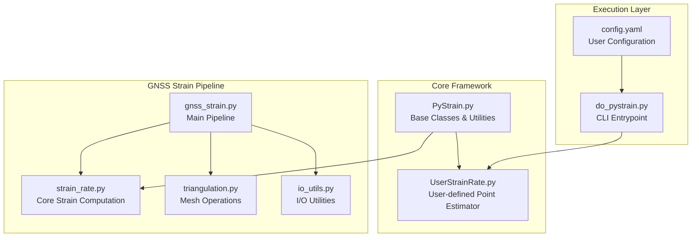
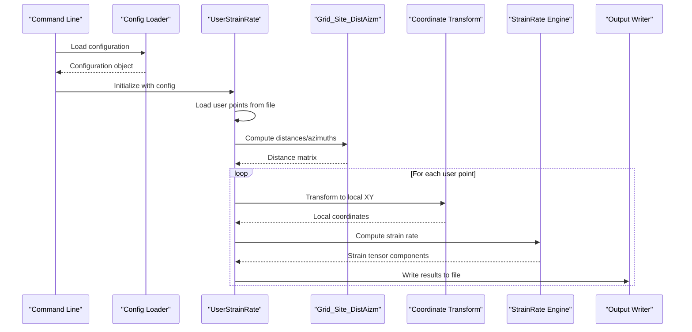
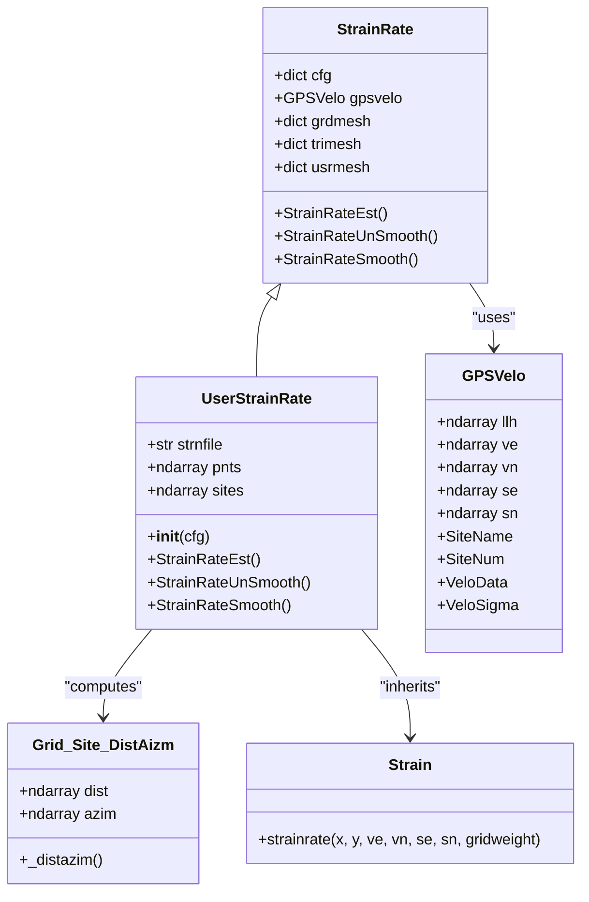
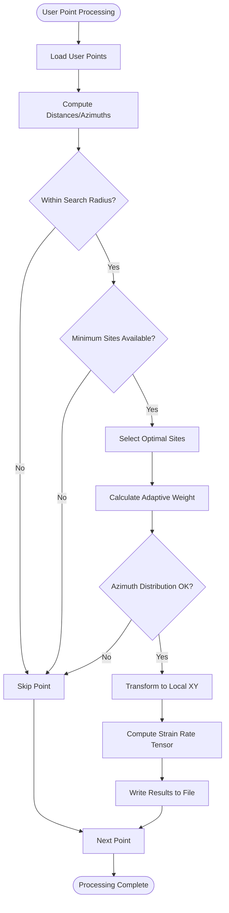
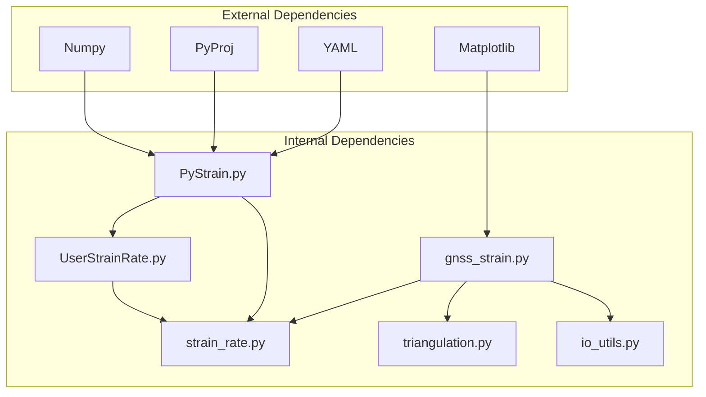

# User-defined Point Strain Estimation

<cite>
**Referenced Files in This Document**
- [UserStrainRate.py](file://src/pystrain/UserStrainRate.py)
- [PyStrain.py](file://src/pystrain/PyStrain.py)
- [gnss_strain.py](file://src/pystrain/gnss_strain/gnss_strain.py)
- [strain_rate.py](file://src/pystrain/gnss_strain/strain_rate.py)
- [triangulation.py](file://src/pystrain/gnss_strain/triangulation.py)
- [io_utils.py](file://src/pystrain/gnss_strain/io_utils.py)
- [do_pystrain.py](file://src/pystrain/scripts/do_pystrain.py)
- [config_default.yaml](file://src/pystrain/gnss_strain/config_default.yaml)
- [config.yaml](file://test/config.yaml)
</cite>

## Table of Contents
1. [Introduction](#introduction)
2. [Project Structure](#project-structure)
3. [Core Components](#core-components)
4. [Architecture Overview](#architecture-overview)
5. [Detailed Component Analysis](#detailed-component-analysis)
6. [Dependency Analysis](#dependency-analysis)
7. [Performance Considerations](#performance-considerations)
8. [Troubleshooting Guide](#troubleshooting-guide)
9. [Conclusion](#conclusion)

## Introduction
This document provides comprehensive technical documentation for the user-defined point strain estimation method implemented in the PyStrain framework. The focus is on the UserStrainRate class, which enables flexible strain rate computation at arbitrary user-specified geographic coordinates independent of the standard GPS station distribution. The implementation combines a distance-weighted estimation approach with adaptive weighting based on local station density, coordinate transformation to local Cartesian systems, and seamless integration with the core strain rate computation algorithm.

## Project Structure
The user-defined point strain estimation functionality spans several modules within the PyStrain codebase:

**Diagram sources**
- [PyStrain.py:1-1481](file://src/pystrain/PyStrain.py#L1-L1481)
- [UserStrainRate.py:1-126](file://src/pystrain/UserStrainRate.py#L1-L126)
- [gnss_strain.py:1-407](file://src/pystrain/gnss_strain/gnss_strain.py#L1-L407)

**Section sources**
- [PyStrain.py:1-1481](file://src/pystrain/PyStrain.py#L1-L1481)
- [UserStrainRate.py:1-126](file://src/pystrain/UserStrainRate.py#L1-L126)
- [gnss_strain.py:1-407](file://src/pystrain/gnss_strain/gnss_strain.py#L1-L407)

## Core Components
The user-defined point strain estimation system comprises several interconnected components:

### Base Infrastructure
- **StrainRate**: Abstract base class providing shared functionality for all strain estimation methods
- **GPSVelo**: GPS velocity data container with support for multiple input formats
- **Grid_Site_DistAizm**: Distance and azimuth calculator between grid points and GPS stations
- **Strain**: Core strain rate computation engine with weighted least squares solver

### User-defined Point Implementation
- **UserStrainRate**: Specialized class implementing strain rate estimation at user-specified coordinates
- **llh2localxy**: Local Cartesian coordinate transformation using polyconic projection
- **llh2utm**: Alternative UTM-based coordinate transformation

### Configuration Management
- **Config**: YAML-based configuration loader with default parameter values
- **Parameter groups**: Separate configuration sections for grid mesh, triangular mesh, and user mesh methods

**Section sources**
- [PyStrain.py:517-550](file://src/pystrain/PyStrain.py#L517-L550)
- [PyStrain.py:518-547](file://src/pystrain/PyStrain.py#L518-L547)
- [PyStrain.py:810-854](file://src/pystrain/PyStrain.py#L810-L854)
- [PyStrain.py:52-95](file://src/pystrain/PyStrain.py#L52-L95)

## Architecture Overview
The user-defined point strain estimation follows a structured pipeline that integrates seamlessly with the broader PyStrain framework:

**Diagram sources**
- [do_pystrain.py:7-39](file://src/pystrain/scripts/do_pystrain.py#L7-L39)
- [UserStrainRate.py:30-119](file://src/pystrain/UserStrainRate.py#L30-L119)
- [PyStrain.py:473-514](file://src/pystrain/PyStrain.py#L473-L514)

## Detailed Component Analysis

### UserStrainRate Class Implementation
The UserStrainRate class extends the StrainRate base class to provide specialized functionality for user-defined point strain estimation:

**Diagram sources**
- [PyStrain.py:517-550](file://src/pystrain/PyStrain.py#L517-L550)
- [PyStrain.py:810-854](file://src/pystrain/PyStrain.py#L810-L854)
- [PyStrain.py:248-319](file://src/pystrain/PyStrain.py#L248-L319)
- [PyStrain.py:473-514](file://src/pystrain/PyStrain.py#L473-L514)

#### Initialization and Configuration
The UserStrainRate constructor initializes the class with configuration parameters and loads user-specified point coordinates:

Key initialization steps:
1. **Configuration loading**: Inherits GPS velocity configuration from base class
2. **Point file processing**: Reads user-defined coordinates from CSV file
3. **Output file setup**: Configures strain rate output file path

#### Distance-weighted Estimation Algorithm
The core estimation algorithm implements a sophisticated distance-weighted approach:

**Diagram sources**
- [UserStrainRate.py:40-119](file://src/pystrain/UserStrainRate.py#L40-L119)
- [PyStrain.py:473-514](file://src/pystrain/PyStrain.py#L473-L514)

#### Coordinate Transformation Process
The system employs two distinct coordinate transformation approaches:

1. **Local Cartesian System** (llh2localxy):
   - Uses polyconic projection for high-precision local transformations
   - Converts degrees to arcseconds for improved numerical stability
   - Provides east/north coordinate system centered at user point

2. **UTM-based System** (llh2utm):
   - Alternative transformation using Universal Transverse Mercator projection
   - Automatically determines UTM zone based on reference coordinates
   - Provides meter-scale coordinates for strain rate calculations

#### Adaptive Weighting Scheme
The implementation incorporates an adaptive weighting mechanism based on local station density:

Weight calculation formula:
- Distance-based exponential weighting: w = exp(-r²/R₀²)
- R₀ determined adaptively from minimum required sites
- Weighted least squares solver accounts for measurement uncertainties

**Section sources**
- [UserStrainRate.py:40-119](file://src/pystrain/UserStrainRate.py#L40-L119)
- [PyStrain.py:52-95](file://src/pystrain/PyStrain.py#L52-L95)
- [PyStrain.py:364-470](file://src/pystrain/PyStrain.py#L364-L470)

### Configuration Parameters
The user-defined point strain estimation supports extensive configuration options:

#### Basic Configuration Parameters
- **activate**: Enable/disable user mesh strain rate computation
- **strainfile**: Output file path for strain rate results
- **maxdist**: Maximum search radius for GPS station inclusion (km)
- **minsite**: Minimum number of GPS stations required per point
- **chkazim**: Azimuth distribution quality check flag

#### Advanced Configuration Options
- **usrsmooth.activate**: Enable/disable smoothing for user-defined points
- **usrsmooth.smoothfactor**: Smoothing weight factor for spatial averaging
- **usrpntfile**: Path to user-defined point coordinate file

#### File Format Specifications
User point coordinate files require three columns:
1. **Longitude** (decimal degrees)
2. **Latitude** (decimal degrees)  
3. **Site Identifier** (text label)

**Section sources**
- [config.yaml:40-61](file://test/config.yaml#L40-L61)
- [config_default.yaml:1-69](file://src/pystrain/gnss_strain/config_default.yaml#L1-L69)

### Integration with Core Strain Rate Computation
The UserStrainRate class seamlessly integrates with the core strain rate computation engine:

**Diagram sources**
- [PyStrain.py:364-470](file://src/pystrain/PyStrain.py#L364-L470)
- [UserStrainRate.py:845-921](file://src/pystrain/UserStrainRate.py#L845-L921)

**Section sources**
- [PyStrain.py:364-470](file://src/pystrain/PyStrain.py#L364-L470)
- [UserStrainRate.py:845-921](file://src/pystrain/UserStrainRate.py#L845-L921)

## Dependency Analysis
The user-defined point strain estimation system exhibits well-managed dependencies:

**Diagram sources**
- [PyStrain.py:9-20](file://src/pystrain/PyStrain.py#L9-L20)
- [UserStrainRate.py:1-3](file://src/pystrain/UserStrainRate.py#L1-L3)

### Coupling and Cohesion
- **High cohesion**: UserStrainRate focuses exclusively on user-defined point processing
- **Low coupling**: Minimal dependencies on external modules beyond essential scientific computing libraries
- **Clear separation of concerns**: Coordinate transformation, distance calculation, and strain computation are modularized

**Section sources**
- [PyStrain.py:1-800](file://src/pystrain/PyStrain.py#L1-L800)
- [UserStrainRate.py:1-126](file://src/pystrain/UserStrainRate.py#L1-L126)

## Performance Considerations
The user-defined point strain estimation system demonstrates several performance characteristics:

### Computational Complexity
- **Per-point complexity**: O(n_sites × n_parameters) where n_sites is the number of included GPS stations
- **Memory usage**: Linear with number of user points and included GPS stations
- **Scalability**: Efficient for moderate numbers of user points (≤1000)

### Optimization Strategies
1. **Early termination**: Points with insufficient nearby stations are skipped immediately
2. **Adaptive weighting**: Reduces computational load by excluding distant stations
3. **Efficient distance calculation**: Vectorized operations using NumPy
4. **Coordinate transformation caching**: Reusable transformation matrices for multiple points

### Memory Management
- **Dynamic allocation**: Arrays resized based on actual number of included stations
- **Temporary storage**: Minimized temporary variables during computation
- **File I/O**: Streaming output to avoid large memory buffers

## Troubleshooting Guide

### Common Issues and Solutions

#### Point File Loading Problems
**Issue**: User point file not found or incorrectly formatted
**Solution**: Verify file path exists and contains three columns (lon, lat, site_id)

#### Insufficient Station Coverage
**Issue**: Many points produce NaN results due to insufficient GPS stations
**Solutions**:
- Increase search radius (maxdist parameter)
- Reduce minimum station requirement (minsite parameter)
- Adjust coordinate transformation parameters

#### Poor Azimuth Distribution
**Issue**: Warning messages about unreasonable station distribution
**Solutions**:
- Check GPS station coverage around target points
- Consider alternative point locations
- Verify coordinate precision

#### Performance Issues
**Issue**: Slow computation for large numbers of user points
**Solutions**:
- Process points in batches
- Optimize search radius based on local station density
- Consider parallel processing for independent points

**Section sources**
- [UserStrainRate.py:22-26](file://src/pystrain/UserStrainRate.py#L22-L26)
- [UserStrainRate.py:61-67](file://src/pystrain/UserStrainRate.py#L61-L67)
- [UserStrainRate.py:84-87](file://src/pystrain/UserStrainRate.py#L84-L87)

## Conclusion
The user-defined point strain estimation method in PyStrain provides a powerful and flexible approach to strain rate computation at arbitrary geographic locations. The implementation successfully balances accuracy with computational efficiency while offering extensive customization options through its configuration system. Key advantages include:

- **Flexibility**: Arbitrary point placement independent of GPS station distribution
- **Adaptivity**: Distance-weighted estimation with automatic station selection
- **Accuracy**: Integration with established strain rate computation algorithms
- **Usability**: Comprehensive configuration options and error handling

The system serves as an excellent complement to traditional grid-based and triangular mesh approaches, particularly in scenarios requiring targeted strain rate measurements at strategically selected locations.