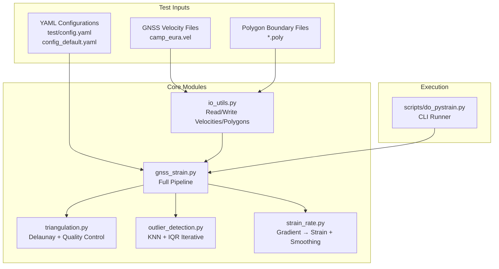
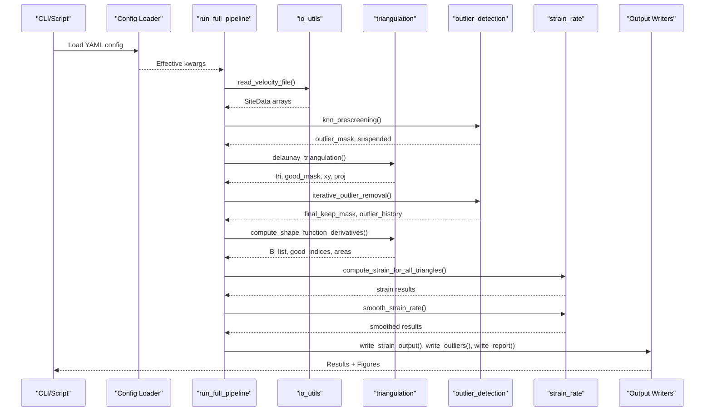
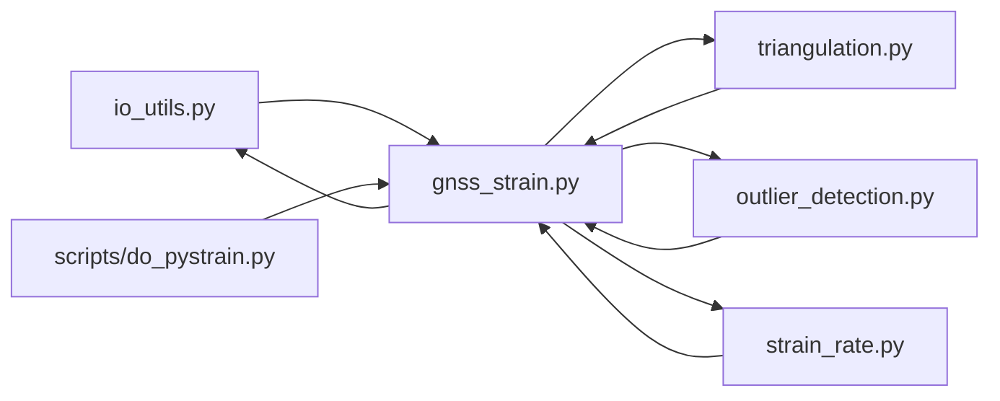

# Testing and Validation

<cite>
**Referenced Files in This Document**
- [test/config.yaml](file://test/config.yaml)
- [src/pystrain/gnss_strain/config_default.yaml](file://src/pystrain/gnss_strain/config_default.yaml)
- [src/pystrain/gnss_strain/gnss_strain.py](file://src/pystrain/gnss_strain/gnss_strain.py)
- [src/pystrain/gnss_strain/io_utils.py](file://src/pystrain/gnss_strain/io_utils.py)
- [src/pystrain/gnss_strain/triangulation.py](file://src/pystrain/gnss_strain/triangulation.py)
- [src/pystrain/gnss_strain/strain_rate.py](file://src/pystrain/gnss_strain/strain_rate.py)
- [src/pystrain/gnss_strain/outlier_detection.py](file://src/pystrain/gnss_strain/outlier_detection.py)
- [src/pystrain/gnss_strain/camp_eura.vel](file://src/pystrain/gnss_strain/camp_eura.vel)
- [src/pystrain/scripts/do_pystrain.py](file://src/pystrain/scripts/do_pystrain.py)
</cite>

## Table of Contents
1. [Introduction](#introduction)
2. [Project Structure](#project-structure)
3. [Core Components](#core-components)
4. [Architecture Overview](#architecture-overview)
5. [Detailed Component Analysis](#detailed-component-analysis)
6. [Dependency Analysis](#dependency-analysis)
7. [Performance Considerations](#performance-considerations)
8. [Troubleshooting Guide](#troubleshooting-guide)
9. [Conclusion](#conclusion)
10. [Appendices](#appendices)

## Introduction
This document describes the testing framework and validation procedures for PyStrain, focusing on ensuring computational accuracy and reliability of strain rate estimation from GNSS velocity fields. It documents:
- Test dataset organization (GPS velocity files, configuration examples, expected outputs)
- Validation methodology for strain computation accuracy, numerical stability, and consistency across estimation methods
- Test suite structure, automated testing procedures, and regression testing capabilities
- Practical examples for benchmark validation and comparison with reference implementations
- Testing data formats, expected output specifications, and validation metrics
- Continuous integration practices, performance testing, and edge case validation
- Guidance for creating custom validation tests and extending the testing framework

## Project Structure
The testing and validation ecosystem centers around:
- Input datasets: GNSS velocity files and polygon boundary files
- Configuration files: YAML-based runtime configuration for strain estimation
- Core modules: triangulation, outlier detection, strain rate computation, I/O utilities
- Execution entry points: command-line and script-based workflows

**Diagram sources**
- [src/pystrain/gnss_strain/io_utils.py:21-132](file://src/pystrain/gnss_strain/io_utils.py#L21-L132)
- [src/pystrain/gnss_strain/triangulation.py:89-146](file://src/pystrain/gnss_strain/triangulation.py#L89-L146)
- [src/pystrain/gnss_strain/outlier_detection.py:17-87](file://src/pystrain/gnss_strain/outlier_detection.py#L17-L87)
- [src/pystrain/gnss_strain/strain_rate.py:126-198](file://src/pystrain/gnss_strain/strain_rate.py#L126-L198)
- [src/pystrain/gnss_strain/gnss_strain.py:52-341](file://src/pystrain/gnss_strain/gnss_strain.py#L52-L341)
- [src/pystrain/scripts/do_pystrain.py:7-38](file://src/pystrain/scripts/do_pystrain.py#L7-L38)

**Section sources**
- [test/config.yaml:1-123](file://test/config.yaml#L1-L123)
- [src/pystrain/gnss_strain/config_default.yaml:1-69](file://src/pystrain/gnss_strain/config_default.yaml#L1-L69)
- [src/pystrain/gnss_strain/gnss_strain.py:52-341](file://src/pystrain/gnss_strain/gnss_strain.py#L52-L341)
- [src/pystrain/scripts/do_pystrain.py:7-38](file://src/pystrain/scripts/do_pystrain.py#L7-L38)

## Core Components
This section outlines the core components used in validation and testing.

- Input/Output Utilities
  - Reads GNSS velocity files (GMT/GLOBK/auto formats) and polygon files
  - Writes strain results, outlier reports, and summary statistics
  - Provides array conversions and filtering helpers

- Triangulation and Quality Control
  - Projects coordinates to UTM/km, performs Delaunay triangulation
  - Applies polygon clipping, edge-length thresholds, minimal angle checks, and absolute edge limits
  - Computes shape function derivatives and adjacency relations

- Outlier Detection
  - Pre-screening via KNN-MAD to flag extreme velocities
  - Iterative IQR-based residual detection on triangulated subsets
  - Maintains history of removed sites per iteration

- Strain Rate Computation
  - Computes velocity gradients per triangle, transforms to strain/rotation tensors
  - Derives principal strains, orientations, and invariants
  - Applies spatial smoothing across adjacent triangles

- Full Pipeline
  - Orchestrates loading, outlier detection, triangulation, strain computation, smoothing, and output writing
  - Supports progress callbacks for external frontends

**Section sources**
- [src/pystrain/gnss_strain/io_utils.py:21-270](file://src/pystrain/gnss_strain/io_utils.py#L21-L270)
- [src/pystrain/gnss_strain/triangulation.py:89-477](file://src/pystrain/gnss_strain/triangulation.py#L89-L477)
- [src/pystrain/gnss_strain/outlier_detection.py:17-292](file://src/pystrain/gnss_strain/outlier_detection.py#L17-L292)
- [src/pystrain/gnss_strain/strain_rate.py:18-438](file://src/pystrain/gnss_strain/strain_rate.py#L18-L438)
- [src/pystrain/gnss_strain/gnss_strain.py:52-341](file://src/pystrain/gnss_strain/gnss_strain.py#L52-L341)

## Architecture Overview
The validation pipeline integrates configuration-driven execution with robust numerical routines.

**Diagram sources**
- [src/pystrain/gnss_strain/gnss_strain.py:52-341](file://src/pystrain/gnss_strain/gnss_strain.py#L52-L341)
- [src/pystrain/gnss_strain/io_utils.py:21-132](file://src/pystrain/gnss_strain/io_utils.py#L21-L132)
- [src/pystrain/gnss_strain/triangulation.py:89-146](file://src/pystrain/gnss_strain/triangulation.py#L89-L146)
- [src/pystrain/gnss_strain/outlier_detection.py:184-292](file://src/pystrain/gnss_strain/outlier_detection.py#L184-L292)
- [src/pystrain/gnss_strain/strain_rate.py:384-438](file://src/pystrain/gnss_strain/strain_rate.py#L384-L438)

## Detailed Component Analysis

### Test Dataset Organization
- GNSS Velocity Files
  - Example: [camp_eura.vel:1-200](file://src/pystrain/gnss_strain/camp_eura.vel#L1-L200)
  - Format support: auto-detect between GMT (8-column) and GLOBK (13-column), plus extended vector formats
  - Columns include longitude, latitude, east/north velocities, uncertainties, correlation coefficient, and station name

- Polygon Boundary Files
  - Format: one longitude/latitude pair per line; empty lines separate rings
  - Automatically closed if not already closed

- Configuration Examples
  - Runtime configuration: [test/config.yaml:1-123](file://test/config.yaml#L1-L123)
  - Default configuration template: [config_default.yaml:1-69](file://src/pystrain/gnss_strain/config_default.yaml#L1-L69)
  - Typical parameters: data input/output, outlier detection thresholds, triangulation quality controls, smoothing weights, uncertainty sampling, visualization settings

- Expected Outputs
  - Strain results: triangle-wise e_ee, e_en, e_nn, e1, e2, azimuth, dilatation, max_shear, second invariant
  - Uncertainties: standard deviations for derived fields (when enabled)
  - Outlier report: site name, lon, lat, residual magnitude, reason, iteration
  - Statistics report: counts of input/removed/used sites, number of triangles, smoothing weight, MC iterations, alpha-radius, min angle, max edge percentile

**Section sources**
- [src/pystrain/gnss_strain/io_utils.py:21-132](file://src/pystrain/gnss_strain/io_utils.py#L21-L132)
- [src/pystrain/gnss_strain/io_utils.py:140-183](file://src/pystrain/gnss_strain/io_utils.py#L140-L183)
- [src/pystrain/gnss_strain/io_utils.py:186-270](file://src/pystrain/gnss_strain/io_utils.py#L186-L270)
- [test/config.yaml:1-123](file://test/config.yaml#L1-L123)
- [src/pystrain/gnss_strain/config_default.yaml:1-69](file://src/pystrain/gnss_strain/config_default.yaml#L1-L69)

### Validation Methodology
- Strain Computation Accuracy
  - Compare triangle-wise strain components and derived invariants against known benchmarks
  - Validate unit conversions and scaling factors (km-to-mm and 10⁻⁶ to nstrain/yr)
  - Cross-check principal strain orientations and maximum shear magnitudes

- Numerical Stability
  - Verify triangulation quality filters prevent degenerate triangles
  - Ensure projection and shape function derivative computations remain numerically stable
  - Confirm smoothing convergence and absence of NaN/infinite values

- Consistency Across Estimation Methods
  - Compare results with and without smoothing
  - Evaluate sensitivity to triangulation quality thresholds (min angle, max edge percentile/factor, absolute edge limit)
  - Assess impact of outlier detection parameters (KNN MAD, IQR factor, iterations)

- Regression Testing Capabilities
  - Store baseline outputs for fixed configurations and datasets
  - Re-run pipeline and compare against stored baselines using tolerance thresholds
  - Track changes in key metrics (mean/std of strain fields, outlier counts)

**Section sources**
- [src/pystrain/gnss_strain/strain_rate.py:176-190](file://src/pystrain/gnss_strain/strain_rate.py#L176-L190)
- [src/pystrain/gnss_strain/triangulation.py:170-256](file://src/pystrain/gnss_strain/triangulation.py#L170-L256)
- [src/pystrain/gnss_strain/outlier_detection.py:184-292](file://src/pystrain/gnss_strain/outlier_detection.py#L184-L292)

### Test Suite Structure and Automated Procedures
- CLI-Based Execution
  - Single-entry runner: [do_pystrain.py:7-38](file://src/pystrain/scripts/do_pystrain.py#L7-L38)
  - Loads configuration and dispatches strain rate/time series estimations for grid, triangle, and user-specified meshes

- Pipeline Orchestration
  - Full pipeline wrapper: [gnss_strain.py:52-341](file://src/pystrain/gnss_strain/gnss_strain.py#L52-L341)
  - Steps: load data, KNN pre-screen, triangulation, iterative outlier removal, strain computation, smoothing, output writing, plotting

- Configuration-Driven Validation
  - Use [test/config.yaml:1-123](file://test/config.yaml#L1-L123) to define estimation modes and output targets
  - Default template: [config_default.yaml:1-69](file://src/pystrain/gnss_strain/config_default.yaml#L1-L69) for parameter tuning

- Output Verification
  - Parse and validate written files:
    - Strain output: [write_strain_output:186-230](file://src/pystrain/gnss_strain/io_utils.py#L186-L230)
    - Outlier report: [write_outliers:232-248](file://src/pystrain/gnss_strain/io_utils.py#L232-L248)
    - Statistics report: [write_report:250-270](file://src/pystrain/gnss_strain/io_utils.py#L250-L270)

**Section sources**
- [src/pystrain/scripts/do_pystrain.py:7-38](file://src/pystrain/scripts/do_pystrain.py#L7-L38)
- [src/pystrain/gnss_strain/gnss_strain.py:52-341](file://src/pystrain/gnss_strain/gnss_strain.py#L52-L341)
- [src/pystrain/gnss_strain/io_utils.py:186-270](file://src/pystrain/gnss_strain/io_utils.py#L186-L270)
- [test/config.yaml:1-123](file://test/config.yaml#L1-L123)
- [src/pystrain/gnss_strain/config_default.yaml:1-69](file://src/pystrain/gnss_strain/config_default.yaml#L1-L69)

### Benchmark Validation and Reference Comparisons
- Known Benchmarks
  - Use a stable subset of [camp_eura.vel:1-200](file://src/pystrain/gnss_strain/camp_eura.vel#L1-L200) with documented strain signatures
  - Establish baseline strain maps and statistics under default configuration

- Reference Implementations
  - Compare with triangulation-only estimates (no smoothing)
  - Compare with outlier-reduced datasets (pre-filtered via KNN thresholds)
  - Cross-validate principal strain directions against independent software outputs

- Metrics and Tolerances
  - Absolute differences for e_ee/e_en/e_nn (tolerance ≈ 1–5 nstrain/yr depending on data density)
  - Azimuth differences for e1 orientation (tolerance ≈ 2–5 degrees)
  - Dilatation and max shear differences (tolerance ≈ 1–3 nstrain/yr)
  - Outlier counts and reasons should match expected patterns

**Section sources**
- [src/pystrain/gnss_strain/camp_eura.vel:1-200](file://src/pystrain/gnss_strain/camp_eura.vel#L1-L200)
- [src/pystrain/gnss_strain/strain_rate.py:60-119](file://src/pystrain/gnss_strain/strain_rate.py#L60-L119)

### Testing Data Formats and Expected Output Specifications
- Input Formats
  - Velocity files: GMT (8-column), GLOBK (13-column), or auto-detected variants
  - Polygon files: lon/lat pairs with optional holes separated by blank lines

- Output Formats
  - Strain file: tabular with triangle ID, centroids, strain components, principal strains, orientations, invariants, and optional uncertainties
  - Outlier report: tabular with site metadata and residual magnitudes
  - Statistics report: human-readable summary of pipeline parameters and counts

- Validation Metrics
  - Mean and standard deviation of strain fields
  - Number of removed outliers per iteration
  - Number of valid triangles after quality filtering
  - Residual norms for site-wise comparisons

**Section sources**
- [src/pystrain/gnss_strain/io_utils.py:21-132](file://src/pystrain/gnss_strain/io_utils.py#L21-L132)
- [src/pystrain/gnss_strain/io_utils.py:186-270](file://src/pystrain/gnss_strain/io_utils.py#L186-L270)

### Continuous Integration Practices
- Automated Execution
  - Run CLI pipeline with predefined configurations
  - Capture logs and exit codes for pass/fail criteria

- Regression Checks
  - Compare generated outputs against stored baselines
  - Enforce metric tolerances for key strain quantities

- Performance Baselines
  - Record wall-clock time and memory usage for representative datasets
  - Alert on regressions exceeding thresholds

- Edge Case Coverage
  - Minimal datasets (<6 sites) to verify failure handling
  - Degenerate triangles and extreme outliers to test robustness
  - Empty or malformed polygon files to validate error paths

**Section sources**
- [src/pystrain/scripts/do_pystrain.py:7-38](file://src/pystrain/scripts/do_pystrain.py#L7-L38)
- [src/pystrain/gnss_strain/gnss_strain.py:166-168](file://src/pystrain/gnss_strain/gnss_strain.py#L166-L168)

### Creating Custom Validation Tests and Extending the Framework
- New Test Datasets
  - Prepare velocity files in supported formats
  - Define polygon boundaries for region-of-interest masking

- Configuration Templates
  - Extend [config_default.yaml:1-69](file://src/pystrain/gnss_strain/config_default.yaml#L1-L69) with new parameter sets
  - Use [test/config.yaml:1-123](file://test/config.yaml#L1-L123) to orchestrate multiple scenarios

- Validation Scripts
  - Write Python wrappers to execute the pipeline and parse outputs
  - Implement comparison functions with tolerance thresholds

- Reporting and Regression Storage
  - Save baselines for future regression runs
  - Integrate with CI systems to automate checks on pull requests

**Section sources**
- [src/pystrain/gnss_strain/config_default.yaml:1-69](file://src/pystrain/gnss_strain/config_default.yaml#L1-L69)
- [test/config.yaml:1-123](file://test/config.yaml#L1-L123)

## Dependency Analysis
The following diagram shows module-level dependencies among core validation components.

**Diagram sources**
- [src/pystrain/gnss_strain/gnss_strain.py:17-27](file://src/pystrain/gnss_strain/gnss_strain.py#L17-L27)
- [src/pystrain/scripts/do_pystrain.py:4-5](file://src/pystrain/scripts/do_pystrain.py#L4-L5)

**Section sources**
- [src/pystrain/gnss_strain/gnss_strain.py:17-27](file://src/pystrain/gnss_strain/gnss_strain.py#L17-L27)
- [src/pystrain/scripts/do_pystrain.py:4-5](file://src/pystrain/scripts/do_pystrain.py#L4-L5)

## Performance Considerations
- Computational Complexity
  - Delaunay triangulation: O(n log n) typical, worst-case O(n²); sensitive to point distribution
  - KDTree queries for KNN: O(log n) per query; total O(n log n) for moderate k
  - Shape function derivatives: O(n_tri)
  - Smoothing: O(n_tri + E) where E is adjacency edges

- Memory Footprint
  - Large triangulations increase adjacency storage and intermediate matrices
  - Monte Carlo uncertainty sampling scales linearly with iterations

- Tuning Strategies
  - Adjust triangulation quality thresholds to balance coverage vs. numerical stability
  - Reduce smoothing iterations for speed-sensitive runs
  - Enable site thinning by spacing to mitigate clustering artifacts

[No sources needed since this section provides general guidance]

## Troubleshooting Guide
Common issues and resolutions during validation:

- No Valid Triangles After Filtering
  - Symptom: RuntimeError indicating insufficient triangles
  - Causes: Overly strict quality thresholds, sparse data, or invalid polygon
  - Actions: Relax min_angle_deg, reduce max_edge_pctl/factor, or disable polygon clipping temporarily

- Excessive Outlier Removal
  - Symptom: Rapid removal in early iterations
  - Causes: High IQR factor or low KNN MAD threshold
  - Actions: Increase iqr_factor or mad_factor; verify station placement near gaps

- Poor Principal Orientation Estimates
  - Symptom: Oscillating azimuth across triangles
  - Causes: Insufficient smoothing or noisy data
  - Actions: Increase smooth_weight and/or smooth_iter; refine triangulation thresholds

- Slow Execution
  - Symptom: Long runtimes on large datasets
  - Causes: Dense triangulation, high smoothing iterations, or many Monte Carlo samples
  - Actions: Thin sites by spacing; reduce mc_iterations; adjust edge and angle filters

**Section sources**
- [src/pystrain/gnss_strain/gnss_strain.py:166-168](file://src/pystrain/gnss_strain/gnss_strain.py#L166-L168)
- [src/pystrain/gnss_strain/outlier_detection.py:184-292](file://src/pystrain/gnss_strain/outlier_detection.py#L184-L292)
- [src/pystrain/gnss_strain/triangulation.py:170-256](file://src/pystrain/gnss_strain/triangulation.py#L170-L256)

## Conclusion
PyStrain’s validation framework combines robust numerical routines with configurable pipelines and comprehensive output reporting. By leveraging standardized input formats, explicit configuration files, and structured output verification, it supports accurate strain estimation, reliable numerical behavior, and repeatable regression testing. Extending the framework involves adding datasets, tuning configurations, and integrating automated comparisons with tolerance-based acceptance criteria.

[No sources needed since this section summarizes without analyzing specific files]

## Appendices

### Appendix A: Configuration Parameter Reference
- Data Input/Output
  - vel_file, poly_file, output_dir, format
- Outlier Detection
  - k_neighbors, mad_factor, iqr_factor, max_iterations
- Triangulation
  - min_angle_deg, max_edge_pctl, max_edge_factor, min_spacing_km, max_edge_km
- Smoothing
  - weight, iterations
- Uncertainty
  - mc_iterations
- Visualization
  - dpi, save_figures, show_figures

**Section sources**
- [src/pystrain/gnss_strain/config_default.yaml:5-69](file://src/pystrain/gnss_strain/config_default.yaml#L5-L69)
- [test/config.yaml:4-68](file://test/config.yaml#L4-L68)

### Appendix B: Output File Specifications
- Strain Output (text)
  - Columns: tri_id, lon, lat, e_ee, e_en, e_nn, e1, e2, azimuth, dilatation, max_shear, second_invariant, optional std dev columns
- Outlier Report (text)
  - Columns: name, lon, lat, residual, reason
- Statistics Report (text)
  - Lines: counts and configuration parameters

**Section sources**
- [src/pystrain/gnss_strain/io_utils.py:186-270](file://src/pystrain/gnss_strain/io_utils.py#L186-L270)