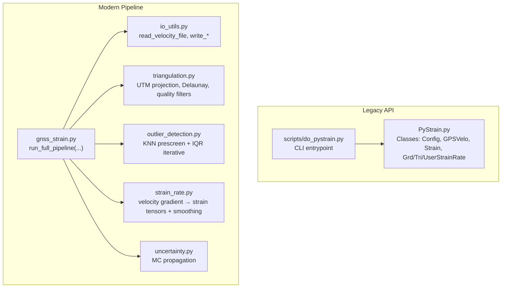
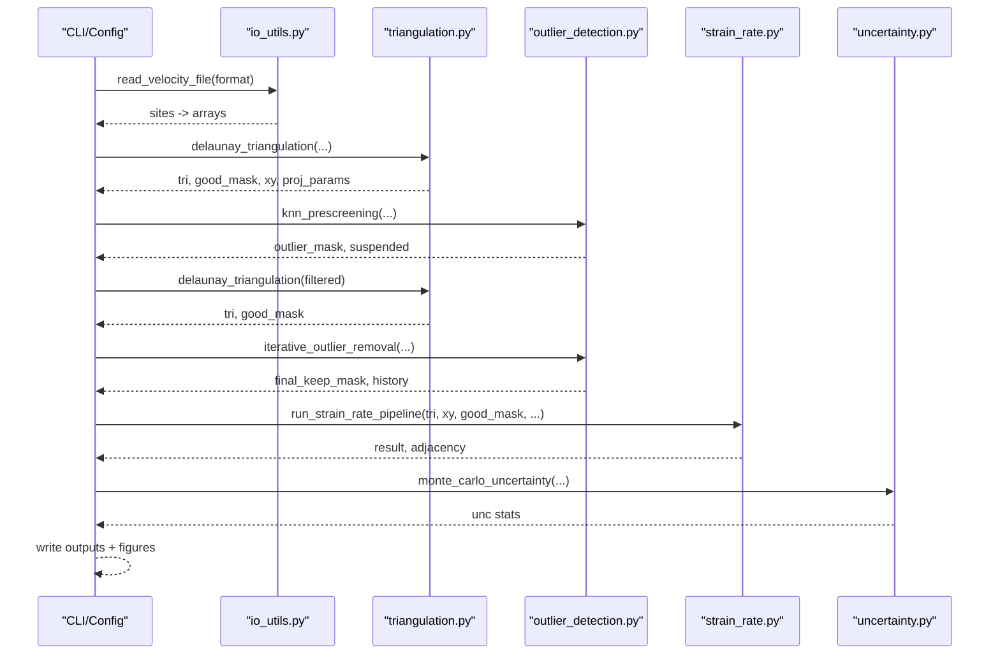
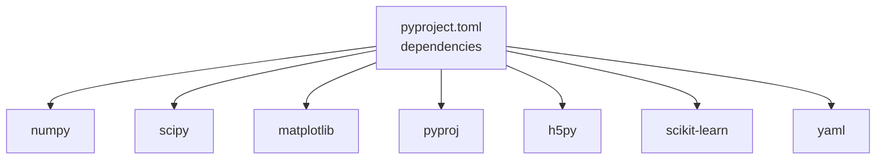

# Troubleshooting and FAQ

<cite>
**Referenced Files in This Document**
- [README.md](file://README.md)
- [pyproject.toml](file://pyproject.toml)
- [src/pystrain/gnss_strain/config_default.yaml](file://src/pystrain/gnss_strain/config_default.yaml)
- [src/pystrain/scripts/do_pystrain.py](file://src/pystrain/scripts/do_pystrain.py)
- [src/pystrain/PyStrain.py](file://src/pystrain/PyStrain.py)
- [src/pystrain/gnss_strain/gnss_strain.py](file://src/pystrain/gnss_strain/gnss_strain.py)
- [src/pystrain/gnss_strain/io_utils.py](file://src/pystrain/gnss_strain/io_utils.py)
- [src/pystrain/gnss_strain/outlier_detection.py](file://src/pystrain/gnss_strain/outlier_detection.py)
- [src/pystrain/gnss_strain/strain_rate.py](file://src/pystrain/gnss_strain/strain_rate.py)
- [src/pystrain/gnss_strain/triangulation.py](file://src/pystrain/gnss_strain/triangulation.py)
- [src/pystrain/gnss_strain/uncertainty.py](file://src/pystrain/gnss_strain/uncertainty.py)
</cite>

## Table of Contents
1. [Introduction](#introduction)
2. [Project Structure](#project-structure)
3. [Core Components](#core-components)
4. [Architecture Overview](#architecture-overview)
5. [Detailed Component Analysis](#detailed-component-analysis)
6. [Dependency Analysis](#dependency-analysis)
7. [Performance Considerations](#performance-considerations)
8. [Troubleshooting Guide](#troubleshooting-guide)
9. [FAQ](#faq)
10. [Conclusion](#conclusion)

## Introduction
This document provides comprehensive troubleshooting and FAQ guidance for PyStrain, focusing on installation issues, configuration pitfalls, data validation problems, computational diagnostics, and common user mistakes. It also outlines escalation procedures and community support resources to help resolve complex issues efficiently.

## Project Structure
PyStrain offers two primary processing modes:
- Legacy Python API: Centralized strain estimation logic and scripts under src/pystrain/.
- Modern GNSS Strain Pipeline: A modular pipeline under src/pystrain/gnss_strain/, emphasizing robust triangulation, outlier detection, smoothing, uncertainty propagation, and visualization.

**Diagram sources**
- [src/pystrain/PyStrain.py:98-126](file://src/pystrain/PyStrain.py#L98-L126)
- [src/pystrain/scripts/do_pystrain.py:1-39](file://src/pystrain/scripts/do_pystrain.py#L1-L39)
- [src/pystrain/gnss_strain/gnss_strain.py:52-341](file://src/pystrain/gnss_strain/gnss_strain.py#L52-L341)
- [src/pystrain/gnss_strain/io_utils.py:21-132](file://src/pystrain/gnss_strain/io_utils.py#L21-L132)
- [src/pystrain/gnss_strain/triangulation.py:89-146](file://src/pystrain/gnss_strain/triangulation.py#L89-L146)
- [src/pystrain/gnss_strain/outlier_detection.py:17-87](file://src/pystrain/gnss_strain/outlier_detection.py#L17-L87)
- [src/pystrain/gnss_strain/strain_rate.py:18-198](file://src/pystrain/gnss_strain/strain_rate.py#L18-L198)
- [src/pystrain/gnss_strain/uncertainty.py:14-75](file://src/pystrain/gnss_strain/uncertainty.py#L14-L75)

**Section sources**
- [README.md:1-2](file://README.md#L1-L2)
- [pyproject.toml:1-31](file://pyproject.toml#L1-L31)
- [src/pystrain/gnss_strain/config_default.yaml:1-69](file://src/pystrain/gnss_strain/config_default.yaml#L1-L69)

## Core Components
- Configuration and I/O
  - Legacy: YAML-based configuration parsing and velocity file loaders.
  - Modern: Flexible CLI and YAML-driven configuration with explicit defaults.
- Triangulation and Quality Control
  - UTM projection, Delaunay triangulation, polygon clipping, and quality filters (angles, edges, areas).
- Outlier Detection
  - Pre-screening via KNN-MAD; iterative IQR-based residual detection.
- Strain Estimation
  - Velocity gradient → strain tensors; principal strain and invariants; optional smoothing.
- Uncertainty Propagation
  - Monte Carlo sampling of velocity covariances to estimate standard deviations.
- Visualization and Reporting
  - Output files, figures, and summary reports.

**Section sources**
- [src/pystrain/PyStrain.py:98-126](file://src/pystrain/PyStrain.py#L98-L126)
- [src/pystrain/gnss_strain/io_utils.py:21-132](file://src/pystrain/gnss_strain/io_utils.py#L21-L132)
- [src/pystrain/gnss_strain/triangulation.py:89-146](file://src/pystrain/gnss_strain/triangulation.py#L89-L146)
- [src/pystrain/gnss_strain/outlier_detection.py:17-87](file://src/pystrain/gnss_strain/outlier_detection.py#L17-L87)
- [src/pystrain/gnss_strain/strain_rate.py:18-198](file://src/pystrain/gnss_strain/strain_rate.py#L18-L198)
- [src/pystrain/gnss_strain/uncertainty.py:14-75](file://src/pystrain/gnss_strain/uncertainty.py#L14-L75)

## Architecture Overview
The modern pipeline orchestrates data ingestion, preprocessing, triangulation, outlier detection, strain computation, smoothing, uncertainty quantification, and output generation.

**Diagram sources**
- [src/pystrain/gnss_strain/gnss_strain.py:52-341](file://src/pystrain/gnss_strain/gnss_strain.py#L52-L341)
- [src/pystrain/gnss_strain/io_utils.py:21-132](file://src/pystrain/gnss_strain/io_utils.py#L21-L132)
- [src/pystrain/gnss_strain/triangulation.py:89-146](file://src/pystrain/gnss_strain/triangulation.py#L89-L146)
- [src/pystrain/gnss_strain/outlier_detection.py:184-291](file://src/pystrain/gnss_strain/outlier_detection.py#L184-L291)
- [src/pystrain/gnss_strain/strain_rate.py:384-437](file://src/pystrain/gnss_strain/strain_rate.py#L384-L437)
- [src/pystrain/gnss_strain/uncertainty.py:14-75](file://src/pystrain/gnss_strain/uncertainty.py#L14-L75)

## Detailed Component Analysis

### Configuration and Data Input
Common issues:
- Missing or invalid configuration file path.
- Unsupported or mismatched velocity file formats.
- Polygon file formatting errors.

Resolution steps:
- Verify the configuration file path and existence.
- Confirm velocity file column count and intended format (auto, gmt, globk).
- Ensure polygon file is properly formatted and closed.

**Section sources**
- [src/pystrain/scripts/do_pystrain.py:7-11](file://src/pystrain/scripts/do_pystrain.py#L7-L11)
- [src/pystrain/PyStrain.py:110-125](file://src/pystrain/PyStrain.py#L110-L125)
- [src/pystrain/gnss_strain/io_utils.py:21-109](file://src/pystrain/gnss_strain/io_utils.py#L21-L109)
- [src/pystrain/gnss_strain/io_utils.py:140-183](file://src/pystrain/gnss_strain/io_utils.py#L140-L183)

### Triangulation and Quality Control
Common issues:
- Too few valid triangles after quality filtering.
- Poor triangle quality (small angles, long edges).
- Projection-related numerical artifacts.

Resolution steps:
- Adjust minimum angle, edge percentiles, and absolute edge thresholds.
- Reduce density via minimum spacing or polygon constraints.
- Validate coordinate ranges and units.

**Section sources**
- [src/pystrain/gnss_strain/triangulation.py:89-146](file://src/pystrain/gnss_strain/triangulation.py#L89-L146)
- [src/pystrain/gnss_strain/triangulation.py:170-256](file://src/pystrain/gnss_strain/triangulation.py#L170-L256)

### Outlier Detection
Common issues:
- Over-aggressive or under-aggressive outlier removal.
- Insufficient sites for KNN-based screening.

Resolution steps:
- Tune KNN neighbors, MAD factor, and IQR factor.
- Increase minimum number of sites per location.
- Review iteration limits and residual thresholds.

**Section sources**
- [src/pystrain/gnss_strain/outlier_detection.py:17-87](file://src/pystrain/gnss_strain/outlier_detection.py#L17-L87)
- [src/pystrain/gnss_strain/outlier_detection.py:184-291](file://src/pystrain/gnss_strain/outlier_detection.py#L184-L291)

### Strain Estimation and Smoothing
Common issues:
- Numerical instability due to ill-conditioned triangles.
- Excessive smoothing leading to loss of spatial detail.

Resolution steps:
- Enforce stricter triangle quality filters.
- Reduce smoothing weight and iterations.
- Validate unit conversions and coordinate systems.

**Section sources**
- [src/pystrain/gnss_strain/strain_rate.py:18-198](file://src/pystrain/gnss_strain/strain_rate.py#L18-L198)
- [src/pystrain/gnss_strain/strain_rate.py:205-271](file://src/pystrain/gnss_strain/strain_rate.py#L205-L271)

### Uncertainty Propagation
Common issues:
- Low Monte Carlo iterations causing noisy estimates.
- Correlation assumptions inconsistent with data.

Resolution steps:
- Increase MC iterations for stability.
- Reassess correlation coefficients and velocity uncertainties.

**Section sources**
- [src/pystrain/gnss_strain/uncertainty.py:14-75](file://src/pystrain/gnss_strain/uncertainty.py#L14-L75)
- [src/pystrain/gnss_strain/uncertainty.py:76-149](file://src/pystrain/gnss_strain/uncertainty.py#L76-L149)

## Dependency Analysis
External dependencies include NumPy, SciPy, Matplotlib, PyProj, h5py, logging, scikit-learn, and YAML. Version compatibility and environment isolation are essential.

**Diagram sources**
- [pyproject.toml:18-26](file://pyproject.toml#L18-L26)

**Section sources**
- [pyproject.toml:18-26](file://pyproject.toml#L18-L26)

## Performance Considerations
- Large datasets: Enable minimum spacing thinning and adjust edge percentiles to reduce triangle counts.
- Memory usage: Limit MC iterations during testing; increase gradually for production runs.
- Numerical stability: Ensure adequate triangle quality and avoid extreme coordinate ranges.
- Parallelization: The pipeline is primarily CPU-bound; optimize I/O and visualization steps separately.

[No sources needed since this section provides general guidance]

## Troubleshooting Guide

### Installation and Environment Issues
Symptoms:
- Module import errors or missing packages.
- Conflicts between NumPy/SciPy versions.
- Platform-specific failures (e.g., visualization backends).

Resolution:
- Install dependencies using the provided configuration and ensure compatible versions.
- Use virtual environments to avoid conflicts.
- On headless servers, disable interactive plotting and set appropriate Matplotlib backend.

**Section sources**
- [pyproject.toml:18-26](file://pyproject.toml#L18-L26)
- [src/pystrain/gnss_strain/gnss_strain.py:368-395](file://src/pystrain/gnss_strain/gnss_strain.py#L368-L395)

### Configuration Errors
Symptoms:
- Fatal configuration parse errors or missing keys.
- Misapplied smoothing or triangulation parameters.

Resolution:
- Validate YAML syntax and paths.
- Use the provided defaults as a baseline and override selectively.
- Confirm output directory permissions and existence.

**Section sources**
- [src/pystrain/PyStrain.py:110-125](file://src/pystrain/PyStrain.py#L110-L125)
- [src/pystrain/gnss_strain/config_default.yaml:1-69](file://src/pystrain/gnss_strain/config_default.yaml#L1-L69)

### Data Validation Problems
Symptoms:
- Empty or malformed velocity files.
- Incorrect column counts or missing headers.
- Invalid polygon definitions.

Resolution:
- Inspect input files for comment lines, blank lines, and consistent delimiters.
- Explicitly specify format if automatic detection fails.
- Ensure polygon rings are closed and valid.

**Section sources**
- [src/pystrain/gnss_strain/io_utils.py:21-109](file://src/pystrain/gnss_strain/io_utils.py#L21-L109)
- [src/pystrain/gnss_strain/io_utils.py:140-183](file://src/pystrain/gnss_strain/io_utils.py#L140-L183)

### Computational Issues
Symptoms:
- No valid triangles after filtering.
- Excessively high or low strain values.
- Unstable uncertainty estimates.

Resolution:
- Tighten quality thresholds and re-run.
- Reduce smoothing weight and iterations.
- Increase MC iterations for stable uncertainty.

**Section sources**
- [src/pystrain/gnss_strain/triangulation.py:137-146](file://src/pystrain/gnss_strain/triangulation.py#L137-L146)
- [src/pystrain/gnss_strain/strain_rate.py:414-416](file://src/pystrain/gnss_strain/strain_rate.py#L414-L416)
- [src/pystrain/gnss_strain/uncertainty.py:51-52](file://src/pystrain/gnss_strain/uncertainty.py#L51-L52)

### Diagnostics Procedures
- Triangle quality: Inspect filtered triangle counts and percentages.
- Outlier history: Review reasons and iterations recorded.
- Residual analysis: Compare predicted vs observed velocities at sites.
- Smoothing effect: Compare raw and smoothed fields visually.

**Section sources**
- [src/pystrain/gnss_strain/gnss_strain.py:166-167](file://src/pystrain/gnss_strain/gnss_strain.py#L166-L167)
- [src/pystrain/gnss_strain/outlier_detection.py:270-285](file://src/pystrain/gnss_strain/outlier_detection.py#L270-L285)
- [src/pystrain/gnss_strain/strain_rate.py:311-377](file://src/pystrain/gnss_strain/strain_rate.py#L311-L377)

### Common User Mistakes and Corrections
- Incorrect data formats: Explicitly set format and verify column counts.
- Parameter misconfiguration: Start from defaults; adjust one parameter at a time.
- Result interpretation errors: Confirm units (nstrain/yr) and coordinate systems.

**Section sources**
- [src/pystrain/gnss_strain/io_utils.py:21-109](file://src/pystrain/gnss_strain/io_utils.py#L21-L109)
- [src/pystrain/gnss_strain/strain_rate.py:176-189](file://src/pystrain/gnss_strain/strain_rate.py#L176-L189)

### Escalation and Community Support
- Capture logs and configuration files.
- Provide minimal reproducible dataset and command-line arguments.
- Open issues with clear problem statements and expected vs. observed outcomes.

[No sources needed since this section provides general guidance]

## FAQ

Q1: How do I choose the right velocity file format?
- Use automatic detection when possible; otherwise explicitly select gmt or globk based on column layout.

Q2: Why do I see very few triangles after triangulation?
- Adjust quality thresholds (minimum angle, edge percentiles) or reduce density via minimum spacing.

Q3: How can I improve uncertainty estimates?
- Increase Monte Carlo iterations and ensure accurate velocity uncertainties and correlations.

Q4: What do the smoothing parameters control?
- Smoothing reduces noise by averaging across neighboring triangles; tune weight and iterations carefully.

Q5: How do I interpret the output units?
- Strain rates are reported in nstrain/yr; verify coordinate projections and unit conversions.

Q6: Can I integrate results with other geodetic software?
- Exported files and figures can be imported into common visualization and GIS tools.

[No sources needed since this section provides general guidance]

## Conclusion
By systematically validating configurations, inputs, and parameters, and by leveraging built-in diagnostics and uncertainty quantification, most issues in PyStrain can be resolved efficiently. For persistent problems, escalate with detailed logs and minimal reproductions to expedite support.