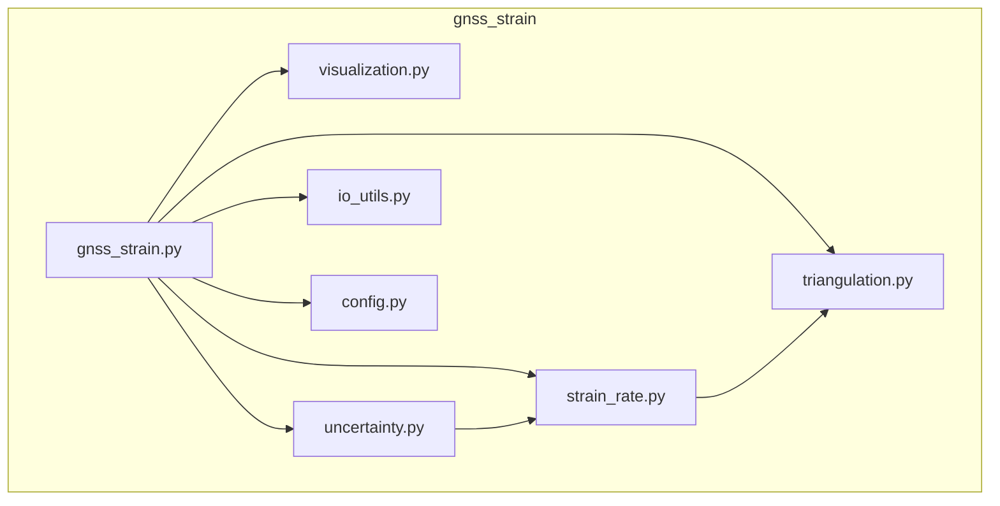
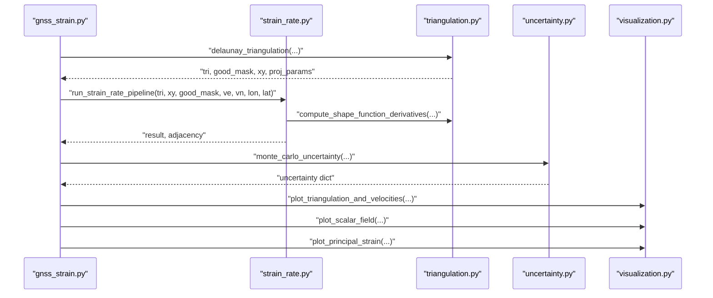
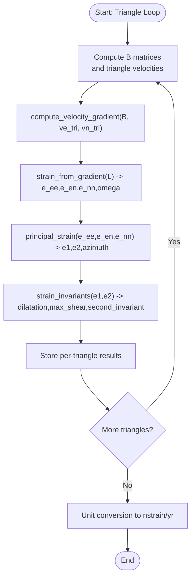
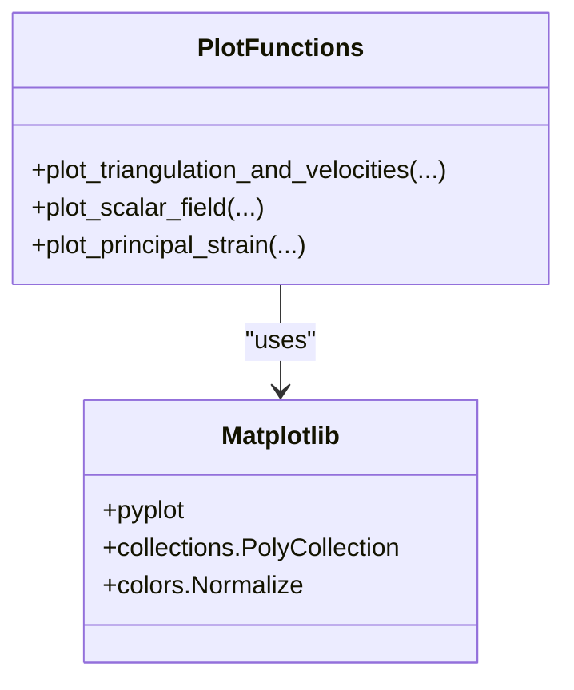
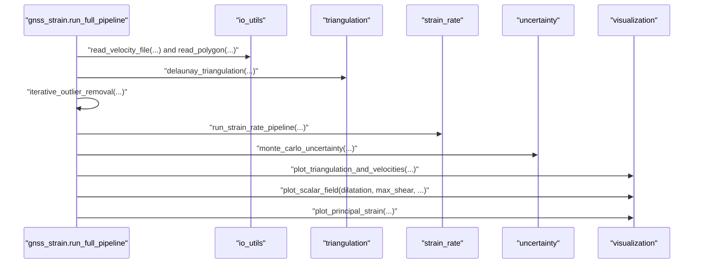
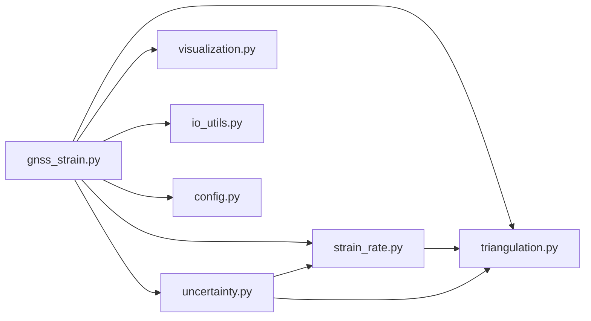

# Static Visualization Functions

<cite>
**Referenced Files in This Document**
- [visualization.py](file://src/pystrain/gnss_strain/visualization.py)
- [strain_rate.py](file://src/pystrain/gnss_strain/strain_rate.py)
- [gnss_strain.py](file://src/pystrain/gnss_strain/gnss_strain.py)
- [triangulation.py](file://src/pystrain/gnss_strain/triangulation.py)
- [uncertainty.py](file://src/pystrain/gnss_strain/uncertainty.py)
- [io_utils.py](file://src/pystrain/gnss_strain/io_utils.py)
- [config.py](file://src/pystrain/gnss_strain/config.py)
</cite>

## Table of Contents
1. [Introduction](#introduction)
2. [Project Structure](#project-structure)
3. [Core Components](#core-components)
4. [Architecture Overview](#architecture-overview)
5. [Detailed Component Analysis](#detailed-component-analysis)
6. [Dependency Analysis](#dependency-analysis)
7. [Performance Considerations](#performance-considerations)
8. [Troubleshooting Guide](#troubleshooting-guide)
9. [Conclusion](#conclusion)
10. [Appendices](#appendices)

## Introduction
This document focuses on PyStrain’s static visualization components, specifically the modules responsible for transforming strain-rate computation results into publication-quality figures. It covers:
- The strain_rate.py module for computing strain-rate tensors, principal strain rates, and derived quantities.
- The visualization.py module for generating spatial distribution maps, orientation plots, and vector overlays.
- The integration pipeline that connects strain computation, smoothing, uncertainty propagation, and figure generation.
- Practical guidance for customizing figure appearance, interpreting results statistically, and preparing outputs for academic and professional use.

## Project Structure
The visualization and strain-rate computation are implemented in dedicated modules under the gnss_strain package. The main orchestration script invokes the computation pipeline and triggers figure generation.

**Diagram sources**
- [gnss_strain.py:26-27](file://src/pystrain/gnss_strain/gnss_strain.py#L26-L27)
- [strain_rate.py:1-12](file://src/pystrain/gnss_strain/strain_rate.py#L1-L12)
- [visualization.py:1-16](file://src/pystrain/gnss_strain/visualization.py#L1-L16)
- [triangulation.py:1-11](file://src/pystrain/gnss_strain/triangulation.py#L1-L11)
- [uncertainty.py:1-6](file://src/pystrain/gnss_strain/uncertainty.py#L1-L6)
- [io_utils.py:1-13](file://src/pystrain/gnss_strain/io_utils.py#L1-L13)
- [config.py:1-10](file://src/pystrain/gnss_strain/config.py#L1-L10)

**Section sources**
- [gnss_strain.py:1-407](file://src/pystrain/gnss_strain/gnss_strain.py#L1-L407)
- [visualization.py:1-250](file://src/pystrain/gnss_strain/visualization.py#L1-L250)
- [strain_rate.py:1-438](file://src/pystrain/gnss_strain/strain_rate.py#L1-L438)

## Core Components
- strain_rate.py: Computes velocity gradients, strain-rate tensors, principal strain rates, and derived invariants per triangle. Includes smoothing and interpolation routines, plus a complete pipeline wrapper.
- visualization.py: Provides three primary plotting functions:
  - Triangulation and velocity vectors overlay
  - Scalar field color-coded by triangle values
  - Principal strain-rate cross plots indicating extension/compression orientations
- Supporting modules:
  - triangulation.py: Delaunay triangulation, shape function derivatives, adjacency, and centroid computation
  - uncertainty.py: Monte Carlo propagation of velocity uncertainties to strain-rate distributions
  - io_utils.py: I/O helpers for velocity and polygon files, and writing strain outputs
  - config.py: Configuration management and parameter validation

Key outputs from strain_rate.py suitable for visualization:
- Scalar fields: dilatation, max_shear, second_invariant
- Orientation fields: e1, e2, azimuth
- Interpolated site-level fields via triangulation

**Section sources**
- [strain_rate.py:18-198](file://src/pystrain/gnss_strain/strain_rate.py#L18-L198)
- [visualization.py:18-250](file://src/pystrain/gnss_strain/visualization.py#L18-L250)
- [triangulation.py:312-368](file://src/pystrain/gnss_strain/triangulation.py#L312-L368)
- [uncertainty.py:14-149](file://src/pystrain/gnss_strain/uncertainty.py#L14-L149)
- [io_utils.py:186-230](file://src/pystrain/gnss_strain/io_utils.py#L186-L230)
- [config.py:18-50](file://src/pystrain/gnss_strain/config.py#L18-L50)

## Architecture Overview
The visualization pipeline integrates computation, smoothing, uncertainty propagation, and figure generation.

**Diagram sources**
- [gnss_strain.py:224-229](file://src/pystrain/gnss_strain/gnss_strain.py#L224-L229)
- [strain_rate.py:411-437](file://src/pystrain/gnss_strain/strain_rate.py#L411-L437)
- [triangulation.py:312-368](file://src/pystrain/gnss_strain/triangulation.py#L312-L368)
- [uncertainty.py:14-149](file://src/pystrain/gnss_strain/uncertainty.py#L14-L149)
- [visualization.py:18-250](file://src/pystrain/gnss_strain/visualization.py#L18-L250)

## Detailed Component Analysis

### strain_rate.py: Strain Computation and Smoothing
Responsibilities:
- Velocity gradient computation per triangle using shape function derivatives
- Strain-rate tensor decomposition into strain components and rotation
- Principal strain-rate extraction and orientation calculation
- Derived invariants: dilatation, max shear, second invariant
- Spatial smoothing via weighted averaging over triangle adjacency
- Interpolation to sites and residual computation

Processing logic highlights:
- compute_velocity_gradient: maps B matrix and triangle velocities to velocity gradient
- strain_from_gradient: extracts strain-rate components and rotation
- principal_strain: eigen-decomposition yielding e1, e2, azimuth
- strain_invariants: computes dilatation, max_shear, second invariant
- smooth_strain_rate: iteratively averages fields across neighbors with configurable weight
- interpolate_to_site and compute_site_residuals: site-level interpolation and prediction residuals

**Diagram sources**
- [strain_rate.py:18-198](file://src/pystrain/gnss_strain/strain_rate.py#L18-L198)

**Section sources**
- [strain_rate.py:18-198](file://src/pystrain/gnss_strain/strain_rate.py#L18-L198)
- [strain_rate.py:205-271](file://src/pystrain/gnss_strain/strain_rate.py#L205-L271)
- [strain_rate.py:278-377](file://src/pystrain/gnss_strain/strain_rate.py#L278-L377)
- [strain_rate.py:384-437](file://src/pystrain/gnss_strain/strain_rate.py#L384-L437)

### visualization.py: Publication-Quality Static Plots
Functions:
- plot_triangulation_and_velocities: overlays triangles (good/bad), optional polygon boundary, velocity vectors, and outliers; includes automatic arrow scaling and aspect ratio preservation
- plot_scalar_field: renders triangle-based scalar fields with color normalization, colormap selection, and colorbar labeling
- plot_principal_strain: draws principal strain crosses at triangle centroids with orientation and extension/compression distinction

Customization options exposed:
- Figure sizing via figsize parameter
- Colormaps and normalization (vmin/vmax) for scalar fields
- Colorbar label and units string
- Vector scaling and outlier handling for velocity plots
- Legend placement and orientation semantics for principal strain crosses

**Diagram sources**
- [visualization.py:18-250](file://src/pystrain/gnss_strain/visualization.py#L18-L250)

**Section sources**
- [visualization.py:18-106](file://src/pystrain/gnss_strain/visualization.py#L18-L106)
- [visualization.py:108-161](file://src/pystrain/gnss_strain/visualization.py#L108-L161)
- [visualization.py:164-250](file://src/pystrain/gnss_strain/visualization.py#L164-L250)

### Integration Between Computation and Visualization Outputs
The gnss_strain.py orchestrator:
- Loads velocity data and optional polygon boundaries
- Performs triangulation with quality filters
- Runs outlier detection and re-triangulation
- Computes strain rate with smoothing and uncertainty propagation
- Writes tabular outputs and generates figures using visualization.py

**Diagram sources**
- [gnss_strain.py:92-341](file://src/pystrain/gnss_strain/gnss_strain.py#L92-L341)
- [io_utils.py:21-132](file://src/pystrain/gnss_strain/io_utils.py#L21-L132)
- [triangulation.py:89-146](file://src/pystrain/gnss_strain/triangulation.py#L89-L146)
- [strain_rate.py:384-437](file://src/pystrain/gnss_strain/strain_rate.py#L384-L437)
- [uncertainty.py:14-149](file://src/pystrain/gnss_strain/uncertainty.py#L14-L149)
- [visualization.py:18-250](file://src/pystrain/gnss_strain/visualization.py#L18-L250)

**Section sources**
- [gnss_strain.py:92-341](file://src/pystrain/gnss_strain/gnss_strain.py#L92-L341)

### Example Visualization Scenarios
- Strain rate magnitude maps:
  - Use plot_scalar_field with dilatation or max_shear arrays
  - Customize colormap and normalization for contrast
- Orientation plots:
  - Use plot_principal_strain with e1, e2, azimuth arrays and triangle centroids
  - Interpret black solid/red dashed for extension/compression along principal axes
- Uncertainty displays:
  - Combine Monte Carlo-derived standard deviations with scalar-field plotting
  - Consider adding error bars or transparency to reflect variability

These scenarios align with the computed fields and plotting functions documented above.

**Section sources**
- [gnss_strain.py:287-318](file://src/pystrain/gnss_strain/gnss_strain.py#L287-L318)
- [uncertainty.py:14-149](file://src/pystrain/gnss_strain/uncertainty.py#L14-L149)
- [visualization.py:108-161](file://src/pystrain/gnss_strain/visualization.py#L108-L161)
- [visualization.py:164-250](file://src/pystrain/gnss_strain/visualization.py#L164-L250)

### Customization Options
- Figure sizing: adjust figsize in plotting functions
- Color schemes: select colormaps and normalize with vmin/vmax
- Legend placement: modify legend location in plots
- Export formats: save figures with desired DPI and tight bounding boxes
- Annotation features: add titles, labels, and reference arrows as needed

These capabilities are evident from the plotting function signatures and internal handling of figure creation and saving.

**Section sources**
- [visualization.py:36-105](file://src/pystrain/gnss_strain/visualization.py#L36-L105)
- [visualization.py:121-161](file://src/pystrain/gnss_strain/visualization.py#L121-L161)
- [visualization.py:181-250](file://src/pystrain/gnss_strain/visualization.py#L181-L250)

## Dependency Analysis
Module-level dependencies and coupling:
- gnss_strain.py depends on triangulation.py for mesh construction, strain_rate.py for computation, uncertainty.py for uncertainty propagation, visualization.py for figures, io_utils.py for I/O, and config.py for configuration.
- strain_rate.py depends on triangulation.py for shape-function derivatives and adjacency.
- uncertainty.py depends on triangulation.py and strain_rate.py for repeated computations under perturbed velocity fields.
- visualization.py depends on matplotlib for rendering and numpy for geometry.

**Diagram sources**
- [gnss_strain.py:17-27](file://src/pystrain/gnss_strain/gnss_strain.py#L17-L27)
- [strain_rate.py:8-11](file://src/pystrain/gnss_strain/strain_rate.py#L8-L11)
- [uncertainty.py:8-11](file://src/pystrain/gnss_strain/uncertainty.py#L8-L11)
- [triangulation.py:13-15](file://src/pystrain/gnss_strain/triangulation.py#L13-L15)

**Section sources**
- [gnss_strain.py:17-27](file://src/pystrain/gnss_strain/gnss_strain.py#L17-L27)
- [strain_rate.py:8-11](file://src/pystrain/gnss_strain/strain_rate.py#L8-L11)
- [uncertainty.py:8-11](file://src/pystrain/gnss_strain/uncertainty.py#L8-L11)

## Performance Considerations
- Vectorized operations dominate computation (e.g., batch triangle loops, NumPy arrays).
- Smoothing iterations trade accuracy for spatial continuity; tune weight and iterations carefully.
- Monte Carlo uncertainty scales with iteration count; balance accuracy against runtime.
- Visualization performance benefits from avoiding excessive DPI for quick previews and increasing DPI only for final exports.

[No sources needed since this section provides general guidance]

## Troubleshooting Guide
Common issues and remedies:
- No valid triangles after quality filtering:
  - Relax minimum angle or maximum edge thresholds; verify polygon boundaries and station density.
- Insufficient stations for reliable triangulation:
  - Increase minimum spacing or reduce maximum edge constraints; ensure adequate coverage.
- Poor smoothing convergence:
  - Reduce smoothing weight or iterations; check triangle adjacency connectivity.
- Incorrect orientation signs:
  - Verify azimuth convention and quadrant handling; confirm principal strain ordering.
- Uncertainty propagation failures:
  - Ensure positive-definite covariance matrices; increase Monte Carlo iterations for stability.

**Section sources**
- [gnss_strain.py:166-168](file://src/pystrain/gnss_strain/gnss_strain.py#L166-L168)
- [strain_rate.py:205-271](file://src/pystrain/gnss_strain/strain_rate.py#L205-L271)
- [uncertainty.py:54-65](file://src/pystrain/gnss_strain/uncertainty.py#L54-L65)

## Conclusion
The visualization components in PyStrain provide a robust framework for turning strain-rate computations into clear, publication-ready figures. By leveraging triangulation-based scalar fields, orientation crosses, and vector overlays, users can effectively communicate spatial patterns, orientations, and uncertainties. Proper configuration of smoothing, uncertainty propagation, and figure customization ensures accurate and compelling scientific presentations.

[No sources needed since this section summarizes without analyzing specific files]

## Appendices

### Best Practices for Result Interpretation and Presentation
- Statistical significance:
  - Use uncertainty estimates to assess significance; avoid overinterpreting small differences within noise.
  - Consider spatial autocorrelation and smoothing effects when drawing regional conclusions.
- Presentation guidelines:
  - Choose appropriate colormaps (e.g., perceptually uniform) and maintain consistent normalization across related plots.
  - Include legends, scale bars, and reference arrows; ensure readable fonts and sufficient contrast.
  - Label axes clearly with units and titles; annotate regions of interest with minimal clutter.

[No sources needed since this section provides general guidance]