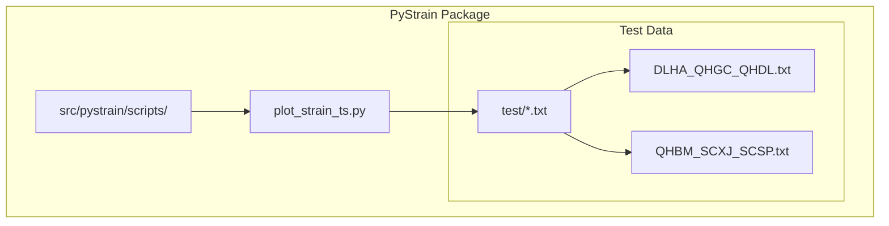
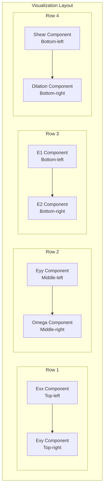
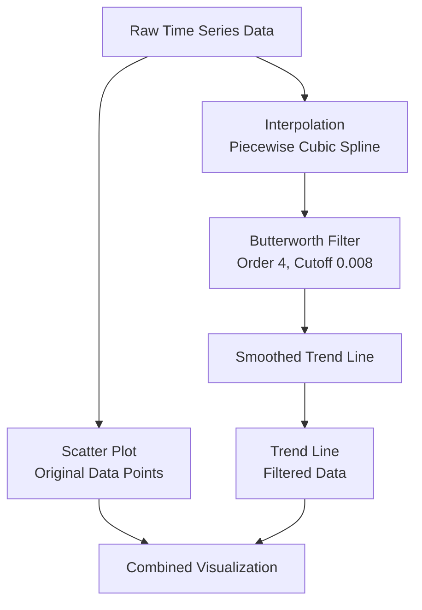

# Time Series Visualization

<cite>
**Referenced Files in This Document**
- [plot_strain_ts.py](file://src/pystrain/scripts/plot_strain_ts.py)
- [DLHA_QHGC_QHDL.txt](file://test/DLHA_QHGC_QHDL.txt)
- [QHBM_SCXJ_SCSP.txt](file://test/QHBM_SCXJ_SCSP.txt)
</cite>

## Table of Contents
1. [Introduction](#introduction)
2. [Project Structure](#project-structure)
3. [Command-Line Interface](#command-line-interface)
4. [Core Visualization Components](#core-visualization-components)
5. [Filtering and Interpolation Pipeline](#filtering-and-interpolation-pipeline)
6. [RANSAC Trend Analysis](#ransac-trend-analysis)
7. [Input File Format](#input-file-format)
8. [Customization Options](#customization-options)
9. [Practical Examples](#practical-examples)
10. [Troubleshooting Guide](#troubleshooting-guide)
11. [Performance Considerations](#performance-considerations)
12. [Conclusion](#conclusion)

## Introduction

PyStrain's time series visualization utility provides comprehensive analysis of strain rate measurements over time through interactive plotting capabilities. The `plot_strain_ts.py` script serves as a specialized tool for visualizing temporal strain data, offering automated filtering, interpolation, and statistical analysis of geodetic strain measurements.

This documentation focuses specifically on the time series visualization capabilities, covering the command-line interface, data processing pipeline, visualization layout, and analytical features that transform raw strain measurements into meaningful time-dependent plots.

## Project Structure

The time series visualization functionality is organized within the PyStrain package structure:



**Diagram sources**
- [plot_strain_ts.py](file://src/pystrain/scripts/plot_strain_ts.py)
- [DLHA_QHGC_QHDL.txt](file://test/DLHA_QHGC_QHDL.txt)
- [QHBM_SCXJ_SCSP.txt](file://test/QHBM_SCXJ_SCSP.txt)

**Section sources**
- [plot_strain_ts.py](file://src/pystrain/scripts/plot_strain_ts.py)

## Command-Line Interface

The `plot_strain_ts.py` utility provides a straightforward command-line interface designed for flexible strain time series analysis:

### Required Arguments
- `--infile`: Specifies the input file containing strain time series data. This argument is mandatory and determines the dataset to be visualized.

### Optional Parameters
- `--size`: Controls point marker size in scatter plots (default: 5). Adjusts visual prominence of individual data points.
- `--alpha`: Sets transparency level for scatter plot markers (default: 0.4). Values range from 0.0 (completely transparent) to 1.0 (opaque).
- `--pltdiff`: Boolean flag enabling difference plot overlay (default: False). When activated, displays differenced data alongside original measurements.

### Parameter Effects on Visualization
The optional parameters directly influence plot aesthetics and data presentation:
- Size parameter scales marker visibility without affecting underlying data analysis
- Alpha parameter controls data point opacity for improved density visualization
- Pltdiff toggle adds comparative analysis through differenced data overlay

**Section sources**
- [plot_strain_ts.py](file://src/pystrain/scripts/plot_strain_ts.py)

## Core Visualization Components

The utility generates a comprehensive 4×2 subplot layout displaying eight distinct strain components:



**Diagram sources**
- [plot_strain_ts.py](file://src/pystrain/scripts/plot_strain_ts.py)

### Component Specifications

Each subplot displays specific strain rate components with standardized formatting:

| Component | Column Index | Data Range | Units |
|-----------|--------------|------------|-------|
| Exx | Column 4 | 1.98e-07 to -2.06e-07 | 1e-9 |
| Exy | Column 5 | 1.54e-07 to -7.34e-08 | 1e-9 |
| Eyy | Column 6 | 4.77e-09 to -3.50e-08 | 1e-9 |
| Omega | Column 7 | 1.51e-07 to -6.36e-08 | 1e-9 |
| E1 | Column 8 | 9.53e-08 to -2.79e-07 | 1e-9 |
| E2 | Column 9 | -2.79e-07 to 3.74e-07 | 1e-9 |
| Shear | Column 10 | 3.74e-07 to -1.84e-07 | 1e-9 |
| Dilation | Column 11 | 332.30 to 332.95 | |

**Section sources**
- [plot_strain_ts.py](file://src/pystrain/scripts/plot_strain_ts.py)

## Filtering and Interpolation Pipeline

The visualization system implements sophisticated data processing to enhance plot quality and analytical accuracy:

### Butterworth Filter Implementation
The system applies a digital Butterworth filter with configurable parameters:
- Filter order: 4th order (compromise between smoothness and response fidelity)
- Cutoff frequency: 0.008 (normalized frequency)
- Processing method: `filtfilt` (zero-phase filtering to prevent phase distortion)

### Interpolation Strategy
Piecewise cubic spline interpolation ensures smooth trend representation:
- Time coordinate spacing: Δt = 0.0027 years
- Interpolation method: `scipy.interpolate.interp1d`
- Data smoothing: Combined with Butterworth filtering for optimal results



**Diagram sources**
- [plot_strain_ts.py](file://src/pystrain/scripts/plot_strain_ts.py)

**Section sources**
- [plot_strain_ts.py](file://src/pystrain/scripts/plot_strain_ts.py)

## RANSAC Trend Analysis

The utility incorporates robust statistical analysis through RANSAC (Random Sample Consensus) regression:

### Regression Methodology
RANSAC provides outlier-resistant linear trend estimation:
- Robust fitting against outliers in time series data
- Iterative random sampling for reliable coefficient estimation
- Automatic identification of inlier/outlier data points

### Coefficient Reporting
The system prints strain rate coefficients for key components:
- `exxdot`: Exx strain rate coefficient
- `exydot`: Exy strain rate coefficient  
- `eyydot`: Eyy strain rate coefficient

### Mathematical Implementation
The RANSAC analysis follows this computational sequence:
1. Initialize RANSAC regressor with default parameters
2. Fit model using time (column 1) as independent variable
3. Extract slope coefficients representing strain rate trends
4. Print formatted coefficient values in scientific notation

**Section sources**
- [plot_strain_ts.py](file://src/pystrain/scripts/plot_strain_ts.py)

## Input File Format

The time series visualization expects structured text files with specific column arrangements:

### Header Structure
- Comment lines beginning with `#` containing coordinate metadata
- Data line header indicating column definitions
- Tabular data rows with numerical values

### Column Definitions
| Column | Variable | Description |
|--------|----------|-------------|
| 1 | Time (year) | Decade year values (e.g., 2010.69815) |
| 2 | Easting (m) | Station easting coordinate |
| 3 | Northing (m) | Station northing coordinate |
| 4 | Exx | Strain rate component (1e-9) |
| 5 | Exy | Strain rate component (1e-9) |
| 6 | Eyy | Strain rate component (1e-9) |
| 7 | Omega | Strain rate component (1e-9) |
| 8 | E1 | Principal strain component (1e-9) |
| 9 | E2 | Principal strain component (1e-9) |
| 10 | Shear | Shear strain component (1e-9) |
| 11 | Dilation | Dilation strain component (1e-9) |

### Example Data Format
```
#   98.53    37.00
#    decyr      e      n        Exx        Exy        Eyy      omega         E1         E2      shear   dilation    theta
2010.69815  -9.62   0.86  -1.98e-07   1.54e-07   1.44e-08   1.51e-07   9.53e-08  -2.79e-07   3.74e-07  -1.84e-07   332.30
```

**Section sources**
- [DLHA_QHGC_QHDL.txt](file://test/DLHA_QHGC_QHDL.txt)
- [QHBM_SCXJ_SCSP.txt](file://test/QHBM_SCXJ_SCSP.txt)

## Customization Options

The visualization system offers several customization parameters for tailored presentation:

### Visual Customization
- Point size adjustment via `--size` parameter (integer values)
- Transparency control through `--alpha` parameter (float 0.0-1.0)
- Difference plot overlay using `--pltdiff` flag

### Plot Configuration
- Figure size: 20×14 inches for optimal subplot display
- Subplot arrangement: 4 rows × 2 columns for eight components
- Color scheme: Distinct colors for each strain component
- Axis labeling: Proper units (1e-9) and component names

### Output Generation
- PDF export: Automatic generation of high-resolution vector graphics
- File naming: Based on input filename with .pdf extension
- Layout optimization: Automatic spacing adjustment (hspace=0.2, wspace=0.2)

**Section sources**
- [plot_strain_ts.py](file://src/pystrain/scripts/plot_strain_ts.py)

## Practical Examples

### Basic Usage
```bash
python plot_strain_ts.py --infile test/DLHA_QHGC_QHDL.txt
```

### Advanced Customization
```bash
python plot_strain_ts.py --infile test/QHBM_SCXJ_SCSP.txt --size 8 --alpha 0.6 --pltdiff
```

### Expected Output Interpretation
The generated visualization displays:
- Original data points as colored scatter markers
- Smooth trend lines derived from filtered interpolation
- Component-specific color coding for easy identification
- Statistical coefficients printed to console for quantitative analysis

**Section sources**
- [plot_strain_ts.py](file://src/pystrain/scripts/plot_strain_ts.py)

## Troubleshooting Guide

### Common Issues and Solutions

#### File Path Problems
**Problem**: "The input file does not exist" error
**Solution**: Verify absolute or relative path correctness, ensure file permissions allow reading

#### Data Format Errors
**Problem**: Empty plots or missing data
**Solution**: Confirm proper header format, validate numerical data presence, check column count consistency

#### Memory and Performance Issues
**Problem**: Slow processing with large datasets
**Solution**: Reduce point size (`--size`), adjust interpolation spacing, consider data subset analysis

#### Visualization Quality Problems
**Problem**: Poor trend line smoothness
**Solution**: Adjust filter parameters, modify interpolation method, verify data sampling rate

#### Display Issues
**Problem**: Overlapping plot elements or unreadable labels
**Solution**: Adjust figure size, modify subplot spacing, reduce point density

**Section sources**
- [plot_strain_ts.py](file://src/pystrain/scripts/plot_strain_ts.py)

## Performance Considerations

### Computational Efficiency
- Interpolation complexity: O(n log n) for cubic spline operations
- Filter processing: Linearithmic time complexity per data point
- Memory usage: Proportional to dataset size plus intermediate interpolation arrays

### Optimization Strategies
- Data preprocessing: Remove obvious outliers before visualization
- Sampling optimization: Downsample dense time series for large datasets
- Parallel processing: Consider multiprocessing for multiple simultaneous analyses

### Scalability Limits
The current implementation handles typical geodetic datasets efficiently. For very large datasets (>10^6 points), consider:
- Data aggregation strategies
- Incremental processing approaches
- Alternative visualization methods

## Conclusion

PyStrain's time series visualization utility provides a comprehensive solution for analyzing strain rate measurements over time. The `plot_strain_ts.py` script combines robust data processing with intuitive visualization to reveal temporal patterns in geodetic strain data.

Key strengths include automated filtering and interpolation, statistical trend analysis through RANSAC regression, and flexible customization options. The standardized 8-component visualization layout enables comprehensive strain analysis while maintaining visual clarity through careful color coding and layout optimization.

The utility serves as both an exploratory analysis tool and a foundation for deeper geodetic research, bridging the gap between raw measurement data and interpretable visual insights.