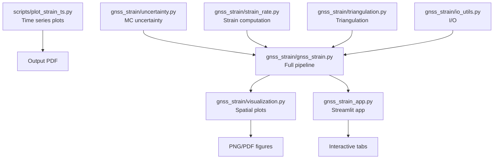
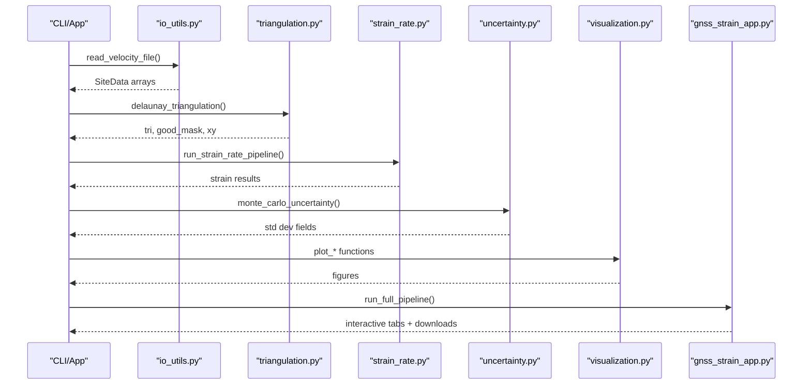
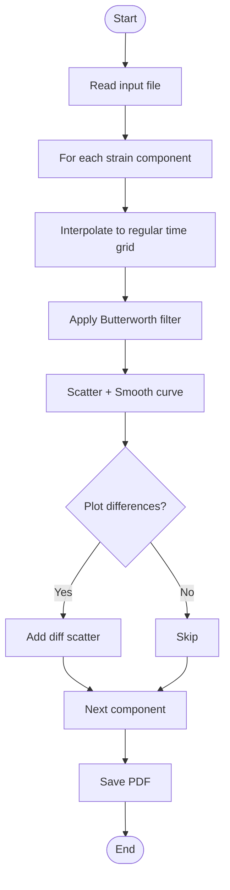
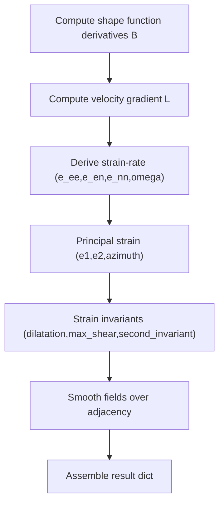
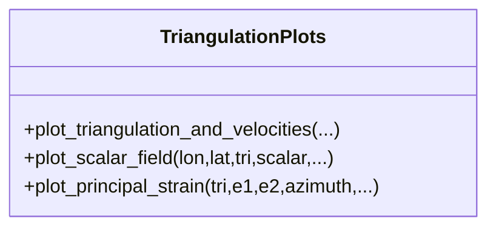
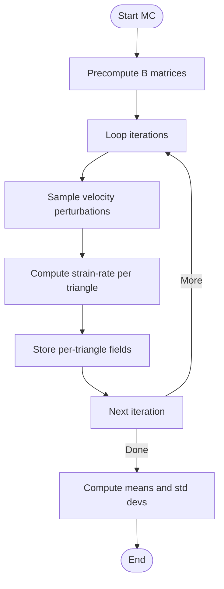
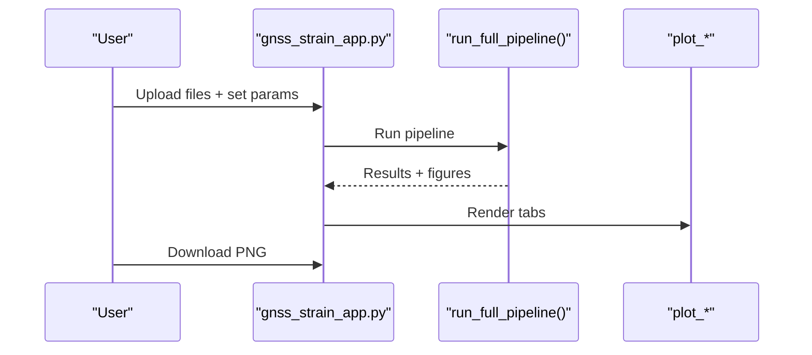
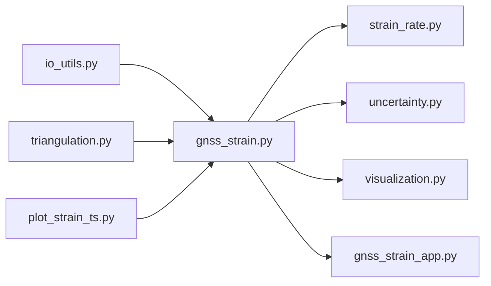

# Visualization and Analysis Tools

<cite>
**Referenced Files in This Document**
- [plot_strain_ts.py](file://src/pystrain/scripts/plot_strain_ts.py)
- [strain_rate.py](file://src/pystrain/gnss_strain/strain_rate.py)
- [visualization.py](file://src/pystrain/gnss_strain/visualization.py)
- [uncertainty.py](file://src/pystrain/gnss_strain/uncertainty.py)
- [gnss_strain.py](file://src/pystrain/gnss_strain/gnss_strain.py)
- [gnss_strain_app.py](file://src/pystrain/gnss_strain/gnss_strain_app.py)
- [triangulation.py](file://src/pystrain/gnss_strain/triangulation.py)
- [io_utils.py](file://src/pystrain/gnss_strain/io_utils.py)
- [PyStrain.py](file://src/pystrain/PyStrain.py)
</cite>

## Table of Contents
1. [Introduction](#introduction)
2. [Project Structure](#project-structure)
3. [Core Components](#core-components)
4. [Architecture Overview](#architecture-overview)
5. [Detailed Component Analysis](#detailed-component-analysis)
6. [Dependency Analysis](#dependency-analysis)
7. [Performance Considerations](#performance-considerations)
8. [Troubleshooting Guide](#troubleshooting-guide)
9. [Conclusion](#conclusion)
10. [Appendices](#appendices)

## Introduction
This document describes PyStrain’s visualization and analysis capabilities with a focus on interpreting and presenting strain-rate results. It covers:
- Time series visualization for strain-rate components and derived quantities
- Spatial distribution maps and interactive dashboards
- Uncertainty quantification via Monte Carlo propagation
- Practical examples, customization options, export formats, and best practices

The goal is to help users select appropriate visualization methods, interpret results confidently, and produce publication-ready figures.

## Project Structure
The visualization ecosystem centers on three modules:
- Time series plotting: a dedicated script for strain-rate time series
- Spatial visualization: plotting utilities for triangulated fields and principal strain cross plots
- Interactive dashboard: a Streamlit app wrapping the full pipeline and exposing interactive figures

**Diagram sources**
- [plot_strain_ts.py:1-143](file://src/pystrain/scripts/plot_strain_ts.py#L1-L143)
- [visualization.py:1-250](file://src/pystrain/gnss_strain/visualization.py#L1-L250)
- [gnss_strain_app.py:1-497](file://src/pystrain/gnss_strain/gnss_strain_app.py#L1-L497)
- [gnss_strain.py:1-407](file://src/pystrain/gnss_strain/gnss_strain.py#L1-L407)
- [uncertainty.py:1-150](file://src/pystrain/gnss_strain/uncertainty.py#L1-L150)
- [strain_rate.py:1-438](file://src/pystrain/gnss_strain/strain_rate.py#L1-L438)
- [triangulation.py:1-477](file://src/pystrain/gnss_strain/triangulation.py#L1-L477)
- [io_utils.py:1-270](file://src/pystrain/gnss_strain/io_utils.py#L1-L270)

**Section sources**
- [plot_strain_ts.py:1-143](file://src/pystrain/scripts/plot_strain_ts.py#L1-L143)
- [visualization.py:1-250](file://src/pystrain/gnss_strain/visualization.py#L1-L250)
- [gnss_strain_app.py:1-497](file://src/pystrain/gnss_strain/gnss_strain_app.py#L1-L497)
- [gnss_strain.py:1-407](file://src/pystrain/gnss_strain/gnss_strain.py#L1-L407)

## Core Components
- Time series visualization: reads numeric time series files and produces multi-panel plots with smoothing and optional differencing
- Spatial visualization: triangulation overlay, scalar field color plots, and principal strain cross plots
- Uncertainty visualization: Monte Carlo propagation to derive standard deviations for strain-rate fields
- Interactive dashboard: GUI to run the pipeline and render figures/tabs with download support

Key outputs:
- Publication-quality figures (PNG/PDF) and interactive dashboards
- Numerical summaries and outlier reports
- Optional time series PDFs for diagnostics

**Section sources**
- [plot_strain_ts.py:9-143](file://src/pystrain/scripts/plot_strain_ts.py#L9-L143)
- [visualization.py:18-250](file://src/pystrain/gnss_strain/visualization.py#L18-L250)
- [uncertainty.py:14-150](file://src/pystrain/gnss_strain/uncertainty.py#L14-L150)
- [gnss_strain_app.py:282-484](file://src/pystrain/gnss_strain/gnss_strain_app.py#L282-L484)

## Architecture Overview
The pipeline integrates data ingestion, triangulation, strain-rate computation, smoothing, uncertainty propagation, and visualization.

**Diagram sources**
- [gnss_strain.py:92-341](file://src/pystrain/gnss_strain/gnss_strain.py#L92-L341)
- [io_utils.py:21-132](file://src/pystrain/gnss_strain/io_utils.py#L21-L132)
- [triangulation.py:89-146](file://src/pystrain/gnss_strain/triangulation.py#L89-L146)
- [strain_rate.py:384-437](file://src/pystrain/gnss_strain/strain_rate.py#L384-L437)
- [uncertainty.py:14-150](file://src/pystrain/gnss_strain/uncertainty.py#L14-L150)
- [visualization.py:18-250](file://src/pystrain/gnss_strain/visualization.py#L18-L250)
- [gnss_strain_app.py:163-251](file://src/pystrain/gnss_strain/gnss_strain_app.py#L163-L251)

## Detailed Component Analysis

### Time Series Visualization: plot_strain_ts.py
Purpose:
- Visualize strain-rate time series for multiple components (Exx, Exy, Eyy, Omega, E1, E2, Shear, Dilation)
- Apply smoothing (Butterworth filter) and optional differencing
- Export a single-page PDF with multi-panel layout

Key features:
- Reads a numeric file with time in column 0 and strain-rate components from column 3 onward
- Interpolates onto a regular time grid and applies a low-pass filter
- Plots scatter points with smoothed curves per component
- Optionally overlays first differences
- Saves a PDF named after the input file stem

Customization options:
- Point size and transparency controlled by arguments
- Plotting differences toggle
- Output figure size and DPI are fixed internally

Export formats:
- PDF (single-page multi-panel)

Best practices:
- Use differencing to inspect short-term variability
- Apply smoothing to reduce noise when long-term trends dominate
- Validate units (displayed in 1e-9 scale)

**Diagram sources**
- [plot_strain_ts.py:26-124](file://src/pystrain/scripts/plot_strain_ts.py#L26-L124)

**Section sources**
- [plot_strain_ts.py:9-143](file://src/pystrain/scripts/plot_strain_ts.py#L9-L143)

### Strain Rate Computation and Smoothing: strain_rate.py
Purpose:
- Compute strain rate tensors from GNSS velocity gradients
- Derive principal strain rates and orientations
- Apply spatial smoothing over the triangulation

Highlights:
- Velocity gradient → strain-rate tensor conversions
- Principal strain calculation with orientation
- Strain invariants (dilatation, max shear, second invariant)
- Smoothing via weighted averages over neighboring triangles
- Interpolation back to sites and residual computation

**Diagram sources**
- [strain_rate.py:18-198](file://src/pystrain/gnss_strain/strain_rate.py#L18-L198)
- [strain_rate.py:205-271](file://src/pystrain/gnss_strain/strain_rate.py#L205-L271)

**Section sources**
- [strain_rate.py:18-438](file://src/pystrain/gnss_strain/strain_rate.py#L18-L438)

### Spatial Visualization Utilities: visualization.py
Purpose:
- Produce publication-ready spatial plots from triangulated strain fields

Functions:
- plot_triangulation_and_velocities: overlay Delaunay triangles, boundary polygon, velocity vectors, and optional outliers
- plot_scalar_field: color-coded triangle scalar fields (e.g., dilatation, max shear)
- plot_principal_strain: draw principal strain crosses at triangle centroids

Styling and customization:
- Colormaps, colorbar labels, and value ranges
- Vector scales and outlier markers
- Automatic aspect ratio adjustment for geographic coordinates

Export formats:
- PNG/PDF via save_path argument or returned Matplotlib handles

**Diagram sources**
- [visualization.py:18-250](file://src/pystrain/gnss_strain/visualization.py#L18-L250)

**Section sources**
- [visualization.py:18-250](file://src/pystrain/gnss_strain/visualization.py#L18-L250)

### Uncertainty Quantification: uncertainty.py
Purpose:
- Propagate GNSS velocity uncertainties (Se, Sn, correlation rho) into strain-rate fields via Monte Carlo sampling

Workflow:
- Precompute shape function derivatives for valid triangles
- Draw perturbed velocity samples using Cholesky decomposition of per-site covariance
- Compute strain-rate fields for each iteration
- Aggregate mean and standard deviation per triangle

Outputs:
- Mean and std dev for e_ee, e_en, e_nn, e1, e2, dilatation, max_shear

**Diagram sources**
- [uncertainty.py:14-150](file://src/pystrain/gnss_strain/uncertainty.py#L14-L150)

**Section sources**
- [uncertainty.py:14-150](file://src/pystrain/gnss_strain/uncertainty.py#L14-L150)

### Full Pipeline and Outputs: gnss_strain.py
Purpose:
- Orchestrate the end-to-end workflow and generate standard outputs

Highlights:
- Loads velocity and polygon files
- Performs KNN prescreening and iterative outlier removal
- Builds triangulation with quality filters
- Computes strain rate and smoothing
- Runs Monte Carlo uncertainty
- Writes numerical outputs and generates figures

Outputs:
- Text file with strain fields and optional uncertainties
- Outlier report
- Summary report
- Figures: triangulation, dilatation, max shear, principal strain cross

**Section sources**
- [gnss_strain.py:52-341](file://src/pystrain/gnss_strain/gnss_strain.py#L52-L341)
- [io_utils.py:186-270](file://src/pystrain/gnss_strain/io_utils.py#L186-L270)

### Interactive Dashboard: gnss_strain_app.py
Purpose:
- Provide an interactive web interface to run the pipeline and visualize results

Features:
- Upload velocity/polygon files, adjust parameters, and run
- Tabs for raw velocity field, outliers, triangulation, dilatation, max shear, and principal strain cross
- Downloadable PNG images for each tab
- Real-time progress and logs

**Diagram sources**
- [gnss_strain_app.py:163-251](file://src/pystrain/gnss_strain/gnss_strain_app.py#L163-L251)
- [gnss_strain_app.py:282-484](file://src/pystrain/gnss_strain/gnss_strain_app.py#L282-L484)

**Section sources**
- [gnss_strain_app.py:1-497](file://src/pystrain/gnss_strain/gnss_strain_app.py#L1-L497)

### Supporting Modules
- triangulation.py: Delaunay triangulation, quality filters, shape functions, adjacency, projection
- io_utils.py: Velocity file parsing (GMT/GLOBK/auto), polygon reading, output writers
- PyStrain.py: Legacy strain estimation routines (grid and triangulation-based); useful for historical context

**Section sources**
- [triangulation.py:89-477](file://src/pystrain/gnss_strain/triangulation.py#L89-L477)
- [io_utils.py:21-270](file://src/pystrain/gnss_strain/io_utils.py#L21-L270)
- [PyStrain.py:352-800](file://src/pystrain/PyStrain.py#L352-L800)

## Dependency Analysis
Visualization components depend on:
- Data I/O (io_utils.py) for loading GNSS velocities and polygons
- Triangulation (triangulation.py) for constructing the mesh and computing geometric quantities
- Strain computation (strain_rate.py) for derived fields
- Uncertainty (uncertainty.py) for Monte Carlo-derived standard deviations

**Diagram sources**
- [gnss_strain.py:17-27](file://src/pystrain/gnss_strain/gnss_strain.py#L17-L27)
- [io_utils.py:17-27](file://src/pystrain/gnss_strain/io_utils.py#L17-L27)
- [triangulation.py:13-16](file://src/pystrain/gnss_strain/triangulation.py#L13-L16)
- [strain_rate.py:8-12](file://src/pystrain/gnss_strain/strain_rate.py#L8-L12)
- [uncertainty.py:8-12](file://src/pystrain/gnss_strain/uncertainty.py#L8-L12)
- [visualization.py:11-16](file://src/pystrain/gnss_strain/visualization.py#L11-L16)
- [gnss_strain_app.py:21-22](file://src/pystrain/gnss_strain/gnss_strain_app.py#L21-L22)
- [plot_strain_ts.py:2-8](file://src/pystrain/scripts/plot_strain_ts.py#L2-L8)

**Section sources**
- [gnss_strain.py:17-27](file://src/pystrain/gnss_strain/gnss_strain.py#L17-L27)
- [plot_strain_ts.py:2-8](file://src/pystrain/scripts/plot_strain_ts.py#L2-L8)

## Performance Considerations
- Time series smoothing: choose filter order and cutoff carefully to balance noise reduction and trend fidelity
- Monte Carlo: increase iterations for better uncertainty estimates; consider caching or reducing iterations for rapid checks
- Triangulation quality: tighten minimum angle and edge thresholds to avoid unstable gradients
- Vector scaling: automatic scaling prevents overplotting; override only when needed for comparisons
- Export resolution: higher DPI improves print quality but increases file sizes

[No sources needed since this section provides general guidance]

## Troubleshooting Guide
Common issues and remedies:
- No valid triangles after filtering: relax min_angle or max_edge thresholds; check polygon boundaries
- Poor smoothing convergence: reduce smooth_weight or iterations; verify adjacency construction
- Uncertainty computation errors: ensure velocity uncertainties are provided; confirm correlation coefficients are valid
- Outlier detection removing too many sites: lower MAD/IQR factors or reduce max iterations
- Interactive app hangs: reduce MC iterations or disable real-time updates during heavy runs

**Section sources**
- [gnss_strain.py:166-168](file://src/pystrain/gnss_strain/gnss_strain.py#L166-L168)
- [gnss_strain.py:239-245](file://src/pystrain/gnss_strain/gnss_strain.py#L239-L245)
- [gnss_strain_app.py:233-240](file://src/pystrain/gnss_strain/gnss_strain_app.py#L233-L240)

## Conclusion
PyStrain offers a robust, end-to-end workflow for GNSS-based strain-rate analysis with strong visualization support. Users can:
- Inspect time series trends and variability
- Visualize spatial patterns and uncertainty
- Build interactive dashboards for stakeholder communication
- Export publication-ready figures and numerical summaries

Select visualization methods based on your scientific goals: time series for trend analysis, spatial maps for regional patterns, and uncertainty plots for reliability statements.

[No sources needed since this section summarizes without analyzing specific files]

## Appendices

### Practical Examples and Scenarios
- Spatial distribution maps
  - Dilatation rate: use the scalar field plot with a diverging colormap
  - Maximum shear: use the scalar field plot with a perceptually uniform colormap
  - Principal strain cross: overlay crosses at triangle centroids with directional arrows
- Time series plots
  - Use the dedicated script to visualize multi-component time series with smoothing and optional differencing
- Uncertainty displays
  - Use Monte Carlo-derived standard deviations to annotate maps or create separate uncertainty panels

### Customization Options and Styling Parameters
- Time series
  - Point size and alpha: adjust for density and visibility
  - Differences overlay: enable to inspect variability
- Spatial plots
  - Colormaps, colorbar ranges, and labels
  - Vector scales and outlier markers
  - Aspect ratio and bounding boxes
- Interactive dashboard
  - Parameter sliders for triangulation, smoothing, and uncertainty
  - Download buttons for each figure

### Export Formats and Best Practices
- Export formats
  - Time series: PDF
  - Spatial figures: PNG/PDF
  - Interactive: PNG downloads from tabs
- Presentation guidelines
  - Use consistent colormaps and labels across figures
  - Include legends and reference arrows
  - Report units clearly (nstrain/yr)
  - Acknowledge Monte Carlo uncertainty where applicable

[No sources needed since this section provides general guidance]