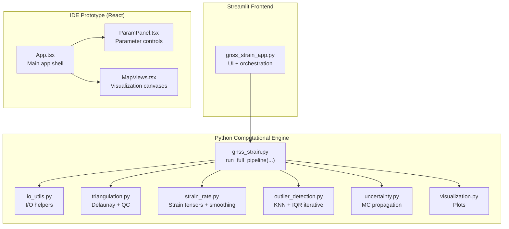
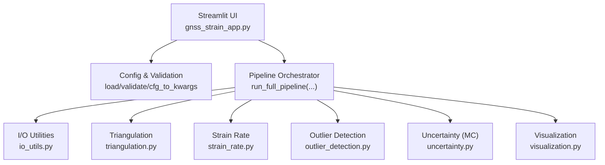
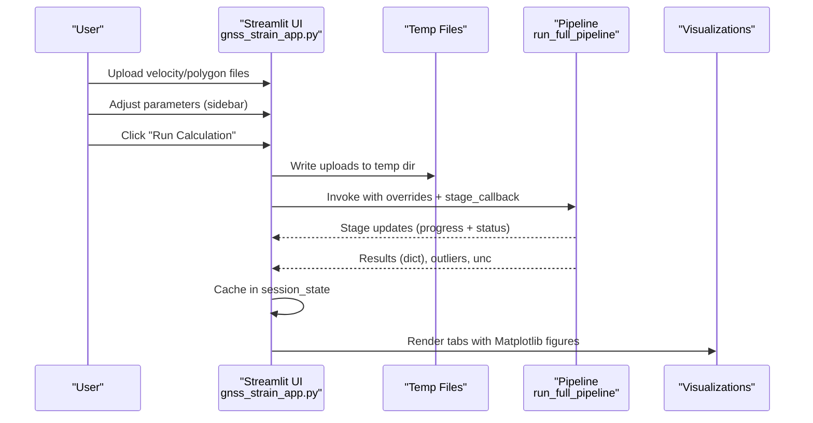
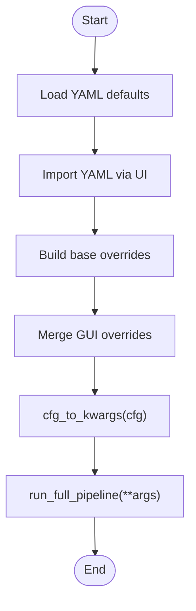
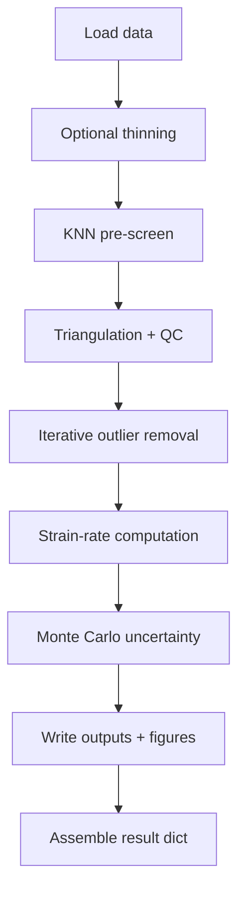
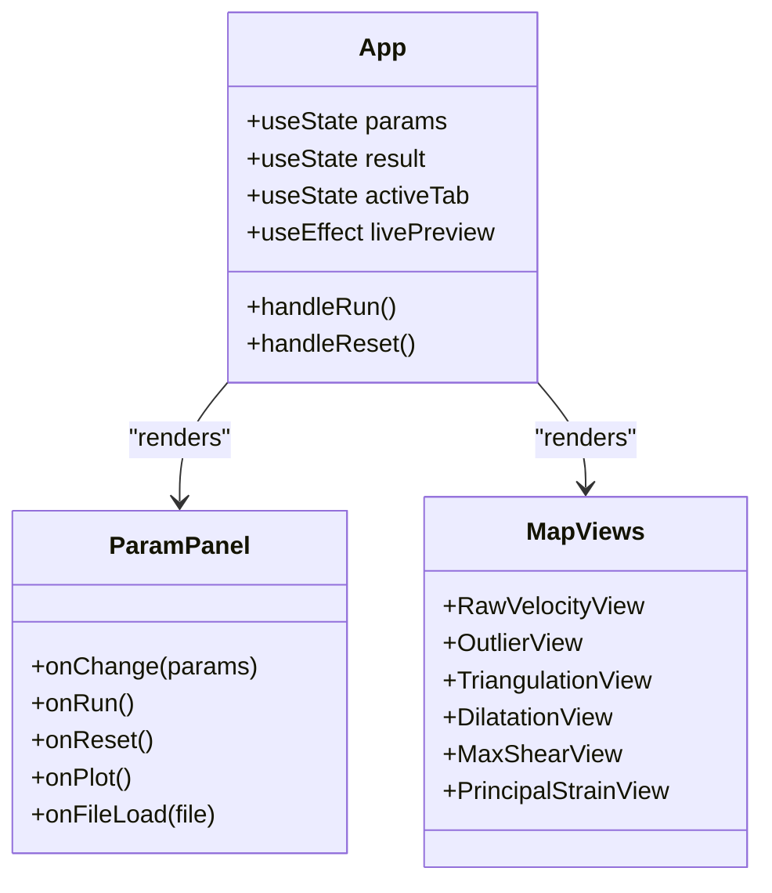
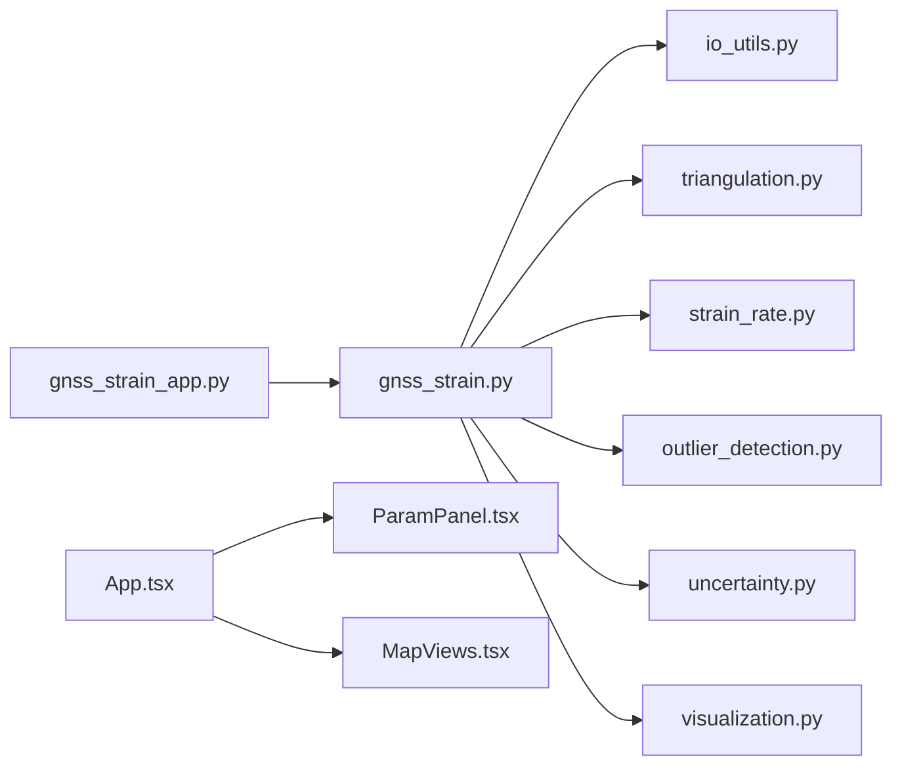
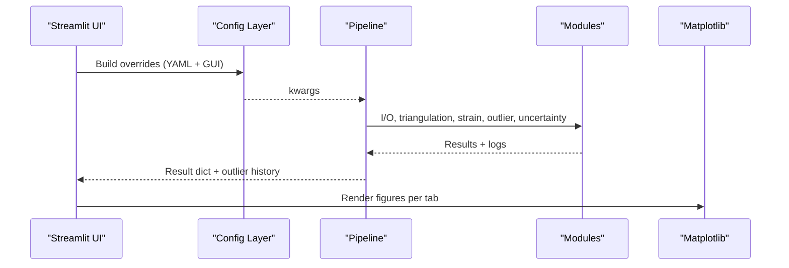

# Application Architecture

<cite>
**Referenced Files in This Document**
- [gnss_strain_app.py](file://src/pystrain/gnss_strain/gnss_strain_app.py)
- [gnss_strain.py](file://src/pystrain/gnss_strain/gnss_strain.py)
- [config_default.yaml](file://src/pystrain/gnss_strain/config_default.yaml)
- [io_utils.py](file://src/pystrain/gnss_strain/io_utils.py)
- [triangulation.py](file://src/pystrain/gnss_strain/triangulation.py)
- [strain_rate.py](file://src/pystrain/gnss_strain/strain_rate.py)
- [outlier_detection.py](file://src/pystrain/gnss_strain/outlier_detection.py)
- [uncertainty.py](file://src/pystrain/gnss_strain/uncertainty.py)
- [visualization.py](file://src/pystrain/gnss_strain/visualization.py)
- [App.tsx](file://src/pystrain/gnss_strain/gnss_ide/src/App.tsx)
- [ParamPanel.tsx](file://src/pystrain/gnss_strain/gnss_ide/src/components/ParamPanel.tsx)
- [MapViews.tsx](file://src/pystrain/gnss_strain/gnss_ide/src/components/MapViews.tsx)
</cite>

## Table of Contents
1. [Introduction](#introduction)
2. [Project Structure](#project-structure)
3. [Core Components](#core-components)
4. [Architecture Overview](#architecture-overview)
5. [Detailed Component Analysis](#detailed-component-analysis)
6. [Dependency Analysis](#dependency-analysis)
7. [Performance Considerations](#performance-considerations)
8. [Troubleshooting Guide](#troubleshooting-guide)
9. [Conclusion](#conclusion)
10. [Appendices](#appendices)

## Introduction
This document describes the PyStrain web IDE application architecture, focusing on the Streamlit-based frontend, the modular Python computational engine, and the integration patterns between them. It explains the application lifecycle from initialization, configuration and parameter validation, to computation execution and result visualization. It also documents state management via Streamlit session_state, inter-component communication, error handling, progress tracking, and logging integration. The frontend includes a React-based IDE prototype that demonstrates the intended UI/UX and data flow.

## Project Structure
The repository is organized into:
- Python computational engine under src/pystrain/gnss_strain/, implementing the core GNSS strain-rate pipeline.
- Streamlit frontend wrapper that orchestrates configuration, user input, computation, and visualization.
- A separate React-based IDE prototype under src/pystrain/gnss_strain/gnss_ide/ that illustrates the UI components and data flow.

**Diagram sources**
- [gnss_strain_app.py:1-497](file://src/pystrain/gnss_strain/gnss_strain_app.py#L1-L497)
- [gnss_strain.py:1-407](file://src/pystrain/gnss_strain/gnss_strain.py#L1-L407)
- [io_utils.py:1-270](file://src/pystrain/gnss_strain/io_utils.py#L1-L270)
- [triangulation.py:1-477](file://src/pystrain/gnss_strain/triangulation.py#L1-L477)
- [strain_rate.py:1-438](file://src/pystrain/gnss_strain/strain_rate.py#L1-L438)
- [outlier_detection.py:1-292](file://src/pystrain/gnss_strain/outlier_detection.py#L1-L292)
- [uncertainty.py:1-150](file://src/pystrain/gnss_strain/uncertainty.py#L1-L150)
- [visualization.py:1-250](file://src/pystrain/gnss_strain/visualization.py#L1-L250)
- [App.tsx:1-400](file://src/pystrain/gnss_strain/gnss_ide/src/App.tsx#L1-L400)
- [ParamPanel.tsx:1-493](file://src/pystrain/gnss_strain/gnss_ide/src/components/ParamPanel.tsx#L1-L493)
- [MapViews.tsx:1-319](file://src/pystrain/gnss_strain/gnss_ide/src/components/MapViews.tsx#L1-L319)

**Section sources**
- [gnss_strain_app.py:1-497](file://src/pystrain/gnss_strain/gnss_strain_app.py#L1-L497)
- [gnss_strain.py:1-407](file://src/pystrain/gnss_strain/gnss_strain.py#L1-L407)

## Core Components
- Streamlit frontend controller:
  - Provides parameter widgets, YAML import/export, progress tracking, and result rendering tabs.
  - Manages temporary file handling and caches results in session_state for visualization.
- Computational pipeline:
  - run_full_pipeline orchestrates data loading, outlier detection, triangulation, strain-rate computation, uncertainty propagation, and output generation.
  - Modular modules encapsulate I/O, triangulation quality control, strain-rate calculation, outlier detection, uncertainty quantification, and plotting.
- IDE prototype (React):
  - Demonstrates parameter panels, live preview, tabbed visualization, and progress indicators.

Key responsibilities:
- Configuration management: YAML defaults, parameter validation, runtime overrides.
- State management: Streamlit session_state for caching results and UI state.
- Data flow: From uploaded files to computation results and plots.
- Error handling: Try/catch blocks, progress cleanup, and user-facing messages.
- Logging: Captured stdout during computation for display.

**Section sources**
- [gnss_strain_app.py:1-497](file://src/pystrain/gnss_strain/gnss_strain_app.py#L1-L497)
- [gnss_strain.py:52-341](file://src/pystrain/gnss_strain/gnss_strain.py#L52-L341)
- [io_utils.py:21-132](file://src/pystrain/gnss_strain/io_utils.py#L21-L132)
- [triangulation.py:89-146](file://src/pystrain/gnss_strain/triangulation.py#L89-L146)
- [strain_rate.py:384-437](file://src/pystrain/gnss_strain/strain_rate.py#L384-L437)
- [outlier_detection.py:184-291](file://src/pystrain/gnss_strain/outlier_detection.py#L184-L291)
- [uncertainty.py:14-149](file://src/pystrain/gnss_strain/uncertainty.py#L14-L149)
- [visualization.py:18-250](file://src/pystrain/gnss_strain/visualization.py#L18-L250)
- [App.tsx:52-127](file://src/pystrain/gnss_strain/gnss_ide/src/App.tsx#L52-L127)
- [ParamPanel.tsx:130-493](file://src/pystrain/gnss_strain/gnss_ide/src/components/ParamPanel.tsx#L130-L493)
- [MapViews.tsx:18-319](file://src/pystrain/gnss_strain/gnss_ide/src/components/MapViews.tsx#L18-L319)

## Architecture Overview
The application follows a layered architecture:
- Presentation layer (Streamlit): Parameter controls, progress, logs, and result tabs.
- Orchestration layer (Python): Central pipeline coordinating modules.
- Domain modules: I/O, triangulation, strain-rate, outlier detection, uncertainty, and visualization.
- IDE prototype (React): UI components mirroring the intended workflow.

**Diagram sources**
- [gnss_strain_app.py:163-251](file://src/pystrain/gnss_strain/gnss_strain_app.py#L163-L251)
- [gnss_strain.py:52-341](file://src/pystrain/gnss_strain/gnss_strain.py#L52-L341)
- [io_utils.py:21-132](file://src/pystrain/gnss_strain/io_utils.py#L21-L132)
- [triangulation.py:89-146](file://src/pystrain/gnss_strain/triangulation.py#L89-L146)
- [strain_rate.py:384-437](file://src/pystrain/gnss_strain/strain_rate.py#L384-L437)
- [outlier_detection.py:184-291](file://src/pystrain/gnss_strain/outlier_detection.py#L184-L291)
- [uncertainty.py:14-149](file://src/pystrain/gnss_strain/uncertainty.py#L14-L149)
- [visualization.py:18-250](file://src/pystrain/gnss_strain/visualization.py#L18-L250)

## Detailed Component Analysis

### Streamlit Frontend Controller
Responsibilities:
- Page configuration and layout.
- Sidebar parameter widgets for data, density control, triangulation quality, outlier detection, smoothing, and uncertainty.
- YAML import/export of current configuration.
- Temporary file handling for uploaded velocity and polygon files.
- Execution orchestration: builds overrides, invokes pipeline with stage callbacks, captures logs, updates progress, and caches results in session_state.
- Result rendering: tabs for raw velocity, outliers, triangulation, dilatation, max shear, and principal strain.

Key patterns:
- Session state caching for result dictionaries and outlier history.
- Callback-driven progress updates.
- Safe error handling with progress cleanup and log display.

**Diagram sources**
- [gnss_strain_app.py:163-251](file://src/pystrain/gnss_strain/gnss_strain_app.py#L163-L251)
- [gnss_strain.py:52-341](file://src/pystrain/gnss_strain/gnss_strain.py#L52-L341)

**Section sources**
- [gnss_strain_app.py:28-158](file://src/pystrain/gnss_strain/gnss_strain_app.py#L28-L158)
- [gnss_strain_app.py:163-251](file://src/pystrain/gnss_strain/gnss_strain_app.py#L163-L251)
- [gnss_strain_app.py:257-497](file://src/pystrain/gnss_strain/gnss_strain_app.py#L257-L497)

### Configuration Management and Validation
Configuration system:
- YAML defaults define categories: data, outlier_detection, triangulation, smoothing, uncertainty, and visualization.
- Runtime overrides from GUI take precedence over imported YAML.
- Pipeline receives a consolidated configuration dictionary and converts it to keyword arguments.

Validation and overrides:
- Imported YAML is merged into base overrides.
- GUI sliders and inputs produce a final overrides dict.
- Pipeline validates and runs with cfg_to_kwargs.

**Diagram sources**
- [config_default.yaml:1-69](file://src/pystrain/gnss_strain/config_default.yaml#L1-L69)
- [gnss_strain_app.py:168-205](file://src/pystrain/gnss_strain/gnss_strain_app.py#L168-L205)
- [gnss_strain.py:52-81](file://src/pystrain/gnss_strain/gnss_strain.py#L52-L81)

**Section sources**
- [config_default.yaml:5-69](file://src/pystrain/gnss_strain/config_default.yaml#L5-L69)
- [gnss_strain_app.py:115-154](file://src/pystrain/gnss_strain/gnss_strain_app.py#L115-L154)
- [gnss_strain_app.py:225-228](file://src/pystrain/gnss_strain/gnss_strain_app.py#L225-L228)
- [gnss_strain.py:348-406](file://src/pystrain/gnss_strain/gnss_strain.py#L348-L406)

### Computational Pipeline Orchestration
The pipeline stages:
1. Load velocity file and optional polygon; optionally thin sites by spacing.
2. KNN pre-screening for outliers.
3. Delaunay triangulation with quality control (min angle, edge percentiles, absolute edge length).
4. Iterative outlier removal using residual IQR.
5. Strain-rate computation per triangle with smoothing.
6. Monte Carlo uncertainty propagation.
7. Output writing and figure generation.
8. Assemble result payload for frontend.

**Diagram sources**
- [gnss_strain.py:92-341](file://src/pystrain/gnss_strain/gnss_strain.py#L92-L341)
- [io_utils.py:21-132](file://src/pystrain/gnss_strain/io_utils.py#L21-L132)
- [triangulation.py:89-146](file://src/pystrain/gnss_strain/triangulation.py#L89-L146)
- [outlier_detection.py:184-291](file://src/pystrain/gnss_strain/outlier_detection.py#L184-L291)
- [strain_rate.py:384-437](file://src/pystrain/gnss_strain/strain_rate.py#L384-L437)
- [uncertainty.py:14-149](file://src/pystrain/gnss_strain/uncertainty.py#L14-L149)
- [visualization.py:18-250](file://src/pystrain/gnss_strain/visualization.py#L18-L250)

**Section sources**
- [gnss_strain.py:52-341](file://src/pystrain/gnss_strain/gnss_strain.py#L52-L341)

### Module Responsibilities
- io_utils.py: Reads velocity and polygon files, converts to arrays, writes outputs and reports.
- triangulation.py: Projects coordinates, performs Delaunay triangulation, applies polygon masks and quality filters, computes shape functions and adjacency.
- strain_rate.py: Computes velocity gradients to strain tensors, derives principal strains and invariants, smooths results, interpolates to sites.
- outlier_detection.py: KNN-based prescreening and iterative IQR-based detection with triangulation-aware residuals.
- uncertainty.py: Monte Carlo sampling of velocity perturbations to estimate standard deviations of strain-rate outputs.
- visualization.py: Generates triangulation overlays, scalar fields, and principal strain cross plots.

**Section sources**
- [io_utils.py:21-270](file://src/pystrain/gnss_strain/io_utils.py#L21-L270)
- [triangulation.py:89-477](file://src/pystrain/gnss_strain/triangulation.py#L89-L477)
- [strain_rate.py:18-438](file://src/pystrain/gnss_strain/strain_rate.py#L18-L438)
- [outlier_detection.py:17-292](file://src/pystrain/gnss_strain/outlier_detection.py#L17-L292)
- [uncertainty.py:14-150](file://src/pystrain/gnss_strain/uncertainty.py#L14-L150)
- [visualization.py:18-250](file://src/pystrain/gnss_strain/visualization.py#L18-L250)

### React IDE Prototype
The React IDE demonstrates:
- Parameter panel with collapsible sections, sliders, toggles, and import/export actions.
- Live preview that recomputes results when parameters change.
- Tabbed visualization views: raw velocity, outliers, triangulation, dilatation, max shear, principal strain.
- Progress simulation with staged updates and a floating download button.

**Diagram sources**
- [App.tsx:52-127](file://src/pystrain/gnss_strain/gnss_ide/src/App.tsx#L52-L127)
- [ParamPanel.tsx:130-493](file://src/pystrain/gnss_strain/gnss_ide/src/components/ParamPanel.tsx#L130-L493)
- [MapViews.tsx:18-319](file://src/pystrain/gnss_strain/gnss_ide/src/components/MapViews.tsx#L18-L319)

**Section sources**
- [App.tsx:18-127](file://src/pystrain/gnss_strain/gnss_ide/src/App.tsx#L18-L127)
- [ParamPanel.tsx:130-493](file://src/pystrain/gnss_strain/gnss_ide/src/components/ParamPanel.tsx#L130-L493)
- [MapViews.tsx:18-319](file://src/pystrain/gnss_strain/gnss_ide/src/components/MapViews.tsx#L18-L319)

## Dependency Analysis
High-level dependencies:
- gnss_strain_app.py depends on gnss_strain.py and config utilities to run the pipeline and render results.
- gnss_strain.py depends on io_utils, triangulation, strain_rate, outlier_detection, uncertainty, and visualization modules.
- React IDE components depend on shared types and canvas utilities.

**Diagram sources**
- [gnss_strain_app.py:21-22](file://src/pystrain/gnss_strain/gnss_strain_app.py#L21-L22)
- [gnss_strain.py:17-27](file://src/pystrain/gnss_strain/gnss_strain.py#L17-L27)

**Section sources**
- [gnss_strain_app.py:21-22](file://src/pystrain/gnss_strain/gnss_strain_app.py#L21-L22)
- [gnss_strain.py:17-27](file://src/pystrain/gnss_strain/gnss_strain.py#L17-L27)

## Performance Considerations
- Triangulation quality thresholds reduce ill-conditioned triangles and improve numerical stability.
- Optional site thinning reduces density and computational cost.
- Smoothing iterations trade off spatial coherence against noise.
- Monte Carlo uncertainty increases runtime; adjust iterations based on needs.
- Matplotlib figure generation is optimized with tight bounding boxes and appropriate DPI.

[No sources needed since this section provides general guidance]

## Troubleshooting Guide
Common issues and remedies:
- Missing velocity file: The UI checks for uploads and stops execution with an error message.
- Insufficient triangles after quality control: Relax constraints or check data quality.
- Runtime exceptions during computation: Captured stdout is shown in a log expander; review for stack traces.
- Progress artifacts: On errors, progress bars are cleared and status text reset.

**Section sources**
- [gnss_strain_app.py:164-166](file://src/pystrain/gnss_strain/gnss_strain_app.py#L164-L166)
- [gnss_strain.py:166-168](file://src/pystrain/gnss_strain/gnss_strain.py#L166-L168)
- [gnss_strain_app.py:232-240](file://src/pystrain/gnss_strain/gnss_strain_app.py#L232-L240)

## Conclusion
PyStrain integrates a robust Python computational engine with a user-friendly Streamlit interface and a forward-looking React IDE prototype. The architecture emphasizes modularity, separation of concerns, and clear data flow from configuration to visualization. Streamlit’s session_state enables efficient caching and responsive UI updates, while the pipeline’s stage callbacks provide transparent progress feedback. The modular design supports incremental enhancements and future extensions.

[No sources needed since this section summarizes without analyzing specific files]

## Appendices

### Data Flow Between Components

**Diagram sources**
- [gnss_strain_app.py:163-251](file://src/pystrain/gnss_strain/gnss_strain_app.py#L163-L251)
- [gnss_strain.py:52-341](file://src/pystrain/gnss_strain/gnss_strain.py#L52-L341)
- [io_utils.py:21-132](file://src/pystrain/gnss_strain/io_utils.py#L21-L132)
- [triangulation.py:89-146](file://src/pystrain/gnss_strain/triangulation.py#L89-L146)
- [strain_rate.py:384-437](file://src/pystrain/gnss_strain/strain_rate.py#L384-L437)
- [outlier_detection.py:184-291](file://src/pystrain/gnss_strain/outlier_detection.py#L184-L291)
- [uncertainty.py:14-149](file://src/pystrain/gnss_strain/uncertainty.py#L14-L149)
- [visualization.py:18-250](file://src/pystrain/gnss_strain/visualization.py#L18-L250)