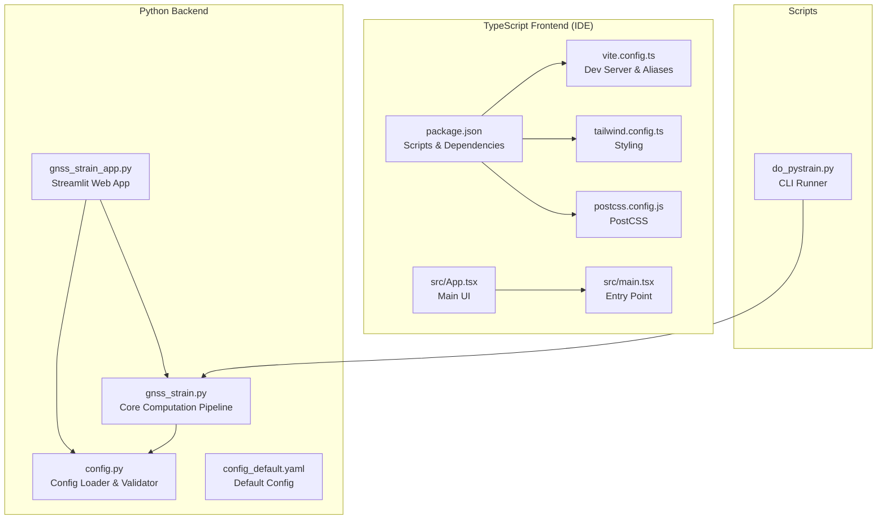
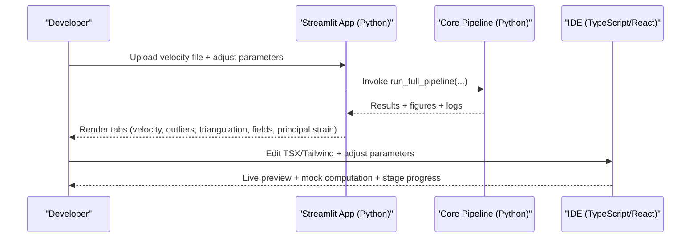
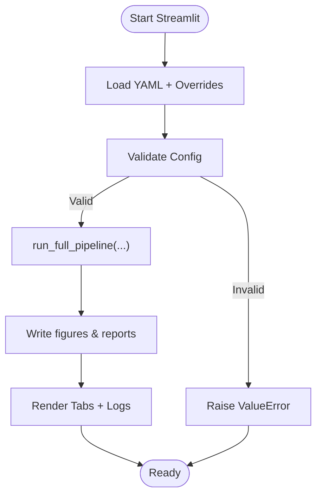
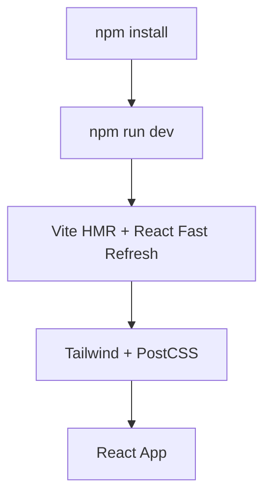
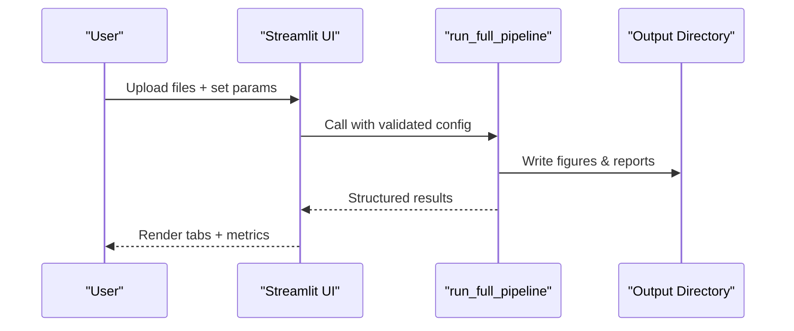
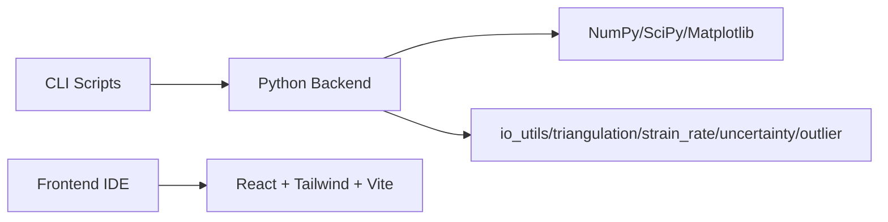

# Development Setup

<cite>
**Referenced Files in This Document**
- [README.md](file://README.md)
- [pyproject.toml](file://pyproject.toml)
- [requirement.txt](file://requirement.txt)
- [gnss_strain_app.py](file://src/pystrain/gnss_strain/gnss_strain_app.py)
- [gnss_strain.py](file://src/pystrain/gnss_strain/gnss_strain.py)
- [config.py](file://src/pystrain/gnss_strain/config.py)
- [config_default.yaml](file://src/pystrain/gnss_strain/config_default.yaml)
- [package.json](file://src/pystrain/gnss_strain/gnss_ide/package.json)
- [vite.config.ts](file://src/pystrain/gnss_strain/gnss_ide/vite.config.ts)
- [tailwind.config.ts](file://src/pystrain/gnss_strain/gnss_ide/tailwind.config.ts)
- [postcss.config.js](file://src/pystrain/gnss_strain/gnss_ide/postcss.config.js)
- [App.tsx](file://src/pystrain/gnss_strain/gnss_ide/src/App.tsx)
- [main.tsx](file://src/pystrain/gnss_strain/gnss_ide/src/main.tsx)
- [do_pystrain.py](file://src/pystrain/scripts/do_pystrain.py)
</cite>

## Table of Contents
1. [Introduction](#introduction)
2. [Project Structure](#project-structure)
3. [Core Components](#core-components)
4. [Architecture Overview](#architecture-overview)
5. [Detailed Component Analysis](#detailed-component-analysis)
6. [Dependency Analysis](#dependency-analysis)
7. [Performance Considerations](#performance-considerations)
8. [Troubleshooting Guide](#troubleshooting-guide)
9. [Conclusion](#conclusion)
10. [Appendices](#appendices)

## Introduction
This document provides a comprehensive development setup guide for the PyStrain web IDE. It covers environment prerequisites, Python backend and TypeScript/React frontend setup, build and development workflows, hot reload configuration, environment variables, debugging, integration between backend computations and the web interface, best practices, code formatting, testing procedures, and troubleshooting.

## Project Structure
The repository is organized into:
- Python backend: Streamlit web app and computational modules under src/pystrain/gnss_strain
- TypeScript/React frontend: A standalone IDE under src/pystrain/gnss_strain/gnss_ide
- Scripts: Command-line utilities under src/pystrain/scripts
- Tests and sample data: Under test/

Key highlights:
- The Streamlit app serves as the primary GUI for interactive computation and visualization.
- The TypeScript IDE is a separate React application intended for development and prototyping of frontend components.
- Build and dev scripts are defined in the frontend package.json, while the backend uses Streamlit for development.

**Diagram sources**
- [gnss_strain_app.py](file://src/pystrain/gnss_strain/gnss_strain_app.py)
- [gnss_strain.py](file://src/pystrain/gnss_strain/gnss_strain.py)
- [config.py](file://src/pystrain/gnss_strain/config.py)
- [config_default.yaml](file://src/pystrain/gnss_strain/config_default.yaml)
- [package.json](file://src/pystrain/gnss_strain/gnss_ide/package.json)
- [vite.config.ts](file://src/pystrain/gnss_strain/gnss_ide/vite.config.ts)
- [tailwind.config.ts](file://src/pystrain/gnss_strain/gnss_ide/tailwind.config.ts)
- [postcss.config.js](file://src/pystrain/gnss_strain/gnss_ide/postcss.config.js)
- [App.tsx](file://src/pystrain/gnss_strain/gnss_ide/src/App.tsx)
- [main.tsx](file://src/pystrain/gnss_strain/gnss_ide/src/main.tsx)
- [do_pystrain.py](file://src/pystrain/scripts/do_pystrain.py)

**Section sources**
- [README.md](file://README.md)
- [pyproject.toml](file://pyproject.toml)
- [requirement.txt](file://requirement.txt)
- [gnss_strain_app.py](file://src/pystrain/gnss_strain/gnss_strain_app.py)
- [gnss_strain.py](file://src/pystrain/gnss_strain/gnss_strain.py)
- [config.py](file://src/pystrain/gnss_strain/config.py)
- [config_default.yaml](file://src/pystrain/gnss_strain/config_default.yaml)
- [package.json](file://src/pystrain/gnss_strain/gnss_ide/package.json)
- [vite.config.ts](file://src/pystrain/gnss_strain/gnss_ide/vite.config.ts)
- [tailwind.config.ts](file://src/pystrain/gnss_strain/gnss_ide/tailwind.config.ts)
- [postcss.config.js](file://src/pystrain/gnss_strain/gnss_ide/postcss.config.js)
- [App.tsx](file://src/pystrain/gnss_strain/gnss_ide/src/App.tsx)
- [main.tsx](file://src/pystrain/gnss_strain/gnss_ide/src/main.tsx)
- [do_pystrain.py](file://src/pystrain/scripts/do_pystrain.py)

## Core Components
- Python backend:
  - Streamlit web app orchestrating user input, computation, and visualization.
  - Core pipeline module implementing the full GNSS strain rate workflow.
  - Configuration loader and validator supporting YAML-based configuration and CLI overrides.
- TypeScript/React frontend:
  - A standalone IDE built with Vite, React, Tailwind CSS, and TypeScript.
  - Modular UI components for parameter panels, statistics, logs, and visualization tabs.
- Scripts:
  - CLI runner invoking strain rate estimation routines.

**Section sources**
- [gnss_strain_app.py](file://src/pystrain/gnss_strain/gnss_strain_app.py)
- [gnss_strain.py](file://src/pystrain/gnss_strain/gnss_strain.py)
- [config.py](file://src/pystrain/gnss_strain/config.py)
- [config_default.yaml](file://src/pystrain/gnss_strain/config_default.yaml)
- [package.json](file://src/pystrain/gnss_strain/gnss_ide/package.json)
- [App.tsx](file://src/pystrain/gnss_strain/gnss_ide/src/App.tsx)
- [do_pystrain.py](file://src/pystrain/scripts/do_pystrain.py)

## Architecture Overview
The system comprises two distinct development environments:
- Python/Streamlit backend: Handles file uploads, parameter tuning, computation orchestration, and result rendering via Matplotlib plots.
- TypeScript/React frontend IDE: Provides a live-preview environment for frontend components with mock data and simulated stages.

**Diagram sources**
- [gnss_strain_app.py](file://src/pystrain/gnss_strain/gnss_strain_app.py)
- [gnss_strain.py](file://src/pystrain/gnss_strain/gnss_strain.py)
- [App.tsx](file://src/pystrain/gnss_strain/gnss_ide/src/App.tsx)

## Detailed Component Analysis

### Python Backend Development Environment
- Prerequisites:
  - Python 3.7 or newer
  - NumPy, SciPy, Matplotlib, PyProj, h5py, scikit-learn
  - Additional runtime dependencies: logging, PyYAML (for configuration)
- Installation:
  - Use pip to install runtime and development dependencies declared in pyproject.toml and requirement.txt.
- Development server:
  - Run the Streamlit app with the command indicated in the app’s header comment.
- Hot reload:
  - Streamlit automatically watches for Python file changes and refreshes the browser.
- Configuration:
  - YAML-based configuration supports defaults, file loading, and CLI overrides with validation.
- Data exchange:
  - The backend writes figures and reports to the output directory and returns structured results for visualization.

**Diagram sources**
- [gnss_strain_app.py](file://src/pystrain/gnss_strain/gnss_strain_app.py)
- [gnss_strain.py](file://src/pystrain/gnss_strain/gnss_strain.py)
- [config.py](file://src/pystrain/gnss_strain/config.py)

**Section sources**
- [pyproject.toml](file://pyproject.toml)
- [requirement.txt](file://requirement.txt)
- [gnss_strain_app.py](file://src/pystrain/gnss_strain/gnss_strain_app.py)
- [gnss_strain.py](file://src/pystrain/gnss_strain/gnss_strain.py)
- [config.py](file://src/pystrain/gnss_strain/config.py)
- [config_default.yaml](file://src/pystrain/gnss_strain/config_default.yaml)

### TypeScript/React Frontend Development Environment
- Prerequisites:
  - Node.js and npm installed on the system.
- Setup:
  - Install dependencies using npm from the frontend package.json.
- Development server:
  - Use the dev script to launch Vite with React and TypeScript support.
  - Vite resolves aliases configured in vite.config.ts.
- Hot reload:
  - Vite enables fast HMR for React components and styles.
- Styling:
  - Tailwind CSS configured with custom theme tokens and animations.
  - PostCSS autoprefixing enabled.
- Entry point:
  - React renders the root App component.

**Diagram sources**
- [package.json](file://src/pystrain/gnss_strain/gnss_ide/package.json)
- [vite.config.ts](file://src/pystrain/gnss_strain/gnss_ide/vite.config.ts)
- [tailwind.config.ts](file://src/pystrain/gnss_strain/gnss_ide/tailwind.config.ts)
- [postcss.config.js](file://src/pystrain/gnss_strain/gnss_ide/postcss.config.js)
- [main.tsx](file://src/pystrain/gnss_strain/gnss_ide/src/main.tsx)
- [App.tsx](file://src/pystrain/gnss_strain/gnss_ide/src/App.tsx)

**Section sources**
- [package.json](file://src/pystrain/gnss_strain/gnss_ide/package.json)
- [vite.config.ts](file://src/pystrain/gnss_strain/gnss_ide/vite.config.ts)
- [tailwind.config.ts](file://src/pystrain/gnss_strain/gnss_ide/tailwind.config.ts)
- [postcss.config.js](file://src/pystrain/gnss_strain/gnss_ide/postcss.config.js)
- [main.tsx](file://src/pystrain/gnss_strain/gnss_ide/src/main.tsx)
- [App.tsx](file://src/pystrain/gnss_strain/gnss_ide/src/App.tsx)

### Integration Between Python Backend and Web Interface
- Data flow:
  - Streamlit app collects user inputs and files, constructs a configuration, invokes the core pipeline, and renders results in tabs.
  - The pipeline writes figures and reports to disk and returns structured data for visualization.
- API endpoints:
  - There are no HTTP APIs exposed by the backend. Interaction occurs through Streamlit widgets and file uploads.
- Data exchange patterns:
  - Temporary files are written during computation; results are cached in session state for rendering.
  - The frontend IDE simulates computation with mock data and staged progress for rapid iteration.

**Diagram sources**
- [gnss_strain_app.py](file://src/pystrain/gnss_strain/gnss_strain_app.py)
- [gnss_strain.py](file://src/pystrain/gnss_strain/gnss_strain.py)

**Section sources**
- [gnss_strain_app.py](file://src/pystrain/gnss_strain/gnss_strain_app.py)
- [gnss_strain.py](file://src/pystrain/gnss_strain/gnss_strain.py)

### Build Process
- Python backend:
  - No dedicated build step is required for development; Streamlit runs the app directly.
  - Packaging metadata is defined in pyproject.toml for distribution.
- TypeScript frontend:
  - Build script compiles TypeScript and bundles with Vite.
  - Preview script serves the production build locally.

**Section sources**
- [pyproject.toml](file://pyproject.toml)
- [package.json](file://src/pystrain/gnss_strain/gnss_ide/package.json)

### Environment Variables and Configuration
- Python:
  - Configuration is managed via YAML with validation and CLI overrides.
  - Logging is used for runtime messages and error reporting.
- TypeScript:
  - No environment variables are referenced in the provided frontend files.
  - Vite configuration sets up module aliases and plugin chain.

**Section sources**
- [config.py](file://src/pystrain/gnss_strain/config.py)
- [config_default.yaml](file://src/pystrain/gnss_strain/config_default.yaml)
- [gnss_strain_app.py](file://src/pystrain/gnss_strain/gnss_strain_app.py)
- [vite.config.ts](file://src/pystrain/gnss_strain/gnss_ide/vite.config.ts)

### Debugging Setup
- Python:
  - Use Streamlit’s integrated development mode; exceptions are captured and displayed with logs.
  - Progress bars and status texts provide stage feedback during computation.
- TypeScript:
  - Use Vite dev server logs and browser console for component debugging.
  - Mock engine and staged progress simulate computation for rapid iteration.

**Section sources**
- [gnss_strain_app.py](file://src/pystrain/gnss_strain/gnss_strain_app.py)
- [App.tsx](file://src/pystrain/gnss_strain/gnss_ide/src/App.tsx)

### Testing Procedures
- Python:
  - No explicit unit tests were found in the repository. Recommended approach:
    - Add pytest-based tests for individual modules (e.g., triangulation, strain_rate, uncertainty).
    - Test configuration loading, validation, and CLI argument parsing.
- TypeScript:
  - No explicit unit tests were found in the repository. Recommended approach:
    - Add React Testing Library tests for components.
    - Add Vitest-based tests for utility functions and hooks.
    - Use mocked compute functions to isolate UI logic.

[No sources needed since this section provides general guidance]

### Development Best Practices
- Code formatting:
  - Python: Use black and ruff for formatting and linting.
  - TypeScript: Use Prettier and ESLint for formatting and linting.
- Linting:
  - Python: flake8 or ruff; configure exclusions for generated files.
  - TypeScript: TypeScript compiler checks plus ESLint rules.
- Pre-commit hooks:
  - Integrate formatting and linting into pre-commit to enforce standards.
- Documentation:
  - Keep docstrings consistent and update README with setup steps.

[No sources needed since this section provides general guidance]

## Dependency Analysis
- Python backend depends on scientific libraries for numerical computation and visualization.
- Frontend depends on React, Tailwind CSS, and Vite for rapid development and styling.
- Scripts depend on the core modules to execute strain rate estimation.

**Diagram sources**
- [gnss_strain.py](file://src/pystrain/gnss_strain/gnss_strain.py)
- [package.json](file://src/pystrain/gnss_strain/gnss_ide/package.json)
- [do_pystrain.py](file://src/pystrain/scripts/do_pystrain.py)

**Section sources**
- [gnss_strain.py](file://src/pystrain/gnss_strain/gnss_strain.py)
- [package.json](file://src/pystrain/gnss_strain/gnss_ide/package.json)
- [do_pystrain.py](file://src/pystrain/scripts/do_pystrain.py)

## Performance Considerations
- Python:
  - Large datasets and high Monte Carlo iterations increase computation time; consider reducing mc_iterations for quick iterations.
  - Use thinning and edge-length constraints to reduce triangle count and improve stability.
- Frontend:
  - Prefer virtualized lists for large datasets.
  - Defer heavy computations to Web Workers or backend APIs if scaling to very large datasets.

[No sources needed since this section provides general guidance]

## Troubleshooting Guide
- Python environment issues:
  - Ensure Python 3.7+ is installed and dependencies match pyproject.toml and requirement.txt.
  - If YAML-related errors occur, install PyYAML as indicated by the configuration loader.
- Streamlit app fails to start:
  - Verify the correct command is used as documented in the Streamlit app header.
  - Check that temporary directories are writable and Matplotlib Agg backend is available.
- Frontend build fails:
  - Confirm Node.js and npm versions satisfy package.json engines.
  - Clear node_modules and reinstall dependencies if necessary.
- Vite hot reload not working:
  - Check that vite.config.ts aliases are correct and no port conflicts exist.
  - Restart the dev server after making configuration changes.
- Missing icons or styles:
  - Ensure Tailwind and PostCSS configurations are present and Tailwind content paths include source files.

**Section sources**
- [pyproject.toml](file://pyproject.toml)
- [requirement.txt](file://requirement.txt)
- [gnss_strain_app.py](file://src/pystrain/gnss_strain/gnss_strain_app.py)
- [config.py](file://src/pystrain/gnss_strain/config.py)
- [package.json](file://src/pystrain/gnss_strain/gnss_ide/package.json)
- [vite.config.ts](file://src/pystrain/gnss_strain/gnss_ide/vite.config.ts)
- [tailwind.config.ts](file://src/pystrain/gnss_strain/gnss_ide/tailwind.config.ts)
- [postcss.config.js](file://src/pystrain/gnss_strain/gnss_ide/postcss.config.js)

## Conclusion
The PyStrain web IDE combines a Python/Streamlit backend for robust computation and a TypeScript/React frontend for rapid UI iteration. Development relies on straightforward Python and Node.js setups, with Streamlit and Vite providing hot-reload capabilities. By following the environment setup, configuration, and integration guidelines herein, developers can efficiently build, debug, and extend both the backend computation pipeline and the frontend IDE.

## Appendices
- Quick commands:
  - Python: streamlit run src/pystrain/gnss_strain/gnss_strain_app.py
  - Frontend: cd src/pystrain/gnss_strain/gnss_ide && npm run dev
- Next steps:
  - Add unit tests for Python modules and React components.
  - Integrate CI/CD pipelines for automated linting and testing.

[No sources needed since this section provides general guidance]