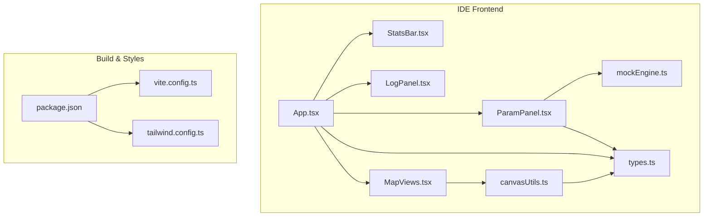
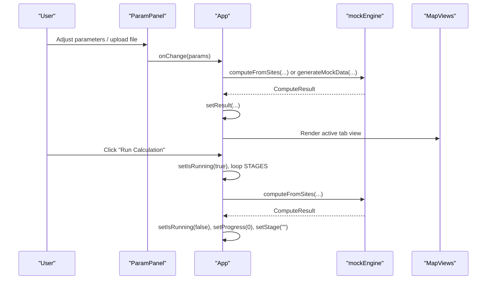
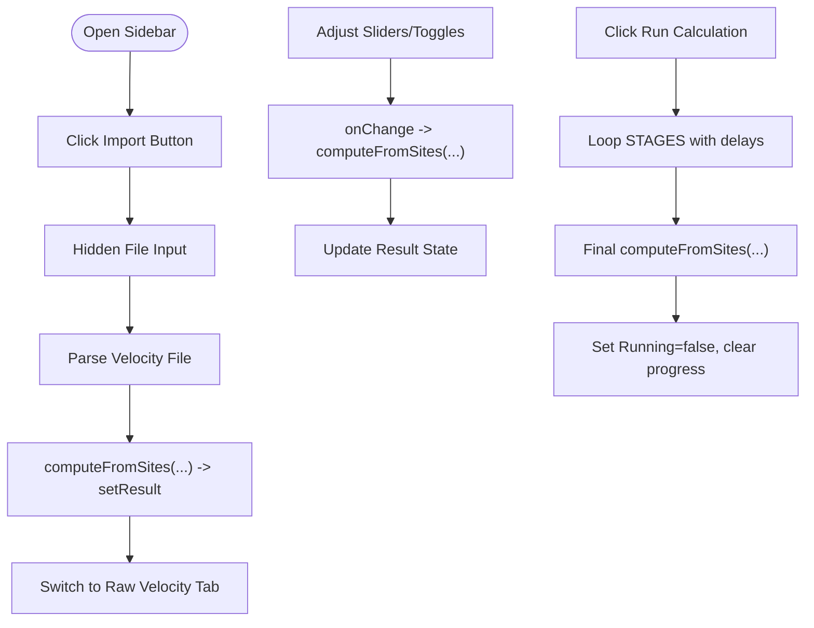
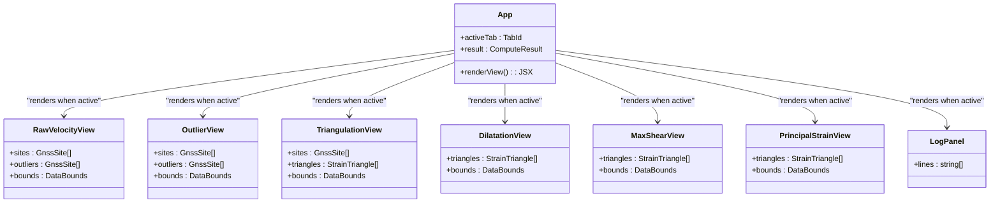
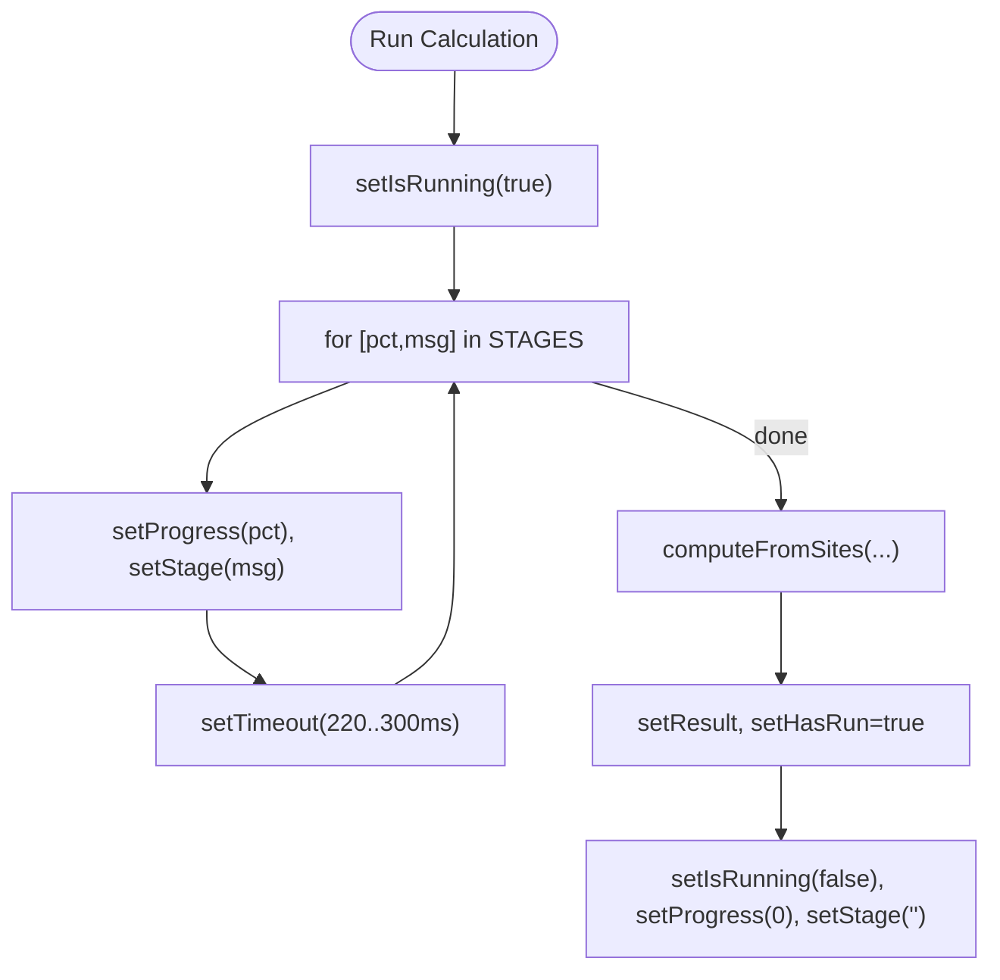
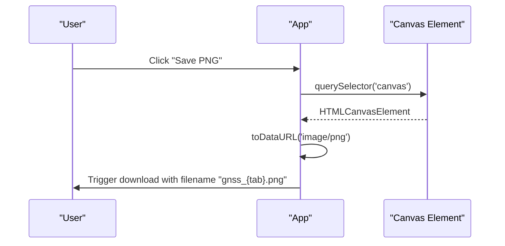
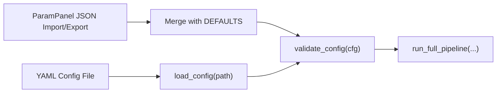
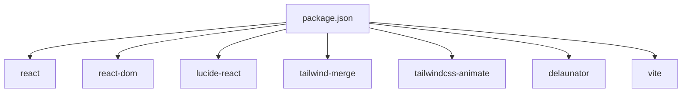

# Interactive Components

<cite>
**Referenced Files in This Document**
- [App.tsx](file://src/pystrain/gnss_strain/gnss_ide/src/App.tsx)
- [ParamPanel.tsx](file://src/pystrain/gnss_strain/gnss_ide/src/components/ParamPanel.tsx)
- [MapViews.tsx](file://src/pystrain/gnss_strain/gnss_ide/src/components/MapViews.tsx)
- [LogPanel.tsx](file://src/pystrain/gnss_strain/gnss_ide/src/components/LogPanel.tsx)
- [StatsBar.tsx](file://src/pystrain/gnss_strain/gnss_ide/src/components/StatsBar.tsx)
- [types.ts](file://src/pystrain/gnss_strain/gnss_ide/src/types.ts)
- [canvasUtils.ts](file://src/pystrain/gnss_strain/gnss_ide/src/canvasUtils.ts)
- [mockEngine.ts](file://src/pystrain/gnss_strain/gnss_ide/src/mockEngine.ts)
- [package.json](file://src/pystrain/gnss_strain/gnss_ide/package.json)
- [vite.config.ts](file://src/pystrain/gnss_strain/gnss_ide/vite.config.ts)
- [tailwind.config.ts](file://src/pystrain/gnss_strain/gnss_ide/tailwind.config.ts)
- [gnss_strain.py](file://src/pystrain/gnss_strain/gnss_strain.py)
- [gnss_strain_app.py](file://src/pystrain/gnss_strain/gnss_strain_app.py)
- [config.py](file://src/pystrain/gnss_strain/config.py)
- [config_default.yaml](file://src/pystrain/gnss_strain/config_default.yaml)
</cite>

## Table of Contents
1. [Introduction](#introduction)
2. [Project Structure](#project-structure)
3. [Core Components](#core-components)
4. [Architecture Overview](#architecture-overview)
5. [Detailed Component Analysis](#detailed-component-analysis)
6. [Dependency Analysis](#dependency-analysis)
7. [Performance Considerations](#performance-considerations)
8. [Troubleshooting Guide](#troubleshooting-guide)
9. [Conclusion](#conclusion)
10. [Appendices](#appendices)

## Introduction
This document describes the interactive components of the PyStrain web IDE, focusing on the sidebar parameter controls, tabbed visualization interface, real-time progress and status reporting, download capabilities, configuration import/export, and user interaction patterns. It also covers state persistence, responsive design, accessibility, and mobile compatibility considerations derived from the frontend implementation.

## Project Structure
The PyStrain web IDE is a React + TypeScript application built with Vite and styled with Tailwind CSS. The frontend is organized into:
- App shell and routing among visualization tabs
- Sidebar parameter panel with collapsible sections and controls
- Canvas-based map views for velocity fields and strain-rate visualizations
- Status bar and log panel for runtime feedback
- Utilities for canvas rendering, projections, and color mapping
- Mock engine for generating synthetic datasets and simulating computation stages

**Diagram sources**
- [App.tsx:1-400](file://src/pystrain/gnss_strain/gnss_ide/src/App.tsx#L1-L400)
- [ParamPanel.tsx:1-493](file://src/pystrain/gnss_strain/gnss_ide/src/components/ParamPanel.tsx#L1-L493)
- [MapViews.tsx:1-319](file://src/pystrain/gnss_strain/gnss_ide/src/components/MapViews.tsx#L1-L319)
- [StatsBar.tsx:1-39](file://src/pystrain/gnss_strain/gnss_ide/src/components/StatsBar.tsx#L1-L39)
- [LogPanel.tsx:1-48](file://src/pystrain/gnss_strain/gnss_ide/src/components/LogPanel.tsx#L1-L48)
- [canvasUtils.ts:1-285](file://src/pystrain/gnss_strain/gnss_ide/src/canvasUtils.ts#L1-L285)
- [mockEngine.ts:1-487](file://src/pystrain/gnss_strain/gnss_ide/src/mockEngine.ts#L1-L487)
- [types.ts:1-89](file://src/pystrain/gnss_strain/gnss_ide/src/types.ts#L1-L89)
- [package.json:1-32](file://src/pystrain/gnss_strain/gnss_ide/package.json#L1-L32)
- [vite.config.ts:1-13](file://src/pystrain/gnss_strain/gnss_ide/vite.config.ts#L1-L13)
- [tailwind.config.ts:1-74](file://src/pystrain/gnss_strain/gnss_ide/tailwind.config.ts#L1-L74)

**Section sources**
- [App.tsx:1-400](file://src/pystrain/gnss_strain/gnss_ide/src/App.tsx#L1-L400)
- [package.json:1-32](file://src/pystrain/gnss_strain/gnss_ide/package.json#L1-L32)
- [vite.config.ts:1-13](file://src/pystrain/gnss_strain/gnss_ide/vite.config.ts#L1-L13)
- [tailwind.config.ts:1-74](file://src/pystrain/gnss_strain/gnss_ide/tailwind.config.ts#L1-L74)

## Core Components
- Sidebar parameter controls:
  - File upload widget for velocity files (.vel/.dat/.txt/.csv)
  - Collapsible sections for Data, Density Control, Triangulation Quality, Outlier Detection, and Smoothing & Uncertainty
  - Parameter widgets: sliders with numeric readout, toggle switches with nested controls, and text inputs
  - Import/export configuration as JSON
  - Run/Reset actions with live progress display
- Tabbed visualization interface:
  - Raw velocity field, Outliers, Clean velocity, Triangulation, Dilatation rate, Maximum shear strain, Principal strain rate, and Run Log
- Real-time progress indicators:
  - Staged progress bar and stage message during runs
  - Live preview updates when parameters change (when data is loaded)
- Status messages and error handling:
  - Log panel with colored highlighting for headers, steps, successes, and warnings
  - Disabled states for controls during computation
- Download functionality:
  - Per-tab PNG export via canvas capture
  - Statistics JSON export
- Configuration import/export:
  - JSON-based parameter export/import in the sidebar
  - Backend YAML configuration loader and validator for CLI/streamlit app

**Section sources**
- [ParamPanel.tsx:130-493](file://src/pystrain/gnss_strain/gnss_ide/src/components/ParamPanel.tsx#L130-L493)
- [App.tsx:18-41](file://src/pystrain/gnss_strain/gnss_ide/src/App.tsx#L18-L41)
- [App.tsx:212-244](file://src/pystrain/gnss_strain/gnss_ide/src/App.tsx#L212-L244)
- [App.tsx:285-311](file://src/pystrain/gnss_strain/gnss_ide/src/App.tsx#L285-L311)
- [LogPanel.tsx:5-48](file://src/pystrain/gnss_strain/gnss_ide/src/components/LogPanel.tsx#L5-L48)
- [MapViews.tsx:18-319](file://src/pystrain/gnss_strain/gnss_ide/src/components/MapViews.tsx#L18-L319)
- [StatsBar.tsx:24-39](file://src/pystrain/gnss_strain/gnss_ide/src/components/StatsBar.tsx#L24-L39)
- [App.tsx:43-50](file://src/pystrain/gnss_strain/gnss_ide/src/App.tsx#L43-L50)
- [ParamPanel.tsx:420-458](file://src/pystrain/gnss_strain/gnss_ide/src/components/ParamPanel.tsx#L420-L458)
- [types.ts:31-89](file://src/pystrain/gnss_strain/gnss_ide/src/types.ts#L31-L89)

## Architecture Overview
The IDE composes a central App component that orchestrates:
- State management for parameters, results, active tab, running status, progress, and stage
- Sidebar parameter panel for editing computation settings and triggering runs
- Visualization tabs backed by canvas-based drawing utilities
- Real-time progress overlay during staged computations
- Log panel and statistics bar for runtime feedback

**Diagram sources**
- [App.tsx:52-127](file://src/pystrain/gnss_strain/gnss_ide/src/App.tsx#L52-L127)
- [ParamPanel.tsx:130-133](file://src/pystrain/gnss_strain/gnss_ide/src/components/ParamPanel.tsx#L130-L133)
- [mockEngine.ts:480-487](file://src/pystrain/gnss_strain/gnss_ide/src/mockEngine.ts#L480-L487)
- [MapViews.tsx:18-319](file://src/pystrain/gnss_strain/gnss_ide/src/components/MapViews.tsx#L18-L319)

## Detailed Component Analysis

### Sidebar Parameter Controls
- File upload:
  - Hidden input triggers programmatic click
  - Accepts .vel/.dat/.txt/.csv
  - On selection, parses and computes preview result
- Sections and widgets:
  - Data: format selector (auto/gmt/globk), output directory text input
  - Density Control: site thinning and max edge length with nested sliders
  - Triangulation Quality: min angle, edge percentile, edge factor
  - Outlier Detection: KNN neighbors, MAD factor, IQR factor, max iterations
  - Smoothing & Uncertainty: smooth weight, smooth iterations, Monte Carlo iterations
- Import/Export:
  - Export JSON of current parameters
  - Import JSON with safe merge over defaults
- Actions:
  - Run Calculation (disabled while running)
  - Reset Defaults
  - Plot (shows raw velocity view when data is loaded)

**Diagram sources**
- [ParamPanel.tsx:164-262](file://src/pystrain/gnss_strain/gnss_ide/src/components/ParamPanel.tsx#L164-L262)
- [ParamPanel.tsx:420-458](file://src/pystrain/gnss_strain/gnss_ide/src/components/ParamPanel.tsx#L420-L458)
- [App.tsx:80-127](file://src/pystrain/gnss_strain/gnss_ide/src/App.tsx#L80-L127)
- [mockEngine.ts:480-487](file://src/pystrain/gnss_strain/gnss_ide/src/mockEngine.ts#L480-L487)

**Section sources**
- [ParamPanel.tsx:130-493](file://src/pystrain/gnss_strain/gnss_ide/src/components/ParamPanel.tsx#L130-L493)
- [App.tsx:80-127](file://src/pystrain/gnss_strain/gnss_ide/src/App.tsx#L80-L127)
- [mockEngine.ts:110-122](file://src/pystrain/gnss_strain/gnss_ide/src/mockEngine.ts#L110-L122)

### Tabbed Visualization Interface
Tabs and their purposes:
- Raw Velocity: velocity arrows with optional outlier markers
- Outliers: outlier sites highlighted
- Clean Velocity: velocity arrows without outliers
- Triangulation: valid/invalid triangles with sites
- Dilatation: diverging color-coded triangle values
- Max Shear: sequential color-coded triangle values
- Principal Strain: crosses indicating e1/e2 axes
- Run Log: formatted log entries

**Diagram sources**
- [App.tsx:314-362](file://src/pystrain/gnss_strain/gnss_ide/src/App.tsx#L314-L362)
- [MapViews.tsx:18-319](file://src/pystrain/gnss_strain/gnss_ide/src/components/MapViews.tsx#L18-L319)

**Section sources**
- [App.tsx:18-28](file://src/pystrain/gnss_strain/gnss_ide/src/App.tsx#L18-L28)
- [App.tsx:212-244](file://src/pystrain/gnss_strain/gnss_ide/src/App.tsx#L212-L244)
- [MapViews.tsx:18-319](file://src/pystrain/gnss_strain/gnss_ide/src/components/MapViews.tsx#L18-L319)

### Real-Time Progress Indicators, Status Messages, and Error Handling
- Progress overlay during runs:
  - Animated spinner, stage text, and progress bar
  - Stages defined as percentage + message pairs
- Status bar:
  - Shows input sites, retained sites, outliers, valid triangles, and ranges
- Log panel:
  - Auto-scrolling list with syntax-aware coloring
  - Highlights headers, steps, successes, and warnings
- Error handling:
  - Disabled states during computation
  - Graceful empty-state and welcome state when no run has occurred

**Diagram sources**
- [App.tsx:95-116](file://src/pystrain/gnss_strain/gnss_ide/src/App.tsx#L95-L116)
- [App.tsx:32-41](file://src/pystrain/gnss_strain/gnss_ide/src/App.tsx#L32-L41)
- [StatsBar.tsx:24-39](file://src/pystrain/gnss_strain/gnss_ide/src/components/StatsBar.tsx#L24-L39)
- [LogPanel.tsx:5-48](file://src/pystrain/gnss_strain/gnss_ide/src/components/LogPanel.tsx#L5-L48)

**Section sources**
- [App.tsx:285-311](file://src/pystrain/gnss_strain/gnss_ide/src/App.tsx#L285-L311)
- [App.tsx:32-41](file://src/pystrain/gnss_strain/gnss_ide/src/App.tsx#L32-L41)
- [StatsBar.tsx:24-39](file://src/pystrain/gnss_strain/gnss_ide/src/components/StatsBar.tsx#L24-L39)
- [LogPanel.tsx:5-48](file://src/pystrain/gnss_strain/gnss_ide/src/components/LogPanel.tsx#L5-L48)

### Download Functionality
- Per-tab PNG export:
  - Floating Save PNG button captures the current view’s canvas and downloads a PNG
- Statistics export:
  - Stats button exports computed statistics as JSON

**Diagram sources**
- [App.tsx:372-392](file://src/pystrain/gnss_strain/gnss_ide/src/App.tsx#L372-L392)

**Section sources**
- [App.tsx:372-392](file://src/pystrain/gnss_strain/gnss_ide/src/App.tsx#L372-L392)
- [App.tsx:178-196](file://src/pystrain/gnss_strain/gnss_ide/src/App.tsx#L178-L196)

### Configuration Import/Export Mechanisms
- Frontend:
  - Export current parameters to JSON
  - Import JSON and merge with defaults
- Backend:
  - YAML configuration loader with deep merge and validation
  - CLI/streamlit apps demonstrate import/export workflows

**Diagram sources**
- [ParamPanel.tsx:420-458](file://src/pystrain/gnss_strain/gnss_ide/src/components/ParamPanel.tsx#L420-L458)
- [config.py:56-90](file://src/pystrain/gnss_strain/config.py#L56-L90)
- [config.py:143-195](file://src/pystrain/gnss_strain/config.py#L143-L195)
- [gnss_strain_app.py:115-154](file://src/pystrain/gnss_strain/gnss_strain_app.py#L115-L154)

**Section sources**
- [ParamPanel.tsx:420-458](file://src/pystrain/gnss_strain/gnss_ide/src/components/ParamPanel.tsx#L420-L458)
- [config.py:56-90](file://src/pystrain/gnss_strain/config.py#L56-L90)
- [config.py:143-195](file://src/pystrain/gnss_strain/config.py#L143-L195)
- [gnss_strain_app.py:115-154](file://src/pystrain/gnss_strain/gnss_strain_app.py#L115-L154)
- [config_default.yaml:1-69](file://src/pystrain/gnss_strain/config_default.yaml#L1-L69)

### User Interaction Patterns, State Persistence, and Responsive Design
- Interaction patterns:
  - Live preview updates parameters immediately when data is loaded
  - Collapsible sections in the sidebar for organized parameter editing
  - Tab switching to navigate between views
  - Floating save button appears when results are ready
- State persistence:
  - Parameters persist in memory; resetting restores defaults
  - Loaded file name persists until reset
  - Active tab selection persists until changed
- Responsive design:
  - Flex-based layout adapts to screen size
  - Canvas drawing scales to device pixel ratio and resizes with ResizeObserver
  - Tailwind utilities provide consistent spacing and typography

**Section sources**
- [App.tsx:68-78](file://src/pystrain/gnss_strain/gnss_ide/src/App.tsx#L68-L78)
- [canvasUtils.ts:9-57](file://src/pystrain/gnss_strain/gnss_ide/src/canvasUtils.ts#L9-L57)
- [tailwind.config.ts:28-71](file://src/pystrain/gnss_strain/gnss_ide/tailwind.config.ts#L28-L71)

### Accessibility, Keyboard Navigation, and Mobile Compatibility
- Accessibility:
  - Semantic focus order follows tab and button interactions
  - Color contrast maintained via theme tokens
- Keyboard navigation:
  - Tabbed interface supports keyboard activation of tabs
  - Buttons use native focus styles and hover states
- Mobile compatibility:
  - Canvas renders at device pixel ratio for crisp visuals
  - Touch-friendly buttons and collapsible sections
  - Responsive layout adapts to smaller screens

**Section sources**
- [App.tsx:212-244](file://src/pystrain/gnss_strain/gnss_ide/src/App.tsx#L212-L244)
- [canvasUtils.ts:81-178](file://src/pystrain/gnss_strain/gnss_ide/src/canvasUtils.ts#L81-L178)

## Dependency Analysis
The frontend depends on:
- React and lucide-react for UI primitives
- Tailwind CSS for styling and animations
- Delaunator for triangulation in the backend pipeline
- Vite for development and build

**Diagram sources**
- [package.json:11-30](file://src/pystrain/gnss_strain/gnss_ide/package.json#L11-L30)

**Section sources**
- [package.json:11-30](file://src/pystrain/gnss_strain/gnss_ide/package.json#L11-L30)

## Performance Considerations
- Canvas rendering:
  - Device pixel ratio scaling prevents blurry output on high-DPI displays
  - ResizeObserver ensures efficient redraws on resize events
- Computation:
  - Mock engine simulates stages with randomized delays for realistic UX
  - Live preview throttled by parameter change frequency
- Memory:
  - Results stored in state; clearing resets references on reset

**Section sources**
- [canvasUtils.ts:81-178](file://src/pystrain/gnss_strain/gnss_ide/src/canvasUtils.ts#L81-L178)
- [App.tsx:95-116](file://src/pystrain/gnss_strain/gnss_ide/src/App.tsx#L95-L116)
- [App.tsx:68-78](file://src/pystrain/gnss_strain/gnss_ide/src/App.tsx#L68-L78)

## Troubleshooting Guide
- No data shown:
  - Ensure a velocity file is imported and parsed
  - Verify format selection matches the file
- Run button disabled:
  - Computation is already in progress
- Unexpected triangulation results:
  - Adjust minimum angle, edge percentile/factor, or enable site thinning
- Download does nothing:
  - Ensure a tab with a canvas is active and results are present

**Section sources**
- [ParamPanel.tsx:164-262](file://src/pystrain/gnss_strain/gnss_ide/src/components/ParamPanel.tsx#L164-L262)
- [App.tsx:285-311](file://src/pystrain/gnss_strain/gnss_ide/src/App.tsx#L285-L311)
- [App.tsx:372-392](file://src/pystrain/gnss_strain/gnss_ide/src/App.tsx#L372-L392)

## Conclusion
The PyStrain web IDE provides an interactive, real-time environment for configuring and visualizing GNSS-derived strain-rate analyses. Its modular React components, canvas-backed rendering, and staged computation model deliver a responsive and accessible user experience suitable for desktop and mobile. The configuration import/export pathways support reproducible workflows and integration with backend tools.

## Appendices
- Backend configuration and pipeline:
  - YAML loader and validator
  - Full pipeline with triangulation, outlier detection, smoothing, and uncertainty estimation

**Section sources**
- [gnss_strain.py:52-81](file://src/pystrain/gnss_strain/gnss_strain.py#L52-L81)
- [config.py:56-90](file://src/pystrain/gnss_strain/config.py#L56-L90)
- [config.py:143-195](file://src/pystrain/gnss_strain/config.py#L143-L195)
- [config_default.yaml:1-69](file://src/pystrain/gnss_strain/config_default.yaml#L1-L69)