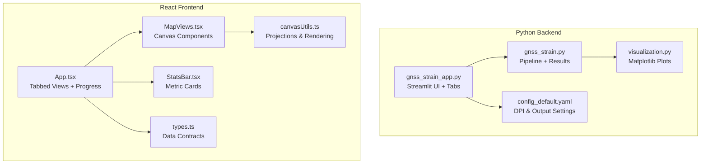
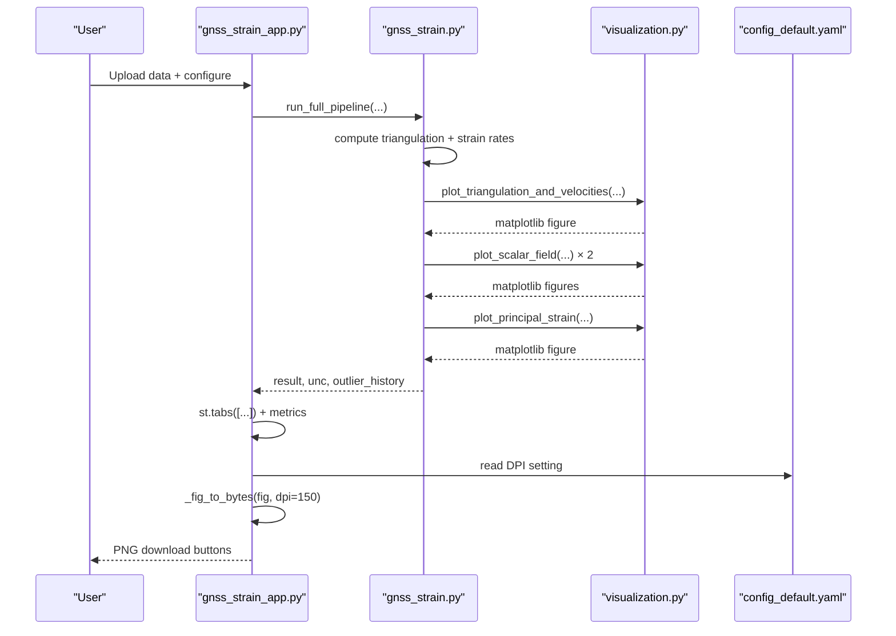
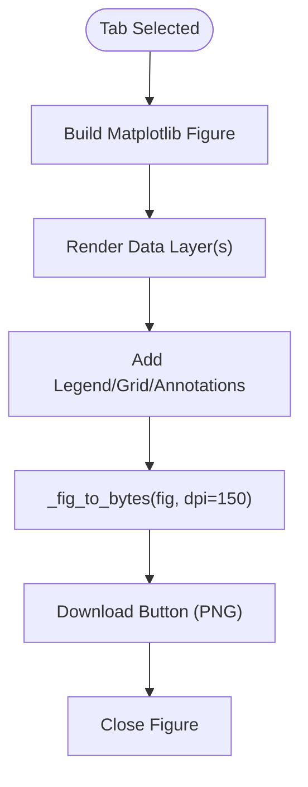
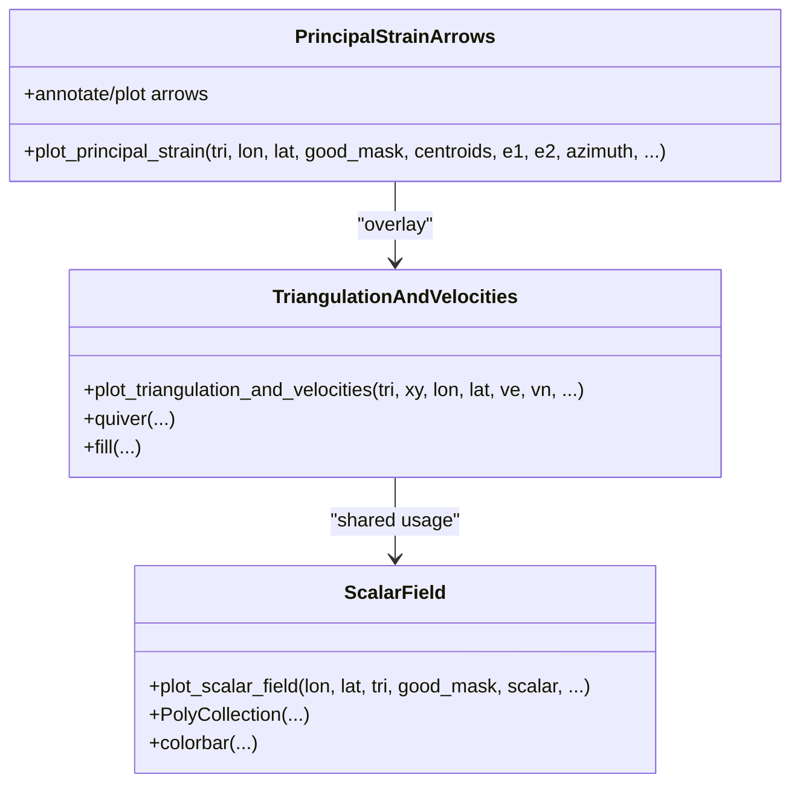
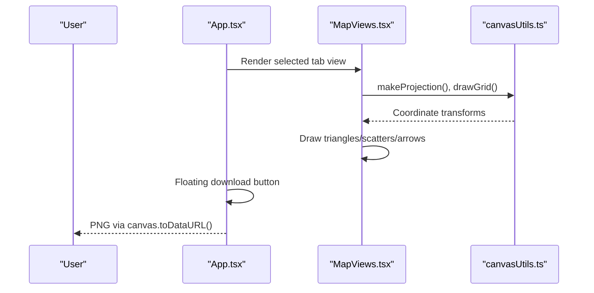
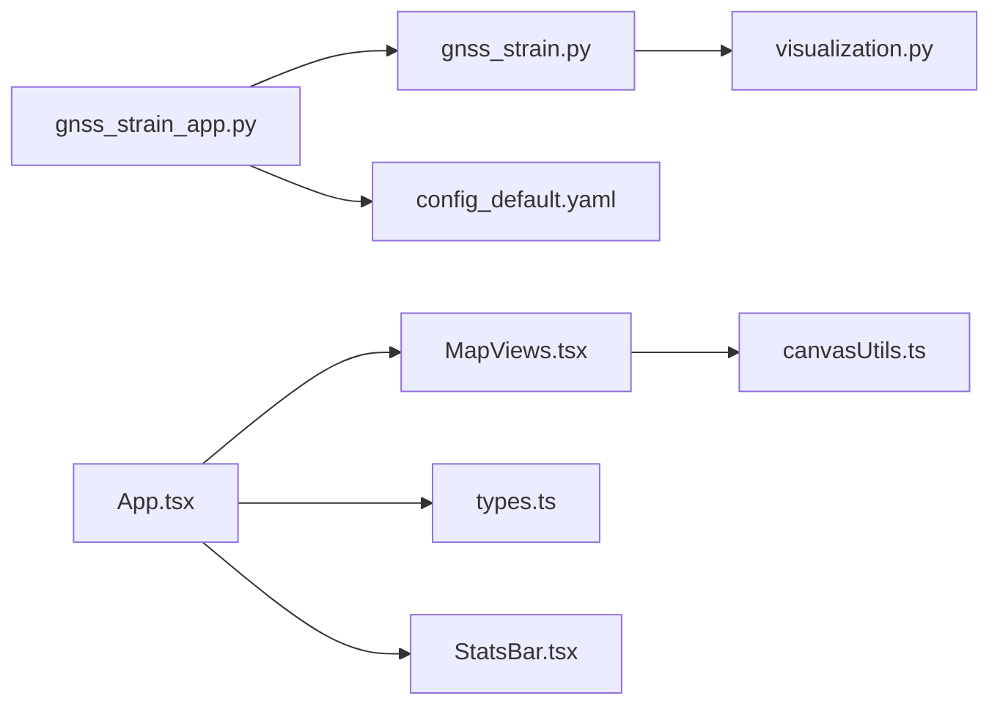

# Visualization Integration

<cite>
**Referenced Files in This Document**
- [gnss_strain_app.py](file://src/pystrain/gnss_strain/gnss_strain_app.py)
- [gnss_strain.py](file://src/pystrain/gnss_strain/gnss_strain.py)
- [visualization.py](file://src/pystrain/gnss_strain/visualization.py)
- [config_default.yaml](file://src/pystrain/gnss_strain/config_default.yaml)
- [MapViews.tsx](file://src/pystrain/gnss_strain/gnss_ide/src/components/MapViews.tsx)
- [canvasUtils.ts](file://src/pystrain/gnss_strain/gnss_ide/src/canvasUtils.ts)
- [App.tsx](file://src/pystrain/gnss_strain/gnss_ide/src/App.tsx)
- [StatsBar.tsx](file://src/pystrain/gnss_strain/gnss_ide/src/components/StatsBar.tsx)
- [types.ts](file://src/pystrain/gnss_strain/gnss_ide/src/types.ts)
</cite>

## Table of Contents
1. [Introduction](#introduction)
2. [Project Structure](#project-structure)
3. [Core Components](#core-components)
4. [Architecture Overview](#architecture-overview)
5. [Detailed Component Analysis](#detailed-component-analysis)
6. [Dependency Analysis](#dependency-analysis)
7. [Performance Considerations](#performance-considerations)
8. [Troubleshooting Guide](#troubleshooting-guide)
9. [Conclusion](#conclusion)

## Introduction
This document explains the visualization integration within the PyStrain web IDE, focusing on the matplotlib-based plotting system integrated with Streamlit for real-time result display. It documents the six visualization tabs and their specific plotting implementations, the figure-to-byte conversion process for PNG downloads, DPI settings, color mapping strategies, legends, grids, and annotations. It also covers metric cards, progress bars, and real-time updates, alongside performance considerations for large datasets and responsive rendering.

## Project Structure
The visualization system spans two complementary frontends:
- Python/Streamlit backend: generates static matplotlib figures and exposes PNG download buttons.
- React/TypeScript frontend: renders interactive canvas-based visualizations with zoom/pan and live previews.

**Diagram sources**
- [gnss_strain_app.py:257-484](file://src/pystrain/gnss_strain/gnss_strain_app.py#L257-L484)
- [gnss_strain.py:26-341](file://src/pystrain/gnss_strain/gnss_strain.py#L26-L341)
- [visualization.py:18-250](file://src/pystrain/gnss_strain/visualization.py#L18-L250)
- [config_default.yaml:64-69](file://src/pystrain/gnss_strain/config_default.yaml#L64-L69)
- [App.tsx:18-396](file://src/pystrain/gnss_strain/gnss_ide/src/App.tsx#L18-L396)
- [MapViews.tsx:1-319](file://src/pystrain/gnss_strain/gnss_ide/src/components/MapViews.tsx#L1-L319)
- [canvasUtils.ts:1-285](file://src/pystrain/gnss_strain/gnss_ide/src/canvasUtils.ts#L1-L285)
- [StatsBar.tsx:1-39](file://src/pystrain/gnss_strain/gnss_ide/src/components/StatsBar.tsx#L1-L39)
- [types.ts:1-89](file://src/pystrain/gnss_strain/gnss_ide/src/types.ts#L1-L89)

**Section sources**
- [gnss_strain_app.py:257-484](file://src/pystrain/gnss_strain/gnss_strain_app.py#L257-L484)
- [gnss_strain.py:26-341](file://src/pystrain/gnss_strain/gnss_strain.py#L26-L341)
- [visualization.py:18-250](file://src/pystrain/gnss_strain/visualization.py#L18-L250)
- [config_default.yaml:64-69](file://src/pystrain/gnss_strain/config_default.yaml#L64-L69)
- [App.tsx:18-396](file://src/pystrain/gnss_strain/gnss_ide/src/App.tsx#L18-L396)
- [MapViews.tsx:1-319](file://src/pystrain/gnss_strain/gnss_ide/src/components/MapViews.tsx#L1-L319)
- [canvasUtils.ts:1-285](file://src/pystrain/gnss_strain/gnss_ide/src/canvasUtils.ts#L1-L285)
- [StatsBar.tsx:1-39](file://src/pystrain/gnss_strain/gnss_ide/src/components/StatsBar.tsx#L1-L39)
- [types.ts:1-89](file://src/pystrain/gnss_strain/gnss_ide/src/types.ts#L1-L89)

## Core Components
- Streamlit tabbed UI with six visualization tabs:
  - Original velocity field
  - Outlier distribution
  - Triangulation overlay
  - Dilatation (scalar field)
  - Maximum shear (scalar field)
  - Principal strain arrows
- Matplotlib-based plotting functions for triangulation + velocities, scalar fields, and principal strain crosses.
- Figure-to-PNG conversion via BytesIO buffer with fixed DPI for consistent quality.
- Metric cards summarizing statistics and progress bar integration for real-time feedback.
- React canvas-based IDE with zoom/pan, live previews, and downloadable PNG exports.

**Section sources**
- [gnss_strain_app.py:273-484](file://src/pystrain/gnss_strain/gnss_strain_app.py#L273-L484)
- [visualization.py:18-250](file://src/pystrain/gnss_strain/visualization.py#L18-L250)
- [config_default.yaml:64-69](file://src/pystrain/gnss_strain/config_default.yaml#L64-L69)
- [StatsBar.tsx:24-38](file://src/pystrain/gnss_strain/gnss_ide/src/components/StatsBar.tsx#L24-L38)
- [MapViews.tsx:1-319](file://src/pystrain/gnss_strain/gnss_ide/src/components/MapViews.tsx#L1-L319)

## Architecture Overview
The visualization pipeline integrates Streamlit and matplotlib for server-side PNG generation and a separate React/Canvas IDE for interactive exploration.

**Diagram sources**
- [gnss_strain_app.py:163-251](file://src/pystrain/gnss_strain/gnss_strain_app.py#L163-L251)
- [gnss_strain.py:281-341](file://src/pystrain/gnss_strain/gnss_strain.py#L281-L341)
- [visualization.py:18-250](file://src/pystrain/gnss_strain/visualization.py#L18-L250)
- [config_default.yaml:64-69](file://src/pystrain/gnss_strain/config_default.yaml#L64-L69)

## Detailed Component Analysis

### Streamlit Matplotlib Tabs
The Streamlit app defines six tabs, each generating a matplotlib figure and offering a PNG download button. The figure-to-byte conversion uses a fixed DPI for consistent quality.

Key behaviors:
- Tab 1: Original velocity field with optional outlier markers.
- Tab 2: Outlier distribution map with scatter points.
- Tab 3: Triangulation overlay with good/bad triangles and velocity vectors.
- Tab 4: Scalar field for dilatation rate with diverging color map and colorbar.
- Tab 5: Scalar field for maximum shear rate with sequential color map and colorbar.
- Tab 6: Principal strain arrows annotated as arrows with compression vs extension coloring.

**Diagram sources**
- [gnss_strain_app.py:288-484](file://src/pystrain/gnss_strain/gnss_strain_app.py#L288-L484)

**Section sources**
- [gnss_strain_app.py:273-484](file://src/pystrain/gnss_strain/gnss_strain_app.py#L273-L484)

### Matplotlib Plot Functions
The backend plotting module encapsulates reusable plotting primitives:

- Triangulation + velocity quiver plot:
  - Draws good triangles in gray, bad triangles in red with dashed edges.
  - Overlays velocity vectors scaled by percentile magnitude; separates outliers in red.
  - Adds a reference arrow and label, sets aspect ratio accounting for latitude, and tight layout.
  - Saves with DPI 150 when requested.

- Scalar field color plots:
  - Builds vertex lists for good triangles and fills with colors mapped by a normalization.
  - Uses diverging or sequential colormaps; adds a colorbar with units.
  - Sets axes limits and aspect ratio; tight layout.

- Principal strain arrows:
  - Renders black solid lines for extension and red dashed lines for compression.
  - Uses azimuth rotation to align arrows with principal directions; automatic scaling by percentile.
  - Includes a legend distinguishing extension/compression.

**Diagram sources**
- [visualization.py:18-250](file://src/pystrain/gnss_strain/visualization.py#L18-L250)

**Section sources**
- [visualization.py:18-250](file://src/pystrain/gnss_strain/visualization.py#L18-L250)

### Figure-to-Byte Conversion and PNG Downloads
The Streamlit app converts figures to PNG bytes using a BytesIO buffer with a fixed DPI and tight bounding box to minimize whitespace. The resulting bytes power download buttons.

Implementation highlights:
- Buffer-based saving with format PNG and DPI 150.
- Seek to beginning and read bytes for immediate download.
- Applies tight layout and DPI to balance quality and file size.

**Section sources**
- [gnss_strain_app.py:282-286](file://src/pystrain/gnss_strain/gnss_strain_app.py#L282-L286)
- [config_default.yaml](file://src/pystrain/gnss_strain/config_default.yaml#L66)

### Color Mapping Strategies, Legends, Grids, and Annotations
- Color maps:
  - Dilatation: diverging colormap centered at zero.
  - Maximum shear: sequential colormap from low to high values.
- Legends:
  - Velocity arrows distinguish outliers vs normal sites.
  - Principal strain arrows distinguish compression vs extension.
- Grids:
  - Matplotlib axes include a light grid with transparency.
  - React canvas views draw geographic grid lines and labels.
- Annotations:
  - Reference arrows and labels in velocity/quiver plots.
  - Arrow annotations for principal strain axes with direction and style.

**Section sources**
- [gnss_strain_app.py:292-303](file://src/pystrain/gnss_strain/gnss_strain_app.py#L292-L303)
- [gnss_strain_app.py:396-398](file://src/pystrain/gnss_strain/gnss_strain_app.py#L396-L398)
- [gnss_strain_app.py:425-427](file://src/pystrain/gnss_strain/gnss_strain_app.py#L425-L427)
- [gnss_strain_app.py:466-473](file://src/pystrain/gnss_strain/gnss_strain_app.py#L466-L473)
- [MapViews.tsx:229-259](file://src/pystrain/gnss_strain/gnss_ide/src/components/MapViews.tsx#L229-L259)
- [MapViews.tsx:202-207](file://src/pystrain/gnss_strain/gnss_ide/src/components/MapViews.tsx#L202-L207)
- [MapViews.tsx:239-253](file://src/pystrain/gnss_strain/gnss_ide/src/components/MapViews.tsx#L239-L253)

### Metric Cards and Progress Bar Integration
- Metrics:
  - Six tabs expose summary metrics (e.g., max/min/mean values, percentiles, averages).
  - Additional summary row displays input sites, used sites, outliers removed, and valid triangles.
- Progress:
  - Streamlit progress bar and status text reflect stage completion during pipeline execution.
  - Callback function receives stage index and message to update UI.

**Section sources**
- [gnss_strain_app.py:385-393](file://src/pystrain/gnss_strain/gnss_strain_app.py#L385-L393)
- [gnss_strain_app.py:415-423](file://src/pystrain/gnss_strain/gnss_strain_app.py#L415-L423)
- [gnss_strain_app.py:486-494](file://src/pystrain/gnss_strain/gnss_strain_app.py#L486-L494)
- [gnss_strain_app.py:208-216](file://src/pystrain/gnss_strain/gnss_strain_app.py#L208-L216)

### React Canvas IDE (Interactive Alternative)
The React IDE complements the Streamlit backend with:
- Canvas-based rendering with device pixel ratio scaling for crisp visuals.
- Zoom/pan controls and live previews on parameter changes.
- Downloadable PNGs via canvas toDataURL.
- Geographic projections and grid overlays.
- Diverging and sequential color mappings for scalar fields.

**Diagram sources**
- [App.tsx:314-396](file://src/pystrain/gnss_strain/gnss_ide/src/App.tsx#L314-L396)
- [MapViews.tsx:1-319](file://src/pystrain/gnss_strain/gnss_ide/src/components/MapViews.tsx#L1-L319)
- [canvasUtils.ts:180-285](file://src/pystrain/gnss_strain/gnss_ide/src/canvasUtils.ts#L180-L285)

**Section sources**
- [App.tsx:314-396](file://src/pystrain/gnss_strain/gnss_ide/src/App.tsx#L314-L396)
- [MapViews.tsx:1-319](file://src/pystrain/gnss_strain/gnss_ide/src/components/MapViews.tsx#L1-L319)
- [canvasUtils.ts:1-285](file://src/pystrain/gnss_strain/gnss_ide/src/canvasUtils.ts#L1-L285)
- [StatsBar.tsx:24-38](file://src/pystrain/gnss_strain/gnss_ide/src/components/StatsBar.tsx#L24-L38)
- [types.ts:54-71](file://src/pystrain/gnss_strain/gnss_ide/src/types.ts#L54-L71)

## Dependency Analysis
The visualization stack exhibits clear separation of concerns:
- Streamlit app depends on the pipeline and plotting utilities to produce static figures.
- React IDE independently computes and renders interactive canvases.
- Both rely on shared data contracts and configuration for consistent behavior.

**Diagram sources**
- [gnss_strain_app.py:257-484](file://src/pystrain/gnss_strain/gnss_strain_app.py#L257-L484)
- [gnss_strain.py:26-341](file://src/pystrain/gnss_strain/gnss_strain.py#L26-L341)
- [visualization.py:18-250](file://src/pystrain/gnss_strain/visualization.py#L18-L250)
- [config_default.yaml:64-69](file://src/pystrain/gnss_strain/config_default.yaml#L64-L69)
- [App.tsx:18-396](file://src/pystrain/gnss_strain/gnss_ide/src/App.tsx#L18-L396)
- [MapViews.tsx:1-319](file://src/pystrain/gnss_strain/gnss_ide/src/components/MapViews.tsx#L1-L319)
- [canvasUtils.ts:1-285](file://src/pystrain/gnss_strain/gnss_ide/src/canvasUtils.ts#L1-L285)
- [StatsBar.tsx:1-39](file://src/pystrain/gnss_strain/gnss_ide/src/components/StatsBar.tsx#L1-L39)
- [types.ts:1-89](file://src/pystrain/gnss_strain/gnss_ide/src/types.ts#L1-L89)

**Section sources**
- [gnss_strain_app.py:257-484](file://src/pystrain/gnss_strain/gnss_strain_app.py#L257-L484)
- [gnss_strain.py:26-341](file://src/pystrain/gnss_strain/gnss_strain.py#L26-L341)
- [visualization.py:18-250](file://src/pystrain/gnss_strain/visualization.py#L18-L250)
- [config_default.yaml:64-69](file://src/pystrain/gnss_strain/config_default.yaml#L64-L69)
- [App.tsx:18-396](file://src/pystrain/gnss_strain/gnss_ide/src/App.tsx#L18-L396)
- [MapViews.tsx:1-319](file://src/pystrain/gnss_strain/gnss_ide/src/components/MapViews.tsx#L1-L319)
- [canvasUtils.ts:1-285](file://src/pystrain/gnss_strain/gnss_ide/src/canvasUtils.ts#L1-L285)
- [StatsBar.tsx:1-39](file://src/pystrain/gnss_strain/gnss_ide/src/components/StatsBar.tsx#L1-L39)
- [types.ts:1-89](file://src/pystrain/gnss_strain/gnss_ide/src/types.ts#L1-L89)

## Performance Considerations
- Matplotlib rendering:
  - Fixed DPI (150) balances quality and file size; adjust via configuration if higher resolution is needed.
  - Tight layout reduces margins; consider disabling for very dense plots.
  - PolyCollection-based scalar fields efficiently render triangle meshes.
- Memory management:
  - Close figures after saving to prevent accumulation in memory.
  - Use BytesIO buffers for in-memory PNG generation to avoid disk I/O.
- Large datasets:
  - Prefer scalar field plots over quiver plots for dense networks to reduce overplotting.
  - Consider downsampling or spatial binning for velocity arrows.
- Responsive rendering:
  - React canvas uses device pixel ratio scaling; ensure containers have defined sizes.
  - Debounce resize handlers to avoid excessive redraws.
- Real-time updates:
  - Streamlit progress bar updates via callback; keep callbacks lightweight.
  - React live preview recomputes on parameter changes; cache intermediate results when feasible.

[No sources needed since this section provides general guidance]

## Troubleshooting Guide
Common issues and resolutions:
- Blank or clipped plots:
  - Verify axis limits and tight layout; ensure DPI and bbox settings are appropriate.
- Incorrect aspect ratios:
  - Confirm latitude-aware aspect calculations for geographic plots.
- Slow downloads:
  - Reduce DPI or disable tight layout temporarily; ensure buffers are properly flushed.
- Canvas artifacts:
  - Ensure device pixel ratio scaling is applied; verify projection parameters.
- Missing legends or colorbars:
  - Confirm colorbar creation and label formatting; verify normalization ranges.

**Section sources**
- [gnss_strain_app.py:282-286](file://src/pystrain/gnss_strain/gnss_strain_app.py#L282-L286)
- [gnss_strain_app.py:98-105](file://src/pystrain/gnss_strain/gnss_strain_app.py#L98-L105)
- [visualization.py:145-146](file://src/pystrain/gnss_strain/visualization.py#L145-L146)
- [canvasUtils.ts:25-43](file://src/pystrain/gnss_strain/gnss_ide/src/canvasUtils.ts#L25-L43)

## Conclusion
The PyStrain visualization integration combines a robust Streamlit/matplotlib pipeline for static, publication-ready figures with a modern React/Canvas IDE for interactive exploration. The six visualization tabs comprehensively cover velocity fields, outlier distributions, triangulation overlays, scalar fields for strain measures, and annotated principal strain arrows. Consistent DPI settings, color mapping strategies, legends, grids, and annotations ensure clarity across diverse datasets. Metrics, progress bars, and real-time updates provide immediate feedback, while performance considerations support efficient handling of large datasets.