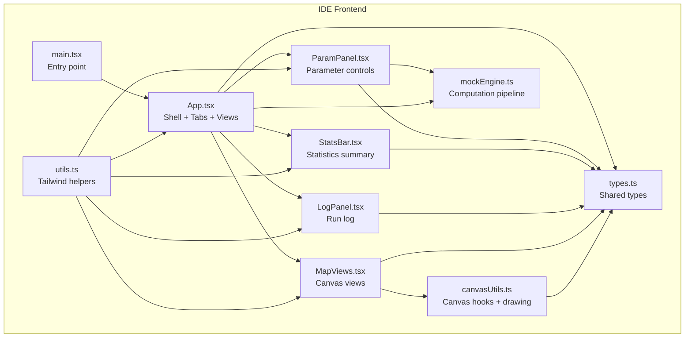
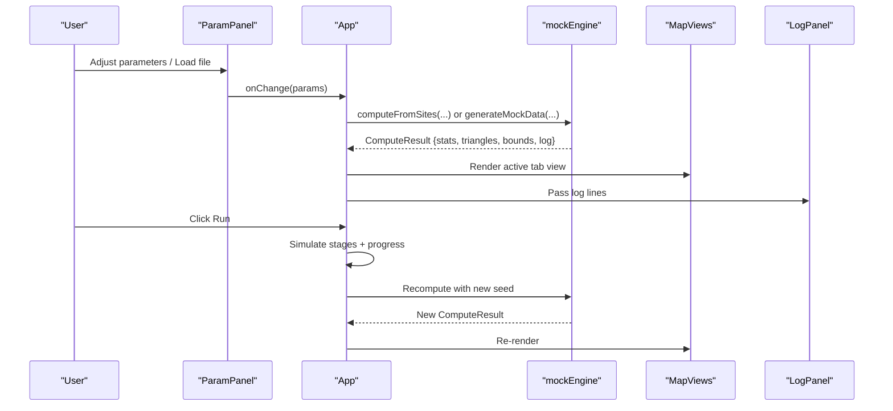
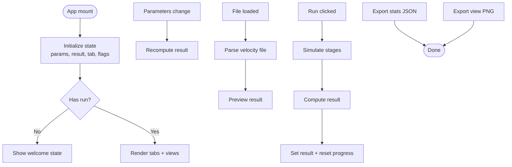
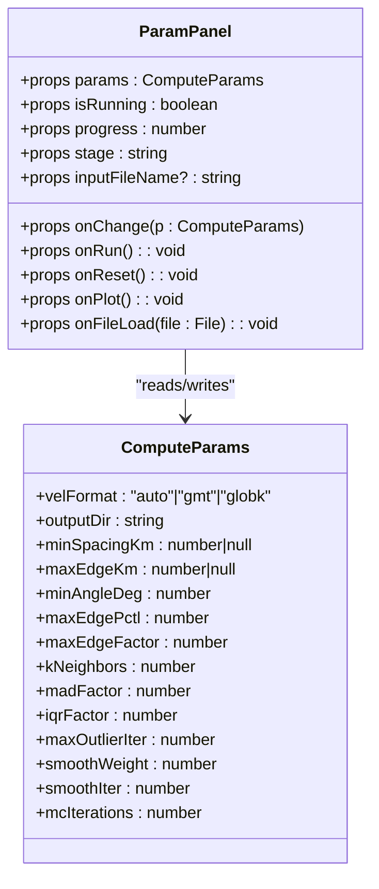
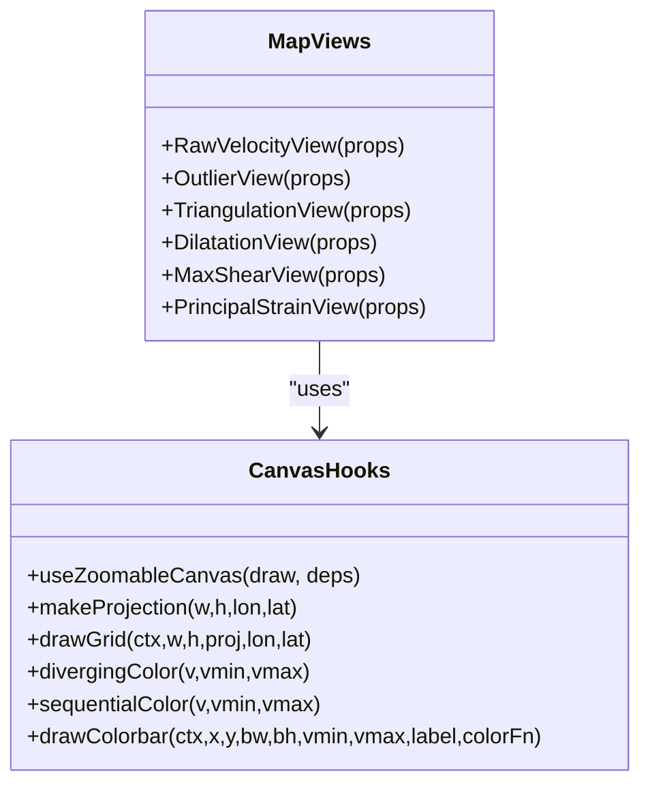
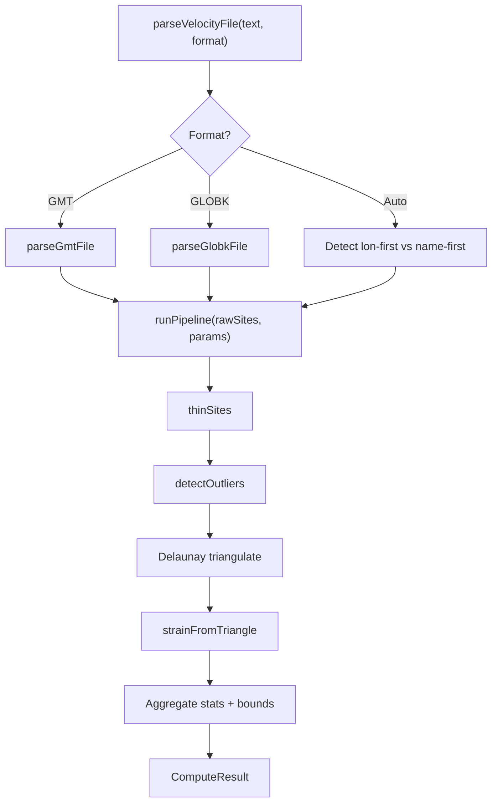
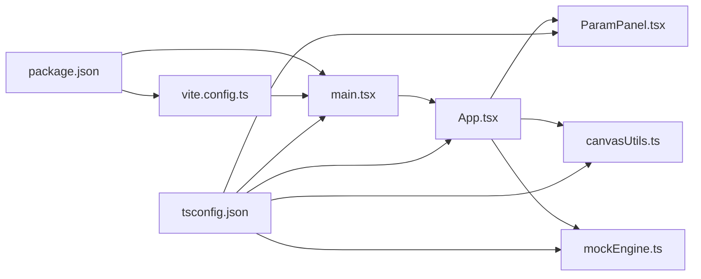

# Web-based IDE

<cite>
**Referenced Files in This Document**
- [package.json](file://src/pystrain/gnss_strain/gnss_ide/package.json)
- [vite.config.ts](file://src/pystrain/gnss_strain/gnss_ide/vite.config.ts)
- [tsconfig.json](file://src/pystrain/gnss_strain/gnss_ide/tsconfig.json)
- [index.html](file://src/pystrain/gnss_strain/gnss_ide/index.html)
- [main.tsx](file://src/pystrain/gnss_strain/gnss_ide/src/main.tsx)
- [App.tsx](file://src/pystrain/gnss_strain/gnss_ide/src/App.tsx)
- [types.ts](file://src/pystrain/gnss_strain/gnss_ide/src/types.ts)
- [utils.ts](file://src/pystrain/gnss_strain/gnss_ide/src/lib/utils.ts)
- [canvasUtils.ts](file://src/pystrain/gnss_strain/gnss_ide/src/canvasUtils.ts)
- [ParamPanel.tsx](file://src/pystrain/gnss_strain/gnss_ide/src/components/ParamPanel.tsx)
- [LogPanel.tsx](file://src/pystrain/gnss_strain/gnss_ide/src/components/LogPanel.tsx)
- [StatsBar.tsx](file://src/pystrain/gnss_strain/gnss_ide/src/components/StatsBar.tsx)
- [MapViews.tsx](file://src/pystrain/gnss_strain/gnss_ide/src/components/MapViews.tsx)
- [mockEngine.ts](file://src/pystrain/gnss_strain/gnss_ide/src/mockEngine.ts)
</cite>

## Table of Contents
1. [Introduction](#introduction)
2. [Project Structure](#project-structure)
3. [Core Components](#core-components)
4. [Architecture Overview](#architecture-overview)
5. [Detailed Component Analysis](#detailed-component-analysis)
6. [Dependency Analysis](#dependency-analysis)
7. [Performance Considerations](#performance-considerations)
8. [Troubleshooting Guide](#troubleshooting-guide)
9. [Conclusion](#conclusion)
10. [Appendices](#appendices)

## Introduction
This document describes the web-based interactive IDE for GNSS strain analysis and visualization built with React and TypeScript. It covers the application architecture, component structure, UI design, and the integration between the frontend and the core computational backend. Interactive features include map visualization, parameter adjustment, real-time result updates, and result export. Guidance is provided for running the IDE locally, development environment setup, build processes, browser compatibility, performance considerations, and extending the IDE with custom components.

## Project Structure
The IDE is organized as a Vite-powered React/TypeScript application with a clear separation of concerns:
- Application bootstrap and routing entry point
- Central application shell managing state, tabs, and views
- Parameter panel for adjusting computation settings
- Statistics bar for quick insight into current results
- Log panel for runtime feedback
- Map views for raw velocity, outliers, triangulation, and strain-rate visualizations
- Canvas utilities for rendering and zoom/pan interactions
- Mock engine implementing the GNSS strain computation pipeline

**Diagram sources**
- [main.tsx:1-11](file://src/pystrain/gnss_strain/gnss_ide/src/main.tsx#L1-L11)
- [App.tsx:1-400](file://src/pystrain/gnss_strain/gnss_ide/src/App.tsx#L1-L400)
- [ParamPanel.tsx:1-493](file://src/pystrain/gnss_strain/gnss_ide/src/components/ParamPanel.tsx#L1-L493)
- [StatsBar.tsx:1-39](file://src/pystrain/gnss_strain/gnss_ide/src/components/StatsBar.tsx#L1-L39)
- [LogPanel.tsx:1-48](file://src/pystrain/gnss_strain/gnss_ide/src/components/LogPanel.tsx#L1-L48)
- [MapViews.tsx:1-319](file://src/pystrain/gnss_strain/gnss_ide/src/components/MapViews.tsx#L1-L319)
- [canvasUtils.ts:1-285](file://src/pystrain/gnss_strain/gnss_ide/src/canvasUtils.ts#L1-L285)
- [mockEngine.ts:1-487](file://src/pystrain/gnss_strain/gnss_ide/src/mockEngine.ts#L1-L487)
- [types.ts:1-89](file://src/pystrain/gnss_strain/gnss_ide/src/types.ts#L1-L89)
- [utils.ts:1-7](file://src/pystrain/gnss_strain/gnss_ide/src/lib/utils.ts#L1-L7)

**Section sources**
- [package.json:1-32](file://src/pystrain/gnss_strain/gnss_ide/package.json#L1-L32)
- [vite.config.ts:1-13](file://src/pystrain/gnss_strain/gnss_ide/vite.config.ts#L1-L13)
- [tsconfig.json:1-5](file://src/pystrain/gnss_strain/gnss_ide/tsconfig.json#L1-L5)
- [index.html:1-13](file://src/pystrain/gnss_strain/gnss_ide/index.html#L1-L13)
- [main.tsx:1-11](file://src/pystrain/gnss_strain/gnss_ide/src/main.tsx#L1-L11)

## Core Components
- App shell orchestrates state, tabs, and view rendering; manages live preview, run stages, and result export.
- ParamPanel provides collapsible sections for data import, density control, triangulation quality, outlier detection, and smoothing/uncertainty parameters; supports import/export of configuration and live-run triggers.
- StatsBar displays key metrics derived from the latest computation result.
- LogPanel renders the computation log with color-coded semantics and auto-scroll.
- MapViews encapsulate canvas-based visualizations for raw velocity, outliers, triangulation, dilatation, max shear, and principal strain.
- canvasUtils provides reusable hooks for responsive canvas rendering and zoom/pan interactions.
- mockEngine implements the GNSS strain computation pipeline including file parsing, spatial thinning, outlier detection, Delaunay triangulation, strain tensor computation, and statistics aggregation.

**Section sources**
- [App.tsx:1-400](file://src/pystrain/gnss_strain/gnss_ide/src/App.tsx#L1-L400)
- [ParamPanel.tsx:1-493](file://src/pystrain/gnss_strain/gnss_ide/src/components/ParamPanel.tsx#L1-L493)
- [StatsBar.tsx:1-39](file://src/pystrain/gnss_strain/gnss_ide/src/components/StatsBar.tsx#L1-L39)
- [LogPanel.tsx:1-48](file://src/pystrain/gnss_strain/gnss_ide/src/components/LogPanel.tsx#L1-L48)
- [MapViews.tsx:1-319](file://src/pystrain/gnss_strain/gnss_ide/src/components/MapViews.tsx#L1-L319)
- [canvasUtils.ts:1-285](file://src/pystrain/gnss_strain/gnss_ide/src/canvasUtils.ts#L1-L285)
- [mockEngine.ts:1-487](file://src/pystrain/gnss_strain/gnss_ide/src/mockEngine.ts#L1-L487)
- [types.ts:1-89](file://src/pystrain/gnss_strain/gnss_ide/src/types.ts#L1-L89)

## Architecture Overview
The IDE follows a reactive architecture:
- State is centralized in App, including parameters, results, active tab, and run progress.
- ParamPanel updates parameters, triggering live previews via effect-driven recomputation.
- MapViews consume ComputeResult and render via canvas with zoom/pan support.
- mockEngine computes results from either loaded files or synthetic data; logs are propagated to LogPanel.
- Export features include PNG snapshots of canvases and JSON statistics.

**Diagram sources**
- [App.tsx:68-126](file://src/pystrain/gnss_strain/gnss_ide/src/App.tsx#L68-L126)
- [ParamPanel.tsx:130-177](file://src/pystrain/gnss_strain/gnss_ide/src/components/ParamPanel.tsx#L130-L177)
- [mockEngine.ts:480-486](file://src/pystrain/gnss_strain/gnss_ide/src/mockEngine.ts#L480-L486)
- [MapViews.tsx:1-319](file://src/pystrain/gnss_strain/gnss_ide/src/components/MapViews.tsx#L1-L319)
- [LogPanel.tsx:1-48](file://src/pystrain/gnss_strain/gnss_ide/src/components/LogPanel.tsx#L1-L48)

## Detailed Component Analysis

### App Shell and State Management
- Manages parameters, results, active tab, running state, progress, stage message, and input file.
- Implements live preview by recomputing results when parameters change after first run.
- Supports loading real velocity files, parsing into GNSS sites, and immediate preview.
- Provides run simulation with staged progress and completion.
- Exports statistics as JSON and individual view as PNG.

**Diagram sources**
- [App.tsx:52-126](file://src/pystrain/gnss_strain/gnss_ide/src/App.tsx#L52-L126)

**Section sources**
- [App.tsx:52-126](file://src/pystrain/gnss_strain/gnss_ide/src/App.tsx#L52-L126)

### Parameter Panel (ParamPanel)
- Collapsible sections for data import, density control, triangulation quality, outlier detection, and smoothing/uncertainty.
- Provides sliders, toggles, and numeric inputs bound to ComputeParams.
- Supports importing/exporting configuration JSON and resetting to defaults.
- Integrates with file input to load real velocity files and trigger plotting.

**Diagram sources**
- [ParamPanel.tsx:11-22](file://src/pystrain/gnss_strain/gnss_ide/src/components/ParamPanel.tsx#L11-L22)
- [types.ts:31-52](file://src/pystrain/gnss_strain/gnss_ide/src/types.ts#L31-L52)

**Section sources**
- [ParamPanel.tsx:130-493](file://src/pystrain/gnss_strain/gnss_ide/src/components/ParamPanel.tsx#L130-L493)
- [types.ts:31-89](file://src/pystrain/gnss_strain/gnss_ide/src/types.ts#L31-L89)

### Statistics Bar (StatsBar)
- Displays input sites, retained sites, outliers, retention percentage, valid triangles, dilatation range, and max shear.
- Uses monospaced typography for numerical clarity.

**Section sources**
- [StatsBar.tsx:24-39](file://src/pystrain/gnss_strain/gnss_ide/src/components/StatsBar.tsx#L24-L39)
- [types.ts:54-71](file://src/pystrain/gnss_strain/gnss_ide/src/types.ts#L54-L71)

### Log Panel (LogPanel)
- Renders computation log lines with semantic coloring and auto-scroll to latest.
- Handles empty state and preserves readability with monospace font.

**Section sources**
- [LogPanel.tsx:5-48](file://src/pystrain/gnss_strain/gnss_ide/src/components/LogPanel.tsx#L5-L48)

### Map Views (MapViews)
- RawVelocityView: draws velocity arrows with optional outlier highlighting and auto-scaling; includes legend and scale bar.
- OutlierView: highlights outliers against cleaned sites.
- TriangulationView: overlays triangles with quality indicators and site markers.
- DilatationView: colored triangles representing dilatation values with diverging color scheme and colorbar.
- MaxShearView: colored triangles for max shear with custom sequential colorbar.
- PrincipalStrainView: draws principal strain axes (compression vs extension) with labeled legend.

**Diagram sources**
- [MapViews.tsx:1-319](file://src/pystrain/gnss_strain/gnss_ide/src/components/MapViews.tsx#L1-L319)
- [canvasUtils.ts:9-178](file://src/pystrain/gnss_strain/gnss_ide/src/canvasUtils.ts#L9-L178)

**Section sources**
- [MapViews.tsx:18-319](file://src/pystrain/gnss_strain/gnss_ide/src/components/MapViews.tsx#L18-L319)
- [canvasUtils.ts:180-285](file://src/pystrain/gnss_strain/gnss_ide/src/canvasUtils.ts#L180-L285)

### Canvas Utilities (canvasUtils)
- useCanvas/useZoomableCanvas: resize-optimized canvas rendering with device pixel ratio handling and optional viewport transform.
- Projection utilities: geographic to canvas coordinate mapping with margins.
- Colormaps: diverging and sequential palettes for visualization.
- Grid and colorbar drawing helpers.

**Section sources**
- [canvasUtils.ts:9-178](file://src/pystrain/gnss_strain/gnss_ide/src/canvasUtils.ts#L9-L178)
- [canvasUtils.ts:180-285](file://src/pystrain/gnss_strain/gnss_ide/src/canvasUtils.ts#L180-L285)

### Types and Shared Contracts (types)
- Defines GnssSite, StrainTriangle, DataBounds, ComputeParams, ComputeResult, and DEFAULT_PARAMS.
- Ensures type safety across components and the computation engine.

**Section sources**
- [types.ts:1-89](file://src/pystrain/gnss_strain/gnss_ide/src/types.ts#L1-L89)

### Computation Engine (mockEngine)
- Parses GMT 8-column and GLOBK 13-column velocity files, auto-detecting formats.
- Implements spatial thinning, MAD-based outlier detection, Delaunay triangulation with quality filtering, and analytic strain tensor computation.
- Aggregates statistics and produces a structured ComputeResult including bounds, triangles, and log entries.
- Generates synthetic mock data for demonstration when no file is loaded.

**Diagram sources**
- [mockEngine.ts:110-122](file://src/pystrain/gnss_strain/gnss_ide/src/mockEngine.ts#L110-L122)
- [mockEngine.ts:437-473](file://src/pystrain/gnss_strain/gnss_ide/src/mockEngine.ts#L437-L473)
- [mockEngine.ts:338-428](file://src/pystrain/gnss_strain/gnss_ide/src/mockEngine.ts#L338-L428)

**Section sources**
- [mockEngine.ts:22-122](file://src/pystrain/gnss_strain/gnss_ide/src/mockEngine.ts#L22-L122)
- [mockEngine.ts:166-183](file://src/pystrain/gnss_strain/gnss_ide/src/mockEngine.ts#L166-L183)
- [mockEngine.ts:185-193](file://src/pystrain/gnss_strain/gnss_ide/src/mockEngine.ts#L185-L193)
- [mockEngine.ts:218-262](file://src/pystrain/gnss_strain/gnss_ide/src/mockEngine.ts#L218-L262)
- [mockEngine.ts:266-334](file://src/pystrain/gnss_strain/gnss_ide/src/mockEngine.ts#L266-L334)
- [mockEngine.ts:338-428](file://src/pystrain/gnss_strain/gnss_ide/src/mockEngine.ts#L338-L428)
- [mockEngine.ts:437-486](file://src/pystrain/gnss_strain/gnss_ide/src/mockEngine.ts#L437-L486)

## Dependency Analysis
- Build and toolchain: Vite with React plugin, TypeScript, Tailwind CSS, PostCSS, autoprefixer.
- Runtime dependencies: React, React DOM, lucide-react for icons, class variance authority and clsx/tailwind merge for class composition, delaunator for triangulation.
- Aliasing: @ resolves to src for cleaner imports.

**Diagram sources**
- [package.json:1-32](file://src/pystrain/gnss_strain/gnss_ide/package.json#L1-L32)
- [vite.config.ts:1-13](file://src/pystrain/gnss_strain/gnss_ide/vite.config.ts#L1-L13)
- [tsconfig.json:1-5](file://src/pystrain/gnss_strain/gnss_ide/tsconfig.json#L1-L5)
- [main.tsx:1-11](file://src/pystrain/gnss_strain/gnss_ide/src/main.tsx#L1-L11)
- [App.tsx:1-400](file://src/pystrain/gnss_strain/gnss_ide/src/App.tsx#L1-L400)
- [ParamPanel.tsx:1-493](file://src/pystrain/gnss_strain/gnss_ide/src/components/ParamPanel.tsx#L1-L493)
- [canvasUtils.ts:1-285](file://src/pystrain/gnss_strain/gnss_ide/src/canvasUtils.ts#L1-L285)
- [mockEngine.ts:1-487](file://src/pystrain/gnss_strain/gnss_ide/src/mockEngine.ts#L1-L487)

**Section sources**
- [package.json:1-32](file://src/pystrain/gnss_strain/gnss_ide/package.json#L1-L32)
- [vite.config.ts:1-13](file://src/pystrain/gnss_strain/gnss_ide/vite.config.ts#L1-L13)
- [tsconfig.json:1-5](file://src/pystrain/gnss_strain/gnss_ide/tsconfig.json#L1-L5)

## Performance Considerations
- Canvas rendering:
  - Device pixel ratio scaling prevents blurry rendering on high-DPI displays.
  - ResizeObserver ensures efficient redraws on container size changes.
  - useZoomableCanvas applies viewport transforms before drawing to maintain crisp visuals during zoom/pan.
- Computation:
  - Live preview uses a stable seed for consistent layouts; explicit runs use fresh seeds for variability.
  - Outlier detection and triangulation thresholds are adjustable to balance accuracy and speed.
  - Spatial thinning reduces dataset size for faster processing.
- UI responsiveness:
  - Staged progress simulation provides perceived responsiveness during long computations.
  - Collapsible panels reduce layout thrashing by hiding inactive sections.

[No sources needed since this section provides general guidance]

## Troubleshooting Guide
- Canvas appears blurry on high-DPI screens:
  - Ensure device pixel ratio scaling is applied and canvas backing buffer matches CSS size.
- View does not update after changing parameters:
  - Verify live preview effect triggers recomputation and that hasRun flag is set after initial run.
- File import fails:
  - Confirm supported extensions and format selection; check console for parsing errors.
- Export PNG missing:
  - Ensure an active view with a canvas exists and that the view container reference is set.

**Section sources**
- [canvasUtils.ts:9-57](file://src/pystrain/gnss_strain/gnss_ide/src/canvasUtils.ts#L9-L57)
- [App.tsx:68-78](file://src/pystrain/gnss_strain/gnss_ide/src/App.tsx#L68-L78)
- [ParamPanel.tsx:166-177](file://src/pystrain/gnss_strain/gnss_ide/src/components/ParamPanel.tsx#L166-L177)

## Conclusion
The web IDE provides a modular, interactive environment for GNSS strain analysis with a focus on usability and visual clarity. Its React/TypeScript foundation, robust canvas rendering utilities, and a well-defined computation pipeline enable rapid iteration and extensibility. Users can adjust parameters in real time, inspect intermediate steps via tabs, and export results for downstream use.

[No sources needed since this section summarizes without analyzing specific files]

## Appendices

### Setup and Development
- Install dependencies:
  - Use the package manager configured by your environment to install dependencies declared in the project’s package manifest.
- Run in development:
  - Start the Vite dev server to serve the app locally with hot module replacement.
- Build for production:
  - Compile TypeScript and bundle assets using the provided build script.
- Preview production build:
  - Serve the built assets locally to validate deployment readiness.

**Section sources**
- [package.json:6-10](file://src/pystrain/gnss_strain/gnss_ide/package.json#L6-L10)
- [vite.config.ts:5-12](file://src/pystrain/gnss_strain/gnss_ide/vite.config.ts#L5-L12)

### Browser Compatibility and UX
- Modern browsers with ES2020+ support and Canvas APIs are recommended.
- Tailwind CSS utilities and CSS variables provide consistent theming across components.
- Focus on accessibility: ensure sufficient contrast, keyboard navigable controls, and readable monospace fonts for logs and stats.

[No sources needed since this section provides general guidance]

### Extending the IDE
- Add new tabs:
  - Define a new view component similar to existing MapViews and register it in the tab list within the App shell.
- Integrate additional analysis:
  - Extend the computation pipeline in the engine to produce new fields in ComputeResult and visualize them in a dedicated view.
- Customize styling:
  - Leverage Tailwind classes and CSS variables to align new UI elements with the existing theme.

[No sources needed since this section provides general guidance]